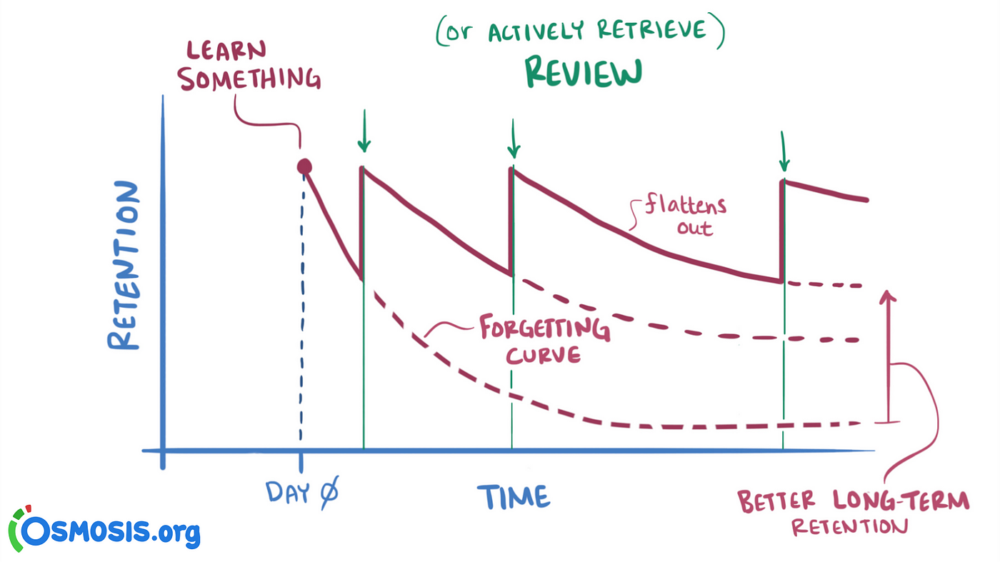

# Come si studia?

Finalmente sei entrato/a all'università, ma non hai idea di come si studia? Non preoccuparti, è normale, nessuno ci ha mai insegnato come si fa. In questa guida cercheremo di darti qualche consiglio su come affrontare al meglio i tuoi studi.

## Disclaimer 
Prima di iniziare, tieni presente che ognuno ha il proprio metodo di studio e che non esiste un metodo universale che funzioni per tutti. Quindi, non scoraggiarti se non trovi subito il metodo che fa per te. Prova, sperimenta e adatta i consigli che trovi qui a te stesso/a. 
Inoltre qui non troverai consigli su come passare gli esami facendo il minimo sforzo, ma solo consigli su come studiare in modo efficace. Ricorda che l'università è un percorso di crescita personale, non solo un modo per ottenere un pezzo di carta. Affrontarla con il giusto approccio è il primo passo per avere successo. Nessuno ti obbliga a studiare e a frequentare l'università, quindi fallo solo se è quello che vuoi fare davvero.
Detto questo, stai nel chill, anche io non seguo sempre tutte le tecniche migliori e qualche esame ho dovuto prepararlo all'ultimo, ma non è il caso di fare di questa prassi un'abitudine.

## Alcune fonti consigliate:
Su internet troverai centinaia di video su come studiare, molti passano metà video a flexare lauree da 110 e lode, altri sono letterlmente delle truffe per i loro corsi. Personalmente dopo averne consulato un'infinità, mi sento di consigliarti questi canali """"Autorevoli"""" che trattano l'argomento andando dritti al punto:
- [Ali Abdaal](https://www.youtube.com/watch?v=Z-zNHHpXoMM&list=PL7BImOT2srcGCCjBBwNvU5zaB9F30lWye&ab_channel=AliAbdaal): Canale in inglese di uno studente di medicina di Cambridge che ha creato una serie di video su come studiare in modo efficace, basandosi su studi scientifici. Consiglio assolutamente i due video "How to Study for Exams - Evidence Based Revision Tips" [parte1](https://www.youtube.com/watch?v=ukLnPbIffxE&list=PL7BImOT2srcGCCjBBwNvU5zaB9F30lWye&index=5&ab_channel=AliAbdaal) e [parte2](https://www.youtube.com/watch?v=Z-zNHHpXoMM&list=PL7BImOT2srcGCCjBBwNvU5zaB9F30lWye&ab_channel=AliAbdaal)
- [Alessandro De Concini](https://www.youtube.com/watch?v=3FvXpqJEvvM&list=PLonYEgYBv1Ic1QptGuC-hjQ0DzmYQDyRx&ab_channel=AlessandrodeConcini-ADC): Canale di riferimento in italiano di un esperto dell'apprendimento. Acuni video sono inutili e/o prolissi, ma è considerato il migliore in Italia. Offre anche un corso a pagamento che non ho mai provato, ma che non è fuffa come quelli di "metodo universitario" e simili.

canale bonus:
- [Enkk](https://www.youtube.com/@enkk): Il buon Enkk (Enrico Mensa) è un dotorando presso il nostro dipartimento di informatica, ma anche streamer e youtuber, seppur il suo main content riguarda tutt'altro, ultimamente sta facendo coinciliare le sue due vite e porta sempre più contenuti interessantissimi sul mondo informatico. In questo [estratto di live](https://www.youtube.com/watch?v=aBZX3jtFDF0&ab_channel=ModificatiTV) racconta la sua esperienza universitaria e come ha affrontato gli studi. Molto utile per ascoltare l'esperienza di qualcuno che c'è già passato.

## I due pilastri dei metodi di studio
#### Active Recall
L'active recall è il processo di richiamare informazioni dalla memoria invece di rileggerle passivamente. Infatti è stato dimostrato che il nostro cervello tende a rafforzare le conessioni quando ci sforziamo di ricordare qualcosa. 
Per fare active recall puoi utilizzare diverse tecniche:
- **Flashcards**: Le flashcards sono dei bigliettini con una domanda da una parte e la risposta dall'altra. Puoi utilizzare app come [Anki](https://apps.ankiweb.net/) per creare/studiare/condividere le tue flashcards.
- **Riassunti**: Scrivere riassunti è un buon modo per fare active recall. Attenzione a NON copiare testualmente le slide o il libro, altrimenti il lavoro diventerà passivo. Sforzati di spiegare con le tue parole facendo anche colllegamenti a tua conoscenze o altre materie.
- **Schemi e Mappe Concettuali**: Creare schemi e mappe concettuali ti aiuta a visualizzare le connessioni tra gli argomenti.
- **Spiegare a qualcuno**: Spiegare un argomento a voce alta o a qualcuno è un ottimo modo per fare active recall e allenarsi nell'esposizione orale, Attenzione a non ripetere a pappagallo, ma a spiegare con parole tue. Secondo la tecnica di Feynman, se non riesci a spiegare un concetto con parole semplici, vuol dire che non lo hai capito bene.
#### Spaced Repetition
Lo spaced repetition consiste nel ripetere le informazioni a intervalli regolari. Questo permette il passaggio delle informazioni dalla memoria a breve termine a quella a lungo termine.

In combinazione con l'active recall, lo spaced repetition è uno dei metodi più efficaci per memorizzare informazioni a lungo termine. Un esempio ideale potrebbe essere: seguire una lezione, prendere appunti e il prima possibile, durante la giornata, provare a scrivere uno schema o un riassunto dell'argomento trattato, segnando tutto quello che ci si ricorda, poi completare con le parti mancanti. Infine, ripetere l'argomento dopo un giorno, una settimana, un mese e così via.

Può sembrare inutilmente complesso, ma in realtà è molto più efficiente e con un po' di pratica risulterà molto più veloce di leggere, evidenziare e rileggere. Tuttavia è molto più faticoso, lo sforzo attivo richiede più energia, ed è giusto così, se non ti stai sforzando, probabilmente non stai studiando davvero. Ma non preoccuparti, siamo umani, non possiamo essere sempre al massimo, quindi non scoraggiarti se non riesci a seguire sempre tutti i consigli alla lettera in modo ottimale, queste sono solo delle linee guida, non delle regole ferree.

## Tecniche di Studio aggiuntive
#### Tecnica del pomodoro
La tecnica del [pomodoro](https://www.pomodorotechnique.com/) è una tecnica di gestione del tempo che prevede di organizzare lo studio in piccoli task da 25 minuti e poi fare una pausa di 5 minuti. Dopo 4 pomodori, cioè 4 sessioni di 25 minuti, si fa una pausa più lunga di 15-30 minuti. Questo metodo è molto efficace per mantenere alta la concentrazione, con un focus mirato su piccoli task permette di mantenere sempre alta l'efficienza. Infatti se si studiasse per ore senza pause, la concentrazione calerebbe e pur dedicando le stesse ore di studio, si otterrebbe un risultato peggiore.
Non è necessario usare finestre di tempo 25/5, è molto famosa anche la forma 50/10. In generale puoi trovare il tuo equilibrio cercando di capire dopo quando tempo hai un calo di concentrazione.

### Palazzo della memoria
Il [palazzo della memoria](https://blog.andreamuzii.it/palazzo-della-memoria-esempi-pratici/) è una tecnica di memorizzazione che sfrutta la capacità del nostro cervello di ricordare meglio le immagini e le configurazioni spaziali rispetto alle parole. Va usata esclusiavemnte per ricordare informazioni di tipo mnemonico (come liste ed elenchi). L'idea è di creare un percorso mentale, ad esempio la tua casa o la tua stanza, e associare ad ogni luogo un concetto da memorizzare attraverso una storia. Più la storia è assurda e legata a una tua esperienza personale o reazione emotiva e più sarà facile da ricordare. È una tecnica di memorizzazione molto potente, utilizzata anche dagli esperti di gare di memoria come Andrea Muzii, campione mondiale di memoria.
Può risultare abbastanza difficile all'inizio e soprattuto può sembrare di dover ricordare più cose di quante ne si debbano memorizzare, ma con un po' di pratica diventerà molto più semplice e vi accorgerete che una volta inventata la storia, sarà molto più difficile dimenticare le informazioni.

## Altri Consigli banali di carattere generale
- **Prendi appunti**: Non importa se le slide hanno tutto, se ci sono le video registrazioni, prendere appunti è importante perchè ti fa manetenere attivo e concentrato durante la lezione.
- **Studia volta per volta**: Non aspettare all'ultimo studia un po' ogni giorno, man mano che i corsi proseguono. Evita di ritrovarti a dover studiare tutto il programma la notte prima dell'esame.
- **Fai domande**: Se qualcosa non ti è chiaro, chiedi. Non avere paura di fare domande stupide, è meglio chiarire subito i dubbi che non capire un argomento.
- **Inizia i progetti**: Se hai progetti da fare, inizia a lavorarci il prima possibile. Non aspettare all'ultimo, perchè i progetti richiedono tempo, se pensi di poterlo fare in una settimana, considera almeno due. Gli imprevisti sono sempre dietro l'angolo.
- **Organizza lo studio**: Organizza il tuo studio in modo da costringerti a dedicare del tempo per studiare, puoi utilizzare banalmente google calendar o app come [Notion](https://www.notion.so/product). Ma bastano anche un foglio e una penna.
- **Evita distrazioni**: Oggigiorno è sempre più difficile trovare un momento di tranquillità senza distrazioni. La soluzione ottimale sarebbe di sbriciolare in atomi il tuo cellulare, ma in alternativa puoi utilizzare una semplice app per bloccare lo smartphone come [Forest](https://forestapp.cc/).
- **Fate gli esercizi...  gli esercizi...** ~semicit