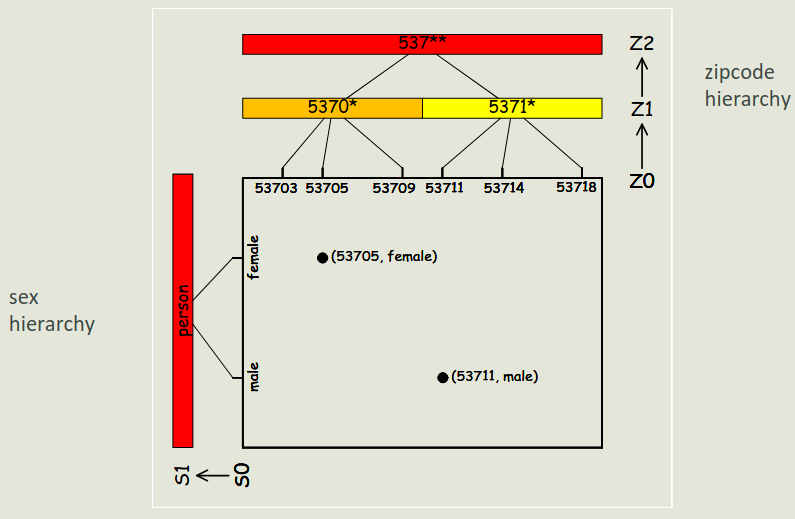
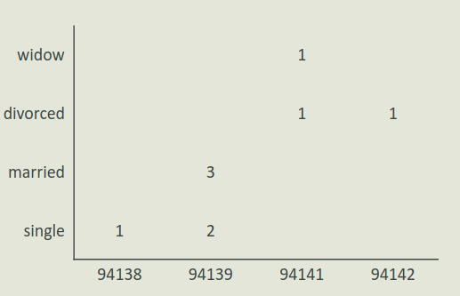
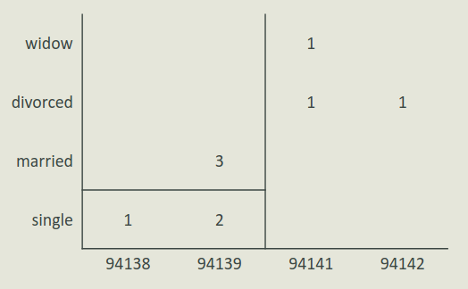

# Etica, Società e Privacy - Privacy - Parte IV - Esercizi

## Anonimizzazione

### Esempio 1 - $k$-anonymity

- Tabella originale:
    - $2$-anonima se si considera il sesso, $1$-anonima altrimenti.

| Birthdate | Sex | Zipcode |
|-----------|-----|---------|
| 21/1/79   | M   | 53175   |
| 10/1/79   | F   | 55410   |
| 1/10/44   | F   | 90210   |
| 21/2/83   | M   | 02274   |
| 19/4/82   | M   | 02237   |

- Tabella $2$-anonima:
    - La tupla outlier (su $Birthdate$ e $Zipcode$) viene soppressa.

|            | Birthdate | Sex    | Zipcode |
|------------|-----------|--------|---------|
| Group 1    | xx/1/79   | Person | 5xxxx   |
| Group 1    | xx/1/79   | Person | 5xxxx   |
| Suppressed | 1/10/44   | F      | 90210   |
| Group 2    | xx/xx/8x  | Male   | 022xx   |
| Group 2    | xx/xx/8x  | Male   | 022xx   |

### Esempio 2 - Algoritmo Incognito

- Si anonimizza la tabella privata con $k = 2$ ($2$-anonymity) con l'algoritmo Incognito.
    - Ogni rettangolo deve avere **almeno** due tuple per rispettare la $2$-anonymity.
    - $2$ attributi $QI$, $7$ tuple, gerarchie rappresentate con le linee in grassetto.

- Si esegue il **rollup** sull'attributo `sex`.

- Non tutti i rettangoli hanno però almeno due tuple.
    - Non si ha quindi la $2$-anonymity.
    - Si esegue quindi il **rollup** sull'attributo `zipcode`.

### Esempio 3 - Algoritmo Mondrian

- Tabella privata:
    - È possibile *definire* una gerarchia per `Zipcode` ma non per lo status matrimoniale.

| Marital status | Zipcode |
| -              | -       |
| divorced       | 94142   |
| divorced       | 94141   |
| married        | 94139   |
| married        | 94139   |
| married        | 94139   |
| single         | 94138   |
| single         | 94139   |
| single         | 94139   |
| widow          | 94141   |

- Si anonimizza la tabella privata con $k = 3$ ($3$-anonymity) con l'algoritmo Mondrian.
    - Si cercano delle suddivisioni in gruppi dove ogni gruppo contiene almeno $3$ tuple.
    - Per il valore *single* si hanno due valori sullo ZIP.
        - Si cerca il livello minimo della gerarchia che permette di generalizzare i due valori ($9413*$).
        - Si fa egualmente per il valore *divorced/widow*.

- Tabella generalizzata:
    - La classe *divorced/widow* non è particolarmente informativa.
    - Per la stessa colonna (`Zipcode`) sono utilizzati **differenti livelli di granularità**.

| Marital status | Zipcode |
| -              | -       |
| divorced/widow | 9414*   |
| divorced/widow | 9414*   |
| married        | 94139   |
| married        | 94139   |
| married        | 94139   |
| single         | 9413*   |
| single         | 9413*   |
| single         | 9413*   |
| divorced/widow | 9414*   |

### Esempio 4 - $l$-diversity

- Tabella privata:
    - $Zipcode$, $Age$ e $National$ sono i quasi-identifier.
    - $Disease$ è l'attributo sensibile.

| id | Zipcode | Age | National | Disease         |
| -  | -       | -   |-         | -               |
| 1  | 13053   | 28  | Russian  | Heart Disease   |
| 2  | 13068   | 29  | American | Heart Disease   |
| 3  | 13068   | 21  | Japanese | Viral Infection |
| 4  | 13053   | 23  | American | Viral Infection |
| 5  | 14853   | 50  | Indian   | Cancer          |
| 6  | 14853   | 55  | Russian  | Heart Disease   |
| 7  | 14850   | 47  | American | Viral Infection |
| 8  | 14850   | 49  | American | Viral Infection |
| 9  | 13053   | 31  | American | Cancer          |
| 10 | 13053   | 37  | Indian   | Cancer          |
| 11 | 13068   | 36  | Japanese | Cancer          |
| 12 | 13068   | 35  | American | Cancer          |

- Tabella $4$-anonima:
    - Presenti nella singola colonna più livelli di generalizzazione.
    - La nazionalità viene soppressa.
    - Tre gruppi da $4$ tuple: $1-4$, $5-8$, $9-12$.

| id | Zipcode | Age  | National | Disease         |
| -  | -       | -    |-         | -               |
| 1  | 130**   | <30  | *        | Heart Disease   |
| 2  | 130**   | <30  | *        | Heart Disease   |
| 3  | 130**   | <30  | *        | Viral Infection |
| 4  | 130**   | <30  | *        | Viral Infection |
| 5  | 1485*   | ≥40  | *        | Cancer          |
| 6  | 1485*   | ≥40  | *        | Heart Disease   |
| 7  | 1485*   | ≥40  | *        | Viral Infection |
| 8  | 1485*   | ≥40  | *        | Viral Infection |
| 9  | 130**   | 3*   | *        | Cancer          |
| 10 | 130**   | 3*   | *        | Cancer          |
| 11 | 130**   | 3*   | *        | Cancer          |
| 12 | 130**   | 3*   | *        | Cancer          |

- Tabella $4$-anonima $3$-diversa:
    - Stesso livello di anonimizzazione ma più **diversa**.
    - Gruppi differenti a prima ($q^*$-block): Uno con le tuple $1-4-9-10$, uno $5-8$, uno $2-3-11-12$.
    - Anonimizzazione diversa per $Zipcode$ e $Age$.
    - `!` In ogni $q^*$-block di sono almeno $3$ valori (**stessa frequenza**) per l'attributo sensibile.

| id | Zipcode | Age  | National | Disease         |
| -  | -       | -    |-         | -               |
| 1  | 1305*   | ≤40  | *        | Heart Disease   |
| 4  | 1305*   | ≤40  | *        | Infection       |
| 9  | 1305*   | ≤40  | *        | Cancer          |
| 10 | 1305*   | ≤40  | *        | Cancer          |
| 5  | 1485*   | >40  | *        | Cancer          |
| 6  | 1485*   | >40  | *        | Heart Disease   |
| 7  | 1485*   | >40  | *        | Viral Infection |
| 8  | 1485*   | >40  | *        | Viral Infection |
| 2  | 1306*   | ≤40  | *        | Heart Disease   |
| 3  | 1306*   | ≤40  | *        | Viral Infection |
| 11 | 1306*   | ≤40  | *        | Cancer          |
| 12 | 1306*   | ≤40  | *        | Cancer          |

### Esempio 5 - $\delta$-presence

- Tabella pubblica $T$:
    - $id$ e $Sens$ non sono noti.

| id | Name      | ZIP   | Age | National | Sens |
| -  | -         | -     | -   | -        | -    |
| a  | Alice     | 47906 | 35  | USA      | 0    |
| b  | Bob       | 47903 | 59  | Canada   | 1    |
| c  | Christine | 47906 | 42  | USA      | 1    |
| d  | Dirk      | 47630 | 18  | Brazil   | 0    |
| e  | Eunice    | 47630 | 22  | Brazil   | 0    |
| f  | Frank     | 47633 | 63  | Peru     | 1    |
| g  | Gail      | 48973 | 33  | Spain    | 0    |
| h  | Harry     | 48972 | 47  | Bulgaria | 1    |
| i  | Iris      | 48970 | 52  | France   | 1    |

- Tabella privata sottoinsieme di ricerca $PT$:
    - Si raggruppano tutte le persone con attributo sensibile $Sens$ pari a $1$.

| id | Zip   | Age | National |
| -  | -     | -   | -        |
| b  | 47903 | 59  | Canada   |
| c  | 47906 | 42  | USA      |
| f  | 47633 | 63  | Peru     |
| h  | 48972 | 47  | Bulgaria |
| i  | 48970 | 52  | France   |

- Tabella generalizzata:
    - $id$ non è noto.
    - Per motivi di ricerca potrebbe essere necessario pubblicare il dataset di ricerca generalizzato.

| id | ZIP   | Age | National | Sens |
| -  | -     | -   | -        | -    |
| a  | 47*   | *   | America  | 0    |
| b  | 47*   | *   | America  | 1    |
| c  | 47*   | *   | America  | 1    |
| d  | 47*   | *   | America  | 0    |
| e  | 47*   | *   | America  | 0    |
| f  | 47*   | *   | America  | 1    |
| g  | 48    | *   | Europe   | 0    |
| h  | 48    | *   | Europe   | 1    |
| i  | 48    | *   | Europe   | 1    |

- Tabella sottoinsieme di ricerca generalizzata $GT$:

| id | Zip   | Age | National |
| -  | -     | -   | -        |
| b  | 47*   | *   | America  |
| c  | 47*   | *   | America  |
| f  | 47*   | *   | America  |
| h  | 48*   | *   | Europe   |
| i  | 48*   | *   | Europe   |

- Calcolo della $\delta$-presence:
    - Tabella generalizzata:
        - $P(a \in PT \mid GT) = \frac{|\{b, c, f\}|}{|\{a, b, c, d, e, f\}|} = \frac{1}{2}$.
            - $b$, $c$ ed $f$ sono le tuple in $PT$ che hanno gli stessi QI di $a$.
            - $a$, $b$, $c$, $d$, $e$ e $f$ sono le tuple nella tabella pubblica che hanno gli stessi QI di $a$.
            - Lo stesso per $b$, $c$, $d$, $e$ e $f$.
            - La probabilità che un individuo con questi QI sia presente in $PT$ è $\frac{1}{2}$.
    - Tabella sottoinsieme di ricerca generalizzata:
        - $P(g \in PT \mid GT) = \frac{|\{h, i\}|}{|\{g, h, i\}|} = \frac{2}{3}$.
            - Lo stesso per $h$ e $i$.
    - $GT$ è una $(\frac{1}{2}, \frac{2}{3})$-generalizzazione di $PT$.
        - Con $\delta_{min} = \frac{1}{2}$ e $\delta_{max} = \frac{2}{3}$.
