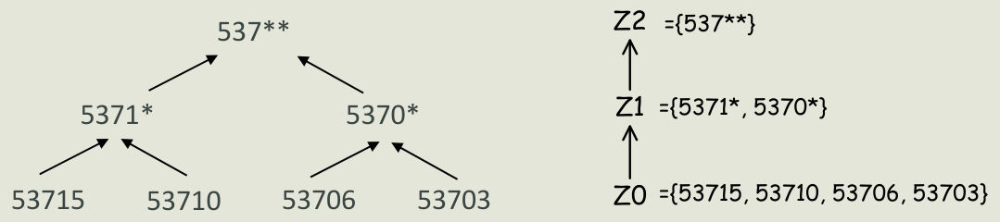
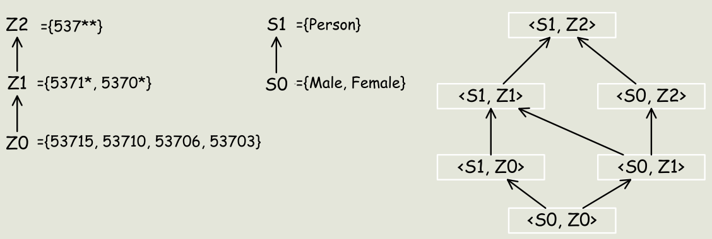
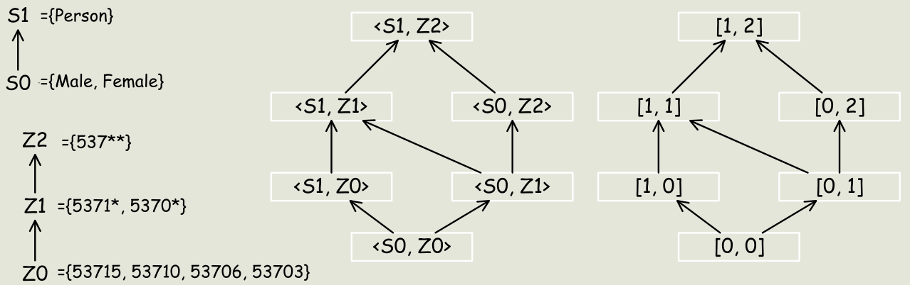
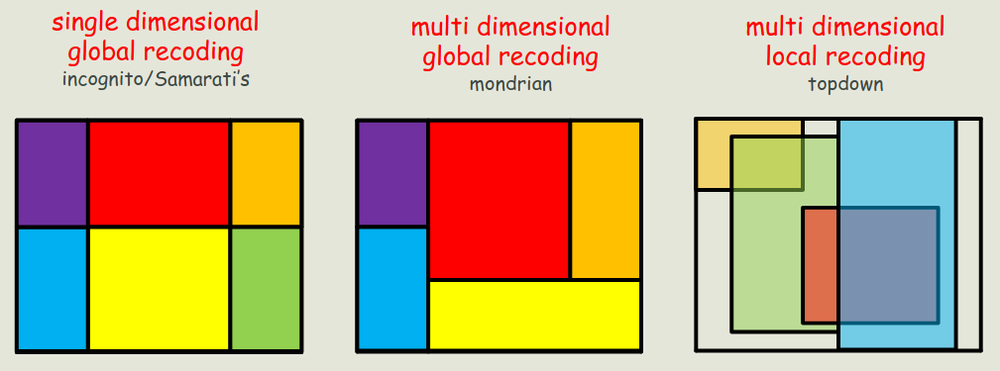

# Etica, Società e Privacy - Privacy - Parte IV

## Anonimizzazione

### Problematiche di anonimizzazione

- **Linking attack**: per identificare una persona, si collegano due o più tabelle (anonime).
    - `eg` Nel 2001, Latanya Sweeney riuscì a re-identificare il fascicolo sanitario del governatore del Massachusetts.
        - Il Massachusetts raccoglie e pubblica dati medici sanificati per gli impiegati statali (microdata).
        - Le liste di registrazione dei votanti del Massachusetts sono pubbliche.
        - I due dataset hanno un sottoinsieme di attributi in comune (zipcode, data di nascita, sesso).
    - `eg` Dal censimento USA del 1990, l'$87\%$  della popolazione è unico dato zipcode, genere e data di nascita.
        - Nel 2000, anno di nascita e zipcode $0.2\%$, data di nascita e zipcode $63.3\%$.

#### Tipi di attributi

- Ruolo degli attributi nei microdati:
    - **Identificativi espliciti**: da rimuovere.
    - **Quasi-identifier**: utilizzabili per re-identificare degli individui.
        - **Attributi** che di per sé non sono identificativi univoci, ma che **combinati con altri QI** possono diventare **identificativi univoci**.
        - Diversi attacchi sono basati sull'utilizzo dei QI.
    - **Attributi sensibili**: riguardano informazioni sensibili.
- Il ruolo del preservazione della privacy è **disassociare** gli individui dalle loro **informazioni sensibili**.
    - Bisogna lavorare sugli attributi sensibili e sui QI per evitare che il loro rilascio porti alla re-identificazione.

### $k$-anonymity

- **$k$-anonymity**:
    - Proposto nel 1998 come approccio per proteggere i soggetti ma rilasciando informazioni verosimili.
        - Utilizzando **generalizzazione** e **soppressione**.
- **Quasi-identifier**: un insieme di attributi $QI \subseteq A$ il cui rilascio deve essere controllato.
    - Con $A = \{a_1, \dots, a_n\}$ insieme di $n$ attributi e $D$ un dataset (tabella) definita su $A$.
    - I QI permettono molto più facilmente la re-identificazione di un soggetto.
- `prop` **$k$-anonymity**: $T$ **soddisfa la $k$-anonymity** sse per ogni $QI \in QI_T$ ogni sequenza esistente di valori degli attributi $QI$ appare almeno con $k$ occorrenze in $T$.
    - Con $T$ un dataset su un insieme $A = \{a_1, \dots, a_n\}$ di attributi e $QI_T$ insieme di QI associati a $T$.
    - Principi:
        - Ogni rilascio di dati deve essere tale che ogni combinazione di QI può essere *matchata* da $k$ respondents.
        - Si nasconde ogni individuo tra $k-1$ altri.
        - Il *linking* non può essere eseguito con una confidenza $>\frac{1}{k}$.
        - Richiede che nel rilascio i respondents debbano essere **indistinguibili** (in un dato insieme) rispetto un insieme di attributi.
    - Condizioni sufficienti per i requisiti di $k$-anonymity:
        - Ogni insieme di QI di valori nella tabella rilasciata deve avere $k$ occorrenze.
        - Non si considerano gli **attributi sensibili** (limite).
    - Si ha una $k$ diversa per la $k$-anonymity in relazione a un insieme differente di QI.
    - Definire il $k$ è effettivamente complesso.
        - Questa decisione può essere influenzato da fattori esogeni e fattori endogeni.

#### Generalizzazione e soppressione

- Come raggiungere la $k$-anonymity:
    - **Generalizzazione**: il valore di un dato attributo è sostituito un valore più generale.
        - Basato sulla definizione di gerarchia di generalizzazione.
        - Il nuovo valore rappresenta comunque il soggetto, ma non lo fa in dettaglio.
        - `eg` Da data completa ad anno, da zipcode completo a mascherato parzialmente. 
    - **Soppressione**: le informazioni sensibili vengono protette rimuovendole.
        - La soppressione può ridurre l'ammontare di generalizzazione necessaria per soddisfare la $k$-anonymity.
        - Si rimuovono delle tuple, come non pubblicare gli outlier.
    - Si ha sempre un **tradeoff tra privacy e utilità**.
        - Se i dati sono rilasciati per questioni di analisi, non devono essere troppo anonimi.
        - Non bisogna quindi anonimizzare più del necessario.

##### Gerarchie di generalizzazione

- **Gerarchia di generalizzazione del dominio**: $DGH_D$ di un attributo $A$.
    - Ordine parziale sul insieme dei domini $Dom_A = \{D_0, \dots, D_n\}$ che soddisfa:
        - Ogni dominio $D_i$ ha al massimo una dominio generalizzato diretto.
        - Tutti gli elementi massimali di $Dom$ sono singoletti.
            - Per assicurare che tutti i valori in ogni dominio possano essere generalizzati a un singolo valore.
- **Relazione di generalizzazione del valore**:
    - Associa a ogni valore $v_i$ del dominio $D_i$ un unico valore $v_j$ in $D_j$.
    - Dove $D_j$ è una diretta generalizzazione di $D_i$.
    - Questa relazione implica l'esistenza, per ogni $D$, di una **gerarchia di generalizzazione del valore** ($VGH_D$).
    - $VGH_D$ è un **albero**.
        - Foglie: valori in $D$.
        - Radice: elemento più generale, il valore dell'elemento massimale in $DGH_D$.

##### Reticolo di generalizzazione

- `def` **Reticolo di generalizzazione**: $DGH_{DT} = DGH_{D_{A1}} \times \dots \times DGH_{D_{AB}}$.
    - Con una tupla di dominio $DT = \langle D_{A_1}, \dots, D_{A_n} \rangle$ tale che $D_{A_i} \in Dom_{A_i}$.
        - $D_{A_i}$ rappresentano i livelli di ogni gerarchia di dominio.
    - $DGH_{DT}$ definisce un **reticolo** (lattice) il cui elemento minimale è $DT$.
        - Una relazione $n$-aria tra le varie gerarchie di dominio.
        - Le relazioni tra i nodi sono i diretti successori nella gerarchia in cui è stato generalizzato un solo elemento.
        - Più si sale nel reticolo, maggiore è la generalizzazione.
    - Offre un metodo per decidere una strategia di generalizzazione.

##### Tabella generalizzata con soppressione

- **Tabella generalizzata con soppressione**: data $T_i$, la tabella $T_j$ denotata come $T_i \leq T_j$.
    - Con un insieme di attributi $A = \{A_1, \dots, A_n\}$, e due tabelle $T_i$ e $T_j$ definite su $A$.
    - La tabella $T_j$ è una **generalizzazione** (con **soppressione di tuple**) se:
        - Il dominio di ogni attributo in $A_x$ in $T_j$ è uguale o generalizzazione del dominio di $A_x$ in $T_i$.
            - La tabella $T_j$ è a un livello superiore di generalizzazione di $T_i$.
        - Ogni tupla $t_j$ in $T_j$ ha una tupla corrispondente $t_i$ in $T_j$ tale che per ogni attributo $A_x, t_j[A_x]$ è uguale o generalizzazione di $t_i[A_x]$.
            - Si può avere che in $T_j$ vi siano meno tuple di quelle contenute in $T_i$.
    - **Non tutte le generalizzazioni sono uguali**.

##### Vettore distanza

- **Vettore distanza**: di $T_j$ da $T_i$, $DV_ij = [d_1, \dots, d_n]$.
    - Con due tabelle $T_i$ e $T_j$ tale che $T_i \leq T_j$.
    - Dove ogni $d_x$ è la lunghezza del percorso univoco tra $dom(A_x, T_i)$ e $dom(A_x, T_j)$ in $DGH_{DX}$.

##### Criterio di generalizzazione

- **Criterio di generalizzazione**:
    - L'obiettivo è quello di trovare la **generalizzazione minima che soddisfi la $k$-anonymity**.
        - **Massimizzare l'utilità** trovando il minimo vettore distanza con $k$-anonymity.
        - `eg` Se i nodi $[1, 0]$ e $[0, 2]$ garantiscono entrambi la $2$-anonymity, bisogna scegliere il primo.
- **Generalizzazione $k$-minimale con soppressione**:
    - Con due tabelle $T_i$ e $T_j$ tale che $T_i \leq T_j$ e $MaxSup$ threshold specificata di soppressione accettabile.
    - $T_j$ è generalizzazione $k$-minima di $T_i$ sse:
        1. $T_j$ soddisfa la $k$-anonymity.
        2. La soppressione è minimale, $\forall T_x: T_i \leq T_x, DV_{ix} = DV_{ij}$, $T_x$ è $k$-anonimo $\implies |T_j| \geq |T_x|$.
            - $T_x$ è stata ottenuta con un numero maggiore di soppressioni rispetto a $T_j$.
        3. $|T_j| - |T_i| \leq MaxSup$.
        4. $\forall T_x: T_i \leq T_x$, $T_x$ soddisfa i primi tre punti, $\implies DV_{ix} \geq DV_{ij}$.

#### Classificazione di tecniche di $k$-anonymity

- La generalizzazione e la soppressione possono essere applicate a **livelli differenti di granularità**.
    - La generalizzazione può essere applicata a:
        - Livello di **singola colonna**: un passo di generalizzazione generalizza tutti i valori in una colonna.
            - Riduce di molto l'informazione portata dalla tabella.
        - Livello di **singola cella**: data una specifica colonna, la tabella potrebbe contenere valori a differenti livelli di generalizzazione.
    - La soppressione può essere applicata a:
        - Livello di **riga**: un'operazione di soppressione rimuove un'intera tupla.
        - Livello di **colonna**: un'operazione di soppressione oscura tutti i valori di una colonna.
            - Rimuovendo una colonna si potrebbe evitare di generalizzare altre colonne.
        - Livello di **singola cella**: solo certe celle di una data tupla/attributo possono essere rimosse.

### Algoritmi di $k$-anonimizzazione

- Trovare tabelle $k$-anonime minimali con generalizzazione degli attributi e soppressione di tuple, è **NP-hard**.
    - La complessità di questi algoritmi è determinata dal **numero di attributi**.
    - Si può cercare una **soluzione esatta** tramite utilizzo di euristiche:
        - Nei casi peggiori si ha una **complessità esponenziale** sul numero di attributi dei *quasi-identifier*.
        - Se il $|QI|$ (decina) è piccolo rispetto alle tuple della tabella privata, l'utilizzo di questi algoritmi è **pratico**.
    - Si può cercare una soluzione **approssimata** (sempre tramite utilizzo di euristiche).

#### Algoritmo di Samarati

- **Algoritmo di Samarati** (2001): il primo proprio algoritmo di anonimizzazione.
    - Algoritmo **efficace** ed **efficiente**.
        - Trova soluzioni **esatte ma non necessariamente ottime**.
    - Idea generale: **ogni percorso** in $DGH_{DT}$ rappresenta una **strategia di generalizzazione**.
        - Si applica per **ogni quasi-identifier**.
    - Si basa sulla **generalizzazione localmente minimale**.
        - Dipende molto dalla strategia implementata dall'algoritmo.
        - A ogni step di generalizzazione (nodo) verifica che la tabella sia $k$-anonima.
    - Altre proprietà:
        - Ogni generalizzazione $k$-minimale è **localmente minima** rispetto a un cammino.
            - L'opposto non è vero.
        - Salendo di gerarchie il numero di tuple da rimuovere per garantire la $k$-anonymity **decresce**.
    - Si basa su una **ricerca binaria** sul reticolo del vettore distanze.
        1. Si valutano le soluzioni all'altezza $\lfloor h/2 \rfloor$.
        2. Se esiste una soluzione che soddisfa la $k$-anonymity:
            - Valuta le soluzioni all'altezza $\lfloor h/4 \rfloor$.
            - Altrimenti valuta le soluzioni all'altezza $\lfloor 3h/4 \rfloor$ (superiore).
        3. Finché l'algoritmo non raggiunge l'altezza più bassa in cui c'è un vettore distanza che soddisfa la $k$-anonymity.
    - Utilizza una **distance vector matrix** per evitare calcoli espliciti su ogni tabella generalizzata.

#### Algoritmo Incognito

- **Algoritmo Incognito** (2005):
    - Componenti assimilabili a quello di Samarati, ma con strategia di ricerca nello spazio di stati molto differenti.
        - Entrambi lavorano a livello di **colonna**.
        - Incognito adotta una approccio bottom-up per la visita dei $DGH$.
    - `prop` La $k$-anonymity rispetto a un **sottoinsieme proprio** di un QI è una condizione necessaria (ma non sufficiente) per la $k$-anonymity rispetto a QI. 
        - Se non è possibile trovare questo sottoinsieme, allora neanche QI può $k$-anonimizzare la tabella.
        - `!` Permette di **generare** i QI (partendo dallo spazio degli attributi), a differenza di Samarati.
            - Si dovrebbe avere $O(2^n)$, ma grazie al **principio a-priori** è più bassa.
    - Funzionamento:
        - Iterazione $1$: controlla la $k$-anonymity per ogni attributo (singleton) in QI, scartando generalizzazioni che non soddisfano la $k$-anonymity.
        - Iterazione $2$: combina le rimanenti generalizzazione in **coppie** e controlla la $k$-anonymity per ogni coppia.
        - Iterazione $i$: combina tutte le $i$-uple di attributi, ottenute combinando le generalizzazioni che soddisfano la $k$-anonymity all'iterazione $i-1$.
            - Elimina le soluzioni non $k$-anonymity.
        - Iterazione $|QI|$: restituisce il risultato finale.
- L'algoritmo Incognito sfrutta **proprietà di monotonicità** relative la frequenza di tuple in un reticolo.
    - Come avviene nelle gerarchie OLAP e nei *frequent itemset mining*.
    - `prop` **Proprietà di generalizzazione** (da *rollup*): se a un nodo si ha la $k$-anonymity, la si ha anche al nodo parente.
    - `prop` **Proprietà sottoinsieme** (da *a-priori*): se per un insieme di attributi $QI$ la $k$-anonymity non è soddisfatta, allora non lo è nemmeno per i **soprainsieme**.
    - Considera insieme di $QI$ attributi di **cardinalità crescente** e pruna i nodi del reticolo in base a queste proprietà.
- Entrambi questi algoritmi si basano sull'assunto che esista (esplicitamente o no) una **gerarchia degli attributi**.
    - Così che si possa applicare un **rollup sul dominio**.

#### Algoritmo Mondrian

- **Algoritmo Mondrian** (2006):
    - Lavora a livello di **tuple**.
    - Principi operativi:
        - Ogni attributo in un $QI$ rappresenta una **dimensione**.
        - Ogni tupla nella tabella privata $PT$ è rappresentata da un **punto** nello spazio definito da $QI$.
        - Tuple con lo stesso valore $QI$ sono rappresentate associando il numero di occorrenze con dei punti.
        - Lo **spazio multidimensionale** è **partizionato** dividendo le dimensioni così che ogni area contenga almeno $k$ occorrenze di punti valori.
            - Non si lavora più quindi sulle *gerarchie*.
            - La partizione viene **reiterata** fino a soddisfare questa proprietà.
        - Tutti i punti in una **regione** sono generalizzati in un unico valore.
            - La generalizzazione è **a posteriori**.
        - Le tuple corrispondenti sono sostituite dalle **generalizzazioni calcolate**.
    - **Discernability Metric** (DM): **misura di utilità** adottata dall'algoritmo.
        - Penalizza ogni tupla con la dimensione del gruppo a cui appartiene.
            - Gruppi troppo grandi di tuple vengono penalizzati.
            - Si partiziona *prima* i gruppi di tuple più numerosi (DM alta).
        - Intuitivamente, il **raggruppamento ideale** è quello dove ogni gruppo ha dimensione $k$.
            - Si cerca di massimizzare il numero di gruppi di dimensione $k$.
            - Si avranno gruppi con dimensione $\geq k$.
    - Funzionamento e proprietà:
        - Cerca di costruire gruppi di dimensione approssimativamente $k$.
        - Se la gerarchia è disponibile, generalizza basandosi su quella.
            - **Prima si raggruppa**, e poi si fa il rollup (differente da Samarati e Incognito).
            - Se la gerarchia non è disponibile (**attributi flat**), crea dei raggruppamenti (anche poco signficiativi). 
                - `eg` Da `divorced` e `widow` si ottiene `divorced/widow`.
                - Perdita di informazione a livello di **interpretabilità**.
            - La partizione può variare in base **all'ordine dei valori**.
                - Si può quindi ottimizzare l'ordinamento di questi valori prima del raggruppamento.

##### Qualità dei gruppi

- DM dipende solo sulla cardinalità dei gruppi.
    - Non dipende dalla densità del gruppo.
    - Un buon gruppo deve contenere tuple con valori QI simili.
    - **Normalized Certainty Penalty** (NCP): nuova metrica basata sul **perimetro dei gruppi**.
        - Non si basa sulla cardinalità di un gruppo.
        - Ma quanto questi siano vicini nello spazio delle dimensioni.
            - DM: si ottengono degli **iper-rettangoli** (cattiva generalizzazione).
            - NCP: si ottengono degli **iper-quadrati** (buona generalizzazione).

#### Algoritmo Topdown

- **Algoritmo Topdown** (2006):
    - La generalizzazione dell'anonimizzazione **può** essere utile per evitare l'**overfitting** nel ML.
        - Nonostante possa sembrare un modo per diminuire l'**accuracy** di un test set, non è detto lo sia.
    - Funzionamento:
        - Si parte con l'intero data-set e lo si **divide in due iterativamente**.
        - Si continua finché non si hanno solo più gruppi che contengono meno di $2k - 1$ tuple.
        - **Algoritmo di splitting**:
            - Si cercano i due punti (seed) più distanti (euristica, ricerca quadratica non completa).
                - I due punti diverranno due gruppi divisi.
            - Si esaminano i punti casualmente.
                - Si assegna un punto al gruppo il cui NCP crescerà di meno.
                - Iterativamente si cercano punti che permettano di avere un **perimetro minore**.
                - Si diminuirà l'**entropia** dei valori all'interno di ogni gruppo.
        - `!` Si possono avere **gruppi in overlap**.
        - We partition the table iteratively.
            - A set of tuples is partitioned into subsets if each subset is more local. 
            - That is, likely they can be further partitioned into smaller groups that reduce the weighted certainty penalty.

#### Forza di generalizzazione

>The mondarian multidimensional $k$-anonymization method is so far the best method in both quality (measured by the discernability penalty) and efficiency.

- **Forza di generalizzazione**:
    - Samarati e Incognito: **single dimensional global recoding**.
        - Data una dimensione, lo split è uguale per tutte le altre dimensioni.
    - Mondrian: **multi dimensional global recoding**.
        - Lo splitting può avvenire in modo differente su più dimensioni.
    - Topdown: **multi dimensional local recoding**.
        - Lo splitting avviene in modo da ottenere anche gruppi locali che possono essere sovrapposti.
        - Gruppi più fini ma **meno interpretabili** (e utilizzabili).
        - Il local recoding può ottenere meno perdità di informazione rispetto al global recoding.
    - Passando dalla prima all'ultimo la **forza di generalizzazione** aumenta.

### Limiti della $k$-anonimizzazione

- Attacchi applicabili a tabelle $k$-anonimizzate (GT):
    - **Homogeneity attack**:
        - Applicabile quando tutte le tuple con un valore QI in una tabella $k$-anonymity hanno stesso valore su attributi sensibili.
        - Causato dalla **mancata necessaria diversità** sull'attributo sensibile.
    - **Background knowledge attack**:
        - Si basa su conoscenza a priori di alcune informazioni aggiuntive su uno specifico *data subject*.
        - Oltre a dati specifici, si conoscono informazioni di alto livello (di *background*).
        - `eg` Hellen è un'americana di 29 anni che vive nel 13608, ma si sa anche che è un'*atleta*.
- Una tabella generalizzata può portare a un rilascio di informazione in due maniere:
    - **Disclosure positiva**:
        - L'attaccante **identifica** il valore esatto sull'attributo sensibile dalla GT.
    - **Disclosure negativa**:
        - L'attaccante **elimina** valori possibili sull'attributo sensibili con alta probabilità.
        - Si può eliminare successivamente vari valori basandosi su nuove informazioni.
        - Si arriva a un pool di valori sull'attributo sensibile che risulta informativo.
        - Richiede più informazione della *disclosure positiva*.

#### Mancanza di diversità

- `def` **Mancanza di diversità**: quando in un attributo sensibile $S$ avviene $\forall s' \neq s, n(q^*, s') \ll n(q^*, s)$.
    - Dove:
        - $q$: un valore di un attributo non sensibile $Q$ in $PT$.
            - $q^*$: il valore generalizzato di $q$ in $GT$.
        - $s$: un possibile valore di un attributo sensibile $S$.
        - $n(q^*, s)$: il numero di tuple $t* \in GT$ dove $t^*[Q] = q^*$ e $t^*[S] = S$.
        - $q^*$-block (**classe di equivalenza**): un set di tuple in $GT$ i cui valori non sensibili in $Q$ generalizzano a $q^*$.
            - Un gruppo di tuple $k$-anonimizzato.
    - Esistono dei valori dell'attributo sensibile che sono molto **più rappresentati** nel dato $q^*$-block rispetto ad altri valori dell'attributo sensibile.
        - In questo caso $P(t[S] = s \mid t^*[Q] = q^*) \approx 1$
        - Il valore sensibile $s$ della persona identificata da $t[Q]=q$ può essere determinato con grande accuratezza.
            - Ammettendo che l'attaccante sappia che la persona è nella $PT$.

#### $l$-diversity

- **Principio della $l$-diversity**:
    - `ex` Per assicurarsi che vi sia **diversità** di un $q^*$-block, si deve avere almeno:
        1. $l \geq 2$ valori sensibili differenti;
        2. Tali che gli $l$ valori **più frequenti** in un blocco devono avere all'incirca la **stessa frequenza**.
    - Un $q^*$-blocco con queste proprietà è **ben rappresentato** da $l$ **valori sensibili**.
    - Un possibile avversario necessità $l-1$ negative disclosure.
        - Con necessità di $l-1$ informazione.
    - Si può quindi scegliere un $l$ alto per stabilire una $l$-diversity alta.
        - Ma scegliendo un valore troppo alto, la GT potrebbe **non essere informativa**.
    - Per avere sia $k$-anonymity che $l$-diversity si deve scegliere un $k$ alto.
        - Anche in questo caso però si potrebbe generalizzare così tanto da perdere informazioni utili.
- **Principio della $l$-diversity globale**: un tabella è $l$-diversa se ogni $q^*$-block è $l$-diverso.
    - Esistono algoritmi di $l$-diversity dove $l$ viene aggiustato sul singolo $q^*$-block.

##### Entropy $l$-diversity

- `def` **Entropy $l$-diversity**: $- \sum_{s \in S} p(q^*, s) \log (p(q^*, s)) \geq \log(l)$.
    - Dove $p(q^*, s) = \frac{n(q^*, s)}{\sum_{s' \in S} n(q^*, s')}$ è la frazione di tuple nel $q^*$-block con valori dell'attributo sensibile uguali a $s$.
    - Una tabella è entropy $l$-diversa se per ogni $q^*$-block si rispetta questa proprietà.
    - Lavora sui logaritmi e non sui valori puri dei conteggi.
    - `th` **Monotonicità della $l$-diversity**: se una tabella GT soddisfa la entropy $l$-diversity, allora qualsiasi generalizzazione di GT soddisfa la entropy $l$-diversity.
        - Si possono scartare delle soluzioni non $l$-diverse da un dato livello di generalizzazione (potando soluzioni).
    - Si ha quindi che ogni algoritmo di $k$-anonymity può essere esteso per assicurare la proprietà di $l$-diversity.

##### Limiti della $l$-diversity

- Un $q^*$-block $l$-diverso può comunque rilasciare molte informazioni sensibili.
    - `eg` Nei test di sieropositività, si può passare da $1\% HIV^-$ in PT a un $q^*$-block con $50\% HIV^-$ nella GT.
    - Forzando la $l$-diversità si può finire a divulgare informazioni sensibili rispetto a anonimizzazioni in sua mancanza.
- **Attacchi sulla $l$-diversity**:
    - La $l$-diversity lascia spazio a attacchi basati sulle **distribuzioni dei valori** nelle classi di equivalenza.
    - **Skewness attack**: eseguibile quando la distribuzione in un $q^*$-block è differente dalla popolazione originale.
    - **Similarity attack**: eseguibile quando un $q^*$-block ha valori differenti ma semanticamente simili per un attributo sensibile. 

#### $t$-closeness

- **Principio della $t$-closeness**:
    - Una classe di equivalenza è **$t$-closed** se la **distanza** tra la distribuzione di una attributo sensibile nella data classe e la distribuzione dell'attributo nell'intera tabella non supera una **threshold** $t$.
        - Si pone un limite alla distanza che un attributo sensibile può avere in $q^*$-block rispetto all'intera tabella.
    - Una tabella è $t$-closed se tutte le sue classe di equivalenza sono $t$-closed.
- **Distanza tra le distribuzioni** $P$ e $Q$:
    - Richiedere che $P$ e $Q$ siano chiuse limiterebbe la quantità di informazioni utili rilasciabili.
        - In quanto limita la correlazione tra gli attributi QI e gli attributi sensibili.
    - È però questo che si vuole limitare:
        - Che l'osservatore abbia una visione troppo chiara delle correlazioni tale da effettuare un disclosure.
    - Possibili distanze tra due distribuzioni $\boldsymbol{P} = \{p_1, \dots, p_m\}$ e $\boldsymbol{Q} = \{q_1, \dots, q_m\}$:
        - `def` **Distanza variazionale**: $D[\boldsymbol{P}, \boldsymbol{Q}] = \sum_{i=1}^m \frac{1}{2} | p_i - q_i |$.
        - `def` **Distanza Kullback-Leibler** (KL): $D[\boldsymbol{P}, \boldsymbol{Q}] = \sum_{i=1}^m p_i \log \frac{p_i}{q_i}$.
        - Queste distanze però non considerano le differenze semantiche.
    - $t$-closeness utilizza l'**Earth Mover Distance** (EMD).
        - `def` **Earth Mover Distance con attributi numerici**: $D[\boldsymbol{P}, \boldsymbol{Q}] = \sum_{i=1}^m | \sum_{j=1}^i r_j |$, con $r_j = p_j - q_j$.
            - Il dominio degli attributi è $\{v_1, \dots v_m\}$.
            - La distanza normalizzata tra due valori numerici è $dist(v_i, v_j) = \frac{|i - j|}{m - 1}$.
            - $D[\boldsymbol{P}, \boldsymbol{Q}] = \frac{1}{m-1} (|r_1| + |r_1 + r_2| + \dots + | r_1 + \dots + r_{m-1}|)$.
        - `def` **Earth Mover Distance con attributi categorici**:
            - Per **attributi con dominio piatto**: $D[\boldsymbol{P}, \boldsymbol{Q}] = \sum_{i=1}^m \frac{1}{2} | p_i - q_i |$ (distanza variazionale).
            - Per **attributi con dominio gerarchico**: $D[\boldsymbol{P}, \boldsymbol{Q}] = \sum_{N} cost(N)$, dove:
                - $N$ è un nodo non-foglia.
                - $cost(N)$ è il costo di spostamento tra i rami figli di $N$.

#### Problemi dei metodi di $k$-anonymity

- Problemi dei metodi di $k$-anonymity:
    - È necessario valutare a quale avversario si fa riferimento (modellazione dell'avversario).
    - Con **definizioni sintattiche**:
        - Non si considerano avversari con informazioni aggiuntive;
        - Non si considerano le probabilità;
        - Non si considerano algoritmi avversari per il *decision making* (inferenza).
    - **Ogni attributo è un potenziale quasi-identifier**.
- Si passa dall'**attribute disclosure** alla **membership disclosure**.
    - Con probabilità grandi, un QI è unico in una popolazione.
    - Ma generalizzare/sopprimere QI in un dataset non influenza la loro distribuzione in una popolazione.
    - La $k$-anonymity **potrebbe non nascondere l'appartenenza** o meno di una data persona in un data-set.
    - La **sola appartenenza** a un dataset può implicare l'appartenenza a un dato gruppo.
        - `eg` Dataset di specifici studi medici o di contro-terrorismo.
        - Il solo sapere che una persona appartenga a un dataset può costituire di per sé una violazione della privacy.

#### $\delta$-presence

- **Proprietà di $\delta$-presence**:
    - Una tabella $GT$ soddisfa la $\delta$-presence con $\delta = (\delta_{min}, \delta_{max})$ se $\delta_{min} \leq P(t \in PT \mid GT) \leq \delta_{max}$ vale $\forall t \in T$ con $T$ tabella pubblica esterna.
    - $\delta = (\delta_{min}, \delta_{max})$ è un range di probabilità accettabili per $P(t \in PT \mid GT)$.
    - La $\delta$-presence soddisfa la **proprietà di monotonicità**.
        - Se vale per un dato livello di generalizzazione, vale anche per i successivi.
            - E viceversa, se non vale per un livello, non varrà per i precedenti.
        - Può essere utilizzata per tagliare lo spazio di ricerca.

#### Limiti e possibili sviluppi della $k$-anonymity 
 
- Limiti e possibili sviluppi della $k$-anonymity:
    - **Protezione contro le misure d'utilità**;
        - È necessario sviluppare misure che permettano agli utenti di stabilire l'utilità dei dati rilasciati.
    - **Algoritmi efficienti**;
        - Calcolare una tabella che soddisfi la $k$-anonymity garantendo la minimalità un problema NP-hard.
    - **Nuove tecniche**;
        - La proprietà di $k$-anonymity non è legata a una specifica tecnica.
    - **Merge di tabelle e viste differenti**;
        - La proposta originale della $k$-anonymity e la maggior parte dei lavori successivi assumono:
            - L'esistenza di una singola tabella da rilasciare;
            - Che la tabella rilasciata contenga al massimo una tupla per ogni rispondente.
    - **Conoscenza esterna**:
        - La $k$-anonymity non modella la conoscenza esterna che può essere sfruttata ulteriormente per inferire ed esporre dati per *identity* o *attribute disclosure*.
    - **Curse of dimensionality**:
        - La generalizzazione si basa fondamentalmente sulla **località spaziale**.
        - Ogni record deve avere $k$ vicini.
        - Ma i dataset del mondo reale sono **molto sparsi**.
