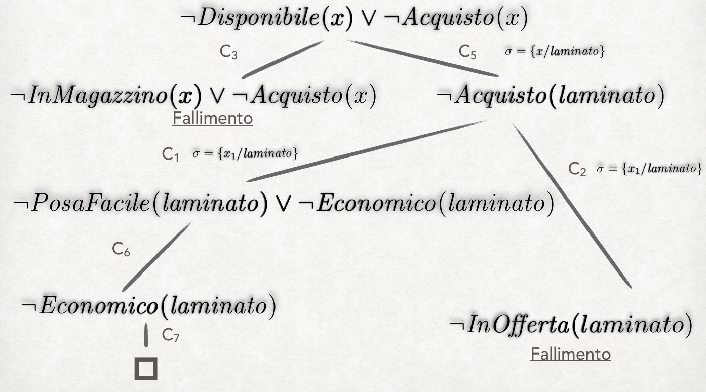
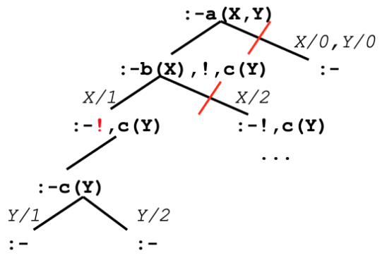

# Intelligenza artificiale e laboratorio - Parte I - Esercizi

## Interprete Prolog

### Esempio 1 - Risoluzione SLD

- Teoria:
    - $C_1$: $\forall(PosaFacile(x) \land Economico(x) \to Acquisto(x))$;
    - $C_2$: $\forall(InOfferta(x) \to Acquisto(x))$;
    - $C_3$: $\forall(InMagazzino(x) \to Disponibile(x))$;
    - $C_4$: $InOfferta(mosaico)$;
    - $C_5$: $Disponibile(laminato)$;
    - $C_6$: $PosaFacile(laminato)$;
    - $C_7$: $Economico(laminato)$.
- Goal: $Disponibile(x), Acquisto(x)$.

#### Svolgimento

- Si riscrivono le clausole e i goal in forma adatta alla risoluzione:
    - $C_1$: $\lnot PosaFacile(x) \lor \lnot Economico(x) \lor Acquisto(x)$;
    - $C_2$: $\lnot InOfferta(x) \lor Acquisto(x)$;
    - $C_3$: $\lnot InMagazzino(x) \lor Disponibile(x)$.
    - Goal: $\lnot Disponibile(x) \lor \lnot Acquisto(x)$.
- Risoluzione SLD con regola leftmost:



- Risoluzione SLD con regola rightmost:


### Esempio 2 - Algoritmo di unificazione Martelli-Montanari

- Sia dato il seguente insieme di equazioni:
    - $\{g(x_2) = x_1, f(x_1, h(x_1), x_2) = f(g(x_3), x_4, x_3)\}$.
- Risoluzione tramite l'algoritmo di unificazione Martelli-Montanari:
    - Si applica la *term reduction* alla seconda equazione:
        - $\{g(x_2) = x_1, x_1 = g(x_3), h(x_1) = x_4, x_2 = x_3\}$.
    - Si applica la *variable elimination* alla seconda equazione:
        - $\{g(x_2) = g(x_3), x_1 = g(x_3), h(g(x_3)) = x_4, x_2 = x_3\}$.
    - Si applica la *term reduction* alla prima equazione:
        - $\{x_2 = x_3, x_1 = g(x_3), x_4 = h(g(x_3)), x_2 = x_3\}$.
    - Si applica la *variable elimination* alla prima equazione:
        - $\{x_2 = x_3, x_1 = g(x_3), x_4 = h(g(x_3))\}$.
    - L'**MGU** sarà quindi: $\theta = \{x_1/g(x_3), x_2/x_3, x_4/h(g(x_3))\}$.

### Esempio 3 - Cut

- Teoria:

```prolog
a(X, Y) :- b(X), !, c(Y).
a(0, 0).
b(1).
b(2).
c(1).
c(2).
```

- Goal: $a(X, Y)$.
- Output:

```prolog
yes X = 1      Y = 1;
    X = 1      Y = 2;
no
```



-----

## Answer Set Programming

### Esempio 1 - Semantica: ridotti

- Programma $P$ di partenza:

```prolog
p :- a.
a :- not b.
b :- not a.
```

- Analisi:
    - Ogni $a$ implica $p$, condizione forte.
    - Se di dimostra $b$, non scatta $a$, condizione debole.
    - Se di dimostra $a$, non scatta $b$, condizione debole.
    - Ci si aspetta che siano presenti più modelli.
- Calcolo ridotti:
    - Candidati: sottoinsiemi di $\{a, b, p\}$, $2^3 = 8$ candidati.
    - Si calcola il ridotto per l'insieme vuoto $\emptyset$:
        - Si eliminano le regole che contengono dei $not$ su atomi presenti nell'insieme (NOP).
        - Dalle regole rimaste si cancellano i $not$.
            - Si ottiene $a \implies p$, $a$ e $b$ (da regole a fatti).
            - Si ottiene un **programma senza negazioni per fallimento**.
        - Si valuta il programma ottenuto:
            - $a$ e $b$ devono essere vere per forza, sono dei fatti.
            - Se è vero $a$, è vero anche $p$.
        - Answer set per $P^\emptyset = \{a, b, p\}$.
            - $\{a, b, p\} \neq \emptyset$, quindi non è un answer set per $P$.
    - Si calcola il ridotto per l'insieme $S = \{a\}$:
        - Si eliminano le regole che contengono dei $not$ su atomi presenti nell'insieme ($b \implies not \: a$).
        - Dalle regole rimaste si cancellano i $not$.
            - Si ottiene il programma $a \implies p$ e $a$.
        - Si valuta il programma ottenuto:
            - Deve essere vero $a$, e se è vero $a$ deve essere vero $p$.
        - Answer set per $P^S = \{a, p\}$.
            - $\{a, p\} \neq \{a\}$, quindi non è un answer set per $P$.
    - Si calcola il ridotto per l'insieme $S = \{b\}$:
        - Si eliminano le regole che contengono dei $not$ su atomi presenti nell'insieme ($a \implies not \: b$).
        - Dalle regole rimaste si cancellano i $not$.
            - Si ottiene il programma $a \implies p$ e $b$.
        - Si valuta il programma ottenuto:
            - $b$ deve essere vero.
        - Answer set per $P^S = \{b\}$.
            - Il modello del ridotto e $S$ di partenza coincidono.
            - $S = \{b\}$, quindi è un answer set per $P$.
    - Si calcola il ridotto per l'insieme $S = \{p\}$:
        - Si eliminano le regole che contengono dei $not$ su atomi presenti nell'insieme (NOP).
        - Dalle regole rimaste si cancellano i $not$.
            - Si ottiene il programma $a \implies p$, $a$ e $b$.
        - Si valuta il programma ottenuto:
            - $a$ e $b$ devono essere vere per forza, sono dei fatti.
            - Se è vero $a$, è vero anche $p$.
        - Answer set per $P^S = \{a, b, p\}$.
            - $S \neq \{a, b, p\}$, quindi non è un answer set per $P$.
    - Si calcola il ridotto per l'insieme $S = \{a, b\}$:
        - Si ottiene il programma $a \implies p$.
        - Si valuta il programma ottenuto:
            - Il programma è composta da una sola implicazione.
            - Non bisogna rendere vero nulla per soddisfare il programma.
        - Answer set per $P^S = \emptyset$.
            - $S \neq \emptyset$, quindi non è un answer set per $P$.
    - Si calcola il ridotto per l'insieme $S = \{b, p\}$:
        - Si ottiene il programma $a \implies p$ e $b$.
        - Si valuta il programma ottenuto:
            - $b$ deve essere vero, $a \implies p$ è vero comunque.
        - Answer set per $P^S = \{b\}$.
            - $S \neq \{b\}$, quindi non è un answer set per $P$.
    - Si calcola il ridotto per l'insieme $S = \{a, p\}$:
        - Si ottiene il programma $a \implies p$ e $a$.
        - Si valuta il programma ottenuto:
            - $a$ deve essere vero.
            - Se è vero $a$, è vero anche $p$.
        - Answer set per $P^S = \{a, p\}$.
            - $S = \{a, p\}$, quindi è un answer set per $P$.
    - Si calcola il ridotto per l'insieme $S = \{a, b, p\}$:
        - Si ottiene il programma $a \implies p$.
        - Si valuta il programma ottenuto:
            - Il programma è composta da una sola implicazione.
            - Non bisogna rendere vero nulla per soddisfare il programma.
        - Answer set per $P^S = \emptyset$.
            - $S \neq \emptyset$, quindi non è un answer set per $P$.
- Sugli $8$ possibili insiemi di letterali, $2$ sono answer set.
    - Answer set: $\{b\}$ e $\{a, p\}$.

### Esempio 2 - Semantica

- Il rompicapo degli onesti e dei bugiardi:
    - Onesti: dicono sempre il vero.
    - Bugiardi: dicono sempre il falso.
    - Si incontrano 3 persone, $a$, $b$, $c$.
        - $a$ dice che sia $b$ che $c$ sono onesti.
        - $b$ dice che $a$ è bugiardo ma $c$ è onesto.
    - Classificare $a$, $b$ e $c$.

```prolog
persona (a; b; c).
tipo(onesto; bugiardo).

% ad ogni persona si associa un tipo
1 { ha_tipo(P, T) : tipo(T) } 1 :- persona(P).

% informazioni aggiuntive
dice_il_vero(a) :- ha_tipo(b, onesto), ha_tipo(c, onesto).
dice_il_vero(b) :- ha_tipo(a, bugiardo), ha_tipo(c, onesto).

% Integrity constraint (situazioni che si vogliono escludere)
:- ha_tipo(P, bugiardo), dice_il_vero(P).
:- ha_tipo(P, onesto), not dice_il_vero(P).
```

- Soluzione:
    - $a$ è bugiardo, $b$ è bugiardo, $c$ è bugiardo.
