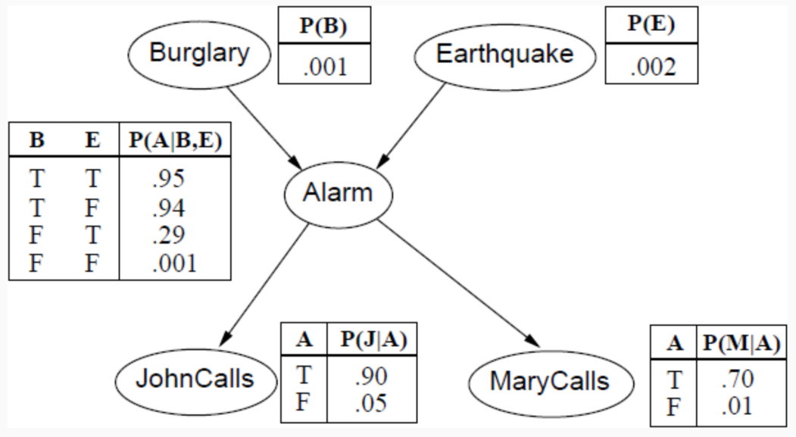

# Intelligenza artificiale e laboratorio - Parte II - Esercizi

## CLIPS

### Esempio 1 - Esercitazione

- Si vuole scrivere una piccola KB che ci permetta di inferire le parentele tra un gruppo di persone.
    - Se $x$ è un genitore di $y$ , allora è anche un antenato di $y$.
        - $\forall x, y \: parent(x, y) \to ancestor(x, y)$.
    - Se $x$ è un genitore di un antenato $z$ di $y$, allora anche $x$ è un antenato di $y$.
        - $\forall x, y, z \: parent(x, z) \land ancestor(z, y) \to ancestor(x, y)$.
    - Essere padre/madre vuol dire essere un genitore.
        - $\forall x, y \: father(x, y) \to parent(x, y)$.
        - $\forall x, y \: mother(x, y) \to parent(x, y)$.
    - Avere figli, essere umani e maschi vuol dire essere padri, e similmente per le madri.
        - $\forall x, y \: hasChild(x, y) \land human(x) \land male(x) \to father(x)$.
        - $\forall x, y \: hasChild(x, y) \land human(x) \land female(x) \to mother(x)$.

```lisp
(defrule rule-ancestor-1 
	(parent (x ?x) (y ?y))
=>
	(assert (ancestor (x ?x) (y ?y)))
 )

(defrule rule-ancestor-2
	(parent (x ?x) (y ?z))
	(ancestor (x ?z) (y ?y))
=>
	(assert (ancestor (x ?x) (y ?y)))
)

(defrule rule-mother
	(hasChild (x ?x) (y ?y))
	(human (name ?x) (gender female))
=>
	(assert (mother (x ?x) (y ?y)))
)


(defrule rule-father
	(hasChild (x ?x) (y ?y))
	(human (name ?x) (gender male))
=>
	(assert (father (x ?x) (y ?y)))
)

(defrule rule-parent-1
	(or (mother (x ?x) (y ?y))
	     (father (x ?x) (y ?y)) )
=>
	(assert (parent (x ?x) (y ?y)))
)

(defrule siblings
	(parent (x ?x) (y ?y))
	(parent (x ?x) (y ?z&:(neq ?y ?z)))
	(not (sibling (s1 ?z) (s2 ?y)))
=>
	(assert (sibling (s1 ?y) (s2 ?z)))
)
```


### Esempio 2 - LEX e MEA

- Esempio di attivazioni di regole con LEX e MEA come strategie di *conflict resolution*:
    - Pattern nell'ordine con cui sono definiti:
        - $rule_1$: $f_1$, $f_2$, $f_3$;
        - $rule_2$: $f_2$, $f_1$;
        - $rule_3$: $f_2$, $f_1$;
        - $rule_4$: $f_1$, $f_4$;
    - Come sono ordinati con LEX:
        - $rule_4$: $f_4$, $f_1$;
        - $rule_1$: $f_3$, $f_2$, $f_1$;
        - $rule_3$: $f_2$, $f_1$;
        - $rule_2$: $f_2$, $f_1$;
    - Come sono ordinati con MEA:
        - $rule_3$: $f_2$, $f_1$;
        - $rule_2$: $f_2$, $f_1$;
        - $rule_4$: $f_1$, $f_4$;
        - $rule_1$: $f_1$, $f_2$, $f_3$;
    - In MEA non c'è un ordinamento dei pattern all'interno delle regole.
        - Sull'ordinamento delle regole ci si basa sul primo pattern della regola.

### Esempio 3 - Modularità

- Si analizza come risolvere un problema di diagnosi di un dispositivo:
    - L'analisi diagnostica si svolga in tre fasi successive:
        - *Detection*: riconoscere che esiste un guasto;
        - *Isolation*: determinare quale componente ha causato il guasto;
        - *Recovery*: determinare quali passi seguire per ripristinare il funzionamento del dispositivo.
    - Si tratta di un sistema ciclico.
        - Dalla *detection* si arriva alla *recovery*, e da questa si passa di nuovo alla prima.
    - A ogni fase vengono associate delle regole.
- Prima possibile soluzione: **salience**.
    - Si utilizza la *salience* per:
        - Per far sì che le regole della fase di *recovery* vengano eseguite;
        - Solo dopo che la fase di *isolation* sia terminata.
        - E abbia seguito la fase di *detection*.
    - Le regole di *detection* hanno *salience* maggiore di quelle di *isolation*, e così via.
    - Possibili svantaggi:
        - La conoscenza di controllo è ancora **distribuita tra le regole**.
        - Non garantisce il corretto ordine dell'esecuzione.
            - Se le regole non sono attivabili, si eseguono quelle (attivabili) con priorità minore.

```lisp
(defrule fire-first (declare (salience 30))
    (priority first)
=>
(printout t "Print first" crlf))

(defrule fire-second (declare (salience 20))
    (priority second)
=>
(printout t "Print second" crlf))

(defrule fire-third (declare (salience 10))
    (priority third)
=>
(printout t "Print third" crlf))
```

- Seconda soluzione possibile: **fasi e fatti di controllo**.
    - Si separa la conoscenza di controllo da quella di dominio.
        - A ogni regola è assegnato un **control pattern** che indica in quale fase quella regola è attivabile.
        - Le regole di controllo sono poi definite per **trasferire il controllo** da una fase alla successiva.
    - Ogni regola che appartiene ad una fase specifica ha come primo pattern un **fatto di controllo**.
        - Con la MEA questo pone tutte le regole attive della fase più recente in cima all'agenda.
    - Si adotta la *salience* per dare priorità alle **regole esperte** rispetto alle **regole di controllo**.
        - La *salience* di `find-fault-location-and-recovery` ha salience $0$, maggiore delle regole di controllo.

```lisp
; regole di controllo
(defrule detection-to-isolation
    (declare (salience -10))
    ?phase <- (phase detection)
=>
    (retract ?phase)
    (assert (phase isolation)))

(defrule isolation-to-recovery
    (declare (salience -10))
    ?phase <- (phase isolation)
=>
    (retract ?phase)
    (assert (phase recovery)))

(defrule recovery-to-detection
    (declare (salience -10))
    ?phase <- (phase recovery)
=>
    (retract ?phase)
    (assert (phase detection)))

; esempio di regola esperta per fase specifica
(defrule find-fault-location-and-recovery
    (phase recovery)
    (recovery-solution switch-device ?replacement on)
=>
    (printout t "Switch device" ?replacement "on" crlf))
```

- Terza soluzione possibile: **moduli**.
    - Meno regole e più facili da mantenere.
    - Il `MAIN` funge da **coordinatore**.
    - La regola `change-phase` sposta il focus sulla fase successiva.

```lisp
(deffacts MAIN::control-information
    (phase-sequence DETECTION ISOLATION RECOVERY))

(defrule MAIN::change-phase
    ?list <- (phase-sequence ?next-phase $?other-phases)
=>
    (focus ?next-phase)
    (retract ?list)
    (assert (phase-sequence ?other-phases ?next-phase)))
```

### Esempio 4 - Modularità

- Si vuole modella un sistema di per l'allocazione di applicativi in memoria (*book-keeping*).

```lisp
(defmodule MAIN (export ?ALL)) ; esporta tutti i template

(deftemplate memory
    (slot size)
    (slot available)
    (multislot usage)
)

(deftemplate application
    (slot name)
    (slot mem-req)
)

(deftemplate allocate
    (slot name)
)

(deftemplate deallocate
    (slot name)
)

(deffacts init
    (phases ACCEPT DEALLOCATION ALLOCATION)

    (memory (size 15) (available 15) (usage))
    (application (name word) (mem-req 2))
    (application (name word2) (mem-req 7))
    (application (name word3) (mem-req 6))
    (application (name gnumeric) (mem-req 5))
    (application (name gnumeric2) (mem-req 5))
)

; unica regola di controllo, relativo al cambio di fase
(defrule MAIN::change-phase
    ?list <- (phases ?next-phase $?other-phases)
=>
    (focus ?next-phase)
    (retract ?list)
    (assert (phases ?other-phases ?next-phase))
)

; importa solo i template relativi all'allocazione
(defmodule ALLOCATION (import MAIN deftemplate allocate memory application)) 

; questa regola contiene *solo* conoscenza di dominio
(defrule allocation-ok
    ?f1 <- (allocate (name ?x))
    (application (name ?x) (mem-req ?y))
    ?f <- (memory (available ?z&:(> ?z ?y)) (usage $?u)) 
=>
    (bind ?m (- ?z ?y))
    (modify ?f (available ?m) (usage ?x ?u))
    (retract ?f1)
)

; importa solo i template relativi alla deallocazione
(defmodule DEALLOCATION (import MAIN deftemplate deallocate memory application))

; questa regola contiene *solo* conoscenza di dominio
(defrule deallocation-ok
    ?f1 <- (deallocate (name ?x))
    (application (name ?x) (mem-req ?y))
    ?f <- (memory (available ?z) (usage $?prima ?x $?dopo))
=>
    (bind ?m (+ ?z ?y))
    (modify ?f (available ?m) (usage $?prima $?dopo))
    (retract ?f1)
)

(defmodule ACCEPT)
(deffacts stop-me
    (stop))

; questa regola deve aggirare la rifrazione
(defrule accept-reqs
    ?f <- (stop) ; (!) stop permette di eseguire questa regola ogni volta che il focus torna su essa
=>
    (retract ?f)
    (assert (stop))
    (printout t "Accepting requests ..." crlf)
    (pop-focus) ; pop esplicito
    (halt) ; interrompe il motore inferenziale prima di passare al MAIN
)
```

### Esempio 5 - Strategie di ricerca in CLIPS

- Si considera il problema di far sedere $N$ persone ad un tavolo in modo che:
    - Ogni persona abbia accanto una persona del sesso opposto.
    - Ogni persona condivida almeno un hobby con i suoi vicini.
    - Ogni nodo dello spazio di ricerca corrisponde ad un assegnamento di persone a certe sedie.
        - Più stati saranno aperti durante la ricerca.
        - Si deve poter distinguere tra assegnamenti validi in uno stato da quelli validi in un altro stato.
    - Ogni assegnamento ha un suo id, ma appartiene ad un path (*pid*).


```lisp
(deftemplate guest (slot name) (slot sex) (slot hobby))

(deftemplate path (slot id) (slot name) (slot seat))

(guest (name n1) (sex m) (hobby h3)) (guest (name n1) (sex m) (hobby h2))
(guest (name n2) (sex m) (hobby h2)) (guest (name n2) (sex m) (hobby h3))
(guest (name n3) (sex m) (hobby h1)) (guest (name n3) (sex m) (hobby h2))
(guest (name n3) (sex m) (hobby h3))
(guest (name n4) (sex f) (hobby h3)) (guest (name n4) (sex f) (hobby h2))
(guest (name n5) (sex f) (hobby h1)) (guest (name n5) (sex f) (hobby h2)) 
(guest (name n5) (sex f) (hobby h3))
(guest (name n6) (sex f) (hobby h3)) (guest (name n6) (sex f) (hobby h1)) (guest (name n6) (sex f) (hobby h2))
(guest (name n7) (sex f) (hobby h3)) (guest (name n7) (sex f) (hobby h2))
(guest (name n8) (sex m) (hobby h3)) (guest (name n8) (sex m) (hobby h1))

...

(defrule assign_first_seat
   ?f1 <- (context (state start))
   (guest (name ?n))
   ?f3 <- (count (c ?c))
   =>
   (assert (seating (seat1 1) (name1 ?n) (name2 ?n) (seat2 1) (id ?c) (pid 0) (path_done yes)))
   (assert (path (id ?c) (name ?n) (seat 1)))
   (modify ?f3 (c (+ ?c 1)))
   (printout ?*output* "seat 1 " ?n " " ?n " 1 " ?c " 0 1" crlf)
   (modify ?f1 (state assign_seats)))

(defrule find_seating
   ?f1 <- (context (state assign_seats))
   (seating (seat1 ?seat1) (seat2 ?seat2) (name2 ?n2) (id ?id) (pid ?pid) (path_done yes))
   (guest (name ?n2) (sex ?s1) (hobby ?h1))
   (guest (name ?g2) (sex ~?s1) (hobby ?h1))
   ?f5 <- (count (c ?c))
   (not (path (id ?id) (name ?g2)))
   (not (chosen (id ?id) (name ?g2) (hobby ?h1)))
   =>
   (assert (seating (seat1 ?seat2) (name1 ?n2) (name2 ?g2) (seat2 (+ ?seat2 1)) (id ?c) (pid ?id) (path_done no)))
   (assert (path (id ?c) (name ?g2) (seat (+ ?seat2 1))))
   (assert (chosen (id ?id) (name ?g2) (hobby ?h1)))
   (modify ?f5 (c (+ ?c 1)))
   (printout ?*output* seat " " ?seat2 " " ?n2 " " ?g2 crlf)
   (modify ?f1 (state make_path)))

(defrule make_path
   (context (state make_path))
   (seating (id ?id) (pid ?pid) (path_done no))
   (path (id ?pid) (name ?n1) (seat ?s))
   (not (path (id ?id) (name ?n1)))
   =>
   (assert (path (id ?id) (name ?n1) (seat ?s))))

...
```

### Esempio 6 - Incertezza

- Un esempio tipico in letteratura è quello di un sistema esperto per raccomandare l'abbinamento di **vini**.
    - Bisogna fornire il piatto (con sue componenti) per ottenere dei consigli di abbinamenti.
        - Si possono avere più varianti dello stesso vino (`eg` per corpo e dolcezza).
    - I (possibilmente molteplici) abbinamenti vengono offerti con **fattori di certezza**.
        - I CF sono nell'intervallo $[0,100]$ (semplifica molto i calcoli).
    - Le regole d'expertise e di controllo sono nettamente divise e il codice è modularizzato.
        - Si definisce un costrutto del tipo `if-then`.

```lisp
; rappresentazione dei vini
(wine (name Gamay) (color red) (body medium)
    (sweetness medium sweet))
(wine (name Chablis) (color white) (body light)
    (sweetness dry))
(wine (name Sauvignon-Blanc) (color white) (body medium)
    (sweetness dry))
...

; regola d'expertise d'esempio
(rule (if tastiness is average)
    (then best-body is light with certainty 30 and
        best-body is medium with certainty 60 and
        best-body is full with certainty 30))
```

- Quando un antecedente viene soddisfatto, la regola viene **riscritta** rimuovendolo.
    - Il modulo `RULES` definisce le (meta-)regole per intepretare (e semplificare) le regole di dominio.
    - In passaggi successivi il CF dell'antecedente **accumula la certezza** data dalla combinazione di input dell'utente.

```lisp
; regole del modulo RULES, si faccia attenzione al trattamento dei CF
(defrule RULES::remove-is-condition-when-satisfied
    ?f <- (rule (certainty ?c1)
            (if ?attribute is ?value $?rest))
          (attribute (name ?attribute)
            (value ?value)
            (certainty ?c2))
=>
    (modify ?f (certainty (min ?c1 ?c2)) (if ?rest)))

; quando l'antecedente di una regola si svuota:
(defrule RULES::perform-rule-consequent-with-certainty
    ?f <- (rule (certainty ?c1)
    (if)
    (then ?attribute is ?value with certainty ?c2 $?rest))
=>
    (modify ?f (then ?rest))
    (assert (attribute (name ?attribute)
                       (value ?value)
                       (certainty (/ (* ?c1 ?c2) 100))))) 
                       ; si combina il CF accumulato dalla regola con quello associato a priori
```

- Analizzando le regole e la storia, è possibile capire **perché** un vino è stato raccomandato.
    - Punto di forza dei sistemi esperti.

-----

## Algoritmi di pianificazione

### Esempio 1 - PDDL

- In un ambiente costituito da due stanze, un robot può spostare dei palloni da una stanza a un'altra usando i suoi due bracci.
    - Nello stato iniziale tutti i palloni sono in una determinata stanza.
    - Il goal consiste nello spostare tutti i palloni nella seconda stanza.
- Elementi del task di pianificazione:
    - *Objects*: le due stanze, i palloni (`eg` 4), i due bracci robotici.
    - *Predicates*: $x$ è una stanza? $x$ è un pallone? $x$ è un braccio robotico? ecc.
    - *Initial state*: tutti i palloni e il robot sono nella prima stanza, tutti i bracci robotici sono vuoti.
    - *Goal specification*: tutti i palloni devono essere nella seconda stanza (nessun vincolo sulla posizione del robot)
    - Actions/Operators: il robot può muoversi tra le due stanze, può prendere e rilasciare una pallone con ogni braccio.
- **Predicati**:
    - `ROOM(x)`: true $\iff x$ è una stanza;
    - `BALL(x)`: true $\iff x$ è un pallone;
    - `GRIPPER(x)`: true $\iff x$ è un braccio robotico;
    - `at-robby(x)`: true $\iff x$ è una stanza e il robot è al suo interno;
    - `at-ball(x, y)`: true $\iff x$ è un pallone, $y$ è una stanza e $x$ è dentro $y$;
    - `free(x)`: true $\iff x$ è un braccio robotico e non sta portando nulla;
    - `carry(x, y)`: true $\iff x$ è un braccio robotico, $y$ è un pallone e $x$ sta portando $y$.

```lisp
; esempio di predicato
(define (domain gripper−strips
    (:predicates (ROOM ?x) (BALL ?x) (GRIPPER ?x)
                 (at−robby ?x) (at−ball ?x ?y)
                 ( free ?x) ( carry ?x ?y)
)
```

- **Action/Operator**:

```lisp
; esempio di azione: pick-up, il robot può prendere un pallone x quando è nella stanza y con il braccio z
(: action pick−up
    : parameters (?x ?y ?z)
    : precondition (and (BALL ?x) (ROOM ?y) (GRIPPER ?z)
                   (at−ball ?x ?y) (at−robby ?y) ( free ?z))
    : effect
        (and ( carry ?z ?x)
        (not (at−ball ?x ?y)) (not (free ?z)))
```

- **Objects**:
    - Quali sono gli oggetti specifici importanti per il problema in analisi.
    - *Rooms*: `rooma`, `roomb`;
    - *Balls*: `ball1`, `ball2`, `ball3`, `ball4`;
    - *Robot arms*: `left`, `right`.

```lisp
; definizione del problema, con oggetti, stato iniziale e goal
(define (problem strips-gripper2)
    (:domain gripper-strips)
    (:objects rooma roomb ball1 ball2 ball3 ball4 left right)
    (:init
        (room rooma) (room roomb)
        (ball ball1) (ball ball2) (ball ball3) (ball ball4)
        (gripper left) (gripper right)
        (at-robby rooma)
        (free left)
        (free right)
        (at ball1 rooma) (at ball2 rooma)
        (at ball3 rooma) (at ball4 rooma))
    (:goal (and (at ball1 roomb) (at ball2 roomb)
           (at ball3 roomb) (at ball4 roomb))))
```

-----

## Incertezza

### Esempio 1 - Bayes

- **Problema di Monty Hall**:
    - $x$: scelta del concorrente
    - $y$: porta aperta da Monty.
    - Tra tre porte vengono posizionate $2$ capre e $1$ auto.
    - Dopo la scelta del giocatore, Monty apre una porta (lui sa dove si trova l'auto) mostrando una capra.
    - Conviene al giocatore cambiare porta dopo aver visto la porta componente la capra?
- Caso $a$: $Auto \mid Capra \mid Capra$
    - $P(X = auto \mid Y = capra \: in \: 2) = \frac{P(Y \mid X) * P(X)}{P(Y)} = \frac{\frac{1}{2} * \frac{1}{3}}{\frac{1}{2}} = \frac{1}{3}$.
    - La probabilità a priori di aprire la porta $2$ è $\frac{1}{2}$.
    - Monty sa che l'auto è nella porta $1$.
- Caso $b$: $Capra \mid Auto \mid Capra$
    - $P(X = capra \mid Y = capra \: in \: 3) = \frac{P(Y \mid X) * P(X)}{P(Y)} = \frac{1 * \frac{2}{3}}{1} = \frac{2}{3}$.
    - Dopo aver aperto la porta $1$ trovando una capra, qual'è la probabilità che Monty scelga la porta $3$?
        - $P(Y \mid X) = 1$, non ha alternative.
    - Stessa probabilità nel caso $c$.
- Cambiare la porta dopo aver visto la capra porta la probabilità di vincere da $\frac{1}{3}$ a $\frac{2}{3}$.
    - **Cambiare la porta conviene**.


### Esempio 2 - Bayes

- Esempio pseudo-medico:
    - $I$: il paziente ha l'influenza.
    - $T$: il paziente ha il mal di testa.
    - $F$: il paziente ha la febbre.
    - Si assume che valga $\boldsymbol{P}(T, F \mid I) = \boldsymbol{P}(T \mid I) \: \boldsymbol{P}(F \mid I)$ e le seguenti probabilità:
        - $P(I = true) = 0.2$;
        - $P(T = true \mid I = true) = 0.5$;
        - $P(T = true \mid I = false) = 0.2$;
        - $P(F = true \mid I = true) = 0.4$;
        - $P(F = true \mid I = false) = 0.1$.
        - Implicitamente si hanno anche i negati.
            - $P(T \mid \lnot I) = 0.2 \to P(\lnot T \mid \lnot I) = 0.8$.
- Si vuole calcolare $P(I = true \mid F = true, T = true)$.
    - $P(I \mid F, T) = \frac{P(I, F, T)}{P(F, T)}$.
        - Dalla definizione di probabilità condizionata.
        - Bisogna calcolare però le probabilità congiunte. 
    - $P(I, F, T) = P(F, T \mid I) \: P(I) = P(F \mid I) \: P(T \mid I) \: P(I)$.
        - Dalla definizione di probabilità condizionata.
        - E sfruttando la definizione di indipendenza.
        - I tre fattori sono espliciti nei dati.
    - $P(I, F, T) = P(F \mid I) \: P(T \mid I) \: P(I) = 0.4 * 0.5 * 0.2$.
        - Si può calcolare anche per i valori non espressi esplicitamente.
    - Per calcolare $P(F, T)$ è necessario andare a valutare tutti gli eventi atomici dove $f$ e $t$ sono veri.
        - $P(F, T) = P(I, F, T) + P(\lnot I, F, T)$ (**somma eventi atomici**).
        - $P(\lnot I, F, T) = P(F \mid \lnot I) \: P(T \mid \lnot I) \: P(\lnot I) = 0.1 * 0.2 * (1 - 0.2)$.
        - $P(F, T) = (0.4 * 0.5 * 0.2) + (0.1 * 0.2 * 0.8)$.
    - $P(I \mid F, T) = \frac{P(I, F, T)}{P(F, T)} = \frac{0.4 * 0.5 * 0.2}{(0.4 * 0.5 * 0.2) + (0.1 * 0.2 * 0.8)} = \frac{0.04}{0.056} = 0.714 = 71\%$.

### Esempio 3 - Reti bayesiane

- **Scenario**: 
    - Siete al lavoro e il vostro vicino John vi chiama per dirvi che suona l’allarme di casa vostra.
    - La vostra vicina Mary non ha però chiamato. 
    - Talvolta l'allarme suona per via di piccoli terremoti, abitate a San Francisco, quindi è normale.
    - C’è stato un tentativo di furto?
- **Modellazione** del problema:
    - Variabili: $Burglar$, $Earthquake$, $Alarm$, $JohnCalls$, $MaryCalls$.
    - Dipendenze dirette:
        - Un ladro può far scattare l'allarme;
        - Un terremono può far scattare l'allarme;
        - Mary può chiamare per via dell'allarme;
        - John può chiamare per via dell'allarme.



- La rete bayesiana specifica:
    - $Burglary$ e $Earthquake$ sono **cause**.
        - Non hanno infatti genitori.
        - La loro CPT si riduce alla loro probabilità a priori.
    - $Alarm$ dipende da $Burglary$ e $Earthquake$.
        - La CPT contiene quindi $P(A \mid B, E)$.
    - $JohnCalls$ e $MaryCalls$ sono **evidenze**.
        - Non hanno infatti figli.
        - John chiama più spesso di Mary dato l'allarme.
            - John non chiama il $10\%$ delle volte anche con l'allarme attivato.
        - John chiama più spesso di Mary anche quando l'allarme non suona.
        - Né John né Mary osservano direttamente l'intrusione o il terremoto.
            - L'unica cosa che osservano è l'allarme (deducibile dalla rete).
- Semantica globale:
    - Stabilire la probabilità che sia John sia Mary telefonino quando non si sono verificate le cause Terremoto e Intrusione.
    - $P(j, m, a, \lnot b, \lnot e) = P(j \mid a) P(m \mid a) P(a \mid \lnot b, \lnot e) P(\lnot b) P(\lnot e) = .9 × .7 × .001 × .999 × .998 = .00062$.
- Inferenza con reti bayesiane:
    - Si vuole calcolare $\boldsymbol{P}(Butglary \mid JohnCall = true, MaryCall = true)$.
        - Evidenze: $j$, $m$;
        - Query: $B$;
        - Nascoscte: $A$, $E$.
    - $\boldsymbol{P}(B \mid j, m) = \alpha \boldsymbol{P}(B, j, m) = \alpha \sum_{e \in E} \sum_{a, \in A} \boldsymbol{P}(B, j, m, a, e)$.
        - Ricorrendo alla semantica globale: $\boldsymbol{P}(B\mid j, m) = \alpha \sum_{e \in E} \sum_{a, \in A} P(B)P(e)P(a \mid B, e) P(j \mid a) P(m \mid a)$.
