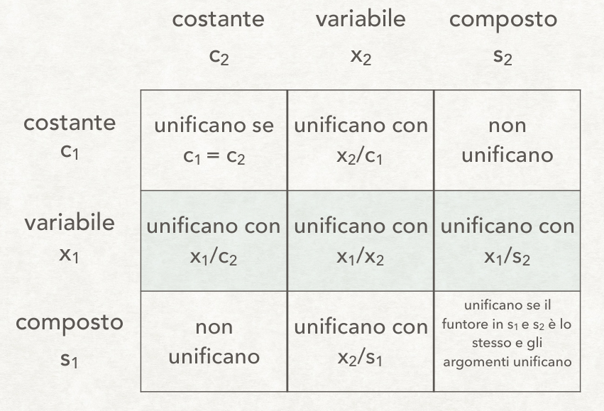

# Intelligenza artificiale e laboratorio - Parte I

## Interprete Prolog

### Interprete Prolog

- L'esecuzione dei programmi `Prolog` avviene mediante **backward chaining in profondità**.
    - Si parte dal **goal** che si vuole derivare.
        - Il goal è una **congiunzione** di formule atomiche.
        - Si vuole dimostrare mediante risoluzione che il goal segue logicamente dal programma.
    - Una regola $A := B_1, B_2, \dots, B_m$ è applicabile a $G_i$ se:
        - Rinominando le variabili, $A$ e $G_i$ **unificano**.
        - Se non ci sono fatti o regole che unifichino con $G_i$, fallisce.
- Formulazione non determinstica dell'interprete `Prolog`:
    - Termina se si riesce a svuotare l'insieme dei goal $G$.
    - È *scegliere una clausola …* il punto in cui viene introdotto del non determinismo.

```pascal
interprete(G)
IF G vuoto
  THEN successo
  ELSE 
    sia G = G1, …, Gn
    sia R insieme delle clausole applicabili a G1
    IF R vuoto
      THEN fallimento
      ELSE 
        scegliere una clausola A := B1, …, Bm in R
        sia σ il MGU di G1 e A
        interprete(B1σ, …, Bmσ, G2σ, …, Gnσ).
```

### Elementi di logica proposizionale

- **Conseguenza logica**: data una teoria $K$ e una formula $F$, $F$ segue da $K$ se $F$ è vera in tutti i modelli di $K$.
    - Se la teoria funziona quando funziona la formula, si ha una conseguenza.
- La **semantica** in logica proposizionale sono le tavole di verità.
    - Ma calcolare le tavole di verità è molto laborioso.
    - Si stabiliscono quindi dei *metodi di prova*.
- I **metodi di prova** sono procedure per **dimostrare** se una formula è conseguenza logica della teoria. 
    - **Corretto**: se l'algoritmo dimostra $F$ da $K$, allora $F$ è conseguenza logica di $K$.
    - **Completo**: se $F$ è conseguenza logica di $K$, allora l'algoritmo dimostra $F$ da $K$.
    - La componente critica per stabilire un metodo di prova è la completezza.

#### Metodi di prova: risoluzione

- La **risoluzione** è un metodo di prova:
    - Si applica a formule in forma di **clausole** (disgiunzione di letterali).
    - Si basa un'unica regola di inferenza:
        - Date due clausole $C_1 = A_1 \lor \dots \lor A_n$ e $C_2 = B_1 \lor \dots \lor B_m$.
        - Se ci sono due letterali $A_i$ e $B_j$ tali che $A_i = \lnot B_j$ (uno l'opposto dell'altro), allora si può derivare la **clausola risolvente** $A_1 \lor \dots \lor A_{i-1} \lor A_{i+1} \lor \dots \lor A_n \lor B_1 \lor \dots \lor B_{j-1} \lor B_{B+1} \lor \dots \lor B_m$
        - Il risolvente è la conseguenza logica di $C_1 \cup C_2$.

##### Applicazione della risoluzione alla logica proposizionale

- Procedimento sulla logica proposizionale:
    - Non si ricorre alla semantica ma all'algoritmo di risoluzione.
    - Data $K$ (insieme di formule) e una $F$, si dimostra che $F$ è conseguenza logica di $K$ per **refutazione**.
        - Si dimostra che $K \cup \lnot F$ è **inconsistente**.
    - Si parte dalle clausole $K \cup \lnot F$:
        - Risolvendo ad ogni passo due clausole;
        - Aggiungendo il risolvente all'insieme di clausole.
    - Si conclude quando si ottiene la **clausola vuota**.
        - Si assume che $K \cup \lnot F$ e si dimostra che è falso.
- `eg` Esempio di applicazione dell'algoritmo di risoluzione:
    - $K$: $\lnot gatto \lor miagola$ e $\lnot persiano \lor gatto$.
    - $F$: $persiano \to miagola$.
    - Si assume $K \cup \lnot F$, $\lnot (persiano \to miagola)$.
        - $persiano \to miagola$ diventa $\lnot persiano \lor miagola$.
    - Da $\lnot gatto \lor miagola$ e $\lnot miagola$ si ottiene $\lnot gatto$.
    - Da $\lnot persiano \lor gatto$ e $persiano$ si ottiene $gatto$.
    - Dai due precedenti risultati si ottiene la clausola vuota.
    - Allora $K \models persiano \to miagola$.

##### Unificazione

- Se le clausole contengono variabili (FOL) per la risoluzione:
    - I due letterali $A_i$ e $B_j$ devono essere tali che si possa fare l'**unificazione** tra i due.
    - `def` **Unificazione**: sostituzione $\sigma$ di variabili con termini o uguaglianza di variabili affinché $A_i = \lnot B_j$.
    - **Clausola risolvente**: $[A_1 \lor \dots \lor A_{i-1} \lor A_{i+1} \lor \dots \lor A_n \lor B_1 \lor \dots \lor B_{j-1} \lor B_{B+1} \lor \dots \lor B_m] \sigma$.
        - Le sostituzioni di $\sigma$ applicate a $A_1 \lor \dots \lor A_{i-1} \lor A_{i+1} \lor \dots \lor A_n \lor B_1 \lor \dots \lor B_{j-1} \lor B_{B+1} \lor \dots \lor B_m$



### Risoluzione SLD

- Prolog utilizza la **risoluzione SLD** (*Linear resolution with Selection function for Definite clauses*).
    - SLD è automatizzabile, facilmente implementabile.
    - $K$ con clausole **definite** (clausole di Horn).
        - `def` **Clausole di Horn**: dove è presente **al più un letterale non negato**.
        - *Strategia linear input*, a ogi passo di risoluzione:
            - Una **variante** di una clausola è sempre scelta nella $K$ di partenza (programma);
            - Mentre l'altra è sempre il risolvente del passo precedente (goal, la negazione di $F$ al primo passo).
        - Variante: clausola con variabili rinominate.
    - Strategia non completa in generale, ma **completa per clausole di Horn**.
        - Per le clausole di Horn SLD è corretta e completa (si può utilizzare al posto della semantica).
            - La risoluzione è più lunga, ma è presente (implementabile).
        - In Prolog sono quindi *accettate* solo clausole di Horn (non presente il not).
    - Funzione di selezione: selezione **right-most** o **left-most**.
        - In Prolog si sceglie la selezione left-most.

#### Derivazione SLD

- Una **derivazione SLD** per un goal $G_0$ da un insieme di clausole $K$ è:
    - Una sequenza di clausole goal $G_0, G_1, \dots, G_n$.
    - Una sequenza di varianti di clausole di $K$ $C_1, C_2, \dots, C_n$.
    - Una sequenza di MGU $\sigma_1, \sigma_2, \dots, \sigma_n$ tali che $G_{i+1}$ è derivato da $G_i$ e da $C_{i+1}$ attraverso $\sigma_{i+1}$.
- Tre possibili tipi di derivazioni:
    - Successo se $G_n = \square$ (clausola vuota).
    - **Fallimento finito**, se non è possibile derivare da $G_n$ alcun risolvente e $G_n \neq \square$.
    - **Fallimento infinito**, se è sempre possibile derivare nuovi risolventi.

#### Regole di calcolo

- Due forme di **non determinismo** in SLD:
    - Regola di calcolo per selezionare ad ogni passo l'atomo $B_i$ del gol da unificare con una clausola.
    - Scelta di quale clausola utilizzare ad ogni passo di risoluzione.
- **Regola di calcolo**: funzione che ha come dominio l'insieme dei goal e per ogni goal seleziona un suo atomo.
    - Non influenza correttezza e completezza del metodo di prova (non dimostrato).
    - La scelta della clausola è **influente** nella prova.
- Data una regola di calcolo, è possibile rappresentare tutte le derivazioni con un **albero SLD**.
    - Nodo: goal.
    - Radice: goal iniziale $G_0$.
    - Per ogni nodo $\leftarrow A_1, \dots, A_m, \dots, A_k$, dove $A_m$ è l'atomo selezionato dalla regola di calcolo:
        - Ha un figlio per ogni clausola $A \leftarrow B_1, \dots, B_k$ tale che $A$ e $A_m$ sono unificabile con MGU $\sigma$.
        - Il nodo figlio è etichettato con il goal $\leftarrow [A_1, \dots, A_{m-1}, B_1, \dots, B_k, A_{m+1}, \dots, A_k] \sigma$.
        - Il ramo dal padre a figlio è etichettato con $\sigma$ e con la clausola selezionata.
    - Prolog visita questo albero **in profondità (left-most) e con backtracking**.
        - Questo permette di visitare *coerentemente* l'albero di derivazioni di SLD.
        - Non è una strategia però completa.
        - Leftmost è la regola di selezione adottata.

### Estensione della logica proposizionale

#### Negazione per fallimento e ragionamento non monotono

- Il Prolog corrisponde alla logica classica.
    - Però sono stati implementati dei meccanismi più potenti di quest'ultima.
    - Non esiste la negazione classica, ma è possibile utilizzare la **negazione per fallimento**.
        - Utilizzabile con `\+`.
        - La negazione classica è più forte di quella per fallimento.
        - Va interpretata come *in base alla conoscenza, non si può dimostrare*.
    - Quando si trova un goal con la condizione di negazione:
        - Si tenta di risolvere il goal ignorando la condizione.
            - In caso di successo, si nega e si ottiene `false`.
        - Fallimento finito:
            - Si testa tutti i percorsi e non si trova mai la clausola vuota.
            - Si nega e si ottiene `true`.
        - Fallimento infinito: loop.
- La negazione per fallimento permette il **ragionamento non monotono** in Prolog.
    - `prop` **Monotonicità**: se $KB \vdash F$ allora $KB \cup \{C\} \vdash F$.
        - Aggiungendo delle informazioni si continua a derivare quanto derivato prima.
        - Una forma di ragionamento è non monotona se non vale questa regola.
    - La logica proposizionale è monotona, Prolog no.

#### Cut

- Il **cut** è un **predicato extra-logico**.
    - È un predicato **sempre vero**.
        - Se eseguito, **blocca il backtracking**.
    - È inerente all'interprete Prolog.
        - Utile per modificare e controllare l'esecuzione dell'interprete.
        - Modello run-time  dell'interprete Prolog:
            - **Stack di esecuzione**: contiene i record di attivazione (environment) dei predicati di esecuzione.
            - **Stack di backtracking**: contiene l'insieme dei **punti di scelta** (*choice point*).
            - Si ha in realtà un solo stack, con alternanza di environment e choice point.
    - Può essere utile quando si hanno molte clausole mutualmente esclusive.
        - Tutte le scelte fatte fino a quel momento vengono rese definitive, eliminando:
            - Tutti i punti di backtracking relativi all'istanziazzione di variabili prima del cut nella clausola;
            - Tutte le alternative (clausole) considerate *punti di scelta* rispetto alla clausola dove si trova il cut.
            - Elimina i choice point dallo stack di backtracking.
        - Si può avere più cut all'interno della stessa regola.
    - Il cut mette però a repentaglio la **completezza** del Prolog.
        - Già accusata dalla presenza di rami infiniti. 
        - Si potrebbe potare un ramo contenente la soluzione.

-----

### Unificazione

#### Sostituzione

- `def` **Sostituzione**: $\sigma = \{x_1 / t_1 , x_2 / t_2 , \dots, x_n / t_n \}$.
    - Funzione da un insieme di variabili a termini, che può essere rappresentata come un insieme finito di coppie.
    - Dove gli x i sono variabili distinte e i t i sono termini qualunque (anche variabili).
    - Per **applicare una sostituzione** $\sigma$ a un termine $t$ ($t \sigma$):
        - Si sostituiscono simultaneamente tutte le occorrenze in $t$ di ogni variabile $x_i$ in $\sigma$ con il corrispondente $t_i$.
        - `eg` Dato $t = f(x_1 , g(x_2), a)$ e $\sigma = \{x_1/h(x_2), x_2/b\}$, si ha $t \sigma = f(h(x_2), g(b), a)$.
- La **composizione** di due sostituzioni $\sigma_1$ e $\sigma_2$ si ottiene applicando $\sigma_1$ e $\sigma_2$ in sequenza.
    - `eg` $t \sigma \sigma = f(h(b), g(b), a)$.

#### Unificazione

- `def` **Unificazione**:  $t_1$ e $t_2$ sono **unificabili** se esista un $\sigma$ (**unificatore**) che li rende identici ($t_1 \sigma = t_2 \sigma$).
    - `eg` Dati i termini $t_1 = f(x_1, f(x_1), x_2)$ e $t_2 = f(g(x_3), x_4, x_3)$ sono unificatori:
        - $\sigma_1 = \{x_1 / g(x_3), x_2 / x_3, x_4 / h(g(x_3)) \}$.
        - $\sigma_1 = \{x_1 / g(a), x_2 / a, x_4 / h(g(a)) \}$.

#### Most General Unifier (MGU)

- `def` **Most General Unifier**: una sostituzione $\theta$ è **più generale** di $\sigma$ se esiste una sostituzione $\lambda$ tale che $\sigma = \theta \lambda$.
    - `eg` $\sigma_1 = \{x_1 / g(x_3), x_2 / x_3, x_4 / h(g(x_3)) \}$ è più generale di $\sigma_2 = \{x_1 / g(a), x_2 / a, x_4 / h(g(a)) \}$.
        - Perché $\sigma_2 = \sigma \lambda$ dove $\lambda = \{x_3 / a\}$.
    - Se due termini sono unificabili, esiste sempre un **MGU** unico a meno di ridenominazioni di variabili.

#### Problemi di unificazione

- Un **problema di unificazione** può essere formulato come un insieme di equazioni $t_j' = t_j''$, $j = 1, \dots, k$ di cui si vuole trovare una soluzione.
    - La soluzione, se esiste, è l'MGU che unifica tutte le coppie di termini $t_j', t_j''$ di tutte le equazioni.
    - L'algoritmo di unificazione si basa sull'applicazione ripetuta all'insieme di equazioni di trasformazioni che preservano l'equivalenza, fino ad ottenere un insieme di equazioni in **forma risolta**.
- `def` **Forma risolta**: un insieme di equazioni è in *forma risolta* se:
    1. Le equazioni hanno la forma $x_j = t_j$, $j = 1, \dots, k$.
    2. Una variabile che è il membro sinistro di una equazione occorre solo lì.
    - Un insieme di equazioni in forma risolta ha l'ovvio unificatore: $\theta = \{x_1 / t_1, \dots, x_k / t_k \}$.

#### Term reduction e variable elimination

- `def` **Term reduction**:
    - Sia $f(t_1', \dots, t_n') = f(t_1'', \dots, t_n'')$ una equazione dell'insieme.
    - Il nuovo insieme è ottenuto sostituendo questa equazione con $\{t_1' = t_1'', \dots, t_n' = t_n'' \}$.
- `def` **Variable elimination**:
    - Sia $x = t$ un'equazione dove $x$ è una variabile e $t$ un termine qualunque (variabile o no).
    - Il nuovo insieme di equazione è ottenuto applicando la sostituzione $\theta = \{ x / t \}$ a tutte le equazioni (senza cancellare questa equazione).

#### Algoritmo di unificazione Martelli-Montanari

- **Algoritmo di unificazione Martelli-Montanari**:
    - L'algoritmo termina o con fallimento o con successo (quando nessuna trasformazione è più applicabile).
    - Algoritmo non deterministico che trasforma un insieme di equazioni in un insieme equivalente in forma risolta.
    - Dato un insieme di equazioni, eseguire ripetutamente le seguenti trasformazioni:
        - Scegliere una equazione della forma $t = x$ dove $t$ non è una variabile e $x$ lo è, e sostituirla con $x = t$.
        - Scegliere una equazione della forma $x = x$ e cancellarla.
        - Scegliere una equazione della forma $t' = t''$ dove $t' = t''$ non sono variabili.
            - Se i due simboli di funzione di $t'$ e $t''$ sono diversi, fallimento, altrimenti applicare **term reduction**.
        - Scegliere una equazione della forma $x = t$ dove $x$ è una variabile che occorre in qualche altra parta nell'insieme di equazioni e dove $t \neq x$.
            - Se $x$ occorre in $t$, fallimento, altrimenti applicare **variable elimination**.
