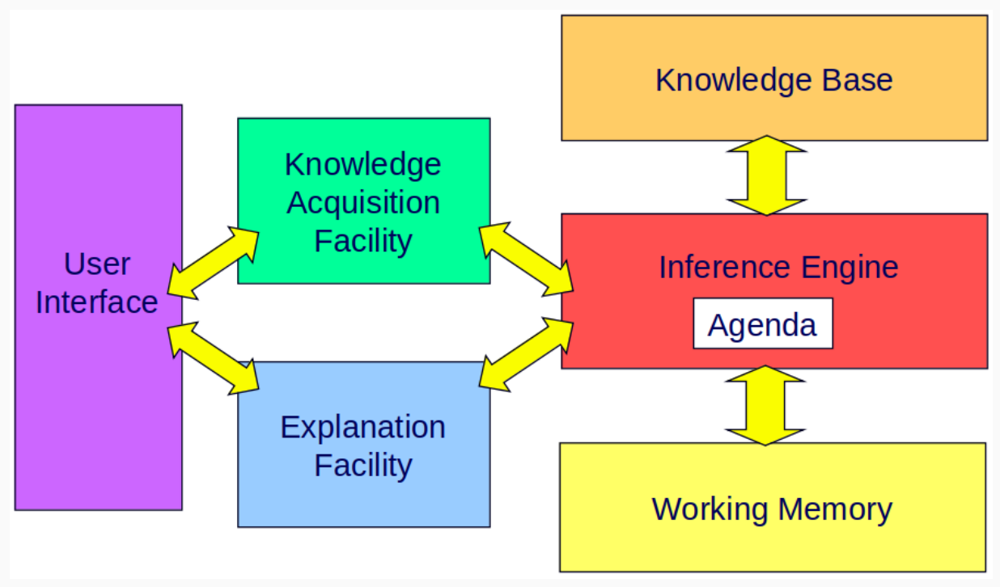

# Intelligenza artificiale e laboratorio - Parte II

## Introduzione ai sistemi esperti

### Sistemi esperti

- Definizioni di **sistema esperto** (o basato sulla conoscenza):
    - Un sistema informatico che emula l'abilità decisionale di un esperto umano in un **dominio ristretto**.
    - Un sistema informatico intelligente che usa conoscenza e procedure di inferenza per risolvere problemi che sono abbastanza difficili da richiedere dell'**expertise umana** per la loro risoluzione.
- Un sistema esperto è caratterizzato dalle seguenti proprietà:
    - Specificità (conoscenza di dominio);
    - Rappresentazione esplicita della conoscenza;
    - Meccanismi di ragionamento;
    - Capacità di spiegazione;
    - Capacità di operare in domini poco strutturati.

### Conoscenza

- È la **conoscenza e la sua rappresentazione** a essere fondamentale nei sistemi esperti.
    - Un programma è tanto più intelligente quanta più conoscenza ha, sia in termini di quantità che di qualità.
    - Un programma con più regole gestisce più casi, è quindi più intelligente.
- Il programma non è però un insieme di istruzioni immutabili che rappresentano la soluzione.
    - Ma piuttosto un **ambiente** in cui una **base di conoscenza** può essere:
        - Rappresentata;
        - Utilizzata (*reasoning*);
        - Modificata (anche a run-time).
- Ogni sistema basato sulla conoscenza deve riuscire ad esprimere due tipi di conoscenza in modo separato e modulare:
    - Conoscenza sul dominio dell'applicazione (**COSA**).
    - Conoscenza su **COME** utilizzare la conoscenza sul dominio per risolvere problemi (**CONTROLLO**).
    - Spesso non è possibile, nei sistemi esperti, distinguere tra le due.
    - Problemi:
        - Come esprimere la conoscenza sul problema?
        - Quale strategia di controllo utilizzare? 

### Architettura di un sistema esperto

- Architettura (generale) di un sistema esperto:
    - L'**esperto di dominio** dialoga con un **ingegnere della conoscenza** (processo di **elicitazione**).
        - L'esperto potrebbe dare per scontato componenti che non lo sono.
        - Elicitazione: estrazione della conoscenza dall'esperto all'ingegnere della conoscenza.
    - L'ingegnere della conoscenza inserisce delle regole nella knowledge base.
    - Il **motore inferenziale**, in base all'input di un **utente** (in termini di fatti e osservazioni), sfrutta la KB per inferire una risposta.
        - La risposta dovrebbe essere analoga a quella potenziale fornita da un umano. 

- Architettura di un sistema esperto:
    - **Knowledge base** (rule-base): mantiene la conoscenza dell'esperto come **regole condizione-azione**;
    - **Working Memory**: mantiene i fatti iniziali e quelli generati dalle inferenze.
    - **Inference engine**:
        - **Pattern matching**;
            - Confronta la parte `if` delle regole rispetto ai fatti della WM.
            - Regole che hanno la parte `if` soddisfatta sono dette **attivabili** e sono poste nell'agenda.
        - **Agenda**: elenco ordinato di regole attivabili (stack).
            - Ordinate in base alla loro priorità o in base ad altre strategie di preferenza/*conflict resolution*.
        - **Execution**: la regola in cima all'agenda è selezionata ed eseguita (*firing*).
            - Il motore inferenziale applica l'execution iterativamente finché non si trova una soluzione.
    - **Explanation Facility**: fornisce una giustificazione delle soluzioni.
        - La *reasoning chain* è la sequenza di regole che sono attivate
    - **Knowledge Acquisition Facility**: aiuta l'ingegnere ad integrare nuove regole e a mantenerle nel tempo.
    - **User Interface**: consente all'utente di interagire con il sistema esperto.
        - Ponendo problemi e ricavandone una risposta.

### Direzioni di ragionamento

- **Direzioni di ragionamento**:
    - **Forward chaining** (data-driven):
        - Ragionamento da fatti a conclusioni.
        - Non appena fatti (osservazioni) sono disponibili, questi sono usati per il matching degli antecedenti delle regole.
        - Spesso usata per real-time monitoring e controllo.
        - Esempi: CLIPS, OPS5.
    - **Backward chaining** (goal-driven):
        - Partendo da un'ipotesi (goal), regole e fatti a supporto dell'ipotesi sono ricercati fino a quando tutte le parti dell'ipotesi non sono dimostrate.
        - Usata in sistemi diagnostici.
        - Esempi: MYCIN, PROLOG.

### Domini applicativi

- **Domini applicativi** dei sistemi esperti ed esempi:
    - Interpretazione (Dendral, Hearsay-II);
    - Diagnosi (**Mycin**);
    - Monitoring (VM);
    - Planning e scheduling (Molgen);
    - Previsione (Prospector);
    - Progetto e configurazione (**R1/XCON**).
- I sistemi esperti sono preferibili quando la **componente fondamentale è la conoscenza**.
    - Non sono da preferire quando:
        - Esistono algoritmi *tradizionali* efficienti per risolvere il problema considerato.
        - L'aspetto principale del problema è la computazione, e non la conoscenza.
        - La conoscenza non può essere modellata o elicitata in modo efficiente.
        - L'utente finale è riluttante ad applicare un sistema esperto per via della criticità del task.
    - Sono applicabili ai sistemi di pianificazione, ma con molto impegno necessario.
        - Non possedendo una strategia di ricerca *intrinseca* (a la Prolog) è necessario implementarla.
        - Un sistema a regole di produzione ha la stessa potenza espressiva di una macchina di Turing.
            - Quindi è possibile risolvere qualsiasi problema risolvibile con un algoritmo tradizionale.
            - Non è sempre però il formalismo più adeguato.

### Modello ad agenti

- Il **modello ad agenti** è un'**astrazione per modularizare** il codice.
    - **Agente**: processo che persegue un certo obiettivo.
        - *Funzione agente*: corrispondenza tra sequenza percettiva fin qui ricevuta e prossima azione [Russell & Norvig].
        - Un'astrazione per sviluppare sistemi complessi.
        - La sua intelligenza è più una proprietà proiettata dall'osservatore che intrinseca all'agente.
    - **Ambiente**: dati e risorse computazionali usate dagli agenti.
