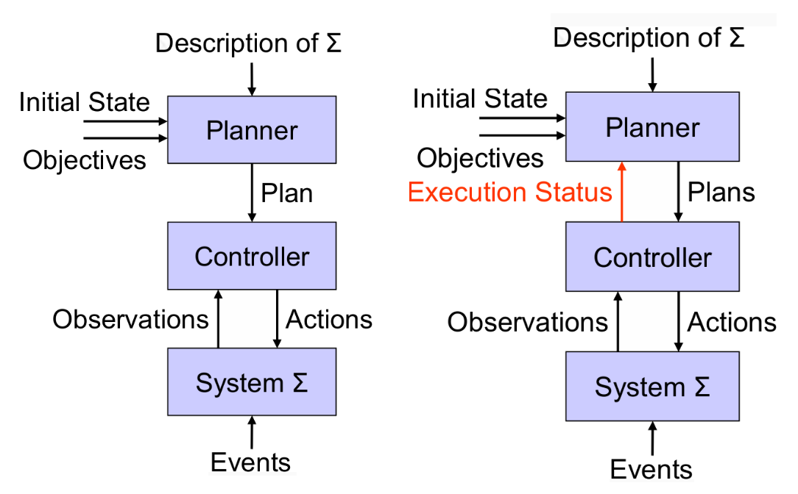

# Intelligenza artificiale e laboratorio - Parte II

## Introduzione al planning

### Planning

>**Planning**: l'arte e la pratica di pensare prima di agire.

>**Automated Planning**: selecting a **goal-leading course of action** based on a high-level description of the world.

- **Planning**: processo deliberativo che sceglie ed organizza le azioni in base all'effetto che ci si aspetta queste producano.
    - *AI Planning*: lo studio della calcolabità di questo processo deliberativo.
    - La pianificazione è un **task complesso**.
- Che cosa distingue un algoritmo da un algoritmo di IA, e un algoritmo di IA e uno specificatamente di ML?
    - Esiste un modello del problema in esame.
        - Gli algoritmi utilizzano questo modello.
        - In un algorimo non di IA, il modello e l'algoritmo sono inseparabili.
    - In ambito ML, il modello viene creato dalla rete neurale.
        - Nell'ambito del planning e di questo corso, il **modello è esplicito**.
    - Nel planning gli esempi passati non hanno molta utilità.
        - Quindi il ML non è adatto a modellare questa classe di problemi.

### Classical planning

#### State Transition System (STS)

- `def` **State Transition System** (STS): $\Sigma = (S, A, E, \gamma)$.
    - $S = \{s_1, s_2, \dots \}$: insieme finito, ricorsivamente enumerabili di stati.
    - $A = \{a_1, a_2, \dots \}$: insieme finito, ricorsivamente enumerabili di azioni.
    - $E = \{e_1, e_2, \dots \}$: insieme finito, ricorsivamente enumerabili di eventi.
    - $\gamma$: $S \times (A \cup E) \to 2^S$, relazione di transizione di stato:
        - Se $a \in A$ e $\gamma(s, a) \neq \emptyset$, allora $a$ è **applicabile** in $s$.
            - Applicabile non vuol dire che è *applicata*, ma che è *definita*.
        - Applicare $a$ in $s$ causerà una transizione di stato del sistema da $s$ a $s'$, dove $s' \in \gamma(s, a)$.
- Un STS può essere rappresentato come un **grafo diretto** $G = (N_g, E_g)$ dove:
    - $N_G = S$: l'insieme dei nodi del grafo coincidente con l'insieme degli stati di $\Sigma$.
    - $E_G$: l'insieme degli archi tale che esiste un arco $s \overset{u}{\to} s'$ (anche $\langle s, u, s' \rangle$) da $s$ a $s'$ etichettato con $u \in A \cup E$, sse:
        - $s, s' \in S$ e $s' = \gamma(s, u)$.

#### Modellare un problema di pianificazione

- Elementi necessari per modellare un problema di pianificazione:
    - Un **STS**:
        - Descrive tutte le possibili evoluzioni di un sistema.
    - Un **piano**:
        - È una struttura che traccia le azioni necessarie per raggiungere un determinato obiettivo $G$ dato uno stato iniziale $I$.
        - In prima approssimazione è un cammino da $I$ a $G$ nello spazio degli stati tracciato dall'STS.
    - **Goals**, anche di diversa tipologia:
        - Un goal state $s_g$ o un sottoinsieme di possibili goal state in $S_g$;
        - Soddisfacimento di condizioni in tutta la sequenza di stati prodotto dalle azioni;
        - Ottimizzazione di funzioni di utilità (`eg` minimizzare costi, tempi, massimizzare profitti);
        - Vincoli sulle azioni che possono essere eseguite (`eg` vincoli temporali o sequenziali).

#### Planning e Plan Execution

- **Plan Execution**:
    - Planner:
        - Data la descrizione di un STS $\Sigma$, lo stato iniziale e un goal.
        - Genera un piano che raggiunge il goal dallo stato iniziale.
    - Controller:
        - Dato un piano e lo stato corrente (funzione di osservabilità $\eta: S \to O$).
        - Seleziona ed esegue un'azione del piano.
    - STS:
        - Evolve in funzione delle azioni che vengono eseguite e degli eventi che possono accadere.
    - Assunto: gli eventi non interferiscono con le assunzioni del controller.
- **Continual Planning**: 
    - Il mondo reale può essere diverso da come è descritto nel modello $\Sigma$.
        - Gli eventi che occorrono nel sistema possono interferire con le azioni pianificate.
        - Il modello $\Sigma$ non è sempre in linea con la realtà.
            - È quindi necessario **interfogliare pianificazione e azione**.
    - Approccio più realistico: **continual planning**, inverleaving planning e plan execution.
        - Plan supervision;
        - Plan revision (o plan diagnosis);
        - Re-planning.
    - Continual planning consente un loop chiuso di feedback tra planner e controller.
        - Il **feedback** è la risposta dell'ambiente all'azione.

#### Assunzioni del classical planning

- Il **classical planning** si basa su **nove assunzioni**:
    - A0: **dominio finito**;
        - $\Sigma$ contiene un numero finito di stati.
        - Rilassare A0:
            - Per descrivere azioni che producono nuovi oggetti nel mondo.
            - Per trattare fluenti numerici.
            - Problemi: si hanno problemi di decidibilità e terminazione del pianificatore (spazio infinito).
    - A1: **dominio completamente osservabile**;
        - `def` **Completa osservabilità**: allora la funzione $\eta: S \to O$ è la funzione identità.
            - $S$ è l'insieme degli stati e $O$ è l'insieme degli oggetti osservabili.
        - Rilassare A1:
            - Per trattare stati in cui non tutto è osservabile o può essere conosciuto.
            - Problemi:
                - Poiché in genere si osserva solo un sottoinsieme della realtà, può accadere che $\eta(s) = \eta(s') = o$ con $s \neq s'$.
                - Le osservazioni sono **ambigue** perché consistenti con più stati possibili.
                - Determinare lo stato successore può essere problematico $\implies$ **belief state** (insiemi di stati possibili in un dato tempo).
                - **Conformant planning** (o in assenza di osservazioni): pianificare a prescindere dal reale stato del mondo, che può non essere noto.
                    - Si deve trovare un azione applicabile in *tutti* gli stati.
    - A2: **dominio deterministico**;
        - `def` **Dominio deterministico**: $\Sigma$ se per ogni $s \in S, u \in A \cup E$ si ha $| \gamma(s, u) | \leq 1$.
        - Rilassare A2:
            - Per pianificare con azioni che possono avere risultati alternativi.
            - Problemi:
                - Il controller deve osservare il risultato reale di ogni azione.
                - Il piano soluzione potrebbe contenere dei branch condizionali o iterativi.
    - A3: **dominio statico**;
        - `def` **Dominio statico**: se $E = \emptyset$ lo STS può essere ridotto a $\Sigma = (S, A, \gamma)$.
        - Rilassare A3:
            - Per modellare domini in cui eventi al di là del controllo dell'esecutore sono possibili.
            - Problemi: il mondo diventa non deterministico dal punto di vista del pianificatore (continual planning).
    - A4: **goal semplici**;
        - Un goal semplice:
            - Consiste in uno stato $s_g$ da raggiungere o un insieme di stati $S_g$.
                - È sufficiente che il piano porti ad uno di essi.
            - Gli stati possono essere descrizioni parziali di situazioni desiderabili (variabili).
        - Rilassare A4:
            - Per trattare vincoli su stati e piani, funzioni di utilità/costo, ottimalità.
            - Problemi: esprimere e ragionare su vincoli ulteriori nella specifica del goal rende il planning computazionalmente costoso.
    - A5: **piani sequenziali**;
        - **Piano sequenziale**: sequenza finita di azioni linearmente ordinate.
            - Una sola azione per volta è possibile.
        - Rilassare A5:
            - Facilmente rilassabile.
            - Per sfruttare le capacità degli esecutori nel caso potessero eseguire più azioni.
            - Per non introdurre vincoli che non sono parte del dominio.
            - Problemi: ragionare e gestire strutture dati più complesse.
    - A6: **tempo implicito**;
        - Le azioni e gli eventi non hanno durata, o in altri termini, hanno tutti durata istantanea (unitaria).
            - Non bisogna modellare il tempo esplicitamente.
        - Rilassare A6:
            - Per trattare azioni durative (**durative actions**), problemi di concorrenza e deadline.
            - Problemi:
                - Rappresentare e ragionare sul tempo.
                - Gli effetti delle azioni si sviluppano nel tempo, come si comporta il controller?
    - A7: **offline planning**;
        - $\Sigma$ non cambia mentre il pianificatore sta inferendo un piano.
        - Rilassare A7:
            - Per guidare il sistema verso un obiettivo.
            - Problemi:
                - Bisogna essere in grado di verificare che il piano corrente è ancora valido.
                - In caso contrario è necessario ripianificare.
    - A8: **single agent**.
        - Un solo pianificatore e un solo controller (esecutore).
        - Rilassare A8:
            - Per sfruttare meglio le risorse disponibili (più esecutori).
            - Trattare situazioni in cui più esecutori sono presenti ma non sono sotto il controllo di un unico pianificatore.
            - Problemi:
                - **Multi-agent planning**: necessità di trattare le interazioni, coordinazione, competizione, negoziazione, game-theoretic planning.

#### Classical Planning Problem

- `def` `ex` **Problema di pianificazione classica**: $P = (\Sigma, s_0, S_g)$.
    - $\Sigma = (S, A, \gamma)$ è il modello del dominio espresso come STS.
    - $s_0 \in S$ è lo stato iniziale.
    - $S_g \subset S$ è l'insieme degli stati goal.
    - `!` Data la descrizione di un dominio e uno stato iniziale, trovare un piano che porta a uno stato goal.
    - **Soluzione** $\pi$ **ad un problema** $P$:
        - Una sequenza totalmente ordinata di azioni istanziate (**ground**) $\pi = \langle a_1, a_2, \dots, a_n \rangle$.
        - Che danno origine a una sequenza di transizioni di stato $\langle s_0, s_1, \dots, s_n \rangle$ tale che:
            - $s_1 = \gamma(s_0, a_1)$.
            - $\forall k : 2 \dots n \: s_k = \gamma(s_{k-1}, a_k)$.
            - $s_n \in S_g$.
    - Si tratta di definizioni dichiarative, non specifica come raggiungere la soluzione.
- Sfide del classical planning:
    - Come rappresentare stati e azioni senza dover enumerare esplicitamente i loro insiemi?
    - Come ricercare una soluzione in modo efficiente? Quali algoritmi? Quali euristiche?
    - Come generalizzare le soluzioni?
        - Il Classical Planning è troppo semplice per essere utile nei casi pratici.
        - Ma può essere la base per soluzioni in contesti più complessi (rilassandone alcune assunzioni).

#### Proprietà di un buon algoritmo di planning

- Proprietà di un buon algoritmo di pianificazione:
    - **Correttezza** (*soundness*);
        - Un pianificatore è **corretto** se tutte le soluzioni che trova sono **piani corretti**.
            - Ovvero realmente eseguibili dal controller, questo vuol dire:
                - Tutti i goal sono soddisfatti.
                - Nessuna precondizione è *open* (cioè mancante).
                - Nessun vincolo ulteriore è violato
    - **Completezza**;
        - Un pianificatore è **completo** se trova una soluzione quando il problema è risolubile.
        - Un pianificatore è **strettamente completo** se tutte le soluzioni sono mantenute nello spazio di ricerca (i.e. eventuali pruning dello spazio non scartano soluzioni).
    - **Ottimalità**.
        - Un pianificatore è **ottimo** se l'ordine con cui le soluzioni sono trovate è coerente con una qualche misura di qualità dei piani.
        - Proprietà *nice to have*, ma non fondamentale.
            - Nel caso adottato, l'unica misura possibile è il numero di azioni.

#### Complessità della pianificazione classica

- Nei problemi decisionali (o di soddisfacibilità) si risponde o *sì* o *no*.
- È dimostrabile che il Planning è un task computazionalmente costoso ricorrendo a due problemi decisionali:
    - **PlanSAT**: esiste un piano che risolve un problema di pianificazione?
    - **Bounded PlanSAT**: esiste un piano di lunghezza $k$?
    - Per la pianificazione classica entrambi i problemi sono decidibili.
        - La ricerca avviene in spazio finito.
    - Ma se si estende il linguaggio con simboli di funzione allora:
        - Spazio di ricerca diventa infinito.
        - *PlanSAT* diventa semidecidibile.
            - Esiste un algoritmo che termina quando la soluzione esiste.
            - Potrebbe non terminare quando la soluzione non esiste.
        - *Bounded PlanSAT* rimane decidibile.
    - *PlanSAT* e *Bounded PlanSAT* sono $PSPACE \supset NP$.
        - In molti casi pratici:
            - *Bounded PlanSAT* è $NP$-complete.
            - *PlanSAT* è $P$.
            - Trovare una soluzione è meno costoso che trovare una soluzione ottima.
- La complessità del planning giustifica la **ricerca di euristiche** (possibilmente domain-independent).
    - Euristiche che guidino il pianificatore nella sintesi di una soluzione.
    - Le euristiche permettono di *tagliare* lo spazio di ricerca.
