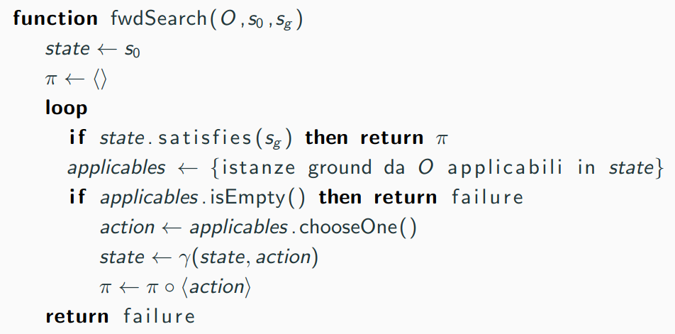
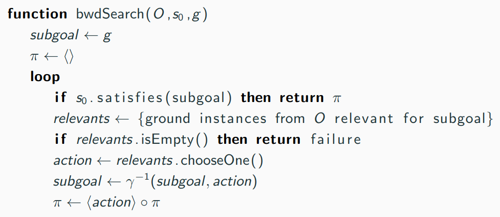
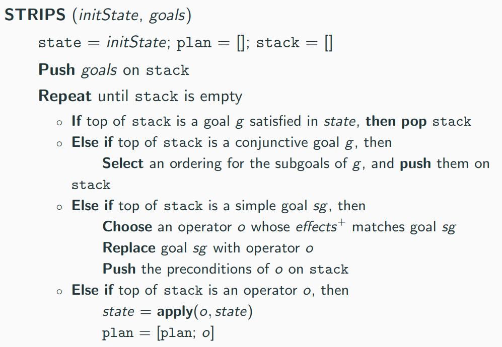
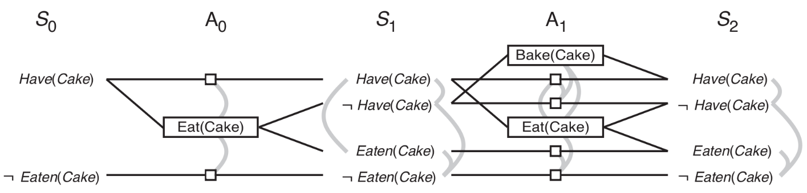
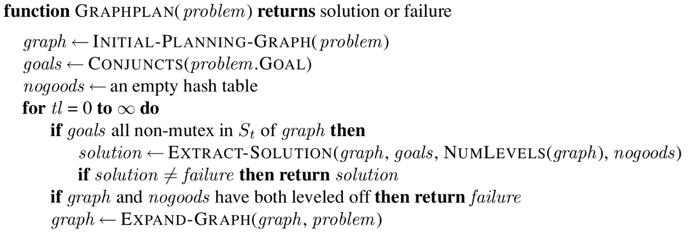

# Intelligenza artificiale e laboratorio - Parte II

## Algoritmi di pianificazione

### Algoritmi di pianificazione

- Scelte negli **algoritmi di pianificazione**:
    - **Direzione della ricerca**
        - **Progression**: in avanti dallo stato iniziale al goal;
        - **Regression**: dal goal allo stato iniziale;
        - **Bidirezionale**.
    - **Rappresentazione dello spazio di ricerca**:
        - Spazio di ricerca **esplicito**: coincide con lo spazio degli stati del STS che modella il dominio;
        - Spazio di ricerca **simbolico**: in cui ogni stato corrisponde a insiemi di stati del dominio.
    - **Algoritmo di ricerca**:
        - **Non informato**: depth-first, breadth-first, iterative deepening, ecc;
        - **Ricerca euristica sistematica**: greedy best-first, A-star, IDA-star, ecc;
        - **Ricerca euristica locale**: hill-climbing, simulated annealing, beam search, ecc.
    - **Controllo della ricerca**:
        - Euristiche per gli algoritmi informati.
        - Pruning techniques: partial-order reduction, helpful actions pruning, symmetry elimination, ecc.
- Algoritmi di pianificazione notevoli:
    - FF [Hoffmann & Nebel, 2001]:
        - Ricerca in avanti;
        - Spazio di ricerca esplicito;
        - Algoritmo di ricerca: hill-climbing;
        - Euristica inammissibile + pruning delle azioni;
        - **Subottimo** (velocità al posto di ottimalità).
    - *Fast Downward* [Helmert et al., 2011]:
        - Ricerca in avanti;
        - Spazio di ricerca esplicito;
        - Algoritmo di ricerca: A*;
        - Euristiche: LM-cut, merge-and-shrink, landmarks (ammissibili);
        - **Ottimo**.

#### Progression

- **Progression**: ricerca in **avanti** partendo da uno stato iniziale.
    - $s' = \gamma(s, o)$.
        - Calcolo dello stato successore $s'$ di uno stato $s$ rispetto all'applicazione di un operatore $o$.
    - Pianificatori basati su progression applicano ricerche in avanti tipicamente nello **spazio degli stati**:
        - La ricerca comincia da uno stato iniziale.
        - Iterativamente, viene selezionato $s$ precedentemente generato per poi generare $s'$ tramite  $\gamma(s, o)$.
        - La soluzione è trovata quando $s'$ appena generato soddisfa il goal ($s' \models s_g$ e $s_g \in S_g$).
            - $s_g$ è la **proprietà** che deve valere nello stato goal.
    - Ha il vantaggio di essere molto intuitivo e facile da implementare.

##### Strategia di progression



- **Strategia di progression** (ricerca in avanti):
    - Commento a `fwdSearch`:
        - $\pi$ è il piano.
        - $applicables$ sono i **plan operator** che si intende utilizzare.
            - Costituiscono le precondizioni soddisfatte.
        - Se $applicables$ è vuoto, si ha un fallimento, ma è un **fallimento locale**.
            - Dallo stato attuale ($state$) non è possibile andare avanti.
        - Si produce lo stato successore con l'applicazione di $\gamma$.
            - Si aggiunge l'azione attuale al piano $\pi$.
        - L'ultimo `failure` è un **fallimento globale**.
            - La soluzione non esiste.
        - `applicables.chooseOne()` rappresenta una scelta **non deterministica ma esaustiva** di un'azione.
            - Se tutte le scelte falliscono, prima o poi le si *prova* tutte.
    - `fwdSearch` è **corretto**.
        - Se la funzione termina con un piano come soluzione, questo è una soluzione al problema iniziale.
    - `fwdSearch` è **completo**.
        - Se esiste una soluzione allora esiste una traccia d'esecuzione che restituirà quella soluzione come piano.
- La progression implica alcuni svantaggi:
    - Il numero di azioni applicabili in un dato stato è in genere **molto grande**.
    - Di conseguenza anche il **branching factor** tende ad essere grande.
    - La ricerca in avanti corre il rischio di non essere praticabile dopo pochi passi.

#### Regression

- **Regression**: ricerca all'**indietro** partendo dal goal.
    - Ma occorre saper trattare **insiemi di stati** goal (anche in caso di determinismo).
    - Ci si concentra solo su quelle azioni che si è sicuri **porteranno al goal**.
- Progression e regression:
    - *P*: comincia da un singolo stato iniziale.
        - *R*: comincia da un **insieme di stati goal**.
    - *P*: quando si applica in avanti un operatore o ad uno stato $s$ si genera un unico stato successore $s'$.
        - *R*: quando da uno $s'$ si fa un passo all'indietro possono esserci **molteplici stati predecessori**.
    - *P*: lo spazio di ricerca coincide, in genere, con lo spazio degli stati (stati del dominio originati da $\Sigma$).
        - *R*: **ogni stato dello spazio di ricerca corrisponde ad un insieme di stati del dominio**.
            - Si parte da un insieme di stati $S_g$, si genera un **belief state** (insieme) da questi.
            - Da questo *belief state* si genera ulteriore *belief state* e così via finché questo non contiene $s_0$.
            - La struttura non è più quella del grafo ma una struttura ben più complicata.
- Regression mantiene un **branching factor minore** rispetto a progression.
    - Ma il fatto di dover mantenere un *belief state* può complicare le strutture dati usate dal planner e nelle euristiche.
    - Nonostante il vantaggio teorico, la ricerca in avanti è preferita a quella all'indietro.
    - È possibile sviluppare sistemi con *regression* non basati su *belief state* (`eg` STRIPS).
        - Ma questo spesso implica altri tipi di compromessi (`eg` incompletezza per STRIPS).

##### Strategia di regression



- **Strategia di regression** (ricerca all'indietro):
    - Procedimento d'alto livello:
        - Comincia dall'insieme di stati goal.
        - Iterativamente, seleziona un sotto-goal generato precedentemente, e lo *regredisce* attraverso un operatore.
            - Generando così un nuovo sotto-goal.
        - La soluzione è trovata quando il nuovo sotto-goal è soddisfatto dallo stato iniziale.
    - Ha il vantaggio di poter gestire più **stati simultaneamente** $\to$ *belief states*.
        - Quindi lo spazio di ricerca esplorato è più compatto.
        - Gestire *belief state* è anche più costoso e difficile.
    - Commento a `bwdSearch`:
        - Il punto di partenza è la proprietà (sotto-goal) che si vuole valere in qualunque stato finale.
        - Si cercano le **azioni rilevanti**.
            - In progression si cercavano le azioni applicabili, così da passare allo stato successore.
            - Le azioni rilevanti fanno *regredire* da un sotto-goal a un altro sotto-goal.
            - Si può (e spesso di deve) cercare **più azioni rilevanti** per regredire un **unico fatto**.
        - Se $relevants$ è vuoto, si ha un fallimento, ma è un **fallimento locale**.
        - `relevants.chooseOne()` rappresenta una scelta **non deterministica ma esaustiva** di un'azione.
        - $\gamma^{-1}$ è la relazione di transizione **invertita** (verso opposto).
        - Si aggiunge l'azione attuale al piano $\pi$.
            - Ma essendo il piano costruito dal fondo, l'azione viene aggiunta in testa al piano.

##### Calcolo del regresso

- **Calcolo del regresso**:
    - Il **regresso** è il *sotto-goal predecessore di un dato goal*.
    - `def` **Regresso**: $g' = \gamma^{-1}(g, a) = (g \setminus effects^+(a)) \cup pre(a)$.
        - Dato un goal $g$ e $a$ azione *ground* (rilevante) tale che $g \in effects^+(a)$.
        - Si tolgono gli *effetti positivi* e si aggiungono le precondizioni di $a$.
        - Non si considerano $effects^-(a)$, gli effetti negativi $a$.
            - Non si può sapere se un fatto valesse (esistesse) o meno prima dell'esecuzione di $a$.
            - Non va quindi aggiunto alle precondizioni.
            - *Intuizione*: si può sempre cancellare un fatto anche quando questo non esiste.
    - $g'$ è quindi il regresso di $g$ attraverso la relazione di transizione $\gamma$ e l'azione $a$.

### STRIPS

- **STanford Research Institute Problem Solver** [Fikers, Nilsson, 1971]:
    - Basato sullo **spazio degli stati**.
    - Pensato originariamente non come planner ma come *theorem prover*.
    - Introduce una rappresentazione esplicita degli **operatori di pianificazione**.
        - Si tratta di **template** che descrivono *modelli di azione*.
        - Per semplificare, quel template è poi *istanziabile* su *fatti diversi*.
    - Fornisce una operazionalizzazione delle nozioni di:
        - Differenza tra stati (distanza in termini di operatori);
        - Subgoal;
        - Applicazione di un operatore.
    - Gestisce il *frame problem*.
    - Si basa su due idee fondamentali:
        - **Linear Planning**;
        - **Means-End Analysis**.

#### Linear Planning

- **Linear Planning**:
    - Risolvere **un goal per volta**, e passare al successivo solo quando il precedente è stato raggiunto.
    - L'algoritmo di planning mantiene uno **stack dei goal**.
        - Risolvere un goal può comportare la risoluzione di sotto-goal.
        - Nello stack possono anche essere presenti operatori.
    - Conseguenze (e assunti):
        - Non c'è interleaving nel conseguimento dei goal.
        - La ricerca è efficiente se i goal non interferiscono troppo tra loro.
        - Possibilità di creazione di **piani subottimi**.
            - Conseguenza di:
                - **Interdipendenza** tra i sotto-goal.
                - **Ordinamento sfavorevole** dei goal.
                    - Non è detto che un ordine linearizzato favorevole esista.
            - Si può quindi ricadere nella **Sussmann's Anomaly**.
                - Quando è necessario **disfare parte dei goal** già raggiunti per poter risolvere l'intero problema.
                - Si deve quindi rilinearizzare.

#### Means-End Analysis

- **Means-End Analysis**:
    - Considera solamente gli aspetti rilevanti al problema (**backward**).
    - Quali **mezzi** (operatori) sono disponibili e necessari per raggiungere il goal (**fini**).
    - Occorre stabilire quali differenze ci sono tra lo stato corrente e il goal (means-ends analysis).
    - Trovare un operatore che riduce tale differenza.
    - Ripetere l'analisi sui sotto-goal ottenuti per regressione attraverso l'operatore selezionato.

#### Stati in STRIPS

- Stati in STRIPS:
    - STRIPS Language $\subset$ FOL.
        - Numero finito di simboli di predicati, simboli di costanti e **senza** simboli di funzione né quantificatori.
        - Il linguaggio permette di modellare azioni e stati.
    - Uno stato in STRIPS è una congiunzione di **atomi ground** (completamente istanziati, privi di simboli di funzione).
        - Può essere utile vedere uno stato o come un insieme di atomi, o come una congiunzione di atomi.
        - Si ottengono due semantiche, entrambe equivalenti.
    - Si può adottare sia una **semantica orientata agli insiemi** che una **orientata alla logica**:
        - Sono equivalenti, si sceglie in base alla convenienza del caso.
        - Semantica degli insiemi:
            - Un atomo ground $p$ vale in uno stato $s$ sse $p \in s$ (relazione d'appartenenza).
        - Semantica logic-oriented:
            - Uno stato $s$ soddisfa una congiunzione di letterali $g$, denotato come $s \models g$ se:
                - Ogni letterale positivo in $g$ occorre in $s$.
                - Ogni letterale negativo in $g$ non occorre in $s$.
- Relazioni fluenti e persistenti:
    - **Relazioni fluenti**:
        - Predicati che rappresentano relazioni il cui valore di verità può cambiare da uno stato al successivo.
        - Possono comparire nel conseguente di un'azione.
    - **Relazioni persistenti** (o state invariant):
        - Predicati il cui valore di verità non può cambiare per effetto di una qualche azione.

#### Plan Operators in STRIPS

- Un operatore di pianificazione in STRIPS è una tripla $o$: $(name(o), precond(o), effects(o))$.
    - $name(o)$: una espressione sintattica con forma $n(x_1, \dots, x_k)$.
        - $n$ è il nome dell'operatore e $x_1, \dots x_k$ è una lista di variabili che compaiono in $o$.
    - $precond(o)$: l'insieme di letterali che rappresentano le precondizioni dell'azione.
        - $precond^+(o)$ denota i letterali positivi.
        - $precond^-(o)$ denota i letterali negativi.
        - Una precondizione è costituita da una congiunzione di letterali positivi e negativi.
        - Sono definite sulle variabili, non si definisce un'azione ma un **template di un'azione**.
    - $effects(o)$: l'insieme di letterali che rappresentano gli effetti dell'azione.
        - Una variabile può comparire negli effetti solo se è anche menzionata nelle precondizioni (*variabili bounded*).
        - $effects^+(o)$ denota i letterali positivi (**add-list**).
            - Letterali nuovi aggiunti nello stato successore per effetto dell'azione.
        - $effects^-(o)$ denota i letterali negativi (**delete-list**).
            - Letterali rimossi nello stato successore per effetto dell'azione.

```
; esempio di plan operator di STRIPS per il mondo dei blocchi
Pick Block(?b, ?c)
Pre: Block(?b), Handempty, Clear(?b), On(?b, ?c), Block(?c)
Eff: Holding(?b), Clear(?c), ¬Handempty, ¬On(?b, ?c)
```

#### Applicabilità e transizione di stato in STRIPS

- Un'**azione in STRIPS** è una **istanziazione ground** di un **plan operator**.
- Si valuta la semantica degli insiemi:
    - Sia $s$ uno stato del mondo ($s \in S$ per un dato dominio $\Sigma$).
    - Sia $a$ un'azione (istanziazione di un plan operator $o$).
    - Si dirà che $a$ è **applicabile** in $s$ sse:
        - $precond^+ (a) \subseteq s$.
        - $precond^- (a) \cap s = \emptyset$.
    - La funzione di transizione di stato $\gamma(s, a)$ è così definita:
        - Si modifica il mondo, ovvero si produce uno stato successore di $s$ dopo aver applicato $a$.
        - Se $a$ è applicabile in $s$: $\gamma(s, a) = (s \setminus effects^- (a))  \cup effects^+ (a)$.
            - Si toglie la delete-list e poi si aggiunge la add-list.
            - Gli effetti sono **unificati**, dove l'unificazione è stata risolta nelle precondizioni.
        - Altrimenti, $\gamma(s, a)$ è indefinita.
        - $s'$ è una **riscrittura insiemistica** dello stato precedente $s$.
    - Osservazioni:
        - $S$ è chiusa in $\gamma$.
            - Quando si produce uno stato tramite $\gamma$, questo stato è sempre definito in $S$.
        - Se un atomo compare sia in $effects^- (a)$ sia $effects^+ (a)$ allora l'atomo viene effettivamente asserito come effetto dell'azione.
        - Si può togliere da un insieme un atomo che non esiste (operazione definita insiemisticamente).

#### Algoritmo di STRIPS



- Commento all'algoritmo di STRIPS:
    - $goals$ è una proprietà, una congiunzione di atomi ground (non uno stato, ma una proprietà di esso).
    - Si esegue finché lo stack non è vuoto.
        - Si lavora sempre in cima allo stack.
    - Se si ha un goal complesso in cima non soddisfatto, lo si **linearizza**.
        - Selezionando un **ordinamento** dei suoi sotto-goal, inseriti nello stack. 
        - Da questo si può intuire la natura di STRIPS come *theorem prover*.
    - Se si ha un goal semplice in cima non soddisfatto, si attua la **means-end analysis**.
        - Si cerca un operatore **rilevante**, quello che ha in $effects^+$ il goal in analisi.
    - Se si ha un operatore completamente istanziato (azione) in cima, lo si esegue.
        - Modifica lo stato corrente e lo si aggiunge al piano in costruzione.

#### Vantaggi e svantaggi di STRIPS

- Vantaggi e svantaggi di STRIPS:
    - Vantaggi:
        - Spazio di ricerca ridotto perché i goal sono considerati uno per volta.
        - Ideale quando sono indipendenti tra loro.
            - Come avviene nel *theorem proving*.
        - È **sound**.
    - Svantaggi:
        - Linear planning può produrre **piani subottimi**.
            - Se si considera la lunghezza il parametro di qualità.
            - Sopratutto quando i goal non sono indipendenti.
        - Linear planning è **incompleto**.
            - Il pianificatore potrebbe non trovare una soluzione anche quando essa è presente.
            - In particolari domini non tutte le azioni sono **reversibili**.
                - `eg` Il caso della logistica, con `Load`, `Unload`, `Fly`.

### PDDL

- **Planning Domain Definition Language**:
    - Standard di fatto per definire l'input dei pianificatori.
        - Linguaggio comune di **rappresentazione dei problemi**.
    - Derivato da STRIPS.
        - PDDL $1.0$ coincide con il linguaggio STRIPS.
    - Anche le azioni di PDDL sono **plan operator**, modelli di azioni.

#### Problemi di modellazione in PDDL

- **Problemi di modellazione in PDDL**:
    - **Potere espressivo**;
        - In PDDL non esistono i quantificatori.
        - Si possono introdurre dei predicati per rappresentare esplicitamente determinate situazioni.
            - Il progettista deve strutturare le regole affinché questi predicati abbiano un significato.
            - `!` Il **significato dei predicati** è **rappresentato implicitamente** dall'uso che si fa di questi predicati nei modelli delle azioni.
    - **Proposizionalizzazione con l'oggetto**;
        - Si finisce per duplicare regole, con piccole variazioni tra loro in termini di atomi.
        - Una soluzione è introdurre un nuovo PO che usi l'oggetto come parametro implicito.
            - `eg` `MoveToTable(b, x)` per indicare un PO relativo all'oggetto tavolo.
        - La proposizionalizzazione degli operatori potrebbe produrre **azioni spurie**.
            - `eg` `Fly(AF99, JFK, JFK)`.
            - Se il planner lo supporto, è utile esplicitare le diseguaglianze.
                - Non utilizzarle implica un *branching factor* maggiore.
                - Con **ridondanza in fase di ricerca**.

#### Pianificazione in PDDL

- Elementi di un **task di pianificazione** in PDDL:
    - **Objects**: gli oggetti che sono rilevanti per il problema considerato;
    - **Predicates**: le proprietà degli oggetti a cui siamo interessati, possono essere vere o false;
    - **Initial state**: lo stato del mondo all'inizio del problema;
    - **Goal specification**: le proprietà che devono essere vere alla fine del piano nel mondo;
    - **Actions/Operators**: i modi con cui il mondo può essere modificato.
    - *Predicates* e *actions/operators* definiscono il **dominio**.
    - *Objects*, *initial state* e *goal specification* definiscono il **problema**.
- `!` In un algoritmo di IA, problema e dominio sono **separati**.
    - Un *planner* prende in input due file:
        - **Domain file**: conoscenza di dominio indipendente dallo specifico problema che si vuole risolvere.
        - **Problem file**: conoscenza del problema specifica per il problema di interesse.
    - Su uno **stesso dominio** si possono definire un numero potenzialmente illimitato di problemi.

#### Estensione di PDDL

- Con il passare degli anni, il focus si è spostato dal classical planning a planning più complesso.
    - PDDL $1.2$:
        - Introduzioni:
            - Parametri sono variabili tipate (gerarchie di tipi) e costanti.
            - Precondizioni come congiunzioni di predicati non istanziati;
            - Effetti come due liste *add-list* e *delete-list* (preceduta dal not).
        - **Conditional effects**;
            - Stabilire che alcuni effetti sono raggiunti solo se sono vere certe condiizoni.
        - **Durative actions**;
            - Un PO si divide in tre parti:
                - Un evento iniziale;
                - Un evento finale;
                - Una condizione invariante che deve permanere per la durata dell'azione.
        - **Numeric Fluent**;
            - `eg` consente di tracciare il consumo di risorse nel tempo.
        - **Quantificatori**.
    - Bisogna distinguere ciò che PDDL può fare da un punto di vista espressivo, da quello che può fare un **planner**.
        - Avere un linguaggio potente non implica che quelle informazioni saranno **usate in maniera efficace**.
        - PDDL è un linguaggio di rappresentazione, non ha componenti algoritmiche.

### Grafi di pianificazione

- **Grafo di pianificazione** (GP):
    - Il grafo di pianificazione è una **codifica dello spazio di ricerca**, lo astrae.
    - Struttura dati speciale utile per:
        - Definire **euristiche domain-independent**.
            - Non dà garanzie sulla raggiungibilità di uno stato.
            - Ma fornisce una buona stima della distanza.
        - **Generare** un piano (graphplan).
    - GP può essere costruito con un algoritmo polinomiale.

#### Grafo di pianificazione

- `ex` **Grafo di pianificazione**: grafo orientato, aciclico, organizzato a livelli.
    - Livello iniziale $S_0$ contiene i letterali che valgono nello stato iniziale.
        - I letterali sono simboli (atomi) con segno.
        - **Un nodo per ogni fluente** (eventualmente con segno).
    - Livello di azioni $A_0$ contiene le azioni ground che possono essere applicate ad $S_0$.
        - **Un nodo per ogni azione**.
        - Le azioni le cui precondizioni sono soddisfatte al passo $0$.
    - In generale, $S_i$ e $A_i$ si alternano fino a che non si raggiunge una condizione di terminazione t.c.:
        - $S_i$ contiene tutti i letterali che **potrebbero** valere al tempo $i$.
            - Quel letterale esisterà veramente in un'esecuzione al tempo $i$ solo se sono soddisfatti certi vincoli.
                - Ma guardando il grafo non è possibile determinare se questi vincoli sono soddisfatti o meno.
            - Sia $P$ sia $\lnot P$ potrebbero appartenere ad $S_i$.
        - $A_i$ contiene tutte le azioni che **potrebbero** avere le precondizioni soddisfatte al tempo $i$.
    - Considerazioni:
        - GP traccia solo un sottoinsieme delle possibili interazioni negative.
            - Quindi un letterale che appare in uno stato $S_i$ per la prima volta, potrebbe di fatto essere producibile solo in uno stato successivo ad $S_i$.
            - Ciononostante, $i$ è una buona stima (**ammissibile**) per il letterale.
        - GP è costituito a partire da azioni ground.
            - La proposizionalizzazione può generare un'esplosione di alternative.
            - Ciononostante, GP è costruito in tempo **polinomiale**.
        - Ogni $S_i$ è un **belief state**.
            - Codifica più stati possibili e alternativi.
        - Se un letterale del goal non compare in nessun livello del GP allora il goal non è raggiungibile.
            - Se anche tutti i letterali dei goal compaiono in un qualche livello del GP non vuol dire che esiste una soluzione.
            - Ma che invece il problema è **forse** risolvibile.
        - Si tratta di una struttura che può essere **costruita a priori** e in un tempo polinomiale.
            - Ancora prima che l'algoritmo di ricerca venga eseguito.
            - Può essere estratto come una *base* da cui estrarre euristiche da usare durante la ricerca.

#### Costruzione di un grafo di pianificazione

- Nella **costruzione del grafo di pianificazione** occorre valutare che:
    - Un letterale al tempo $i$ può essere inteso:
        - Sia come Precondizione di un'azione in $A_i$.
        - Sia come atomo **persistente** (i.e., non usato).
            - La persistenza è realizzata da un'azione speciale `no-op` (sempre eseguibile).
            - Il letterale viene *copiato tale e quale* in quello successivo.
    - In ogni livello $S_i$ possono essere presenti **link di mutua esclusione tra letterali**
        - I link di esclusione sono tra nodi dello stesso layer.
        - `eg` $P$ e $\lnot P$, o anche `Have(Cake)` e `Eaten(Cake))`
    - In ogni livello $A_i$ possono essere presenti **link di mutua esclusione tra azioni**.
    - GP cresce **monotonicamente**, quindi prima o poi si **livella**.
        - Due stati consecutivi $S_i$ e $S_{i+1}$ sono identici.
        - Questo perché lo spazio di ricerca è **finito**.
            - Le azioni sono finite, gli oggetti sono finiti.
            - I modi di istanziare le azione sono finiti.
        - Estendendo il grafo si replicherà lo stesso layer di azioni, di stati, ecc.



#### Mutua esclusione

- **Mutua esclusione** tra due azioni in un dato livello $A_i$:
    - **Effetti inconsistenti**: un'azione nega gli effetti dell'altra.
    - **Interferenza**: uno degli effetti di un'azione è la negazione di una precondizione dell'altra.
    - **Competizione delle precondizioni**: una delle precondizioni di un'azione è mutualmente esclusiva con le precondizioni dell'altra.
- **Mutua esclusione** tra due letterali in un dato livello $S_i$:
    - **Complementary**: se uno è la negazione dell'altro.
    - **Inconsistent Support**: se ogni possibile coppia di azioni al livello $A_{i-1}$ che producono i due letterali sono mutualmente esclusivi.
        - Se esiste almeno una coppia di azioni non mutualmente esclusive al livello $A_{i-1}$, allora è sufficiente per dire che i due letterali non sono mutualmente esclusivi al livello $S_i$.
            - `eg` `Bake(Cake)` e *persistenza* al livello $A_1$ rendono non mutualmente esclusivi i due letterali `Have(Cake)` e `Eaten(Cake)` al livello $S_2$.

#### Complessità di un grafo di pianificazione

- La costruzione di un GP è **polinomiale** nella dimensione del problema:
    - $l$ è il numero (finito) di letterali;
    - $a$ è il numero (finito) di azioni;
    - Ogni livello $S_i$ ha non più di $l$ nodi e $l^2$ link di mutex tra letterali.
    - Ogni livello $A_i$ ha non più di $l+a$ nodi (inclusi i `no-op`) e $(l+a)^2$ link di mutex.
    - Un grafo con $n$ livelli ha dimensione $O(n(a+l)^2))$.
        - E la stessa **complessità per costruirlo**.
        - Cresce sia spazialmente che computazionalmente a livello polinomialmente.

#### Grafi di pianificazione per la stima euristica

- Euristiche per stimare il **costo di un singolo letterale**:
    - Profondità del livello in cui il letterale compare per la prima volta.
        - La stima è certamente ammissibile ma non molto precisa.
    - Lunghezza del piano serializzato estratto dal GP.
- Euristiche per stimare il **costo di una congiunzione di letterali**:
    - **max-level**: prendere il massimo livello tra quelli in cui un letterale del goal compare per la prima volta.
        - Equivale a dire, il primo livello in cui compaiono tutti i letterali del goal, anche con possibili vincoli mutex.
        - Costituisce una sottostima.
    - **Somma dei livelli**: assume indipendenza dei letterali del goal, non è ammissibile (sovrastima).
    - **Livello di insieme**: profondità del livello in cui *tutti i letterali* del goal compaiono senza che alcuna coppia di essi sia in mutex.
        - Variante di max-level.
        - È ammissibile, funziona bene quando i letterali del goal non sono indipendenti tra loro.
        - Ignora le dipendenze tra tre o più letterali.

### Graphplan

- `th` Se esiste un **piano valido** allora questo è un **sotto-grafo** del grafo di pianificazione.
    - Il problema è come estrarre questo sotto-grafo in modo efficiente.
    - I vincoli mutex tagliano alcune strade sicuramente sbagliate.
        - Ma rimangono aperti ancora diversi punti di scelta.
- Intuizioni dietro a **graphplan**:
    1. Si espande il grafo di un livello per volta fino a quanto tutti gli atomi del goal non compaiono all'interno dell'$i$-esimo stato senza che vi siano vincoli mutex tra loro.
    2. Si invoca `Extract-Solution` (backward) per cercare un piano all'interno del grafo.
        - Se `Extract-Solution` trova una soluzione termina con successo.
        - Altrimenti, se non c'è ragione per proseguire perché la soluzione non esiste certamente, termina con insuccesso.
        - Altrimenti, vai al passo $3$.
    3. Si espande il grafo ancora di un livello e si torna al passo $2$.
        - Il grafo viene espanso anche quando si è già livellato.

#### Algoritmo di Graphplan



- Commento all'algoritmo di Graphplan:
    - $nogoods$ è una lista di coppie $(i, g)$ con $i$ livello e $g$ sotto-goal.
        - Rappresenta come si sia provato a risolvere $g$ partendo da $S_i$ e si sia fallito.
            - Quindi per ogni $S_j$ con $j<i$, $g$ non vale.
            - Ma potrebbe valere per $S_k$ con $k>i$.
        - Permette di semplificare (e quindi velocizzare) la ricerca.
            - Così da non ricalcolare rami fallimentari.
            - Permette di **tagliare lo spazio di ricerca**.
        - Permette inoltre di stabilire quale sia il **criterio di determinazione**.
    - Se sia il grafo che $nogoods$ sono livellati, si restituisce un **fallimento globale**.
- Graphplan garantisce che qualsiasi **linearizzazione** di un piano calcolato sia un **piano valido**.
    - Purché nella linearizzazione si rispettino certi vincoli.
    - Un'azione che compare al livello $i$-esimo precede quelle che compaiono ai livelli successivi.
    - Tutte le azioni che appartengono allo stesso layer possono essere eseguite in **qualsiasi ordine**.
    - `eg` Con $A_0 = \{a_1, a_2\}$, $A_1 = \{a_3\}$ e $A_2 = \{a_4, a_5\}$:
        - Il piano $a_1 \: a_2 \: a_3 \: a_4 \: a_5$ è valido.
        - Il piano $a_2 \: a_1 \: a_3 \: a_5 \: a_4$ è valido.
        - Il piano $a_3 \: a_1 \: a_2\: a_5 \: a_4$ non è valido.

#### Extract-Solution e GP-Search

- `Extract-Solution` corrisponde a una **ricerca backward** in un **sottografo AND/OR** del GP.
    - **Rami OR**: gli archi che dalle azioni a un livello $A_{i-1}$ producono un letterale $p$ in un goal $g$ al livello $S_i$.
        - Si considerano sono gli effetti interessati, li si considera in disgiunzione tra tutti.
    - **Rami AND**: gli archi che dagli atomi a un livello $S_i$ rappresentano le precondizioni per un'azione al livello $A_i$.
        - Si considerano tutte le precondizioni, li si considera in congiunzione.
- `Extract-Solution` sfrutta una funzione di supporto `GP-Search`.
    - `Extract-Solution` e `GP-Search` sono **mutualmente ricorsive**.
    - Intuizione:
        - `Extract-Solution` invoca `GP-Search` su un livello di azioni e su un sotto-goal (regredito dal goal del problema).
        - `GP-Search` pianifica per il **solo livello** su cui è invocato.
            - Cerca azioni rilevanti per il sotto-goal che non siano tra loro in mutex.
            - Se ha successo, invoca `Extract-Solution` sul livello di stato precedente (regressione).
        - `Extract-Solution` andrà a considerare in congiunzione le precondizioni scelte dalla `GP-Search`.
            - Invocando poi ricorsivamente `GP-Search`, e così via.
        - Finché `Extract-Solution` non **regredisce allo stato iniziale**.

##### Extract-Solution


- Commento all'algoritmo di `Extract-Solution`:
    - Il primo fallimento è **locale**, si attua poi quindi il **backtracking**.
    - `GP-Search` viene invocato sul sotto-goal attuale con le azioni del layer $A_{i-1}$.
    - Se il piano calcolato è vuoto, si esplicita che il sotto-goal all'$i$-esimo stato non è risolvibile.
        - Lo si aggiunge ai $nogoods$ di profondità $i$.
    - Anche il secondo fallimento è locale, si attua poi quindi il backtracking.
        - Se si è provate tutte le strade possibili fallendo, la **soluzione non esiste**.
- `Extract-Solution`:
    - È un algoritmo backward di ricerca all'interno del grafo di pianificazione.
    - In generale questa ricerca potrebbe essere intrattabile e si ricorre quindi all'uso di euristiche.
    - Un modo semplice per implementare questa funzione è un algoritmo **greedy**:
        - Dato un insieme i letterali che compaiono nel goal.
        - Scegliere il letterale con il costo di livello più alto.
        - Soddisfare il letterale scegliendo l'azione con le precondizioni più *facili*.
            - `eg` Quella la cui somma o massimo dei costi di livello delle sue precondizioni è minima.
    - Ricerche successive applicate alla stessa coppia in $nogoods$ falliranno immediatamente.

##### GP-Search


- Commento all'algoritmo di `GP-Search`:
    - $g$: l'insieme di sotto-goal ancora da risolvere al livello $i$.
    - $\pi_i$: il piano in costruzione al livello $i$.
    - Se il goal attuale è vuoto:
        - Si invoca `Extract-Solution` su un **regresso**.
            - Si considera le precondizioni delle azioni valutate all'$i$-esimo layer.
            - O si ha un failure locale.
            - O la soluzione di `Extract-Solution` viene **accumulata** (in risalita) nella soluzione globale $\Pi$.
    - Se il goal attuale non è ancora vuoto:
        - Si seleziona casualmente un atomo.
        - Si trova tutti i **resolvers** per quell'atomo.
            - Si selezionano azioni che non siano mutex con azioni nel piano parziale $\pi_i$.
            - $\mu$ è l'insieme di vincoli in mutua esclusione.
        - Se l'insieme dei resolver è vuoto, si ha un fallimento locale.
        - Altrimenti se ne scegli uno in maniera non deterministica (ma esaustiva).
            - E si invoca `GP-Search` stesso, su $g$ senza gli effetti positivi di $a$.
            - Aggiungendo $a$ al piano in costruzione.

#### Terminazione di GraphPlan

- L'**espansione** del GP **non si interrompe** quando il grafo si è livellato.
    - Un livello di stato può essere il risultato dell'applicazione di più azioni in parallelo.
    - Quando l'esecuzione è però sequenziale, l'applicazione multipla di azioni non è accettabile. 
        - Bisogna espandere il grafo in modo che comprenda una **soluzione sequenziale**.
    - Si deve *allargare* il grafo per permettere di ospitare il piano sequenziale che si sta cercando.
        - `eg` Nel problema del trasporto aereo, bisogna espandere il grafo per $4n − 1$ volte.
            - L'aereo può portare un solo pacco (dei quattro) alla volta.
            - `load`, `fly`, `unload` e `fly-back` (tranne che per l'ultimo pacco).
    - Bisogna quindi stabilire un **criterio di terminazione** per fermare l'espansione del grafo.
        - Se `Extract-Solution` non trova una soluzione, deve esistere un sottoinsieme di atomi del goal non raggiungibili.
            - Sono quindi marcati come *no-good*.
        - Allora, se è possibile che vi siano **meno no-good** al livello successivo, si deve continuare a espandere.
        - Altrimenti, quando sia il grafo che i $nogoods$ si sono livellati senza che una soluzione sia stata trovata, si può **concludere per fallimento**.
    - Se si possono trovare **meno** $nogoods$ nelle invocazioni successive, allora ha senso espandere il grafico.
        - I $noogods$ fanno quindi da discriminante.
    - `!` Si **espande il grafo finché si ha la speranza che l'espansione produca nuova informazione**.

##### Livellamento del grafo e dei nogoods

- Se sia il grafo che i $nogoods$ sono **livellati**, si raggiunge il **criterio di terminazione**.
    - Bisogna dimostrare che l'algoritmo termini sempre anche quando non è presente una soluzione.
    - **Proprietà monotone** dei grafi di pianificazione importanti:
        - I **letterali crescono monotonicamente**;
            - Una volta che un letterale compare in un livello, sarà presente in tutti i successivi.
            - Sarà presente un'azione `no-op` che ripercuoterà quell'atomo nei livelli successivi.
        - Le **azioni crescono monotonicamente**;
            - Una volta che un'azione compare in un livello sarà presente anche nei successivi (da sopra).
        - Le **relazioni di mutex decrescono monotonicamente**;
            - Se due azioni (o due letterali) sono in mutex in un livello, allora lo sono anche in tutti i precedenti.
            - Ma potrebbero non essere in mutex in un qualche livello successivo.
        - I **$nogoods$ decrescono monotonicamente**.
            - Se un sottoinsieme di atomi del goal non è raggiungibile in un dato livello di stato $S_i$, allora non lo è nemmeno in nessuno dei livelli precedenti;
            - Però potrà diventarlo in qualche livello futuro (da sopra).
    - *Dimostrazione*:
        1. Dato che le azioni e i letterali **crescono** monotonicamente, e dato che sono entrambi insiemi finiti, deve esistere un livello in cui l’insieme dei letterali è uguale a quello dei letterali del livello precedente;
        2. Poiché i mutex e $nogoods$ **decrescono** monotonicamente e poiché non possono esserci meno di zero mutex e $nogood$, deve esistere un livello con lo stesso numero di mutex e $nogood$ del precedente;
        3. Una volta che il grafo ha raggiunto la situazione in cui sia i livelli che i $nogoods$ si sono **livellati**, se uno dei letterali del goal è mancante o in mutex con un altro letterale del goal, allora si può concludere che non esiste una soluzione.

#### Proprietà di GraphPlan

- Proprietà di GraphPlan:
    - GraphPlan è **corretto** e **completo**.
        - Restituisce *failure* solo quando il problema di pianificazione non è risolubile.
            - Altrimenti restituisce una soluzione espressa come una **sequenza di insieme di azioni**.
        - L'algoritmo termina sempre anche quando la soluzione non esiste.
    - GraphPlan è un **Partial-Order Planner** (**POP**).
        - Azioni allo stesso livello (non legate da vincoli di mutex per costruzione) possono essere eseguite in parallelo.
        - Qualunque linearizzazione delle azioni che rispetti i vincoli di ordinamento imposti dai livelli è una possibile soluzione *classica*.
