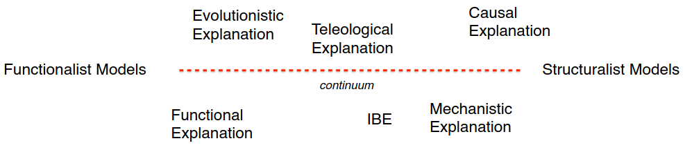

# Intelligenza artificiale e laboratorio - Parte III

## Introduzione ai sistemi cognitivi artificiali

- C'è bisogno di sistemi in grado di operare in ambienti **non controllati** e **complessi**.
    - Come con informazione incompleta, incertezza, cambiamento e con task non-deterministici.
    - Le attività più facili per sistemi biologici sono le più difficili per sistemi artificiali.
- Due modi per replicare una **facoltà cognitiva**:
    - Inventare una soluzione **computazionale**;
    - Prendere ispirazione dalla natura (**cognitive** o **bio-inspired systems**).
- Lo spazio 2D della modellazione cognitiva [Vernon, 2014]:
    - *Abstraction level*: da *low* a *high*;
    - *Inspiration*: da *computational* a *biological*.
    - Si possono mappare diversi tipi di modelli o approcci su questo spazio.
- Scienze cognitive e intelligenza artificiale sono due facce della stessa medaglia.
    - Esagono delle scienze cognitive: filosofia, linguistica, antropologia, informatica, psicologia.
    - *Cibernetica*: studio organico di macchine di tipo organico e di tipo artificiale.
    - `!` Da sistemi artificiali biologicamente ispirati si possono ricavare **spiegazioni** per i sistemi biologici.
        - **Dalla cognizione umana a quella artificiale** (e all'indietro, in loop).
        - In un processo circolare di ispirazione e spiegazione.
        - Si potrebbero sviluppare sistemi artificiali senza nessuna assunzione esplicativa (AI mainstream).
        - Un **sistema artificiale cognitivo** deve avere qualche tipo di **potere esplicativo**.

### Prospettive storica

- Due prospettive storiche:
    - **Cognitivismo**:
        - Focus su funzioni esecutive di alto livello (ragionamento, pianificazione, linguaggio);
        - Rappresentazioni strutturate (*physical symbol system*) [Simon & Newell, 1976];
        - **Prospettiva architetturale** (relativa all'integrazione di diverse funzioni);
        - Ispirazione cognitiva (**heuristic-driven approach**).
    - **Nouevelle AI** (emergentista):
        - Focus su percezione;
        - Rappresentazioni distribuite;
        - **Prospettiva di singolo sistema**;
        - Ispirazione biologica.
- Fasi storiche dell'AI:
    - *AI deli albori*: cognitive or biological inspiration for the design of *intelligent systems*.
    - *AI moderna*: *intelligence* in terms of optimality of performance (narrow tasks).

#### Sistemi cognitivamente ispirati di rilevanza storica

- **General Problem Solver** (GSP) [Simon, Shaw & Newell, 1959]:
    - Sistema (cognitivamente ispirato) in grado di dimostrare semplici teoremi logici.
    - Le strategie erano ispirate in modo esplicito ai protocolli verbali umani.
    - GPS implicava l'euristica mezzi-fini (**means-ends analysis**).
        - In cui un problem solver confronta uno stato di cose con il gol da raggiungere.
        - E cerca di **minimizzare la distanza** tra questi stati tramite appositi operatori.
        - La rappresentazione del problema da risolvere è data in termini simbolici.
    - Simon introduce il concetto di *bounded rationality*.
        - Il fatto di essere dei *buoni approssimatori* permette di sopravvivere.
        - Ma non è accettabile l'assunzione di un agente *completamente* razionale.
            - Assunzione della *teoria dell'utilità attesa*.
- **Reti semantiche** [Quillian, 1968]:
    - Un sistema *psicologicamente plausibile* della memoria umana.
        - La memoria umana è assiativa in natura.
    - Rappresentando i concetti in un **grafo** e la loro **attivazione** (tramite *spreading activation*) tramite meccanismi di propagazione dell'informazione rende possibile vedere quali concetti vengono utilizzati in vari compiti.
- **Frames** [Minsky, 1975]:
    - Framework usato per rappresentare **conoscenza di senso comune**, di default, tipica.
    - Tale organizzazione permise le prime forme di ragionamento automatico al di là della deduzione classica.
        - Ragionamento non-monotono.
- **Scripts** [Shank & Abelson, 1977]:
    - Strutture dati per rappresentare **conoscenza di senso comune legata agli eventi**.
    - Usata in NLP per permettere ad agenti intelligenti di rispondere a domande su semplici storie.

### Paradigmi di progettazione

>Quando un sistema biologicamente/cognitivamente ispirato ha un **potere esplicativo** rispetto al sistema naturale preso come fonte di ispirazione?

#### Paradigmi di progettazione

- Approccio **funzionalista**:
    - Introdotto da Hilary Putnam nel contesto della filosofia della mente.
    - Postula la sufficienza di una **equivalenza debole** tra processi cognitivi e procedure di AI.
    - Le procedure di AI devono avere lo stesso **ruolo funzionale** dei corrispondenti processi cognitivi da modellare.
    - **Realizzabilità multipla** (funzioni cognitive possono essere implementate in modi diversi).
    - **Equivalenza a livello di proprietà macroscopiche di un comportamento intelligente**.
        - Basato sul fatto che sistema naturale e artificiale condividono le stesse specifiche di I/O.
    - Svantaggi:
        - Se l'equivalenza è così debole non è possibile interpretare i risultati di un sistema.
            - Come si interpreta il **fallimento** di un sistema?
        - Un modello puramente funzionalista è una **black box**.
            - Si può confrontare sistema artificiale e naturale solo esclusivamente rispetto al fatto che gestiscano lo stesso tipo di input e generino un output analogo.
            - Si fornisce un tipo di spiegazione esclusivamente di carattere *funzionalista*.
        - Sistemi puramente funzionalisti non sono **modelli computazionali della cognizione**.
            - Non hanno alcun potere esplicativo rispetto al sistema naturale d'ispirazione.
            - `eg` Un jet può volare ma non è buon modello di spiegazione per come volino gli uccelli.
        - **Errori non umani**:
            - I sistemi funzionalisti tipicamente fanno errori che gli umani non commetterebbero.
            - `eg` Single pixel attack, Google Photos e gorilla, ecc.
            - Mancano spesso di *commonsense knowledge*.
            - Si manifestano spesso problemi di composizionalità.
    - I sistemi di IA attuali (simbolici, neurali, ecc) sono di questo tipo.
        - Sistemi intelligenti molto potenti ma che non hanno alcun potere esplicativo rispetto a come gli umani risolvono lo stesso tipo di problemi.

#### Approccio strutturalista

- Approccio **strutturalista**:
    - **Equivalenza forte** tra sistemi cognitivi e procedure di AI.
    - Focus non solo sulla **organizzazione funzionale** dei processi.
        - Ma anche sui **vincoli** che garantiscono una computazione *human-like* ($\neq$ *human-level*).

#### Approcci funzionalisti e strutturalisti

>If we do not formulate any restriction about a model we obtain the functionalism of a Turing machine. If we apply all the possible restrictions we reproduce a whole human being [Pylyshyn, 1979].

- **Paradosso di Wiener**: the best material model of a cat is another or possibly the same cat.
    - Bisogna avere **approssimazioni**, non si può modellare un intero sistema biologico.
- Questi due paradigmi sono considerabili gli **estremi di un continuo**.
    - Tra il livello esplicativo del funzionalismo (basato su una analogia **macroscopica** tra relazioni di I/O nei sistemi naturali e artificiali) e quello **microscopico dei modelli strutturalisti** ci sono molti possibili modelli strutturali con diverso potere esplicativo.
    - Bisogna stabilire dei metodi per determinare come un modello possa essere posizionato in questo spettro.

#### Minimal Cognitive Grid

- **Minimal Cognitive Grid** [Lieto, 2021]:
    - Un framework di valutazione **non soggettivo** e **graduato** che permette un'analisi sia **qualitativa** che (soprattutto) **quantitativa** riguardo l'**adeguatezza cognitiva** e le **performance human-like** di sistemi artificiali in un setting **singolo** o **multi-tasking**.
    - Permette di stabilire se un sistema artificiale sia più o meno biologicamente ispirato rispetto un altro.
    - Dimensioni (solo tre, minime):
        - Il **rapporto** tra elementi **funzionali/strutturali** presenti nel sistema;
        - **Generalità**;
        - **Performance match** (inclusi errori e misure psicometriche).

### Modelli strutturali

- Sia l'approccio cognitivista che quello emergentista permettono la realizzazione di **modelli strutturali della cognizione**.
    - La capacità esplicativa di un modello **dipende dai vincoli** esercitati su esso.
    - In base al tipo di paradigma, i vincoli possono essere a *livello cognitivo* o a *livello biofisico*.
- `ex`: Punti fondamentali:
    -  I sistemi cognitivi artificiali hanno un potere esplicativo rispetto a sistemi naturali presi come fonte di ispirazione solo se sono **modelli strutturalmente validi**.
        - Modelli **realizzabili in modi diversi** e **modellabili a diversi livelli di astrazione**.
    - Non si deve assegnare a output funzionali spiegazioni strutturali.
    - I sistemi cognitivi artificiali possono fungere da **esperimenti computazionali**.

- Un approccio cognitivo può essere importante anche in una prospettiva di AI *pura*.
    - Alcune forme di ragionamento sono di fatto delle euristiche.
    - `eg` Linda's problem.

### Modelli di razionalità

- **Modelli di razionalità**:
    - Teoria dell'utilità attesa (Morgenstern, Von Neumann);
    - Bounded rationality (Simon, cognitivamente ispirate):
        - Bias cognitivi (Kahneman, Tversky);
        - Euristiche (Gigernzer).
            - Bounded-Resource Rationality (Lieder, Griffiths).

#### Gerarchia di Marr

- **Gerarchia di Marr**: livello di astrazione/livelli di comprensione e analisi di un sistema artificiale.
    - Computational Theory: goal, logic, strategy, model.
    - *Representation & Algorithm*: I/O representation, transformation algorithm.
    - *Hardware/Software Implementation*: Physical realization.
    - Piani in accoppiamento sciolto, con un passaggio da un livello all'altro tramite **scelte di modellazione**.
    - Applicabile a qualsiasi sistema computazionale (non solo cognitivi).
        - `eg` Registro di cassa:
            - *Computational level*: teoria dell'addizione.
            - *Representation & Algorithm*: numerali arabi (scelta di design).
            - *Hardware/Software Implementation*: numeri binari codificati da stati elettrici.
- **Modellare sistemi cognitivi**:
    - Un problema deve essere modellato **prima al livello della teoria computazionale**.
        - Senza riferimento ai livelli di astrazione più bassi.
    - Successivamente: algoritmi e rappresentazioni.
    - Infine: valutare tre diverse implementazioni possibili.
    - Marr (1982): per lo studio del volo è necessario studiare l'aerodinamicità, non le piume dell'uccello.

#### Resource-Bounded Rationality

- **Resource-Bounded Rationality** (Lieder, Griffiths):
    - La Bounded Rationality si descrive a un livello descritto più alto.
    - Vincoli (anche fisico, biochimichi, fisiologici), aggiungendo un livello **strutturale** ulteriore.
    - Fornisce *recipe* (astratti) su come costruire dei sistemi che vogliono avvicinarsi alla componente strutturalista.
    - Esiste una **classe di soluzioni inaccessibili** da sistemi con risorse limitate e razionalità limitata.
- I cinque step del paradigma di Resource Rationality [Lieder & Griffiths, 2019]:
    1. Inizia con una descrizione a livello computazionale (funzionale) di un aspetto della cognizione formulati come problemi e soluzioni. 
        - Si individua la **teoria di riferimento** senza stabilire vincoli ulteriori.
    2. Individua la classe di algoritmi che l'architettura computazionale della mente potrebbe usare per risolvere il problema.
        - Ma anche il costo delle risorse computazionali usate da questi algoritmi.
        - E l'utilità di approssimare sempre più accuratamente la soluzione corretta.
        - Il modello incorpora a questo punto già dei vincoli specifici.
    3. Trova l'algoritmo in questa classe che offra un **trade off ottimale** tra risorse e l'accuratezza d'approssimazione.
        - Non si tratta di un'ottimalità in termini di Von Neumann, ma **rispetto ai vincoli**.
    4. Valuta le predizioni del modello contro dati empirici ottenuto da altre fonti.
    5. Rifinisci la teoria computazionale (passo $1$) o l'architettura computazionale assunta e i suoi vincoli (passo $2$). 
        - Così da indirizzare discrepanze significative per ottenere un modello *resource-rational* raffinato.
        - Si reitera o si stoppa se le assunzioni del modello sono sufficientemente realistiche.
- La resource-bounded permette il dialogo tra più discipline.
    - Un modello con pochi vincoli biochimici non può dialogare molto con le neuroscienze.
