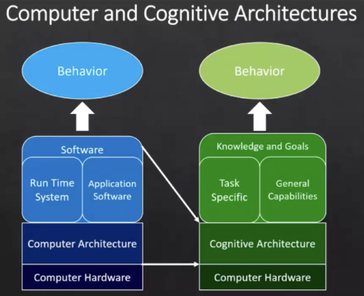
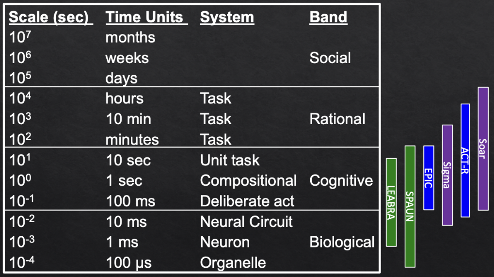
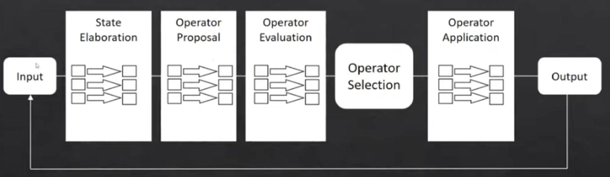
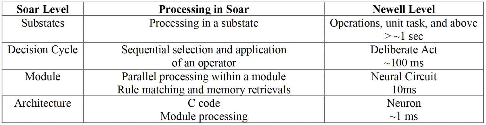
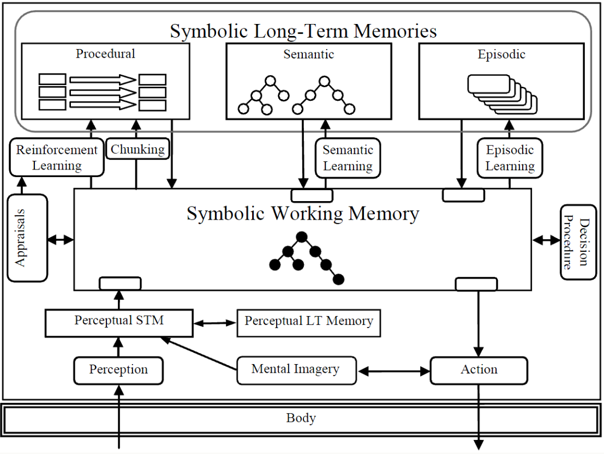

# Intelligenza artificiale e laboratorio - Parte III

## Architetture cognitive

### Introduzione alle architetture cognitive

- Idea di fondo delle **architetture cognitive**: se si vuole costruire un sistema artificiale che può esibire più abilità contemporaneamente non lo si può fare **integrando** più sottosistemi che si dedicano a una sola abilità.
    - Si sviluppa l'**integrazione by-desing** in un'ottica **resource-bounded**.
        - Gli esseri umani sono agenti intelligenti fortemente ottimizzati in un'ottica di risorse.
    - Bisogna valutare già in fase iniziale i **meccanismi usati contemporaneamente in più task**.
- Si vuole fornire una **teoria unificata della cognizione umana**.
    - Si assume che la cognizione emerge da **meccanismi computazionali task-independent**.
        - Si ha un set limitato di euristiche, ottimale in un ottica RR.
        - Questi meccanismi vengono usate in un'ottica **multimodale**.
    - Dualità delle architetture cognitive:
        - Le architetture cognitive sono **modelli astratti della cognizione**.
        - Le architettura cognitive sono **istanziazzioni software** di questi modelli.
            - Queste architetture si distinguono per tipi di vincoli presenti durante l'esecuzione.
    - Introdotti storicamente per tre motivi:
        1. Catturare a livello computazionale **meccanismi invarianti** della cognizione umana;
        2. Per individuare le **basi ontogenetiche** per lo sviluppo delle capacità cognitive;
            - La capacità di un sistema di autogenerarsi (focus sistemi emergentisti).
        3. Raggiungere il livello di intelligenza umana **in più task**.
    - Le architetture cognitive funzionano da **middleware** tra l'hardware computazionale e conoscenza-goal.



#### Evoluzione dello sviluppo di architetture cognitive

- Evoluzione dello sviluppo di architetture cognitive:
    - L'evoluzione ha seguito quello generale dall'IA.
        - Simboliche $\to$ emergentiste $\to$ ibride.
    - A oggi (survey recente) indica la presenza di 84 architetture cognitive.
        - Testate su attività cognitive centrali (perception, action selection, memory, ecc).
    - Questi sistemi differiscono in base ai **vincoli**.
        - **Modellazione biologica**: LEABRA, SPAUN, ecc.
            - Lavorano sua attività dai 10 millisecondi a scendere.
            - Focus sui meccanismi di **information processing** per lo scambio di segnale all'interno di una rete neurale (biologica).
            - Eg: neuron-neuron computation, analisi del segnale, danni alla rete, funzioni d'attivazione.
        - **Modellazione psicologica**: ACT-R, EPIC, CLARION, LIDA, CHREST, ecc.
            - Cercano di fare predizione su tempistiche e errori umani.
            - Lavorano su attività che intercorre tra 100 millisecondi e 10 secondi.
        - **AI Functionality**: SOAR, Companions, Sigma, ICARUS, CogPrime, PUG, ecc.
            - Cercano di raggiungere intelligenza human-level su più task.
            - Utilizzano il minor numero di vincoli di carattere strutturalista.
            - Sono più vicini all'ambito 
            - Non hanno un vero scopo di natura esplicativa.

#### Scala temporale dell'azione umana di Newell



- **Scala temporale dell'azione umana di Newell**:
    - Distinzione tra **system one** (implicito) e **system two** (esplicito):
        - System one: tutti i processi attivati per reazione (biological band).
        - System due: tutti i processi logici della cognizione (cognitive band).
    - Meno ricerca in ambito sociale e razionale.
        - Si riferisce a che meccanismi l'agente individuale deve implementare per aver comportamenti sociali.
        - `eg` L'emergere di cultura in uno swarm robotico.
        - Un differente contesto può creare culture diverse in un insieme di sistemi artificiali?
    - Qualsiasi tipo di attività della cognizione è mappabile su questa scala temporale.
        - Unit task (10s): metaragionamento, ragionamento complesso, analogie complesso, planning.
        - Compositional task (1s): ragionamento semplice, processamento del linguaggio, skilled behavior.
        - Atti deliberati (100ms): primitive internal action, access long-term memories.

#### Common Model of Cognition

- **Common Model of Cognition** (o **Standard Model of Mind**):
    - Una specifica astratta di elementi necessari per qualsiasi architettura human-like su task non specifici.
    - Elementi elecitati da questo tipo di analisi:
        - Distinzione tra diversi **tipi di memoria**:
            - Memoria di lavoro (STM): buffer.
                - *7 is the magic number*.
            - Memoria di lungo termine (LTM): memorie sedimentate.
            - La distinzione tra questi due tipi di memoria è centrale.
            - Si ha quindi un elemento di **LTM procedurale** e uno di **LTM dichiarativa**.
            - Questi due elementi interagiscono continuamente con la **Working memory**.
        - La WM fa da buffer anche tra il modello **percettivo** e quello motorio.

#### General Problem Solver e SOAR

- **General Problem Solver** (GSP) [Simon, Shaw & Newell, 1959]:
    - Primo esempio di architettura cognitiva.
    - Sistema completamente simbolico.
    - Il goal viene **diviso in sottogoal**.
        - Si cercano degli operatori per risolvere il sottogoal.
        - Si fanno confronti simbolici nello spazio degli stati tra le varie operazioni possibili.
    - La divisione in sottogoal corrisponde all'**euristica mezzi fini**.
        - Si tratta di un meccanismo generale.
    - Al tempo, era difficoltoso memorizzare le varie distanze calcolate.
- **SOAR**:
    - *State, Operator and Result*.
    - Creata da Newell, anche questa puramente simbolica.
    - Più vicina allo spettro funzionalista, ma mantiene alcuni **vincoli cognitivi**.
        - Rispetto dei vincoli della Newell's Time Scale of Human Action.
        - Divisione tra LTM e STM, come nel CMC.
            - La divisione è il primo **vincolo congitiviamente fondato**.
            - La STM si interfaccia con moduli della parte percettiva.
            - Oggigiorno, modello della memoria più complesso.
        - Distinzione tra asserzioni e produzioni.
        - Sistema di preferenze nella selezione degli operatori per i sottogal.
            - Ereditato da GPS.
        - **Universal subgoaling** in uno **spazio dei problemi**.
            - Derivato dalla natura puramente simbolica del sistema.
    - Il primo modello generale di sistema intelligente capace di risolvere più task partendo da queste assunzioni.
    - Generalmente i sistemi simbolici sono stati poco attenti a vincoli di carattere biologico.

#### Society of Mind e Subsumption Architecture

- **Society of Mind** [Minsky]:
    - Modellazione di conoscenza di senso comune.
    - **Livelli diversi** di problem solving.
        - Livelli connessi dalla commonsense knowledge.
        - La CSK unisce la percezione (di basso livello) e la cognizione (alto livello).
    - Livelli di problem solving nell'architettura:
        - Social thinking.
        - Livello di self-reflection (riflessione rispetto ai propri piani).
        - Reflective thinking;
        - Deliberate thinking (processo S2);
        - Reazione appresa (processo S1);
        - Reazione istintiva (processo S1).
    - Influente per l'introduzione di layer crescenti di problemi da risolvere.
        - Ma troppo generica come architettura cognitiva.
- **Subsumption Architecture** [Brooks]:
    - I sistemi robotici pre-Brooks vedevano visione-ragionamento-azione come moduli in sequenza.
    - All'interno di ogni layer si inseriscono tutti e tre i layer e si uniscono i vari layer.
        - Brooks viene influenzato dai layer di Minsky (suo collega), anche se il primo è fortemente emergentista.
    - Esempi dei layer:
        - Seek: VRA.
        - Explore: VRA.
        - Wander: VRA.
        - Avoid: VAR.
    - All'interno di ogni livello la conoscenza viene rappresentata con uno speciale tipo di automi a stati finiti.
    - **Sussunzione**: il livello superiore implica quello precedente.
        - Esplorare implica vagare, vagare implica evitare.
    - *Creature hypothesis*: se si riesce a modellare componenti reattive si riuscirà a modellare comportamenti più d'alto livello.
    - Fortemente emergentista, non si deve avere un modello del mondo.
        - In rottura rispetto ai sistemi esperti del tempo.
        - *The world is my model* (modello autocostruito).
        - Roomba, il sistema robotico più venduto della storia, si basa su questa architettura.
        - Storicamente i sistemi emergentisti non riescono però a raggiungere capacità cognitive d'alto livello.
            - Non si supera la componente di navigazione.
            - Ma neppure l'approccio simbolico standard (PSSH).

#### Architetture cognitive cognitiviste

- **Architetture cognitive cognitiviste**:
    - Modello computazionale generale:
        - Non *domain-specific* e *task-specific*.
    - Architettura cognitive + conoscenza $=$ **modello cognitivo**.
        - Un tempo la conoscenza era inserita manualmente, oggi può essere appresa.
    - Utilizzo per:
        - Attenzione, memoria;
        - Problem solving, decision making;
        - Apprendimento, ecc.
    - Incorporazione di un'**ipotesi scientifica** riguardo aspetti della **cognizione umana** che sono:
        - Relativamente **costanti nel tempo**.
        - Relativamente **indipendenti dal task**.
    - Commitment ai formalismi per:
        - **Memorie** di breve e lungo termine per memorizzare credenze, obiettivi e conoscenza dell'agente.
        - **Rappresentazione** e organizzazione di strutture interne alla memoria.
        - **Processi** funzionali che operano su queste strtture.
        - Linguaggi di **programmazione** per costruire sistemi che incorporino le assunzioni architetturali.

#### Architettura cognitive emergentiste

- **Architettura cognitive emergentiste**:
    - Approcci emergenti focalizzati sullo **sviluppo** (scaffolding). 
        - Da un stato primitivo a uno stato cognitivo completo, lungo la lifetime del sistema.
        - Piaget e Vygotsky.
    - L'architettura cognitiva è la **configurazione filogenetica** del sistema.
        - Base dell'ontogenesi: crescita e sviluppo.
            - Abilità innate;
            - Conoscenza core.
        - Una struttura in cui incorporare meccanismi per:
            - Percezione, azione;
            - Adattazione, anticipazione, motivazione;
            - Lo **sviluppo** di tutti questi meccanismi.
    - Focus su:
        - **Autonomy-preserving anticipatory and adaptive skill construction**.
        - La **morfologia** del corpo fisico in cui l'architettura è incorporata.
    - Tipicamente *embodied*.

#### Desiderata per le architetture cognitive

- **Desiderata per le architetture cognitive**:
    - *Desiderata per le architetture cognitive* [Sun, 2004]:
        - Realismo ecologico.
            - Gestire goal conflittuali.
            - Svolgere problemi quotidiane.
            - Devono essere embodied.
        - Realismo bio-evolutivo:
            - L'intelligenza umana è riconducibile a modelli di intelligenza animale (backward).
            - Modelli di intelligenza umana pre-Sapiens (pre-linguistica).
        - Realismo cognitivo:
            - Prendere spunto dalla psicologia umana, neuroscienze umane e filosofia.
        - Prospettive precedenti.
            - Basarsi su sistemi precedenti.
            - Sussumere sistemi precedenti.
            - Superare sistemi precedenti (capacità predittiva migliore).
        - Caratteristiche comportamentali:
            - Agire e reagire nel modo.
            - Schemi concettuali semplici.
            - Semplice pesature delle alternative (preferenze).
            - Gestire sequenze temporali di azioni.
            - Comportamenti di routine gradualmente-appresi.
            - Adattazione trial-and-error.
        - Caratteristiche cognitive:
            - Apprendere in modo implicito ed esplicito.
            - Apprendimento simbolico esplicito.
            - Modularità funzionale o fisica.
    - *Cognitive architectures: research issues and challenges* [Langley et al, 2009]:
        1. Recognition & categorization;
        2. Decision-making & choice;
        3. Perception & situation assessment;
        4. Prediction & monitoring;
        5. Problem solving & planning;
        6. Reasoning & belief maintenance;
        7. Execution & action;
        8. Interaction & communication;
        9. Remembering, reflection & learning.
    - *The importance of cognitive architecture* [Sun, 2007]:
        1. Perception;
        2. Categorization;
        3. Multiple representation;
        4. Multiple types of memory;
        5. Decision making
        6. Reasoning;
        7. Planning;
        8. Problem solving;
        9. Meta-cogniton;
        10. Communication;
        11. Action control and execution;
        12. Several types of learning;
    - L'assunto generale è lo **studio apriori di un'architettura minima** che risparmia le risorse.

### Architettura SOAR

- **Architettura SOAR**:
    - Comportamento intelligente visto come occorrente in **problem spaces**.
        - Comportamento intelligente basato su un **ciclo di selezione e applicazione** degli **operatori** finalizzato a cambiare lo **stato** iniziale.
        - In piena prospettiva di natura simbolica (cognitivista).
        - Si tratta quindi di **Problem Space Reasoning**.
    - Bisogna codificare la **conoscenza** che va ad **operare sugli stati**.
        - La conoscenza può essere di vario tipo (dominio, controllo, ecc).
        - SOAR si basa sulla **knowledge-level analysis**.
        - La conoscenza viene aggiunta continuamente, non si può fare (offline) planning.
        - La conoscenza viene codificata formalmente nella memoria a lungo termine.
    - Allo stato iniziale si applica della conoscenza.
        - Dopo l'applicazione si avranno più **operatori di scelta** (ammissibili).
        - Means-end analysis ereditata da GPS.
        - Bisogna stabilire quale operatore scegliere.
    - Quando si ha troppa conoscenza o troppa poco, SOAR va in **impasse** (termine tecnico).
        - Quando si va in impasse, viene iniziata una **procedura di apprendimento**:
            - Il sistema applica lo **universal subgoaling** (per superare l'impasse).
                - Applicabile ricorsivamente, *universal* in quanto generale.
                - Se finisce in loop, knowledge level analysis errata.
    - Quando si sanno gli operatori ammissibili, ulteriore conoscenza viene applicata.
        - La conoscenza viene applicata a tutti i livelli.
    - Dopo l'applicazione dell'operatore su uno stato, si raggiunge un **risultato** (nuovo stato).
        - SOAR: *State*, *Operator* and *Result*.
        - Se lo stato non è un goal, si ripete.



- Il *processing cycle* ha un clock di 100ms.
    - Rispetta la scala di Newell (**vincolo forte**).
    - Tutti i processameti e rappresentazioni sono allineati alle bande di Newell.



#### Architettura SOAR attuale



- **Architettura SOAR attuale**:
    - SOAR ha 6 tipi di memoria:
        - Working memory: mantiene conoscenza riguardo l'attuale situazione.
        - $3$ tipi di LTM simbolica: procedurale, semantica, episodica.
        - Preference memory.
            - Memorizza consigli riguardo i cambiamenti in WM.
            - Permette a SOAR di ragionare su cosa fa.
            - Se non riesce, SOAR invoca un subgoal e apprende riguardo il risultato.
    - A questi sistema di memoria possono essere applicati diversi **meccanismi di apprendimento**.
        - Il chunking è il secondo meccanismo (dopo l'US) applicato per uscire da un'impasse.
    - *Appraisal*: meccanismo built-in per la formazione automatica di nuove regole.
    - Si usa lo stesso motore inferenziale per la parte simbolica che percettiva-motoria.
    - L'architettura può essere integrata in un hardware di tipo robotico.

#### Conoscenza e rappresentazione

- **Aggiungere conoscenza** al Problem space reasoning:
    - Per agire, SOAR deve avere conoscenza del dominio (data o appresa).
    - La conoscenza di dominio può essere divisa in due categorie:
        - **Basic PS knowledge**:
            - Definizione delle rappresentazioni degli stati.
            - Gli operatori di mosse lecite, le loro condizioni di applicazione e gli effetti.
        - **Control knowledge**:
            - Guidano la scelta di cosa fare.
            - Come delle euristiche per risolvere problemi nel dominio.
    - Data la conoscenza di base, SOAR può procedere a cercarla.
        - La ricerca sarà **non intelligente** (casuale o depth-first non guidata).
            - Per definizione non ha la conoscenza extra necessaria per una ricerca intelligente.
        - La conoscenza base importante è centrata attorno agli operatori:
            - Quando un operatore è applicabile.
            - Come applicarlo.
            - Come stabilire quando è concluso.
- **Rappresentazioni in SOAR**:
    - SOAR usa **attributi-valori** per rappresentare l'informazione.
        - Mediamente valori singoli, ma anche multipli (sconsigliato).
        - `eg` `(x35 ^isa block ^colour red ^size large ^above x47)`.
        - Gli identificatori vengono generati da SOAR.

#### Working memory

- Working memory:
    - Identificatori di stato (autoassegnati);
    - A ogni stato sono assegnati attributi e valori.
    - Rappresentazione interamente simbolica.
    - SOAR a questa rappresentazione associa automaticamente dei metadati (**meta-attributi**).
        - A ogni stato sono associati, per esempio, superstate, io, type, output-link, input-link.
        - Utile quando si deve implementare dei meccanismi di **reward**.
        - Creare (anche manualmente) **dipendenze tra gli stati** nella rappresentazione degli stati del problema.

#### Apprendimento

- **Apprendimento**:
    - Risolvere un **impasse porta all'apprendimento**.
        - Universal subgoaling.
        - Chunking.
    - Il meccanismo di apprendimento principale è chiamato **chunking**.
        - Un **chunk** è la nuova produzione che **riassume** il processing usato per risolvere l'impasse.
            - Si ha un processo di **backtracing**.
        - Il chunk viene usato in futuro per evitare situazione di impasse simili (*retrieval*).
            - Passa alla LTM.
        - Fortemente motivato da un punto di vista cognitivo.
- Diversi tipi (principali) di impasse:
    - *No change impasse*: non c'è un operatore candidato;
        - Knowledge-level analysis mal riuscita.
    - *Tie impasse*: troppi canditi non differenziabili;
        - Necessario inserire conoscenza per superare l'impasse.
    - *Conflict impasse*: inconsistenza tra le preferenze.
    - Impasse relativi agli operatori:
        - *No change impasse*: non ci sono operatori;
        - *Operator tie impasse*: troppi operatori;
        - *Operator no change impasse*: conoscenza insufficiente su cosa fare con l'operatore.

##### Reinforcement learning

- **Reinforcement learning**:
    - L'agente può imparare sia da:
        - Stimoli interni (**reward intrinseci**);
        - Stimoli esterni (**reward estrinseci**).
    - Modalità d'apprendimento fondamentale.
    - *Reward is enough* [Silver et al., 2021]:
        - Per un agente intelligente è sufficiente un meccanismo di rinforzo che guidi l'apprendimento su più task.
        - Si cercano di fornire meccanismi per spiegare comportamenti intelligenti **generali**.
            - Questo articolo o *Attention is all you need*.
        - Approccio simile al behaviorismo e al cane di Pavlov.
            - Pavlov: condizionamento classico.
            - Skinner: condizionamento operante.
                - Si focalizza sui tipi di reward e non sulla struttura cognitiva.
                - Il cognitivismo nasce in critica a questo approccio.
                    - L'uso di reward non è la sola componente nella cognizione.
                    - I meccanismi decisionali non dipendono solo da aspetti behavioristici.
    - *Broader Learning Context* (Learning Cake) [LeCun]:
        - *Pure* Reinforcement Learning (cherry);
            - La macchina predice un premio scalare ogni tanto.
        - Supervised Learning (icing);
            - La macchina predice una categoria o qualche numero per ogni input.
        - Unsupervised/Predictive Learning (cake).
            - La macchina predice ogni parte dell'input per ogni parte osservata.
- In SOAR esistono varie **strategie di RL** (`eg` epsilon-greedy, soft-max, q-learning, boltzmann).
    - Ogni strategia è parametrizzabile.
    - Epsilon-greedy non è ottimale.
        - Aggiunge una componente aleatoria (`eg` per uscire da massimi locali).
    - Si può valutare il comportamento dell'agente con diverse strategie.
            - Comparando per esempio in quanto tempo raggiunge il goal.

```soar
# Produzione di RL
sp { my*prpoposal*rule
        (state <s> ^operator <op> +
              ^condition <c>)
    -->
        (<s> ^operator <op> = 2.3) # Con = 0, i pesi vengono aggiornati dal run n. 2
}
```

- Ogni stato nella WM ha una struttura `reward-link`:
    - Questa struttura non è direttamente modificata dall'ambiente o dall'architettura.
    - Il premio è raccolto all'inizio di ogni fase *decide*.

### Architettura ACT-R

- **Architettura ACT-R**:
    - Sviluppata dagli anni Settanta a Carnegie-Mellon in LISP.
    - Più di 100 modelli pubblicati dal 1997, relativi a:
        - Percezione e attenzione;
        - Apprendmento e memoria;
        - Problem Solving e Decision Making;
        - Language processing.
        - Utilizzabili per simulare condizioni patologiche.
    - **Architettura ibrida**.
        - Conoscenza simbolica.
        - Processamento del segnale di tipo strutturalista.
            - Ipotizzato dall'implementazione in quanto lo ipotizza la teoria dietro all'implementazione.
            - Reti neurali per l'attivazione dei chunk.
    - Architettura generale:
        - **Modulo procedurale** (centrale).
            - Differente rispetto a SOAR.
        - Tutti gli altri moduli passano attraverso questo *motore centrale*.
        - Presenza di moduli interni che non interagiscono con l'ambiente.
            - Memoria semantica (modulo dichiarativa).
            - Planning (modulo goal).
            - Simulazione integrata visivo-linguistica (modulo *imaginale*).
        - Distinzione tra memoria dichiarativa e procedurale (Common Model of Cognition).
        - Alcuni moduli hanno specifiche memorie di lavoro (e non un'unica).
        - **Vincoli sul numero di regole** elaborabili nei buffer.
            - Differente rispetto a SOAR, dove il numero non è vincolato.
    - **Mapping stretto** con elementi delle neuroscienze cognitive.
        - Per il dato modulo, vengono riportati gli stessi vincoli presenti nel cervello.
        - Per questo viene utilizzato per fare **modellazione cognitiva**.
    - Elementi simili a SOAR (quelli del CMC) ma anche forti differenze.
        - I vincoli in SOAR sono quelli della Newell's Timescale of Human Action.
        - ACT-R è usato sia per modellazione cognitiva sia per ricerca in ambito IA.
        - `ex` Differenze tra ACT-R e SOAR.

#### Conoscenza e rappresentazione

- Conoscenza e rappresentazione:
    - Distinzione tra **conoscenza dichiarativa** e **conoscenza procedurale**.
        - Conoscenza dichiarativa: configurazioni di piccoli numeri di elementi.
        - Conoscenza procedurale: regole di produzione per recuperare chunk per risolvere problemi.
    - Le produzioni servono a coordinare il recupero di informazioni dalla memoria dichiarativa e dall'ambiente.
    - Una produzione è:
        - La più grande idea nelle scienze cognitive.
        - Il costrutto meno apprezzato nelle scienze cognitive.
        - Uno step di cognizione da 50 millisecondi.
        - La fonte di bottleneck in sistemi altrimenti paralleli.
        - Una struttura dati condizione-azione con variabili.
        - Una specifica formale del flusso di informazioni dalla corteccia ai ganglia basali e al contrario.

#### Attivazione dei chunk

- L'**attivazione dei chunk** in ACT-R è differente rispetto a SOAR.
    - In SOAR avviene per il firing di una regola simbolica.
    - In ACT-R avviene attraverso un tipo di rete neurale che evidenzia perché viene attivato il chunk.
        - L'attivazione del sub-chunk avviene su base probabilistica (**bayesiano**).
        - Attivazione di regole può essere **parziale** (matching parziale).
        - Permette di avere tipi di **comportamento più flessibile** (più motivato a livello cognitivo).
    - **Parallelismo** a livello **sub-simbolico** (grazie all'utilizzo di Bayes).
        - L'**utilità** seleziona quale produzione eseguire.
        - Utilità $=$ beneficio $-$ costo.
            - Beneficio $=$ probabilità di successo $*$ valore di raggiungere il goal.
    - I modelli di ACT-R hanno un **potere esplicativo maggiore** rispetto a quelli di SOAR.
- **Attivazione dei chunk**: $A_i = B_i + \sum_j w_j \cdot S_{ij} + \sum_k MP_k \cdot Sim_{kj} + N(0, s)$.
    - $B_i$: base activation.
        - **Frequency** and **recency**.
    - $\sum_j w_j \cdot S_{ij}$: attivazione associativa (source activation $*$ associative strength).
        - Quanto il chunk è importante (simil-attenzione) rispetto al task di riferimento.
    - $\sum_k MP_k \cdot Sim_{kj}$: matching penalty (mismatch penalty $*$ similarity value).
        - Necessario a causa del firing parziale.
    - $N(0, s)$: noise.
        - Rumore stocastico per evitare di trovarsi in minimi locali.
    - Alcuni parametri derivabili dalle neuroscienze o modificabili per valutare modellazione.
