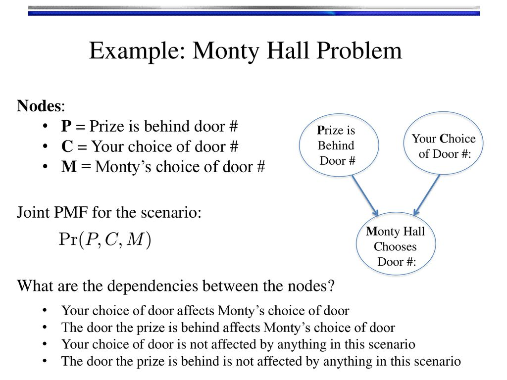

# IALAB - Domande Possibili

- [IALAB - Domande Possibili](#ialab---domande-possibili)
  - [Pozzato](#pozzato)
    - [Unificazione](#unificazione)
    - [Prolog](#prolog)
      - [**Risoluzione SLD** (Albero SLD, Terminazione, Non-Determinismo)](#risoluzione-sld-albero-sld-terminazione-non-determinismo)
    - [Ricerca nello spazio degli stati](#ricerca-nello-spazio-degli-stati)
    - [Strategie di ricerca](#strategie-di-ricerca)
      - [Strategie non informate](#strategie-non-informate)
      - [Strategie informate](#strategie-informate)
    - [Answer Set Programming](#answer-set-programming)
  - [Micalizio - Planning](#micalizio---planning)
    - [Agente](#agente)
    - [Planning Classico](#planning-classico)
      - [**Problema di pianificazione $\mathcal{P}$** (+ Complessità PlanSAT, Bounded PlanSAT)](#problema-di-pianificazione-mathcalp--complessità-plansat-bounded-plansat)
    - [**STRIPS**](#strips)
  - [Torta](#torta)

## Pozzato

### Unificazione

- **Definizione**
  Due termini $t1$ e $t2$ sono unificabili se esiste una sostituzione $\sigma$ (**unificatore**) che li rende identici: $t1\sigma = t2\sigma$.
  $$
  t_1=f(x_1,h(x_1),x_2) \\
  t_2=f(g(x_3),x4,x3) \\
  \sigma=\{x_1/g(x_3),x_2/x_3,x_4/h(g(x_3))\}
  $$

- **Most General Unifier**  
  Una sostituzione $\theta$ è **più generale** di una soluzione $\sigma$ se esiste una sostituzione $\lambda$ tale che $\sigma=\theta\lambda$.  
  Si può dimostrare che, se due termini sono unificabili, esiste sempre un **unificatore più generale**unico a meno di ridenominazione delle variabili.

- **Algoritmo MGU**
  L'algoritmo MGU Martelli ha il compito di trovare un *MGU* $\sigma$ più generale:
  - Scegliere un'equazione della forma $t=x$ dove $t$ non è una variabile ma $x$ lo è, diventa $x=t$
  - Cancellare tutte le equazioni della forma $x=x$
  - Scegliere un'equazione della forma $t'=t''$, entrambi non variabili. Se sono diversi i simboli di funzione, fallisco, altrimenti facciamo la **Term Reduction**
  - Scegliere un'equazione della forma $x=t$ dove $x$ è una variabile che occorre da qualche altra parte e $t\neq x$. Se *x* occorre in *t*, fallimento. Altrimenti, faccio **Variable Elimination**

### Prolog

- **Definizione**  
  Prolog è un linguaggio di programmazione logica, cioè dove invece di programmare con uno dei normali paradigmi si enunciano clausole per un programma, che poi il motore di inferenza utilizzerà per cercare di dimostrare un goal.  
  La ricerca della soluzione avviene mediante backward chaining in profondità: si parte dal goal che si vuole derivare (scritto come una congiunzione di formule atomiche $G_1,G_2,...,G_n$) e si cerca di risolverlo, dimostrando o meno che il goal **segue logicamente** dal programma.

- **Applicabilità di una regola**  
  Una regola $A \coloneq B_1,B_2,...,B_m$ è applicabile a $G_i$ se:
  - le variabili vengono rinominate e
  - $A$ e $G_i$ unificano
  
- **Interprete Prolog**  
  L'interprete prolog cerca di dimostrare il Goal. La computazione ha successo se esiste una computazione che termina con successo.  
  L'interprete Prolog si comporta deterministicamente:
  - Le clausole vengono considerate nell'ordine in cui sono scritte nel programma
  - Viene fatto backtracking all'ultimo punto di scelta ogni volta che la computazione fallisce.

  In caso di successo, l'interprete restituisce una sostituzione per le variabili che compaiono nel goal.

#### **Risoluzione SLD** (Albero SLD, Terminazione, Non-Determinismo)  

- **Definizione**  
  Per arrivare ad un linguaggio di programmazione ci serve una strategia efficiente per risolvere il problema.  
  Risoluzione SLD: **Linear resolution with Selection function for Definite clauses**  
  - Si lavora con **clausole di Horn**: una disgiunzione di letterali in cui al massimo uno dei letterali è positivo.
  - **Strategia Linear Input**: ad ogni passo di risoluzione, una **variante** di una clausola è sempre scelta nella K (_teoria_/_programma_) di partenza, mentre l'altra è sempre il risolvente del passo precedente (goal, la negazione di F al primo passo, visto che si cerca di risolvere per negazione).  
  - La derivazione SLD per un goal $G_0$ da un insieme di clausole $K$ è:
    - Una sequenza di clausole goal $G_0,G_1,...,G_n$
    - Una sequenza di varianti di clausole di $K$ $C_1,C_2,...,C_n$
    - Una sequenza di MGU $\sigma_1,\sigma_2,...,\sigma_n$, tali che $G_{i+1}$ è derivato da $G_i$ e da $C_{i+1}$ attraverso la sostituzione $\sigma_{i+1}$.

- **Terminazione**
  - Ci possono essere tre tipi di derivazioni:
    - **Successo** se $G_n = \square$
    - **Fallimento finito** se non è possibile derivare da $G_n$ alcun risolvente e $G_n \neq \square$
    - **Fallimento infinito** se è sempre possibile derivare nuovi risolventi

- **Non Determinismo**  
  Due forme di non determinismo:
  1) Regola di calcolo per selezionare ad ogni passo l'atomo $B_i$ del goal da unificare con una clausola
  2) Scelta di quale clausola utilizzare ad ogni passo di risoluzione

  - **Regola di Calcolo**  
  Funzione che ha come dominio l'insieme dei goal e per ogni goal seleziona un suo atomo.  
  Non influenza la correttezza e completezza del metodo di prova.

- **Albero SLD**  
  Data una regola di calcolo, è possibile rappresentare tutte le derivazioni con un albero SLD:  
  - Nodo: goal
  - Radice: goal iniziale $G_0$
  - Ogni nodo $\leftarrow A_1,...,A_m,...,A_k$, dove $A_m$ è l'atomo selezionato dalla regola di calcolo, ha un figlio per ogni clausola $A \leftarrow B_1,...,B_k$ tale che $A$ e $A_m$ sono unificabili con il MGU $\sigma$.  
  Il nodo figlio è etichettato con il goal $\leftarrow [A_1,...,A_{m-1},B_1,...,B_k,A_{m+1},...,A_k]\sigma$.
  Il ramo dal padre al figlio è etichettato con $\sigma$ e con la clausola selezionata.

- **La risoluzione SLD è corretta e completa per tutta la logica o solo per alcuni tipi di clausole?**  
  _In generale_ **NON** è completa, ma con le clasuole di Horn SI.

- **Negazione per fallimento (Ragionamento Non-Monotono)**

- **3 Possibili esiti con negazione per fallimento**  
  1) Se la query negata è soddisfatta, la negazione fallisce
  2) Se la query negata non è soddisfatta, la negazione ha successo  
     Se la query richiede delle informazioni che non sono presenti nella KB (in poche parole, non sappiamo/conosciamo qualche informazione), dato che Prolog si basa sulla Assunzione di Mondo Aperto, non possiamo decidere se un'informazione mancante sia mancante volontariamente o meno, per cui ha successo.
  3) Fallimento infinito (se è sempre possibile derivare nuovi risolventi)

- Risoluzione SLD con Prolog  
  Una risoluzione in prolog **si basa sulla dimostrazione del goal mediante risoluzione SLD**.  
  Per rendere la strategia deterministica:
  - Si sceglie sempre il **sottogoal più a sinistra**
  - Le clausole sono considerate **nell'ordine in cui sono scritte** nel programma
  - La strategia di ricerca è **in profondità, con backtracking**.  
    **Non è tuttavia completa**: se una computazione che porterebbe al successo della risoluzione si trova a destra di un ramo infinito, l'interprete non lo riuscirà mai a raggiungere perchè continuerà ad entrare nel ramo infinito.

- **Il CUT**  
  Consente di modificare e controllare l'esecuzione dell'interprete Prolog.  
  Si tratta di un predicato che è **sempre vero**, che se eseguito blocca il backtracking.  
  L'interprete Prolog utilizza due stack (in realtà uno, ma si alternano i due blocchi):  
  1) **Stack di esecuzione**: contiene i predicati attualmente attivati e ancora in esecuzione
  2) **Stack di backtracking**: contiene i punti di scelta (choice points) che sono in valutazione (o devono ancora essere valutati)

  Quando una valutazione fallisce, si effettua backtracking e si prova a valutare un altro ramo non ancora esplorato. Se non ci sono più punti di scelta, si ha il fallimento del predicato attualmente in fase di valutazione.

  In pratica, il CUT **rende definitive le scelte effettuate nel corso della valutazione** da parte dell'interprete: elimina i choice point dallo stack di backtracking, alterando quindi il controllo del programma. Perdiamo in dichiaratività

- **La presenza del cut cosa va a mettere a rischio tra completezza e correttezza?**  
  Andando a tagliare alcuni rami dell'albero SLD, rimuovendo alcuni punti di backtracking, non assicuriamo più la **COMPLETEZZA**.

- Se prendo delle clausole che non sono di Horn, cosa si mette a rischio tra completezza e correttezza?
  
### Ricerca nello spazio degli stati

- **Problema di ricerca**:  
  - Stato iniziale
  - Insieme delle azioni (un'azione fa passare da uno stato ad un altro)
  - Obiettivi
  - Costo di ogni azione

- **Spazio degli stati**  
  E' composto da: $StatoIniziale$ $\cup$ $InsiemeAzioni$ e corrisponde all'insieme di tutti gli stati raggiungibili a partire da quello iniziale.

- **Cammino**  
  Sequenza di stati collegati da una sequenza di azioni.  
  Il suo **costo** è dato dalla somma dei singoli costi di tutte le azioni che lo compongono.

- **Soluzione**  
  La soluzione ad un problema è un **cammino** dallo stato iniziale ad uno stato goal.  
  La soluzione è **ottima** se è quella con il costo minimo tra tutte le soluzioni possibili.

- **In Prolog?**  
  Le azioni le rappresentiamo con delle clausole del linguaggio. Ognuna avrà delle precondizioni (stati in cui può essere eseguita) e degli effetti quando sono eseguite. (Applicabile e Trasforma)

### Strategie di ricerca

#### Strategie non informate

- **Ricerca in profondità**  
  Si espande sempre per primo il nodo più distante dalla radice dell'albero di ricerca.  
  Facilmente realizzabile in Prolog grazie al suo non-determinismo (chiamate ricorsive continue).  
  L'interprete Prolog se non trova una soluzione, fa backtracking, quindi realizza una **ricerca in profondità con backtracking**.

- **Ricerca a profondità Limitata**  
  Uguale alla ricerca in profondità, ma si usa un parametro che vincola la profondità massima oltre la quale i nodi non vengono espansi. La procedura che ne risulta **non è completa**.

- **Iterative Deepening** (non informata)  
  Ripete la ricerca a profondità limitata, incrementando ad ogni passo il limite.  
  Nel caso in cui le azioni del problema abbiano tutte costo unitario, la strategia è **ottima**.

- **Ricerca in ampiezza**  
  Si utilizza una coda di nodi.  
  Ad ogni passo la procedura espande il nodo in testa alla coda (usando una `findall`) generando tutti i suoi successori, che vengono aggiunti in fondo alla coda.  
  E' sicuro che venga individuata la soluzione ottima.  

  Se si lavora con **grafi**, si conserva una lista dei nodi già espansi, per non esplorarli nuovamente.

#### Strategie informate

  Si utilizza una funzione euristica $h(n)$, che corrisponde al costo stimato del cammino più conveniente dal nodo n ad uno stato finale.  
  Ogni azione ha anche associato un costo $g(n)$, che corrisponde al costo del cammino trovato dal nodo iniziale a n.

- **A\***  
  Ricerca in ampiezza su grafi, tiene conto della funzione euristica.  
  Ad ogni passo si estrae per l'espansione dalla coda il nodo con minimo valore di $f(n) = g(n)+h(n)$.  
  I nodi già esplorati/espansi non vengono ulteriormente toccati.

- **IDA\***  
  Coincide con l'_Iterative Deepening_, ma la soglia è stimata basandosi sull'euristica.  
  Alla prima esecuzione è $h(StatoIniziale)$.  
  Per ogni esecuzione successiva, la soglia è il minimo $f(n)$, scelto dall'insieme dei nodi che al termine dell'esecuzione precedente superavano la soglia.

### Answer Set Programming

- **Definizione**  
  Inizialmente era stato ideato per dare una semantica alla negazione per fallimento di Prolog.  
  Non si cercano più le prove, ma i modelli che devono essere **stabili**; non si fa più inferenza con backward chaining. E' particolarmente utile per risolvere problemi combinatori (con vincoli, pianificazione).

  Viene dichiarato un insieme finito di regole del tipo $a \coloneq b_1,b_2,...,b_n, not\ c_1, not\ c_2,...,not\ c_m$ Con $a, b_i, c_j$ letterali della forma $p$ o $\neg p$.

  - $\neg$ coincide con la negazione classica.  
  - $not$ è la negazione per fallimento
  
- **Prolog vs Clingo**
  - In ASP l'ordine dei letterali non ha alcuna importanza
  - Prolog è goal directed (backward chaining!!), ASP no
  - La SLD-riduzione di Prolog può portare a loop, mentre gli ASP solver non lo permettono
  - Prolog ha il CUT, ASP no.

- **Negazione classica vs. per fallimento**
  - **Classica**  
    $attraversa \coloneq \neg treno$ : più forte. _Si attraversa solo se si può derivare che il treno non è in arrivo._
  
  - **Per Fallimento**  
    $attraversa \coloneq not\ treno$ : _si può attraversare in assenza di informazione esplicita sul treno in arrivo._

- **Answer Set**  
  Si tratta del modello minimale. Un programma ASP privo di letterali $not\ p_i$ha un unico modello minimale che è il suo answer set.  
  Un answer set è una soluzione al problema.  
  Esempio 1:
  $$
  p \coloneq q. \\
  q. \\
  \ \\
  Answer\ set=\{p,q\}
  $$
  Esempio 2:
  $$
  p \coloneq q,r. \\
  q. \\
  \ \\
  Answer\ set=\{q\}
  $$

- **Programma Ridotto**  
  Per ottenere il ridotto $P^S$ di un programma $P$ rispetto ad un insieme di atomi $S$:
  1) Rimuovi ogni regola il cui corpo contiene $not\ L, \forall L \in S$;
  2) Rimuovi tutti i $not\ L$ dai corpi delle regole che sono rimaste.
  
  $P^S$ non contiene atomi con negazione per fallimento (per costruzione):
  - Ha un unico answer set
  - se tale answer set **coincide** con $S$, allora $S$ è un answer set per $P$.
  
  E' possibile che esistano programmi che hanno un modello ma non hanno answer set:
  $$
  p \coloneq not\ p, d. \\
  d.
  $$
  $\{p,d\}$ è un modello. I candidati sono $\{d\}$ e $\{p,d\}$.  
  1) Il ridotto $P^{\{d\}}$ risulta essere $$p \coloneq d. \\ d.$$ ma l'Answer Set risultante è $\{p,d\} \neq \{d\}$.
  2) Il ridotto $P^{\{p,d\}}$ risulta essere $d.$ ma l'Answer Set risultante è $\{d\} \neq \{p,d\}$.

- **Modello Minimale di Herbrand**
  Il modello minimale di ASP è minimo rispetto all'inclusione insiemistica verso il modello di Herbrand, che è un insieme di *atomi ground* tali che tutte le clausole del programma sono **entailed**, ovvero, se ho il body vero, allora anche la mia testa è nel modello.

- **Nel ridotto c'è un solo answer set?**  
  No, è possibile che da un ridotto risultino anche più answer set.  
  Gli ASP-solver trovano (se richiesto) tutte le soluzioni nel momento stesso in cui calcola gli answer set del programma.

- **Integrity Constraint**  
  $a$ (la testa della regola) è **opzionale**; senza abbiamo un _integrity constraint_, che invalida tutti i modelli dove tutte le $a_n$ sono verificate:
  $$\coloneq a_1, a_2,...,a_k$$
  (è inconsistente che $a_1, a_2,...,a_k$ siano tutti veri)

- **Aggregati**  
  Si tratta di costrutti che selezionano answer set contenenti almeno $n$ e al massimo $m$ elementi di un insieme. Avremo da $n$ a $m$ atomi $p$, i cui possibili valori sono presi da $q$:
  $$n\ \{p(X)\!:q(X)\}\ m.$$
  Esempio: _ogni variabile deve avere un solo tipo_:
  $$1\ \{ha\_tipo(V,T) \! : tipo(T)\}\ 1 \coloneq variabile(V).$$

- **Risoluzione del problema ASP**
  - Descrizione mediante regole degli answer set potenziali
  - Introduzione di vincoli (regole senza testa) che invalidino gli answer set non accettabili

## Micalizio - Planning

### Agente

- **Definizione**  
  Il modello ad agenti è un'**astrazione per modularizzare il codice** in
  - **Agente**: Processo che persegue un certo obiettivo. Utilizza una _funzione agente_ per decidere la prossima azione date le percezioni finora ricevute
  - **Ambiente**: dati e risorse computazionali usate dagli agenti
- **Agente Intelligente**  
  Essendo un'astrazione consente di analizzare un problema in termini di alto livello (ci si concentra sui **concetti** e non sull'implementazione)  
  Ha due aspetti fondamentali:  
  - **Agency**: agisce in un ambiente che _percepisce_ con dei sensori e che _modifica_ con attuatori.
  - **Autonomia**: con le proprie conoscenze dell'ambiente sa prendere decisioni; può anche saper modificare il proprio modello se l'ambiente cambia
  - **Razionalità**: Si deve comportare correttamente, cioè nel miglior modo possibile date le informazioni sull'ambiente.
  
  L'agente genera azioni $\rightarrow$ l'ambiente evolve grazie ad esse in una sequenza di stati. Se la sequenza è quella desiderata, l'agente ha conseguito il **goal**, comportandosi quindi in modo **razionale**.

- **Razionalità**  
  Impone una misura di prestazione! Bisogna valutare la sequenza degli stati, e l'agente potrebbe pensare di star agendo bene (anche se questo potrebbe non essere il caso).

  La razionalità dipende da:
  - Come è definito il criterio di successo
  - Conoscenza pregressa dell'ambiente da parte dell'agente (il **modello**)
  - Azioni che l'agente può eseguire
  - Percezioni ricevute finora (non tutto è osservabile!)
  
  L'agente è razionale se **MASSIMIZZA** il risultato: se sceglie le azioni che massimizzano il risultato atteso della misura di prestazione.

- **Tipi di agenti**  
  - **Reattivi semplici**: vedono lo stato attuale e decidono un'azione
  - **Reattivi basati sul modello**: ho uno **stato interno** (sintesi delle percezioni finora ricevute) e ho un modello del mondo che mantiene lo stato aggiornato. Se ci sono ambiguità si ragiona in termini della migliore ipotesi corrente.
  - **Basati su Obiettivi**: La scelta della prossima azione non dipende unicamente dalla situazione corrente, ma anche da cosa si vuole raggiungere (il goal). Bisogna ragionare sul futuro: il modello del mondo ci consente di prevedere le conseguenze delle azioni. In questa categoria ricade il planning classico.
  - **Basati sull'Utilità**: se esistono percorsi alternativi, potrei voler scegliere quello migliore rispetto una specifica grandezza di interesse (costo, tempo, ecc.).
  
### Planning Classico

- **Definizione**  
  E' un processo deliberativo che sceglie ed organizza le azioni in base all'effetto che ci si aspetta che queste producano. Abbiamo due tipi di planning, che spesso si completano a vicenda:
  - **Domain-Dependent Planning**: usa rappresentazioni e tecniche adattate alle specifiche condizioni di un dominio di pianificazione
  - **Domain-Independent Planning**: usa rappresentazioni e tecniche generiche, che non dipendono da un dominio specifico. Si basa sugli **aspetti comuni** presenti in tutti i domini di pianificazione. Ci consente di considerare il planning come un problema generale: molti problemi sono riconducibili ad esso.

- **STS (Definizione, STS-Grafo)**  
  - **State Transition System** $\Sigma = (S,A,E,\gamma)$, dove:
    - $S=\{s_1,s_2,...\}$ insieme finito, ricorsivamente enumerabile di stati
    - $A=\{a_1,a_2,...\}$ insieme finito, ricorsivamente enumerabile di azioni
    - $E=\{e_1,e_2,...\}$ insieme finito, ricorsivamente enumerabile di eventi
    - $\gamma:S\times(A \cup E) \rightarrow 2^S$ è una relazione di transizione di stato:  
      Se $a \in A$ e $\gamma(s,a)\neq \emptyset$, allora $a$ è **applicabile** in $S$.  
      Applicare $a$ in $s$ causerà una transizione di stato del sistema da $s$ a $s'$, dove $s'\in\gamma(s,a)$
  
  - **Componenti dell'STS**
    - L'**STS** descrive tutte le possibili evoluzioni di un sistema.  
    - Un **Piano** traccia tutte le azioni necessarie per raggiungere un determinato obiettivo $G$ dato uno stato iniziale $I$. Si può pensare ad esso come un cammino da $I$ a $G$ nello spazio degli stati tracciato dall'STS.
    - I **Goal** possono essere di diversa tipologia:
      - Uno **stato goal** $s_g$ o un sottoinsieme di possibili stati goal in $S_g$
      - Soddisfacimento di condizioni in tutta la sequenza di stati prodotta dalle azioni (carburante sempre > 0)
      - Ottimizzazione di funzioni di utilità (minimizzare costi, tempi, massimizzare profitti)
      - Vincoli sulle azioni che possono essere eseguite (azione a che deve essere seguita subito o entro un tempo limite da un'azione b).
  
  - **STS-Grafo**  
    Un STS $\Sigma =(S,A,E,\gamma)$ può essere rappresentato come un grafo direzionato $G=(N_g,E_g)$:
    - $N_g=S$ è l'insieme dei nodi del grafo coincidente con l'insieme degli stati di $\Sigma$
    - $E_g$ è l'insieme degli archi del grafo tale che esiste un arco $s\xrightarrow{u}s'$ (anche rappresentabile come $\langle s,u,s' \rangle$) da $s$ a $s'$ etichettato con $u \in A \cup E$ **se e solo se**:
      - $s,s'\in S$ (stato iniziale e finale fanno parte degli stati dell'STS) e
      - $s'=\gamma(s,u)$ (la transizione da $s$ a $s'$ mediante la funzione di transizione gamma $\gamma$ è ottenibile con l'azione/evento $u$).

- **Planning e Plan Execution**  
  - **Planner**: Data la descrizione di un STS $\Sigma$, lo stato iniziale e il goal, genera un piano che raggiunge il goal dallo stato iniziale.
  - **Controller**: Dato un piano e lo stato corrente (funzione di osservabilità $\eta:S\rightarrow O$ (eta)), seleziona ed esegue un'azione del piano
  - **STS $\Sigma$**: evolve in funzione delle azioni che vengono eseguite e degli eventi che possono accadere.
  
  (Si assume che gli eventi non interferiscano con le azioni del Controller)

  Abbiamo un problema: il mondo reale può essere diverso da come è descritto nel modello $\Sigma$.  
  Un approccio più realistico è quello del **continual planning**: consente un loop chiuso di feedback tra planner e controller. In questo caso gli eventi che occorrono possono interferire con le azioni pianificate (guasti ad esempio).

- **Assunzioni e Rilassamenti**  
  1) **Dominio finito**: $\Sigma$ contiene un numero finito di stati.  
   Si rilassa per descrivere _azioni che producono nuovi oggetti nel mondo_ e per trattare fluenti numerici.  
   Andiamo ad intaccare la **decidibilità e la terminazione del pianificatore**.
  2) **Completa osservabilità**: la funzione $\eta:S\rightarrow O$ è la funzione identità  
   Si rilassa per trattare stati in cui non tutto è osservabile o può essere conosciuto  
   Può accadere che $\eta(s) = \eta(s') = o$ con $s \neq s'$.  
   Le osservazioni sono **ambigue** perchè consistenti con più stati possibili. Può essere difficile determinare lo stato successore.
  3) **Determinismo**: $\Sigma$ è deterministico, cioè per ogni $s \in S, u \in A \cup E$ si ha $|\gamma(s,u)|\leq1$ (da un'evento/azione si può andare in più stati alternativi).  
   Si può voler rilassare per pianificare azioni che possono avere risultati alternativi, ma il controller deve essere in grado di osservare il risultato reale di ogni azione e il piano potrebbe avere dei punti di controllo condizionali o iterativi.
  4) **Dominio Statico**: $\Sigma$ è statico, ovvero $E=\empty$ e quindi l'STS è riducibile a $\Sigma=(S,A,\gamma)$
   Si rilassa perchè si può voler modellare domini con eventi non controllabili dall'esecutore.  
   Il mondo però diventa **non deterministico** dal punto di vista del pianificatore.
  5) **Goal Semplici**: Vogliamo poter rilassare il vincolo per poter lavorare su stati e piani, con funzioni di utilità/costo, ottimalità.  
   Il planning però diventa più costoso computazionalmente.
  6) **Piani Sequenziali**: un piano soluzione è una sequenza finita di azioni **linearmente ordinate**: solo una alla volta è possibile eseguire.  
   Lo si vuole rilassare per poter eseguire più azioni in parallelo e per non introdurre vincoli che non sono parte del dominio, ma si dovrà ragionare (e gestire) su strutture dati più complesse.
  7) **Tempo Implicito**: Le azioni e gli eventi non hanno durata o, in altri termini, hanno tutti durata istantanea.  
   Si può voler trattare azioni durative, problemi di concorrenza e deadline.  
   Problemi: può essere difficile ragionare e rappresentare il tempo; gli effetti delle aizoni si sviluppano nel tempo: come si comporterà il controller?
  8) **Offline Planning**: $\Sigma$ non cambia mentre il pianificatore sta inferendo un piano: bisognerà poter controllare che il piano corrente sia ancora valido, altrimenti bisogna ripianificare.
  9) **Single Agent**: Abbiamo un solo pianificatore e controller/esecutore  
   Si può voler sfruttare meglio le risorse disponibili (più pianificatori), oppure simulare situazioni in cui _più esecutori sono presenti_ ma non sono sotto il controllo dello stesso pianificatore.  Bisognerà poter trattare le interazioni, la coordinazione, competizione, negoziazione.
  10) **Closed World Assumption**: Quello che non è esplicitamente vero in uno stato è assunto falso.

#### **Problema di pianificazione $\mathcal{P}$** (+ Complessità PlanSAT, Bounded PlanSAT)  

- **Definizione**  
  Un problema di pianificazione classica $\mathcal{P}=(\Sigma,s_0,S_g)$ ha:
  - $\Sigma=(S,A,\gamma)$, modello del dominio espresso come STS (State Transition System)
  - $s_0 \in S$ è lo stato iniziale
  - $S_g \subset S$ è l'insieme degli stati goal
  
  Una soluzione $\pi$ ad un problema $\mathcal{P}$ è una sequenza totalmente ordinata di azioni istanziate (**ground**, cioè nelle quali non compaiono formule) $\pi = \langle a_1,...,a_n\rangle$ che danno origine ad una sequenza di transizioni di stato $\langle s_0,...,s_n \rangle$ tale che:
  - $s_1=\gamma(s_0,a_1)$ (la prima azione applicata con la funzione di transizione gamma porta allo stato $s_1$)
  - $\forall k: 2..n, s_k = \gamma(s_{k-1},a_k)$ (tutte le azioni successive in sequenza, applicate con la f.ne di transizione gamma allo stato precedente portino allo stato direttamente successivo)
  - $s_n \in S_g$ (lo stato finale raggiunto dal piano faccia parte degli stati goal)

- **Proprietà di un buon algoritmo di pianificazione**  
  - **Soundness** (correttezza)  
    Un pianificatore è **corretto** se tutte le soluzioni che trova sono piani corretti, ovvero realmente eseguibili dal controller. Questo significa che:  
    - Tutti i goal sono soddisfatti
    - Nessuna precondizione di azione non insoddisfatta (o mancante)
    - Nessun vincolo ulteriore è violato (temporali ad esempio)
  - **Completeness** (completezza)  
    Un pianificatore è **completo** se trova una soluzione quando il problema è risolubile.  
    Un pianificatore è **strettamente completo** se, nonostante esso faccia (ad esempio) pruning dell'albero di ricerca, non scarta alcuna soluzione possibile.
  - **Ottimalità**  
    Un pianificatore è **ottimo** se l'ordine con cui le soluzioni sono trovate è coerente con una qualche misura di qualità dei piani (lunghezza, costo complessivo)
  
- **Complessità**  
  Si può dimostrare che il planning è un compito computazionalmente costoso ricorrendo a due problemi decisionali:
  - **PlanSAT**: esiste un piano che risolve un problema di pianificazione?
  - **Bounded PlanSAT**: esiste un piano di lunghezza $k$?

  Per la pianificazione classica entrambi i problemi sono decidibili (la ricerca avviene in spazio finito), ma se estendiamo il linguaggio con simboli di funzione:
  - Lo spazio di ricerca diventa infinito
  - PlanSAT diventa **semidecidibile**:
    - Esiste un algoritmo che termina quando la soluzione esiste MA
    - Potrebbe non terminare quando la soluzione non esiste.
  - Bounded PlanSAT **rimane decidibile**.

  PlanSAT e Bounded PlanSAT sono $PSPACE \supset NP$.  
  In molti casi pratici:
  - Bounded PlanSAT è NP-Completo
  - PlanSat è Polinomiale

  Questo significa che trovare una soluzione è meno costoso che trovare una soluzione ottima.  
  Può quindi cercare euristiche (magari) domain independent che guidino il pianificatore nella formulazione di una soluzione.

- Algoritmi di Pianificazione
  Inizialmente potremmo risolvere il planning con algoritmi di ricerca (BSF, DSF, A*...)  
  **MA** ci sono delle differenze!  
  lo spazio di ricerca $\not \equiv$ spazio degli stati:
  - Lo spazio degli stati è indotto dal transition system $\Sigma$
  - Lo spazio di ricerca dipende dall'algoritmo di pianificazione (e non sempre cerca nello spazio degli stati, come nel caso del least-commitment planning).
  
  Variabili:  
  1) Direzione della ricerca:  
     - Progression: $s_i \rightarrow s_g$
     - Regression: $s_i \leftarrow s_g$
     - Bidirezionale $s_i \leftrightarrow s_g$
  2) Rappresentazione dello spazio di ricerca
     - Spazio di ricerca **esplicito**: coincide con lo spazio degli stati del transition system che modella il dominio
     - Spazio di ricerca **simbolico**: ogni stato corrisponde ad insiemi di stati del dominio
  3) Algoritmo di ricerca
     - Non Informato (DFS, BFS, Iterative Deepening...)
     - Ricerca Euristica Sistematica (greedy best first, A*, IDA*...)
     - Ricerca Euristica locale (hill climbing, simulated annealing, beam search...)
  4) Controllo della ricerca
     - Euristiche per gli algoritmi informati
     - Tecniche di pruning (partial-order reduction, helpful actions pruning, symmetry elimination...)
  
### **STRIPS**

(STanford research Institute Problem Solver):

- **Definizione** (Linear Planning + Means-End Analysis)
  Introduce una rappresentazione esplicita degli **operatori di pianificazione**.  
  Fornisce una operazionalizzazione delle nozioni di
  - differenza tra stati
  - subgoal
  - applicazione di un operatore

  E' in grado di gestire il frame problem.  
  Si basa su due idee fondamentali:
  - **Linear Planning**  
    L'idea di base è di risolvere un goal alla volta, passando al successivo solo quando il precedente è stato raggiunto.  
    L'algoritmo di planning mantiene uno **Stack dei Goal** (un goal per essere risolto può richiedere la risoluzione di sottogoal). Ne consegue che:
    - Non c'è interleaving nel conseguimento dei goal
    - La ricerca è efficiente se i goal non interferiscono troppo tra di loro
    - E' soggetto all'Anomalia di Sussmann
  - **Means-End Analysis**  
    L'idea è di considerare solo gli aspetti rilevanti al problema (ricerca backward). Si ragiona su quali mezzi (_means_, operatori) sono disponibili e necessari per raggiungere il goal.  
    Occorre stabilire quali differenze ci sono tra lo stato corrente e il goal (means-end analysis), trovare un operatore che riduca tale differenza e ripetere l'analisi sui sottogoal ottenuti per regressione attraverso l'operatore scelto.

- **Stati**  
  Il linguaggio di STRIPS $\subset$ FOL: abbiamo un numero finito di simboli di predicati, simboli costanti e **non sono presenti** simboli di funzione o quantificatori.  
  Uno stato in STRIPS è una congiunzione di **atomi ground** (privi di simboli di funzione).  
  Un atomo ground $p$ **vale in uno stato** $s\ sse\ p \in s$.  
  La semantica è logic-oriented: uno stato $s$ soddisfa una congiunzione di letterali $g$ $s \vDash g$ se:
  - Ogni letterale positivo in $g$ occorre in $s$
  - Ogni letterale negativo in $g$ **non** occorre in $s$

  Mondo dei blocchi:
  $$s=\{On(A,B),\\OnTable(C),\\OnTable(A),\\Block(A),\\Block(B),\\Block(C),\\Handempty\}$$

- **Tipi di Relazioni**
  - **Fluenti**  
    Predicati che rappresentano relazioni il cui valore di verità può cambiare da uno stato al successivo ($On$, $OnTable$)
  - **Persistenti** (o state invariant)  
    Predicati il cui valore di verità non può cambiare ($Block$)
- **Plan Operators**  
  Un operatore di pianificazione in STRIPS è una **TRIPLA**:  
  $o:(name(o), precond(o), effects(o))$:
  - $name(o)$ è un'espressione sintattica con forma $$n(x_1,...,x_k)$$ dove n è il nome dell'operatore e $x_1,...,x_k$ è una lista di variabili che compaiono in $o$
  - $precond(o)$ è l'insieme dei letterali che rappresentano le condizioni dell'azione:
    - $precond^+(o)$ denota i letterali positivi
    - $precond^-(o)$ denota i letterali negativi
  - $effects(o)$ è l'insieme di letterali che rappresentano gli effetti dell'azione.  
    Nota: una variabile può comparire negli effetti solo se è anche menzionata nelle precondizioni (_variable bounded_)
    - $effects^+(o)$ denota i letterali positivi (_add-list_)
    - $effects^-(o)$ denota i letterali negativi (_delete-list_)

  ```STRIPS
  Pick_Block(?b, ?c)  
  Pre: Block(?b), Handempty, Clear(?b), On(?b, ?c), Block(?c)  
  Eff: Holding(?b), Clear(?c), ¬Handempty, ¬On(?b, ?c)  

  Put_Block(?b, ?c)  
  Pre: Block(?b), Holding(?b), Clear(?c), Block(?c)  
  Eff: ¬Holding(?b), ¬Clear(?c), Handempty, On(?b, ?c)
  ```

- **Azione, Applicabilità e Funzione $\gamma(s,a)$**  
  Sia $s$ uno stato del mondo ($s \in S$ per un dato dominio $\Sigma$)  
  Sia $a$ un'**Azione** (istanziazione di un plan operator $o$)  
  Diremo che $a$ è **applicabile** in s se e solo se:
  - $precond^+(a)\subseteq s$ (le precondizioni sono nello stato $s$)
  - $precond^-(a)\cap s = \empty$ (le precondizioni che non devono essere in $s$ non lo sono effettivamente)

  La funzione di transizione di stato $\gamma(s,a)$ è definita come:
  - Se $a$ è applicabile in $s$:  
    $\gamma(s,a) = (s \setminus effects^-(a)) \cup effects^+(a) $
  - Altrimenti $\gamma(s,a)$ non è definita.

- **Algoritmo** (+ Vantaggi e Svantaggi)

  ```?
  STRIPS (initState, goals )
    state = initState; plan = []; stack = []
    Push goals on stack
    Repeat until stack is empty
      ◦ If top of stack is a goal g satisfied in state, then pop stack
        (se in cima allo stack c'è un goal atomico/complesso soddisfatto, non devo fare nulla)
      ◦ Else if top of stack is a conjunctive goal g, then
        (se in cima allo stack c'è un goal complesso, semplificalo [linearizzazione])
          Select an ordering for the subgoals of g, and push them on stack 
      ◦ Else if top of stack is a simple goal sg, then
        (se in cima allo stack c'è un goal atomico, risolvilo [means-end])
          Choose an operator o whose effects + matches goal sg
          Replace goal sg with operator o
          Push the preconditions of o on stack
      ◦ Else if top of stack is an operator o, then
        (se c'è un operatore completamente istanziato [azione], eseguilo; modifica lo stato corrente e aggiungilo al piano in costruzione)
          state = apply(o,state)
          plan = [plan; o]
    ```  

  L'algoritmo implementa una forma di linear planning.
  - **Vantaggi**  
    - Spazio di ricerca ridotto: i goal sono considerati uno alla volta
    - ideale quando i goal sono indipendenti tra di loro
    - è sound
  - **Svantaggi**  
    - Il linear planning può produrre piani **subottimi** (se come qualità usiamo la lunghezza)  
      E' una conseguenza dell'interdipendenza tra i goal e di un possibile ordinamento sfavorevole di essi.  
      La combinazione di questi due fattori può dare origine all'anomalia di Sussmann.
    - Il linear planning è incompleto

- **Anomalia di Sussman**  
  Uno degli svantaggi di STRIPS è che il linear planning può produrre piani subottimi (se come parametro di qualità ci basiamo sulla lunghezza).  
  L'interdipendenza tra i goal e un possibile ordinamento sfavorevole può portare all'anomalia, che si verifica quando è necessario **disfare** parte dei goal già raggiunti per poter risolvere l'intero problema.

- **Incompletezza di STRIPS**  
  Il linear planning non è completo: questa è una conseguenza della **non reversibilità** delle azioni in alcuni domini specifici (ad esempio la logistica e il trasporto di merci).

- **PDDL**  
  Risolve alcuni problemi di STRIPS:
  1) Potere espressivo, che permette di semplificare i predicati e allontanarsi dalla FOL
  2) Proposizionalizzazione per alcune specifiche condizioni ed azioni
  Alcune estensioni di PDDL:
  - Conditional effects (alcuni effetti sono raggiungibili solo se vere alcune condizioni)
  - Durative Actions
  - Fluenti Numerici
  - Quantificatori ($\exists, \forall$)

#### Progression e Regression

- **Progression**  
  Calcolo lo stato successione $s'$ di uno stato $s$ rispetto all'applicazione di un operatore $o$: $s' = \gamma(s,o)$  
  _Soundness_: corretto: se la funzione termina con un piano come soluzione, quella è effettivamente una soluzione per il problema iniziale  
  _Completeness_: completo: se esiste una soluzione, allora esisterà un percorso d'esecuzione che restituirà quella soluzione come piano.

- **Regression**  
  Dato che il numero di azioni applicabili in uno stato è generalmente molto grande, anche il branching factor tende ad essere grande: la ricerca in avanti rischia di non essere praticabile dopo pochi passi.

- **Progression vs Regression**  
  1) La ricerca in avanti si parte da un solo stato iniziale.  
    La ricerca in indietro comincia da un insieme di stati goal.
  2) Quando si applica in avanti un operatore $o$ ad uno stato $s$ si genera un unico successore $s'$.  
    Quando da uno stato $s'$ vogliamo fare un passo all'indietro, scopriamo che ci possono essere _molteplici stati predecessori_.
  3) Nella ricerca in avanti lo spazio di ricerca coincide con lo spazio degli stati (stati del dominio originati da $\Sigma$ generalmente)
    Nella ricerca all'indietro ogni stato dello spazio di ricerca corrisponde ad un insieme di stati del dominio.

  La ricerca all'indietro ha il vantaggio di poter gestire più stati simultaneamente (belief states), portando ad uno spazio di ricerca più compatto.  
  Inoltre, si basa su azioni **rilevanti**, cioè quelle che contribuiscono attivamente al goal. Otteniamo così un branching factor più ridotto, ma il fatto di dover mantenere un belief state può complicare il planner.

### CSP

(Constraint Satisfaction Problems)  
Formulare un problema di pianificazione come un problema di soddisfacimento di vincoli consente di ritardare alcune decisioni fino a quando non è strettamente necessario.

- **Come costruire un modello espresso da variabili di stato?**  
  - Ambiente E che vogliamo modellare
  - B è l'insieme degli oggetti rilevanti per il problema che si vuole risolvere. Deve astrarre i dettagli insignificanti.

- **Proprietà nei CSP**
  - **Rigid**  
    Sono proprietà invarianti: persistono in ogni possibile stato del sistema (relazioni di adiacenza: $adjacent = \{(d_1,d_2),(d_2,d_1),...\}$).  
    Nella FOL si sarebbe dovuto usare atomi ground ($adjacent(d_1,d_2)$)
  - **Varying**  
    Possono cambiare con le transizioni di stato  
    Nella rappresentazione classica sono le relazioni fluenti che vengono aggiunte/tolte per effetto delle azioni (add e delete list).  
    Sono modellate come **variabili** a cui si può assegnare un valore.

#### **State-Variable Representation** (Stato, Applicabilità, $\gamma(s,a)$)

  FOL e State-Variable sono equivalenti: Stesso valore espressivo e riconducibili una all'altra.

- **Stato**  
  Uno stato è rappresentato come una funzione che mappa ogni variabile $x$ ad un valore in $Range(x)$

- **Applicabilità**  
  Un'azione $a$ è applicabile in $s$ se
  - per ogni costante positiva $l \in pre(a), l \in s$
  - per ogni costante negativa $l \in pre(a), l \not \in s$
  - per ogni test di uguaglianza $sv(t_1,...,t_k) = t_0$ in $pre(a)$, allora vale $s(sv(t_1,...,t_k)) = t_0$
  - per ogni test di disuguaglianza $sv(t_1,...,t_k) \neq t_0$ in $pre(a)$, allora vale $s(sv(t_1,...,t_k)) \neq t_0$

- **Transizione di stato**  
  Se $a$ è applicabile in $s$, allora $\gamma(s,a) = s'$ tale che
  $$\{(x,w)|x \leftarrow w \in eff(a)\} \cup \{(x,w) \in s|x\ non\ occorre\ in\ eff(a)\}$$
  dove $(x, w)$ è la coppia (variabile, valore assegnato alla variabile).

#### **Least-Commitment Planning**

- **Principio**
  Fare scelte solo quando queste sono indispensabili per risolvere una parte del problema.  
  Durante la ricerca bisogna non porre più vincoli di quelli strettamente necessari.  
  E' possibile ritardare:
  - Ordinamenti (non ordinare se non necessario)
  - Bindings: non vincolare le variabili se non è necessario unificarle con costanti per conseguire i goal

- **Perchè è un pianificatore particolare? In quale spazio cerca?**  
  E' particolare perchè fa scelte solo quando indispensabili per risolvere il problema (ritarda ordinamenti e bindings).  
  Cerca nello **SPAZIO DEI PIANI PARZIALI**. Ogni nodo della ricerca è un piano parzialmente ordinato con flaws, che ad ogni passo sono rimosse attraverso raffinamenti incrementali.  
  Se l'algoritmo termina con successo, il piano risultante è completamente istanziato (ma solo parzialmente ordinato).

- **Piano $\langle A,O,B,L\rangle$**  
  Un piano è una tupla $\langle A,O,B,L\rangle$ dove
  - $A$ insieme di azioni anche solo parzialmente istanziate
    - $a_0$/$a_{start}$ è un'azione senza precondizione e tale che $effects^+(a_0) \equiv s_0$
    - $a_\infin$/$a_{finish}$ è un'azione senza effetti e tale che $pre(a_\infin) \equiv s_{goal}$
  - $O$ insieme di vincoli di ordinamento della forma $(a_i<a_j)$; è una relazione d'ordine solo _parzialmente_ definita
  - $B$ insieme di bindings (vincoli della forma
    - $v_i = C$: a $v_i$ è assegnata la costante $C$
    - $v_i \neq C$: $v_i$ può assumere qualunque valore, tranne $C$
    - $v_i = v_j$: $v_i$ e $v_j$ assumono lo stesso valore
    - $v_i \neq v_j$: $v_i$ e $v_j$ devono essere distinte
  - $L$ insieme di causal links della forma $a_i\xrightarrow{c}a_j$ ad indicare che c è un effetto dell'azione $a_i$ che è necessario (precondizione) per l'azione $a_j$.  
  $c$ è un assegnamento di valore ad una variabile.

- **Flaws** (Open Goals, Threats)  
  - **Open Goals**  
    Una precondizione $p$ per un'azione $b$ è un **open goal** se non c'è un link causale a supporto di p, cioè manca $?\xrightarrow{p}b$ in $L$.  
    Bisognerà risolvere il difetto aggiungendo il link mancante:
    1) Trova un'azione $a$ (possibilmente già in $\pi$, o in alternativa da aggiungere ad essa) tale che:
        - $p$ può appartenere a $effect^+(a)$ (previa unificazione)
        - $a$ può precedere $b$ in $\pi$
    2) istanzia l'azione $a$ in modo che asserisca $p$ (istanziazione least commitment, solo lo stretto necessario)
    3) aggiungi un vincolo di precedenza $a \prec b$ in $O$
    4) aggiungi un causal link a $a \xrightarrow{p} b$ in $L$
  - **Threats**  
    Dato un link causale $l:a\xrightarrow{p}b$, un'azione $c$ minaccia il link $l$ se:
    - $c$ può modificare il valore di verità di $p$ e può posizionarsi tra $a$ e $b$

    oppure
    - $c$ può produrre $p$: il link $l$ impone che sia $a$ a produrre $p$ per $b$ e non un'altra azione $c$.  
    Se anche $c$ può produrre $p$ per $b$, si tratta di un'opportunità da investigare in un altro ramo dello spazio di ricerca.  
    $c$ è anche detta **clobber**.

    Situazione:
    - $l:a\xrightarrow{p}b$, link causale in $L$
    - $c$ azione in $A$ clobber per $l$

    Soluzioni per risolvere le minacce:
    - **Promotion**: imporre il vincolo $c \prec a$
    - **Demotion**: imporre il vincolo $b \prec c$
    - **Separation**: imporre un vincolo di _non-codesignation_ in modo tale che l'effetto di $c$ non unifichi con $p$.  
    Esempio:  
    $p: pos(Block_1) = Table$ ; l'effetto di $c$ potrebbe essere $pos(x) = Hand$, allora il vincolo $x \neq Block_1$ deve essere aggiunto a $B$.
- **Correttezza e Completezza di PSP** (Plan-Space Planning)  
  Ritorna infatti un piano parzialmente ordinato $\pi$ tale che qualsiasi ordinamento totale delle sue azioni raggiunge il goal.  
  Dove il dominio lo consenta, le azioni non strettamente sequenziali sono eseguibili in parallelo.

- **Algoritmo PSP**:
  $$
  \text{PSP}(\Sigma, \pi) \\\ \\
  Flaws(\pi) \leftarrow OpenGoals(\pi) \cup Threats(\pi) \\
  \textbf{if}\ \ (Flaws(\pi) = \empty)\ \textbf{then return}\ \pi \\
  \text{arbitrarily select} f \in Flaws(\pi) \\
  R \leftarrow \{\text{all feasible resolvers for } f\} \\
  \textbf{if}\ R = \empty \ \text{\textbf{then return} failure} \\
  \text{nondeterministically select } \rho \in R \\
  \pi' \leftarrow \rho(\pi) \\
  \textbf{return } \text{PSP}(\Sigma, \pi')
  $$

  Con gli argomenti inizializzati a
  - $\Sigma$ è l'STS che modella il dominio
  - $\pi' = ({a_0,a_\infin}, {a_0 \prec a_\infin}, \empty, \empty)$

#### Graph Planning

- **Grafo di Pianificazione**. Cos'è? Com'è definito? A cosa serve?  
  E' una struttura dati speciale, utile per
  - Definire **euristiche domain-independent** (non dà garanzie sulla raggiungibilità di uno stato, ma fornisce una buona stima della distanza)
  - Generare un piano (*graphplan*)

  Il grafo astrae lo spazio di ricerca e può essere costruito con un algoritmo polinomiale.

  E' un **grafo orientato, aciclico, organizzato a livelli**:
  - Il livello iniziale $S_0$ contiene i letterali che valgono nello stato iniziale (**un nodo per ogni fluente**)
  - Livello di azioni $A_0$ contiene le azioni ground che possono essere applicate ad $S_0$ (**un nodo per azione**)

  In genere $S_i,A_i$ si alternano fino a che non si raggiunge una condizione di terminazione e sono tali che:
  - $S_i$ contiene tutti i letterali che **potrebbero** valere al tempo $i$
  - $A_i$ contiene tutte le azioni che **potrebbero** avere le precondizioni soddisfatte al tempo $i$

  Il grafo di pianificazione (GP)
  - traccia un solo sottoinsieme delle possibili interazioni negative, quindi un letterale che appare in uno stato $S_i$ per la prima volta potrebbe di fatto essere producibile solo in uno stato successivo ad $S_i$. $i$ è comunque una buona stima (ammissibile) per il letterale
  - è costruito a partire da azioni ground, ma la proposizionalizzazione può generare un'esplosione di alternative. GP è comunque costruito in tempo polinomiale.
  - ogni $S_i$ è un belief state: codifica più stati possibili e alternativi

- **Grafo dei piani** (Livelli, Costruzione del grafo, Livella, Mutex, Complessità e Raggiungibilità del goal)
  - **Letterali**  
    Un letterale al tempo $i$ può essere inteso sia come precondizione di un'azione in $A_i$, sia come atomo persistente (non usato ad esempio); in questo secondo caso la persistenza è realizzata dall'operazione **no-op** (sempre eseguibile!)
  - **Mutua esclusione**  
    In ogni livello $S_i$ possono essere presenti link di mutua esclusione tra letterali ($P$ e $\neg P$, o $Have(Cake)$ e $Eaten(Cake)$).  
    In ogni livello $A_i$ possono essere presenti link di mutua esclusione tra azioni.

    - **Tra due azioni** in un dato livello $A_i$  
      - Effetti inconsistenti: un'azione nega gli effetti dell'altra  
        Ad esempio in $A_0$ l'azione $Eat(Cake)$ è inconsistente con l'azione $Have(Cake)$ in quanto gli effetti dell'una sono negati dall'altra.
      - Interferenza: uno degli effetti di un'azione è la negazione della precondizione dell'altra.  
        $Eat(Cake)$ interferisce con $Have(Cake)$ perchè l'effetto di Eat nega le precondizioni di Have
      - Competizione delle Precondizioni: una delle precondizioni di un'azione è mutualmente esclusiva con le precondizioni dell'altra: $Bake(Cake)$ e $Eat(Cake)$ sono in mutex perchè competono entrambe per la precondizione $Have(Cake)$
    - **Tra due letterali** in un dato livello $S_i$  
      - Complementarity: se uno è la negazione dell'altro
      - Inconsistent Support: se ogni possibile coppia di azioni al livello $A_{i-1}$ che producono i due letterali sono mutuamente esclusivi
  - **Livella**  
    Il Grafo dei Piani cresce monotonicamente, quindi prima o poi si livella: due stati consecutivi $S_i$ e $S_{i+1}$ sono identici
    - Ogni livello $A_i$ contiene tutte le azioni che potrebbero essere applicate al tempo $i$
    - Ogni livello $S_i$ contiene tutti i letterali che potrebbero valere al tempo $i$
    - I vincoli di mutua esclusione indicano quali letterali o quali azioni non possono esistere simultaneamente.
  
- **Tempo di costruzione del grafo/Complessità**. Perchè è polinomiale?  
  E' polinomiale nella dimensione del problema:  
  $l$: numero letterali  
  $a$: numero azioni  
  Ogni livello $S_i$ ha non più di $l$ nodi e $l^2$ link di mutex tra letterali  
  Ogni livello $A_i$ non ha più di $l+a$ nodi (inclusi i no-op) e $(a+l)^2$ link di mutex  
  Un grafo con $n$ livelli ha dimensione $\mathcal{O}(n(a+l)^2)$ e la stessa complessità per costruirlo

- **Euristiche per stimare il costo**  
  Se un letterale del goal non compare in nessun livello, allora il goal non è raggiungibile.  
  Ma, se anche tutti i letterali del goal compaiono in un qualche livello del GdP, non significa che esista una soluzione, ma che _forse_ il problema è risolvibile.

  - **Costo di un singolo letterale**  
    - Profondità del livello in cui il letterale compare per la prima volta (ammissibile, ma imprecisa)
    - Lunghezza del piano serializzato estratto dal GdP
  - **Costo di una congiunzione di letterali**  
    - **max-level**: prendere il massimo livello tra quelli in cui un letterale del goal compare per la prima volta (cioè il primo livello in cui compaiono _tutti i letterali del goal_, anche con vincoli mutex)
    - **somma dei livelli**: non è ammissibile perchè assume l'indipendenza dei letterali del goal
    - **livello di insieme**: profondità del livello in cui tutti i letterali del goal compaiono senza che alcuna coppia di essi sia in mutua esclusione (ammissibile, funziona bene quando i goal non sono indipendenti tra di loro; ignora però le dipendenze tra tre o più letterali)

- Quando si smette di costruire il grafo di pianificazione?
- **graphplan** (EXTRACT-SOLUTION, GP-SEARCH, EXPAND-GRAPH, tuple no-good, terminazione e dimostrazione)
  Con Graphplan si torna ad una rappresentazione classica del problema di planning.
  $$\text{Se esiste un piano valido, allora questo è un sottografo del piano di pianificazione}$$
  Come si estrae una soluzione da un Grafo di Pianificazione efficientemente?

  1) Espandi il grafo un livello alla volta finchè tutti gli atomi del goal non compaiono nell'$i$-esimo stato **senza che vi siano vincoli di mutua esclusione tra loro**
  2) Invoca `EXTRACT-SOLUTION` per cercare un piano all'interno del grafo
      - Se `EXTRACT-SOLUTION` trova una soluzione termina con successo
      - Altrimenti, se non c'è ragione per proseguire perchè la soluzione non esiste certamente, allora termina con fallimento
      - Altrimenti `goto 3`
  3) Espandi il grafo ancora di un livello e torna al passo 2

  **Extract-Solution**  
  `EXTRACT-SOLUTION`: è una ricerca backward search in un sottografo AND/OR del Grafo di Pianificazione:
  - Rami OR: archi che dalle azioni ad un livello $A_{i-1}$ producono un letterale $p$ in un goal $g$ al livello $S_i$
  - Rami AND: sono gli archi che dagli atomi ad un livello $S_i$ rappresentano le precondizioni per un'azione al livello $A_i$

  **GP-Search**  
  `EXTRACT-SOLUTION` sfrutta una funzione di supporto `GP-Search`, e si chiamano a vicenda ricorsivamente:
  1) `EXTRACT-SOLUTION` invoca `GP-Search` su un livello di aizoni e su un sottogoal (regredito dal goal del problema)
  2) `GP-Search` pianifica per il solo livello su cui è invocato (cerca azioni rilevanti per il sottogoal che non siano tra loro in mutua esclusione) e, se ha successo, invoca `EXTRACT-SOLUTION` sul livello di stato precedente.

  Ci sono casi in cui questa ricerca potrebbe essere intrattabile, per cui si ricorre ad euristiche.  
  Una possibile soluzione è un algoritmo greedy:
  - Dato un insieme di letterali che compaiono nel goal
  - Scegliere il letterale con il costo di livello più alto
  - Soddisfare il letterale scegliendo l'azione con le precondizioni più "facili" (ad esempio la somma/massimo dei costi di livello delle precondizioni è minima)
  
  **No-good**  
  Ogni volta che `EXTRACT-SOLUTION` applicata a certi letterali $L$ e ad un livello $lev$ fallisce, la coppia $(L,lev)$viene aggiunta nell'insieme **no-good**, in modo che qualunque ricerca successiva applicata alla stessa coppia fallisca immediatamente.

  **Terminazione**  
  Fino a quando bisogna espandere il grafo dopo che si è livellato?
  - Se `EXTRACT-SOLUTION` non trova una soluzione, deve esistere un sottoinsieme di atomi ground del goal che non sono raggiungibili (e sono quindi stati marcati come no-good)
  - Allora, se è possibile che vi siano **meno** no-good al livello successivo, continuiamo ad espandere
  - Altrimenti, quando sia il grafo, sia i no-good si sono livellati senza che una soluzinoe sia stata trovata, si può concludere con fallimento.  
  
  **Dimostrazione**  
  Bisogna dimostrare che:
  - I no-goods devono livellarsi sempre
  - Quando i no-good e il grafo sono livellati, allora si può concludere che la soluzione non esiste

  Ci basiamo su proprietà monotone dei grafi di pianificazione:
  - **i letterali crescono monotonicamente** (se compare in un livello un letterale, con i no-op sarà sempre presente)
  - **le azioni crescono monotonicamente** (conseguenza della precedente proprietà)
  - **le relazioni di mutex decrescono monotonicamente**: se due azioni (o letterali) sono in mutex in un livello, lo sono anche nei precedenti MA potrebbero non esserlo in un livello successivo
  - **i no-goods decrescono monotonicamente**: se un sottoinsieme di atomi del goal non è raggiungibile in un dato livello di stato $S_i$, allora non lo è nemmeno in nessuno dei precedenti MA potrà diventarlo in un qualche livello futuro (conseguenza delle P precedenti)

  1) Dato che le azioni e i letterali crescono monotonicamente, e dato che sono entrambi insiemi finiti, deve esistere un livello in cui l'insieme dei letterali è uguale a quello dei letterali del livello precedente
  2) Poichè i mutex e no-good decrescono monotonicamente e poiché non possono esserci meno di zero mutex e no-good, deve esistere un livello con lo stesso numero di mutex e no-good del precedente
  3) Una volta che il grafo ha raggiunto la situazione in cui sia i livelli che i no-good si sono livellati, se uno dei letterali del goal è mancante o in mutex con un altro letterale del goal, allora si può concludere che non esiste una soluzione

  **Correttezza e completezza**  
  Restituisce _fallimento_ sol oquando il problema di pianificazione non è risolubile, altrimenti restituisce una soluzione espressa come una **sequenza di insiemi di azioni**. L'algoritmo termina sempre, anche quando la soluzione non esiste.

  **Partial-Order Planner**  
  Azioni allo stesso livello (non legate da vincoli di mutua esclusione per costruzione) possono essere eseguite in parallelo.  
  Qualunque linearizzazione delle azioni che rispetti i vincoli di ordinamento imposti dai livelli è una possibile soluzione "classica".

#### Euristiche nel Planning

- Info
  Le euristiche cercano di focalizzare la ricerca sul goal guidando le scelte non deterministiche.  
  Una funzione euristica stima la "bontà" di una scelta:
  - **Progression**: la scelta è il "next state" $s$ stima come distanza da $s$ al goal $G$
  - **Regression**: la scelta è il "next sub-goal" $sg$: stima come fistanza da $sg$ allo stato iniziale $l$

  L'approccio è di definire un problema analogo all'originale, ma _rilassato_, cioè semplificato. Lo si risolve (ottimalmente se possibile) e si usa il costo della soluzione per il problema rilassato come euristica nel problema originale.  
  Deve essere una funzione EFFICIENTE visto che verrà chiamata per ogni stato dello spazio di ricerca. Più la funzione è vicina a quella originale, più sarà affidabile.

- **Tecniche di rilassamento**  
  - **Delete relaxation**: cancellazione degli effetti negativi delle azioni
  - **Astrazione**: considerare un problema più piccolo, ignorare alcune differenze tra stati in modo che collassino in un unico (riducendo lo spazio di ricerca)
  - **Landmark**: un insieme di azioni; almeno una di esse deve essere presente in ogni soluzione. Utile per safe pruning.

  Si può:
  - Risolvere in modo OTTIMO il problema rilassato
  - Risolverlo in modo SUBOTTIMO
  - STIMARE il costo della soluzione del rilassamento, senza risolverlo.

- **Euristiche non ammissibili**  
  - **Forward Search**  
    $\gamma*(s,a)=s\cup effects^+(a)$  
    La distanza tra uno stato $s$ e una proposizione $p$ è data dalle seguenti relazioni:
    - $\Delta_0(s,p)=0$ se $p \in s$
    - $\Delta_0(s,p)=min_a\{1+\Delta_0(s, precond(a))|p \in effects^+(a)\}$
    - $\Delta_0(s,p)=\infin$ se $\forall a\in A, p \not \in effects^+(a)$

    La distanza tra uno stato $s$ e una congiunzione di proposizioni $g=p_1 \wedge...\wedge p_n$:
    - $\Delta_0(s,g)=0$ se $g \subseteq s$
    - $\Delta_0(s,g)=\sum_{p_i \in g} \Delta_0(s,p_i)$

    La funzione euristica può essere definita come $$h_0(s)=\Delta_0(s,g)$$
    La funzione $h_0$ non è ammissibile perchè è costosa, visto che richiede di risolvere un problema (seppur rilassato) per ogni stato visitato.

  - **Backward Search**  
    Regressione per mezzo della $\gamma^{-1}$.  
    Dato il sottogoal $g$ attualmente in esame, esistono diverse azioni _rilevanti_  
    Scegliere l'azione che porta al sottogoal più vicino allo stato iniziale
    $$a_{best} \leftarrow argmin\{\Delta_0(s_0, \gamma^{-1}(g,a))\ |\ a\ \text{è rilevante (resolver) per } g\}$$
    L'euristica è sempre basata sulla distanza $\Delta_0$, quindi non è ammissibile.  
    Il vero vantaggio è che è possibile precompilare le distanze tra s_0 e ogni possibile proposizione, il calcolo a runtime è quindi semplificato
- Se non volessimo un'euristica ammissibile, cosa faremmo?
- **Euristiche ammissibili $h_1$, $h_2$ e $h_G$**  
  Consentono di ottenere **soluzioni ottime**  
  - **Safe Pruning**: so che una soluzione ha al più costo $k$, posso scartare un nodo qualsiasi $u$ tale che $h(u) > k$ senza correre il rischio di perdere le soluzioni.

  - $h_1(s,g)=\Delta_1(s,g)$  
    $\Delta_1(s,g)$ considera il costo di applicare un'azione $a$ per ottenere $p$, tale costo è dominato dal costo peggiore per soddisfare le precondizioni di $a$, il costo per $p$ con $a$ è quindi il costo di $a+1$.  
    Tra tutte le azioni che producono $p$ scelgo la più economica.  
    E' poco informativa: considera una sola proposizione $p$ del goal, e si può raffinare:
  - $h_2(s,g)=\Delta_2(s,g)$  
    Considera la massima distanza di una coppia di proposizioni $p,q$ del goal.  
    $h_2$ è ammissibile e più informativa di $h_1$, ma è più costosa.
  - $h_G$: si usa Graphplan come euristica  
    Bisogna costruire un grafo di pianificazione senza considerare gli effetti negativi e la mutua esclusione  
    Il costo di una proposizione $p$ è la profondità del livello in cui $p$ compare per la prima volta  
    Il costo di un goal è la profondità del livello in cui tutti gli atomi del goal compaiono tutti insieme per la prima volta  
    E' ancora ammissibile e:
    - è più facile da calcolare e precompilare
    - $h_G$ considera due livelli: due azioni allo stesso livello pesano 1

- **Least Commitment Planning come ricerca AND/OR**, **Euristica FAF per la selezione dei Flaws**  
  Abbiamo due scelte non deterministiche da effettuare: il prossimo flaw e resolver.  
  Un flaw rappresenta rami in AND (da risolvere tutti dal planner)  
  Un resolver rappresenta rami OR (sufficiente un solo resolver per flaw)  
  L'ordine in cui si selezionano i flaw è irrilevante per la "forma" della soluzione finale, ma è indispensabile nel determinare il numero dei nodi (la scelta di un flaw o un altro può produrre un albero con molti più nodi rendendo meno efficiente il calcolo della soluzione).

  **FAF (Fewer Alternatives First)**  
  Si preferisce il flaw col minor numero di resolvers.  
  In questo modo si esplorano prima nicchie dello spazio di ricerca e si limitano i costi di un eventuale backtracking.  
  E' più facile scoprire che un flaw non è risolubile.

## Micalizio - Sistemi Esperti

Un sistema esperto basato sulla conoscenza è un sistema in grado di risolvere problemi in un dominio limitato ma con prestazioni simili a quelle di un esperto umano del dominio stesso.  
Generalmente esamina un largo numero di possibilità e costruisce dinamicamente una soluzione.

- **Proprietà**  
  - Specificità (conoscenza di dominio)
  - Rappresentazione esplicita della conoscenza
  - Meccanismi di ragionamento
  - Capacità di spiegazione
  - Capacità di operare in domini poco strutturati

- **Costruzione** (Inference Engine, KB, WM, Facilities, UI)
  - Knowledge-Base: mantiene la conoscenza dell'esperto come regole del tipo condizione-azione
  - Working Memory: mantiene i fatti iniziali e quelli generati dalle inferenze
  - Inference Engine
    - Pattern matching: confronta la parte if delle regole rispetto ai fatti della Working Memory.  
      Le regole che hanno la parte if soddisfatta sono dette attivabili e sono poste nell'agenda.
    - **Agenda**: elenco ordinato di regole attivabili, ordinate in base alla loro priorità o in base ad altre strategie di preferenza/conflict resolution
    - Execution: la regola in cima all'agenda è selezionata ed eseguita (firing)
  - Explanation Facility: fornisce una giustificazione delle soluzioni (sequenza di regole attivate, _reasoning chain_)
  - Knowledge Acquisition Facility: aiuta a integrare nuove regole e mantenerle
  - User Interface: consente all'utente di interagire con il sistema esperto

- **Conoscenza di dominio / conoscenza di controllo**  
  Ogni sistema basato sulla conoscenza deve riuscire ad esprimere due tipi di conoscenza in modo separato e modulare:
  - Conoscenza sul dominio dell'applicazione ("COSA")
  - Conoscenza su COME utilizzare la conoscenza sul dominio per risolvere problemi (CONTROLLO)
  
- Quando (non) utilizzare un S.E.
  Utile per Interpretazione, diagnosi, monitoring, planning, scheduling, previsione, progettazione e configurazione.
  
  Non bisogna usarli quando:
  - Esistono algoritmi "tradizionali" efficienti per risolvere il problema considerato
  - L'aspetto principale è la computazione e non la conoscenza
  - La conoscenza non può essere modellata in modo efficiente
  - L'utente finale è riluttante ad usare un sistema esperto data la criticità del task

  Un sistema a regole ha la stessa potenza espressiva di una macchina di Turing, ma non sempre è la scelta migliore.

### CLIPS

- Fatti (ordinati, non-ordinati, manipolazione)  
  - Fatti (ordinati, non-ordinati, manipolazione)
- Fatti (ordinati, non-ordinati, manipolazione)  
  - "chunk of information" , elemento indivisibile di informazione
  - Sono definiti da un nome di relazione
  - Hanno zero o più "slot"
  
  **Fatti ordinati**
  (no slot)

  ```Lisp
  (person-name Franco L Verdi)
  (person-name Verdi Franco L)
  ```

  **Fatti non ordinati**
    (template)
  
    ```Lisp
    (deftemplate person "commento opzionale"
      (slot name)
      (slot age)
      (slot eye-color)
      (slot hair-color))
    ```

    (istanza)
  
    ```Lisp
    (person (name "Franco L. Verdi")
      (age 46)
      (eye-color brown)
      (hair-color brown))
    ```

  **Manipolazione di fatti**
  Varie interazioni possibili con la WM
  - Aggiungere: `(assert <fact>+)`
  - Rimuovere: `(retract <fact-index>+)`
  - Modificare: `(modify <fact-index> (<slot-name> <slot-value>)+ )`
  - Duplicare: `(duplicate <fact-index> (<slot-name> <slot-value>)+ )`

- **Regole** (LHS, RHS, Binding)

  ```Lisp  
  (defrule <rule name> ["comment"]
    <patterns>* ; left-hand side (LHS)
                ; or antecedent of the rule
    =>
    <actions>*) ; right-hand side (RHS)
                ; or consequent of the rule
  ```

  Le variabili in un pattern (LHS) sono legate a valori di fatti nella WM. Il binding è locale ad ogni regola.

  ```Lisp
  (defrule find-blue-eyes
    (person (name ?name)(eye-color blue))
    =>
    (printout t ?name " has blue eyes." crlf))
  ```

- **Rifrazione**
  E' un meccanismo alla base del pattern-matching che impedisce di attivare due volte una regola sugli stessi fatti.  
  (Ad esempio per la regola degli occhi blu, verrà attivata una sola volta per persona che la soddisfa)

- **Agenda** (Definizione, Ordinamento Regole, Conflict resolution)  
  E' la lista di tutte le regole che hanno la parte sinistra soddisfatta (e non sono ancora state eseguite.)  
  Ogni modulo ha la sua agenda; si può pensare che sia simile ad uno stack di esecuzione.  
  La regola in cima è la prima ad essere eseguita.

  **Ordinamento**  
  La posizione di una _regola attiva_ nell'agenda è determinata così:
  1) in base alla _salience_ (priorità)  
     Tutte le regole con salience più bassa sono sotto la regola corrente  
     Tutte le regole con salience più alta sono sopra la regola corrente
  2) A parità di salience, si usa la strategis di risoluzione del conflitto (conflict resolution strategy)
  3) Se una regola è attivata dagli stessi fatti della WM e 1) e 2) non sono in grado di decidere l'ordine, allora ha priorità l'ordine con cui sono definite nel sorgente.
- **Se abbiamo in agenda $R_1$ e sotto $R_2$ ed eseguiamo $R_1$, $R_2$ rimane in agenda?**  
  Non per forza: se la Working Memory viene modificata da $R_1$ e le precondizioni di $R_2$ non sono più verificate, allora non rimarrà in agenda.

- Strategie di Conflict Resolution

  Si usa il comando `(set-strategy <nome-strategia> )` per decidere quale usare

  - **Depth**: regole attive più recenti in cima alle altre regole di pari salience (sono preferite regole attivate dai **fatti più recenti**)
  - **Breadth**: regole attive più recenti dopo regole di pari salience (sono preferite regole attivate dai **fatti meno recenti**)
  - **Simplicity e Complexity**
    - **Specificity**: è determinata dal numero di confronti e bindings effettuati nella parte sinistra della regola
    - Simplicity: regole attive più recenti sopra a regole con uguale o più alta specificità
    - Complexity: regole attive più recenti sopra a regole con uguale o più bassa specificità
  - **LEX**: A parità di salience, le regole attivate sono ordinate così:
    - Ogni fatto è etichettato con un time tag per indicarne la recentezza
    - I pattern di ogni attivazione sono associati al time tag del fatto che li soddisfa
    - Un'attivazione con un pattern più recente è sistemata prima di una attivazione con pattern meno recenti
  
      ```?
      Ordine di definizione       Ordinamento con LEX
      rule6: f-1, f-4             rule6: f-4, f-1,
      rule5: f-1, f-2, f-3        rule5: f-3, f-2, f-1
      rule1: f-1, f-2, f-3        rule1: f-3, f-2, f-1
      rule2: f-3, f-1             rule2: f-3, f-1
      rule4: f-1, f-2             rule4: f-2, f-1
      rule3: f-2, f-1             rule3: f-2. f-1
      ```
  
  - **MEA**:
    - Time tag come con LEX
    - Il primo time tag del pattern associato col primo pattern è usato per determinare la posizione della regola e si ordina in base a quello
    - In caso di conflitti, si passa al secondo time tag (non ordinato) e così via.
  
      ```?
      Ordine di definizione       Ordinamento con MEA
      rule6: f-1, f-4             rule2: f-3, f-1
      rule5: f-1, f-2, f-3        rule3: f-2, f-1
      rule1: f-1, f-2, f-3        rule6: f-1, f-4
      rule2: f-3, f-1             rule5: f-1, f-2, f-3
      rule4: f-1, f-2             rule1: f-1, f-2, f-3
      rule3: f-2, f-1             rule4: f-1, f-2
      ```
  
  - **Random**: si aggiunge alle regole un valore casuale con cui sono poi ordinate in agenda

- **Regole e connettivi logici**  
  Di default i pattern nell'antecedente delle regole sono considerati in congiunzione ($and$ impliciti), ma si può anche creare pattern più complessi (field constraints)

  - **OR**: `(or (pattern1) (pattern2))`
  - **NOT**: `(not (pattern))`
  - **EXISTS**: `(exists (pattern))`
  - **FORALL**: `(forall (pattern))`

- **`Gensym` e `Gensym\*`**  
  Restituisce un nuovo simbolo con forma $genX$ dove $X$ è un intero incrementato automaticamente ad ogni invocazione della funzione. Il primo simbolo generato è $gen1$. I simboli generati non sono necessariamente univoci

  `(gensym*)`  
  Simile a gensym ma con la garanzia che il simbolo generato è univoco.

- Moduli. A cosa servono?  
  Programmi che risolvono domini reali possono avere migliaia di regole.  
  Non tutte codificano conoscenza di dominio (cioè modellano il problema che si vuole risolvere), ma alcune codificano **conoscenza di controllo** che regola il comportamento del programma.  
  Può diventare problematico l'interleaving della conoscenza di controllo e di dominio durante la manutenzione della KB.

  L'idea consiste nel separare la conoscenza di controllo da quella di dominio. Si assegna un control pattern ad ogni regola che indica in quale fase è applicabile. Si potrebbero usare metodi come la salience o sistemi introdotti artificialmente, ma potremmo voler passare da una fase all'altra in modo più flessibile: si usano i moduli.

  `(defmodule <module-name> [<comment>])`

  Le regole sono definite in un solo modulo, che quindi partizionano la KB e anche la WM (ognuno ha la propria), quindi di conseguenza anche l'agenda.

  I moduli possono comunque scambiare informazioni tra di loro, quando cambia il focus (modulo attualmente attivo, gestito tramite stack).  
  Un modulo ha il focus finchè
  - ci sono regole da eseguire, dopodichè avviene una `pop` implicita
  - una regola esegue il comando `(pop focus)`
  - una regola aggiunge un ulteriore modulo in cima allo stack `(focus nuovo-modulo)`

## Torta

- **Intro**  
  La probabilità è utile per modellare quando non conosciamo tutti i fatti rilevanti per determinare l'esito di un evento. Possiamo essere più "pigri" perchè non dobbiamo enumerare ogni particolare. Ne esistono due tipi:
  - Soggettiva: è la mia credenza nella conclusione basata sulla conoscenza personale.
  - Oggettiva: si suppone che non si tratti du un'opinione o una credenza, ma che sia un fatto oggettivo, riscontrabile.  
    Si possono ad esempio contare le frequenze, anche se non sempre è possibile fare grandi quantità di misurazioni.
  
  Se la conoscenza bayesiana cambia, allora cambierà anche il risultato.  
  Si può unire la Probability Theory con la Utility Theory per ottenere la **Decision Theory**, che permette di effettuare la scelta più razionale o ottimale (probabilità + preferibilità).

- **Notazione**  
  Consideriamo come esempio un dado a 6 facce.  
  $\Omega$ è lo spazio campionario, e ogni suo elemento $\omega$ è un mondo possibile (_campione/evento atomico_)  
  $0 \leq P(\omega)\leq 1$: abbiamo una P per owni $\omega$, quindi dovrà risultare $\sum_{\omega}P(\omega)=1$e quindi $P(1)=...=P(6)=\frac{1}{6}$.

  $P(a=true) = P(a)$ e $P(a=false) = P(\neg a)$  
  $P(a \wedge b) = P(a) \cap P(b)$  
  $P(A \vee b) \equiv (\neg a \wedge b) \vee (a \wedge \neg b) \vee (a \wedge b)$  

  Le proposizioni possono essere  
  - Booleane
  - Discrete (Weather = rain)
  - Continue (Temperature < 22°)

- **Probabilità a Priori**  
  E' la credenza a priori data una qualche evidenza  
  Con una tabella si può rappresentare tutti i possibili assegnamenti per certe combinazioni

- **Probabilità per variabili continue**  
  Data una funzione che definisce una certa densità cumulativa distribuita. $P(X=x)$ è la densità uniforme nel range definito.  
  All'esterno il valore è 0. L'integrale della funzione varrà 1 se da $-\infty$ a $+\infty$, quindi il rettangolo della funzione ha area 1.

- **Funzione di densità Gaussiana**  
  La media ci dice in base a cosa è centrata. La STDDEV ci dice che + grande è la curva, tanto più è allargata.

- **Probabilità Condizionata / a posteriori**  
  $P(cavity\ |\ toothache) = 0.8$ significa che dobbiamo andare a prendere in $\Omega$ solo i mondi possibili in cui $toothache$ è $true$.  
  Nel caso di una distribuzione condizionata, la notazione è $P(Cavity | Toothache)$ ed è una matrice 2x2.  
  Se si aggiunge nuova conoscenza, potremmo modificare il risultato della probabilità, ma ci sono anche casi in cui certe informazioni non influiscono.  
  $$
  P(a\ |\ b) = \frac{P(a \wedge b)}{P(b)}\ \ \text{se } P(b) \neq 0
  $$
  Inoltre
  $$
  P(a \wedge b) = P(a, b) = P(a\ |\ b) \cdot P(b) = P(B\ |\ a) \cdot P(a)
  $$

- **Inferenza per enumerazione e Normalizzazione**  
  Con una rappresentazione _tabellare_ della distribuzione congiunta con tutte le probabilità possiamo calcolare qualunque proposizione.  
  Se chiedo $P(Cavity\ |\ Toothache)$, posso evitare di calcolare il denominatore convertendolo in un generico $\alpha$.  
  Una volta calcolata la distribuzione, la si può normalizzare.  
  Attenzione: se ci sono variabili hidden della nostra CPT che compongono alcuni dei valori della probabilità che stiamo cercando di calcolare, dovremo recuperarle tutte e assegnare tutti i possibili valori.

  Abbiamo dei problemi:
  1) Complessità temporale: $\mathcal{O}(d^n)$ (con $n$ = numero variabili e $d$ = arietà più grande)
  2) Complessità temporale per la distribuzione congiunta: $\mathcal{O}(d^n)$
  3) E' difficile inserire tutti i valori necessari!
  
- **Indipendenza** (e indipendenza condizionale)  
  Due variabili aleatorie sono **indipendenti** sse
  $$
  P(A\ |\ B) = P(A)\ o\ P(B\ |\ A)=P(B)\\
  o\\
  P(A,B) = P(A) \cdot P(B)
  $$
  Esempio:
  $$
  P(Toothache, Catch, Cavity, Weather) = P(Toothache,Catch,Cavity) \cdot P(Weather)
  $$

  Così facendo abbiamo ridotto il numero di entry da 32 a 12.  
  Usare la **chain rule** per semplificare le dipendenze condizionali riduce la lunghezza della rappresentazione della distribuzione congiunta da esponenziale ($2^{n}-1$) a lineare (somma). L'indipendenza condizionale è **fondamentale** e **robusta**.
  
- **Regola di Bayes**  
  Ricordiamo la Product rule
  $$
  P(a\wedge b)=P(a\ |\ b)P(b)=P(b\ |\ a)P(a)
  $$

  La regola di bayes è utile per valutare la probabilità diagnostica dalla Probabilità causale e dice
  $$
  P(a\ |\ b) = \frac{P(b\ |\ a)P(a)}{P(b)} = \alpha \cdot P(b\ |\ a)P(a)
  $$
  Versione estesa:
  $$
  P(Y\ |\ X,Z) = \frac{P(X\ |\ Y,z)P(Y\ |\ Z)}{P(X\ |\ Z)}
  $$

- **Paradosso di Monty-Hall** (e BN)  
  Nel gioco vengono mostrate al concorrente tre porte chiuse; dietro ad una si trova un'automobile, mentre ciascuna delle altre due nasconde una capra.  
  Il giocatore può scegliere una delle tre porte, vincendo il premio corrispondente.  
  Dopo che il giocatore ha selezionato una porta, ma non l'ha ancora aperta, il conduttore dello show – che conosce ciò che si trova dietro ogni porta – apre una delle altre due, rivelando una delle due capre, e offre al giocatore la possibilità di cambiare la propria scelta iniziale, passando all'unica porta restante; cambiare la porta migliora le chance del giocatore di vincere l'automobile, portandole da **1/3 a 2/3**.  
  

- **Paradosso di Simpson** (e BN)  
  Il paradosso di Simpson indica una situazione in cui una relazione tra due fenomeni appare modificata, o perfino invertita, dai dati in possesso a causa di altri fenomeni non presi in considerazione nell'analisi (variabili nascoste).  
  
  

  $$
  P(R=T\ |\ do(D=T)) = sum_S P(R=T\ |\ D=T,S=U)\ P(U) + P(R=T\ |\ D=T,S=D)\ P(S=D) =\\
  0,93 * 357/700 + 0,73 * 343/700 = 0,832 = 83,2\%\\
  \ \\
  P(R=T\ |\ do(D=F)) = sum_S P(R=T|D=F,S=U) P(U) + P(R=T|D=F,S=D)P(S=D) = \\
  0,87 * 357/700   +  0,69 * 343/700 = 0,7818 = 78,18\% \\
\ \\
  P(R=T|D=T) = 78\%\ \text{(come da tabella) ma NON è}\ P(R=T | do(D=T))=83,2\%\\
\ \\
  P(R=T|D=F) = 83\% \text{(come da tabella) ma NON è}\ P(R=T | do(D=F))=78,18\%
  $$

- **Reti Bayesiane**:
  Notazione grafica per modellare delle asserzioni di (in)dipendenza condizionale. E' anche uno strumento utile a spiegare le distribuzioni congiunte complete
  
  - **Componenti**  
    - DAG (Directed Acyclic Graph)
    - CPT (uno per nodo, dove ogni nodo è una variabile aleatoria).  
      Esprime $P(x_i | Parents(x_i))$
  
  - **Significato delle frecce nelle reti bayesiane**  
    Esprimono rapporti causali nella rete.

  - **Compattezza**  
    Per un nodo $X_i$ con $k$ parents, abbiamo una cpt grande $2^k$  
    La rete ha un limite superiore di $O(n \cdot 2^k)$ ($n$ nodi e $2^k$ cpt)

  - **Semantica** (Globale, Locale, Markov Blanket)
    - **Globale**: la distribuzione congiunta è il prodotto delle distribuzioni condizionali locali $P(X_1...X_n) = \prod^{n}_{i=1} P(X_i | Parents(X_i))$
    - **Locale**: Equivalente a quella globale (per teorema): ogni nodo è condizionalmente indipendente dai discendenti, dati i $Parents$
    - **Coperta di Markov**: ogni nodo è condizionalmente indipendente dai nodi che sono al di fuori della sua coperta di markov. La CdM sono tutti i nodi corrispondenti ai padri, i figli e padri dei figli.
  
  - **Come si costruisce**  
    1) Scegliamo un ordine delle variabili (preferibilmente causale, per evitare reti "deboli", cioè meno compatte, con le quali è più difficile fare inferenza e decidere l'indipendenza condizionale)
    2) Per ogni variabile aleatoria aggiungiamo un nodo alla BN
    3) Selezioniamo i suoi Parents, in modo che garantiscano la semantica globale.

  - **Reti Bayesiane Ibride**
    Sono reti con variabili aleatorie nel continuo, oltre che nel discreto.  
    Visto che non è possibile assegnare una CPT a variabili aleatorie nel continuo, e quindi fare in modo che i padri e i figli si influenzino a vicenda, bisogna trovare un modo:
    1) Discretizzando: non va bene perchè perdiamo valori di probabilità (perdiamo in precisione)
    2) Se abbiamo dei padri continui, creiamo una funzione a scalino (sigmoide) per approssimare l'infinità del continuo
    3) Se abbiamo padri discreti, bisogna avere una distribuzione diversa per ogni valore nel discreto

  - Rete Bayesiana Naive, calcolo delle probabilità della causa dati gli effetti  
  - **Task di Inferenza** (Simple/Conjunctive Queries, MPE, MAP)  
    - Simple queries: probabilità a posteriori di **una** variabile data l'evidenza (cioè gli assegnamenti delle altre variabili specificate)
    - Conjunctive Queries: probabilità a posteriori di **più** variabili data l'evidenza. 
    - Most Probable Explanation: $MPE(e)=argmax_xP(x,e)$ (si cerca l'istanziazione più probabile di tutte le variabili $X$ data l'evidenza $e$) (Cerca la combinazione migliore tra i valori ammissibili delle variabili che fanno parte di $X$, andando a massimizzare la probabilità)
    - Maximum a Posteriori Probability: istanziazione più probabile di un sottoinsieme di variabili $M \subseteq X$ data l'evidenza $e$. $MAP(e)=argmax_mP(m,e)$

  - **Inferenza Esatta**
    Sono entrambi temporalmente esponenziali rispetto alla treewidth della BN (per ordinamenti non buoni)
    - Per Enumerazione: è una sumout delle variabili hidden (che non fanno parte dell'evidenza fornita)
    - Per Variable Elimination: è come l'enumerazione, ma con la programmazione dinamica salviamo i fattori durante la computazione (bottom-up).  
      L'idea è che continuiamo ad eliminare variabili una alla volta finchè non giungiamo all'estrazione della soluzione. Per eliminare una variabile facciamo la sumout
    - Complessità e problemi (scelta dell'ordinamento, width, treewidth)
      - Enumerazione
        - Nel caso di una catena, $X_1 \rightarrow X_2 \rightarrow ... \rightarrow X_n$ e una simple query $\mathcal{P}(X_1|X_n)$, con l'enumerazione ho una complessità di $\mathcal{O}(2^n)$ (questo perchè dobbiamo ripetere la costruzione di fattori ogni volta che facciamo una somma)
      - Variable Elimination
        - Con una catena, O(n). La width è 2 per la catena e quindi rimaniamo lineari.
        - Con una query del tipo $\mathcal{P}(X_1|Y_n)$ l'inferenza per enumerazione produce la $P(X_1)*\sum_{Y_1}*\sum_{Y_2}*...*\sum_{Y_{n-1}}*\phi$, dove $\phi$ è uin fattore con $n-1$ variabili, quindi anche qui abbiamo una complessità di $\mathcal{O}(2^n)$.
      - Inferenza Esatta (Ordinamento)  
        Scegliere un ordinamento migliore è un problema NP-Hard  
        Le BN si dividono in
        - Polytree: NP-Hard perchè Lineare in n ma esponenziale nel numero dei padri del nodo $\mathcal{O}(d^k*n)$. (Se a un polytree toglimo un arco non abbiamo cicli)
        - Multiconnected: #P-Concrete, equivalente a contare modelli 3-Sat (problema al minimo NP-Hard e al massimo P-Concrete)
      - Treewidth: minima width tra tutti gli ordinamenti di eliminazione (width del miglior ordinamento di eliminazione), dove la width è il numero di variabili nel fattore più grande.

  - **Struttura** (Chain, Divergent, Convergent, Path Bloccati)
    - Chain: sequenza $X_1 \rightarrow X_2 \rightarrow ... \rightarrow X_n$
    - Divergent: fork $X_1 \leftarrow X_2 \rightarrow X_3$
    - Convergent: collider $X_1 \rightarrow X_2 \leftarrow X_3$
    - Path Bloccato: tra X e Y sono bloccati se c'è una sottostruttura bloccata
      - Chain: quando X2 è bloccato
      - Fork: Quando X2 è bloccato
      - Collider: $(X_2 \cup Descendants(X_2)) \cap \mathcal{Z} = \empty$. ($\mathcal{Z}$ è un insieme bloccato) Nel collider tutto tranne $X_2$ può essere bloccato.

  - **D-Separazione**
    $X$ e $Y$ sono D-Separati da $\mathcal{Z}$ sse tutti i path sono bloccati da $\mathcal{Z}$  
    Se due variabili sono D-separate, allora sono condizionalmente indipendenti.
  
  - **Effetto Causale**
    Le BN sono molto utili per fare inferenza sulle varabili (indipendentemente dalla causalità); lo scopo di moltissime analisi statistiche è di tipo causale (ad esempio giustificare un intervento)  
    - Operatore DO
      Rivela l'effetto causale di $X$ su $Y$: togliamo tutti gli archi entranti in $X$ quando blocchiamo $do(X = x)$

      - Come differisce dalla probabilità condizionata?  
        La P condizionata rivela la correlazione, mentre la do rivela l'effetto causale
    - Causal effect rule  
      $P(Y=y|do(X=x)) = \sum_ZP(Y=y | X=x, PA = Z) * P(PA = Z)$ (PA = Padri)

- **Inferenza Approssimata**:
  Esiste perchè quella esatta è esponenziale rispetto alla treewidth della BN, e in alcune reti non esistono ordinamenti con width piccole. L'inferenza esatta non è quindi sempre applicabile. Si vuole quindi scambiare un po' di precisione per più efficienza.  
  Si basa sullo stochastic sampling (metodo Montecarlo): simuliamo una serie di estrazioni casuali dalla distribuzione originale calcolando a forza bruta una stima di probabilità (basata sulla frequenza dei campioni estratti).  
  L'obiettivo è dimostrare che questa stima di $\hat{P} $ tendendo all'infinito, converge a quella esatta.  
  Usiamo una rete Bayesiana come **generatore** di esempi (campioni) in avanti, cioè in modo stocastico.  
  La vera probabilità a priori di $P(t,f,...) = \text{produttoria delle combinaizoni nelle CPT}$

  - **Rejection Sampling** (Algoritmo, Analisi e problemi)  
    L'idea è di eliminare i campioni generati che non sono consistenti con l'evidenza. Per farlo, abbiamo un prior sample (un assegnamento delle variabili della BN) e verifichiamo che questo sia consistente con l'evidenza.

    $$
    \hat{P}(Rain\ |\ Sprinkler = true)\\
    \text{100 campioni. 27 con}\ Sprinkler = true\\
    \text{Di questi 27, 8 sono con}\ Rain = true \text{e i restanti 19 con}\ Rain = false\\
    \hat{P}(Rain\ |\ Sprinkler=true)=N(\langle 8,19 \rangle)
    $$

    - Cosa vuol dire che è consistente?
      Vuol dire che in una query del tipo $P(Rain | GrassWet = yes)$, i sample con $GrassWet = no$ verranno scartati.  
      Precisazione: più sample estraiamo e più il calcolo diventa preciso.
      $$
      \hat{P}(X | e) = \alpha N_PS(X, e) = \frac{NPS(x,e)}{NPS(e)} \\
      \simeq \frac{P(x,e)}{P(e)} \\
      = P(X | e)
      $$
      NPS = numero degli elementi in accordo con $e$  
      Notiamo anche un problema: diventa molto costoso fare questo rifiuto se $P(e)$ è molto piccolo (perchè con l'aumentare delle variabili di evidenza la sua probabilità diminuisce)
  - **Likelihood Weighting** (Algoritmo, Weighted-Sample, Analisi e problemi)  
    E' un esempio di **Importance sampling**: genera solo eventi che sono consistenti con l'evidence $e$.  
    Invece di generare tutti i campioni dalla distribuzione a priori, cerchiamo di generarli dalla distribuzione che è già vicina a quella da stimare.
    Ad ogni iterazione chiamiamo WeightedSample, che ci restituirà il peso e l'evento, che aggiungeremo ad un vettore di conti pesati su X.  
    Il peso ci dice quanto dobbiamo credere alla valutazione.
    - **Weighted Sample**  
      Il peso iniziale parte da 1 e
      - Se è una variabile di evidenza, viene moltiplicato per la probabilità congiunta ($P(x_i | Parents(X_i))$)
      - Se non è una variabile di evidenza, facciamo prior sampling (selezione random).
  
      Diamo quindi più importanza all'evidenza che ha un peso maggiore e automaticamente ignoreremo quello che invece ha un peso minore.

      $$
      S_{ws}(Z,e) = \prod^{l}_{i=1}P(z_i | Parents(Z_i))
      $$

      S_ws sono tutti i campioni della Likelyhood Weighting generati con la prior sampling  
      Dove Z sono le variabili NON di evidenza (hidden)  
      Mentre la weight è

      $$
      W(Z,e) = \prod^{m}_{i=1}P(e_i | Parents(E_i))
      $$

      W è il peso di tutte le variabili di evidenza  
      Dove $E$ è l'insieme delle variabili di evidenza.  
      Dunque, l'algoritmo totale produce

      $$
      S_{ws}(Z,e) \cdot W(Z,e) = P(Z,e)
      $$

      - **Problema**: la performance degrada (di meno della rejection sampling) all'aumentare dell'evidenza perchè pochi sample hanno tutto il peso
      - **Problema 2**: l'ordine dell'evidenza impatta fortemente sulla significatività del risultato
        - Se l'evidenza riguarda le prime variabili, allora i campioni saranno più probabili data l'evidenza (più significativi)
        - Se l'evidenza riguarda le ultime variabili, allora i campioni sono generati secondo le Probabilità a priori (indesiderato), e quindi sono meno significativi

      Se l'evidenza è in cima andiamo a tagliare tanti rami, altrimenti i campioni scendendo sono generati con la P a priori, ma è più complessa la ricerca. E' preferibile che l'evidenza riguardi le prime variabili e che la BN abbia una morfologia conveniente.

- **Modelli Temporali**  
  E' una BN a cui aggiungiamo l'indicatore del tempo (discreto), cioè che noi frazioniamo nel tempo: $X_{a:b}=X_a...X_b$. Un modello "standard" è quello basato sulle catene di markov
  - **Catene di Markov** (first e second order, Sensor Markov Assumption)  
    Nel costruire la BN assumiamo che la variabile X al tempo t dipenda soltanto da un insieme finito di variabili ai tempi $k < t$
    - **First order**: $P(X_t | X_{0:t-1}) = P(X_t | X_{t-1})$
    - **Second order**: $P(X_t | X_{0:t-1}) = P(X_t | X_{t-1}, X_{t-2})$
    - **Sensor Markov Assumpion**: I modelli temporali sono processi stazionari, ovvero assumiamo che le loro CPT non cambino nel tempo.  
      $P(E_t | X_{0:t}, E_{0:t-1}) = P(E_t | X_t)$

    Una catena di Markov di primo ordine spesso non rispetta la realtà e risulta approssimativa (Sprinkler: non possiamo basarci solo sul comportamento dello sprinkler di alcuni giorni prima, o su informazioni non complete). Per risolvere questo problema possiamo:
    1) Aumentare l'ordine della catena
    2) Arricchire la rete di stati con informazioni (sprinkler -+-> temperatura e pressione)
  
  - **Task di Inferenza su Modelli Temporali** (Filtering, Prediction, Smoothing e algoritmo forward backward)  
    - **Filtering**: $P(X_t | e_{1:t})$: la distribuzione a posteriori dello stato più recente. Calcoliamo il belief state data tutta l'evidenza ricavata  
      > Umbrella: _calcolare la probabilità di rain oggi, date tutte le osservazioni passate_
    - **Prediction**: $P(X_{t+k} | e_{1:t})$: la distribuzione a posteriori dello stato futuro al tempo $t+k$ con $k > 0$
      > Calcolare la probabilità di rain con giorni d'anticipo
    - **Smoothing**: $P(X_k | e_{1:t})$ con $0\leq k<t$: calcoliamo la distribuzione a posteriori di uno stato passato, date anche le osservazioni future (fino al presente). Ci fornisce un'approssimazione migliore perchè abbiamo potuto ottenere più evidenza.
    - **Most Likely Explanation**: $argmax_{x_{1:t}}P(x_{1:t} | e_{1:t})$: vogliamo trovare la sequenza di stati che hanno generato più probabilmente queste osservazioni
      > 3 ombrelli e 1 no: ha piovuto 3 giorni e uno no.
