# Appunti LAB <!-- omit in toc -->

- [Si usa un database perché](#si-usa-un-database-perché)
- [Problemi](#problemi)
- [Application Database](#application-database)
- [Cluster](#cluster)
- [NoSQL](#nosql)
- [Aggregate data model](#aggregate-data-model)
- [Ridondanza nei NoSQL](#ridondanza-nei-nosql)
- [Confronto tra DB relazionale e a documento](#confronto-tra-db-relazionale-e-a-documento)
- [Data Store](#data-store)
- [Database Colonnari (o a famiglie di colonne)](#database-colonnari-o-a-famiglie-di-colonne)
- [Database a grafo](#database-a-grafo)
- [DB Schemaless](#db-schemaless)
  - [Vantaggi](#vantaggi)
  - [Svantaggi](#svantaggi)
  - [Soluzioni agli svantaggi](#soluzioni-agli-svantaggi)
  - [Strategie per mantenere le viste materializzate](#strategie-per-mantenere-le-viste-materializzate)
- [Modelli di distribuzione](#modelli-di-distribuzione)
  - [Single Server Distribution](#single-server-distribution)
  - [Multiple server sharding](#multiple-server-sharding)
- [Load Balancing](#load-balancing)
- [Peer to Peer replication](#peer-to-peer-replication)
- [Garantire la consistenza](#garantire-la-consistenza)
- [Consistenza e serializzazione con multipli server](#consistenza-e-serializzazione-con-multipli-server)
- [Logical consistency](#logical-consistency)
- [Inconsistency Window](#inconsistency-window)
- [Consistenza di sessione / timestamps](#consistenza-di-sessione--timestamps)
- [CAP Theroem](#cap-theroem)
- [Rilassare la durabilità](#rilassare-la-durabilità)
  - [Quorum](#quorum)
    - [Read Quorum](#read-quorum)
- [Version Stamps](#version-stamps)
  - [Optimistic Offline Lock / Version Stamp](#optimistic-offline-lock--version-stamp)
- [Vector Stamp](#vector-stamp)
- [Map Reduce e Cluster di server](#map-reduce-e-cluster-di-server)
- [Persistenza poliglotta](#persistenza-poliglotta)
- [Riak](#riak)
  - [Letture e scritture nei vnode](#letture-e-scritture-nei-vnode)
  - [Riconciliazione di update in concorrenza](#riconciliazione-di-update-in-concorrenza)
- [HBase](#hbase)
  - [Summary HBase](#summary-hbase)
- [Bloom Filters](#bloom-filters)
- [Neo4J](#neo4j)

## Si usa un database perché

- Garantisce la persistenza dei dati
- E' più funzionale e robusto di un filesystem perché è pensato per fornire funzionalità avanzate per l'interazione con moli elevate di dati
- Fornisce transazioni ACID (atomic, consistent, isolated, durable), molto utili quando si lavora in concorrenza (potenzialmente anche distribuita)
- Si possono disfare transazioni con rollback

Altro motivo: si possono voler utilizzare gli stessi dati per più scopi. Sono un bene e hanno un valore, voglio poterli usare dovunque essi servano.

Quando si lavora a più progetti, ognuno avrà un suo dominio e delle regole: potrebbe non esistere un unico schema dei dati che vada bene a tutti.

I DBMS hanno avuto successo:

- Per l'elevato numero di operazioni eseguibili al secondo
- Per l'esistenza di un linguaggio per le query comune, che le rende più portabili.

## Problemi

- Bisogna evitare che lo schema diventi troppo complicato
- E' difficile evolvere uno schema già esistente.
- **Impedance Mismatch**: Il DB accetta solo valori nei formati supportati da esso e bisogna adattare quelli che non lo sono

## Application Database

Si può provare a risolvere il problema con l'Application Database: non si tratta del DB usato per integrare diverse applicazioni software, ma di un database esclusivo dell'applicazione software. E' quindi possibile lavorare con il modello dei dati più conveniente, evitando anche la necessità di traduzioni costanti tra i dati e il DB.

## Cluster

Più server possono dividersi il lavoro e/o gestire la collezione dei dati che possiedono. Molto utile quando si gestiscono volumi enormi di dati.

Potenziare i singoli server o usare dei mainframe non è conveniente.
E' molto più economico usare molte macchine.

Abbiamo un problema con la consistenza: se vogliamo quella **forte**, dobbiamo assicurarci che se il dato è conservato su più macchine, tutte devono garantire il successo della transazione.

Se un nodo si rompe, la transazione fallisce proprio per la necessità di consistenza forte.

## NoSQL

Non è un rifiuto dell'SQL, ma è uno sviluppo della necessità di poter interrogare il DB con un linguaggio che non sia solo SQL.

Sono poi emersi anche DBMS che si basano su sistemi di gestione dei dati alternativi, cambiando anche i principi ACID.

Spesso questi DB non hanno uno schema fisso (potenzialmente non devo neanche dichiararlo). 
Girano su cluster e offrono alternative alle proprietà delle transazioni.

In genere è rilassata la proprietà di consistenza dovendo gestire dati distribuiti su più server.

Quando parliamo di **Data Model**, possiamo intendere due cose:

- Se noi siamo programmatori e stiamo sviluppando un'applicazione software, se parliamo di data model, parliamo del modello dei dati dell'applicazione (+ astratto, diag E-R)
- Quando parliamo di tecnologia dei DBMS, intendiamo il modello del dato del DBMS che utilizza per salvare i dati internamente (grafo, documento). Dovremmo chiamarlo "meta-model".

Il modello relazionale è stato quello dominante per quasi tutta la storia dell'informatica.
E' come una tabella.

Ciascuna tabella è una relazione con le righe che rappresentano gli oggetti descritti dalle colonne della tabella (attributi).
Ogni colonna ha un singolo valore, eventualmente mancante. Non può ospitare degli oggetti annidati.

Se devo fare riferimento a degli oggetti in altre tabelle, uso il concetto di chiave esterna, che si riferisce alla chiave della tabella esterna.
L'unico modo per unire i dati è fare un JOIN.

I DB NoSQL fanno un passo in avanti rispetto ai RDBMS. Esistono quattro categorie dei modelli dei dati:

1) **Coppie chiave-valore**: la chiave è un attributo in una riga con un certo valore.
2) **Il documento**: si rinuncia ad avere una struttura rigida; è semi-strutturato. In un documento è presente la descrizione della struttura, in genere testuale e contenente annidamenti.
3) **Database colonnari**: vedono la colonna come principale metodo di memorizzazione. E' adatto per i database con valori sparsi nelle tabelle.
4) **Grafo**: adatto per applicazioni biomediche, dei contatti, ecc.

## Aggregate data model

Proviene dal domain driven design.

Sta solo ad indicare che non si usa necessariamente una funzione aggregata (somma, conteggio), ma una collezione di oggetti che sappiamo tipicamente acceduta insieme dall'applicazione software.

Si tratta della collezione di oggetti che una transazione accede durante la sua esistenza.

Possiamo definire l'aggregato come l'unità dei dati richiesti, manipolati ed aggiornati.

Tipicamente nelle transazioni SW aggiorniamo i dati con un'operazione atomica (e si fa commit o rollback).

In presenza di dati distribuiti su cluster, l'aggregato potrebbe essere composto da oggetti residenti su più nodi: dobbiamo tenere sotto controllo molteplici oggetti in diverse locazioni.

L'aggregato è l'unità di replica che potremmo voler creare per aumentare la sicurezza.

## Ridondanza nei NoSQL

La replicazione di un dato più volte può portare a problemi se devo aggiornarla. È conveniente se devo aggiornarlo poco frequentemente, o se effettuo solo letture.

Scegliendo di salvare dei dati più volte, posso facilitare le **analytics** e **ridurre i join** (onerosi).

## Confronto tra DB relazionale e a documento

DB Relazionale (aggregate ignorant) vs DB Document (aggregate aware).

Il modello relazionale (e a grafo) è ignorante perché centralizza in zone specifiche particolari dati.
E' molto flessibile (effettuo join come voglio) e posso cambiare i requisiti senza grossi problemi variando la query SQL.

A runtime possono essere più lente; spesso si utilizzano delle tabelle pre-computate (le viste).

Le applicazioni aggregate-aware facilitano le query in lettura (specialmente se si lavora con dati distribuiti in cluster). Tutti gli elementi di un aggregato sono presenti sullo stesso server.

Stessimo lavorando con un DB relazionale, per terminare una transazione dovremmo avere tutti i dati richiesti.

Con il modello aggregate oriented non esiste il concetto di transazione. Tutti i dati sono recuperati in lettura ma non esiste alcuna garanzia per il successo di transazione e spesso i DBMS A.O. sono una minoranza.

Sicuramente i dati saranno recuperati assieme perché parte del modello aggregato.

## Data Store

Confrontiamo i DB Chiave-Valore e a Documento.

Differiscono principalmente sulla capacità di indicizzare la parte del valore del dato.

Gli store key-value possono indicizzare le chiavi; il valore è l'unica cosa recuperabile. Inoltre, non è possibile indicizzare i valori che sono memorizzati in maniera opaca.

I document stores sono più sofisticati: hanno limiti sui tipi di dati memorizzabili, tuttavia ci permettono di indicizzare i dati testuali.

## Database Colonnari (o a famiglie di colonne)

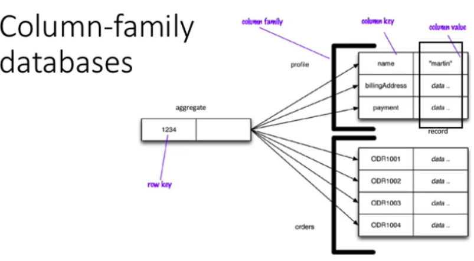

Un esempio è Cassandra: le colonne sono raggruppate in famiglie. Un altro esempio è Big Table.

Spesso si usa il concetto di riga, tabella o colonna, anche se questo è fuorviante: non si usano tabelle, ma mappe chiave-valore.

Questa struttura è più simile ad una doppia mappa annidata:

- La prima, esterna, è una struttura dati che memorizza le righe (la chiave è un identificatore della riga).  
  Nella mappa esterna il valore associato all'identificatore della riga è la mappa interna.
- La mappa interna va a memorizzare tante coppie chiave-valore quanti sono i valori degli attributi di quella riga.

E' utile per le rappresentazioni sparse, con poche o tante colonne per ogni riga.

E' anche molto dinamica: posso aggiungere un numero a piacere di nuove colonne per ogni riga.

Esistono quindi righe "fat" e "skinny":

- Fat: con tantissime colonne, molto dense
- Skinny: hanno un numero di colonne molto rado.

## Database a grafo

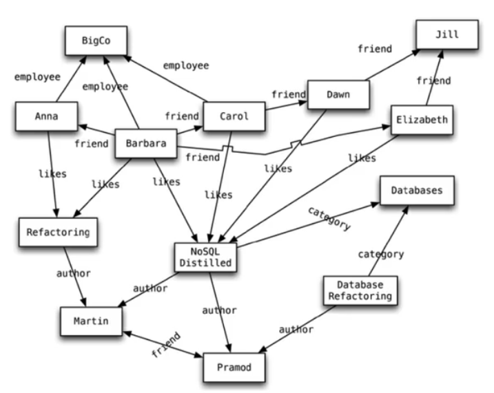

I nodi non rappresentano per forza lo stesso tipo di entità.

La necessità è di rappresentare oggetti di interesse con relazioni eterogenee e complesse.

I nodi sono praticamente un "singolo valore". Il modello si arricchisce nei tipi di archi, distinti dalle etichette.

Questa struttura può essere altamente dinamica: se serve semplicemente creo un nuovo arco.

Nella struttura possiamo fare delle interrogazioni che possono navigare parti anche ampie del grafo. La particolarità è che si possono effettuare navigazioni molto efficienti.

Sono DB a grafo:

- FlockDB: Nodi e archi semplici, con un solo valore
- Neo4J: Permette di allegare oggetti Java come proprietà assegnabili sia ai nodi, sia agli archi del grafo.
- Infinite Graph: usa oggetti Java, ma devono essere sottoclassi dei tipi del DB.

Le interrogazioni in questo genere di DB sono molto efficienti per query grandi. Le prestazioni non calano in funzione del numero di nodi esplorati.

Non sono inoltre necessarie chiavi esterne.

Sfortunatamente, al tempo di inserimento le performance sono meno elevate. In più, non è facile clusterizzare: cercando di partizionare favoriamo o meno alcune parti del grafo.

Con i DB NoSQL condividono l'orientamento all'aggregazione e sono senza schema

## DB Schemaless

### Vantaggi

- Un DB relazionale per funzionare ha bisogno dello schema
- Con gli store di documenti/key-value/colonne possiamo aggiornare qualunque valore in un qualunque momento della vita dell'applicazione. Il modello è più dinamico e può essere variato senza particolari intoppi.
- Nei DB a grafi siamo liberi di aggiungere nuovi archi e nuove proprietà ai nodi e agli archi
- Abbiamo più flessibilità per cambiare durante lo sviluppo:
  - Nuove funzionalità? Le aggiungo subito al progetto
  - Non serve più una feature? La tolgo senza rischiare di perdere i dati già presenti

### Svantaggi

- La flessibilità con lo schema può portare ad una complessità maggiore nello sviluppo della parsificazione necessaria per il contenuto degli oggetti (deve prevedere la presenza di ogni feature in un qualunque stadio dello sviluppo)
- Abbiamo uno schema implicito, un insieme di assunzioni riguardo la struttura dei dati
- **Un DB schemaless sposta lo schema implicitamente nel codice dell'applicazione**

### Soluzioni agli svantaggi

- Incapsulare tutte le interazioni col DB in un'unica applicazione ed esporle alle altre applicazioni in un'interfaccia accessibile via HTTP
- Sfruttare il modello dei dati che ho a disposizione per andare ad isolare porzioni dello schema modificate in certi istanti

Possiamo fare come i RDBMS che hanno le viste: cachiamo e pre-calcoliamo le query in previsione di esse.

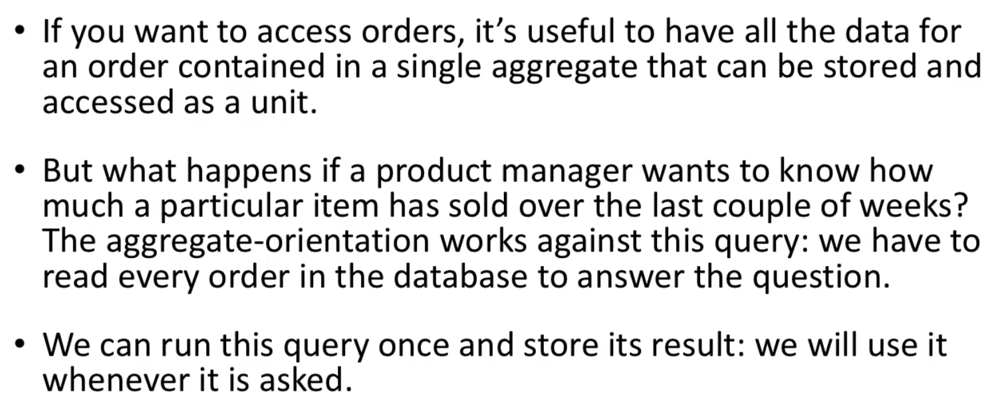

### Strategie per mantenere le viste materializzate

1) **Approccio eager**: aggiorniamo la vista materializzata non appena aggiorniamo i dati di base.  
   Nell'esempio, aggiungere un ordine aggiornerebbe immediatamente la cronologia degli acquisti per ogni prodotto.
2) **Approccio lazy**: se non vogliamo sopportare l'onere di ogni aggiornamento effettuiamo un calcolo batch per aggiornare le viste materializzate ad intervalli regolari.  
   Dobbiamo però conoscere quanto i requisiti di business possono sopportare dei dati obsoleti

Si può voler denormalizzare i dati, in modo da rendere rapidamente accessibili quelli di interesse più frequente.

Questo può anche aiutare a ridurre o annullare il numero di JOIN necessari.

## Modelli di distribuzione

Ci aspettiamo di lavorare su un cluster e di avere richieste per grandi moli di dati.

Nei database relazionali le applicazioni interrogano creando delle transazioni, che richiedono dei vincoli forti sui dati. Questi vincoli devono essere rilassati se si vuole distribuire il carico su più server.

Sicuramente avere un cluster dà dei benefici, ma dobbiamo essere in grado di gestire le rotture e i benefici devono essere sostanziali.

- **Replicazione**: conserva molte copie dello stesso dato. Non ha senso tenerlo sullo stesso disco, ma devono esistere su più nodi separati.
- **Sharding**: partiziono diversi tipi di dati su diversi nodi.

La replicazione e lo sharding sono due tecniche ortogonali: si possono usare anche assieme.

La replicazione è di due tipi: master-slave e peer-to-peer.
Le tecniche che esistono sono:

- First single-server
- Master-slave replication
- Sharding
- Peer-to-peer replication

### Single Server Distribution

Corrisponde ad un unico server: non distribuiamo.

È il più semplice. Accetta qualunque genere di lettura o scrittura, e va bene per ogni situazione: grafi, key-value, ec

### Multiple server sharding

La situazione ideale per l'utilizzo dello sharding è che diverse persone accedono a diverse parti dei dati. In questo caso è possibile scalare orizzontalmente, mettendo diverse parti dei dati su diversi server (sharding).

Come risultato, ogni utente che deve solo parlare con un solo server riceverà risposte molto rapidamente.
Il carico è distribuito uniformemente tra i server. Se ne abbiamo 10, ognuno dovrà reggere il 10% del carico complessivo.

Inoltre, se abbiamo distribuito i dati su diversi server, possiamo distribuire i dati, ma l'ideale sarebbe che vengano richiesti blocchi "vicini" in modo da non dover fare connessioni con altri server.

Come possiamo raggruppare i dati in modo che un utente riceva i dati da un solo server?  
Si aggregano tutti i dati comunemente acceduti in contemporanea, in modo che aggregandoli si formi un'ovvia **unità di distribuzione**.

Riguardo la disposizione dei dati sui nodi, ci sono diversi fattori che possono aiutare a migliorare l'efficienza:

Se sappiamo che gli accessi sono correlati a una posizione fisica, si può lasciare i dati in vicino a dove vengono acceduti (se hai gli ordini di Boston collocherai il server nel data center nell'est degli stati uniti).

## Load Balancing

Con lo sharding possiamo distribuire i dati. Se però una grande parte dei dati è richiesta su un unico server, utilizzeremmo poco (e male) tutti gli altri.

Il load balancing punta a distribuire il carico in maniera bilanciata su diversi server.

Dovremmo effettuare una distribuzione degli aggregati il più uniforme possibile. Per farlo, possiamo utilizzare il pattern mining.

Può anche essere utile aggregare le pagine comunemente richieste assieme.

Il partizionamento dei dati è stato fatto dall'applicazione software storicamente. Può essere vista come una debolezza: è l'applicazione che deve decidere come gestire il carico (che può cambiare nel tempo).

Si possono usare anche delle funzioni di auto-sharding dei DB, in modo da effettuare suddivisioni automatiche. Il vantaggio è la rimozione delle responsabilità dall'applicazione.

Lo sharding è importante: può migliorare le prestazioni!

Se iniziassimo col tenere delle repliche (1 copia per server) più del caching, possiamo migliorare le performance in lettura, ma chiaramente non aiuto la scrittura.

Lo sharding **scala in orizzontale** solo se aggiungo più server che condividono parte dei dati: è meno probabile che ci siano delle scritture sullo stesso server.

Possiamo usare uno dei server come master: in questo modo si risolvono i problemi di consistenza

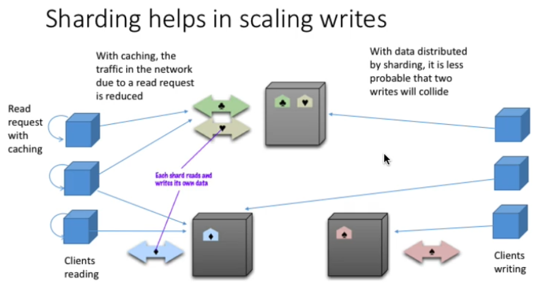

Uno dei nodi nelle repliche master-slave è visto come primario: è lui il responsabile della consistenza.

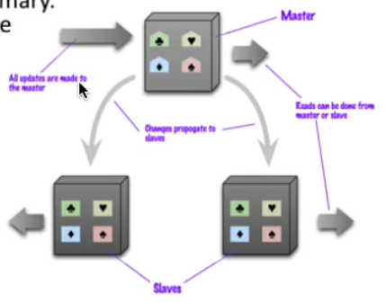

Una volta che anche gli slave ricevono i dati possono rispondere alle richieste come il master. In questo modo il master è un **collo di bottiglia per le scritture**!!

Un vantaggio però dell'avere più slave è la **read-resilience**: se il master muore abbiamo ancora i dati sugli slave (in mongoDB ad esempio gli slave possono temporaneamente rispondere a richieste se il master è irraggiungibile).

Nel periodo in cui i dati devono essere sincronizzati si rischia di essere in presenza di inconsistenze (gli slave hanno dei dati vecchi che il master ha aggiornato).

## Peer to Peer replication

In questo caso non è presente solo più un master: ogni server ha una parte della responsabilità del master. I nodi comunicano tra di loro le operazioni di scrittura che hanno accettato in modo da tenere tutto sincronizzato.

Tutti i nodi accettano le scritture; in più se uno muore tutti gli altri possono continuare.

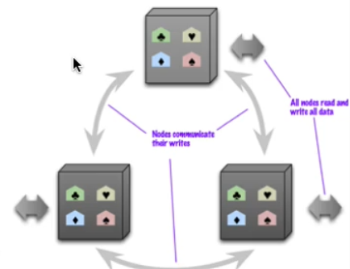

Aggiungendo più nodi rendiamo più veloce il sistema, ma rischiamo maggiormente problemi di inconsistenza: più nodi abbiamo e più è probabile che uno abbia uno stato arretrato.

Ci possono anche essere dei conflitti write-write (doppia richiesta di scrittura allo stesso tempo), oltre a possibili inconsistenze che sovrascrivono copie corrette dei dati.

**Rimedio**: facciamo trade-off tra consistenza e disponibilità dei dati.

Usiamo un approccio pessimistico e cerchiamo di mantenere la massima consistenza dei dati, a scapito della velocità di risposta. Costa di più in termini di traffico utilizzato per la sincronizzazione.

In pratica: non serve che tutti i server siano d'accordo, ma ne basta la maggioranza.

---

**Alternativa**: possiamo utilizzare un approccio ottimistico: vogliamo avere la massima disponibilità.

In questo caso decidiamo di poter sopportare una scrittura inconsistente. Dobbiamo introdurre delle regole però per ripararle.

Abbiamo un nodo autorevole per ciascun dato, e se abbiamo bisogno di dettagli per la consistenza ci riferiamo a quello specifico.

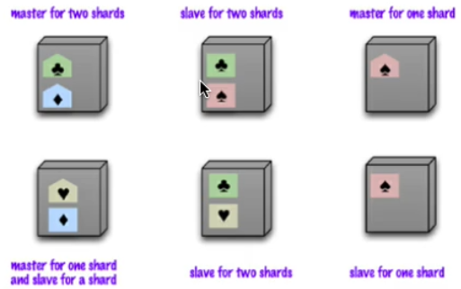

La combinazione dello sharding con la replica in P2P è quindi una strategia comune per i DB NoSQL (specialmente quelli colonnari).

## Garantire la consistenza

I DB relazionali devono mantenere una consistenza forte, evitando qualunque inconsistenza.

**Update consistency**: due aggiornamenti separati cercano di effettuare una modifica sullo stesso oggetto simultaneamente. Questo è un conflitto write-write.  
Il server serializzerà le due update: la seconda sovrascriverà la prima.

Possiamo avere due approcci:

- Un primo approccio **pessimistico** porta ad un fallimento se vi è un conflitto. In questo modo lo si previene. Si possono usare i lock in scrittura.
- Nel caso dell'approccio **ottimistico** si effettuano dei test per verificare se i dati sono cambiati prima della scrittura (**Conditional Update**). In questo modo la seconda scrittura sarebbe fallita.

## Consistenza e serializzazione con multipli server

La serializzazione non risolve i problemi se abbiamo più server (specialmente in p2p!).

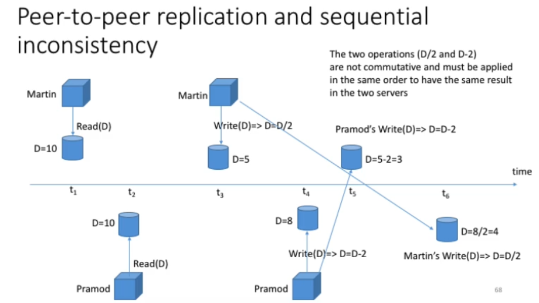

Le operazioni devono essere eseguite nello stesso ordine.

- L'approccio **ottimistico** riguardo questi problemi consiste nel salvare entrambi gli aggiornamenti e poi verificare la presenza di un conflitto a valle (i _versioning systems_ sono un esempio). La politica per il merge non è universale.
- L'approccio **pessimistico**, sebbene risolva i conflitti, degrada parecchio la velocità di risposta. Può capitare in caso di deadlock. Di solito quindi si usa un singolo nodo come master per una copia di un dato, e gli altri sono slave.

## Logical consistency

Garantisce che i lettori del data store otterranno sempre delle risposte consistenti alle richieste. E' una specie di consistenza fornita tramite dei vincoli della business logic.

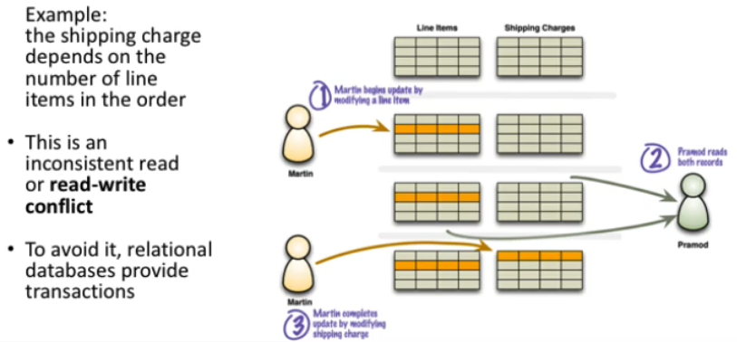

Questa inconsistenza è legata ad un vincolo applicativo; è risolvibile con le transazioni.

I DB NoSQL che usano aggregati non sfruttano le transazioni (ma il trucco dell'aggregato).

## Inconsistency Window

Non tutti i dati possono essere raggruppati nello stesso aggregato.

La durata di tempo durante la quale è presente un'inconsistenza è chiamata **inconsistency window**. Un sistema NoSQL può avere una IW molto piccola.

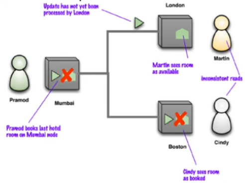

Questa finestra di inconsistenza è legata al principio di consistenza "finale" (**eventual consistency**). Se non ci sono ulteriori aggiornamenti alle repliche dei dati, eventualmente (in un momento futuro) tutte le repliche avranno gli stessi valori.

Più repliche abbiamo e più il problema e la finestra delle inconsistenze peggiorano (ad esempio, se avvengono aggiornamenti in rapida successione).

## Consistenza di sessione / timestamps

Spesso applicazioni lavorano nel contesto di una sessione.

Si pensi ad un sistema di blogging. Potenzialmente è strutturato in modo tale che una volta inviato un commento, non subito lo si veda.

Si può risolvere il problema con un incapsulamento dell'interazione dell'utente col server in una **sessione**; Possiamo usare un timestamp per identificarla.

Questa è una sticky session: è legata ad un server e c'è la garanzia della consistenza **read-your-writes**.

Lo svantaggio è che il bilanciamento del carico di richieste verso il server potrebbe non essere più facile.

---

Sia la consistenza di sessione, sia le timestamps sono modi per memorizzare una storia percorsa su un dato.

Quando una sessione cerca di accedere ad un dato, si segna il timestamp congelando il dato letto dalla sessione per mantenere la consistenza nella sessione.

Lato server dobbiamo assicurarci che non siano accettate azioni di scrittura che modifichino il dato congelato.

Sono tutte forme diverse per il rilassamento della consistenza del dato.  
La consistenza è desiderabile, ma spesso ponendo dei vincoli troppo forti si rallentano le prestazioni.

Vogliamo anche capacità di distribuzione e alta disponibilità del dato, ma dobbiamo capire fino a che punto possiamo spingerci.

## CAP Theroem

Sono tre proprietà delle applicazioni distribuite:

        Date le tre proprietà _Data consistency_, _Availability_ e _Partition Tolerance_, ne puoi avere solo due.

- **Availability**: Se puoi comunicare con un nodo nel cluster, esso può leggere e scrivere
- **Partition tolerance**: il cluster può sopravvivere ad interruzioni nella comunicazione che separano il cluster in multiple partizioni (non in grado di comunicare tra di loro)

Consistent and Available, Consistent and Partition Tolerant, Available and Partition Tolerant

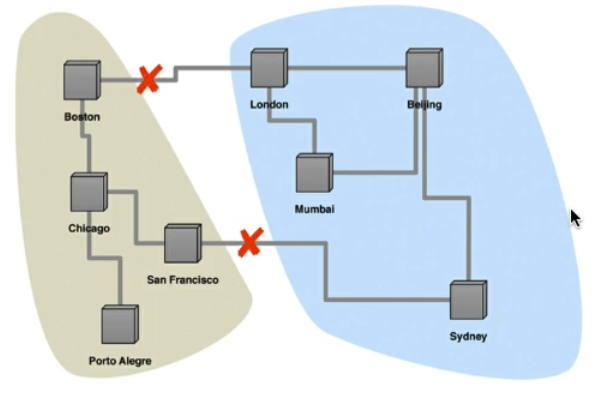

Bisogna scegliere il giusto mix di caratteristiche a seconda delle esigenze dell'applicazione.

Architettura distribuita -> Partition Tolerance

C'è ancora la possibilità di ottenere l'eventual consistency:  
Supponiamo che vi sia un nodo o una partizione temporaneamente isolata. Se dovesse ricevere una richiesta di un dato, come dovremmo comportarci?

- Se ho il dato, lo rendo disponibile anche se è inconsistente, perché so che sono isolato
- Mi rifiuto di rispondere sapendo di essere isolato.

A un certo punto la partizione torna connessa: non appena verifica di essere consistente (consistenza finale) può rispondere.

La consistenza del dato e la latenza sono due proprietà in trade-off. Possiamo migliorare la consistenza, ma aggiungiamo del tempo di risposta in funzione del numero di nodi presenti nel cluster.

## Rilassare la durabilità

La durabilità è lo scopo finale di un DBMS. Potrebbero esserci dei casi in cui potremmo scambiare un po' di durabilità per performance più elevate.

Un altro possibile trade-off è quando abbiamo multiple repliche: un fallimento nella replicazione avviene quando un nodo processa una update ma fallisce prima che quell'update sia replicata agli altri nodi.

In una distribuzione master-slave il fallimento nella replicazione avviene quando gli slave scelgono un nuovo master in seguito ad un fallimento del precedente master.  
Quando viene cambiato il master, tutte le scritture non propagate alle repliche saranno perse.  
Una miglioria può consistere nell'attendere in alcune conferme dalle repliche prima di confermare al client.

### Quorum

Sono un modo pratico per utilizzare i nodi a disposizione.

Abbiamo un certo numero di nodi e il fattore di replica (numero di copie richiesto di un certo dato). I due valori sono decisamente diversi (molti server, un po' di repliche in numero dispari).

Volendo avere i dati a disposizione e una garanzia di consistenza possiamo, sapendo che non tutti i server potrebbero essere d'accordo tra loro, sapere quanti nodi dobbiamo coinvolgere in un'operazione di lettura/scrittura?

Il valore è W > N / 2: dovremo aspettare quel numero di scritture con successo. E' facile capire che se con la lettura leggeremo la maggioranza delle repliche, troveremo di sicuro il valore corretto.

#### Read Quorum

Quanti nodi bisogna contattare per essere sicuri di avere la versione più aggiornata dei dati?

Il valore dipende dal numero di nodi necessari per confermare una write. Possiamo avere letture consistenti anche se non abbiamo una consistenza forte nelle scritture.

Il numero di nodi che dobbiamo contattare (R) è R + W > N

## Version Stamps

Sono dei numeri di versione affissi al dato e restituiti assieme ad esso.

Di solito il momento in cui l'applicazione diventa lenta è quando si interagisce col DBMS e bisogna attendere una risposta dall'utente.

Se aprissimo una sessione prima che i dati ci arrivino, bloccheremmo l'accesso al DB a lungo (e non lo facciamo quindi).

La tecnica principale è quella della **concorrenza offline**.

### Optimistic Offline Lock / Version Stamp

E' un approccio ottimistico che utilizza una conditional update.

Farò una scrittura solo se il version stamp dei dati è rimasto invariato rispetto all'inizio dell'attività. Se le due versioni sono diverse, allora rifiuto l'operazione di scrittura e aggiorno i diversi stamp.

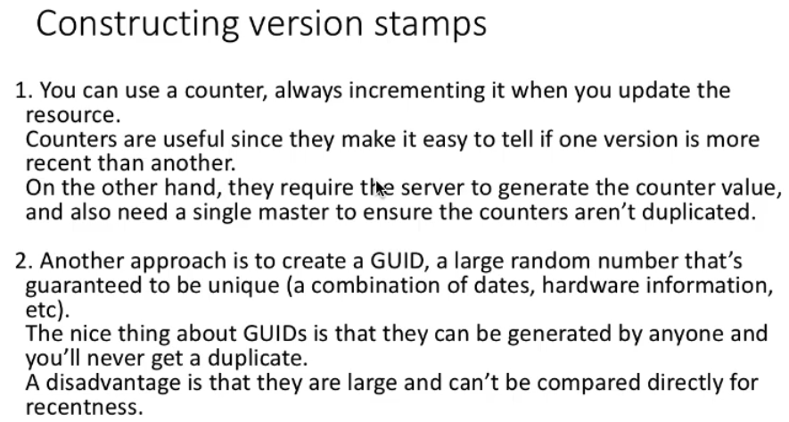
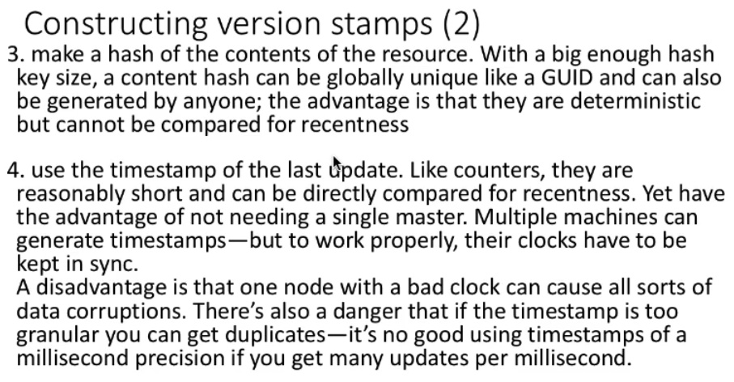

CouchDB usa sia il counter, sia l'hash del contenuto. Questo permette di comparare la recentezza, anche con replicazione p2p.

I version stamp sono utili anche per mantenere la consistenza tra sessioni (accedere agli stessi dati ed evitare di accedere a server senza le modifiche).

Si può usare un master che genera numeri di versione, mentre gli slave cercheranno di inseguirlo per sincronizzarsi.  
Se siamo in una situazione p2p, quindi senza un vero master, non abbiamo modo però di condividere un unico version stamp.

Se si utilizzasse un metodo incrementale, chi legge può preferire un version stamp più recente (ipotizzando VS ordinati, anche se non unici).

Se stiamo cercando di leggere un dato da più nodi in conflitto, potremmo scegliere la versione con la storia più lunga. Se però la storia non è inclusa completamente in un'altra, avremo problemi.

## Vector Stamp

Coi DB NoSQL si usano i Vector Stamp. Sono numeri interi e possono essere visti come timestamp associati al valore.

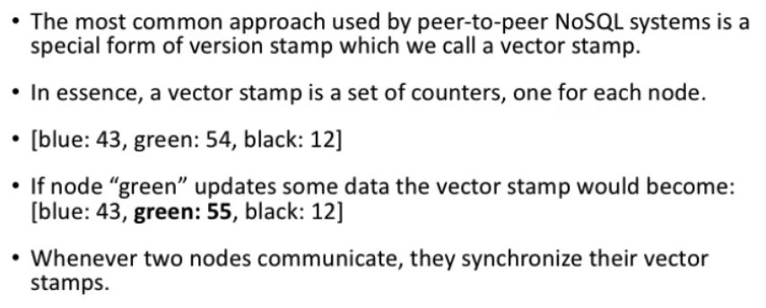

Le modalità con cui i nodi si sincronizzano è variabile.

Quando due nodi comunicano tra di loro, si scambiano e confrontano gli stamp. Se tutti i valori di un vector sono maggiori di quelli di un altro, allora abbiamo un vector stamp più recente.

Se ci sono valori maggiori in entrambi, abbiamo un conflitto write-write.

I Vector Stamp sono un metodo utile per **individuare** le inconsistenze, **ma non le risolvono**.

La risoluzione dei conflitti è un problema specifico del dominio in cui si lavora. Questo problema è parte del tradeoff tra consistenza e latenza.

O accettiamo il fatto che le partizioni del sistema lo rendano non disponibile, oppure dobbiamo individuare e gestire le inconsistenze.

## Map Reduce e Cluster di server

MapReduce è un framework algoritmico per l'esecuzione di job in parallelo su più nodi di un cluster.

Map: Lista(A) -> Lista(B)

Reduce: funzione accoppiata alla prima che va a "ridurre" il volume dei dati. Tipicamente si fanno statistiche sulle chiavi precedentemente mappate.

Possiamo mappare una parola in un documento ad un numero. Chiave parola, valore numero.  
La reduce fa statistiche sulle parole.

La cosa positiva di questo paradigma di calcolo funzionale è che non necessita di un grande spazio di memoria per le variabili in quanto il programma non necessita di uno stato interno: la funzione prende i parametri in input e produce un risultato.

È possibile anche verificare la correttezza di un programma funzionale: il risultato di una funzione è deterministico.

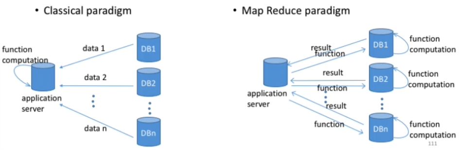

In questo modo riduciamo il traffico di dati!

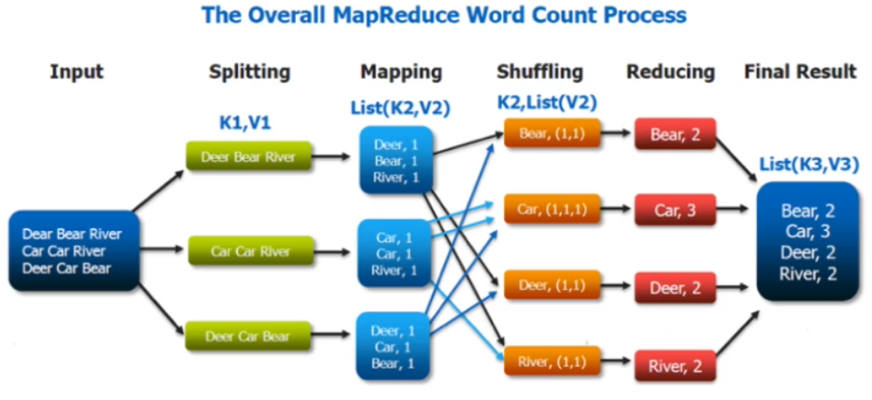
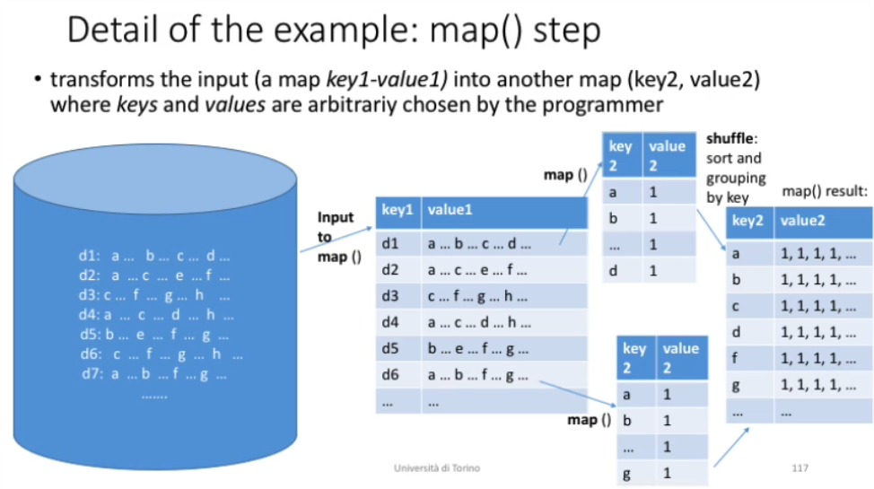
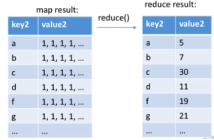
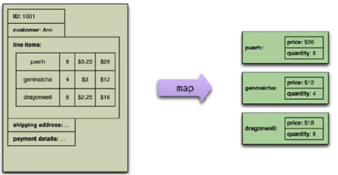

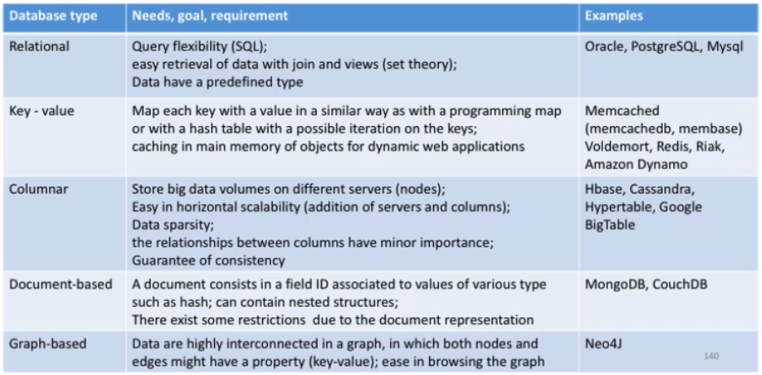

## Persistenza poliglotta

A seconda delle caratteristiche dell'attività dovremmo associare un DB adeguato.

Dovremmo usare una varietà di linguaggi di query per i molteplici data model. Una possibile soluzione è la progettazione di un web service che fa da punto di accesso al backend.

Svantaggi:

- Abbiamo imposto l'apprendimento di questa tecnologia
- Avremo molteplici server da gestire

Vantaggi:

Se ci sforziamo di usare i RDBMS dappertutto, dovremo poi far fronte ad un'elevata complessità nella gestione dei dati e quindi i costi di sviluppo incrementeranno. Dovremmo fare il contrario!

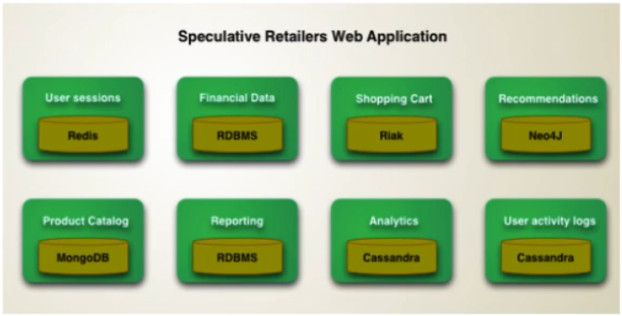

## Riak

E' un DB key-value con richieste REST: bassa latenza e interfaccia utile per il web.

I valori possono essere un qualunque oggetto testuale (JSON, XML, ecc.).

Il DBMS è tollerante ai fallimenti e punta ad essere altamente disponibile. Supporta la concorrenza.

Non è facile costruire collegamenti, visto che non è presente il concetto delle foreign keys.

Riak va bene per essere eseguito su tanti nodi P2P: su passano le informazioni su un anello.

I nodi virtuali sono chiamati Vnodes e servono per distribuire le chiavi degli oggetti che voglio memorizzare nel nodo del cluster in modo uniforme. Esistono comunque anche nodi fisici (cioè veri server).

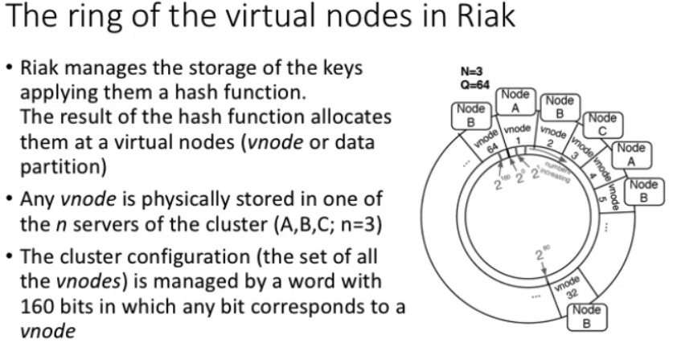

Sui vnodes quindi ci sono partizioni dell'insieme di chiavi gestito. Per avere la garanzia di consistenza si usa il quorum.

### Letture e scritture nei vnode

Un nodo che sta gestendo un'operazione di lettura o scrittura è il **coordinatore** di essa.

Riak controlla le letture e le scritture nei nodi con tre valori:

- N: numero dei nodi in cui un'operazione di scrittura deve replicarsi.  
  In altri termini, il numero di copie di qualunque dato tenuto per sicurezza; di default è 3.
- W: Il numero di nodi su cui un'operazione di scrittura deve avere successo per confermare l'avvenimento della scrittura.  
  Quindi, se W \< N, un'operazione di scrittura è considerata accettabile anche se Riak non le ha ancora completate tutte (e questo avverrà in background)
- R: numero di nodi che sono necessari per considerare un'operazione di lettura come completata con successo.  
  La ridondanza è dovuta alla distribuzione e alla possibile, momentanea inconsistenza dei dati.  

  Se R \> N, l'operazione fallisce.

---

Riak non per forza garantisce la consistenza forte per le scritture: sta al programmatore decidere i tre parametri W, N e R.

Riassumendo:

- N: numero di repliche per una certa operazione.
- W deve essere < N per considerare l'operazione accettabile (e quindi termina anche prima della copia completa su tutti gli altri nodi).
- R: numero di nodi che il sistema va a contattare per capire quale è il valore corretto.

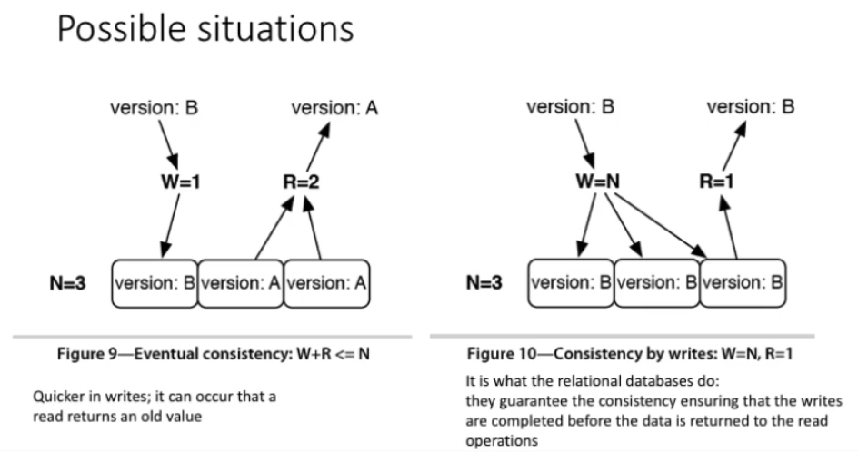
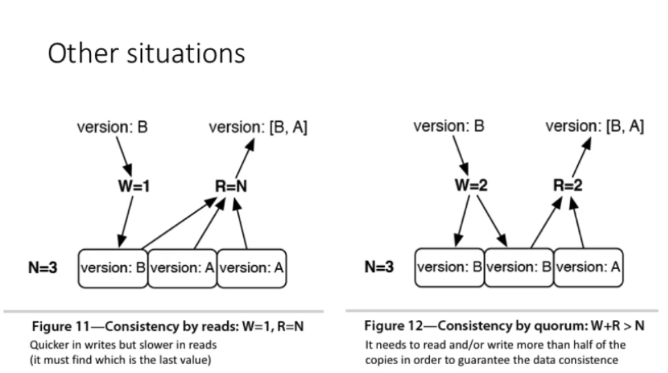

### Riconciliazione di update in concorrenza

Riak permette multiple versioni dello stesso oggetto.

In presenza di fallimenti, queste versioni potrebbero essere in conflitto e dovrebbero essere riconciliate.

Ogni versione ha un _vector clock_: Object([Nodo_i, count_i], [Nodo_j, count_j],...)  
Il contatore è il numero di sequenza della versione dell'oggetto in quel nodo.

Quando un client desidera aggiornare un oggetto, deve specificare la versione. Questo è fatto passando il contesto ricevuto prima da un'operazione di lettura, che contiene il vector clock.

Quando ci sono più rami, entrambe le versioni devono essere conservate. E' il client che effettua la riconciliazione.

Quando il numero di coppie (nodo, counter) nel vector clock raggiunge un limite, la coppia più vecchia viene rimossa (**vector clock truncation**)

## HBase

E' un database colonnare, progettato per essere scalabile e per gestire multipli nodi. Fornisce garanzie forti sulla consistenza dei dati.

Le tabelle non sono relazioni; le righe non sono record relazionali; le colonne sono completamente variabili e non vincolate da uno schema (che è importante, ma solo informativo).

Ha anche funzionalità di versioning, compressione, garbage collection e tabelle in-memoria.

E' adatto ad effettuare analisi e a scansionare grossi volumi di dati.

Gestisce in maniera distribuita le scritture con operazioni write ahead: si restituisce ancora prima del completamento dell'operazione.

### Summary HBase

- Include una robusta architettura scale-out e ha funzionalità di versioning e compressione
- Mantiene automaticamente una storia delle versioni
- E' progettato per scalare

Ma:
- Non fa "scale-down"
- Non offre alcuna funzionalità per l'ordinamento o l'indicizzazione, a parte per le chiavi di riga
- Non esiste il concetto di datatype

## Bloom Filters

Si conserva un array di bit di una certa dimensione, con tutti i bit inizializzati a 0. Quando un nuovo blob di dati viene caricato, si applica una funzione di hashing che genera una sequenza di bit che verranno salvati nell'array nelle posizioni corrispondenti.

Quando cerchiamo una chiave, applichiamo la funzione di hash: se qualche bit non corrisponde, allora la chiave **non è mai stata inserita**.

Invece, se tutti i bit corrispondono, allora la chiave potrebbe essere stata inserita, oppure i bit sono a 1 come conseguenza di altre chiavi inserite. Possiamo infatti generare dei falsi positivi.

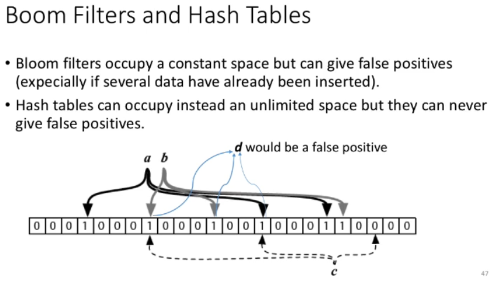

Abbiamo bisogno di cataloghi che indichino quale regione contiene quali range di chiavi. Quando una regione è piena, popoliamo la successiva e memorizziamo i range delle chiavi di riga memorizzate nelle varie regioni.

## Neo4J

- Salva i dati in un grado (nel senso matematico, collezione di vertici connessi da archi)
- Dà particolare importanza alle relazioni tra i dati e non alle similarità tra insiemi di valori.
- Può immagazzinare dati altamente variabili in modo "naturale": ogni attributo è opzionale
- Utilizza Groovy per le query MapReduce e ha una interfaccia REST
- Ha indici e algoritmi specifici per l'attraversamento di grossi grafi
- E' scalabile
- Gestisce le repliche con una topologia master-slave su più server
- Ha transazioni che soddisfano le proprietà ACID
- Assicura una High Availability  
  Questo perché permette di scrivere anche sui nodi slave che poi si sincronizzeranno con il master.
  