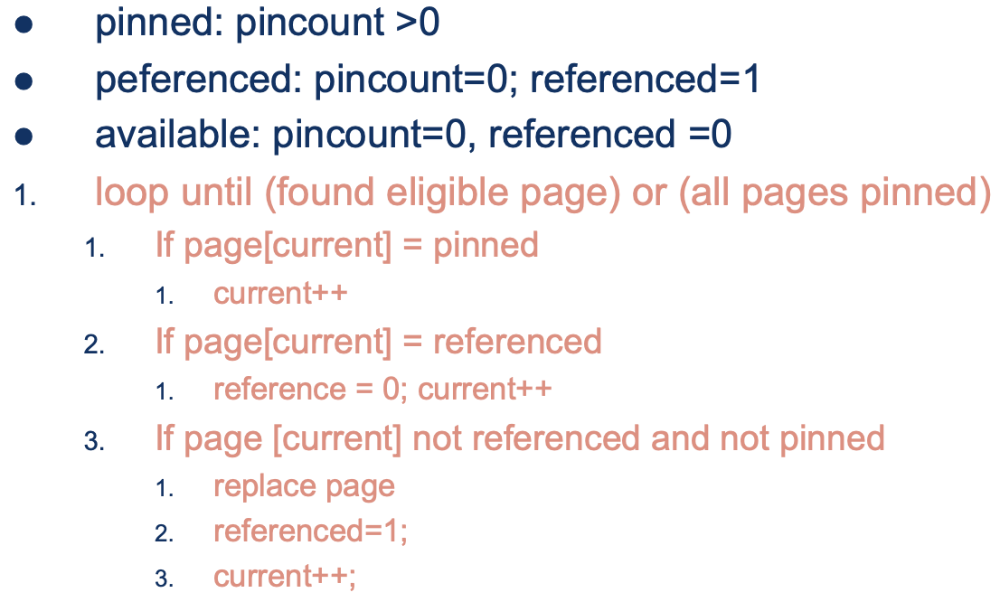

# MAADB <!-- omit in toc -->

- [Concetti base](#concetti-base)
  - [Database](#database)
  - [Data Model](#data-model)
  - [Schema](#schema)
  - [Qual è l'utilità dei vincoli?](#qual-è-lutilità-dei-vincoli)
  - [DBMS](#dbms)
    - [Indipendenza logica dei dati](#indipendenza-logica-dei-dati)
    - [Indipendenza fisica dei dati](#indipendenza-fisica-dei-dati)
- [Storia dei database](#storia-dei-database)
  - [Modello gerarchico](#modello-gerarchico)
  - [Modello reticolare](#modello-reticolare)
  - [Modello Relazionale](#modello-relazionale)
  - [Modello ad oggetti](#modello-ad-oggetti)
    - [Object Oriented](#object-oriented)
    - [Object Relational](#object-relational)
  - [DB semistrutturati](#db-semistrutturati)
  - [DB a Grafi](#db-a-grafi)
  - [Altri DB](#altri-db)
    - [Conclusioni sui generi di DB a grafo](#conclusioni-sui-generi-di-db-a-grafo)
- [Moduli e Architettura di un DBMS](#moduli-e-architettura-di-un-dbms)
  - [Disk Space Manager](#disk-space-manager)
  - [File and Access Methods](#file-and-access-methods)
  - [Buffer Manager](#buffer-manager)
  - [Recovery Manager](#recovery-manager)
  - [Transaction Manager](#transaction-manager)
  - [Lock Manager](#lock-manager)
  - [Proprietà delle Transazioni - ACID](#proprietà-delle-transazioni---acid)
  - [Moduli in relazione con l'Utente](#moduli-in-relazione-con-lutente)
- [Dischi e File](#dischi-e-file)
  - [Disco Magnetico](#disco-magnetico)
  - [Tipi di File](#tipi-di-file)
    - [Heap Files (panoramica)](#heap-files-panoramica)
    - [Sorted Files (panoramica)](#sorted-files-panoramica)
    - [Index Files (panoramica)](#index-files-panoramica)
  - [Heap Files](#heap-files)
    - [Record a lunghezza fissa e variabile](#record-a-lunghezza-fissa-e-variabile)
    - [Organizzazione IntraPage](#organizzazione-intrapage)
    - [Organizzazione InterPage](#organizzazione-interpage)
  - [Sorted Files](#sorted-files)
  - [Index Files](#index-files)
    - [Struttura di un file indice](#struttura-di-un-file-indice)
    - [ISAM](#isam)
    - [B+Tree](#btree)
    - [Prefix Key Compression](#prefix-key-compression)
    - [Bulk Loading](#bulk-loading)
    - [Indici Clustered e Unclustered](#indici-clustered-e-unclustered)
    - [Indici con chiavi di ricerca composite](#indici-con-chiavi-di-ricerca-composite)
  - [Indici basati su hash](#indici-basati-su-hash)
    - [Static Hashing](#static-hashing)
    - [Extendible Hashing](#extendible-hashing)
    - [Linear Hashing](#linear-hashing)
  - [Modello dei Costi](#modello-dei-costi)
- [Buffer Management](#buffer-management)
  - [Politiche di rimpiazzamento del buffer](#politiche-di-rimpiazzamento-del-buffer)
  - [Responsabilità del buffer manager](#responsabilità-del-buffer-manager)
  - [Politiche di sostituzione](#politiche-di-sostituzione)
    - [LRU - Least Recently Used](#lru---least-recently-used)
    - [MRU - Most Recently Used](#mru---most-recently-used)
    - [Clock - Approssimazione di LRU](#clock---approssimazione-di-lru)
  - [Sequential Flooding](#sequential-flooding)
  - [Algoritmo del clock](#algoritmo-del-clock)
  - [Separazione dei domini](#separazione-dei-domini)
  - [Algoritmo del working set (new algo)](#algoritmo-del-working-set-new-algo)
  - [Algoritmo basato su HotSet](#algoritmo-basato-su-hotset)
  - [Query Locality Set Model](#query-locality-set-model)
    - [Pattern di accesso ai dati](#pattern-di-accesso-ai-dati)
  - [Algoritmo DBmin](#algoritmo-dbmin)
    - [Index Based Query](#index-based-query)
- [Operatori](#operatori)
  - [Selezione semplice](#selezione-semplice)
  - [Selezione complessa](#selezione-complessa)
  - [Proiezione](#proiezione)
    - [Note sulla proiezione](#note-sulla-proiezione)
  - [Ordinamento](#ordinamento)
    - [Merge Sort](#merge-sort)
    - [Internal Sort](#internal-sort)
  - [Join](#join)
    - [Simple Nested Loop Join](#simple-nested-loop-join)
    - [Page-oriented Nested Loops Join](#page-oriented-nested-loops-join)
    - [Block Nested Loop Join](#block-nested-loop-join)
    - [Index Nested Loop Join](#index-nested-loop-join)
    - [Algoritmi Blocking e Sort Merge Join](#algoritmi-blocking-e-sort-merge-join)
    - [Sort Merge Join e una sua ottimizzazione](#sort-merge-join-e-una-sua-ottimizzazione)
    - [Hash-Join](#hash-join)
- [Ottimizzazione delle query](#ottimizzazione-delle-query)
  - [Query Tree](#query-tree)
  - [Query Optimization](#query-optimization)
  - [Valutazione dei join](#valutazione-dei-join)
  - [Heuristic VS Cost based operation](#heuristic-vs-cost-based-operation)
  - [Stima dei costi delle query](#stima-dei-costi-delle-query)
  - [Assunzioni alla base del modello dei costi](#assunzioni-alla-base-del-modello-dei-costi)
- [Gestione delle Transazioni](#gestione-delle-transazioni)
  - [Anomalie e serializzabilità](#anomalie-e-serializzabilità)
  - [Grafo delle dipendenze](#grafo-delle-dipendenze)
  - [Algoritmi basati sul Locking](#algoritmi-basati-sul-locking)
    - [Strict 2PL](#strict-2pl)
    - [Protocollo 2PL](#protocollo-2pl)
  - [Deadlock](#deadlock)
  - [Multiple-Granularity Locks](#multiple-granularity-locks)
    - [Intention Lock](#intention-lock)
  - [Dynamic Databases](#dynamic-databases)
  - [Locking su indici B+Tree](#locking-su-indici-btree)
    - [Algoritmo di Bayer-Schlonick](#algoritmo-di-bayer-schlonick)
    - [Even Better Algorithm](#even-better-algorithm)
    - [Optimistic CC - Kung/Robinson](#optimistic-cc---kungrobinson)
    - [Variante di KB, Validazione seriale](#variante-di-kb-validazione-seriale)
  - [Optimistic 2PL](#optimistic-2pl)
  - [Timestamp CC](#timestamp-cc)
  - [Multiversion CC](#multiversion-cc)
- [Crash Recovery](#crash-recovery)
  - [Il File di Log](#il-file-di-log)
  - [Checkpoint](#checkpoint)
  - [Gestione del Commit](#gestione-del-commit)
  - [Gestione dell'Abort](#gestione-dellabort)
  - [Gestione del Crash](#gestione-del-crash)
    - [Fase di Analisi](#fase-di-analisi)
    - [Fase di REDO](#fase-di-redo)
    - [Fase di UNDO](#fase-di-undo)

## Concetti base

### Database

E' una collezione di dati organizzati in modo tale da consentire lo svolgimento di certi task specifici:

- Interrogazione e reperimento di informazioni
- Analisi delle informazioni contenute nel Database
- La visualizzazione dei risultati

Un database deve essere facilmente interrogabile; ci deve essere un modo non ambiguo per visualizzare i risultati.

### Data Model

E' un formalismo rigoroso che consente di descrivere la struttura dei dati che sono contenuti nel database. Può essere Relazionale, Object Oriented, ecc.

### Schema

E' un particolare insieme di vincoli sui dati che sono descritti rispetto al formalismo dello specifico data model che è in uso.  
Se uso il modello relazionale (quindi con chiavi esterne, vincoli di integrità, ecc) uno schema mi informerà riguardo le tabelle, gli attributi che compongono i campi, ecc.

### Qual è l'utilità dei vincoli?

Permettono di semplificare gli aspetti organizzativi, di gestione e ottimizzazione. Consentono l'esistenza di algoritmi efficienti e scalabili.  
Nei Database relazionali i vincoli comportano una serie di problemi per memorizzare i record (spreco di spazio), ma ne semplifica il reperimento (agevolazione nell'accesso ai dati).  
Come contro, questi vincoli limitano potenzialmente l'utilizzo di un certo modello a certi ambiti specifici.

Abbiamo vincoli:

- **Fisici**: per la struttura dei dati: come li si organizza sui vari settori del disco
- **Concettuali**: UML, E-R. Si descrive quali sono i concetti che dovranno essere rappresentati ecome verranno rappresentati (un prodotto avrà il suo ID, un prezzo, una quantità...)
- **Logici**: relazionale, OO, OR.  
  Vengono espressi vincoli o considerazioni sul livello fisico: quali strutture per l'organizzazione saranno usate, come verranno effettuate le associazioni, le indicizzazioni, ecc.  
  Con il modello logico ci si avvicina al modello fisico. Il modello logico in parte colma il gap tra concettuale e fisico.  
  Esistono modelli Logici più vicini al livello concettuale (che quindi richiedono un maggiore sforzo per mapparlo al modello fisico) e altri più vicini a quello Fisico (non rappresentano al meglio i tutti costrutti che potremmo rappresentare per esempio con il modello OO).  
  Ad esempio, il modello Object Oriented è molto vicino al livello concettuale perché ha nativamente dei costrutti vicini al livello relazionale (gerarchie ed ereditarietà ad esempio).  
  Il modello relazionale invece è più vicino al livello fisico: il metodo di organizzazione per record è molto più vicino a quello fisico di memorizzazione dei dati su disco (il mapping è dunque semplificato).

### DBMS

Sono sistemi hardware e software per la gestione delle basi di dati. Permettono di svolgere operazioni di memorizzazione, interrogazione e manipolazione.

Con l'utilizzo di un DBMS possiamo raggiungere obiettivi altrimenti impossibili con il semplice uso di un file system:

- Indipendenza fisica e logica dei dati
- Semplicità d'uso
- Integrità e sicurezza dei dati
- Amministrazione uniforme dei dati
- Accesso concorrente
- Recovery

Un DBMS deve garantire l'indipendenza logica e fisica dei dati: garantire un livello di astrazione tale per cui, a fronte di variazioni di ciò che sta sotto, le applicazioni scritte dall'utente non debbano essere adattate.

#### Indipendenza logica dei dati

A fronte di un'eventuale modifica nella struttura logica dei dati (un nuovo attributo, cambia lo schema, ecc.) il DB deve consentire che ciò che era stato scritto e risultava funzionante continui a funzionare.

#### Indipendenza fisica dei dati

Bisogna risultare protetti da modifiche della struttura fisica dei dati (nuovo indice o rimozione, cambia il metodo di indicizzazione dei dati).

## Storia dei database

### Modello gerarchico

Si usa una gerarchia per i dati, come una struttura ad albero. Si usano puntatori bidirezionali da padre a figlio. La navigazione nel database era puramente procedurale.

### Modello reticolare

Si basa sempre sui puntatori, ma si perde il vincolo della struttura ad albero, passando invece a grafi.

Il modello descrive gli oggetti in termini di oggetti e relazioni tra essi. Se A punta a B, significa che esiste una relazione tra A e B.

Svantaggi (anche del modello gerarchico):

- **Distanza dal livello concettuale**: I due modelli si prestavano particolarmente bene per applicazioni di tipo procedurale, mentre per sistemi ospedalieri/bancari/universitari non lo erano molto.
- **Imprevedibilità del puntatore**: Quando si segue un puntatore, si sa che c'è, ma non sappiamo dove arriviamo. Non possiamo fare previsioni e questo danneggia le potenziali ottimizzazioni che si potrebbero effettuare.  
  Abbiamo bisogno di maggiore prevedibilità per permettere all'ottimizzatore di ottimizzare le query
- Era difficile scrivere query procedurali.

### Modello Relazionale

I dati sono organizzati in frammenti tra loro omogenei: quando si dichiara una tabella si decidono tutti i vincoli strutturali. Se creo una tabella "Studente", tutti gli studenti avranno le stesse proprietà.

Vantaggi:

- **Omogeneità e prevedibilità dei dati**: Se conosco i dettagli di una tabella (elementi, parametri, ecc.), posso stimare quante pagine dovrò leggere per portare in RAM tutte le informazioni necessarie.  
  Grazie alla prevedibilità è possibile ottimizzare la lettura su disco. Prevedibilità implica ottimizzabilità.
- **Assenza di puntatori**: visto che sono fonte di imprevedibilità, sono stati eliminati. Definire record che si trovano in un'altra tabella è possibile e si può fare tramite il concetto di chiave esterna. Si fa JOIN su di essa per ottenere le informazioni che ci servono. Possiamo sempre effettuare ottimizzazioni.
- **Linguaggio Dichiarativo (SQL)**: La possibilità di specificare in modo dichiarativo che cosa si vuole fare ha reso il modello molto popolare. All'utente la struttura fisica dei dati non interessa.
- **Algebra Relazionale**: Sono necessari pochissimi operatori dell'algebra relazionale per implementare le operazioni disponibili in SQL.  
  L'SQL è dichiarativo: specifico cosa voglio fare senza preoccuparmi di nessun dettaglio.  
  L'algebra relazionale è procedurale: è presente un concetto di sequenzialità nelle operazioni da eseguire. E' facile da ottimizzare perché abbiamo poche possibili alternative. Pur essendo pochi gli operatori, il problema dell'ottimizzazione è molto complesso (NP-completo ed esponenziale in funzione del numero di operatori)
- **Vicinanza al livello Fisico**: Le tabelle sono composte da multiple righe, memorizzabili facilmente su disco: i dati sono compattabili in modo adiacente.

Svantaggi:

- L'omogeneità dei dati può ledere applicazioni che non hanno bisogno di quest'aspetto (dati multimediali, gerarchie)
- I dati sono piatti e divisi: bisogna fare molti JOIN per recuperare interamente le informazioni che cerco.
- L'ereditarietà non è immediatamente rappresentabile
- Non è possibile effettuare match parziali

### Modello ad oggetti

Esistono

- Object Oriented
- Object Relational

In entrambi i casi il concetto fondamentale è quello di **oggetto**: sono modelli che descrivono oggetti e le relazioni che intercorrono tra di essi.

In entrambi vi è uno **schema ad oggetti** (che ricorda quello delle classi java ad esempio). E' possibile dichiarare strutture dati complesse a piacere e, nativamente, si dichiarano i metodi che possono operare su queste strutture dati.

Intrinsecamente si portano dietro i concetti di gerarchie ed ereditarietà.

#### Object Oriented

Sarebbe una forzatura avere una "base" relazionale. Gli OODB presentano un potere rappresentativo più elevato di quello del modello relazionale, e buona parte del business code finisce più in profondità nel DBMS, visto che non memorizza solo i dati, ma anche le funzioni eseguibili su di essi.

Sviluppato da accademici

#### Object Relational

Si lavora con oggetti, ma su una base ("core") relazionale.

I sostenitori dell'OR sostenevano che il modello relazionale aveva avuto troppo successo per essere abbandonato; era anche poco conveniente economicamente soppiantarlo.

Si è pensato che fosse conveniente realizzare un modello co-relazionale dove è possibile usare le feature ad oggetti e quelle relazionali (conveniente per ri-usare lavoro già svolto!).

Sviluppato da gente che risiedeva nel mondo del lavoro.

### DB semistrutturati

Con l'avvento di internet cambia la filosofia di accesso ai dati.

Prima ogni DB era un mondo a sè e non si considerava la possibilità di interfacce con altri sistemi esterni.

Con Internet non ci si scambia i dati direttamente nel "formato" del DB, in quanto bisognerebbe condividere lo stesso schema: si usano altri linguaggi di markup, come XML.

Nascono quindi le **basi di dati gerarchiche semistrutturate**.

Forniscono la possibilità di comunicare dati che non hanno una struttura definita rigidamente, e si possono ottenere anche informazioni riguardo la struttura stessa.

Si perde in prevedibilità, ma guadagno in espressività e flessibilità. Lo schema stesso è oggetto di interrogazione.

    Dimmi se è definito il campo INDIRIZZO e, se sì, qual è il suo valore. Inoltre dimmi com'è strutturato, se è un'unica stringa ad esempio.

I documenti XML sono autodescrittivi.

### DB a Grafi

La rappresentazione è la stessa dei reticolari, ma la differenza rispetto al passato è che il grafo utilizzato è semanticamente informativo. Le interrogazioni sono di tipo dichiarativo.

**Non è forzata la rappresentazione tramite un grafo!**

In realtà sono concetti messi in relazione tra di loro; la rappresentazione più comune o naturale è quella a grafo.

Abbiamo:

- **RDF (Resource Description Framework)**: è il core della rappresentazione della conoscenza all'interno del web semantico.  
  Consente di modellare il mondo (complesso a piacere) con triple: \<soggetto, predicato, complemento oggetto\>

  Tipicamente lo schema deve essere definito a priori (rigido!) quando lo si progetta, ma nel caso di RDF si tratta di un formalismo più "flessibile" grazie alla tripla, che rappresenta un fatto.

  In un grafo RDF, il soggetto è un nodo collegato tramite un arco, che ne rappresenta la relazione con un altro nodo.  
  Il tipo di arco (cioè la relazione) non è stata definita a priori, e potenzialmente il grafo può avere dimensioni considerevoli.

  Posso poi interrogare il grafo con delle query; molte di esse non corrispondono a quelle possibili con i DB relazionali.

  Si tratta di **query di raggiungibilità**, e per poterle effettuare si utilizzano linguaggi di query quali SPARQL.
- Social network.  
  Mentre con i DB RDF abbiamo tantissime relazioni, con i social network è il contrario: abbiamo moltissimi nodi e un numero limitato di tipi di relazione (follow, tweet, ecc.)  

  Potremmo utilizzare un DB relazionale, ma sarebbe costoso e con molte relazioni poco utili. Per le query di raggiungibilità dovrei effettuare tantissimi JOIN.

### Altri DB

- **DB Spaziali GIS (Geographic Information System)**: l'elemento di base è il concetto di location, come punto nello spazio, caratterizzato da coordinate puntuali.
  
  Questa rappresentazione ad-hoc esiste per permettere un certo tipo di query che non è disponibile negli altri DBMS.

  Un esempio sono le **query di range** o le query di **nearest neighbors**. Spesso si usa l'operatore rappresentante il **JOIN Spaziale**
- **Database documentali** per la memorizzazione di dati multimediali: si possono effettuare query che si basano sui dati (immagini, audio, video) e naturalmente si possono fare query specifiche ("trova foto simili")
- **Incertezza**: un elemento non rappresentabile con i DB relazionali. Possiamo pensare che quello che non dico sia falso o non lo so.
- **Confidenza**: associo dei pesi a ciascun arco.

#### Conclusioni sui generi di DB a grafo

La differenza focale tra i "nuovi" modelli a grafo e quelli vecchi è che quelli nuovi sono pensati per rappresentare le realtà che si prestano alla rappresentazione a grafo, mentre i modelli vecchi erano usati come forzatura per la tecnologia e i sistemi disponibili.

Naturalmente oggi si usa quello che più conviene, che sia a grafo, o relazionale.

## Moduli e Architettura di un DBMS

Al livello più basso dell'organizzazione del database abbiamo i seguenti moduli:

### Disk Space Manager

E' il modulo che gestisce lo spazio disco. Va a gestire la scrittura e la lettura dei dati sul disco stesso.

### File and Access Methods

Direttamente sopra al Disk Space Manager c'è il modulo per la gestione dei file. Si occupa di gestire lo spazio del disco; lo fa in base alla tipologia dei dati che si stanno memorizzando. Dati diversi hanno metodi di memorizzazione diversi.

Abbiamo tre tipi di file principali (ne esistono altri):

1) **Data file**: i dati veri e propri, inseriti e interrogati dalla base di dati. Sono anche chiamati _Heap Files_
2) **Indici**: sono definiti sui data files
3) **Catalogo di sistema**: all'interno vengono mantenuti i dati che descrivono gli altri files. Serve per ottimizzare: aiuta per gli indici, a sapere quanti predicati sono presenti, a scoprire la presenza di ridondanze (tutte informazioni utili per l'ottimizzazione delle query).

### Buffer Manager

Gestisce l'accesso ai file sul disco. Si passa attraverso questo manager: i dischi in genere sono molto grandi, mentre la memoria centrale è piccola a confronto.

In più, l'applicazione non accede direttamente ai dati sul disco, ma si interfaccia ad esso con il Buffer Manager.

Quando un'applicazione richiede una pagina di disco (in lettura/scrittura), non interagisce direttamente con esso, ma opera su una pagina caricata in memoria centrale/RAM (quindi è già nel buffer).

Si lavora in questo modo perché in genere le operazioni più costose sono quelle di accesso al disco, e quindi vogliamo limitarle il più possibile.

Esiste l'**ipotesi di località temporale**: ad un dato vi accederò un certo numero di volte: invece di fare quel numero di letture da disco, posso risparmiare tempo portando il dato nel buffer e poi leggendolo rapidamente da lì ogni volta che serve.

In ogni caso, la testina che legge il disco non porta mai un singolo record, ma l'intera pagina, che verrà quindi salvata nel buffer.

Abbiamo qualche complicazione aggiuntiva se per caso parliamo di scritture: quando una avviene, il dato è aggiornato nella memoria centrale, ma non sul disco. Abbiamo quindi un'inconsistenza che, nel caso in cui avvenga un crash/perdita di alimentazione, sarà persa.

Per questo motivo serve il modulo di Recovery Management, essenziale per poter tornare in una situazione di consistenza. Potremmo evitare di usare il buffer, ma questo distruggerebbe i guadagni in prestazioni che avevamo prima.

### Recovery Manager

Entra in azione quando si verifica un crash e bisogna ripristinare una situazione in cui ci sono dei dati inconsistenti. Un possibile esempio è quando viene persa l'alimentazione e i dati nel buffer della memoria centrale vengono persi.

Quando si verifica un crash, per poter recuperare la consistenza, il Recovery Manager ha bisogno delle informazioni delle operazioni/transazioni, di cui tiene traccia il Transaction Manager.

### Transaction Manager

E' sempre attivo: gestisce un file di log dove vengono salvate le informazioni necessarie per (eventualmente) disfare e rifare tutte le operazioni che sono state effettuate prima di un crash, per poter poi tornare ad una situazione di consistenza (dopo una fase di recovery).

Deve essere efficiente: dove possiamo salvare le informazioni parziali (quelle esclusivamente necessarie per il recovery)?

Anche il TM salva tutte le informazioni in memoria centrale, non rallentando il sistema, al prezzo di rischiare che tutto quello che si è fatto in caso di crash venga perso (davvero).

Il TM agisce passo passo assieme al lock manager.

### Lock Manager

Serve per gestire l'accesso concorrente ad uno stesso dato da due o più applicazioni. Quando più processi vogliono accedere ad uno stesso dato bisogna adempiere tecniche per far sì che il dato venga modificato atomicamente (interamente) prima da un processo e poi dall'altro.

Questi sono accessi in scrittura esclusivi: la gestione dei lock è molto delicata visto che possiamo giungere a situazioni di deadlock (attese circolari di risorse bloccate da processi diversi).

Lock molto rigidi possono rallentare il sistema e limitare la possibile parallelizzazione di attività che (in realtà) potenzialmente non generano deadlock.

### Proprietà delle Transazioni - ACID

- **Atomicità**: Tutte le operazioni di una transazione sono effettuate, oppure nessuna.
- **Consistenza**: Tutte le transazioni che operano in una situazione consistente del DB devono lasciare il DB in uno stato consistente.
- **Isolamento**: Ogni transazione deve essere eseguita in modo isolato e indipendente dalle altre transazioni. L'eventuale fallimento di una transazione non deve interferire con le altre transazioni in esecuzione.
- **Durabilità**: Un'operazione completata deve essere persistente.

In genere Atomicità e Durabilità sono affidate al Recovery Manager.

Isolamento e Consistenza invece sono affidate al Concurrency Control Manager (Transaction e Lock Manager).

### Moduli in relazione con l'Utente

- **Modulo Parser**: parsifica le query degli utenti e le traduce in espressioni dell'algebra relazionale.
- **Modulo Optimizer**: Sceglie tra le diverse espressioni dell'algebra relazionale quella che sembra essere la più opportuna (non si cerca l'ottimo perché complesso). Si usano anche delle euristiche.
- **Modulo Operator Evaluator**: Implementa gli operatori scelti dal modulo precedente.
- **Modulo Plan Executor**: Esegue il piano, cioè la sequenza di operazioni da svolgere in cascata, e a sua volta quindi la sequenza di singoli operatori scelti dall'operator evaluator.

## Dischi e File

Il DBMS immagazzina le informazioni in dischi che permettono la persistenza dei dati (è la cosiddetta "memoria secondaria"). I dati in RAM invece sono persi se si verifica un crash o si perde l'alimentazione.

Le due principali operazioni da considerare per la progettazione di un DBMS sono:

- Operazioni di **READ**, che trasferiscono i dati dal disco alla memoria principale/RAM;
- Operazioni di **WRITE**, che trasferiscono i dati dalla RAM al disco.

Entrambe le operazioni sono molto costose se confrontate con quelle che lavorano esclusivamente sulla memoria centrale: bisogna capire come risparmiare al massimo le interazioni col disco.

Migliaia di operazioni in RAM costano molto meno di una scrittura su disco.

### Disco Magnetico

Mentre con la RAM il tempo di accesso è sempre costante, su disco varia. Questo perché i dati sono letti fisicamente.

Bisognerà studiare l'ordinamento secondo cui posizionare le pagine sul disco: la loro posizione comporterà tempi di lettura diversi.

Il disco è composto da una serie di piatti magnetizzati in rotazione continua; la superficie registra una sequenza di bit, divisa in multiple tracce disposte a forma di cerchio concentrico.

Ogni parte del disco passa periodicamente sotto la testina di lettura, che ha un costo diviso in tre parti:

- **Seek Time**: il tempo richiesto affinché la testina raggiunga la traccia contenente il dato che si vuole leggere (varia tra 1 e 20ms circa). E' la fase più costosa: si vorrà principalmente minimizzare questa.  
  Il costo dipende da quanto si trova lontana la traccia target rispetto a quella che ho letto per ultima (e quindi dall'arco che la testina deve spazzare). Se la testina è sulla traccia target, il tempo di seek è nullo.
- **Rotational Delay**: il disco ruota sempre; bisogna aspettare che la parte di traccia che vogliamo leggere si trovi sotto la testina. Varia da 0 a 10ms.
- **Tempo di trasferimento**: è il tempo necessario all'effettivo trasferimento dei dati. In genere comporta la lettura di una "pagina" di dati intera (non di più, non di meno).

Bisogna organizzarsi in anticipo per le letture in modo da renderle efficienti: allo stesso modo i dati devono essere piazzati sul disco in modo "intelligente".

Questo è il concetto di "**Next Block**": idealmente se so che dopo una pagina me ne servirà un'altra, la vorrò posizionare subito consecutiva. E' preferibile che sia anche lo stesso cilindro.

Un'altra mossa vincente è quella di portare in anticipo le pagine necessarie in memoria centrale (pre-fetching).

### Tipi di File

#### Heap Files (panoramica)

Corrispondono a file in cui l'informazione è organizzata in modo non ordinato. Sono i più generali, generici e meno vincolati, semplici collezioni non ordinate di record.

Dal punto di vista dell'immagazzinamento sono i più semplici (costi di gestione) ma non avendo vincoli non è possibile effettuare ricerche specifiche, ma solo sequenziali (costo di utilizzo).

Supportano poco le operazioni di ricerca: per individuare qualcosa in un heap file bisognerebbe scansionarlo completamente.

#### Sorted Files (panoramica)

Sono file ordinati; soddisfano due proprietà:

1) **Ordinamento**: sono ordinati in base a qualche tipo di criterio (alfabetico ad esempio).  
  Per ogni relazione memorizzata su un file posso avere al massimo una versione sorted (averne di più significherebbe avere repliche del file, con problemi di allineamento).  
  Il criterio di ordinamento è definito con un'analisi dei costi (basati sulle operazioni che si intendono effettuare sulla relazione, in modo da massimizzare i benefici dell'ordinamento) ed è deciso al momento della creazione della relazione.
2) **Strategie di memorizzazione**: Quando dichiaro file _ordinato_ rispetto ad un certo criterio, le pagine consecutive sono memorizzate secondo il principio del _Next_.  
  Esempio:
      Ordino le pagine in modo contiguo in base alla data di nascita.  
      Giulio nato il 1° Marzo sarà vicino a Giovanni, nato lo stesso giorno.
  Si memorizzano i file in modo contiguo perché ottengo un vantaggio in fase di interrogazione, sia se le query sono ad accesso diretto in maniera puntuale ("_Dimmi gli studenti iscritti all'esame X_"), sia se le query riguardano un range ("_Studenti iscritti dal 1° Gennaio al 5 Marzo_").  
  Il costo del mantenimento dei file ordinati è dato dal mantenimento dell'ordinamento scelto in caso di aggiornamenti.  
  Il costo può essere rischiosamente elevato se si aggiorna molto spesso!  

  Quando inserisco un record in un file ordinato devo inserirlo nella posizione corretta in funzione degli attributi definiti per il criterio di ordinamento.

Quindi i sorted files portano alcuni vantaggi in termini di query, ma di contro devo mantenere questa struttura ordinata (con i costi derivanti).

#### Index Files (panoramica)

Servono come sovrastruttura per i file non ordinati (o per i file ordinati).

Si comunica all'indice il valore della chiave corrispondente ai valori di cui si è interessati e si accede all'indice (rispetto al quale i record sono organizzate in modo efficiente).

Quando un indice individua la chiave ricercata, restituisce il puntatore specifico.

La struttura ad indice più utilizzata è quella del bi-albero.

Gli **Hash Files** sono un particolare tipo di index file. L'indicizzazione basata su hash è molto efficace per le query di uguaglianza, ma non per quelle di range: facilita solo il raggiungimento di un valore e non effettua alcun ordinamento.

### Heap Files

Sono una collezione di record non ordinati, memorizzati in pagine con totale libertà, senza alcun requisito di contiguità. Sono i più facili da gestire per le memorizzazioni.

- **Organizzazione Intrapage**: vedere come i record sono organizzati all'interno della pagina
- **Organizzazione InterPage**: Come devo organizzare tra loro le pagine diverse all'interno del file

Il file sarà una collezione di pagine, ciascuna delle quali è una collezione di record della relazione che sto considerando.

#### Record a lunghezza fissa e variabile

L'organizzazione intrapage può essere di tipo diverso in base ai vincoli che si impongono sulla struttura del record.

Posso avere record a lunghezza fissa o variabile:

- **Record a lunghezza fissa**: Si sa fin dall'inizio quanti byte corrisponderanno al singolo record. La relazione è composta da un determinato numero di campi con dimensioni specifiche.  
  E' molto utile nel modello relazionale: basterà sommare le lunghezze degli altri campi per individuare l'inizio di un specifico record.  
  Abbiamo vantaggi in termini di prevedibilità, ma lo schema sarà molto rigido.  
  Nota: le informazioni riguardanti la lunghezza fissa dei campi + specificata nel **catalogo di sistema**.
- **Record a lunghezza variabile**: Non definisco a priori la lunghezza dei singoli record, ma la definisco per ciascun campo in maniera a sé stante. Esistono due approcci:
  1) Un primo approccio prevede che si dedichi un campop all'inizio del record chiamato **field count**, per determinare il numero di campi informativi presenti nel record stesso.  
    Quando si supera una sequenza speciale di bit, si capisce di aver superato la fine del precedente record.  
    Il vantaggio è che non si spreca spazio a causa di una sovrastima delle lunghezze. Fra gli svantaggi è importante l'impossibilità di accedere direttamente ad un campo, oltre alla possibilità che il separatore sia molto lungo (riducendo quindi i guadagni!)
  2) Il secondo approccio prevede la presenza di puntatori nella prima parte del record: se il record contiene n campi, i primi n+1 elementi saranno puntatori; ciascuno punterà all'inizio del campo corrispondente (l'ultimo puntatore punta alla fine del record complessivo).  
    Vantaggio: potenzialmente spazio risparmiato.  
    Svantaggio: una volta allocato il puntatore, si stabilisce anche il valore massimo che può assumere (rappresentazione variabile, ma con un limite).

Nel caso di aggiornamenti, questi comportano sia variazioni sulle lunghezze dei campi e degli spostamenti (shifting) dei dati.

Non è un problema particolarmente pesante, visto che sono operazioni in genere completamente svolte in RAM.

#### Organizzazione IntraPage

**Record ID (RID) = \<page_id, slot #\>**.

Bisogna fare distinzione tra record a lunghezza fissa o variabile.

Nel caso della lunghezza fissa, possiamo organizzarli in due modi:

- **Packed**: La memorizzazione dei record è **contigua e compatta**: uno dopo l'altro sono archiviati.  
  E' presente un **campo contatore** che tiene traccia di quanti record attivi sono presenti nella pagina.  
  Posso calcolare la posizione del prossimo record moltiplicando il contatore per la lunghezza (fissa!) del tipo record. E' uno heap, per cui ogni nuovo elemento è salvato nel primo slot libero.  

  **Svantaggio**: abbiamo problemi quando cancelliamo un record e dobbiamo tenere tutto compatto. Di per sé non è troppo costoso, visto che svolgo l'operazione di ricompattamento in RAM, ma altri costi potrebbero derivare dalla presenza di indici che devono anch'essi essere aggiornati.

  L'operazione quindi è **poco costosa per lo shifting**, ma **molto costosa per l'aggiornamento degli indici** potenzialmente presenti (ogni spostamento potrebbe comportare l'aggiornamento di numerosi indici).
- **Unpacked**: Non è presente un contatore: abbandono il requisito di mantenere i record compatti; utilizzo una sequenza di bit (bitmap) che dicono quale slot è occupato (1) o no (0).  
  Quando uno slot è liberato per una cancellazione si mette a 0 il bit corrispondente allo slot. Se inserisco un record, lo slot viene marcato con un 1 nella bitmap.  

  La pagina viene frammentata con le cancellazioni, ma eventuali indici presenti sulla relazione non risentono delle modifiche.

La gestione dei record a lunghezza variabile aggiunge la complessità della lunghezza non fissa. Non si può dare per scontato che ciascun record che arrivi in scrittura possa essere scritto nello spazio di un record cancellato. Con i file heap ogni inserimento può essere fatto in uno spazio libero, purché lo spazio libero sia sufficiente per **contenere il record per intero**.

La strategia è basata sul concetto di **directory**, che contiene i puntatori ai record di interesse. Quando dovrò trovare il terzo record della relazione presente nella pagina, accederò al terzo elemento della directory e seguo il puntatore che mi dirige all'inizio dell'elemento stesso.

La directory non contiene informazioni sulla lunghezza del record, dal momento che è il record stesso a contenerla.

Quando devo cancellare un record ho due opzioni con questa strategia:

- Rimuovere semplicemente il record e lasciare lo spazio vuoto, frammentando le pagine (e rischiando che porzioni della frammentazione non vengano usate)
- Compattare tutto (visto che lavoro in RAM). Non ho più il problema degli indici visto che lavoriamo solo su dati e non sulla struttura verso cui puntano gli indici, che contiene solo dei puntatori da aggiornare.

#### Organizzazione InterPage

Usiamo sempre la struttura più generica, cioè un file di heap, che ha il minor costo di mantenimento delle proprietà (non devo mantenere un ordinamento).

Una prima soluzione per l'organizzazione delle pagine all'interno dei file potrebbe essere con un puntatore da uno slot al precedente e al successivo, ma saremmo limitati dall'accesso sequenziale (caso peggiore l'ultimo slot). In più, questa soluzione non ci fornisce informazioni sulla posizione dello spazio libero.

Una seconda soluzione per gestire le aggiunte: ogni volta vado nell'ultima pagina. Se c'è spazio lo uso, altrimenti creo una nuova pagina.

Ho il vantaggio che le operazioni di inserimento sono meno costose, ma rischio di rendere potenzialmente più numerose le pagine dedicate all'intero file (e anche portare ad uno spreco di spazio con la frammentazione dovuta alle cancellazioni).

Avere tante pagine in un file vuol dire leggerne molte di più di quando si legge/scandisce un file, un'operazione costosa. Il costo risparmiato negli inserimenti è quindi perso durante le ricerche.

Si usano due strategie:

1) **Implemento i file come una lista**: usiamo due tipi di pagine:
   - Pagine completamente piene
   - Pagine in cui è presente dello spazio libero
  
    Il file ha un header che contiene le informazioni necessarie per poter accedere alla lista delle pagine completamente piene o a quella con pagine in parte libere.

    Se una pagina viene saturata in seguito a degli inserimenti, allora viene spostata nell'altra lista.

    Ogni pagina contiene due puntatori oltre ai dati.

    Questa soluzione è comoda se abbiamo record a lunghezza fissa: non dobbiamo scandire tutta la lista per trovare uno spazio vuoto durante un inserimento.

    Se i record sono a lunghezza variabile, potenzialmente una pagina può stare solo in alcune posizioni, per cui dobbiamo scansionare sequenzialmente la lista. Possiamo risolvere il problema creando un secondo livello di directory.
2) **Utilizzare una directory**: Il file è visto come una sequenza di pagine alle quali si accede da una directory, che contiene due informazioni:
    - Puntatore alla pagina
    - Spazio libero nella pagina
    Ciascuna pagina della directory contiene dati relativi ad un elevatissimo numero di pagine (dimensione della pagina / (dimensione del puntatore + numero con cui rappresento lo spazio libero))

    Quando devo inserire un record di una certa dimensione, si cerca nella directory la prima pagina con spazio libero a sufficienza per contenere il nuovo record.

    La directory fa risparmiare tempo quando dobbiamo inserire e anche quando dobbiamo leggere: (leggo sequenzialmente la directory invece di dover leggere tutte le pagine linkate tra di loro).

    Gli accessi sono sempre due: (directory + pagina). Nel caso in cui serva una nuova pagina sono tre.

### Sorted Files

I file di tipo Heap non sono ordinati e quindi non dobbiamo preoccuparci di dove inserire i nuovi elementi: appena troviamo spazio li inseriamo.

Questo vantaggio organizzativo ha però un costo: qualsiasi operazione di ricerca di un'informazione (senza l'uso di indici) comporta l'intera scansione del file.

Se il file è ordinato posso utilizzare delle strategie di ricerche più efficienti (in particolare se l'ordine è in funzione del dato che sto cercando).

Un sorted file si può decidere che non abbia spazi intermedi. In questo caso possiamo considerarlo come un grande array su cui effettuiamo una ricerca binaria. Questo velocizza la ricerca, con un costo più elevato dovuto alla manutenzione dell'ordinamento.

Ricordiamo che il tipo di file è dichiarato alla creazione di esso (e del DB).

Un'altra osservazione sulla convenienza: se anche non dovessimo utilizzare la ricerca binaria, ma effettuarne una sequenziale, nel momento in cui troviamo un valore più grande di quello cercato possiamo fermarci in quanto siamo certi che non sarà presente. Di nuovo, risparmiamo in tempo di accesso.

**Vantaggi: possibile ricerca binaria o sequenziale rapida.**

E' costoso mantenere il file ordinato, specialmente se si sceglie di mantenere una memorizzazione contigua, dove l'inserimento di un nuovo record comporta lo shift in avanti di tutti gli elementi che lo seguono.

### Index Files

Ne esistono due tipi:

- Gerarchici (B-Tree), molto adatti sia a query di uguaglianza sia di range
- Hash (Hash File), adatti solo alle query di uguaglianza.

Distinzione: per **chiave di ricerca** si intende il valore dell'attributo rispetto a cui si effettua la ricerca. Non è da confondere con il concetto di "chiave primaria della relazione", un sottoinsieme di attributi della relazione che consente di identificare in modo univoco i record della relazione.

Ogni relazione può avere più chiavi candidate e tra di esse se ne sceglie una come principale.

Nel contesto delle query, la chiave di ricerca è l'attributo che deve assumere lo specifico valore (studenti con nome "Mario" -> la chiave è il nome). Può trattarsi di una ricerca per valore specifico, oppure per range. Si definiscono gli indici appositamente per accelerare gli accessi ai record che si usano più spesso (in genere).

---

Possiamo salvare tre tipi di informazioni negli indici:

1) Il **record** della relazione con la chiave imposta.  
   
   Vantaggi: presuppone l'organizzazione ordinata di tutti i record di tutta la relazione. Visto che l'ordinamento della relazione può essere effettuato rispetto ad un singolo criterio, possiamo mantenere l'ordine solo per un indice.

   Svantaggi: l'indice è molto appesantito dal contenimento dell'intero record.
2) Nel file sono contenute esclusivamente le informazioni riguardo la chiave di ricerca dell'indice: si usa una coppia **\<Chiave, Indirizzo al record\>** per ciascun record presente nella relazione che si sta indicizzando.

   Vantaggio: le informazioni hanno una lunghezza fissa e si possono gestire come i fixed records.

   Svantaggio: abbiamo tante occorrenze delle chiavi.
3) Invece di usare tante coppie \<Chiave, RID\>, si usa un'associazione **\<Chiave, lista di indirizzi\>**. Se si hanno N studenti con lo stesso cognome, con la precedente soluzione avremo N coppie, mentre con questa sarà presente una lista di RID. I record quindi hanno una lunghezza variabile.
   
   Vantaggio: risparmio spazio

   Svantaggio: la lista degli indirizzi è a lunghezza variabile e bisogna gestirla.

#### Struttura di un file indice

L'idea è di creare una struttura dati ausiliaria grazie alla quale si riesca a trovare l'elemento che si vuole raggiungere con la ricerca in modo diretto/guidato, risparmiando rispetto alla scansione sequenziale.

Un primo puntatore punta all'inizio del data file, mentre i successivi puntano ai record specifici.

Perché dovremmo usare un file separato per l'indice?

- L'indice può essere ordinato anche se il file che indicizza non lo è (con tutti i vantaggi che ne comporta)
- Posso creare il file di indice in maniera contigua e mantenerlo tale, anche se l'originale non lo è
- Posso effettuare ricerca binaria sull'indice
- Gli indici sono più piccoli visto ceh riguardano solo le colonne che interessano: ho meno pagine da portare in memoria quando li uso.

Svantaggi:

- Spazio: per quanto piccolo, ne occupiamo di più
- L'indice va mantenuto aggiornato quando si modificano i dati
- Vi è un salto di lettura ulteriore quando devo passare dall'indice al dato.

Il file costruito come struttura intermedia può però essere ancora potenzialmente lungo: se si suppone che la chiave di ricerca sia circa 1/10 (come ampiezza) rispetto al record globale, se si ha una relazione che occupa 1mln di pagine, l'indice ne occuperà 100k (comunque molte!)

E' conveniente quindi costruire delle sovrastrutture che "inglobino" degli intervalli di chiavi. Questo procedimento può essere ripetuto a più livelli:

- Al livello più basso ho le pagine del disco, con n chiavi non ordinate. Il tipo di organizzazione in cui non vi è ordinamento e contiguità del datafile è l'"unclustered".
  
  Non vi è alcun requisito di ordinamento/raggruppamento dei record logicamente vicini nelle pagine dei dati (mentre le chiavi nell'indice sono logicamente e fisicamente vicine).
- Una prima struttura ausiliaria a n chiavi (stesso numero del livello base) ordinate e con un puntatore
- Una struttura ausiliaria con una chiave per ogni range di valori.

Questa tecnica è quella dell'ISAM: **Index Sequential Access Method**.

#### ISAM

Questo genere di indice si basa su una ricerca ad albero.

Si può concludere che un dato non è presente nel database alla fine del cammino di un ramo.

**Il costo di accesso agli indici è logaritmico.**

Dopo un inserimento per bilanciare l'albero si identifica la pagina in cui il dato dovrebbe essere inserito (primary page); se non ci sta si genera una pagina di overflow che estende quella precedentemente individuata (overflow page).  
**Le pagine di overflow portano al deterioramento** della struttura dell'indice, per cui questo tipo di indice è molto efficace con realtà molto statiche (pochi inserimenti e cancellazioni), dove invece è semplice da gestire e molto efficace.

Quante operazioni di I/O mi servono per raggiungere il dato che voglio? **Ne servono tante quante la profondità dell'albero + 1** (la pagina che contiene effettivamente il dato; gli altri sono "salti" di livello).

Quindi, meno profondo è l'albero, e più efficiente è il suo uso.

La profondità può essere stimata come $log_k(n)$, dove k è il massimo numero di puntatori che ogni nodo ha (**fattore di ramificazione**), mentre n è il numero delle foglie.

In particolare, k è uguale al rapporto tra la dimensione di una pagina e la dimensione di una chiave di ricerca. Dunque è bene avere chiavi di ricerca piccole in modo da avere un k più grande.

Ogni accesso al dato comporta il caricamento dell'intera pagina in memoria principale. Inserimenti e cancellazioni non vanno a modificare la struttura interna dell'indice:

- Gli inserimenti si effettuano al livello delle foglie, nei file di dati, se c'è spazio.
- Le cancellazioni cancellano dal file di dati ma la corrispondente chiave, se presente nell'indice, vi resta.

Il file di indice è statico e può cambiare solo se si nota che la struttura sta degenerando e il costo sta diventando eccessivo (potenzialmente per la presenza di troppe pagine di overflow).

Il file di index è sorted, contiguo e, per ogni relazione, ci può essere al massimo 1 ISAM: ogni relazione può essere ordinata rispetto ad un unico criterio di ordinamento (ma questo vincolo è meno stringente con i B+Tree)

#### B+Tree

E' più utilizzato rispetto ad ISAM perché più realistico. Continua ad avere i dati nelle foglie, ma non sono pià memorizzati in modo ordinato e contiguo: si usano dei puntatori (in avanti e indietro) per passare da una foglia all'altra. Viene meno il vincolo di avere un unico criterio di indicizzazione.

I nodi interni non sono statici e soprattutto non sono completamente riempiti. La struttura dell'albero rimane bilanciata, ma viene aggiornata a fronte di aggiornamenti che rendono necessari degli aggiustamenti. **Non avremo quindi overflow.**

I nodi sono tenuti pieni tra il 50 e il 100%; l'occupazione media delle pagine è del 70%. Questo comporta un minor sfruttamento dello spazio.

Un minor riempimento comporta un minor fanout, e quindi una profondità dell'albero maggiore. Tuttavia, con questa organizzazione, possiamo passare dalla radice alle foglie con l'attraversamento dell'albero e una volta arrivati alla foglia si ha sicuramente il dato (data l'assenza di pagine di overflow).

Gli algoritmi utilizzati per aggiornare l'indice cercano di avere l'albero sufficientemente alto in modo da aumentare il fanout, per rischiare il meno possibile di trovarsi in un nodo interno e avere poco margine per ridirigere il traffico e raggiungere l'informazione realmente cercata.

Con un'occupazione di questo genere il parametro d (ordine dell'albero) va da 1d a 2d (con riempimento al 50% e 100%). L'ordine del B-albero è il numero minimo di chiavi contenute in un singolo nodo.

Come l'ISAM, supporta le query di uguaglianza e range molto efficientemente. La dimensione del nodo è pari alla pagina di memoria.

Il motivo per cui teniamo tanti spazi vuoti è per ridurre le operazioni di ristrutturazione (molto costose!) a discapito dello spazio.

L'albero non sarà mai sbilanciato. Solo la radice potrà avere un riempimento < 50%.

Quando avviene uno split di un nodo, si cercherà di suddividere il contenuto equamente tra la vecchia e la nuova pagina per:

1) Ridurre il rischio di dover effettuare un altro split in cui vengano eseguiti nuovi elementi
2) Per evitare fanout eccessivamente bassi che determinerebbero inefficienze durante la ricerca.

Importante: i B+Tree contengono solo i puntatori ai dati, mentre i B-tree contengono anche i dati.  
Il fanout è legato al numero massimo di coppie chiave-puntatore che si possono memorizzare all'interno della pagina.

Il B+Tree non si aspetta che il file che indicizza sia ordinato, per cui è suo compito ordinarlo a livello delle foglie.

#### Prefix Key Compression

E' una soluzione di compromesso nel caso in cui si ha la necessità di avere chiavi molto grandi (ad esempio un indirizzo cittadino), dal momento che la natura del dominio giustifica delle interrogazioni su una chiave di quel genere.

Si sarebbe potuto usare una funzione di hash ma, per risparmiare tempo dell'hashing, si usa la tecnica di compressione del prefisso.

Questa tecnica prevede che, qualora le stringhe siano troppo lunghe, anziché inserire a livello di chiave l'intera stringa, si può inserire soltanto una porzione minima sufficiente per discriminare e dirigere il traffico.

Queste compressioni potrebbero aumentare il fanout.

Implicazioni:

- Il fatto che il prefisso sia discriminante (e quindi sufficiente per rappresentare le chiavi) è vero in un certo momento, ma potrebbe non esserlo più se si aggiungono altre chiavi.
- Il vantaggio dell'appiattimento dell'albero lo si paga con una gestione della variabilità del record a livello di singolo nodo (che non permette più il concetto di un determinato grado per i nodi).
- Le procedure di inserimento e cancellazione sono pesanti: bisogna assicurarsi che le sotto-stringhe delle chiavi continuino a discriminare e, nel caso peggiore, bisogna aggiornare anch'esse (per evitare backtracking che renderebbe inutile l'indice).

#### Bulk Loading

Quando si crea da zero un indice su una relazione si effettua l'operazione di bulk-loading: si caricano in maniera completa, compatta ed efficiente le informazioni all'interno dell'albero.

Se possiamo ordinare completamente la relazione (quindi quando non è stata ancora ordinata rispetto ad altri criteri da un ISAM ad esempio), la ordiniamo completamente in modo che le pagine ordinate corrispondano alle pagine delle foglie dell'indice.

Se non lo si può fare (già presente un ISAM su un altro criterio), si effettua un ordinamento su una copia delle chiavi-puntatori su cui si sta costruendo l'indice.

E' una tecnica costosa, ma esistono comunque delle tecniche efficienti.

Quando i record ordinati vengono inseriti (una pagina alla volta) nella struttura, ciascun inserimento ha impatto solo sul sottoalbero più a destra che ho già inserito nella struttura che sta crescendo.

Quindi, prima si effettua l'ordine delle foglie e poi si costruiscono i nodi interni, sempre con questo effetto solo a destra, con un costo contenuto (le operazioni avvengono solo a destra perché i dati sono stati ordinati in partenza).

Con il bulk loading riusciamo a seguire i fattori di riempimento indicati inizialmente dal progettista.

Le foglie possono essere memorizzate sequenzialmente o tramite link (se si hanno già altri ordinamenti vincolanti). Quando si lavora con record a lunghezza variabile è difficile tenere pagine contigue, e non si ha la garanzia sulla cardinalità delle chiavi.

Vantaggi:

- Non effettuo split e riorganizzazioni dell'albero
- Posso controllare il fanout dei vari nodi.

#### Indici Clustered e Unclustered

Classificazione degli indici:

- **Indice primario**: definito sulla chiave primaria
- **Indice secondario**: definito su altre chiavi non primarie

Clustered vs Unclustered index: ad esempio la struttura ISAM è clustered, cioè che impone l'ordinamento; le unclustered non lo impongono.

In particolare:

- Un indice è **clustered** se l'ordinamento presente al livello delle foglie dell'index file è coerente con l'ordinamento dei record dei dati nel file dei dati. Questo vuol dire che il file su cui l'indice è costruito è ordinato (o "quasi" ordinato, visto che l'ISAM ha le pagine di overflow).
  
  Tipicamente succede che i puntatori che si incontrano scandendo le foglie ordinatamente (per definizione sono ordinate) sono a loro volta ordinati: **facendo una scansione non torno mai a leggere quello che ho già letto**.
- Con un indice **unclustered**, se si vuole effettuare una scansione sequenziale ed ordinata del file, lo si può fare partendo dall'indice, ma non si ha la garanzia di leggere ciascuna pagina del file di dati una volta sola (potrei dover tornare a leggere una pagina parzialmente letta per continuare con i record nell'ordine corretto).
  
  Questo può accadere perché potenzialmente l'ordinamento del file di partenza segue un'altro attributo (nome, cognome, indirizzo, cell, ecc): in pratica, **non vi è coerenza tra l'ordinamento delle chiavi e delle foglie**.

Lo svantaggio della versione unclustered è proprio la lettura più volte di una pagina. Inoltre, il livello delle foglie deve contenere un puntatore per ogni record, mentre nella versione clustered si può avere un solo puntatore per pagina.

Naturalmente, per la versione clustered uno degli svantaggi è che può funzionare solo per data file ordinati. 1 solo indice può essere clustered dal momento che un data file può avere un solo ordinamento: quindi tutti gli altri indici dovranno essere unclustered.

Esiste un modo per avere due indici clustered: utilizzare due copie dei dati. Questo è estremamente dispendioso a livello di spazio e di tempo.

E' buona norma quindi indicizzare con l'indice clustered la colonna che è più spesso usata per query di range.

#### Indici con chiavi di ricerca composite

Nel caso in cui effettuiamo ricerche con più attributi come criterio, possiamo creare degli **indici con chiavi di ricerca composite**.

Ho alcune soluzioni:

1) Uso prima un indice a chiave semplice e poi l'altro, effettuando intersezioni
2) Filtro sul valore specifico o sul range e poi filtro di nuovo sui dati rimanenti (rischio che non funzioni se per caso tutti i valori soddisfano la prima query)
3) Si rivela potenzialmente utile l'indicizzazione su chiave composta.  

Quando si realizza una chiave composta, prima si ordina il primo attributo della chiave, e poi si ordina nuovamente sul secondo attributo.

### Indici basati su hash

Una funzione di hashing è una funzione che ricevendo in input un qualche oggetto (ad esempio il valore dell'attributo che indicizziamo) lo mappa in un numero (spesso un intero) che corrisponderà all'indirizzo della pagina con tutti i record con quella specifica chiave.

Esistono due approcci:

1) Faccio hashing direttamente sui dati: quindi ottengo la posizione dell'oggetto nel disco (pagina)
2) Uso un indice a directory: Calcolo l'hash; vado direttamente alla pagina dove sono memorizzati tutti i puntatori. Da lì verifico la chiave e salto all'indirizzo dove si trova il dato su disco.  
  
  In questa maniera riesco ad avere file di hashing che occupano meno spazio, ma dovendo fare almeno un salto in più.

**Hash-based-indexes**: una struttura ad indice alternativa. L'indice è una collezione di bucket. Un **bucket** è una primary page più un certo numero di overflow pages.

Vantaggio: le query di uguaglianza sono molto più veloci rispetto agli indici gerarchici

Svantaggi:

- Non è possibile fare query di range
- Se ci sono collisioni si creano pagine di overflow quando le pagine si riempono

#### Static Hashing

Con l'hashing vogliamo avere la garanzia che chiavi distinte vengano mappate in valori di indice differenti.

Quando avviene una **collisione** significa che due chiavi restituiscono lo stesso hash.

Se n è il numero di elementi in cui si vogliono distribuire le chiavi, si ricorre all'operazione di modulo. Questo significa che otterremo sempre un valore nell'intervallo [0, n-1].

Idealmente i valori sono ben distribuiti (preferibilmente grazie alla funzione di hash). Sfortunatamente questa ipotesi di buona distribuzione non è assicurata, specialmente nei casi in cui possono essere presenti duplicati. In quel caso si estende la pagina con una pagina di overflow (e ripetendo il processo se anche quella dovesse essere piena).

Quando effettuo una query calcolo l'hash ed individuo il record. Spesso è un accesso rapido (1 solo), ma con catene di overflow lunghe questo non si verifica (e otteniamo un pesante costo di seek).

L'utilizzazione delle pagine deve essere comunque abbastanza alta: non possiamo averle quasi tutte vuote per evitare l'overflow! Dovrei portare in memoria molte pagine per dei file che voglio leggere sequenzialmente.

Serve un giusto bilanciamento tra:

1) contenere la lunghezza delle catene di overflow
2) buona utilizzazione delle pagine

Quale può essere una dimensione opportuna per la tabella di hash da utilizzare per ottimizzare gli accessi dei record di file, data la dimensione dei file di dati?

- Troppo larga: numero elevato di pagine sotto-utilizzate; scansione del file costosa
- Troppo piccola: numero eccessivo di collisioni e lunghe catene di overflow.

Si parte con un numero n di partizioni e si comincia a popolare i bucket relativi a questi n scelti. Quando il numero di collisioni diventa eccessivo, si raddoppia o triplica la dimensione dell'array.

#### Extendible Hashing

L'idea alla base è una directory in cui vado a mappare gli indirizzi delle chiavi su cui è applicato l'hashing. Quando una directory è troppo piena, devo applicare un **re-hashing localizzato**:

Se si hanno due bucket, e uno è pieno e l'altro no, raddoppio la directory/bucket pieno e ri-assesto i dati.

Cambia la funzione di hashing, che ora dovrà essere mod4, ma posso mappare entrambi gli hash che prima corrispondevano a 1 sempre al bucket già esistente e non toccato.

Punti deboli:

- Rischio che la directory cresca esponenzialmente solo per poche pagine andate in overflow
- La directory sarà piccola e conterrà solo puntatori, ma raddoppia ogni volta e quindi cresce in modo esponenziale: ha comunque un suo costo.

#### Linear Hashing

Cerca di risolvere i problemi dell'extendible hashing, cercando di evitare il raddoppio dell'intera directory.

Invece di concentrarci sui singoli bucket, ci poniamo in un problema di utilizzazione globale: quando raggiungo un certo riempimento (ad esempio l'80%) dell'intero indice, allora devo effettuare una ristrutturazione dell'indice.

Questa ristrutturazione è effettuata con uno split su una delle pagine che è puntata da uno **split pointer**, che sequenzialmente si sposta.

Definiamo più funzioni di hash:

- $h_0(x) = x\ mod\ N$
- $h_1(x) = x\ mod\ 2N$

Quando effettuo lo split perché il riempimento raggiunge il limite stabilito, i bucket cambiano funzione di hash, e il puntatore procede in avanti.

Se per caso un bucket si riempe completamente prima che il riempimento superi la soglia, dovrò utilizzare delle catene di overflow.

Come si sceglie quale funzione di hash utilizzare?  
Parto applicando $h_0$. Se mi restituisce un bucket successivo allo split pointer, questo è il bucket che cercavo.  
Se invece $h_0$ restituisce un bucket precedente allo split, allora devo usare la funzione di hash $h_1$.

Quando tutte le pagine sono state divise la prima funzione non è più necessaria: tratterò la seconda come se fosse la prima e ne creo una terza.

Vantaggio: non raddoppio inutilmente la directory.

Svantaggio: se i dati occupano il 100% di un bucket senza aver raggiunto il riempimento limite, allora si creeranno catene di overflow che verranno splittate se si raggiungerà il valore target.

### Modello dei Costi

Ricordiamo:

- **B**: il numero di data pages nel data file
- **R**: Numero di record per pagina
- **D**: tempo (medio) per leggere o scrivere una pagina su disco (ignorando il prefetching)

Ulteriori assunzioni:

Heap files: contengono i dati.  
Si assume che per ogni chiave si abbia ESATTAMENTE un match.

Per l'hash ignoriamo i problemi dell'overflow, considerando una situazione ottimale.  
Se ci stanno 100 elementi, riempo la pagina solo all'80%. Questo vuol dire che la dimensione del file effettiva viene ad essere pari al 125% della dimensione dei dati effettivi.

Per le scan:

- Ci aspettiamo che tutte le foglie siano concatenate. Questo vuol dire che quando completo la lettura di una pagina ho il puntatore per la pagina successiva per accedere direttamente.
- Si lavora con indici di tipo unclustered.

- **Heap**
  - **Scan**: Il file occupa B pagine: passo alla prima, poi alla seconda, poi alla terza: la scansione mi costa $B \cdot D$.  
  
    Non sto calcolando il costo delle operazioni in memoria centrale, ma per scandire un file devo portarlo in memoria centrale. Ricordiamo che la lettura diretta da disco non avviene, ma si passa per la memoria centrale.
  - **Equality**: La sto effettuando su un file non ordinato. So che se c'è, la chiave è unica.  
    Nel caso migliore, leggo solo la prima pagina (D) e trovo la chiave che cerco.  
    Nel caso pessimo, trovo la chiave SOLO nell'ultima pagina.  
    **Mediamente**, se le query sono distribuite su tutte le chiavi, dovrei metterci $0.5\ B \cdot D$.
  - **Range**: $B \cdot D$, dal momento che per fare una query di range devo scansionare l'intero file per verificare se un record sta nel range.
  - **Insert**: $2D$: una per la lettura ella pagina in cui c'è spazio (dal momento che HO informazioni a riguardo). Faccio la modifica e rendo la pagina persistente scrivendola su disco. Non mi interessa l'ordine visto che lo HEAP non è ordinato.
  - **Delete**: Devo prima cercare il record: è il costo della ricerca $0.5\ B \cdot D$ più quello di una riscrittura della pagina modificata.
- **Sorted**
  - **Scan**: Stesso costo della heap ($B \cdot D$): se un file contiene P pagine, ordinate o meno, se devo leggerlo tutto, in ogni caso devo caricarle tutte.
  - **Equality**: Essendo ordinato, posso dimezzare ad ogni lettura il numero delle pagine. Il costo diventa $log_2(B)$ pagine * D (il costo di ogni lettura)
  - **Range**: $log_2(B)$ pagine per individuare la prima pagina del file con un valore che rientra nell'intervallo, più il numero di pagine che contengono record che rientrano nel range.
  - **Insert**: Devo mantenere tutto **compatto ed ordinato**.  
    Dovrò shiftare in avanti tutti i record che vanno dopo quelli che ho inserito. Tutte le pagine successive a quella che contiene la posizione in cui devo fare l'inserimento dovranno essere corrette: lette e riscritte.  
    Avrò mediamente metà file da leggere ($0.5\ B \cdot D$) e lo stesso costo anche per riscrivere. Costo della ricerca + BD
  - **Delete**: Devo trovare l'elemento da cancellare e poi devo di nuovo compattare per non lasciare buchi. Costo della ricerca + BD
- **Clustered**: è una struttura per cui abbiamo una corrispondenza in termini delle relazioni di ordinamento tra i puntatori del livello delle foglie e gli indirizzi delle pagine stesse puntati dai puntatori.  
  L'ordinamento dei puntatori corrisponde all'ordine delle pagine puntate.  
  Si fonde il concetto di foglia dell'indice con quello di file indicizzato. Essendo il file ordinato non era necessario ripetere tutte le chiavi a livello di foglia dell'indice, ma era necessario semplicemente indicizzare l'inizio, sapendo che l'elenco delle chiavi esistenti era presente nel file ordinato.  
  Con l'indice clustered potrebbe esserci ridondanza.  
  Trattandosi di un indice gerarchico, si assume che l'occupazione dei dati sia maggiorato del 50%.
  - **Scan**: Se la dimensione di un file heap/sorted ci richiedeva BD accessi, adesso è $1.5\ B \cdot D$: porto infatti in memoria pagine che sono per 1/3 vuote.
  - **Equality**: $D \cdot log_F(1.5B)$: devo leggere tante foglie, quindi devo leggere diverse pagine per un quantitativo pari al fan-out * 1.5B. E' importante avere un fan-out il più ampio possibile: la profondità dell'albero sarà $log_F(1.5B)$, cioè il numero di pagine che dovrò leggere.
  - **Range**: $D \cdot log_F(1.5B + \#pagg con match)$: devi cercare l'inizio del range, e poi procedere sequenzialmente fino a quando non incontro il primo valore al di fuori del range di ricerca.
  - **Insert**: Search + D: Richiede che mi posizioni sulla pagina su cui devo fare la modifica, quindi il costo di ricerca (Search).  
    Dopo, il tutto si riduce a fare fisicamente la modifica e riportare su disco la pagina modificata (D). Il costo aumenta drasticamente quando la pagina era piena (e quindi bisogna fare degli aggiustamenti).
  - **Delete**: Stesso discorso dell'insert.
- **Unclustered Tree Index**: Nel caso peggiore ogni accesso ai dati individuati da una foglia comporta la scrittura di una pagina.
  - **Scan**: Se voglio fare una scansione non ordinata, non devo sfruttare il fatto che ci sia un indice per il file: posso scandirlo come uno HEAP.  
  
    Se voglio sfruttare l'indice per fare una scansione ordinata, se non ho condizioni vantaggiose avendo un tree l'occupazione è del 67% (ipotesi). Quindi le pagine sono 1.5 volte quelle per i dati compatti (1.5B).  

    Con un indice unclustered i dati memorizzati nel file sono data entries, che come ipotesi di lavoro si è detto che sono il 10% dei record. L'occupazione delle foglie dell'indice è quindi pari al 10% di quella che sarebbe l'occupazione delle stesse foglie se avessi il record completo. Quindi ho un costo pari a $0.15B \cdot D$.

    0.15B è l'occupazione delle foglie del file che considero.

    Visto che abbiamo solo i puntatori e voglio fare una scansione ordinata, ogni elemento presente nelle foglie è potenzialmente causa di una nuova lettura.

    Per ciascuna chiave presente nelle foglie io devo potenzialmente fare un salto, e quindi devo leggere R volte per ciascuna pagina (BR) le pagine contenenti i dati.
  - **Equality**: Devo arrivare dalla radice alla foglia che mi consente di dire se la chiave c'è o non c'è.  
    Dato che però le foglie contengono solo 0.15B nodi, la profondità dell'albero sarà data da $log_F(0.15B)$.

    Una volta che arrivo a posizionarmi sulla foglia dell'indice in cui è presente il puntatore alla chiave che sto cercando (se c'è), uso ancora il puntatore (ulteriore lettura) per accedere alla pagina che contiene effettivamente il dato che stavo cercando.

    $$D\left(1+log_F\left(0.15B\right)\right)$$
  - **Range**: Mi posiziono all'inizio ($log_F(0.15B)$ letture) e poi devo leggere un certo numero di pagine che effettivamente soddisfano i requisiti: 
    $$D\left(1+log_F\left(0.15B\right)+ \text{ \#pagg che soddisfano i requisiti}\right)$$
  - **Insert**: Nell'ipotesi di non dover modificare tutta la struttura, devo solo cercare il livello e devo modificare sia l'indice, sia la pagina (2D): Search + 2D.
  - **Delete**: Il costo è lo stesso della insert, per le stesse ragioni.
- **Unclustered Hash Index**
  - **Scan**: Anche in questo caso se voglio farla ordinata devo accedere pagina per pagina e poi per ogni record accedo all'informazione specifica. 10% di 1.25 è 0.125: $B \cdot D (R+0.125)$. Leggo tutte le pagine dei bucket e poi da ciascun bucket accedo al corrispondente record.
  - **Equality**: Applico l'hash a quello che cerco, accedo al puntatore, poi alla pagina puntata: 2D. Un accesso al bucket e uno al file
  - **Range**: Scandisco il file. BD. L'hash non aiuta.
  - **Insert e Delete**: Analoghi del precedente. Cerco, inserisco/tolgo la chiave e aggiorno il record dei puntatori. Search + 2D.

## Buffer Management

Un'applicazione non riceve mai i dati che richiede dal DB direttamente con una lettura su disco. I dati invece vengono preventivamente portati in un'area della memoria centrale, un frame buffer.

Quando il DB effettua una richiesta di accesso ad una pagina, la effettua verso il buffer manager, che risponderà con la pagina già presente nel buffer oppure con una pagina reperita dalla memoria secondaria e prontamente messa nel buffer in uno slot libero (o sostituendo un'altra pagina).

E' molto frequente comunque la sostituzione di pagine nel buffer, in quanto la memoria centrale è nettamente più piccola della secondaria!

E' necessario ottimizzare sia il numero di accessi al disco che l'uso delle strutture dati che aiutano ad ottimizzarli.

### Politiche di rimpiazzamento del buffer

Si deve scegliere la pagina "vittima" che verrà rimpiazzata dal momento che non c'è più spazio libero nel buffer.

Potremmo optare per la **scelta randomica**: è la politica meno costosa. E' molto veloce, ma è poco efficiente: potremmo continuare a rimuovere pagine che ci servono. Non c'è alcuna stima/previsione dell'utilizzo futuro delle pagine.
  
Inoltre, se la pagina vittima è stata anche modificata, questo comporterebbe anche una scrittura su disco.

Le scelte di rimpiazzamento impatteranno anche le politiche di controllo degli accessi e la gestione della concorrenza (certe pagine possono essere condivise da più query).

Il numero di lock attualmente attivi su una pagina può essere un'informazione preziosa per decidere se una pagina deve essere sostituita o no.

Anche il crash recovery è influenzato dal comportamento del buffer manager, che è quindi base per il funzionamento di molte altre componenti del DBMS.

---

**Pin Counter**: un contatore che conta il numero di transazioni che in un certo istante stanno utilizzando una specifica pagina contenuta in un preciso frame del buffer. E' gestito dal transaction manager (assieme al buffer manager) per mantenerlo sempre aggiornato e corretto.

---

**Frame vs pagine**: una pagina del disco ha la stessa dimensione di un frame del buffer.

---

**Dirty Bit**: per ogni frame del buffer c'è un bit che dice se la pagina è "sporca", ovvero diversa a causa di modifiche rispetto alla sua controparte su disco. Dà quindi un'indicazione sulla necessità di permanere le modifiche salvandole su disco.

Se invece una pagina non è stata modificata, non ha senso scriverla nuovamente su disco.

Quindi una pagina con dirty bit = 1, se deve essere rimpiazzata, dovrà essere salvata su disco prima di poter tornare ad essere disponibile.

Se avviene un crash, una pagina doveva essere salvata su disco se la transazione su cui ci operava aveva effettuato _commit_: per la condizione di durabilità le operazioni che effettuano commit devono diventare persistenti.

Se il commit non è stato raggiunto invece, a seguito di un crash tutte le operazioni rese durevoli su disco dovranno essere disfatte.

### Responsabilità del buffer manager

- Mantenere una tabella di associazione degli identificatori delle pagine sul disco e i frame buffer, ovvero mantenere correttamente il mapping tra l'indirizzo fisico delle pagine su disco (ID della pagina sul disco) e il frame buffer in cui è eventualmente memorizzata.
  
  Quando l'utente fa una query, questa farà riferimento ai dati in una certa pagina del disco. L'indice ha i puntatori rispetto all'indirizzo fisico di memorizzazione della relazione su disco: allora il buffer manager dovrà saper dire se la pagina N c'è o non c'è (e se c'è, in quale frame si trova).
- Deve avere l'informazione su quali frame sono disponibili per nuove letture.
  
  Si cerca la pagina N. Non c'è nel buffer. Si identifica quindi un frame libero e si aggiorna correttamente la tabella del mapping che dice cosa si trova dove.

  In assenza di frame liberi, serve una strategia di rimpiazzamento per scegliere chi liberare in caso di necessità.

  In assenza di informazioni si usa in genere una politica LRU, o in alternativa MRU. Entrambe rispondono ad un **principio di località temporale**, ovvero si assume che in un certo intervallo di tempo ci sia una tipologia di pagine che viene utilizzata di più.

### Politiche di sostituzione

#### LRU - Least Recently Used

Si sceglie la pagina meno usata di recente.

Nel caso invece di **Least Frequently Used** si sceglie la pagina che viene usata più di rado (e che quindi ora non ha senso che si trovi in memoria centrale), sperando che non serva nell'immediato futuro.

LRU e LFU sono politiche anche utilizzate nei SO, e corrispondono ad un principio di località temporale. Questo vuol dire che si assume che in un certo intervallo di tempo ci sia un certo gruppo di pagine più utilizzate: se una pagina è stata portata in RAM vuol dire che verrà utilizzata parecchio.  
Una volta che l'uso è terminato, per un bel po' non servirà più, fino a quando un'altra query che la utilizza non verrà nuovamente avviata.

Località temporale: utile per un arco di tempo, dopo il quale non sarà più utile e solo spazio sprecato perché non usata dalle transazioni successive.

Se si ha ragione di ipotizzare che la valga la località temporale, sono politiche adeguate. Può presentarsi il problema del sequential flooding (ogni lettura corrisponde ad un page fault). LRU è popolare, ma non è adeguato per tutti i pattern di accesso.

#### MRU - Most Recently Used

E' l'approccio duale al LRU. Si basa su un principio di anti-località temporale: se è stata appena usata una pagina, allora per un po' non servirà più e quindi si privilegiano le pagine più vecchie che potrebbero tornare utili presto.

E' utile quando si presenta un sequential looping (accesso sequenziale circolare alle pagine (1-2-3-4-5-1-2-3...)) come pattern di accesso. LRU comporterebbe invece sequential flooding.

#### Clock - Approssimazione di LRU

Pone rimedio ai problemi di LRU: per scegliere la pagina LRU bisogna tenere traccia degli accessi alle pagine, e quindi gestire una struttura dati (coda a priorità).

Siccome le pagine sul buffer sono tante e l'attività sul buffer è frenetica (dal momento che tutte le operazioni avvengono lì sopra), la gestione di tutte le operazioni e il mantenimento aggiornato della coda di priorità è molto costoso.

Per questo motivo, spesso quando si sceglie di usare LRU, la si emula con altri algoritmi, come quello del clock: cercherà di restituire e riconoscere pagine che non sono utilizzate da tanto tempo. In ogni caso visto che emula LRU, erediterà il problema del sequential flooding.

### Sequential Flooding

Supponiamo:

- che io debba leggere tante volte la relazione interna
- che il buffer sia di 3 pagine
- la relazione che devo leggere ne richiede 4

Una volta portate in memoria 3 pagine, la quarta dove la metto, non avendo frame liberi?

Uso l'approccio LRU: la pagina che non uso da più tempo è la 1 e la sostituisco con la 4.

Ora ho bisogno di leggere la 1. La sostituisco alla 2.

Ora tocca alla 2, e la sostituisco alla 3.

Se si sa che l'accesso alle informazioni è ciclico, allora MRU è più conveniente: la pagina che ho appena letto è quella che mi servirà più lontano nel tempo, quindi vado a sostituire subito l'ultima pagina appena letta.

### Algoritmo del clock

Si chiama così perché itera in maniera ordinata e ciclica dal primo all'ultimo frame, come se fosse un orologio. Per scegliere la vittima si usa un puntatore che opera come la lancetta di un orologio che via via si posizionerà su tutti i frame del buffer.

Si vuole scegliere come vittima quel frame che non è stato usato da molto tempo.

Ci servono alcune informazioni:

- **pincount**: Dice quante sono le transazioni attive sul buffer; se è > 0 vuol dire che quel frame del buffer è in uso. Più è elevato e più sono le transazioni che lo usano.
- **referenced**: bit che si utilizza nel visitare le diverse pagine. A seconda delle versioni dell'algoritmo, è inizializzato a 0 o 1
- **available**: Informazione sul fatto che la pagina sia dirty o no, per persistere eventualmente il contenuto della pagina qualora questa venga scelta come vittima.

L'idea è quella di scegliere pagine che non sono state utilizzate almeno per la durata di un ciclo completo su tutte le pagine del buffer.

La pagina è inizializzata con `referenced = 1`.

Quando la pagina è "non pin" e quindi ha `pincount = 0` (nessun la sta usando) ma ha il `referenced = 1`, vuol dire che è candidabile ma non disponibile, quindi la si dichiara available ponendo `referenced = 0`.

Al prossimo giro, dopo averle visitate tutte, se la pagina non è stat selezionata da nessuno e continua a rimanere "available", allora viene scelta come vittima perché è potenzialmente rimasta non utilizzata per un intero giro. L'idea è di scegliere le pagine che sono state vuote almeno il tempo di fare tutto il giro completo delle pagine nel buffer.

La pagina scelta potrebbe non esser stata utilizzata oppure utilizzata in maniera talmente veloce che è di nuovo disponibile.

In poche parole, l'algoritmo del clock cerca di approssimare un comportamento che gestisce la frequenza dell'utilizzo delle pagine senza confermare effettivamente l'informazione della frequenza d'uso delle stesse.

### Separazione dei domini

Come possiamo migliorare le prestazioni del buffer manager sfruttando le conoscenze che si hanno in modo da impattare sull'efficienza ed efficacia della strategia di rimpiazzamento?

Uno dei criteri è quello della separazione dei domini.

Anziché trattare tutti i frame in modo equivalente, si trattano porzioni di buffer diverse con diverse tipologie di file e si adottano diverse strategie di rimpiazzamento/uso delle pagine che costituiscono i file adattandole allo specifico tipo di file che è contenuto nella specifica porzione del buffer.

L'idea di separare in base ai domini ha il vantaggio di tenere conto della specificità del tipo di dati e del modo con cui questi vengono utilizzati data la natura dell'organizzazione gerarchica dei dati stessi.

Questa scelta è una buona approssimazione. E' una strategia abbastanza utilizzata.

Dato che ogni volta che si accede ad un albero il primo nodo che viene esplorato è la radice, questo è il nodo più visualizzato. Si può pensare di separare la porzione di buffer dedicata agli indici dalla porzione destinata agli altri tipi di file (heap, sorted...).

Per quanto riguarda gli indici, si possono privilegiare (sostituire con minor probabilità) quelle pagine che si presume saranno usate di più. Un esempio sono le radici degli alberi, rispetto alle foglie.

LRU sarebbe poco vantaggiosa come strategia sugli indici, mentre per il resto del buffer potrebbe essere migliore.

### Algoritmo del working set (new algo)

Invece di dare una priorità alla pagina in base al dominio a cui appartiene (radici, foglie...), si dà importanza in base alla relazione a cui appartiene in funzione della frequenza di uso di essa.

Il working set ordina tutte le relazioni in una coda con priorità.

Usiamo un algoritmo di ordinamento che per LRU risultava costoso, ma in questo caso non lo è perché stiamo ordinando le relazioni, che in genere saranno poche (o comunque di sicuro di meno dei frame del buffer).

Ogni volta che si accede ad una relazione si aumenta il contatore degli accessi ed eventualmente si riordina la coda.

Se quando devo portare una pagina di memoria non c'è spazio nella porzione di buffer dedicata alla relazione in questione, si sceglie come frame vittima un frame appartenente alla relazione con minore priorità (cioè usata meno frequentemente).

Una volta scelta la relazione vittima, all'interno del suo buffer il frame vittima è scelto con politica MRU (per prevenire sequential flooding, ricordiamo a causa delle repeated scans).

**Problemi**:  
Si usa MRU perché è quello che evita il sequential flooding, ma non è sempre la politica ottimale: si è visto che in alcuni casi è più opportuno LRU, in particolare quando vale il principio di località temporale.

Il fatto di utilizzare per ciascuna relazione sempre la stessa politica può essere vantaggioso o meno. Per questa ragione, in alcuni casi la tecnica basata su working set non funziona bene. Si ricorda infine che l'algoritmo del working set prevede, a livello di singoli working set, l'applicazione sempre della stessa politica.

### Algoritmo basato su HotSet

Si chiama così perché è basato sull'idea di "hot point", che è il più piccolo numero di frame che si può allocare alla query garantendo un drastico calo dei page fault (cioè quando non abbiamo la pagina in RAM e la stiamo cercando).

Si calcolano i PF con 1, 2, 3... frame fino a quando non si trova un numero "piccolo" che consenta un calo drastico dei page fault (a volte un solo frame in più fa la differenza).

Operatori diversi possono avere hotset diversi.

Se bisogna fare una scansione sequenziale del file, ad esempio per fare un selezione su un campo non indicizzato, si leggono i record della prima pagina per verificare quali vengono richiesti dalla query e poi si sostituisce la pagina con la successiva (e così via).  
Per questo tipo di implementazione l'hotset è 1 perché basta un solo frame di buffer per ridurre al minimo i page fault.

Nel caso del Join i record vengono utilizzati più volte, quindi avere più frame può ridurre i page fault.

L'algoritmo dell'hotset ricorda quello basato su working set, ma in questo caso il buffer non è allocato ai singoli file, ma la porzione del buffer è allocata per le singole query.

La quantità di buffer e il modo in cui viene gestito per ogni query è determinato (a grandi linee) dal comportamento della query stessa per quanto concerne i cicli, quindi dal fatto che l'implementazione dell'operatore effettui dei cicli o no.

Per ogni operatore esistono diverse implementazioni, quindi per ognuna sarà opportuno assegnare una quantità di buffer diverso.

Nel momento in cui si conoscono l'operatore alla base della query e l'implementazione dell'operatore scelta, è relativamente facile stimare (almeno pessimisticamente) il numero di letture da disco necessarie e di conseguenza il numero di page fault che si verificheranno, data una assegnazione di un certo numero di frame di buffer.

**Problemi e debolezze**:

La stima avviene sulla base del caso peggiore senza conoscere in termini molto precisi le statistiche legate alla distribuzione dei valori degli attributi (sarebbe troppo costoso mantenerle).

Per essere troppo cauti, spesso si va ad allocare un numero eccessivo di frame, sprecando quindi spazio.

Esempio: durante un join tra due tabelle che hanno molti valori duplicati dall'attributo su cui si fa il join (3 valori distinti ad esempio, in entrambe le tabelle), quest'algoritmo non è molto efficace.

### Query Locality Set Model

Se il working set allocava lo spazio alle singole relazioni su cui le query operano, il **query locality set model** alloca lo spazio all'insieme delle relazioni locali che si stann oconsiderando.

Tiene conto sia dell'aspetto legato al working set, sia dell'aspetto legato alle relazioni sulle quali la query sta lavorando.

Identifica i piani di valutazione della query (**query plan**), cioè una formulazione procedurale del piano di valutazione della query stessa e quindi della sequenza di operatori da applicarsi con un'indicazione specifica della loro implementazione scelta.

All'interno di un query plan, identifica un certo numero limitato di pattern di accesso diversi (la prevedibilità è il punto di forza: abbiamo un numero limitato di operatori, di implementazioni e di pattern di accesso).

I pattern di accesso sono le strategie di visita delle pagine delle relazioni coinvolte dall'operatore: indicano l'ordine di lettura delle pagine su cui si sta andando ad operare.

#### Pattern di accesso ai dati

- **Straight Sequential** (**SS**): accesso "banalmente sequenziale".  
  Apertura del file e scansione sequenziale pagina per pagina, una sola volta. Si legge una pagina, la si sostituisce con la successiva e così via.  
  
  **Requisiti**: Basta un solo frame.
- **Clustered Sequential** (**CS**): apro il file, lo leggo tutto in una volta sola, ma ho la necessità in ogni momento di mantenere in memoria un certo gruppo di pagine lette (un cluster) ai fini dell'operatore che si sta implementando.

  Ad esempio, il sorted merge join prevede che siano contemporaneamente presenti blocchi consecutivi di pagine del file (un solo frame non basta).

  **Requisiti**: la dimensione del cluster determina il numero di frame da mantenere nel buffer: 5 pagine -> 5 frame.
- **Looping Sequential** (**LS**): è il pattern che si utilizza nei meccanismi di join; è il pattern utilizzato nella relazione interna.
  
  E' come lo Straight Sequential, nel senso che si legge una pagina per volta in maniera sequenziale, MA al termine del file si inizia da capo e si cicla nuovamente.

  Si può usare una sola pagina, al costo di doverla leggere di nuovo una volta per ciclo. LS è il pattern di accesso che si ha sulla relazione interna del join nell'implementazione naive.

  **Requisiti**: se il file fosse sufficientemente piccolo da poterlo tenere tutto in memoria centrale, il numero ideale di frame sarebbe pari alla dimensione del file (politica greedy, fare comunque attenzione...).

  Più pagine si riescono a dare alla query (massimo tante quante la dimensione della relazione; oltre è uno spreco) che deve eseguire un pattern LS, meno saranno i page fault che si verificheranno.

  Si assegnano tanti frame alla query, poi gestiti con politica MRU.
- **Independent Random** (**IR**): Apro un file, accedo ad una pagina il cui indirizzo è casuale rispetto alla struttura del file. Gli accessi successivi sono indipendenti l'uno dall'altro. Non so quindi stimare a quale pagina accederò successivamente.
  
  **Casi di esempio**: accedo alle pagine dei dati in un file attraverso un indice unclustered (le foglie dell'indice contenevano un puntatore alla pagina che contiene i dati; non c'è relazione tra l'ordinamento delle chiavi sulle foglie dell'indice e l'ordinamento delle pagine che contengono i dati)

  A fronte di un accesso ai dati guidato da indice gerarchico, risulta questo il pattern di accesso ai dati. La politica da usare è LRU (clock per maggiore efficienza).

  **Requisiti**: 1 frame
- **Clustered Random** (**CR**): Simile al precedente perché è random, con la differenza che può capitare che nel momento in cui con accesso diretto si arriva ad una certa pagina, è possibile che bisogni portare in memoria un cluster di pagine per averle contemporaneamente presenti.
  
  E' la versione cluster di IR, che quindi ha bisogno dell'uso di più record simultaneamente.

  Prevede che il punto di inizio dei dati a cui si è interessati sia individuato tramite accesso diretto, quindi in modo casuale e indipendentemente da quello che è stato fatto nel cluster precedente.

  **Requisiti**: Il numero di frame che servono è pari alla dimensione del cluster, ovvero al numero di pagine che bisogna poter conservare simultaneamente in memoria.

Fin qui abbiamo visto pattern di accesso che si possono avere sui normali file di dati, ma oltre a questi si opera anche sui file di indice, di cui vediamo adesso i pattern di accesso.

- **Straight Hierarchical** (**SH**): (gerarchico in senso stretto) parte dalla radice e _sequenzialmente_ segue la gerarchia per arrivare alla foglia a cui si è interessati. Si legge il nodo/la pagina che corrisponde alla radice e, analizzando il contenuto della radice, si identifica la pagina successiva. Si procede fino ad arrivare alla foglia.

  **Requisiti**: 1 frame (considerando come località una singola query e non query simultanee sullo stesso indice)
- **Straight Hierarchical + Straight Sequential**: si combinano i due approcci. Lo si fa per esempio con le query di range.

  Seguendo lo Straight Hierarchical si arriva al nodo che contiene l'inizio dell'intervallo interessato e poi, essendo l'indice ordinato, sequenzialmente si attraversano i "fratelli" del nodo per andare ad analizzare tutto il range specificato.

  E' utile quando rispondiamo a index-only queries, casi di interrogazione in cui riesco a restituire l'intero range di valori di interesse per l'utente recuperandoli direttamente dall'indice, posizionandomi sul primo elemento di interesse, seguendo sequenzialmente le foglie fino a trovare il primo valore che esce dal range.

  **Requisiti**: 1 frame (vado alla prima pagina, mi posiziono all'inizio del range e continuo sequenzialmente a leggere)
- **Straight Hierarchical + Clustered Sequential**: E' simile al SH+SS. Prevede che gerarchicamente si arrivi fino all'inizio del range interessato, e poi si vada a recuperare un insieme di pagine da tenere simultaneamente presenti in memoria principale perché le operazioni che si vanno ad effettuare richiedono più pagine presenti in memoria allo stesso tempo.

  **Requisiti**: Il numero di frame dipende dalla dimensione del cluster, ovvero dal numero di pagine.

- **Looping Hierarchical** (**LH**): devo ciclare più volte sullo stesso indice: si cicla sull'attraversamento gerarchico (radice -> foglia->radice...) per individuare tutti gli elementi necessari per risolvere la query.

  **Requisiti**: $prob(p\ in\ i^th\ level) = 1/f^i$. Prevede un comportamento che ricorda la domain separation. Se bisogna ciclare più volte sullo stesso indice, si può dire con certezza che a ogni iterazione del ciclo certamente si passa dalla radice e con probabilità 1/fanout si passerà ad uno degli altri figli (passo molte volte dalla radice, meglio conservarla...)

  Il fatto di poter riutilizzare (e quindi non ricevere page fault) è funzione del fanout (numero di discendenti del nodo) e a volte può essere prevedibile se ci sono informazioni sulla distribuzione delle chiavi nel file e sulla probabilità che certi dati vengano cercati di più rispetto ad altri (e quindi la frequenza con cui certe query vengono fatte).

  In questo caso le statistiche sulla distribuzione delle chiavi e sulle caratteristiche fisiche dell'indice possono essere utili. Si ha la certezza che la radice venga riutilizzata (da conservare) e poi via via le probabilità di riuso decrescono man mano che si discende l'indice perché aumentano il numero delle foglie ai diversi livelli.

  In questo caso la tecnica ricorda il domain separation.

### Algoritmo DBmin

Cerca di ottimizzare l'uso del buffer considerando i diversi pattern di accesso ai dati decidendo, per ciascun pattern di accesso, un opportuno algoritmo di gestione del buffer.

Si definiscono i locality set che abbinano l'informazione relativa alla query che si sta calcolando (e quindi al suo pattern di accesso) e al file su cui si sta operando.

Si va verso un'operazione che è un ibrido tra il working set (la relazione) e l'hot set (la query).

A ciascun locality set si associa un certo insieme di pagine di buffer e si procede così:

Si lavora a livello di locality set, ovvero a livello di associazioni tra relazioni e query che operano sulle relazioni secondo uno specifico pattern di accesso gestendo ciascun locality set in modo individuale/indipendente dagli altri.

Ciascun frame del buffer, ciascuna pagina presente in memoria centrale, appartiene ad un locality set (è una pagina che appartiene ad una relazione ed è in questo momento in memoria centrale per essere oggetto di valutazione da parte della query che è indicata in quel locality set).

Quando la query richiede un dato che si trova all'interno di una pagina di una relazione:

- Se la pagina di quella relazione è già presente in memoria (e appartiene al locality set della query stessa) la si legge e basta;
- Se la pagina è già presente in memoria ma nel locality set di qualche altra query che usa sempre quella pagina, allora la pagina rimane dov'è, ma virtualmente andrà a far parte del locality set della query corrente.  
  Farà parte del locality set della query che l'ha appena cercata e quindi sarà soggetta alle sue politiche di rimpiazzamento.

  Il fatto di far parte del locality set di una query o dell'altra cambia perché ad ogni locality set (che corrisponde ad uno specifico pattern di accesso) corrisponde una politica di rimpiazzamento.
- Se la pagina era già in memoria e non aveva alcun proprietario può essere successo che qualcuno l'abbia portata in memoria ma ormai ha finito di operare e non serve più (non essendoci alcuna query attiva sulla pagina).
  
  Avere un owner vuol dire che esiste una query che la sta usando o l'ha usata; non avere un owner vuol dire essere stata usata, ma in questo momento chi l'ha usata non è più attivo e non c'è più perché ha completato il suo compito.

  In questo caso la pagina diventa proprietà del locality set della query che l'ha richiesta.
- Se la pagina non era proprio in memoria/nel buffer, seguendo le politiche di rimpiazzamento porto questa pagina in memoria e su questa poi applicherò le politiche di rimpiazzamento del richiedente che l'ha portata in memoria.

#### Index Based Query

Sono query che si possono valutare completamente senza necessariamente dover accedere al file di dati.

Ad esempio, se si ha un file di indice su cognomi e nomi e questo indice è unclustered, a livello di foglie si hanno tutte le coppie cognome-nome, ciascuna associata alla data entry relativa all'individuo.

La risposta alla query avviene usando solo l'indice; lo si può fare solo nei file di tipo unclustered perché a livello di foglia si hanno tutte le chiavi indicizzate, mentre negli indici clustered si hanno solo degli intervalli che rimandano alla porzione di file ordinata (memorizzata in maniera contigua) che quindi contiene più informazioni di quelle presenti nel solo indice.

"Restituisci il voto medio di tutti gli studenti il cui cognome comincia con E" richiede che ci posizioniamo dove si trova il primo studente e poi andare ad accedere tutti i record con gli studenti successivi.  
Questa non è una index only query, perché richiede l'accesso ai dati.

"Restituisci l'elenco dei cognomi degli studenti che iniziano per E" è effettuabile usando solo l'indice: gerarchicamente scendo fino al livello delle foglie fino a trovare il primo studente che inizia per 'E' e poi sequenzialmente sulle foglie dell'indice leggo e vado avanti fino a quando trovo un cognome che non inizia più per 'E'.

## Operatori

Uno dei punti di forza del modello relazionale è che la query viene espressa in modo dichiarativo, e poi tradotta in forma procedurale.
Quest'ultima viene poi confermata dall'ottimizzatore associando uno specifico algoritmo di implementazione a ciascun operatore dell'algebra relazionale.

Il join ad esempio ha tante implementazioni alternative.
L'ottimizzatore, sulla base del caso specifico, individua il pattern.

Considereremo:

- **Selezione**: Presa una selezione e preso un criterio di selezione (una condizione che i record interessanti della relazione devono soddisfare), record per record si valuta se la condizione è soddisfatta o no per restituire i record positivi (è il WHERE)
- **Proiezione**: Data una relazione definita su un certo insieme di attributi, restituisce la relazione composta solo da un sottoinsieme di attributi (SELECT)
- **Join**: prese due relazioni e una condizione di join, restituisce i record delle due relazioni che soddisfano la condizione. Ha costo $n^2$ perché potenzialmente ciascun record della prima relazione potrebbe essere abbinabile a ciascun record della seconda relazione, quindi devo fare ogni volta i confronti e averli entrambi in memoria.
- **Prodotto Cartesiano**: Operatore che crea un match tra tutti i record del primo e secondo operando. Corrisponde al fare un join con una condizione soddisfatta da tutti i record.
- **Differenza Insiemistica**: Tuple nella relazione 1 meno quelle nella 2
- **Unione**: Tuple delle relazioni 1 e 2
- **Intersezione**: Tutti i record presenti contemporaneamente nella relazione 1, sia nella 2
- **Aggregazione**: (SUM, MIN, GROUP BY...) Sono operatori che implicitamente richiedono un ordinamento della relazione su cui bisogna operare in alcuni casi
- **Eliminazione dei duplicati**: Un operatore che non si applica mai da solo, ma è indirettamente richiamato quando si usa la clausola DISTINCT: laddove il risultato ha copie uguali dello stesso record, si eliminano i duplicati.
  
  Il costo dipende dall'implementazione.
  Se la relazione è già ordinata, il costo è lineare, ma altrimenti è quadratico. Per ogni elemento bisogna controllare a seguire se ci sono dei duplicati (si può effettuare un ordinamento preventivo, ma questo sposta il costo sul sorting).

  Un altro modo per eliminare i duplicati è mettere la relazione in join con sé stessa: ciascun record verrà associato a tutti gli altri in cui è presente la stessa chiave e quindi nel join risultante appariranno le occorrenze dei valori e da quelli si potrà facilmente eliminare i duplicati. Il join rimane tuttavia un'operazione costosa.
- **Ordinamento**: Può essere conveniente avere degli algoritmi di ordinamento per query di range o simili.
  
  Il costo del sort è $n \log(n)$, dove n è il costo delle pagine che compongono la relazione da ordinare (non il numero di record!).
  Ogni confronto interno che viene fatto a livell odi dati che sono già in memoria centrale ha un costo inferiore rispetto a quelli effettuati nel disco (costo 1!)

  Un'operazione importante (costosa, richiede tempo) è portare una pagina in memoria centrale, quindi nonostante la complessità $n \log(n)$ l'ordinamento rimane particolarmente costoso.

---

**Importante**: Non possiamo considerare nulla come in isolamento: l'effetto di una scelta a livello locale si ripercuote sulla continuazione e sul lavoro del resto dell'attività all'interno della quale la scelta è stata effettuata.

Gli operatori più costosi sono tipicamente quelli che implicano un ordinamento.

Dal punto di vista del database, il costo si esprime sempre in termini di operazioni di I/O su disco, cioè le più costose.

Alcune volte l'ottimizzatore sceglie implementazioni più costose ma che restituiscono dati ordinati (in un piano di una query complessivo) per cui può valere la pena pagare un po' di più per un'operazione portando però ad un guadagno nelle operazioni successive!

---

Tipicamente abbiamo 3 approcci comuni all'implementazione degli operatori. Quasi sempre si combinano le tre strategie:

- **Indicizzazione**: Qualunque operatore che usa l'ordinamento può sfruttare gli indici. Ad esempio, si può fare una SELECT su un campo indice oppure si può fare un GROUP BY usando un indice se l'indice è ordinato rispetto all'oggetto del raggruppamento.
- **Iterazione**: Alcune volte è più efficiente scansionare tutte le tuple che usare gli indici. Non è la più efficiente, ma è quella che ha meno prerequisiti.
- **Partizionamento**: Con alcune operazioni si può partizionare la relazione in tante sotto-relazioni (frammenti della relazione iniziale) per operare sulle sotto-relazioni (risolvere un problema grande attraverso problemi più piccoli).
  
  Corrisponde a ridurre il problema più grande all'unione delle soluzioni di problemi parziali.

  _Partizionare_: Supponiamo che bisogni fare un equi-join tra due relazioni; se si possiede già una tabella di hashing su questo attributo si può scandire tutta la relazione interna (invece di quelli esterni)

  Ci si può basare sull'hashing e quindi su blocchi di record organizzati in modo tale che record uguali siano sullo stesso bucket e si possono limitare le operazioni di join al bucket che contiene il nome X nella prima relazione e al bucket che contiene il nome X nella seconda con la certezza che negli altri bucket non ci sia il nome e quindi non si presenti una perdita.

  Se si è usata la stessa funzione di hash sullo stesso attributo nelle due relazioni, le chiavi che stanno nello stesso bucket di una relazione stanno anche nello stesso bucket dell'altra.

  Riduce il confronto (previsto dai join) ai soli bucket che corrispondono alle stesse chiavi e quindi agli stessi insiemi di valori. Non sempre si può partizionare in modo ideale, ma ci può essere un partizionamento fatto in modo naturale come nel caso della bucketizzazione dell'hashing.

  Ci sono casi in cui si sa per certo che gli argomenti interessati di una certa relazione assumono certi valori che sono raggruppati in una precisa zona di memoria per cui si può limitare l'attenzione a quelli.

Implementazioni diverse, ma equivalenti dal punto di vista del risultato (l'insieme di record restituiti), hanno costi computazionali a volte anche significativamente diversi, riducendo drasticamente il costo sfruttando certe ipotesi, situazioni e contesti grazie all'output del risultato parziale fornito dagli operatori precedenti nel piano di valutazione della query che si sta valutando.

Per scegliere le strategie applicabili ci si basa sulle strategie contenute nel **catalogo**, che contiene informazioni su:

- dimensione delle relazioni
- quanti record abbiamo a relazione
- se esistono o meno degli indici
- quanto sono discriminanti i valori degli attributi
- qual è la stima della cardinalità dei join che si vanno a creare
- ...

Il catalogo contiene informazioni che in qualche modo intervengono quando l'ottimizzatore deve compiere una scelta tra le diverse strategie. 
Alcune volte ci sono operazioni che sono logicamente commutative (join) ma, nonostante questo, l'ordine delle relazioni può implicare vantaggi differenti (ad esempio la scelta della relazione interna ed esterna del join)

### Selezione semplice

- **Sequential Scanning**: Il modo più semplice è quello di aprire il file e scandire ogni pagina per volta. Ogni pagina viene portata in memoria e poi si considerano tutti i record nella pagina, andando a verificare se soddisfano le condizioni.
  
  Se le soddisfano, allora vengono aggiunti al risultato.

  Per implementare questa scansione servono almeno 2 frame di buffer: Straight Sequential ne richiede 1, ma ci serve anche un frame per conservare il risultato.

  Quando il frame di output si riempe, lo si scarica su disco e si continua da capo (non è necessario conservarlo in RAM!)
- **Index Scan**: E' il metodo che sfrutta l'indice.
  
  Se la condizione è di uguaglianza, si fa un accesso Straight Hierarchical all'indice, si trova la pagina che contiene ciò che serve e la si porta nel frame di buffer per esaminarla, cercando i record che soddisfano la condizione per portare questi record nel frame di output (può servirne più di 1).

  Per il tipo di operazione è sufficiente 1 frame di input e 1 di output.

  Se la condizione è di range, allora verrà effettuata una scansione per cercare l'intero intervallo:

  - Se l'indice è **clustered**, lo si segue con strategia Straight Hierarchical, si arriva all'inizio dell'intervallo e, seguendo il puntatore corrispondente, ci si posiziona sulla prima pagina del file ordinato dei dati (siamo con un indice clustered, per cui i dati sono ordinati) e a partire da lì verranno individuati i record all'interno del range che servono.
  - Se l'indice è **unclustered**, si usa sempre SH, ma poi dovremo andare con Straight Sequential sulle foglie dell'indice perché le chiavi ordinate sono tutte lì (non dobbiamo accedere ai dati eccetto se ci vengono chieste informazioni non contenute sull'indice).

    I valori dell'indice contengono tutte le chiavi degli attributi su cui si indicizza: se bastano questi valori allora non sarà necessario accedere alle pagine dei dati stessi e si parla di _index based query_.
- **Hashing**: se la query ha una condizione solo per uguaglianza, si potrebbe sfruttare un'implementazione basata sull'hashing.

### Selezione complessa

Per "selezione multipla" si intende una selezione che sia una congiunzione/disgiunzione di altre condizioni. Si parte dall'analisi di condizioni complesse congiuntive (AND).

Supponiamo di avere una condizione C1 AND C2; con C1 cognome e C2 data di nascita:

- Si può usare la condizione C1, sfruttare un indice se presente, fare uno scan, arrivare ai record che soddisfano C1 e man mano che si individuano i record potenzialmente in output, si applica la condizione C2 e si verifica se bisogna davvero mandarli in output.
  
  Risultato: nel frame di output ci saranno i record che soddisfano entrambe le relazioni.
- Un altro approccio è quello completamente simmetrico: se abbiamo dei vantaggi in accesso alla seconda condizione, possiamo lavorare su quella e poi filtrare sulla prima.
- Ipotizziamo di avere un indice sugli attributi di entrambe le condizioni:
  
  Può essere costosa la scansione: dovremmo saltare in giro (indice clustered) e dovremmo accedere alle pagine dei dati più volte.

  Per entrambi gli indici andiamo a recuperare tutti i RID che soddisfano la condizione sull'attributo che l'indice gestisce, e poi andiamo a fare l'intersezione, individuando così i RID che soddisfano entrambe le condizioni.

  Questa tecnica è applicabile solo se l'indice è unclustered: se fosse clustered non avremmo tutti i RID al livello delle foglie.

Come facciamo a scegliere tra le 3 diverse implementazioni? Mi devo basare sicuramente sul costo delle diverse strategie, ma come lo determino?

Devo basarmi sul numero di pagine che devo portare in memoria centrale. Per poterlo stimare, devo trovare il metodo che mi porta in memoria centrale meno pagine:

1) Sapere se l'indice è clustered è unclustered: è importante perché potrei avere accessi sequenziali (se clustered) oppure potrei non averli e dovrei effettuare multipli salti.

   La terza opzione è applicabile solo se l'indice è unclustered (altrimenti non avrei i RID nelle foglie).
2) Effettuare stime sulla selettività del predicato: mi baso sul catalogo. Contiene statistiche su come sono distribuiti i valori all'interno degli attributi.

   Se il catalogo mi dice che ho 5k attributi e che su un certo attributo ho 4 valori distinti, posso stimare che una query possa restituire 1250 valori. Più è alta la selettività e più è basso il numero di record che si ottengono. Scegliere da subito il criterio più selettivo limita ad un numero di record inferiore il fatto che debbano essere portati in memoria per andare a testare l'altro criterio.
3) Se ho una richiesta di ordinamento dei risultati, avere un indice già ordinato può semplificare il lavoro che altrimenti dovrà essere effettuato manualmente (a costi maggiori). Stessa cosa se l'utente richiede delle clausole che implicitamente richiederebbero l'ordinamento (DISTINCT, GROUP BY)

### Proiezione

La proiezione riceve in input una relazione con un certo insieme di attributi e restituisce per ciascun record della relazione un nuovo record che contiene solo i campi richiesti nella condizione di proiezione. Il numero degli elementi è lo stesso, a meno che non vi sia la clausola DISTINCT o WHERE.

Implementazione: si prevede che venga aperto il file, si scandiscano tutte le pagine (leggendole una a una, Straight Sequential) e si identificano i campi da proiettare. Infine si inseriscono nel frame di output.

Anche nella proiezione (basic/naive) sono sufficienti 2 frame di buffer (1 lettura, 1 scrittura)

#### Note sulla proiezione

- E' utile usare gli indici nei casi di index only query se gli indici definiti sulla relazione sono definiti sugli attributi da proiettare e sono di tipo non clustered.
  
  L'indice è utilizzabile solo se è un indice non clustered (quelli clustered nelle foglie hanno sottoinsieme che aiuta ad identificare l'inizio di un range nel file dei dati a cui dovremo accedere)
- Se servono dati ordinati e si ha un indice a disposizione, è possibile di nuovo sfruttarlo: in questo caso l'ordinamento diventerebbe molto naturale.
  
  Si può fare anche con gli indici clustered: si vanno comunque a trovare le foglie divise per range e poi si possono leggere i file in maniera ordinata e quindi il risultato sarà ordinato (sarà naturalmente implicata la lettura di file).
- Con la clausola DISTINCT può tornare utile sia un indice gerarchico sia hash: questo perché se si ha la clausola DISTINCT ma non una richiesta di ordinamento, si sa comunque che le eventuali coppie multiple di una stessa chiave sono nello stesso bucket nel caso dell'hashing, quindi si può accedere bucket per bucket ed eliminare le versioni diverse della stessa chiave accedendo alla singola pagina del singolo bucket dell'hashing (non è necessario scandire l'intero file per cercare la chiave, il costo è quadratico perché le chiavi saranno tutte nello stesso bucket).
- L'eliminazione dei duplicati è costosa, quindi avviene solo quando è specificata la clausola DISTINCT.
  
### Ordinamento

Il QuickSort è un algoritmo molto efficiente, con complessità $n\log n$, ma lo si può applicare solo nei casi in cui la relazione è sufficientemente piccola da stare in memoria.

Nel caso tipico, ad esempio quando facciamo bulk loading di un B+Tree, bisogna ordinare intere relazioni che sono ben più grandi dello spazio nel buffer: il Qsort (e altri algoritmi simili) diventano improponibili perché uno swap tra elementi in memoria costa pochissimo, ma se per farlo si causano molti page fault, le operazioni di I/O diventano troppo costose.

Il Qsort lavora in-place: dato un array da ordinare, non è richiesto spazio aggiuntivo, ma si ordina ricorsivamente effettuando swap di elementi ordinando passo dopo passo l'array fino a raggiungere la condizione di terminazione quando è tutto ordinato.

Localmente si fa un ordinamento e poi si scambiano via via gli elementi che devono essere scambiati fino al completo ordinamento.

Ricorsivamente serve avere anche in memoria tutto l'array da ordinare; siccome l'ipotesi di lavoro è che no nci stia tutta la relazione ordinata in memoria, questo comporterebbe numerosi page fault.

Il fatto di lavorare direttamente sui dati che deve ordinare porta a dover tornare più volte sulle stesse pagine e quindi fare troppe operazioni di I/O che appesantiscono in modo significativo il costo dell'algoritmo stesso.

Altri algoritmi come il merge sort non sono in-place: si divide sempre la relazione a metà e via via si fondono porzioni ordinate di relazioni andando a generare porzioni di relazioni ordinate di dimensione doppia.

La natura degli accessi che si fanno sui file di queste dimensioni è tale da rendere più conveniente lo sfruttamento dei dati.

Il merge sort richiede dello spazio aggiuntivo ma con gli opportuni accorgimenti permette di sfruttare bene il buffer.

L'external sort è l'ordinamento di una relazione non completamente interno in memoria, e può funzionare anche con 3 pagine del buffer.

Vengono ordinate coppie di pagine contigue (due per l'output e una per l'input). Ad ogni iterazione raddoppia la lunghezza (il numero di pagine nelle run) e il file si presenta sempre più ordinato.

Pagina per pagina, la si ordina al suo interno. Partire con run più lunghe di 3 frame comporta la riduzione del numero di livelli per arrivare alla soluzione ordinata.

#### Merge Sort

Alcuni accorgimenti consentono di utilizzare opportunamente il buffer a disposizione. Il two-way-sort è l'operazione di merge sort che permette l'implementazione dell'external sort.

E' possibile implementare un external-sort basato su merge sort utilizzando solo 3 frame del buffer: 2 per i due flussi da fondere e 1 per contenere i risultati.

Ad ogni iterazione si raddoppia la grandezza della porzione di file ordinata.

Supponiamo di lavorare con un file da 5M di pagine.

Inizialmente parto con le prime due, contigue. Le pagine all'interno sono ordinate e prendono il nome di "run". Ad ogni iterazione il file raddoppierà le porzioni ordinate, per un totale di $\log_2(n)$ volte prima di arrivare al file completamente ordinato, dove n è il numero delle pagine.

5000 pagine: alla fine della prima run, 2500 pagine sono ordinate. Alla seconda run, avrò 1250 quadruple ordinate, e così via fino a quando non ottengo il file completamente ordinato.

Se utilizzassi più frame per il sort potrei portare in memoria più pagine contemporaneamente, generando subito run più lunghe. Il vantaggio è che ridurremo il numero di passaggi necessari per ottenere il file ordinato.

Se N è il numero di pagine del file da ordinare e se ciascun gruppo di file da ordinare contiene B pagine, si producono N/B run ordinate, ciascuna composta da B pagine. B è il numero di frame di buffer che si possono utilizzare per le operazioni; B-1 sono le run su cui si fa il merge e 1 per l'output.

A differenza del quick sort che modifica le pagine in-place, il merge sort prevede una copia.

**Costi**:

Numero di iterazioni = $1 + \log_{B-1}(N/B)$

Costo: 2N * (# di passi). N numero delle pagine del file completo, 2 perché ciascun passaggio richiede lettura e scrittura.

#### Internal Sort

E' un'ottimizzazione del Qsort. Prima leggevo una pagina alla volta, la ordinavo e salvavo le pagine ordinate su disco andando a creare run ordinati.

La lunghezza massima dei run ordinati da cui potevo partire era data dal numero di frame del buffer che erano riservati a questo tipo di operazione. E' possibile migliorare ancora questa inizializzazione approfittando di una fase di sort interno ottimizzato.

Invece di leggere i dati dal file che sto creando (il file iniziale), posso leggerli e inserirli in una heap: una coda con priorità dove si tengono i dati ordinati in modo tale che con costo costante riesco sempre ad estrarre il minimo.

Che vantaggio ottengo con questa strategia? Man mano che si estrae un elemento da una heap si valuta se si può inserire un altro elemento al suo posto: se si può mantenere la heap piena, la teniamo della stessa lunghezza, con l'obiettivo di creare run più lunghi.

1) Prendo il minimo (il più piccolo valore della sequenza ordinata che si vuole creare) elemento presente sulla heap e lo sposto nel buffer di output.
2) Vado a considerare un nuovo record candidato ad essere inserito nello heap. Se questo elemento che sto cercando di inserire nello heap non è minore di quel che ho appena estratto sono a posto: lo inserisco nello heap e continuo nella mia iterazione.
3) Continuo a prendere il minimo presente nello heap, a portarlo nel file di output e a cercare di aggiungere un altro elemento nello heap, cosa che faccio se l'elemento che sto cercando di mettere nella heap non è minore di quello che ho appena inserito. Perché?
   
   Effettuo questo test perché mantiene la proprietà per cui tutti gli elementi che ho inserito fino a questo punto in output sono minori di tutti gli elementi che sono nello heap. Se l'elemento che cerco di mettere nella heap è minore dell'ultimo elemento presente nella heap, non lo inserirei.

Nel caso fortunato creo un run lungo N (succede però solo se il file di partenza è già ordinato)

Nel caso medio, quest'approccio genera run di lunghezza 2B.

Nel caso peggiore faccio tutto questo lavoro per avere solo delle run di lunghezza B (meglio il Qsort in questo caso...).

### Join

Il join è un operatore derivato dal prodotto cartesiano (costoso) ed una selezione.

Seleziona dal prodotto cartesiano di due relazioni solo le coppie di record che soddisfano la condizione di join. Non è un operatore kernel, ma è derivato.

Il prodotto cartesiano è molto costoso; applicarci sopra una selezione di sicuro non riduce i costi.

Dobbiamo gestire il join come un operatore non derivato, cioé che opportunamente combina la fase di abbinamento delle coppie di record e la fase di verifica del soddisfacimento della condizione in modo tale da sperare di ottenere un costo computazionale inferiore a quello che si avrebbe semplicemente applicando la selezione sul cartesiano.

**Ipotesi di lavoro**: si hanno le due relazioni R ed S con cardinalità ipoteticamente diverse. Non ci sono requisiti riguardo la cardinalità della prima e della seconda; nemmeno requisiti che legano a priori il numero di record che stanno in una stessa pagina dell'una e dell'altra.

Per valutare i costi è importante sapere quante sono le pagine e i record per pagina di un operando e dell'altro.

#### Simple Nested Loop Join

Il primo operando è la relazione esterna e il secondo è la relazione interna.

Per ogni record della relazione esterna, bisogna andare a considerare tutti i record della relazione interna e verificare se il record che si sta considerando soddisfa la condizione di join e in questo caso lo si manda in output.

E' ancora molto usato soprattutto per la sua generalità: non richiede ordinamenti e non ha alcun requisito sulla condizione di join che si sta testando. E' molto semplice e facile da implementare. Non è soggetto ad ipotesi di lavoro.

**Costo**: ciascuna pagina della relazione esterna viene letta 1 volta sola. Se la relazione R contiene M pagine allora il costo della lettura di R è M.

La relazione interna è costituita da N pagine viene letta tante volte quanti sono complessivamente i record della relazione esterna.

Se ho $p_r$ (numero dei record della pagina della relazione esterna), allora la relazione esterna contiene $p_r \cdot M$ record, che è il numero di volte per cui il ciclo viene eseguito.

Seppur R JOIN S sia un'operazione commutativa, il costo non lo è: la cardinalità della relazione esterna gioca come fattore additivo.

Il costo complessivo è infatti $M+p_r\cdot M\cdot N$.

Ci si baserà sulla cardinalità della relazione per scegliere quale dei due join utilizzare. Conviene in generale che la relazione interna sia la più piccola.

#### Page-oriented Nested Loops Join

E' possibile ottimizzare l'algoritmo visto che è presente della ridondanza:

il fattore $p_r$ potrebbe essere eliminato considerando il fatto che, dal momento che devo fare R join S, so che tutti i record di R dovranno essere confrontati con tutti i record di S.

Potrei dire: "dopo aver scandito completamente l'intera pagina, anziché riportare ciascuna pagina in memoria tante volte quante quanti sono i record della prima pagina, prima di passare alla seconda pagina potrei cominciare a fare il match tra tutti i record della prima pagina (R) e tutti i record della prima pagina dell'altra (S)". Con questa scelta riduco di questo fattore $p_r$ il numero di volte in cui devo leggere la relazione interna (tipicamente alto).

**Nuovo costo**: M (lettura della relazione esterna) + M*N (leggerei le pagine della relazione interna tante volte quante sono le pagine della relazione esterna).

Quale conviene come esterna? La più piccola: "M+..." deve essere più piccolo perché è l'unico fattore su cui possiamo andare ad agire.

#### Block Nested Loop Join

Si passa dall'agire a livello di record, poi a livello di pagine e ora ci si chiede se si può portare in memoria più pagine simultaneamente della relazione esterna, allora si può proporre il BNLJ.

Invece che lavorare a livello di pagine, si lavora a livello di blocchi. Dato un numero di pagine del buffer B, si possono tenere un numero di pagine minore di B-1 per la relazione esterna.

Le rimanenti pagine per quella interna e un frame per la pagina da mandare in output. Si estende quindi a livello di blocco un concetto che precedentemente è stato fatto a livello di singola pagina:

Anziché portare in memoria una pagina per volta della relazione esterna e quindi ciclare completamente sulla relazione interna tante volte quante sono le pagine, si possono portare in memoria dei blocchi di B-2 pagine.

Questo porta a ciclare sulla relazione interna un numero di volte decisamente inferiore, ossia un numero di volte pari al numero di blocchi della dimensione che si è riusciti a formare.

Se si ha un file di 80 pagine e se ne riescono a portare in memoria simultaneamente 10, allora si ciclerà sulla relazione interna soltanto 8 volte: questo consente di ottimizzare ancora l'algoritmo e quindi la valutazione del join, proprio perché cicliamo molto di meno sulla relazione interna.

- **Caso 1**: vengono caricate in memoria $k \lt B-1$ pagine di R e 1 di S (conserviamo anche un frame per l'output!).
  
  Il risultato è che il numero di volte in cui devo ciclare sulla relazione interna si riduce drasticamente di un fattore pari alla dimensione B-2: ciascuna pagina della relazione interna si riesce a confrontare con tutte quelle del blocco che si sta considerando.
- **Caso 2**: vengono caricate in memoria $k \lt B-1$ pagine di S e 1 di R (conserviamo anche un frame per l'output!).
  
  In questo caso il vantaggio è che nonostante bisogni comunque fare tanti cicli, si riescono a ricaricare con politica MRU pagine già in memoria. E' vero che si cicla sulla pagina, ma quello che non succede è che ogni lettura su una pagina determina un caricamento da disco della pagina mancante: ciclare non diventa necessariamente un'operazione costosa perché si lavora direttamente in memoria centrale, limitando i page fault ai casi in cui la politica MRU porti a rimpiazzare delle pagine.

Quello che si fa tipicamente è la ricerca di una soluzione di compromesso: si assegna metà del buffer espanso a R e metà ad S.

Dando B/2 frame a R si riducono il numero di cicli su S; dando B/2 frame a S si riducono i page fault che verranno generati per ciascun ciclo.

#### Index Nested Loop Join

L'index nested loop join sfrutta il fatto di avere un indice definito sulla relazione. Si può quindi partire dalla relazione esterna e per ogni record della relazione esterna si può sfruttare il fatto che sulla relazione interna (sull'attributo interessato dal join) esista un indice.

Ciascun record della relazione esterna comporta un accesso all'indice per andare a cercare il corrispondente elemento nella relazione interna, quindi il costo di questa operazione è fortemente condizionato dal numero di volte con cui bisogna accedere all'indice e dal costo dell'accesso all'indice stesso (clustered/unclustered non influisce)

**Costo**: M + ((M \* pr)) \* costo di cercare il match con le tuple di S).

#### Algoritmi Blocking e Sort Merge Join

"**Bloccante**" vuol dire che non si può fare match con una relazione prima che la si "conosca" completamente.

Ad esempio, nel caso del sort-merge join, se l'algoritmo deve essere preceduto da un'operazione di ordinamento, io sono bloccato e non posso cominciare perché l'ordinamento non è ancora terminato.

In questo senso, questo tipo di implementazione è bloccante: non può cominciare se non si dispone già completamente dei suoi operandi, dal momento prima deve poterli ordinare.

Esistono altri algoritmi, come il nested loop join, che può invece operare con risultati parziali.

Naturalmente è evidente che il fatto di essere bloccabile è una debolezza. Per non essere limitati è quindi importante essere volti alle tuple (invece che alla pagina o al blocco). 
Tutti gli operatori che si aspettano un input ordinato sono potenzialmente bloccanti.

Nel caso dell'equi-join (un join con condizione di uguaglianza) si possono ottenere grossi vantaggi se si sfrutta l'informazione riguardo al fatto che R e S sono ordinate (o se non lo sono, potrebbe convenire ordinarle per poi sfruttarlo durante il join).

Questa strategia potrebbe migliorare: in particolare migliora di molto se la condizione di join è molto selettiva (se si fa il join tra due chiavi per cui ciascun elemento della prima relazione corrisponde ad al più un elemento della seconda relazione, allora il miglioramento è notevole: possiamo effettuare il join con una sola lettura della prima e della seconda relazione ordinate).

Se la condizione di join non è selettiva e nel caso peggiore tutti i record della prima fanno match con tutti i record della seconda, allora questa strategia diventa estremamente sconveniente a causa della complessità (pari a quella del prodotto cartesiano), e in più si aggiunge anche l'eventuale costo dell'ordinamento.

Una possibile situazione con match completi è quando facciamo join sulla stessa relazione. E' un caso degenere e raro.

Quando si scandiscono le relazioni da combinare (equi join) non si hanno relazioni ordinate per cui per ogni record della relazione esterna bisogna scandire tutta la relazione interna perché dopo aver trovato un eventuale match non si può concludere se ce ne saranno o meno altri.
Per arrivare a questa conclusione (che non ci saranno altri record che faranno match con quello della relazione esterna selezionato) bisogna aver scandito tutta la relazione interna (questo perché non è ordinata e quindi gli elementi che fanno match epr uguaglianza non sono necessariamente contigui).

Se io già sapessi che la relazione interna è ordinata e non sapessi niente della relazione esterna si avrebbe già un beneficio: si ridurrebbero le letture nella relazione interna. Tuttavia, l'ordinamento sarebbe utile alle chiavi che stanno all'inizio dell'ordinamento, ma non a quelle alla fine: comporterebbe comunque la lettura dell'intera relazione interna.

Se fossero ordinate tutte e due, si potrebbe portare in memoria centrale la prima pagina della relazione interna e di quella esterna e avanzano con il puntatore esattamente come si fa col merge.

Considero il valore che c'è sulla relazione esterna e quello sulla relazione interna.
Se sono uguali si ha un **match** (che va in output); in caso contrario il minimo dei due avanza (perché sono ordinati) e se il minimo non fa match con quel che è presente nell'altra relazione vuol dire che quel minimo non ha più speranza di fare match andando avanti.

Abbiamo parlato di relazioni interne/esterne, ma l'algoritmo non ha un ciclo annidato: è un solo ciclo in cui si fanno avanzare due puntatori uno per ogni relazione.

I puntatori partono dal primo elemento di ogni relazione e si fanno i confronti tra gli elementi puntati.
Se i due elementi puntati sono uguali vengono messi nel frame di output; se invece i due elementi sono diversi viene fatto avanzare il puntatore che puntava all'elemento minore tra i due.

Nel caso ottimale vi è un'unica scansione di entrambe le relazioni.

**Costo Ottimale**: $N \log(N)+ M \log(M) + N + M$: il costo di ordinare le due relazioni + costo di match. Ho un solo match per ogni record di R.

**Costo Caso peggiore**: $N \log(N)+ M \log(M) + N \cdot M$: per ogni record di R ho un match con S.

#### Sort Merge Join e una sua ottimizzazione

L'obiettivo è integrare la fase di matching con quella di ordinamento.

Si potrebbe scegliere di proseguire così: quando inizio a considerare R per ordinarla, mi fermo al primo passo dell'ordinamento (ossia il passo in cui nel merge-sort vengono generati tanti run ordinati, cioè tante sotto-sequenze di file ordinate).

A questo punto, invece che fare il merge-sort per fonderli, posso pensare di far partire direttamente il join.

Porterei in memoria principale una pagina per ciascuno dei run che è stato creato (serve più di un frame nel buffer).

Se supponiamo di avere un file di 20 pagine e di essere riusciti, ordinando, a creare run lunghi 5 pagine ciascuno e abbiamo 5 frame di buffer a disposizione per ciascuna delle relazioni (lunghe 20, 5 pagine * (5 frame - 1 output)).

Creo run che non sono più di 5 per ciascuna relazione: in questo modo il numero di run creato è tale per essere contenuto in memoria centrale nel buffer.

A questo punto inizia il join esattamente nel modo in cui sarebbe iniziato il merge nella versione orientata ai blocchi: leggo in memoria una pagina per ciascuna run e comincio a fare le operazioni di join.

Fino a questo punto ho fatto un passo di merge-sort, costato 2M (o 2N a seconda della pagina portata nel buffer e poi riscritta).

Dopo si passa all'operazione di fusione, che si compie sfruttando l'esistenza di più pagine simultaneamente presenti nel buffer e ordinate. Prendo la prima pagina di una relazione e confronto tutti i record con i record presenti nelle prime pagine dell'altra.

Quando ho completato l'analisi della prima pagina (facendo matching con tutte le pagine dell'altra), potrò sovrascriverla con la seconda pagina dello stesso run. Sfrutto l'ordinamento con la consapevolezza che quando supererò i limiti della chiave, la pagina è sovrascrivibile.

Nel caso migliore, si riduce ad un'unica lettura dei frame; nel caso peggiore (bassa selettività del predicato di selezione) il costo sarà M*N.  
Si riesce a risparmiare nei costi perché sono stati fatti dei run sufficientemente lunghi da poter operare in locale in memoria centrale.

**Idea alla base**: tutti i valori più piccoli tra quelli presenti nelle relazioni saranno in testa ai rispettivi run creati; il fatto di avere in memoria centrale tutte le prime pagine dei diversi run creati massimizza la possibilità di avere match tra i valori più piccoli di una relazione e quelli dell'altra, dal momento che sono tutti finiti nelle prime pagine dei diversi run.

Il matching ha la stessa logica dell'ordinamento: quella di scandire run ordinate alla ricerca di match.

Quindi, invece che leggere i blocchi come si faceva nel merge-sort per creare una relazione ordinata in cui tutti sono contenuti, leggo i blocchi per creare una relazione di output in cui chi non ha un corrispondente tra gli altri va escluso, mentre si salvano in output solo quelli per cui trovo un valore corrispondente.

**Costo medio**: 2M + 2N + M + N (costo lineare)
**Costo peggiore**: 2M + 2N + M*N

#### Hash-Join

Cerco di essere più efficiente nella disposizione dei dati nel blocco. La funzione di hash partiziona i dati in bucket in base al risultato della stessa.

Posso pensare di organizzare i dati in pagine diverse in funzione dell'hashing. Come sfrutto questa disposizione?

Nell'hash join continuo a scandire entrambe le relazioni R ed S: nella prima passata creo le partizioni dei dati da portare su disco sulla base della funzione di hash.

Le relazioni hanno un indice definito mediante hash; invece di usare il sort merge join faccio una passata e riscrivo in memoria riorganizzando in modo che i record che corrispondono allo stesso bucket siano nella stessa pagina su disco.

A questo punto l'organizzazione su disco delle due relazioni riflette l'organizzazione delle chiavi nei bucket dell'indice di hash.

Leggo in memoria ciascuna partizione della relazione esterna (ad esempio della relazione R).

Nel block nested loop join, per ogni blocco della relazione esterna, dovevo scandire l'intera relazione interna: non c'era alcuna correlazione dei contenuti di una e dell'altra; ciascun valore della relazione esterna poteva avere corrispondenze in qualunque pagina della relazione interna.

Adesso per la partizione esterna che corrisponde ad un certo valore di hash, se ho dei match nella relazione interna, saranno nella partizione che corrisponde allo stesso valore di hash.

Se ho nella relazione esterna tutti i record per cui l'hash ha assegnato il bucket 1, gli eventuali valori che matchano saranno nella pagina della relazione interna su cui la stessa funzione di hashing ha assegnato il bucket 1: per matchare devono essere sempre uguali.

Ho raggruppato nelle singole pagine i relativi record che possono matchare. 
Non significa che sono per forza ordinati, ma so che tutti i numeri specifici sono in questo bucket e, se esistono gli stessi valori nell'altra relazione, saranno nella stessa pagina perché l'hashing ha mappato nella stessa pagina gli stessi valori, essendo la stessa funzione di hashing.

Cosa risparmio?  
Risparmio sulla lettura delle pagine interne, perché ho una guida/un criterio che uso per capire quali pagine della relazione interna portare a fronte delle pagine della relazione esterna in cui sto cercando il matching, e non ho la necessità di scandire più le pagine per ogni blocco della relazione esterna.

## Ottimizzazione delle query

Il modulo di ottimizzazione delle query è molto utile: è a carico del DBMS tradurre uno statement dichiarativo nel linguaggio dell'algebra relazionale. 
E' possibile che la stessa query dichiarativa corrisponda a diversi statement dell'algebra relazionale; inoltre ad ogni operatore corrispondono diverse implementazioni, ognuna con le sue particolarità.

E' a carico del DBMS la scelta dell'implementazione ideale di un operatore, a seconda della situazione.

Scegliere l'operazione ottima in uno specifico momento comporterebbe un costo superiore all'eventuale vantaggio che questa scelta comporterebbe, quindi si rinuncia alla possibilità di cercare l'ottimo e si lavora su euristiche per cercare almeno di evitare/escludere le scelte peggiori. Si valuta il compromesso tra il costo della scelta e il vantaggio che ne comporta.

Il DBMS, dato uno statement di una query che l'utente ha formulato, deve trovare dei piani fisici pe r la query e quindi deve trovare una riscrittura procedurale della query, indicando per ciascun operatore l'implementazione fisica dello stesso che ha scelto.

In linea di principio, si può pensare che ci si muova come un'ottimizzazione all'interno di uno spazio di ricerca che è costituito dalle diverse implementazioni dei diversi operatori che sono tra loro tutte equivalenti dal punto di vista logico e semantico (forniscono lo stesso risultato), ma non dal punto di vista fisico (quindi anche dell'elaborazione dei dati).

Io cerco la soluzione col costo minimo nello spazio delle soluzioni. 
Bisogna poter enumerare i diversi piani di valutazione della query (query plan), ossia le diverse procedure (sequenze di operazioni), ciascuna con una sua implementazione.

Deve poter enumerare e quindi deve poter tradurre la rappresentazione dichiarativa in più equivalenti rappresentazioni procedurali della stessa query.

Dopodiché è necessario un algoritmo di ricerca nello spazio che cerchi però di evitare una scelta esaustiva, proseguendo per "potature" grazie ad euristiche.
Le scelte potate sono quelle che con altissima probabilità non sono promettenti.

Per stimare il costo di una query e per enumerare i piani relativi alla query stessa ho bisogno di un modello rispetto a cui rappresentare il piano; più in generale ho bisogno di un modello mediante il quale rappresentare le query, cioè il Query Tree.

### Query Tree

E' una rappresentazione, sotto forma di un albero, del workflow (flusso di lavoro) della query, il flusso di trasformazione che i risultati parziali subiscono per arrivare al risultato finale.

Le foglie sono sempre gli operandi di base (le relazioni) e i nodi interni sono gli operatori a cui corrispondono le diverse implementazioni.
Possono essere relazioni, o il risultato di altre scansioni.

Ciascuno statement dell'algebra relazionale corrisponde ad un query tree logico, quindi ciascuna procedura corrisponde ad un query tree logico.
Uno stesso query tree logico può corrispondere a diversi query tree fisici, cioè diversi modi di implementare gli operatori citati nel query tree logico.

Il goal è partire da uno statement SQL e arrivare ad un query plan fisico che consenta di restituire i risultati dichiarati dallo statement.

---

Se non si hanno informazioni specifiche per valutare la query, tipicamente ci si basa sull'aspetto dell'albero.
In particolare, quando si valuta la combinazioni di più join, l'aspetto dell'albero è importante:

- Se uso strutture profonde a sinistra, qualora sulle condizioni esistano degli indici, la struttura profonda a sinistra mi consente di usarli più pesantemente.
- Left deep mi consente di avere implementazioni non-blocking: tipicamente gli algoritmi di join sono fatti che per ogni record/pagina/blocco della relazione di sinistra, ciclo completamente quella di destra. Quindi per partire devo avere completamente quella di destra e con il right deep non è possibile avere l'intero argomento di destra fino a quando la query non è interamente valutata.

### Query Optimization

E' l'operazione che individua, tra le possibili alternative per l'implementazione di una query, un'alternativa di costo relativamente basso (idealmente la meno costosa, ma in genere quella di costo abbastanza contenuto).

Bisogna passare da una query dichiarativa ad uno specifico query plan.
Ci sono diversi piani logici che possono corrispondere alla stessa query.
I piani logici sono sequenze di operatori la cui valutazione porta al risultato della query a prescindere dalle implementazioni scelte.

Ci sono numerosi piani fisici; ciascuno corrisponde ad un piano logico, ma la corrispondenza non è 1:1. 
Dato un piano logico possono corrispondere più piani fisici (più rappresentazioni fisiche) perché alla stessa sequenza di operatori logici possono corrispondere diverse implementazioni e quindi diversi piani fisici.

Tra tutti i piani, l'obiettivo è trovare un piano ragionevolmente economico.
Per farlo bisogna avere un modello dei costi e un algoritmo di ricerca nello spazio dei piani.
Tipicamente per fare una scelta ci si basa su considerazioni di tipo euristico (in particolare si anticipano il più possibile le operazioni che riducono la dimensione dell'output come proiezione e selezione, piuttosto che join).

### Valutazione dei join

Ho un certo numero di strutture ad albero profonde a sinistra.
Il numero è dato dal fattoriale del numero di relazioni coinvolte.

Se ho un join con 8 relazioni, allora ho 8! alberi profondi a sinistra distinti che corrispondono allo stesso join.

Dato che la quantità di scelte è alta, quello che in genere fanno gli ottimizzatori è limitare la propria attenzione ad una specifica struttura.

Si genereranno solo left deep, che lasciano un maggior margine di ottimizzazione: laddove le relazioni argomento del join prevedono l'esistenza di un indice sull'attributo del join, le posso sfruttare soltanto se queste relazioni di partenza sono operandi diretti del join e sono posizionati a destra (ovvero, se ho un indice sulla relazione R lo posso sfruttare se sto facendo S $\bowtie$ R ma NON se sto facendo R $\bowtie$ S) perché l'algoritmo di Nested Loop Join prevede che si possa utilizzare l'indice eventualmente esistente solo sulla relazione interna (quella di destra).

Se ho un albero profondo a sinistra, tranne la prima foglia a sinistra del livello più profondo, tutte le foglie sono a destra dell'operando.

Non avviene la stessa cosa nell'albero profondo a destra perché gli argomenti di destra sono risultati parziali di dati già elaborati, quindi l'indice si può sfruttare solo nella foglia più profonda a destra dell'albero.

Il right join è anche blocking per l'implementazione degli algoritmi: la relazione interna deve essere interamente disponibile durante il join bloccante e in questo caso a destra si hanno solo risultati parziali.
Non posso infatti proseguire col join finché non è stato prodotto l'intero risultato di destra e non si possono usare gli indici per avere valutazioni simultanee di operatori diversi che sfruttano i risultati parziali.

### Heuristic VS Cost based operation

Utilizzare queste euristiche, piuttosto che valutare tutte le soluzioni, che costo può avere?

E' chiaro che escludendo a priori certe strutture si introducono degli errori.
Quanto può essere grave e intollerabile introdurli?

Potrebbe essere superfluo cercare la soluzione ottima quando alla fine ci si basa su un modello dei costi che è già lui stesso un'euristica ("grossolana").

Anche le ipotesi sulla distribuzione dei valori, su cui ci si basa per implementare la selettività, restituire i costi, ecc., sono tutte approssimazioni/stime, quindi ha senso fare dei calcoli esatti (e costosi) solo quando si ha la consapevolezza di lavorare con dati precisi.

Si tengono già le statistiche; tenere le statistiche aggiornate sarebbe molto costoso. Se un'analisi precisa si basa su statistiche grossolane, allora l'analisi non è più precisa e non ha senso sceglierla.

### Stima dei costi delle query

### Assunzioni alla base del modello dei costi

## Gestione delle Transazioni

### Anomalie e serializzabilità

### Grafo delle dipendenze

### Algoritmi basati sul Locking

#### Strict 2PL

#### Protocollo 2PL

### Deadlock

### Multiple-Granularity Locks

#### Intention Lock

### Dynamic Databases

### Locking su indici B+Tree

#### Algoritmo di Bayer-Schlonick

#### Even Better Algorithm

#### Optimistic CC - Kung/Robinson

#### Variante di KB, Validazione seriale

### Optimistic 2PL

### Timestamp CC

### Multiversion CC

## Crash Recovery

### Il File di Log

### Checkpoint

### Gestione del Commit

### Gestione dell'Abort

### Gestione del Crash

#### Fase di Analisi

#### Fase di REDO

#### Fase di UNDO