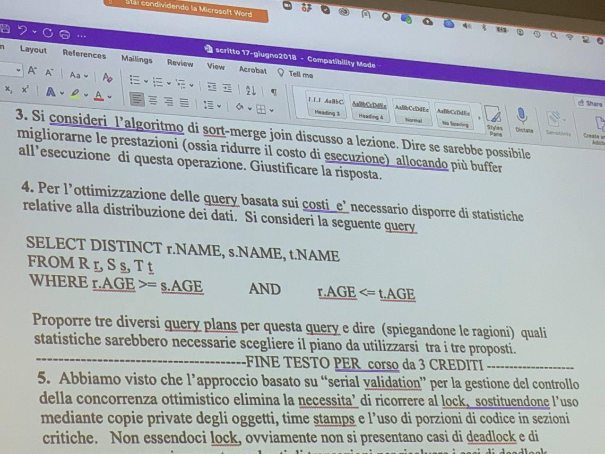

# Traccia di esame di MAADB (Sapino)

*Appunti di Federico Torrielli*

***DISCLAIMER**: potrei aver scritto delle menate stratosferiche*

## Domanda 1

Organizzazione dei file di record a lunghezza fissa e record a lunghezza variabile. Discutete quali potrebbero essere i vantaggi 
derivati dall'uso di record a lunghezza variabile in un file di indice.

## Risposta 1

Non bisogna rispondere come è fatto un record a lunghezza variabile/fissa, ma i vantaggi che posso ottenere da uno o l'altro modo.
Inoltre bisogna parlare in modo specifico del file DI INDICE e non un file generale.

è molto importante per l'indice massimizzare il fenout (il grado di massimizzazione): una pagina deve contenere il maggior numero
possibile di coppie chiave/valore. Sia quando faccio compressione delle chiavi sia in generale.
Se ho grossa variabilità, utilizzare record a lunghezza fissa dovrò per forza utilizzare la grandezza più grande possibile (sprecando spazio).
Questo comporterebbe un basso fenout, e minori prestazioni. Nel record di indice esistono più tipi di indice, per esempio coppie (chiave,lista di puntatori)
ho necessariamente bisogno di record a lunghezza variabile.

## Domanda 2

Abbiamo visto che nella gestione del buffer l'algoritmo del clock viene usato in alternativa all'LRU per ragioni di efficienza.
Abbiamo anche visto che uno dei problemi che possono derivare dall'uso della politica LRU è il fenomeno del sequential flooding che può emergere
in presenza di determinati pattern di accesso. Discutere se l'algoritmo del clock potrebbe anche risolvere questo problema.

## Risposta 2

Clock, emulando LRU, che "crea" il problema, non lo risolve sicuramente. MRU in questo caso sarebbe la cosa migliore da adottare.

## Domanda 3

Algoritmo sort-merge join: è possibile migliorarne le prestazioni allocando più frame di buffer?

## Risposta 3

Non è tanto la quantità dei frame di buffer a disposizione quanto invece la predisposizione delle tabelle per un buon merge-join.
Se il risultato del mio join ha una cardinalità alta, poter fare una sola lettura delle pagine con un buon numero di frame di buffer non è comunque male.
Il fatto che elementi presenti in più pagine della relazione debbano essere messi in join con altrettanti elementi, avere più buffer è positivo.

## Domanda 4

## Risposta 4

* `R >< S >< T`

* `S >< R >< T`

* `R >< T >< S`

Il costo dell'operazione è in funzione della cardinalità degli operandi: dobbiamo anticipare l'operazione che riduce questa cardinalità.
Ci conviene perciò anticipare quello che è soddisfatto da poche, dovendo poi confrontare meno elementi nelle operazioni successive.
Dobbiamo conoscere la distribuzione dei valori (min/max e come sono distribuiti). Dobbiamo anche conoscere se ho un'indice sull'attributo
età, per considerare certe implementazioni utilizzate.

## Domanda 5

Abbiamo visto che l'approccio basato su "serial validation" per la gestione del controllo della  concorrenza ottimistico elimina la necessità di ricorrere al lock, sostituendone l'uso mediante copie private degli oggetti, time stamps e l'uso di porzioni di codice in sezioni critiche. Non essendo lock, ovviamente non si presentano casi di deadlock e di conseguenza non si presentano aborti di transazioni per risolvere i casi di deadlock. Date queste considerazioni, possiamo concludere che il controllo della concorrenza ottimistico basato  su "serial validation" è completamente privo di situazioni di aborto di transazioni? Motivare la  risposta.

## Risposta 5

Semplicemente serial validation o no, l'utente può sempre causare un aborto volontario, o magari anche in cascata. Ok non può capitare il deadlock,
ma non è l'unica ragione per causare un aborto di una transazione! Un utente è la causa primaria degli aborti su transazioni, molto spesso.
