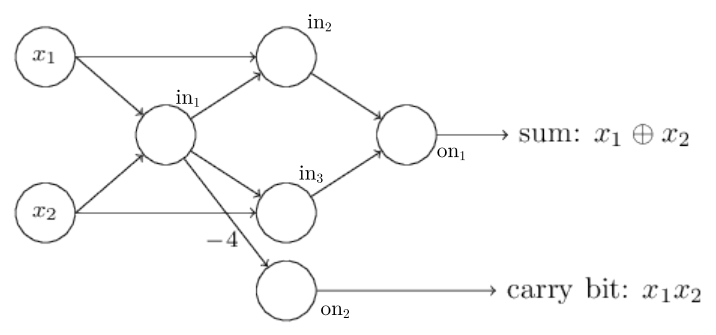

# Neural networks and Deep learning - Parte II - Esercizi

## Introduction to neural networks

### Esempio 1 - Perceptron

- **Perceptron**:
    - Data: $[1, 1, 1]$, $[1, 1, 0]$, $[1, 0, 1]$, $[1, 0, 0]$ (each $x_0$ is the bias).
    - Given the following weights, the OR function is computed: $w_0 = 0$, $w_1 = 0.5$, $w_2 = 0.5$.
        - Expected output: $-1$ with $(0, 0)$, $1$ for $(0, 1)$, $(1, 0)$, $(1, 1)$.
         - $x_0 \cdot w_0 + x_1 \cdot w_1 + x_2 \cdot w_2$:
            - $[1, 1, 1]$: $1 \cdot 0 + 1 \cdot 0.5 + 1 \cdot 0.5 = 1 > 0 \to y = 1$.
            - $[1, 1, 0]$: $1 \cdot 0 + 1 \cdot 0.5 + 0 \cdot 0.5 = 0.5 > 0 \to y = 1$.
            - $[1, 0, 1]$: $1 \cdot 0 + 0 \cdot 0.5 + 1 \cdot 0.5 = 0.5 > 0 \to y = 1$.
            - $[1, 0, 0]$: $1 \cdot 0 + 0 \cdot 0.5 + 0 \cdot 0.5 = 0 \leq 0 \to y = -1$.
    - Given the following weights, the AND function is computed: $w_0 = -1$, $w_1 = 1$, $w_2 = 1$.
        - Expected output: $1$ with $(1, 1)$, $-1$ for $(0, 0)$, $(0, 1)$, $(1, 0)$.
        - $x_0 \cdot w_0 + x_1 \cdot w_1 + x_2 \cdot w_2$:
            - $[1, 1, 1]$: $1 \cdot (-1) + 1 \cdot 1 + 1 \cdot 1 = 1 > 0 \to y = 1$.
            - $[1, 1, 0]$: $1 \cdot (-1) + 1 \cdot 1 + 0 \cdot 1 = 0 \leq 0 \to y = -1$.
            - $[1, 0, 1]$: $1 \cdot (-1) + 0 \cdot 1 + 1 \cdot 1 = 0 \leq 0 \to y = -1$.
            - $[1, 0, 0]$: $1 \cdot (-1) + 0 \cdot 1 + 0 \cdot 1 = -1 \leq 0 \to y = -1$.
        - Another set of weights which compute the AND function is: $w_0 = -0.8$, $w_1 = 0.5$, $w_2 = 0.5$.
    - Just by modifying the weights, the computed function is completely different.

### Esempio 2 - Perceptron Learning Algorithm

- Perceptron Learning Algorithm:
    - Input data: $([1, 1, 1], 1)$, $([1, 1, 0], -1)$, $([1, 0, 1], -1)$, $([1, 0, 0], -1)$.
    - Execution:
        - $w(0) = [0, 0, 0]$ (given this time, but usually randomized).
        - $\eta = 0.5$.
        - Examples can be evaluated in any orders.
        - $n=0$, with $([1, 1, 1], 1)$, netinput $0$, net output $-1$, but desired output $1$ (misclassification).
            - $w(n+1) = w(n) + \eta d(n) x(n)$.
            - $w(1) = [0, 0, 0] + 0.5 \times [1, 1, 1] = [0.5, 0.5, 0.5]$.
            - Consider each pattern and consider if it is correctly predicted.
                - $([1, 1, 1], 1)$ is okay, $([1, 1, 0], -1)$ is not.
        - $n=1$, with $([1, 1, 0], -1)$, netinput $1$, net output $1$, but desired output $-1$ (misclassification).
            - $w(2) = [0.5, 0.5, 0.5] - 0.5 \times [1, 1, 0] = [0, 0, 0.5]$.
            - Consider each pattern and consider if it is correctly predicted.
                - $([1, 1, 1], 1)$ and $([1, 1, 0], -1)$ are okay, $([1, 0, 1], -1)$ is not.
        - $w(2) = [0.5, 0.5, 0.5] - 0.5 [1, 0, 0] = [0, 0.5, 0.5]$.
        - $w(3) = [0, 0.5, 0.5] - 0.5 [1, 1, 0] = [-0.5, 0, 0.5]$.
        - $w(4) = [-0.5, 0, 0.5] + 0.5 [1, 1, 1] = [0, 0.5, 1]$.
        - $w(5) = [0, 0.5, 1] - 0.5 [1, 0, 1] = [-0.5, 0.5, 0.5]$ (solution).
        - The AND problem is **linearly separable**.
            - The convergence theorem provides that a solution will be found.
            - In this example and given the patterns evaluation order, in $n=5$ iterations.

### Esercizio 1 - Sigmoid neurons

- **Sigmoid neurons simulating perceptrons**:
    - Suppose to multiply all the weights and biases in a network of perceptrons by a positive constant $c > 0$.
        - Show that the behavior of the network doesn't change.
    - Suppose that the overall input to the same network has been chosen (fixed input).
        - Suppose that $\textbf{w} \cdot \textbf{x} + b \neq 0$ to any particular perceptron in the network.
        - Then replace all the perceptrons in the network by **sigmoid neurons**.
            - And multiply the weights and biases by a positive constant $c > 0$.
        - Show that in the limit as $c \to \infty$, this new network behaves the same as the original one.
            - How can this fail when $\textbf{w} \cdot \textbf{x} + b = 0$ for one of the perceptrons?

#### Svolgimento

- Perceptron network:
    - After the multiplication the equation is $\textbf{w}c \cdot \textbf{x} + bc$.
    - The *binary adder with carry* perceptron network is taken as reference.
    - The chosen positive constant is $c = 4$.
        - With $x_1 = 0$ and $x_2 = 1$:
            - $in_1$: with $\textbf{x} = [x_1, x_2] = [0, 1]$, $0 \cdot (-2 \cdot 4) + 1 \cdot (-2 \cdot 4) + (3 \cdot 4) = 4 > 0 \to y_{in_1} = 1$.
            - $in_2$: with $\textbf{x} = [x_1, y_{in_1}] = [0, 1]$, $0 \cdot (-2 \cdot 4) + 1 \cdot (-2 \cdot 4) + (3 \cdot 4) = 4 > 0 \to y_{in_2} = 1$.
            - $in_3$: with $\textbf{x} = [x_2, y_{in_1}] = [1, 1]$, $1 \cdot (-2 \cdot 4) + 1 \cdot (-2 \cdot 4) + (3 \cdot 4) = -4 \leq 0 \to y_{in_3} = 0$.
            - $on_1$: with $\textbf{x} = [y_{in_2}, y_{in_3}] = [1, 0]$, $1 \cdot (-2 \cdot 4) + 0 \cdot (-2 \cdot 4) + (3 \cdot 4) = 4 > 0 \to y_{on_1} = 1$.
            - $on_2$: with $\textbf{x} = [y_{in_1}] = [1]$, $1 \cdot (-4 \cdot 4) + (3 \cdot 4) = -4 \leq 0 \to y_{on_2} = 0$.
            - *Output*: $\textbf{y} = [1, 0]$, where $0 \oplus 1 = 1$ with carry $= 0$ (correct).
        - With $x_1 = 1$ and $x_2 = 1$:
            - $in_1$: with $\textbf{x} = [x_1, x_2] = [1, 1]$, $y_{in_1} = 0$.
            - $in_2$: with $\textbf{x} = [x_1, y_{in_1}] = [1, 0]$, $y_{in_2} = 1$.
            - $in_3$: with $\textbf{x} = [x_2, y_{in_1}] = [1, 0]$, $y_{in_3} = 1$.
            - $on_1$: with $\textbf{x} = [y_{in_2}, y_{in_3}] = [1, 1]$, $y_{on_1} = 0$.
            - $on_2$: with $\textbf{x} = [y_{in_1}] = [0]$, $y_{on_2} = 1$
            - *Output*: $\textbf{y} = [0, 1]$, where $1 \oplus 1 = 0$ with carry $= 1$ (correct).
        - With $x_1 = 1$ and $x_2 = 0$:
            - $in_1$: with $\textbf{x} = [x_1, x_2] = [1, 0]$, $y_{in_1} = 1$.
            - $in_2$: with $\textbf{x} = [x_1, y_{in_1}] = [1, 1]$, $y_{in_2} = 0$.
            - $in_3$: with $\textbf{x} = [x_2, y_{in_1}] = [0, 1]$, $y_{in_3} = 1$.
            - $on_1$: with $\textbf{x} = [y_{in_2}, y_{in_3}] = [0, 1]$, $y_{on_1} = 1$.
            - $on_2$: with $\textbf{x} = [y_{in_1}] = [1]$, $y_{on_2} = 0$
            - *Output*: $\textbf{y} = [1, 0]$, where $0 \oplus 1 = 1$ with carry $= 0$ (correct).
        - With $x_1 = 0$ and $x_2 = 0$:
            - $in_1$: with $\textbf{x} = [x_1, x_2] = [0, 0]$, $y_{in_1} = 1$.
            - $in_2$: with $\textbf{x} = [x_1, y_{in_1}] = [0, 1]$, $y_{in_2} = 1$.
            - $in_3$: with $\textbf{x} = [x_2, y_{in_1}] = [0, 1]$, $y_{in_3} = 1$.
            - $on_1$: with $\textbf{x} = [y_{in_2}, y_{in_3}] = [1, 1]$, $y_{on_1} = 0$.
            - $on_2$: with $\textbf{x} = [y_{in_1}] = [1]$, $y_{on_2} = 0$
            - *Output*: $\textbf{y} = [1, 0]$, where $0 \oplus 0 = 0$ with carry $= 0$ (correct).
        - All four cases match the original network and the corresponding *binary adder with carry* function.
    - When **multiplied by a positive constant**, the perceptron NN behaves the same as the original one.
- Sigmoid network:
    - The *binary adder with carry* perceptron network is taken as reference.
    - The chosen positive constant is $c = 1$ (same as perceptron NN, but with sigmoid neurons):
        - With $x_1 = 0$ and $x_2 = 1$:
            - $in_1$: with $\textbf{x} = [x_1, x_2] = [0, 1]$, $0 \cdot -2 + 1 \cdot -2 + 3 = 1 \to y_{in_1} = \sigma(1) = 0.731$.
            - $in_2$: with $\textbf{x} = [x_1, y_{in_1}] = [0, 0.731]$, $0 \cdot -2 + 0.731 \cdot -2 + 3 = 1.538 \to y_{in_2} = \sigma(1.538) = 0.823$.
            - $in_3$: with $\textbf{x} = [x_2, y_{in_1}] = [1, 0.731]$, $1 \cdot -2 + 0.731 \cdot -2 + 3 = -0.462 \to y_{in_3} = \sigma(-0.462) = 0.386$.
            - $on_1$: with $\textbf{x} = [y_{in_2}, y_{in_3}] = [0.823, 0.386]$, $0.823 \cdot -2 + 0.386 \cdot -2 + 3 = 0.582 \to y_{on_1} = \sigma(0.582) = 0.641$.
            - $on_2$: with $\textbf{x} = [y_{in_1}] = [0.731]$, $0.731 \cdot -4 + 3 = 0.076 \to y_{on_2} = \sigma(0.076) = 0.518$.
            - *Output*: $\textbf{y} = [0.641, 0.518]$, very distant from the actual solution $[1, 0]$.
    - The chosen positive constant is $c = 4$.
        - With $x_1 = 0$ and $x_2 = 1$:
            - $in_1$: with $\textbf{x} = [x_1, x_2] = [0, 1]$, $0 \cdot (-2 \cdot 4) + 1 \cdot (-2 \cdot 4) + (3 \cdot 4) = 4 \to y_{in_1} = \sigma(4) = 0.982$.
            - $in_2$: with $\textbf{x} = [x_1, y_{in_1}] = [0, 0.982]$, $0 \cdot (-2 \cdot 4) + 0.982 \cdot (-2 \cdot 4) + (3 \cdot 4) = 4.143 \to y_{in_2} = \sigma(4.134) = 0.984$.
            - $in_3$: with $\textbf{x} = [x_2, y_{in_1}] = [1, 0.982]$, $1 \cdot (-2 \cdot 4) + 0.982 \cdot (-2 \cdot 4) + (3 \cdot 4) = -3.872 \to y_{in_3} = \sigma(-3.872) = 0.020$.
            - $on_1$: with $\textbf{x} = [y_{in_2}, y_{in_3}] = [0.984, 0.020]$, $0.984 \cdot (-2 \cdot 4) + 0.020 \cdot (-2 \cdot 4) + (3 \cdot 4) = 3.968 \to y_{on_1} = \sigma(3.968) = 0.981$.
            - $on_2$: with $\textbf{x} = [y_{in_1}] = [0.982]$, $0.982 \cdot (-4 \cdot 4) + (3 \cdot 4) = -3.712 \to y_{on_2} = \sigma(-3.712) = 0.024$.
            - *Output*: $\textbf{y} = [0.981, 0.024]$, closer but still not exact from the actual solution $[1, 0]$.
    - The larger chosen positive constant is $c = 123456$.
        - With $x_1 = 0$ and $x_2 = 1$:
            - $in_1$: with $\textbf{x} = [x_1, x_2] = [0, 1]$, $y_{in_1} = \sigma(123456) = 1.\bar{0}$.
            - $in_2$: with $\textbf{x} = [x_1, y_{in_1}] = [0, 1]$, $y_{in_2} = \sigma(123456) = 1.\bar{0}$.
            - $in_3$: with $\textbf{x} = [x_2, y_{in_1}] = [1,1]$, $y_{in_3} = \sigma(-123456) \approx 0$.
            - $on_1$: with $\textbf{x} = [y_{in_2}, y_{in_3}] = [1, 0]$, $y_{on_1} = \sigma(123456) = 1.\bar{0}$.
            - $on_2$: with $\textbf{x} = [y_{in_1}] = [1]$, $y_{on_2} = \sigma(-123456) \approx 0$.
            - *Output*: $\textbf{y} = [1, 0]$, where $0 \oplus 1 = 1$ with carry $= 0$ (correct).
    - Even though this is a partial solution, it's clear that with $c \to \infty$ the **original function is approximated**.

### Esempio 3 - Weights representation

- **Weights representation**:
    - The third (and output) $L$ of a NN has two neurons.
    - Its weights vector is then (with a previous layer with three neurons): $\textbf{W}^3 = \begin{pmatrix} w_{11}^3 & w_{12}^3 & w_{13}^3 \\ w_{21}^3 & w_{22}^3 & w_{23}^3 \end{pmatrix}$.
    - $\textbf{W}^3 \textbf{z}^{l-1} = \begin{pmatrix} w_{11}^3 & w_{12}^3 & w_{13}^3 \\ w_{21}^3 & w_{22}^3 & w_{23}^3 \end{pmatrix} \cdot \begin{bmatrix} z_1^2 \\  z_2^2 \\ z_2^3 \end{bmatrix} = \begin{bmatrix} w_{1 \cdot}^3 \cdot \textbf{z}^2 \\ w_{2 \cdot}^3 \cdot \textbf{z}^2 \end{bmatrix}$.

### Esempio 4 - First equation of BP

- Computing $\text{BP1}$ using the **quadratic cost**:
    - $C = \frac{1}{2} \sum_j (y_j - z_j^L) \implies \frac{\partial C}{\partial z_j^L} = (z_j^L - y_i)$.
        - $C$ is actually $C_{\textbf{x}}$.
        - $\frac{1}{2} \| y(x) - z^L(x) \|_2^2 = [y(x) - z^L(x)]^T [y(x) - z^L(x)] = \sum_j (y_j(x) - z_j^L(x))(y_j(x) - z_j^L(x))$.
            - The goal is to compute the derivative of $C$ w.r.t. $z_j^L$ (consider everything else as a constant).
            - In $\frac{1}{2} ((y_1 - z_1^L)^2 + \dots + (y_j - z_j^L)^2 + \dots)$ the only term dependent on $z_j^L$ is $(y_j - z_j^L)^2$.
        - $\frac{\partial C}{\partial z_j^L} (y_j - z_j^L)^2 = 2 (y_j - z_j^L) \cdot -1 = 2 (z_j^L - y_j)$.
            - $-1$ is the derivative of $y_j - z_j^L$ w.r.t. $z_j^L$.
            - The $\frac{1}{2}$ in $C$ cancels out with the $2$ in $2 (z_j^L - y_j)$.
        - $\frac{\partial C}{\partial z_j^L} = (z_j^L - y_i)$.
            - To compute $z_j^L$, the information is conveyed through the NN up to layer $L$.
            - While $y_j$ is a given constant (a value, $0$ or $1$).
            - Therefore $\frac{\partial C}{\partial z_j^L} = (z_j^L - y_i)$ is a simple value.
    - As it is $\delta_j^L = \frac{\partial C}{\partial z_j^L} \sigma'(a_j^L)$, therefore $\text{BP1}$ is easily computable. 
