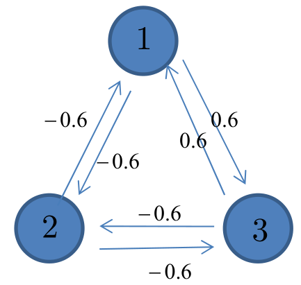

# Neural networks and Deep learning - Parte III - Esercizi

## Hopfield networks

### Esercizio 1 - Hopfield networks
 

#### Svolgimento

##### Information withdrawal phase

- Compute the stable state of the above network with the initial state $[-1, -1, 1]$:
    - Initial state:
        - $y_1(0) = -1$, $y_2(0) = -1$, $y_3(0) = 1$.
    - The neuron are picked randomly: 
        - $v_1(1) = - 0.6 \cdot -1 + 0.6 \cdot 1 = 1.2 \to \varphi(v_1(1)) = 1 \to [1, -1, 1]$.
        - $v_2(2) = - 0.6 \cdot 1 + -0.6 \cdot 1 = -1.2 \to \varphi(v_2(2)) = -1 \to [1, -1, 1]$.
        - $v_3(3) = 0.6 \cdot 1 + -0.6 \cdot -1 = 0 \to \varphi(v_3(3)) = -1 \to [1, -1, 1]$.
        - $v_1(4) = -0.6 \cdot -1 + 0.6 \cdot 1 = 1.2 \to \varphi(v_1(4)) = 1 \to [1, -1, 1]$.
    - Stable state: $[1, -1, 1]$ (output of the network).
        - With a different evaluation order, the stable state can be different.
        - The other stable state is $[-1, 1, -1]$ (opposite of the one found, property of HN).

##### Storage phase

- Compute the weights with the initial memory $f_1 = [1, -1, 1]$:
    - $w_{12} = 1 \cdot (-1) = -1 = w_{21}$.
    - $w_{23} = (-1) \cdot 1 = -1 = w_{32}$.
    - $w_{31} = 1 \cdot 1 = 1 = w_{13}$.
- Compute the weights with the initial memories $f_1 = [1, -1, 1]$ and $f_2 = [1, 1, 1]$:
    - $w_{12} = \frac{1 \cdot -1 + 1 \cdot 1}{2} = 0 = w_{21}$. 
    - $w_{23} = \frac{-1 \cdot 1 + 1 \cdot 1}{2} = 0 = w_{32}$.
    - $w_{31} = \frac{1 \cdot 1 + 1 \cdot 1}{2} = 1 = w_{13}$.
- Apply the memorization rule so that $[1, -1, 1]$ and $[-1, 1, -1]$ are stable states.
    - $w_{12} = \frac{1 \cdot -1 + -1 \cdot 1}{2} = -1 = w_{13}$.
    - $w_{23} = \frac{1 \cdot -1 + -1 \cdot 1}{2} = -1 = w_{32}$.
    - $w_{31} = \frac{1 \cdot 1 + -1 \cdot -1}{2} = 1 = w_{13}$.

### Esercizio 2 - Restricted Boltzmann machines

- Calculate $p(h_i=1)$:
    - Visible layer composed by $v_1$ and $v_2$ of values: $1$ and $0$.
    - Hidden layer composed by a single node $h_1$ with $w_{11} = 0.01$ and $w_{21} = 0.02$.
        - $\Delta E_i = 1 \cdot 0.01 + 0 \cdot 0.02 = 0.01$.

#### Svolgimento

- Two ways of computing $\Delta E_i$:
    - Computing $E(h_1 = 1)$ and $E(h_1 = 0)$ and then $\Delta E_i = E(s_i = 0) - E(s_i = 1)$.
    - Or Computing $\Delta E_i = \sum w_{ij} S_j = 1 \cdot 0.01 + 0 \cdot 0.02 = 0.01$.
    - Then $p(h_1=1)$ can be computed: $p(h_1=1) = 0.50251$.
- Sampling is used to attribute a state ($0$ and $1$) using the probability.

### Esercizio 3 - Restricted Boltzmann machines

- Apply contrastive divergence by learning $[1, 0]$:
    - Given:
        - Visible layer composed by $v_1$ and $v_2$.
        - Hidden layer composed by a single node $h_1$ with $w_{11} = 1$ and $w_{21} = 1$.
        - $\varepsilon = 0.1$ (learning rate).
    - Assume that sampling will output $1$ in case $p(s=1) \geq 0.5$, $0$ otherwise.
        - In general, sampling will return $1$ with probability $p$, hence not always, unless $p(s=1) = 1$.

#### Svolgimento

- Execution of contrastive divergence:
    - Epoch $\#1$:
        - $t = 0$:
            - $v_1$ and $v_2$ are the ones in input.
            - $h_1$: $\Delta E_{h_1} = \sum_j w_{h_1 v_j} \: v_j = 1 * 1 + 1 * 0 = 1 \to p(h_1 = 1) = \frac{1}{1+e^{-\Delta E_{h_1} / T}} = 0.73$.
                - By sampling, with probability $0.73 \geq 0.5$, $h_1 = 1$.
            - $\langle v_1 h_1 \rangle^0 = 1 \cdot 1 = 1$ and $\langle v_2 h_1 \rangle^0 = 0 \cdot 1 = 0$.
        - $t = 1$:
            - To reconstruct $v_1$ and $v_2$, $h_1$ is the one computed at $t=0$.
            - $v_1$: $\Delta E_{v_1} = \sum_j w_{v_1 h_j} \: h_j = 1 * 1 = 1 \to p(v_1 = 1) = \frac{1}{1+e^{-\Delta E_{v_1} / T}} = 0.73$.
                - By sampling, with probability $0.73 \geq 0.5$, $v_1 = 1$.
            - $v_2$: $\Delta E_{v_2} = \sum_j w_{v_2 h_j} \: h_j = 1 * 1 = 1 \to p(v_2 = 1) = \frac{1}{1+e^{-\Delta E_{v_2} / T}} = 0.73$.
                - By sampling, with probability $0.73 \geq 0.5$, $v_2 = 1$.
            - $h_1$: $\Delta E_{h_1} = \sum_j w_{h_1 v_j} \: v_j = 1 * 1 + 1 * 1 = 2 \to p(h_1 = 1) = \frac{1}{1+e^{-\Delta E_{h_1} / T}} = 0.88$.
                - By sampling, with probability $0.88 \geq 0.5$, $h_1 = 1$.
            - $\langle v_1 h_1 \rangle^1 = 1 \cdot 1 = 1$ and $\langle v_2 h_1 \rangle^1 = 1 \cdot 1 = 1$.
        - Weights update:
            - $\Delta w_{h_1 v_1} = \varepsilon(\langle v_1 h_1 \rangle^0 - \langle v_1 h_1 \rangle^1) = 0.1 ((1 \cdot 1) - (1 \cdot 1)) = 0$.
                - $w_{h_1 v_1}(2) = w_{h_1 v_1}(1) + \Delta w_{h_1 v_1} = 1 + 0 = 1$ (unchanged).
            - $\Delta w_{h_1 v_2} = \varepsilon(\langle v_2 h_1 \rangle^0 - \langle v_2 h_1 \rangle^1) = 0.1 ((0 \cdot 1) - (1 \cdot 1)) = - 0.1$.
                - $w_{h_1 v_2}(2) = w_{h_1 v_2}(1) + \Delta w_{h_1 v_2} = 1 + (-0.1) = 0.9$.
