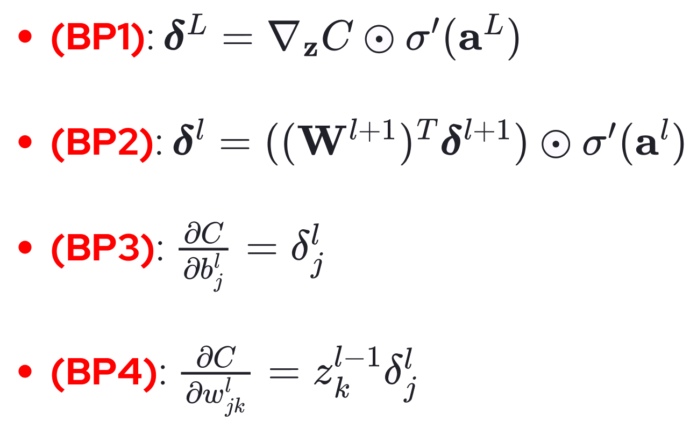

# Neural networks and Deep learning - Parte II

## Introduction to Neural networks

### Perceptrons

- **Perceptrons**:
    - Introduced by Frank Rosenblatt in 1958.
        - Presented as a pattern recognition device (although is used for more general problems).
        - It mimics a part of what is known of the mammalian visual system.
    - Simple form of neural network used to classify **linearly separable** examples.
    - Basic structure of a perceptron:
        - *Input*: a vector $\textbf{x}$ (`eg` pixel values, phonemes, outputs from previous neurons, etc).
        - *Output*: a vector $\textbf{y}$ (single value if only a neuron).
        - *Weight vector*: $\textbf{w}$.
        - Training set: set of tuples $(\text{input}, \text{desired output})$.
            - A **pattern** is an element of the training set.
    - **Biological neural networks**:
        - In the brain the basic computational unit is the **neuron**.
            - A neuron collect, elaborate and propagate electric signals.
            - The output electric signal is proportional to the received input.
            - Neurons collect and transmit informations **in parallel** (as in ANN).
            - There are 10 billion neurons and 60 millions of millions of millions of **synapses**.
        - In the same way, the basic computational unit of NN is the neuron.
            - Several neurons are connected to each other by synapses.
            - Very simple operations: deciding if the **total input is higher than a threshold**.

#### McCulloch & Pitts' model of a neuron

- McCulloch & Pitts' model of a neuron [1943]:
    - `def` **Network input** (*netinput*) to $j$: $\textbf{x} \cdot \textbf{w} = \textbf{x}^T \textbf{w} = \sum_{i=1}^p x_i w_i$.
        - For each input value $x_i$ what reaches the neuron $j$ is $w_{ji} x_i$.
            - $w_{ji}$ is the weight of the synapse from $i$ to $j$.
                - A synapse can be **excitatory** or **inhibitory**, therefore the weight can be $<, >, = 0$.
    - The output of the neuron will depend on the netinput and the bias.
        - The **bias** represents the natural predisposition of the neuron to activate.
            - If the bias $< 0$, for the neuron to be activated, incoming input values must be high.
            - If the bias $> 0$, the neuron is often activated, also with low inputs.
            - To simplify the computation, the bias is represented as an extra input element $x_0 = 1$ with $w_0 = b$.
                - In this case, $v+j = \sum_{j=0}^p w_{ji} x_i$.
        - `def` **Perceptron output**: $y_j = \varphi(uj + b)$.
            - $\varphi$ is the **activation function** (`eg` sigmoid).
                - **Perceptron activation function**: 
                    - $1$ for all input vectors $\textbf{x}$ s.t. $\textbf{x} \cdot \textbf{w} > 0$.
                    - $-1$ for all input vectors $\textbf{x}$ s.t. $\textbf{x} \cdot \textbf{w} \leq 0$.
            - $uj+b$ is the **activation potential** or local field of $j$.

#### Perceptron Learning

- **Perceptron Learning**:
    - The **decision boundary** is made by all $\textbf{x}$ s.t. $\textbf{x} \cdot \textbf{w} = 0$.
        - In $3$-D with $w_0 = 0$, $w_1 x_1 + w_2 x_2 = 0$ is the equation of the DB line.
    - The perceptron **learn** to classify examples linearly separable by **adjusting the weights**.

##### Algorithm: Perceptron Learning

- **Perceptron Learning Algorithm**:
    - Adjust the weights to obtain the desired classification.
        - The activation function cannot be modified, only the weights.
        - Learning based on **correction of the error** (for each misclassified pattern).
    - **Weights update**:
        - Updates are performed **pattern by pattern** (and not by **epoch**, as in other neural networks).
            - An **epoch** is a iteration over all elements of the training set.
            - Instead, here weights are updated for each pattern misclassified.
        - Correct output: $w(n + 1) = w(n)$.
        - Incorrect output:
            - $w(n+1) = w(n) - \eta(n) \times (s)$ if $x(n) \cdot w(n) > 0$ and $x(n) \in C_2$ (output too high).
            - $w(n+1) = w(n) + \eta(n) \times (s)$ if $x(n) \cdot w(n) \leq 0$ and $x(n) \in C_1$ (output too low).
            - $\eta$ is the **learning rate** (with high $\eta$ updates will be abrupt).
    - `th` **Convergence theorem**: if the problem is **linearly separable** the learning algorithm will find a solution.
        - At each iteration, the weight vector is modified and, as a consequence, the decision boundary.
            - This theorem guarantees that **weight adjustment terminates**.
        - The proof is based on a geometric interpretation about how the weights vector is updated.
            - $A$: $\| w(k+1) \|^2 \geq \frac{k^2 \alpha^2}{ \|w^*\|^2}$ (lower bound).
            - $B$: $\| w(k+1) \|^2 \leq k \beta$ (upper bound).
            - $A$ and $B$ are compatible only if $\frac{k^2 \alpha^2}{ \|w^*\|^2} \leq k \beta \to k \leq \frac{\beta \| w^* \|^2}{\alpha^2}$.
                - $k$ can't be larger than this **finite** quantity, the algorithm **terminates** (QED).
        - It converges for **linearly separable problems**.
            - But simple (`eg` XOR) and non-linearly solvable problems cannot be solved [Minsky & Papert, 1969].
            - To **test if a dataset is linearly separable**:
                - The model should be trained on the whole dataset (train and test set).
                - Its training accuracy should be $100\%$ (if not, then the dataset is not linearly separable).

#### Multilayer networks

- **Multilayer networks**:
    - To solve more complex problems **hidden units** are introduced.
        - Each unit solves part of the problem, then solutions are combined.
        - But a different learning algorithm (**backpropagation**) is introduced.
    - With enough hidden units, the network can **discriminate a convex zone**.

### Multilayer neural networks

- **Multilayer neural networks**:
    - In ML, a task is approached by trying to create a system that can learn from examples.
    - By combining several perceptrons into a **complex networks**, a very large quantity of function can be modelled.
        - A perceptron can easily represent a NAND gate (`eg` with $x_1, x_2 \in \{0, 1\}$, $(-2, -2) \cdot x + 3$).
            - Any other logic operator can be built in terms of NAND operators only.
            - Any NAND-only complex circuit (`eg` binary adder with carry) can be translated into a perceptron NN.
    - Networks as computational device:
        - Perceptron networks can perform all sorts of computation.
        - Algorithms that **learns those computations** can be made.

#### Universal Approximation Theorem

> `th` **Universal Approximation Theorem**: a **feedforward network** with a **linear output layer** and **at least one hidden layer** with **any *squashing* activation function** (`eg` logistic sigmoid) can **approximate any Borel measurable function** from one finite-dimensional space to another with **any desired non-zero amount of error**, provided that the network is given **enough hidden units**. The derivatives of the feedforward network can also approximate the derivatives of the function arbitrarily well.

- **Universal Approximation Theorem**:
    - A **linear output layer** computes simply $\textbf{w} \cdot \textbf{x} + b$ (no $> 0$).
    - Any continuous function on a closed and bounded subset of $\mathbb{R}^n$ is *Borel measurable*.
        - And therefore may be approximated by a neural network.
    - With a big enough NN, any arbitrarily-complex practical problem can be approximated.
        - Empirical observations proved that with enough data, any problem of overfitting can be overcome.
    - Unfortunately, in the worst case, an **exponential number of hidden units** may be required.
        - Possibly with one hidden unit for each input configuration that needs to be distinguished.
        - This is easiest to see in the binary case: 
            - The number of possible binary functions on vectors $\textbf{v} \in \{0, 1\}$ is $2^{2^n}$.
            - Selecting one such function requires $2^n$ bits, which will in general require $O(2^n)$ degrees of freedom.

#### Sigmoid neurons

- **Sigmoid neurons**:
    - It is hard to learn anything useful using the perceptrons.
    - *Desiderata*: *small* changes in any weight (or bias) causes a *small* changes in the output.
        - $\textbf{w} + \Delta \textbf{w} \to output + \Delta output$.
    - `def` **Sigmoid neuron**: a neuron where the output is computed as $\sigma(\textbf{w} \cdot \textbf{x} + b)$, where $\sigma(z) = \frac{1}{1+e^{-z}}$.
        - The output approximate the Step function when $\textbf{w} \cdot \textbf{x} + b$ is very large or small.
            - But it does not change abruptly in proximity of $0$.
        - Since the output is in $[0, 1]$, each internal node input ranges in $[0, 1]$ as well.
    - The information relating to changes can be used to **updates the weights**.
        - A Step function doesn't provide any meaningful information about those changes.
        - When the activation function has a larger slope, it's easier to **guide the learning**.
    - It is important that the **activation function** is **smooth** in order to control how varies $\Delta output$.
        - Calculus implies that $\Delta output \approx \sum_j \frac{\partial output}{\partial w_j} \Delta w_j + \frac{\partial output}{\partial b} \Delta b$.
            - The $output$ must be **differentiable w.r.t. the weights and the biases**.
            - The Step function is not differentiable since it's not continuous (it also has derivatives $=0$, bad).
        - It is not the exact shape of $\sigma$ to be crucial, but rather its smoothness.
            - In other situations, the sigmoid activation function is not the best choice.
                - Everything in NN is **situational**, and to develop a proper model is *more an art than a science*.

#### Architecture of Neural networks

- **Architecture of Neural networks**:
    - A typical neural network is composed by: an **input layer**, $1\text{-}n$ **hidden layers**, an **output layer**.
        - This architecture is called **multilayer perceptrons** (despite not being built out of perceptrons).
        - The input layer is not a proper *layer*, it only represents the inputs.
            - While all other nodes in other layers are sigmoid neurons.
        - In the output vector, an output neuron can be used to represent each of the possible labels.
            - The final output will be the output unit with the **largest activation**.
        - In a **feedforward network**, a node is connected only to *successive* nodes in the following layer.
            - In a **fully connected FN**, a node is connected to **every** nodes in the following layer.
    - The design of input and output layers is application-dependent.
        - `eg` An output neuron can be used to represent each one of the possible labels.
            - The final output is pick up as the output unit with the largest activation. 
        - `eg` Each element of the output vector can be modeled as an output neuron.
    - Hidden layers design is not as straight forward as the one for input or output layers.
        - NN researchers have developed over time many design heuristics for it.
            - `eg` Sharing weights between neurons allow to learn a single feature detector and apply it in many different locations.
            - `eg` Stacking layers may allow to learn complex features from simpler ones.
            - `eg` Using a large number of hidden units is powerful but it's prone to overfitting or require more data.

### Gradient descent

- **Gradient descent**:
    - A learning algorithm to find the weights for a NN.
        - A **cost function** to measure how well a network is doing is defined.
            - $C(\textbf{w}, \textbf{b})$ measures how well the network performs on $Tr$ data $(\textbf{X}, \textbf{y})$.
        - A way to **minimize this cost function** needs to be found.
            - To solve the optimization problem $\text{minimize}_{\textbf{w}, \textbf{b}} C(\textbf{w}, \textbf{b})$.
        - `def` **Cost function**: $C(\textbf{w}, \textbf{b}) = \frac{1}{2n} \sum_{\textbf{x}} \| y(\textbf{x} - \textbf{a}) \|^2$.
            - $\textbf{a}$ is the vector of outputs with $\textbf{x}$ has an input.
                - It depends on $\textbf{w}$, $\textbf{b}$ and $\textbf{a}$, more properly denoted as $\textbf{a}_{\textbf{w}, \textbf{b}}(\textbf{x})$.
        - Accuracy is a natural evaluation measure, but it is **not smooth**.

#### Gradient descent derivation

>`!` GD is an **iterative optimization algorithm** that at each step move the current position in the **opposite direction** w.r.t. the gradient, $\textbf{v}' \leftarrow \textbf{v} - \eta \nabla C$. The error function $C$ is descended following the **direction of the steepest descent**.

- **Gradient descent derivation**:
    - Consider a function $C(\textbf{v})$ defined as $C: \mathbb{R}^n \to \mathbb{R}$.
    - In general it might be very difficult to pinpoint the global minimum.
        - Using Calculus to find **closed form solution** is not feasible.
    - The variables are moved by a little $\Delta \textbf{v} = (\Delta v_1, \Delta v_2)^T$:
        - The vector $C$ changes as $\Delta C \approx \frac{\partial C}{\partial v_1} \Delta v_1 + \frac{\partial C}{\partial v_2} \Delta v_2 = \nabla C \cdot \Delta v$.
            - $-\nabla C$ is the direction where $C$ decrease the most. 
            - $-\nabla C \cdot \nabla C = - \| \nabla C \|_2^2$ (the norm is a positive number).
        - The Taylor expansion is **truncated at the first derivative to use a plane** to approximate the problem.
            - Then the variables are moved along this plane.
    - By choosing $\Delta \textbf{v} = - \eta \nabla C$, it is guaranteed to make the **cost function to decrease**.
        - The step $\eta$, called **learning rate**, should be not big nor too small (typically of the order $0.1\text{-}0.001$).
    - The GD is applied until the found derivatives are very small.
    - **Second order approximation**:
        - The Taylor expansion can be truncated not at the first but at the second derivative.
            - But with $n$ parameters, there are $n^2$ derivatives (not feasible with large $n$).
        - Methods to mitigate this have been developed, but GD still remains the most common implementation.
    - **Applying Gradient descent in a NN**:
        - Applying GD to weights and biases allows for training a NN. 
        - Start from a fixed point and iterate through the data updating at each step the weights as:
            - $w_k' \leftarrow w_k - \eta \frac{\partial C}{\partial w_k}$.
            - $b_l' \leftarrow b_l - \eta \frac{\partial C}{\partial b_l}$.

#### Stochastic gradient descent

- **Stochastic gradient descent** (SGD):
    - Consider the cost function $C = \frac{1}{n} \sum_{\textbf{x}} C_{\textbf{x}}$ (generic averaged CF).
        - The gradient of $C$ is then $\nabla C = \frac{1}{n} \sum_{\textbf{x}} \nabla C_{\textbf{x}}$ ($\nabla$ is a **linear operator**).
        - To compute the gradient $\nabla C$:
            - The gradients $\nabla C_{\textbf{x}}$ has to be computed separately for each training input $\textbf{x}$.
            - And then average them.
        - When the dataset is very big, this becomes too slow.
    - In **mini-batch** SDG, a **small subsample** of the dataset is used to approximate the gradient over the entire dataset.
        - Let $x_1, \dots, x_m$ be $m$ randomly chosen training inputs.
        - If $m$ is large enough, it should be apparent that $\sum_{j=1}^m \frac{\nabla C_{\textbf{x}_j}}{m} \approx \frac{\sum_\textbf{x} \nabla C_\textbf{x}}{n} = \nabla C$.
    - Procedure:
        - A mini-batch is extracted and the weights are updated using the following rules:
            - $w_k' \leftarrow w_k - \frac{\eta}{m} \frac{\partial Cx_j}{\partial w_k}$.
            - $b_l' \leftarrow b_l - \frac{\eta}{m} \frac{\partial Cx_j}{\partial b_l}$.
        - Then a **new mini-batch** is randomly chosen and the model is trained with those.
        - When all examples have been used an **epoch of training** is completed.
            - At that point a new training epoch is started over.
    - The estimate won't be perfect (there will be statistical fluctuations), but it isn't needed.
        - The point is to **move in a general direction** that will help decrease $C$.

### Backpropagation

- **Backpropagation**:
    - Gradient descent is a general procedure for optimizing differentiable functions.
        - Backpropagation is its instantiation in the context of NN.

#### Mathematical preamble to backpropagation

- **Mathematical preamble to backpropagation**
    - Notation:
        - $w_{jk}^l$: the weight from the $k$-th neuron in level $l-1$ to the $j$-th neuron in the level $l$.
        - $b_j^l$: the bias of the $j$-th neuron in the $l$-th layer.
        - $z_j^l$: the activation value of the $j$-th neuron in the $l$-th layer.
        - **Activation**: $z_j^l = \sigma(\sum_k w_{jk}^l z_k^{l-1} + b_j^l)$.
            - The sum is on all neurons $k$ in the $(l-1)$-th layer.
        - $\textbf{W}^l$: the matrix having element $w_{jk}^l$ at row $j$ and column $k$.
            - The $x$-th row of $\textbf{W}^l$ corresponds to the weights entering the $x$-th neuron in the $l$ layer.
        - $\textbf{b}^l$: the column vector having $b_j^l$ as its $j$-th element.
        - $\textbf{z}^l$: the column vector having $z_j^l$ as its $j$-th element.
        - $f(\textbf{v})$ is the element-wise application of $f$ to a matrix (output: a matrix). 
    - `def` **Activation**: $\textbf{z}^l = \sigma(\textbf{W}^l \textbf{z}^{l-1} + \textbf{b}^l)$.
        - Faster to compute thanks to matrix computation libraries.
        - The **weighting input** to a neuron as level $l$ is: $\textbf{a}^l \equiv \textbf{W}^l \textbf{z}^{l-1} + \textbf{b}^l$.
            - The component $j$ of a vector $\textbf{a}^l$ is $a_j^l = \sum_k w_{jk}^l z_k^{l-1} + b_j^l$.
    - Working assumptions about the **cost function**:
        - Can be written as an average $C = \frac{1}{n} \sum_{\textbf{x}} C_{\textbf{x}}$ over $C_{\textbf{x}}$ for individual $Tr$ examples.
        - It is a function of the outputs of the neural network (**self-contained**).
        - `eg` Those assumptions are satisfied by the quadratic cost function.
    - **Hadamard Product** ($\odot$): the element-wise product of two vector.

#### Backpropagation four fundamental equations

- **Backpropagation four fundamental equations**:
    - The **gradient of the cost function** w.r.t. weights and biases is $\nabla_{\textbf{w}, \textbf{b}} C = [ \frac{\partial C}{\partial w_{jk}^l}, \dots, \frac{\partial C}{\partial b_j^l}, \dots]$.
    - `def` **Neuron error**: $\delta_j^l = \frac{\partial C}{\partial a_j^l}$.
        - The error at level $l$ and neuron $j$.
        - BP provides a procedure to compute it for each neuron in each layer. 
            - And then will relate $\delta_j$ to the quantities of real interest.
        - Measures how much the CF varies when the inputs of the neurons at that level are slightly perturbed.
        - The term *error* derives from the idea of introducing a *small* error in the inputs of the layer.
            - And then observe how it propagates to the cost function.

##### First equation of BP

- `def` **First equation of BP** ($\text{BP1}$): $\delta_j^L = \frac{\partial C}{\partial z_j^L} \sigma'(a_j^L)$.
    - Specifies how to compute the *error* $\boldsymbol{\delta}^L$ at the output layer ($L$).
    - How much the cost function $C$ changes when there is a small change in the input of $\sigma$.
    - **Easily computable**:
        - $a_j^L$ is computed by letting the inputs to flow through the network up to neuron $j$ the level $L$.
        - The exact form of $\frac{\partial C}{\partial z_j^L}$ will depend on the form of the cost function.
            - `eg` For the quadratic cost: $C = \frac{1}{2} \sum_j (y_j - z_j^L)^2 \implies \frac{\partial C}{\partial z_j^L} = (z_j^L - y_j)$.
    - **First equation of BP** ($\text{BP1}$): $\boldsymbol{\delta}^L = \nabla_{z^L} C \odot \sigma'(\textbf{a}^L)$.
        - The gradient is by definition the collection of the partial derivatives.

##### Second equation of BP

- `def` **Second equation of BP** ($\text{BP2}$): $\boldsymbol{\delta}^l = ((\textbf{W}^{l+1})^T \boldsymbol{\delta}^{l+1}) \odot \sigma'(\textbf{a}^l)$.
    - Allows to compute the error for non-output layer.
    - Multiplication between:
        - $\sigma'(\textbf{a}^l)$: measures how fast the output at this level varies in response to a variation of its input.
        - $(\textbf{W}^{l+1})^T$: measures how that changes propagate through the NN via the connecting weights.
        - $\boldsymbol{\delta}^{l+1}$: how fast that level will change in response to changes in its input.
    - Ignore anything before $l$ and after $l+1$ (already accounted by $\boldsymbol{\delta}^{l+1}$).
    - **Easily computable**:
        - The only non-trivial term, $\boldsymbol{\delta}^{l+1}$ can be computed via $\text{BP1}$ applied to the last layer.
            - And then apply $\text{BP2}$ to the other layers up to the current layer.
        - Information is computed from the back (output) and then **propagated backwards**.

##### Third and fourth equations of BP

- **Third and fourth equations of BP**:
    - Those equations are the ones directly related to **applying gradient descent to a NN**.
        - How to compute the cost function given the biases and weights terms.
    - `def` **Third equation of BP** ($\text{BP3}$): $\frac{\partial C}{\partial b_j^l} = \delta_j^l$.
        - That is, the error $\delta_j^l$ is *exactly equal* to the rate of change $\frac{\partial C}{\partial b_j^l}$.
    - `def` **Fourth equation of BP** ($\text{BP4}$): $\frac{\partial C}{\partial w_{jk}^l} = z_k^{l-1} \delta_j^l = z_{in} \delta_{out}$.
        - How to compute the rate of change of the cost w.r.t. any of the weights in the network.
        - It is intended that the weight w.r.t. of which the derivative is taken determines the levels and the indices of $z_{in}$ and $\delta_{out}$.

##### Consequences of the four equations of BP

- **Implication of the four equations of BP**:
    - Considering $\text{BP4}$:
        - Whenever $z_{in}$ is small, the gradient will also tend to be small and the learning rate will be slow.
        - Weights originating from **low activation** units will **evolve slowly**.
    - Considering $\text{BP1}$:
        - The sigmoid derivative is almost zero when its argument is either very large or very small.
        - The learning will proceed slowly for an output neuron if it's either *low activation* ($\approx 0$) or *high activation* ($\approx 1$).
        - When the derivative of the activation function is almost zero, a neuron is **saturated**.
    - Same considerations can be made about the implications of $\text{BP2}$.
        - If the neuron saturates the learning will be slow.
    - These observations do not rely on the activation function being the sigmoid.
        - They do **apply to any activation function**.
    - These observations can be applied to design novel activation functions.
        - `eg` An activation function $\sigma$ so that $\sigma'$ is always positive (to avoid saturation).

#### Algorithm: Gradient descent + Backpropagation

- **Gradient descent + Backpropagation algorithm**:
    - Weights and biases are initialized randomly.
        - And then (hopefully) they will converge to useful values.
    - Backpropagation:
        - *Input*: $\textbf{x}$ will be used to set the corresponding activation $\textbf{z}^1$ for the input layer.
        - *Output*: the gradient of the cost function given by $\frac{\partial C}{\partial w_{jk}^l} = z_k^{l-1} \delta_j^l$ and $\frac{\partial C}{\partial b_j^l} = \delta_j^l$.
    - Backpropagation provides only the gradient of the error committed on a fixed input.
        - To get (S)GD, iterate over all examples and average the results.
    - `eg` $\textbf{a}^{\textbf{x}, l}$: $\textbf{a}$ computed at the level $l$ on the example $\textbf{x}$.
    - To fully implement SGD, one needs:
        - An additional loop that iterates over the **minibatches**;
        - An additional loop to iterate through the **epochs**.

##### Algorithm efficiency

- **Algorithm efficiency**:
    - To understand how efficient this algorithm it has to be considered:
        - A numerical approximation of the derivative based on computing $\frac{\partial C}{\partial w_j} \approx \frac{C(w + \epsilon e_j) - C(w)}{\epsilon}$:
            - Would require to compute the approximation:
                - For each possible weight (they can be millions).
                - Each time performing a forward pass to compute $C$ with the new weights.
        - The computation of the exact derivative performed by BP requires a **single forward pass** $+$ a **single backward pass**.
    - It is trivial to exploit **dynamic programming** to avoid exponential computation.
        - The influence of nodes on later layers onto nodes of the $l$-th layers is totally captured by $\boldsymbol{\delta}^{l+1}$ vector.
        - If this was not the case, to compute the derivative of the cost w.r.t. a weight $w_{jk}^l$ one would need:
            - To integrate the effects over the exponential $\#$ of paths that connect that node $k$ at level $l-1$ to the output node.

### Best practices in neural networks

#### Slow learning

- **Slow learning**:
    - Networks based on sigmoid units with a quadratic loss function often learn **very slowly**. 
        - When a sigmoid is combined with a squared loss, GD requires to compute the CF derivative wrt the weights.
        - The obtained expression is the sigmoid derivative (flat in most of its domain).
        - Therefore the derivative is almost $0$ in most of its domain (**slow learning**).

##### Cross-entropy

- **Cross-entropy**:
    - The **cross-entropy** CF solves this problem without changing the activation function.
    - $\sigma$ will be still defined to be the sigmoid function.
    - `def` **Cross-entropy**: $C = - \frac{1}{n} \sum_{\textbf{x}} [y \ln z + (1 - y) \ln (1 - z)]$.
        - Where $y$ is the desired (binary) output and $z \in [0, 1]$ is the activation of the neuron.
        - A single neuron with multiple inputs is considered.
        - It still behaves as a cost function:
            - If $y = 1$ and $z \approx 1$, then $-(y \ln z + (1 - y) \ln (1 - z)) \approx 0$.
            - If $y = 1$ and $z \approx 0$, then $-(y \ln z + (1 - y) \ln (1 - z)) \approx \infty$.
            - The same goes for $y = 0$ and $z \approx 0$ and $y = 0$ and $z \approx 1$.
        - Always positive and tend to $0$ as the computed outputs tend to the desired outputs.
    - The sigmoid derivative is $\sigma'(a) = \frac{d}{da}(\frac{1}{1+e^{-a}}) = \frac{e^{-a}}{(1+e^{-a})^2} = \sigma(a)(1 - \sigma(a))$.
        - Which yields $\frac{\partial C}{\partial w_j} = \frac{1}{n} \sum_{\textbf{x}} x_j (\sigma(a) - y)$.
        - The rate of learning depends only on how well the output unit is approximating the desired output.
    - **Learning fast when in wrong** and **learning slow when correct** (desirable).
        - And by just changing the CF and not the activation function.
    - `def` **Multi-layer Cross-entropy**: $C = - \frac{1}{n} \sum_x \sum_j [y_j \ln z_j^L + (1 - y_j) \ln (1 - z_j^L)]$.
        - Generalization of CE to many-neurons, multi-layers NN.
        - $y = y_1, y_t, \dots$ are the desired values at the output neurons.
        - Each neuron is treated as a binary problem where the usual CE is applied.
            - And then all these cross-entropies are summed up.
        - For numerical reasons, ML libraries doesn't include the sigmoid in $z_j^L$.

##### Soft-Max and Log-Likelihood

- **Soft-Max and Log-Likelihood**:
    - When the task involves the prediction of a probability distribution, Soft-Max activation is useful.
        - It shares the benefit of using a cross-entropy.
    - `def` **Soft-Max activation**: $z_j^L = \frac{e^{a_j^L}}{\sum_k e^{a_k^L}}$.
        - $\sum_k$ considers the other neurons in the layer.
        - By using the exponential, the highest number get the most of the weight. 
            - Usually the maximal number results in almost $1$, while the others are much below.
            - A *soft* version of evaluating the *maximum* of a function.
        - $\sum_j z_j^L = \sum_j \frac{e^{a_j^L}}{\sum_k e^{a_k^L}} = \frac{\sum_j e^{a_j^L}}{\sum_k e^{a_k^L}} = 1$ (required in a probability distribution).
        - It guarantees that each activation $z_j^L \in (0, 1)$ (not included) and $\sum_j z_j^L = 1$.
        - The collective behavior of the output units can be seen predicting a distribution of probabilities.
            - A distribution of probabilities Where $z_j^L = P(j \mid x)$.
    - `def` **Log-likelihood cost function**: $C \equiv - \ln z_y^L$.
        - $y$ is not the one-hot encoding representing the correct class, $y$ is the number correct class.
            - $z_y^L$ is the output of the **neuron corresponding to the correct class**.
        - It behaves as a cost function:
            - If the network compute the correct output, then $z_y^L \approx 1$ and $C = - \ln z_y^L \approx 0$.
            - If the network compute the *wrong* output, then $z_y^L \approx 0$ and $C$ will assume a large value.
        - Only a single neuron is considered since the others are already **taken into account in the Soft-Max**.
    - Using Soft-Max + Log-Likelihood architecture **does not suffer of slow learning**.
        - $\frac{\partial C}{\partial w_{jk}^L} = z_k^{L-1} (z_j^L - y_j)$ (it depends on how far the output is from the desired result).
        - $\frac{\partial C}{\partial b_k} = z_j^L - y_j$.

#### Parameter initialization

- **Parameter initialization**:
    - It can have a significant impact on generalization performance and convergence speed.
        - Unfortunately there is very little theory suggesting how to properly initialize the parameters.
        - Initializing them to large values is not ideal according to seen activation functions.
    - Main approaches involve:
        - Symmetry breaking:
        - Keeping the variance of the parameters constant.

##### Symmetry breaking

- **Symmetry breaking**:
    - By initializing all parameters to the same value, all neurons will compute the same function.
    - A common approach is to **initialize the parameters randomly**.
        - Using either a uniform distribution in the range $[- \epsilon, + \epsilon]$ or using $\mathcal{N}(0, \epsilon^2)$.
    - The choice of $\epsilon$ is very important too.
        - Too big or too small weight will contribute to very large (**gradient explosion**) or very small gradients (**gradient implosion**).

##### He initialization

- `def` **He initialization**: $\epsilon = \sqrt{\frac{2}{M}}$ (where $M$ is the number of inputs of the neuron being initialized).
    - A few attempts have been made to find good initialization values.
        - For ReLU activation units the *He initialization* should make the gradient approximately equal to $1$.
    - The main idea is to **keep the variance constant between layers**.
        - *Assumptions*:
            - Each layer $l$ of the network evaluates to: $a_i^l = \sum_{j=1}^M w_{ij} z_j^{l-1}$ and $z_j^l = ReLU(a_i^l)$.
            - The weights are initialized drawing from a Gaussian $\mathcal{N}(0, \epsilon^2)$.
            - The outputs of units at layer $l-1$ have zero mean and variance $\lambda^2$.
        - It can be shows that $var[z_j^l] = \frac{M}{2}e^2 \lambda^2$.
        - Then to keep the variance constant between layers, $\epsilon = \sqrt{\frac{2}{M}}$.

##### Xavier initialization

- `def` **Xavier initialization**: $\epsilon = \frac{1}{\sqrt{M}}$.
    - Designed for activation functions **symmetric** around $0$ (sigmoid and $\tanh$).
    - It samples initialization weights from $U[-\epsilon, \epsilon]$.
    - `def` **Normalized Xavier initialization**: $\epsilon = \frac{6}{\sqrt{N+M}}$.
        - Where $N$ is the number of units in the layer.

#### Convergence

- **Convergence**:
    - Interesting facts can be proven about the convergence of GD method:
        - The components of $\textbf{w}$ **evolve independently**.
            - After $T$ steps, it can be shown that $\alpha^{(T)} = (1 - \eta \lambda_i)^T \alpha_i^{(0)}$.
            - Provided that $|1 - \eta \lambda_i | < 1$, the limit as $T \to \infty$ leads to $\alpha_i = 0$.
                - Which implies that the minimum of the error function has been reached.
        - GD leads to a **linear convergence** in the neighborhood of a minimum.
            - The **order of convergence is linear** with rate $1 - \eta \lambda_i$.
            - Since $\lim_{T \to \infty} \frac{\alpha_i^{(T)} - 0}{(\alpha_i^{T-1} - 0)^1} = 1 - \eta \lambda_i$. 
        - The **rate of convergence** is governed by $1 - (\frac{2 \lambda_{min}}{\lambda_{max}})$.
            - Where $\lambda_{max}$ and $\lambda_{min}$ are the maximal and minimal eigen-values.
            - By increasing $\eta$ the speed of convergence can be improved.
            - But $|1 - \eta \lambda_i| < 1$ must be ensured, implying $\eta < 2 / \lambda_{max}$.
            - The **fastest convergence** is obtained when $\eta = 1 / \lambda_{max}$.
                - In this case the rate of convergence in the direction of $\lambda_{max}$ is $0$.
                - Which implies the minimum will be reached in a single step.
            - Assuming to set $\eta = \frac{1}{\lambda_{max}}$, the direction in which convergence is the slowest is $\lambda_{min}$.
                - In this case the rate of convergence is $1 - \frac{\lambda_{min}}{\lambda_{max}}$.
                - The worst case scenario is when $\lambda_{min}$ is small compared to $\lambda_{max}$ (convergence rate $\approx 1$).
                    - Convergence will be then very slow.
            - The reciprocal of $\frac{\lambda_{min}}{\lambda_{max}}$ is the **condition number** of the Hessian matrix.
                - The larger this number, the slower will be the convergence of the GD.
            - With very dis-equal $\lambda_i$, the corresponding hyper-paraboloid will be very irregular.
                - Taking a point on this surface, its gradient won't point exactly to the minimum (**slower convergence**).
                    - The gradient of a point is orthogonally directed to the tangent of the level line.
                - While on a perfect hyper-sphere, its gradient will point exactly to the minimum (**faster convergence**).

##### Momentum 

- **Momentum**:
    - When convergence is slow, a momentum term can be added to the GD formula.
        - This adds inertia to the motion and smooths out oscillations.
    - `def` **Network update with momentum**: $\Delta \textbf{w}^{(\tau - 1)} = - \eta \nabla E(\textbf{w}^{(\tau - 1)}) + \mu \Delta \textbf{w}^{(\tau - 2)}$.
        - Where $\mu$ is the **momentum parameter** (typical value: $0.9$).
        - In region of low curvature, the momentum is increasing the learning rate by a factor of $\frac{1}{1-\mu}$.
        - In region of high curvature, the effective learning rate will be close to $\eta$.
            - In those regions the GD is oscillatory, successive contributions of the momentum tend to cancel.

##### Learning rate scheduling

- **Learning rate scheduling**:
    - It is advantageous to change the learning rate $\eta$ during learning.
    - In practices, best results are obtained using a larger value for $\eta$ at the start of training.
        - And then reducing the learning rate over time.
        - $\textbf{w}^{(\tau)} = \textbf{w}^{(\tau - 1)} - \eta^{(\tau - 1)} \nabla E(\textbf{w}^{(\tau - 1)})$.
    - `ex` Common learning schedules:
        - **Linear**: $\eta^{(\tau)} = (1 - \tau / K) \eta_0 + (\tau / K) n_K$.
            - $\eta_0$, $\eta_K$ and $K$ are three parameters and the formula is applied up to $K$ steps.
            - After these $K$ steps, $\eta$ is kept fixed at $\eta_K$.
        - **Power law**: $\eta^{(\tau)} = \eta_0 (1 + \tau / s)^c$.
            - The scaling factor $s$ determines how fast the learning rate decreases.
            - $c < 0$ determines the shape of the descrease (usually $c = - 0.5$).
        - **Exponential decay**: $\eta^{(\tau)} = \eta_0 c^{\tau / s}$.
            - $s$ is the scaling factor and $c < 1$ is the decay factor (usually $c \in [0.95, 1)$).
    - Extra refinements by optimizing separately $\eta$ for each direction in parameter space (for each $w_i$):
        - **AdaGrad** (*Adaptive Gradient*):
            - Reduce each learning rate parameter using the accumulated sum of squares of all derivatives calculated for that parameter.
            - The idea is to **reduce learning rate for parameters** that have received **large updates in the past**.
        - **RMSProp** (*Root Mean Square Propagation*):
            - Replace the sum of squared gradients of AdaGrad with an exponentially weighted average.
            - Fixes a problem with AdaGrad where the weight updates tend to become too small.
        - **Adam** (*Adaptive moments*):
            - Combines RMSProp with momentum.
            - Probably the most used optimization method in DL.

#### Normalization

- **Normalization**:
    - Two main problem in DL:
        - Coping with values that vary in very different ranges.
        - Having to deal with **vanishing** and **exploding** gradients.
    - Weight normalization try to keep the values computed by the network in a reasonable range.
    - Three main approaches: **data** normalization, **batch** normalization, **layer** normalization.

##### Data normalization

- **Data normalization**:
    - If the dataset has input variables that span very different ranges.
        - Then a change in one dimension will produce a much larger change in the output wrt a change in another dimension.
    - Mean and variance for each dimension is computed and then all data points are rescaled.
        - $\mu_i = \frac{1}{N} \sum_{n=1}^N x_{ni}$, $\sigma_i^2 = \frac{1}{N} \sum_{n=1}^N (x_{ni} - \mu_i)^2$.
        - $\hat{x}_{ni} = \frac{x_{ni} - \mu_i}{\sigma_i}$.
        - Examples distribution will behave as a Gaussian with $\mu = 0$ and $\sigma^2 = 1$ (nice for learning).
        - And applying this to normally distributed examples won't change anything.

##### Batch normalization

- **Batch normalization**:
    - The same reasoning can be applied to variables (weights) at each hidden layer.
        - Unfortunately, normalization for those values **cannot be done once for all**.
        - The computation need to be performed every time the variables are updated.
    - Batch normalization works by normalizing, across the examples of the mini-batch.
        - Normalizing the values computed at each layer of the network by each unit $i$.
    - One can normalize the pre or the post activations (both work well in practice).
        - Pre-activation normalization:
            - $\mu_i = \frac{1}{K} \sum_{n=1}^K a_{ni}$, $\sigma_i^2 = \frac{1}{K} \sum_{n=1}^K (a_{ni} - \mu_i)^2$.
            - $\hat{a}_{ni} = \frac{a_{ni} - \mu_i}{\sqrt{\sigma_i^2 + \delta}}$.
                - $K$ is the size of the mini-batch.
                - $\delta$ avoids numerical issues when $\sigma_i^2$ is small (`eg` when using small batches).
    - This kind of normalization **reduces the representational capability** of the hidden units.
        - To compensate for this, one can **rescale the pre-activation values** to have $\mu = \beta_i$ and $\sigma = \gamma_i$.
            - $\tilde{a}_{ni} = \gamma_i \tilde{a}_{ni} + \beta_i$ (with $\gamma_i$ and $\beta_i$ learnable parameters).
            - While originally mean and variance across a minibatch were computed by a complex function of all weights and biases.
                - Now they are determined by two simple independent parameters.
                - Which turn out to be much easier to learn by GD.
        - By doing this, normalization is not undone.
            - Before, it was hard to find the right compromise between $\mu$ and $\sigma^2$ just by acting on hundreds of weights.
            - With $\gamma_i$ and $\beta_i$, only those two weights govern this (lines act way better).
    - Once training completes, mini-batches to compute the normalization factors won't be available.
        - A moving average of those factors is kept during the training and used at **inference time**.
        - $\bar{\mu}_i^{(\tau)} = \alpha \bar{\mu}_i^{(\tau - 1)} + (1 - \alpha) \mu_i$ (with $0 \leq \alpha \leq 1$).
        - $\bar{\sigma}_i^{(\tau)} = \alpha \bar{\sigma}_i^{(\tau - 1)} + (1 - \alpha) \sigma_i$ (with $0 \leq \alpha \leq 1$).

##### Layer normalization

- **Layer normalization**:
    - Normalization across the **hidden unit values** for each **data point separately**.
        - Instead of normalizing across examples within a mini-batch for each hidden unit separately.
    - It updates the pre-activation values as it follows:
        - $\mu_n = \frac{1}{M} \sum_{i=1}^M a_{ni}$, $\sigma_n^2 = \frac{1}{M} \sum_{i=1}^M (a_{ni} - \mu_i)^2$.
        - $\hat{a}_{ni} = \frac{a_{ni} - \mu_i}{\sqrt{\sigma_i^2 + \delta}}$.
            - $n$ ranges over the examples and $M$ is the number of hidden units in the layer.
    - **Additional learnable parameters** $\beta_i$ and $\lambda_i$ are introduced (similar to batch normalization).
        - In this case there is no need to keep moving averages to normalize data at inference time.
