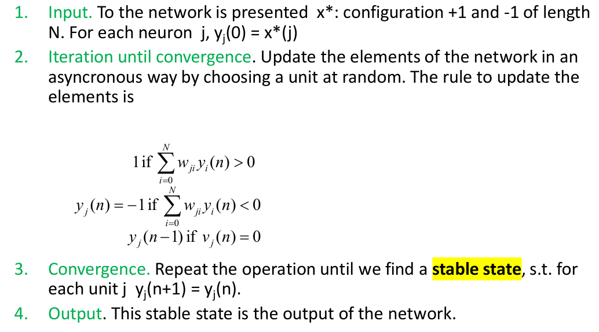

# Neural networks and Deep learning - Parte III

## Hopfield networks and restricted Boltzmann Machines

### Hopfield networks

- **Hopfield networks**:
    - Introduced by the physicist John Hopfield in 1982 (2024 Nobel in Physics).
    - Used to represent **content addressable memory**:
        - Given a reasonable portion of the memorized information and a partial corrupted portion.
        - It can be completed by recovering other associated information (**pattern completion**).
    - The system preserves this property also when some components are broken (**fault tolerance**).
    - *Attractor networks*: useful to memorize fundamental memories which attract other inputs.
        - Given a partial (and/or noisy) figure it retrieves the original figure.
    - **Pattern completion** characterizes a lot of human memory.
        - These network (and the attractor network in general) are used to model several cognitive phenomena.
    - Network of McCulloch-Pitts neurons interconnected, where each neuron can have two states ($1$ and $-1$).
        - Given $N$ units:
            - Each neuron is connected with all the other neurons but itself (**fully connected**).
            - Weights are symmetrical $w_{ij} = w_{ji}$.

#### Information withdrawal phase

- **Information withdrawal phase**:
    - The **pattern completion** happens during the **withdrawal/retrieval phase**.
        - *State* of a network with $N$ neurons at a given iteration: activations of the $N$ neurons ($1$, $-1$).
        - *Input*: vectors of $1$ and $-1$ of dimension $N$.
            - Each neuron represent an element of the input.
        - Then calculate new activation of a neuron at a time, randomly chosen, until there is no change.
    - `def` **Activation of $j$ at iteration $n$**: $y_j(n) = \varphi(v_j(n))$.
        - $v_j$ = netinput to $j = \sum_{i=0}^N w_{ji} y_i(n)$.
        - $\varphi(v_j)(n) = -1$ if $v_j(n) < 0$,  $1$ if $v_j(n) > 0$, and $\varphi(v_j)(n-1)$ if $v_j(n) = 0$.
        - Activations are calculated in an **asynchronous way**.
    - A **stable state** (where $\forall i$, $y_i(n+1) = y_i(n)$) will be the output of the network.
        - **Stable states are not unique**, they depends on the initial input and/or evaluation order.
            - `prop` The opposite of a stable state is a stable state.
        - A initial input (`eg` noisy image) is perturbed to a stable state (`eg` actual image).
        - Stable states act as **attractors**: given any state, it will converge in one of the stored states.

#### Storage phase

- **Storage phase**:
    - The information withdrawal phase assumes weights are already computed.
        - Those weights are computed in the **storage phase**.
        - Once the memories are stored, the pattern completion can start.
    - **Memorized information works as attractor**.
    - `def` **Weights computation**: $w_{ji} = \frac{1}{M} \sum_{k=1}^M f_k(i) \cdot f_k(j)$ where $j \neq i$.
        - Given $M$ fundamental memories and $f_1, \dots, f_M$ vectors of dimension $N$.
        - For each fundamental memory the product between the $i$-th and the $j$-th element.
            - If the have different sign, $f_k(i) \cdot f_k(j) < 0$ contributes to weaken $w_{ji}$.
            - If the have the same sign, $f_k(i) \cdot f_k(j) > 0$ contributes to strengthen $w_{ji}$.
    - The learning algorithm is based on **Hebb's principle**:
        - Strengthen the connections between units with the same activation.
        - Weaken the connections between units with opposite activation.
        - Hebb's principle has a neurobiological counterpart:
            - In the synapses between units which are often active at the same time are strengthened.
            - While synapses between neurons which are not simultaneously active are weakened.
            - *Neurons that fire together wire together*.

#### Convergence of Hopfield networks

- **Convergence of Hopfield networks**:
    - `th` **Convergence**: given a starting state the network will always arrive to a stable state.
        - The activities cannot be changed forever.
        - *Proof*:
            - Given $N$ units, there are $2^N$ possible states of the network.
            - To each of these states is associated an **energy** value.
                - `def` **Energy function**: $E = - \frac{1}{2} \sum_i \sum_j w_{ij} y_i y_j$.
                - $E$ measures the predisposition of the network to change state.
                    - Opposite of **harmony** (bad).
                    - Harmony increases with the number of positive $w_{ij} y_i y_j$.
                        - Higher harmony $\to$ less predisposition to change state.
                        - Lower harmony $\to$ more predisposition to change state.
            - Each change of state of the network leads to a lowering of the energy.
                - Each $w_{ij} y_i y_j$ is positive if $y_i$ and $y_j$ have the same sign and $w_{ij}$ is positive.
                    - Or they have opposite sign, and $w_{ij}$ is negative.
                    - The activations enforce each other (**low energy** $\to$ **low predisposition to change**).
                - Each $w_{ij} y_i y_j$ is negative if $y_i$ and $y_j$ have the same sign and $w_{ij}$ is negative.
                    - Or they have opposite sign, and $w_{ij}$ is positive.
                    - Instable (**high energy** $\to$ **high predisposition to change**).
                - Consider how $E$ changes with the activation of the $k$-th unit.
                    - $E$ and $E'$ denote energy before and after the change of $y_k$.
                    - $E = \frac{1}{2} \sum_i \sum_j w_{ij} y_i y_j = - \frac{1}{2} (\sum_{i \neq k} \sum_{j \neq k} w_{ij} y_i y_j + 2 \sum_{j \neq k} w_{kj} y_k y_j)$.
                    - $E' = - \frac{1}{2} (\sum_{i \neq k} \sum_{j \neq k} w_{ij} y_i y_j + 2 \sum_{j \neq k} w_{kj} y_k' y_j)$.
                    - $E - E' = - \frac{1}{2} (2 \sum_{j \neq k} w_{kj} y_k y_j - 2 \sum_{j \neq k} w_{kj} y_k' y_j) = - \sum_{j \neq k} w_{kj} y_j (y_k - y_k')$.
                        - $\sum_{j \neq k} w_{kj} y_j$ is $v_k$.
                    - There are two cases:
                        - $y_k$ passes from $+1$ to $-1$:
                            - Hence $y_k - y_k' > 0$ and $\sum_j w_{kj} y_j < 0$.
                            - Then $- \sum_{j \neq k} w_{kj} y_j (y_k - y_k') > 0$ and $E > E'$.
                        - $y_k$ passes from $-1$ to $+1$:
                            - Hence $y_k - y_k' < 0$ and $\sum_j w_{kj} y_j > 0$.
                            - Then $- \sum_{j \neq k} w_{kj} y_j (y_k - y_k') > 0$ and $E > E'$.
                    - At each change $E$ lowers.
            - Therefore, there is a moment in which there is **no reachable state with lower energy**.
                - Since the states are finite, at a given point there's a state that doesn't change.
                    - This state is a **stable state**.

#### Qualities and drawback of Hopfield networks

- **Qualities and drawback of Hopfield networks**:
    - Qualities:
        - They **complete partial patterns**.
        - They **generalize**.
            - Given an input similar to what has been memorized, they recover the corresponding information.
        - They are **fault tolerant**.
            - If some synapses get broken (*brain damage*) the output is still reasonable.
        - They allow the **extraction of prototypes**.
            - If the NN learns several similar informations, it creates their prototype and this is the explicitly presented state.
        - The **learning rule is Hebb-like**.
            - Which is biologically plausible and there is evidence that it exists in the brain.
        - The networks can account for **context effects**.
            - Humans remember better what is learned if they are put in the same context.
    - Drawbacks:
        - Not all the stable states are fundamental memories memorized during storage.
            - There are **spurious states**:
                - The opposite of a stable state is a stable state.
                - Combinations of stable states are stable states.
            - Not all fundamental memories are stable states.
            - Storage capacity with few errors given $N$ units $= 0.14 N$ (*rule of thumb*).
        - Limited storage capacity.
        - Errors.
        - In the brain synapses are not symmetrical.
        - In the brain there are no stable states but states transitorily stable, which evolve in **successive states**.
            - There are extensions of Hopfield networks that learn sequences of states.
    - Hybrid models are being used.
        - Standard convolutional model are poor at pattern completion.
        - `eg` Convolutional + HN for pattern completion.

### Restricted Boltzmann machines

- **Restricted Boltzmann machines**:
    - **Spurious states** are the main limitation of Hopfield networks.
        - The capacity of a totally connected net with $N$ units is only about $0.15 N$ memories.
            - An inefficient use of the bits required to store the weights.
        - A phase of **unlearning** can be used after learning to get rid of spurious states.
            - Hinton suggests this is the function of dreams.
    - Three main idea behind Restricted Boltzmann machine:
        - Visible vs. **Hidden units**.
        - **Stochastic** units.
        - New learning algorithm to correct errors (*fantasies*).
            - HN use *one-shot learning* during the storage phase.

#### Hidden states

- **Hidden states**:
    - Main features:
        - Two levels: visible and hidden neurons.
        - Connections only between visible and hidden units.
            - All visible units are connected to all hidden units.
        - Weights are symmetrical: $w_{ij} = w_{ji}$.
        - Possible neurons' activation states: $0$ or $1$ (and not $-1$ and $-1$).
        - Neurons are **stochastic**.
        - Input and output are computed on the visible layer.
    - Instead of using the net to store memories, use it to construct **interpretations** of sensory input.
        - The input is represented by the visible units.
        - The interpretation is represented by the states of the hidden units.
        - Construct interpretations: detect and **represent regularities** in visual activations.
            - Hidden units specialise in recognising (and generating) **portions of visual patterns**.

#### Stochastic units

- **Stochastic units**:
    - Noisy networks find better energy minima.
    - A HN always makes decisions that reduce the energy.
        - This makes it impossible to escape from local minima.
    - Stochastic binary units:
        - Replace the binary threshold units by binary stochastic units that make biased random decision.
        - `def` **Activation probability**: $P(s_i=1) = \frac{1}{1 +e^{- \Delta E_i / T}}$ (sigmoid).
            - `def` **Energy gap**: $\Delta E_i = E(S_i = 0) - E(S_i = 1)$.
                - Objective: minimize the energy.
                    - $E = - \sum_k \sum_j w_{kj} v_k h_j$.
                - $\Delta E_i = \sum w_{ij} s_j$ for all $j$ connected to $i$.
                - If $\Delta E_i < 0$, $p(s_i=1) < 0.5$.
                - If $\Delta E_i = 0$, $p(s_i=1) = 0.5$ (no difference by assigning $1$ or $0$).
                - If $\Delta E_i > 0$, $p(s_i=1) > 0.5$.
            - The *temperature* $T$ controls the amount of noise.
                - $T=1$ is assumed (can be ignored it).
    - **Sampling**:
        - Sampling is used then to attribute a state ($0$ or $1$) using the corresponding probability.
        - The same VL activation is presented multiple times and corresponding HL activation is collected.

#### Execution of a RBM

- **Execution of a RBM**:
    - Procedure:
        - Present a visual input.
        - Calculate activation at the hidden level.
        - Recalculate activation at the visual level.
        - Possible, start again.
        - Continue until *convergence* (no significant change).
    - By evaluating the hidden layer only, the most probable activation at the visible level is provided.
        - An activation of the HL represents a **codified version** of the corresponding VL activation.
            - Experimentally it has been observed each HL neuron *specialises* in a sub-set of VL neurons.
        - It also works with different (or corrupted) patterns.
    - RBM are **generative models**: they are used to generate visual states.
        - The process of generating them usually requires several steps.
            - Calculate visual states, then hidden, then visual again, etc.
            - Until equilibrium (a state in which there are no big changes in the probability distribution).
        - They learn to **reproduce** at the visual level the training set.

#### Weights learning in RBM

- **Weights learning** in RBM:
    - Goal: maximize the probability of obtaining at the VL the vectors of $Tr$.
        - $Tr$: set of visible vectors to be learned by the RBM (in order to reconstruct or generate).
    - A **fantasy** is the reproduction (at the VL) of an original pattern after a very high number of steps.
        - The weights are learned in order to minimize difference between pattern and fantasies. 
        - Actually, Hinton discovered that just **two steps** are needed («a very surprising short-cut»).
        - Importance of weights in RBM:
        - Hidden units specialise in recognising (and generating) **portions of patterns**.
        - The probability of unit $i$ to get state $1$ depends on the weights to $i$.
            - Roughly, positive weight $w_{ij}$ augments the impact of neuron $j$ to $p(s_i=1)$.
        - By observing weights matrices to HU, it can be understood which inputs values augment their probability to activate.
    - After learning the weights starting from $Tr$, RBM is ready to be used:
        - **Generation**: generate a visual activation pattern from a random hidden activation pattern.
        - **Reconstruction**:
            - Start with a visible input.
            - See what visual activation the RBM reproduces after a few passage V-H-V, etc.

##### Contrastive divergence

- `ex` **Contrastive divergence** (learning algorithm):
    - Execution:
        - Start with a training vector on the visible units.
        - Update all the hidden units in parallel (since they're independent).
        - Update all the visible units in parallel to get a *reconstruction*.
        - Update the hidden units again.
    - `def` **Weights update**: $\Delta w_{ij} = \varepsilon(\langle v_i h_j \rangle^0 - \langle v_i h_j \rangle^1)$.
        - $v_i$ and $h_j$ are the activations of visual unit $i$ and hidden unit $j$.
        - $\varepsilon$ is the learning rate.
        - Just **two step** ($\langle \rangle^0$ and $\langle \rangle^1$) are needed.
    - Everything must be iterated for several epochs.
    - Overall algorithm:
        - Weights are initialised randomly.
        - At each epoch $n$:
            - An element of $Tr$ is chosen.
            - For each weight, $\Delta w_{ij}$ is computed, and $w_{ij}(n+1) = w_{ij}(n) + \Delta w_{ij}$.
        - Until the maximum number of epochs is reached.

#### Deep RBM

- `-ex` **Deep RBM** (or stacked RBM):
    - Idea:
        - First train a layer of features that receives input directly from the pixels.
        - This layer discovers patterns of activities, regularities, in the layer below.
        - Then treat the activations of the trained features as if they were pixels and learn features of features in a second HL.
        - This second HL discovers patterns of activities in the layer below correlations between features discovered at the previous level.
        - Each level models the correlation between activities in the level below.
        - Then do it again.
    - It's proven that with each additional layer of features the probability for generation $Tr$ is **improved**.
    - SBM can be **fine tuned** according to the desired applications.
        - If used for *classification*, by adding a classification layer.
            - The first really successful deep autoencoders [Hinton & Salakhutdinov, 2006].
        - If used for *generation*, with **Deep belief nets**.
        - If used for finding few very descriptive features with **autoencoders**.
    - As in CNN, the more deep RBM are specialized on more complex features.
