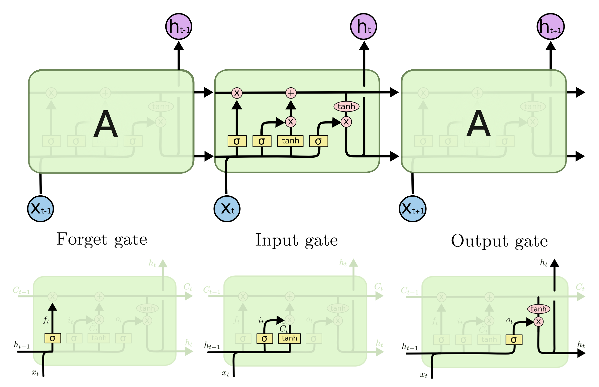

# Neural networks and Deep learning - Parte IV

## Convolutional neural networks

### Convolutional neural networks

- **Convolutional neural networks**:
    - Designed to solve computer **vision problem** (`eg` image classification, object detection, etc).
        - Traditionally, computer vision was on *hand-crafted features*.
        - Today features are no longer hand-craft but **learned** by CNN architectures.
            - Usually, those features cannot be described in intelligible terms.
        - Traditional NN don't scale well for image data.
    - Key advantages of CNN: local connections, shared weights, pooling, hierarchy of features.
        - Passage through all these phases is necessary since it's not possible to pass from raw pixel to abstract concepts.
        - The focus of DNN is to go through all these levels of abstraction.
        - Designed to encode invariances and equivariances **specific** to image data.
    - Multilayer perceptrons don't scale well on big size images.
        - `eg` With a 1000px square image, the corresponding network should have 3M weights.
        - They also loose the **spatial information** of an image.

#### CNN basic elements

- **CNN basic elements**:
    - **Convolution** layers, **pooling** layers, **fully-connected** layers, activation function.
    - Two terminological variants:
        - In the complex layer terminology, the convolutional layer is composed by:
            - Convolution stage $\to$ Detector stage (`eg` ReLU) $\to$ Pooling stage.
        - In the simple layer terminology, the convolutional layer is the convolution stage only.
    - CNN contain multiple such layers of convolution and pooling in succession.
        - In which the output channels of a particular layer form the input channel of the next layer.
        - After convolution blocks there are one or more **fully connected layers**.

#### CNNs applications

- **CNNs applications**:
    - CNNs have state-of-the-art accuracy for **image classification tasks**.
        - Their development was accelerated through the introduction of **ImageNet**.
            - Large-scale benchmark dataset: 14M natural images, hand labelled into 22K categories.
        - Image Classification, object detection, image segmentation, neural style transfer.
        - Used also for other tasks, as analysis of sequential data.
    - Recent alternative architectures based on Transformers have become competitive with CNN.

##### ImageNet Large Scale Visual Recognition Challenge

- **ImageNet Large Scale Visual Recognition Challenge** (*ILSVRC*, 2010-2017):
    - ImageNet subset with 1K non-overlapping categories, 1.28M training, 50K validation and 100K test images.
    - Key milestones: 
        - AlexNet (2012, deep breakthrough).
        - VGG, GoogleLeNet, ResNet (advanced depth and accuracy).
    - The model outputs a ranked list of 1K class probabilities for each image (output of softmax layer).
        - If the correct label is within the top-5 predictions, it counts as correct.
        - $\text{Top-5 accuracy} = \frac{\# \text{ images where true label } \in \text{ top-5 predictions}}{\text{total images}}$.
        - $\text{Top-5 error rate} = 1 - \text{Top-5 accuracy}$, $5\%$ for human, $2.3\%$ in 2017 for a CV system.
            - Superhuman performance maybe because humans cannot distinguish specific classes [Bishop].
    - Further developments:
        - Models have been evaluated on noisy and blurred images [2017].
        - Slightly different dataset has been proposed (`eg` ImageNetV2) [2019].
        - $\text{Top-1 accuracy} = \frac{\# \text{ number of correct predictions}}{\text{total images}}$ [2023].
            - ImageNet still drives progress to date, but $\text{Top-1 accuracy}$ is stagnating.

##### Notable CNNs

- Notable CNNs:
    - LeNet (one of earliest CNN models) [LeCun et al., 1989].
        - Two convolutional layers, pooling and fully connected layers.
        - Used for digit recognition tasks (MNIST dataset).
    - **AlexNet** [Krizhevsky, Sutskever & Hinton, 2021]:
        - Won the 2012 competition with top-5 error rate of $15.3\%$.
        - Use of the ReLU activation function.
        - Application of GPUs to train the network.
        - Use of dropout regularization.
    - VGG-16 model [2014].
    - ResNet family.
    - Inception Family (GoogLeNet, V2, V3).

#### Convolution layers

- **Convolution layers**:
    - Hidden units are connected to a **portion** of the image, the unit's **receptive field**.
        - Instead of linearizing the image, and loosing spatial information. 
    - Weight vector: **filter** (or **kernel**) that determines the kind of features for which the unit activates the most.
        - Unit activation: $z = \text{ReLU}(\text{w}^T \text{x} + w_0)$.
            - $\textbf{w}$ and $\textbf{x}$ are vector's representation of pixel values and weights, while $w_0$ the bias.
    - **Feature maps**:
        - Nearby units are connected to adjacent regions of the image with the same weight vector.
            - Detect the **same feature** in a different area of the image.
            - **Weight sharing** (all units share the same weights).
        - Units of the hidden layer form a **feature map**.
            - All units of a feature map detect the **same feature** in a different area of the image.
        - The filter goes over the image and determines the activation of the associated units in the FM.
    - Convolutional layers contain a **set of feature maps**, each with a different filter.
        - `eg` Examples of convolution filters: identity, edge detection, sharpen, Gaussian blur.

##### Properties of convolution layers

- `prop` **Properties of convolution layers**:
    - **Sparse weights**.
    - **Parameter (weight) sharing**.
    - **Locality-based analysis**.
    - **Equivaraince to translation**.
        - A feature detected in a position can be detected in another position never seen before by means of the same filter.
        - It will activate a unit in the same layer but possibly in a different location.
            - It will activate a nearby unit in the same feature map.
        - **Translation equivariance** $\neq$ **transaltion invariance**.
            - At classification level, particular object should be assigned the same classification irrespective of position.
            - **Scale invariance**: changes to object size should also leave its classification unchanged.
            - For MLP to learn invariance one would need to consider huge datasets (like by using data augmentation).

##### Convolution layers hyperparameters

- **Convolution layers hyperparameters**:
    - **Kernel size** (`eg` $3 \times 3$, usually odd numbers).
        - Larger kernel size $\to$ smaller feature map.
    - **Stride**: determines how far the filter moves across the input.
        - The filter is moved in steps of size $S$.
        - Larger stride $\to$ smaller feature map.
    - **Padding**: add extra pixels around the edge of the input to control output size.
        - So the feature map can have the same dimensions as the original image.
        - Larger strides reduce the output size, while padding preserves more information.
    - **Convolutional filters number** (of feature maps in a convolutional layer).

##### Filters

- **Filters**:
    - In classical image processing, kernels' weights were **handcrafted** by experts.
        - Instead, CNNs **learn the best weights** (via backpropagation).
    - Learned filters are much less neat and interpretable than the examples made by humans.
    - **Multidimensional convolution**:
        - A multi-dimensional filter takes input from across the R, G and B channels.
            - `eg` A $3 \times 3$ filter has $27$ weights (plus a bias) and can be visualized as a $3 \times 3$ tensor.
        - This holds for the first level of the kernels.
            - For higher level filters the number of input channel is in general higher than $3$.
        - Filters in deeper levels cannot be visualized directly.
            - The input that maximizes activation for all neurons of a given FM can be visualized.
            - **Saliency maps**:
                - Used to identify those regions of an image most significant in determining the class label.
        - Multiple independent filter lead to multiple feature maps, forming a single **convolutional layer**.
            - The filter operates on a portion of the input volume.
            - Each slice of neurons (same depth) denotes a feature map.
                - Weights are shared in a feature map.
                - Neurons in the same FM process different portions of the input volume in the **same way**.
            - Each feature map can be seen as the result of a specific filtering of input.

#### Rectified Linear Unit

- **Rectified Linear unit**:
    - MLP historically used the sigmoid activation function.
        - In deep network, its use is problematic for back propagation (**vanishing gradient**).
        - Sigmoid for large and small values derivatives is close to $0$.
        - In weight update: $\delta^l = ((\textbf{W}^{l+1})^T \delta^{l+1}) \odot \sigma'(\textbf{a}^l)$.
            - If $\sigma'$ is close to $0$ the product is very small $\to$ vanishing gradient.
    - `def` **Rectified linear unit activation function** ($ReLU$): $f(u) = \max(0, u)$.
        - The derivative is $0$ for negative values, and $1$ for positive values.
        - It introduces non-linearity to the model.
        - This leads to sparse activations (part of the neurons are off).
            - Which leads to simpler activation patterns, which makes it **more generalizable**.
        - Unit acts as a **feature detector** that signals when it finds a sufficiently good match to its kernel.

#### Pooling

- **Pooling**:
    - A pooling function replaces the output of the net at a certain location with a summary statistic of the nearby output.
        - The **max pooling** operation reports the maximum output within a rectangular neighborhood.
        - The **average pooling** operation reports the average output within a rectangular neighborhood.
    - It **reduces dimensionality** (downsampling).
    - It selects the **most informative values**.
    - It implements **invariance wrt (small) translation**.
    - Pooling layers have no weights.
        - Pooling does not have learnable parameters but only hyperparameters (fixed with the architecture).
        - `eg` A standard choice is max-pooling over $2 \times 2$ kernels with stride $2$.

#### Cost functions

- **Cost functions**:
    - For classification with CNN, common CFs are: **Soft-Max** and **Cross-Entropy**.
    - `def` **Soft-Max**: $z_k = f(v_k) = \frac{e^{v_k}}{\sum_{c=1, \dots, s} e^{v_c}}$.
        - It consist of a final layer of $s$ neurons (one for each class) fully connected to the previous layer.
        - The neuron inputs $v_k$ are calculated as usual, but the activation function for the $k$-th neuron is the one above.
        - Values $z_k$ can be viewed as probabilities: they belong to $[0, 1]$ and their sum is $1$.
    - `def` **Cross-Entropy loss**: $- \sum_{i=1}^S t_i \cdot \log(p_i)$.
        - It measures how much the predicted distribution $p$ **differs** from the desired output.
        - $t_i$ is the desired output for neuron $i$, while $p_i$ is the predicted value.
        - Functioning:
            - If the model predicts $p_j \approx 1$ for the correct class, the prediction is very close to the truth.
                - $\log(1) = 0 \to$ low cross-entropy.
            - If the model predicts $p_j \ll 1$ (possibly $p_j = 0)$ for the correct class, the prediction is very wrong. 
                - $\log(0) = - \infty \to$ high cross-entropy.
        - Backpropagation is then applied with this loss function.
        - Cross entropy between two discrete distributions: $H(p, q) = - \sum_v p(v) \cdot \log(q(v))$.
            - It measures how much $q$ **differs** from $p$.
    - By using Soft-Max and Cross-entropy, BP involves calculating gradients for both the output and hidden units.

#### Avoiding overfitting

- **Avoiding overfitting**:
    - **Dropout regularization**:
        - During training, some neurons are randomly ignored (*dropped out*) with a given probability $p$.
        - It speeds up the training process.
            - More training iterations needed, but those will be faster.
        - Encourages **sparsity**, thus enhances generalization and avoids overfitting.
        - Typically implemented as a *layer* that zeroes the previous neurons' output with probability $p$.
            - Placed after **activation functions**.
    - **Early stopping**:
        - Monitors the model's performance on a **validation set** during training.
            - Stop the training when performance starts to degrade (indicating overfitting).
        - A way to keep the model from continuing to learn noise in the $Tr$ after the optimal point.
    - **Data augmentation**:
        - Not a regularization technique in the traditional sense.
            - It artificially increases the size of the training dataset by applying random transformation to $Tr$ images.
        - It helps the model generalize better by exposing it to variation to be found in the real world.
    - **Batch normalization**:
        - It normalizes the output of each layer.
        - Which can reduce overfitting by introducing noise to the training process.
    - **Weight decay**:
        - Adds a penalty to the loss function that encourages weights to be small, thus preventing overfitting.

#### Neuroscientific basis of CNN

- **Neuroscientific basis of CNN**:
    - In the mammalian visual cortex, there are simple neurons that detect simple features.
        - Hubel & Wiesel paved the way in this research by analyzing cat's striate cortex.
    - Several studies tried to establish commonalities between CNN and brain processing.

### Transfer learning

- **Transfer learning**:
    - The training of complex CNN on large dataset can require a lot of machine time (even on GPUs).
        - One trained, the classification of a new pattern is generally fast (`eg` 10-100ms).
    - **Fine-tuning**:
        - Start with a pre-trained network trained on a similar problem.
        - The output layer is replaced with a new layer of Soft-Max neurons (adapting classes number).
        - As initial values for weights those of the pre-trained network are used.
            - Except for connections between penultimate and final layers whose weights are initialized random.
        - New training iteration with SDG are carried out to optimize weights.
            - To respect to the peculiarities of the new dataset (not necessary to be of large size).
        - `eg` Examples of fine-tuning:
            - A network trained on object classification $\to$ lesion classification (**scarcer dataset**).
    - **Feature reusing**:
        - A pre-trained NN is used without further fine-tuning.
        - Generated features by the NN during the forward step on the new dataset are extracted (at intermediate layers).
        - These features are used to train an external classifier.
            - To classify the patterns belonging to the new application domain.

-----

## Recurrent neural networks

### Recurrent neural networks

- **Recurrent neural networks**:
    - Specialized to work on **sequences**:
        - Speech recognition, music generation, DNA analysis, sentiment classification, translation, NER, LM, etc.
        - The input and the output can have same or different dimensions.
        - Standard NN aren't well suited for seq-to-seq tasks.
            - Inputs and outputs can be different lengths in different examples.
            - Doesn't share features learned across different positions of text.
            - **Context** must be taken into account.
    - **Elman networks** [1990]:
        - Precursor of simple RNN, built for cognitive purposes.
        - Introduced to explain how infants could learn to identify words from a continuous stream of phonemes.
            - `eg` «manyyearsagoaboyandgirllivedbytheseatheyplayedhappily».
        - It showed how this network can induce categorical grammar (noun/verb) of input sentences with no previous knowledge.
            - Just by learning it from example.
        - Architecture:
            - Input units.
            - Hidden units.
                - The output of HU is fed to output units but also to **context units**.
                - At the next iteration, the new input (`eg` next word in the sentence) and previously stored context units are fed to the current hidden units (**recursion**).
            - Output units.
    - At the $i+1$-th time step, the $i$-th activation is taken into account.
        - Unrolled vs Rolled representation (the latter represent the recurrent component).
            - The rolled representation highlights that the **weights are shared**. 
        - `def` **RNN Activation**: $a^{\langle i \rangle} = g(W_{ax} * x^{\langle i \rangle} + b_a + W_{aa} * a^{\langle i - 1 \rangle})$ and $\hat{y}^{\langle i \rangle} = g'(W_{ya} \: a^{\langle i \rangle} + b_y)$
            - $a^{\langle 0 \rangle}$: zero vector.

#### Training a RNN

- **Training a RNN**:
    - Training is performed using **Backpropagation Through Time** (BPTT).
        - BPTT begins by unfolding a recurrent neural network in time.
            - The unfolded network contains $k$ inputs and outputs.
            - But every copy of the network shares the same parameters.
        - Then, BP is used to find the gradient of the loss function wrt all the network parameters. 
    - Problems:
        - **Vanishing** or **exploding gradient** (technical problem).
        - Not very good at capturing **long distance dependencies**.

### Long Short Term Memory

- **Long Short Term Memory** (LSTM):
    - To capture long distance dependencies, a sort of **memory** is needed.
    - A **LSTM cell** substitutes the hidden layer of a RNN. 
        - Each cell receive an input from the example and the activation of the previous LSTM cell (a la RNN).
        - Units have **gates** that decide when to update memory cell states, what to keep, what to forget.
    - Three type of gate: **forget**, **input** and **output gate**.
    - Applications:
        - Speech recognition, machine translation, syntactic parsing, handwriting recognition, image captioning.
    - LSTM can be **stacked** too (deep LSTM).
        - The output of the LSTM below is used for the upper one.

#### LSTM architecture

- **LSTM architecture**:
    - **Cell state**:
        - The horizontal line running throught the top of the diagram.
        - It transports informations down the entire chain, with only some minor linear interactions.
        - LSTM have the ability to remove or add information to the cell state, carefully regulated by **gates**.
    -  `def` **LSTM Forget gate**: $f_t = \sigma(W_f \cdot [h_{t-1}, x_t] + b_f)$.
        - What information will be eliminated from the cell state.
        - Given $h_{t-1}$ and $x_t$, $f_t$ is a vector of values between $1$ and $0$ (with same dimension as $C_{t-1})$.
        - Values of $f_t$ are then multiplied element-wise with $C_{t-1}$.
            - Thus gating what values of $C_{t-1}$ are kept, what are thrown away.
    - `def` **LSTM Input gate**: $i_t = \sigma(W_i \cdot [h_{t-1}, x_t] + b_i)$.
        - What information should be added (`eg` information on new subject).
        - Input gate is multiplied with **candidate cell state** $\tilde{C}_t = \tanh(W_C \cdot [h_{t-1}, x_t] + b_C)$.
            - And the result is then added to the previous cell state.
        - As a result of previous operations by forget and input gate, a **new cell state** is computed.
            - $C_t = f_t \cdot C_{t-1} + i_t \cdot \tilde{C}_t$.
    - `def` **LSTM Output gate**: $o_t = \sigma(W_o \cdot [h_{t-1}, x_t] + b_o)$.
        - Which part of the cell state will be kept. 
        - From the new cell state $C_t$, the **output** $h_t$ is computed.
            - $h_t = o_t \cdot \tanh(C_t)$.
            - $o_t$ is applied to cell state $C_t$ to really compute (filter) what to output.

-----

## Cognitive Assessment

### NN and cognition

- **NN and cognition**:
    - Three different approaches:
        - **ANN as cognitive models**.
            - Cognitive models of how humans might learn language or analyze visual information.
            - First NN for language aimed to be cognitively plausible models of language learning in infants.
                - `eg` Elman's first RNN, Rumelhart and McCelland's PDP model.
                - Tasks: learn word-meaning associations, learn past-tense, etc.
            - Perceptron aimed to model simple visual cells in the mammalian cortex.
                - CNN are considered as good models of visual information is processed in the brain.
        - **Cognitive assessment of NN models**.
            - Use tools of CogSci and linguistics to probe models' performance and compare to human performance.
            - Contemporary NN are focuses to application with looser relation to cognitive plausibility.
                - However, cognitive tools ave been used to assess NN performance.
        - **ANN as models to understand the brain**.
            - Several works to predict and describe activity in areas of the brain using CNNs (and family).
                - Di Carlo's claim: CNN are a good model of how visual information is processed in the brain ($V1 \to V2 \to \text{PIT} \dots$).
            - Learning how the brain processes visual information can also improve CNNs.
                - `eg` CNN models with a neural hidden layer that better match primary visual cortex (V1) are also more robust to adversarial attack.

### ANN as cognitive models

#### Interactive Activation model

- **Interactive Activation model** [Rumelhart & MCCelland, 1981-82]:
    - A possible mechanistic explanation of **context effect**.
        - People are faster and more accurate at identifying the O in real word *SPOT* vs. *TKOR*.
        - This suggest that humans use orthographic rules (not just familiarity).
    - Question: do human represent these rules in their minds and use them in the service of perceiving letters.
        - No, humans are not using orthographic rules when reading.
        - People simply process visual input using the **interactive activation model**, which explains the context effect.
            - Pipeline: Visual input $\to$ feature level $\leftrightarrow$ letter level $\leftrightarrow$ word level.
            - Levels have self-loops and feed information back to the level underneath.

#### Debate between nativism and empiricism

- **Debate between nativism and empiricism**:
    - **Nativism** (Chomsky, Fodor):
        - The mind contains **innate**, **domain-specific structures** (`eg` Universal grammar).
        - Learning is impossible without rich built-in constraints.
        - *Poverty of stimulus*: input is insufficient, innate knowledge must fill the gaps.
    - **Empiricism** (English tradition as in Lock and Hume, now the *USA East coast*):
        - The mind begins with **few domain-specific structures**.
        - Rich learning mechanisms extract structure from experience.
        - Statistical regularities in input are sufficient for acquisition.
    - **Connectionism** (Rumelhart, McCelland, Elman):
        - **No built-in rules** or domain-specific constraints.
        - Structures **emerge** from exposure to data (`eg` past tense learning, word segmentation, phonotactics).
        - Connectionist models were historically developed *as a challenge* to nativist claims.
        - `eg` **Elman's (recurrent) neural network**:
            - Task: predict the next letter in a sequence of letters.
                - The network was presented with one letter at a time.
                - It takes into account the context in order to make a prediction via the **context layer**.
                - The network learns alone word boundaries.
                    - Prediction error accuracy is somehow a **proxy of word boundaries**.
                    - Inside a single word the error becomes lower, and it increases when a new word begin.
            - Task: predict the next word in a sequence of words.
                - By analysing inner representation, words can be clustered according to their similarities into **syntactic categories**.
                - The network learns to form a inner representation for verbs and one for nouns.
            - This is a contribution to the empiricist view.
                - No previous knowledge of syntactic structures needed.

### Cognitive assessment of NN models

#### Assessing the Ability of LSTM to Learn Syntax-Sensitive Dependencies

- **Assessing the Ability of LSTM to Learn Syntax-Sensitive Dependencies** [Linzen, Dupoux, Goldberd, 2016]:
    - **Cognitive science as a tool to evaluate NN models**.
    - Objectives of the paper:
        - Stress test for LSTM (performance side):
            - Success in language processing is typically attributed to theirs ability to capture **long-distance statistical regularities**.
        - On the cognitive side:
            - Limits of RNN as model of (child) language learning (as in Elman, 1990-91).
                - **There are rules that infants learn but LSTM don't learn**.
                - Therefore either LSTM is not the right model, or there is innate knowledge (authors more on the nativist side).

##### Structured representations

- Arguments for **structured representations**:
    - Many word co-occurring statistics can be captured by treating sentences as an unstructured list of words.
        - Most naturally occurring agreement cases in the Wikipedia (training corpus) are easy.
            - Solvable without syntactic information, based only on the sequence of nouns preceding the verb.
        - Other dependencies however are **sensitive to the syntactic structure** of a sentence.
        - Given the difficulty in identifying the subject from the linear sequence of the sentence.
            - Dependencies such as subject-verb agreement serve as an argument for structured syntactic representations in human.
    - But LSTM don't use any type of structured representations.
        - Sadly (compared to Elman's results), LSTMs don't behave well on complex sentence with several and far apart attractors.

##### Task considered

- **Task considered**: **subject-verb agreement**.
    - Training set: derived from Wikipedia.
    - Three different training conditions:
        - Most favorable condition:
            - Training with explicit supervision directly on the task of guessing the number of a verb based on the words that preceded it.
            - Error rates of LSTM evolve as a **function of distance** (with no intervening nouns).
        - Grammatically judgment training objective.
            - Full sentences annotated as to whether or not they violate subject-verb number agreement.
        - Training of a model without any grammatical supervision.
            - Instead using a *language modeling* objective (next word prediction).

##### Results and improvements

- **Results and improvements**:
    - Results (number prediction task):
        - Most naturally occurring agreement cases in Wikipedia are easy.
            - And can be solved without syntactic information.
            - This lead to high overall accuracy in all models.
        - The accuracy of supervised model is lower on **harder cases**, even if it managed to recover.
            - More mistakes when no overt cues to syntactic structure (function words) are available. 
    - Related tasks:
        - Verb inflection (`eg` write/writes, access to semantics too).
        - Grammaticality judgments (weaker supervision, no syntactic clues boundaries).
        - Language model (worst performer of all).
    - Main theoretical results:
        - LSTM make errors on **harder sentences** (mostly if trained in the language model setting).
            - It highlights the limitation of LSTMs that wouldn't be apparent when **analysing average performance**.
        - Therefore, **explicit supervision** is necessary for learning the agreement dependency using LSTM.
            - **Limiting its plausibility** as a model of child language acquisition (similarly to Elman, 1990, for RNNs).
    - Some (not general) single hidden units were found to be specialized in detecting singular or plural.
    - Possible improvements:
        - LSTM can be encouraged to develop more sophisticated generalizations by **oversampling** grammatically challenging training sentences.
        - Language modeling objective is not by itself sufficient for learning structure-sensitive dependencies.
            - **Joint training objective** (with supervisions as in SVA task) can be used.
                - To supplements LM on tasks for which syntax-sensitive dependencies are important.

##### Other neural architectures

- **Other neural architectures**:
    - In following papers by different authors, newer neural architectures were tested.
    - NN based on Transformers perform well on syntactic tasks (`eg`  subject-verb agreement).
        - However, they may be *right for the wrong reasons*.
            - Learning wrong heuristics, learning statistical approximations, etc.
    - *Embers of autoregression* [McCoy et al., 2024]:
        - LLM learn to predict the next words, and this has its advantages but also disadvantages.
            - They displays sensitivity to **output probability**, **input probability** and **task frequency**.
        - Even state-of-the-art models tends to fail on **lower probability sentences**.
        - If the rule is well defined, they don't infer the underlying rule, they learn a **statistical approximation**.
    - **Argument of the Poverty of the stimulus** re-adapted:
        - Today's best LLMs are trained on vastly more data than a child is exposed to.
            - Estimation: less than $100M$ words for a 12yo human.
        - Hence, the models will necessarily be un-human-like (a la Chomsky).
        - *BabyLM challenge*: to train language models in low-resource data settings.
            - Where amount of linguistic input resembles the amount received by human language learners.
            - Find the best architecture who perform best given the same initial conditions.
            - Another objective of the challenge is to democratize research.

#### Humans learn proactively in ways language don't

- **Humans learn proactively in ways language don't** [Han & McCelland, 2025]:
    - LLMs now match or exceed average human performance.
        - Maybe LLMs may soon become genuine examples of general intelligence or unified theories of human cognition.
        - This paper tries to answer these grandiose claims that appear in the literature.
    - Task considered (for humans and LLMs): **chain rank task**.
        - **Train phase**:
            - Participants learn about this chain from individual sentences describing the relations of neighboring pairs of entities.
            - The participant's goal is to learn whether the correct completion for each sentence is *true* or *false*.
            - This allows the CRT to be presented to humans and LLMs with maximally similar inputs and outputs.
            - `eg` Five entities (persons: Kennedy, Roosevelt, Lincoln, Einstein and Presley), considered as pairs.
                - The relation is *better at chess, worse at chess*.
        - **Test phase**:
            - Participants are required to make judgments of entity pairs from the underlying chain, including:
                - The original learning items.
                - New items that requires participants to make either:
                    - **Reverse generalizations**: $A > B \to B < A$.
                    - **Transitive generalization**: $A > B \land B > C \to A > C$.
    - Performed on LoRA, ICL and ICL+CoT (aligned or unaligned).

##### Results

- **Results**:
    - LLM **learns to generalize much more slowly** than humans.
    - While on learned relationships LLMs are optimal, they are worse in reverse and $n$-hop generalization. 
    - Via a post-experimentation form provided to all participants, it emerges:
        - Humans rely on one of two strategies for representing and reasoning about the learning items:
            - *Ranker strategy*:
                - Actively recording the learning items into a single representation of entity ranking.
                - Ranking that can be recalled for any test item.
            - *Non-ranker strategy*:
                - Memorizing each learning item independently.
                - Recalling only relevant learning items for each item.
        - During the testing stage, rankers achieved higher accuracy but also make faster judgments.
    - $\to$ Stronger performance is characterized by the **proactive formation of efficient representations that aid learning and generalization**.
        - Thesis: human intelligence is explained by **proactivity** and **curiosity** (and not only memorization).

#### Atoms of recognition in human and computer vision

- **Atoms of recognition in human and computer vision** [Ullman, Assif, Fataya, Harari, 2016]:
    - CNN have been proposed several times as a very close model to how human brain process visual information. 
        - Goal: see how far this analogy can go.
    - Central problem in the study of human vision:
        - Discovering **visual features** and **representation** used by the brain to recognize object.
        - NN models rival human performance on image classification.
            - Investigates commonalities in representation and learning process between current NN and human visual system.
    - **Minimal recognizable configurations** (MIRC).
        - Small portion of images from which a human can recognize the subject of the picture.
        - By rendering smaller (sub-MIRCs), no recognition is possible.
        - Since they are small, they **reveal features** that are important in recognition.
            - The role of features is revealed uniquely at the minimal level (essential contribution).
    - Human and networks models are tested to check if they **perform in the same way**.
        - If the human vision uses the same features to understand the content of an image.

##### Results

- **Results**:
    - In humans, better recognition of MIRC than in network models.
    - In humans, **sharp decrease between MIRC and sub-MIRC recognition**.
        - Not in neural networks models.
        - All MIRC features are necessary for human recognition.
    - Networks models:
        - They are not good at recognizing minimal images.
        - No decrease between MIRC and sub-MIRC.
    - Therefore **different features are used (in different ways)** by humans and NN.

##### Internal interpretation

- **Internal interpretation**:
    - Additional limitation is the ability to perform a detail internal interpretation of MIRC.
    - Human can consistently recognize multiple components internal to the MIRC.
    - Such internal interpretation is beyond the capacities of current NN.
        - It can contribute to accurate recognition.
        - Because a false detection could be rejected if it does not have **expected internal interpretation**.

##### Feed forward and top-down processes

- **Feed forward and top-down processes**:
    - Features are used in the visual system as a part of the cortical feed-forward process or by a top-down process.
        - Top-down process is currently missing from the purely feed-forward computational model.
        - While in human, there is a **combination of bottom-up and top-down processes**.
    - Top-down processes are likely involved:
        - Detailed interpretation appears to require features and interrelations that are class-specific.
    - Two main stages:
        - Initial activation of class candidates, which is incomplete and with limited accuracy.
        - The activated representations then trigger the application of class-specific interpretation and validation processes.
            - Which recover richer and more accurate interpretation of the visible scene.
