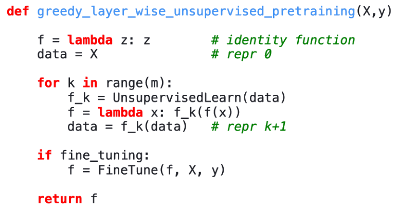

# Neural networks and Deep learning - Parte V

## Representation learning

### Representations

- **Representations**:
    - **Representation learning** underpins all current developments in DL.
        - It enables the sharing of statistical power across tasks.
        - Particularly beneficial when dealing with multiple modalities or domains.
        - Also facilitate **knowledge transfer** to tasks with few/zero examples are available, but a task representation exists.
        - Changing representation can make a problem very difficult or very easy.
    - A **good representation** is one that makes a subsequent learning task easy.
        - FFN training by supervised learning can be seen as performing a sort of representation learning.
            - Most part of the network is used to **learn better representations** (more and more abstract).
            - And then a simple classifier is used at the top of the network.
    - Learning objective can be tailored to force the representation to have some nice properties.
        - Most representation learning problems face a trade-off between:
            - Preserving as much information about the input as possible.
            - Attaining nice properties (`eg` *independence* of the features).

#### Properties of good representations

- **Properties of good representations**:
    - An ideal representation is one in which the **features** within the representation correspond to the **underlying causes** of the observed data.
    - Two key properties: they are often **distributed** and **disentangled**.
    - Local vs. distributed representations:
        - A **local representation** uses a single, discrete value for each concept (`eg` one-hot encoding).
            - Problem: all concepts are equally distant (no similarity is learnt).
                - This representation is **sparse** and **inefficient**.
        - A **distributed presentation** describes each concept using multiple and continuous features.
            - Each feature is involved in representing many concept.
            - It creates a **rich similarity space** (semantically close concepts are close in distance).
            - `-ex` DR help in **representing an exponential number of regions using** a linear number of parameters.
                - This doesn't automatically translate in an exponential advantage for the classification algorithm.
                - The VC dimension of a NN of linear threshold units is only $O(w \log w)$ ($w$ number of weights).
                    - The **Vapnik-Chervonenkis** dimension is a measure of the capacity of a model (hypothesis) space.
                    - It is used to deduce bounds on the generalization capabilities of ML.
                    - Keeping the VC dimension of the hypothesis space small is usually a sensible goal.
                - Despite the representation being able to distinguish between many zones, not all zones can be represented.
            - DR can be **interpretable**, but this is **not the norm**.
    - In a **disentangled representation** single features (or single features directions in the feature space) correspond to **single distinct factors** of  variation in the data.
        - It allows to reason about and manipulate high-level concepts independently.

### Transfer Learning and Domain Adaptation

- **Transfer Learning and Domain Adaptation**:
    - TL: Where what has been learned in one setting (distribution $P_1$) is **reused** to improve generalization in another setting ($P_2$).
        - In domain adaptation, the task is the same but, `eg`, the data distribution may differ.
    - Generalization of the idea of greedy PT.
        - Where the transferred representations were between unsupervised and supervised tasks.

#### Transfer Learning

- **Transfer Learning**:
    - The learner must perform two or more different tasks.
        - But it is assumed that many of the factors that explain variations in $P_1$ are relevant in $P_2$.
    - **Depth** seems to be crucial in this process.
        - As an architecture uses deeper representations, the learning curve on new categories of transfer setting $P_2$ becomes much better.
    - `eg` Image recognition on cancerous cells.
        - Strategy: fine-tune a general model (like ImageNet) on smaller medical dataset.
    - TL and DA assume there is a common **(shared) representation** that explain variations in the input data.
        - These variation are then adapted to the various tasks by different output layers.
            - `eg` Image recognition.
        - The shared part is the initial part of the network.
    - But there are situations, where what is shared between different tasks is not the semantics of the input.
        - But the semantics of the output and inputs need to be adapted to be compatible with that.
        - The shared part is the last part of the network.
        - `eg` Speech recognition.

#### Domain adaptation

- **Domain adaptation**:
    - The task remains the same between each setting, but the input distribution is slightly different.
        - `eg` Sentiment analysis (from movie reviews to product reviews).
    - Create a representation that captures the underlying patterns in the data while **ignoring domain-specific nuances**.
    - *Unsupervised Domain Adaptation by Backpropagation* [Ganin & Lempitsky, 2015]:
        - The source is MNIST while the target is MNIST-M (MNIST with different background).
        - A part of the network is used to learn a shared representation.
        - To this shared representation two classification heads are attached:
            - The first one classify digits.
            - The second one classify domains.
        - During training, each time the second head succeeds, the shared network is penalized.
            - The gradient is inverted (**gradient ascent**).

#### Concept drift

- **Concept drift**:
    - When the concept underlying the data distribution shifts in time.
        - A model learnt at a given point in time need, then, to be updated to take into account the drift.
    - In this case too, data from a given setting (previous than the shift) is exploited to get an advantage in the new setting.
    - The representation part is not changed, the classification part is.

#### One-shot and zero-shot learning

- **One-shot and zero-shot learning**:
    - **One-shot learning**:
        - An extreme case of transfer learning, where only a single labeled example is given for the new setting.
        - An already-learnt representation (`eg` a manifold of known class) is used.
    - **Zero-shot learning**:
        - One needs to adapt to a new setting without seeing any labelled example.
        - It can be seen as including three random variables:
            - The traditional input $\textbf{x}$.
            - The traditional outputs $\textbf{y}$.
            - An additional random variable describing the task $T$.
        - The model is trained to model $p(\textbf{y} \mid \textbf{x}, T)$.

### Greedy layer-wise Unsupervised Pre-training

- **Greedy layer-wise Unsupervised Pre-training**:
    - Layers are trained in an **unsupervised** way (supervised ways also available).
    - Supposed to be **only a first step before** joint **training** starts.
    - Instrumental to the revival of deep NN.
        - Classical deep nets had trouble in propagating information.
        - Specifically, deep networks had problems with **vanishing** and **exploding** gradients.
        - *Solution*: break up the training into the training of smaller networks.
    - Main idea:
        - Each layer is trained using **unsupervised** learning, taking the output of the previous layers.
        - And producing as output a new representation of the data, whose distribution is hopefully simpler/better.
        - Most often the procedure relies on a single-layer representation learning.
            - `eg` RBM, single layer autoencoders, other models that learn latent representations.
        - $y$ is used only in the **fine-tuning** phase.
    - In 2006 it was shown that it could be used to find **good initialization** to train deep architectures.
        - Nowadays, other techniques are components are used (ReLU, He, Xavier initialization, Adam dropouts, etc).
        - Nowadays, unsupervised is largely abandoned, except in the field of NLP.
            - DL techniques based on supervised learning, regularized with dropout or batch normalization usually outperform UPT.
            - In many fields (NLP and CV), **self-supervised learning** (kind of UPT) is widely used.
        - But this approach was the initial demonstration that such training was indeed achievable.
    - Variants:
        - Can also be used as initialization for deep unsupervised models.
        - Greedy layer-wise Supervised Pre-training.
        - Simultaneous supervised and unsupervised learning.
            - Allows incorporating the constraints imposed by the output layer from the outset.

#### Main ideas beneath Unsupervised Pre-training

- **Main ideas beneath Unsupervised Pre-training**:
    - UPT acted as a **powerful regularizer** and provided much better **initialization** for network weights.
    - Two main ideas are important to understand why and when unsupervised pre-training work:
        - The **choice of initial parameters** can have a significant **regularizing effect** on the model.
            - Initially it was assumed that this would result in approaching a local minimum.
            - Training is longer without pre-training.
            - PT and non-PT models start and stay in different regions of function spaces.
            - All trajectories of a given type initially move together and then diverge.
                - This suggests that each trajectory moves into a different apparent local minimum.
            - Nowadays **local minima** are no longer considered a serious problem.
                - Critical points are more likely **saddle points** rather than spurious local minima.
                - Local minima **concentrate near the global optimum**.
        - **Learning about input distribution** can help to learn the mapping from inputs to outputs.
            - In many tasks, features learned in unsupervised stage can be useful also in supervised stage.
            - Unsupervised pre-training often helps when the **original representation is poor**.
                - `eg` Learning word embeddings instead of using one-hot vector.

#### Advantages and disadvantages of Unsupervised Pre-training

- **Advantages and disadvantages of Unsupervised Pre-training**:
    - Advantages:
        - It is useful to view unsupervised PT as *regularizer*:
            - When the number of examples is small.
            - When the number of unlabeled examples is large.
            - When the **function to be learned is extremely complicated**.
        - In contrast to other regularizers, UPT **doesn't force the learnt function to be simple**.
            - Rather it helps in discovering feature functions that are helpful in the unsupervised task.
            - UPT can be a more appropriate regularizer if the true underlying functions are:
                - *Complicated* **and** *shaped by regularities* of the input distribution.
    - Disadvantages:
        - As a regularization technique, UPT has the problem that it is **difficult to calibrate**.
            - In most regularization techniques, there is a single parameter to set regularization strength.
        - With unsupervised training, either the network is initialized using PT or it is not.
        - The hyper-parameters of the PT phase needs to be adjusted and this can be extremely slow.

### Self-supervised learning

- **Self-supervised learning** (SSL):
    - The modern successor to UPT, it learns from unlabeled data by creating a **pretext** task.
        - Pretext: a reason given in justification of a course of action that is not the real reason.
    - Core idea: hide/change **some part of the input** and train the network to predict the original input.
        - The supervision signal comes from the data itself, not from human labels.
        - This forces the model to learn a rich semantic representation of the data.
    - `eg` Pretext tasks in Vision:
        - Image inpainting: predict a missing patch of an image.
        - Colorization: predict the color version of a greyscale image.
        - Jigsaw puzzle: learn to assemble shuffled image patches correctly. 
    - `eg` Pretext tasks in Language:
        - **Masked Language modeling (MLM)**: predict a randomly masked word in a sentence.
            - The core idea behind models like BERT.

#### SSL via contrastive learning

- **SSL via contrastive learning**:
    - A dominant family of SSL methods where the goal is to learn an embedding space where:
        - Semantically **similar** examples are pulled **together**.
        - Semantically **dissimilar** examples are pushed **apart**.
    - Procedure:
        - Take an example (the *anchor*).
        - Create two different random augmentation of it, resulting in a **positive pair**.
        - Take examples from the rest of the batch, the **negative examples**.
        - Train the model to:
            - Maximize the similarity of the positive pair's representations.
            - Minimize the similarity to all negative examples.
    - `def` **Information Noise Contrastive Estimation Losss**: $\mathcal{L}_{\text{InfoNCE}} = - \log \frac{\exp(\text{sim}(z_i, z_i^+) / \tau)}{\sum_j \exp(\text{sim}(z_i, z_j) / \tau)}$.
        - Key contrastive objective where:
            - $\text{sim}$ is cosine similarity, with temperature $\tau$ which sharpens similarity scores.
            - $(z_i, z_i^+)$ is the positive pair, all the other $z_j$ in batch are negatives.
        - Goal: maximize similarity of positives, minimize similarity to negatives.
    - CL requires **negative samples** to avoid the trivial collapse where all representation become identical.
        - Positive pairs suffice to introduce a notion of similarity. 
            - But **many negatives** are crucial to **define dissimilarity and to prevent collapse**.
        - Negatives encourage the model to **spread representations apart**.
            - So that different inputs occupy distinct regions of the embedding space.

##### CL systems

- **CL systems**:
    - **SimCLR**:
        - It popularized contrastive learning in vision by demonstrating that with the right choices, simple CL can rival supervised learning.
        - Key ideas:
            - **Strong data augmentation** (random crop $+$ resize, color jitter, gaussian blur, solarization).
            - **Projection head**: a small MLP head improves representation quality.
            - **Large batch size** ($4096$-$8192$): more negatives $\to$ better **contrastive signal**.
        - It showed that very **large batch sizes** (i.e. negative samples) allows for the **best results**.
    - **Momentum Contrast** (MoCo):
        - It removes SimCLR's dependency on massive batch sizes.
        - Key ideas:
            - Maintain a **queue** of thousands of negative embeddings.
            - Use a **momentum encoder** to produce consistent keys.
            - Queue provides many negatives without huge GPU memory.
        - Effect: Moco allows contrastive learning with batch size $\approx 256$.
        - **Momentum encoder** (ME):
            - MoCo requires the ME to be updated slowly so that the produced **feature representations** (keys) **change gradually** over time.
            - This stability is crucial because MoCo maintains a queue of **cached key embeddings** generated from past batches.
            - If the ME changed too quickly, the embeddings stored in the queue would **become stale**.
                - And no longer consistent with the current model, which would weaken or even break the CL objective.
            - The slowly updated ME ensures:
                - Cached key remain compatible with current queries.
                - The queue provides a large, consistent set of negatives.
                - Training remains stable and effective.

### Semi Supervised Learning

- **Semi Supervised Learning** (SemiSL):
    - A possibly large amount of examples is given, but only few of them are labelled.
        - The task is to exploit the unlabelled examples to better perform on the supervised task.
    - **Causality Hypothesis**: an **ideal representation** is one in which the **features** within the representation correspond to the **underlying causes** of the observed data.
        - It underlies a large deal of research motivated by the idea that disentangling the causal factors in $p(\textbf{x})$ could be a good step for learning $p(\textbf{y} \mid \textbf{x})$.
        - This motivated SemiSL approach.
        - But sometimes this fails since unsupervised learning of $p(\textbf{x})$ is of no help to learn $p(\textbf{y} \mid \textbf{x})$.
            - `eg` When there is no regularities in the data.
        - Other times $\textbf{y}$ is among the salient causes of $p(\textbf{y})$.
            - In these cases learning $p(\textbf{x})$ can be very useful.
            - `eg` When there is some regularities underlying the data.

#### Causal factors

- **Causal factors**:
    - If $\textbf{h}$ represents all **factors causing** $\textbf{x}$, and $\textbf{y}$ is assumed to be related to one of them:
        - The generative process can be conceived as $p(\textbf{h}, \textbf{x}) = p(\textbf{x} \mid \textbf{h}) p (\textbf{h})$.
            - The data has marginal probability: $p(\textbf{x}) = \sum_{\textbf{h}} p(\textbf{h}, \textbf{x}) = \sum_{\textbf{h}} p(\textbf{x} \mid \textbf{h}) p (\textbf{h}) = \mathbb{E}_{\textbf{h}} [ p(\textbf{x} \mid \textbf{h})]$.
        - The best possible model of $\textbf{x}$ is the one that uncovers the above *true* structure.
            - With $\textbf{h}$ as a latent variable that explains the observed variations in $\textbf{x}$.
    - **Most observations are formed by an extremely large number of underlying causes**.
        - The brute force approach of encoding *all* possible factors of variations does not work.
    - It is then necessary to decide what to encode into $\textbf{h}$.
        - To find a strategy to guide the network to keep only the **relevant** part of $\textbf{h}$.
        - Two main strategy:
            - Use a supervised signal to guide the unsupervised process.
            - Use a much larger $\textbf{h}$ when using only unsupervised learning.
    - Another emerging strategy is to **change the definition of what is salient**.
        - Historically, one would optimize against a fixed criterion (often similar to MSE), but this is problematic.
            - `eg` MSE applied to pixels of images implicitly specifies that a cause is only relevant if affect these brightness of a large number of pixels.
        - Other definitions of salience are possible.
            - In GAN, it's defined implicitly by a game played by an encoder trying to fool a discriminator.
    - **Causal factors are robust**.
        - With different domains or task natures, or temporal non-stationarity, the **causal mechanisms remain invariant**.
        - While the marginal distribution over the underlying causes can change.
