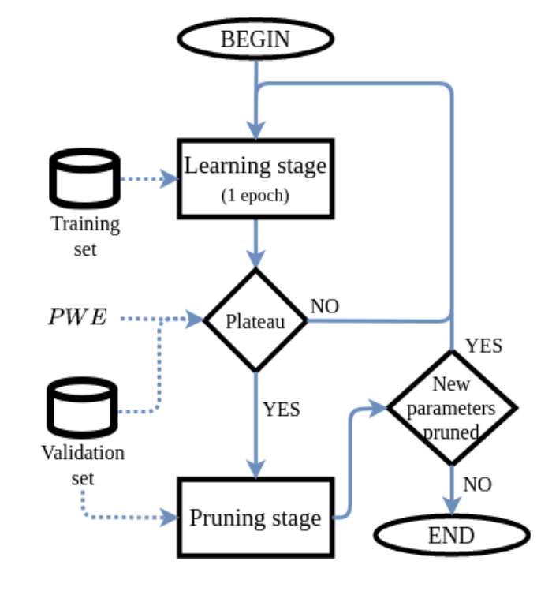

# Neural networks and Deep learning - Parte VIII

## Pruning

### Deep networks

- **Deep networks**:
    - Features of deep networks:
        - High number of hidden networks.
        - Parameters number is a proxy of complexity, but it's not its only source.
    - Methods to both boost perform and make ANN robust to noise are needed.
    - Recent trends in ANNs:
        - **Handcrafted** (`eg` VGG, ResNet).
        - **Efficient hand-crafted** (`eg` Inception).
            - Variation of handcrafted models with variations to make them more efficient.
        - **Neural-architecture search**.
            - A technique for automating the design of ANN.
            - Learning the architecture is adding one layer of complexity.
            - Other optimization metrics (`eg` best accuracy while minimizing number of parameters). 
        - **Hardware-aware Neural-architecture search**.
            - In the optimization phase, the hardware is considered.
            - Information from the HW after a deploy of the model is collected.
                - Information like memory footprint, latency, energy consumption, etc.
                - And then this information is incorporated in the model.
            - A new optimization phase is launched after the information has been integrated.

#### Deep models outside the datacenters

- **Deep models outside the datacenters**:
    - Communication has a cost, to have computation *on the edge* is desirable.
    - Mobiles phones, DL accelerators, FPGAs have little memory.
    - Methods: quantization (avoid FP-unit), knowledge distillation, pruning.
        - `eg` $8$-bit quantization bit is good enough for most image classification.
        - **Knowledge distillation**:
            - A large *teacher* model and a shallow *student* model.
            - The *teacher* has learnt input-output mapping.
            - This knowledge is tried to be distilled in the *student*.
            - *Issue*: how *shallow* the model should be is not known to store this mapping.

### Pruning

- **Pruning**:
    - **Sparsification**: to take some model parameters and set them to $0$.
    - **Pruning**: removing parameters or entire units from the DL model.
        - Pruning relates with sparsification.
            - The weight matrix (representing a layer) becomes sparse.
            - Removed units are set to $0$, introducing nonetheless some representation overhead.
    - Advantages:
        - The number of parameters is reduced (for special design like ASICs the gain is real).
            - Modern GPUs implement functions to completely avoid operations involving zeros.
        - If they are removed in a *structured* way (entire blocks), there is no representation overhead.
            - The gain is real even in general frameworks.
    - Pruning is also biological plausible.
        - The peak synaptical connectivity is at $7$ years of age, then the neuronal density decrease.

#### Traditional pruning methods

- **Traditional pruning methods**:
    - Limits:
        - Computationally extremely expensive.
        - They do not work so well in multi-layer architectures.
        - Slow (a lot of iterations to converge).

##### Skeletonization

- **Skeletonization** [Mozer & Smolensky, 1988]:
    - Motivation: computing was extremely expensive at the time.
    - Principal idea:
        - Iteratively train the network to a certain performance criterion (until convergence).
        - Compute a measure of relevance: $\rho_i = E_{without \: unit i} - E_{with \: unit \: i}$.
            - A single unit $i$ is removed and the error is computed without it.
            - If $\rho_i$ is very high, the unit $i$ is fundamental to mode performance.
        - Trim the least relevant units (once they are ranked).
    - This scheme is the most common in several pruning approaches.

##### Optimal brain damage

- **Optimal brain damage** [Le Cun et al., 1989]:
    - Use of **second-order derivative information** to find a trade-off between **complexity** and **training error**.
        - Going therefore beyond gradient.
    - The focus here switches from units to **single parameters**.
    - MSE is used (CrossEntropy was not popular at the time).
    - Principal idea: $\delta E = \sum_i g_i \delta u_i + \frac{1}{2} h_{ii} \delta u_i^2 + \frac{1}{2} \sum_{i \neq j} h_{ij} \delta u_i \delta u_j + O(\| \delta U \|^3)$.
        - With $g_i = \frac{\partial E}{\partial u_i}$ the gradient and $h_{ij} = \frac{\partial^2 E}{\partial u_i \partial u_j}$ the Hessian.
        - Let the error function being approximated through Taylor expansion.
        - A perturbation over the parameter vector ($\delta U$) will produce a perturbation on the error.
        - Goal: to find the largest subset of parameters whose pruning will cause the least increase of $E$.
        - **Intractable** in this form (`eg` for 2.6K parameters network, the Hessian would be $6.5 \times 10^6$).
    - $\delta E = \frac{1}{2} \sum_i h_{ii} \delta u_i^2$ ($h_{ii} \delta u_i^2$ is the **neuron saliency**).
        - To approximate a result, the **diagonal** is used.
        - Deleting one parameter will not cause impact on the others (in general not true).
        - Assumption: the model has been already trained and a local minimum is found.
            - Therefore the gradient term of the error should be closed to zero (ignorable).
        - All the $h_{ii}$ are non-negative (hence every perturbation will cause the error to go up or stay the same).
        - Estimating the diagonal of deviation nowadays can be done with the two back propagation passes.
            - It increases the complexity but acceptably.
    - Algorithm:
        - Choose a reasonable network architecture.
        - Train the network unit a reasonable solution is obtained (train until convergence).
        - Compute the second derivatives $h_u$ for each parameters.
        - Compute the saliencies for each parameter.
        - Sort the parameters by saliency and delete some low-saliency parameters (*thresholding*).
        - Iterate to training step.
            - First work to propose **retraining**.
            - The number of parameters to be pruned is not known in advance.
    - With retraining the MSE remains small even with fewer parameters (bigger pruning).
        - Without retraining, the MSE grows with fewer parameters.

#### Newer pruning methods

- **Newer pruning methods**:
    - A revival of pruning methods developed after 2015.
        - The number of parameters of modern architectures became huge.
    - A *slow process* of parameters pruning is still used as traditionally was.

##### Learning both weights and connections

- **Learning both weights and connections** [Han et al., 2015]:
    - **Magnitude pruning** (previously proposed). 
        - Simpler idea than from the past.
        - If a parameter has a very small value (its **magnitude**), it is pruned from the network.
        - No concept of saliency or other estimator.
            - But the model is **regularized**.
    - Principal idea:
        - Parameters are randomly initialized (nowadays, pre-trained models are used).
        - **Training stage**: parameters are updated then trained with standard GD until performance is achieved.
        - **Parameter sparsification**: parameters below $T$ (hyperparameter) are removed, pruning connections.
            - Drop-out stochastically disable entire units, but they don't disappear from the net.
                - The underline parameter is still in the model.
            - In parameter sparsification, the parameter is **permanently removed** after training.
        - **Neuron sparsification**: neurons without input arcs input are pruned from the network.
            - This can led to a degradation in network performance.
        - **Fine-tuning**: fine-tune the model, recovering the performance and iteratively prune again.
            - Called also re-training (by LeCun) or regularization.
    - Assumption: parameters having low magnitude are also **less important**.
        - A regularization function that is trying to push as much as possible value of the parameters of the NN as close as possible to $0$ is desirable.
    - **Regularization**:
        - From optimization theory, LASSO (L1) is the most common choice.
        - L0 is non-differentiable (there are proxies).
        - Empirically, **L2 regularization** leads to **sparser models** (under same performance constraints).
            - Fine-tuning is the key.
            - **L2 regularization with iterative prune and retrain** works better than other variants.
                - Parameters used to store *noise* are pruned away.
                - Pruning help in the **signal-to-noise** ratio.
                - It maximizes the storage capacity of the network.
                - L2 is very cheap to implement inside an optimizer.
    - Unstructured pruning can also unveil some structure of input data (even in deeper architectures).
    - Network pruning can save $9 \times$ to $13 \times$ parameters with no drop in predictive performance.
    - In order to prune the network, **various re-training** are needed (**extremely expensive**).
        - *Goal*: reach the highest sparsity with no task-related performance degradation.
            - The most effective approaches are also the ones **more computationally intensive**.
            - One-shot (or few-shot) pruning approaches are in general worse.
                - One-shot pruning: trained $\to$ prune $\to$ fine-tune and then stop.
                - Not as effective as re-training approach.
        - New challenge: achieve sparsity with less computation at training time.

##### Lottery ticket hypothesis

>A randomly-initialized, dense neural network contains a **sub-network** that is initialized such that, **when trained in isolation**, it can **match the test accuracy** of the original network after training for at most the same number of iterations.

- **Lottery ticket hypothesis** [Frankle & Carbin, 2019]:
    - **Pruning at initialization** (even before training).
    - The sub-network exists already at initialization.
        - If it can be found, a lot of computation can be saved.
            - Computation for training the model (less parameters to train).
            - Computation for pruning (no iterative pruning anymore, just pruning at initialization, **zero-shot pruning**).
    - **Identification of *lottery winners***:
        - A dense architecture is taken and training and following pruning is performed.
            - **Rewind process**: just the parameters which have not been pruned will be rolled-back to the value they had at initialization (before training).
        - A smaller model is obtained, onto which the training is performed.
            - The **same performance** is obtained training the model with **less parameters**.
        - But the transition from **dense to small model** shouldn't need **full training information**.
    - So there are parameters *winning at the lottery of initialization* in deep models.
        - It is possible to successfully train a model from the initialization phase.
        - Removing the largest part of the parameters and **training just the remaining fraction**.
    - In This work, just the **existence of lottery winners** has been shown.
        - How to identify them at initialization (or in the first learning stages) was not proposed.
    - Several methods for pruning models at initialization were then proposed.

##### Rigging the lottery

- **Rigging the lottery: making all tickets winners** [Evci et al., 2019]:
    - Principal idea:
        - Start from a random, sparse configuration of the model.
        - Then, some connections can be either chopped (pruning) or re-instated (**growing**).
    - **Pruning during training**.
        - Instead of waiting to reach convergence.
        - Pruning is performed during a certain amount of iterations (`eg` after every epoch).
        - The network therefore became sparser and sparser.
    - But maybe a parameter has low magnitude at training just because convergence is not reached.
        - No certainty that only *useless* parameters has been removed.
    - Instead of only removing some parameters (**drop**), some parameters are **reintroduced** (**growing**).
        - **Growing**: connections are created in a sparse model.
        - *Proposal*: grow connection based on the **gradient** of the units.
            - A high gradient for a missing parameter is a signal to reintroduce the parameter.
            - An iterative scheme that is locally reducing the parameters number and that might converge.
    - **Massive disoptimalities**:
        - Tremendously sensitive to hyper-parameters choice (`eg` pruning or growing rate at each iteration, etc).
        - Tremendously sensitive to dataset, architecture, etc.
    - First try at solving the lottery ticket problem, but not an effective on.

##### SNIP

- **SNIP** [Lee et al., 2019]:
    - *SNIP: Single-shot network pruning based on connection sensitivity*.
    - **Prune just-once**, instead of running an iterative algorithm involving regularization+pruning.
    - A randomly initialized network (not even trained) is considered:
        - The **gradient** is computed for each parameters (like *gradient accumulation*).
        - *Assumption*: if the gradient is low at initialization, the parameter will not evolve much during training.
        - These parameters can be removed from the network.
            - The ranking of parameters to remove is not magnitude-based, but **sensitivity-based**.
        - This is performed right after initialization, hence the main direction of the gradient is preserved.
    - Similar to *Optimal Brain Damage* (but with gradient instead of second derivatives).
        - In OBD: the network is converged $\implies$ the gradient is $\approx 0 \to$ second order information is needed.
        - In SNIP: since not at convergence, gradient information is enough.
            - Loss variation is assumed constant during training (*bold assumption*).
    - Pruning at initialization using a **gradient informing the strategies** could have been a good choice to reduce the complexity.
        - This is true for MNIST, but for bigger datasets the reality is different.
    - Iterative approach are generally better than zero or few-shot approaches.

##### Lottery winners identification

- **Lottery winners identification**:
    - To identify winners at initialization time is not feasible [Frankle et al, 2020 2021]:
        - Few **iterations of warm-up** is needed.
            - `eg` 2K for ResNet-20 on CIFAR-10, $8$ out of $90$ epochs for ImageNet).
            - Before there are huge (but decreasing) gradients and rapid motions in weight space.
        - Without warm-up, all lottery winners found are *unstable*.
        - This *resizes* the original lottery winner hypothesis.
    - NN are initialized to maximize FP and BP signal, to find the local minimum as fast as possible.
        - Adam optimizer is typically used to converge quickly.
        - SDG is typically used for robustness.

#### Structured and unstructured sparsity

- **Structured and unstructured sparsity**:
    - Unstructured sparsification focuses on the connection.
        - Pruning connections.
        - Each neuron is still part of the network (possible bottleneck).
    - Structured sparsification focuses on the neurons.
        - Pruning neurons.
        - Pruned neurons can be ignored.
    - Testing on embedded devices.
        - Compression with NN (`eg` MPEG-7):
            - Pruning $\to$ simplification $\to$ entropy coding $\to$ bit stream $\to$ decompression.
    - Unstructured strategies prune way more parameters than the structured counterpart.
        - `eg` Even with $99\%$ reduction in parameters, the memory footprint can goes from 47MB to 39MB.
            - Even with entropy coding, the memory footprint saving is not much.
        - While structured approach, the parameter reduction is less but the memory footprint saving is bigger.
    - There are hybrid approaches that uses both structured and unstructured sparsity.

#### Pruning and GPUs

- **Pruning and GPUs**:
    - With parallel computation, the bottleneck is in either caching or the critical path (maximum model's path).
        - If caching is sufficiently fast, the bottleneck is the critical path.
    - The possibility of pruning entire layers must be established.

##### Layer collapse

- **Layer collapse**:
    - When a specific layer in a NN fails to effectively differentiate the input features.
        - Causing all outputs from the layer to converge to similar or identical values regardless of input.
        - Seen as a downside of poor initialization or hyper-parameter fine-tuning (i.e. the model does not learn).
        - But if the model learns while some layers are collapsed, the computation of this layers can be **skipped**.
    - Layer collapse **without skip connections**:
        - One way to reduce model's depth is to **remove non-linearities**.
            - Layer fold is one approach parametrizing the negative slope of a PReLU.
                - $\alpha$ is a parameter: when $\alpha = 0 \to$ ReLU, when $\alpha = 1 \to$ identify activation.
                - With an identity activation, the layer is successfully **linearized**.
    - With fully-connected layers:
        - The solution is straight-forward using simple linear algebra.
    - With convolutional layers (stride $=1$, no padding):
        - The solution is straight-forward using simple linear algebra.
    - With convolutional layers (stride $=1$, with padding $=1$):
        - Up to 2024, no closed-form solutions has been found.
        - Most architectures using skip connections make use of padding to maintain same dimensionality of the output.
