# Theory

## Introduction

### Parallel and distributed computing

- **Concurrency** means *competition* but also *cooperation*.
    - Both entails **coordination** (overheads which can elide performance gains).
- Distributed and parallel computing are two similar but distinct implementations of concurrency.
    - Parallel computing is related to **closed systems**.
        - Focus on **performance**.
        - Way less resilient to faults.
    - While distributed computing is related to **open systems**.
        - Focus on **robustness**, **correctness**, **precision**.
- *Fermi problem*: «which is the number of piano tuners in Chicago?».
    - Make reasonable assumptions and then derive information from them.
    - Latency is what matter, not only mere bandwidth.
- Not every problem is worth to be parallelized (`eg` sum).

-----

### Parallel computing

>**Parallel computing**: the practice of using multiple processors in parallel to solve problems more quickly than with a single processor.

- Identifying and exposing parallelism in algorithms and software systems.
- Understanding the costs, benefits and limitations of a given parallel implementation.
- `eg` Examples of parallel machines:
    - *Compute cluster*: multiple indipendent computers connected with high-speed networks.
    - *Symmetric Multi-Processor* (SMP): multiple processor chips connected to a shared memory hierarchy.
    - *Chip Multi-Processor* (CMP): multiple compute unites (*cores*) contained on a single chip.
- Applications:
    - Weather forecasting (days to months) and Climates simulation (years to decades).
    - Computational chemistry and bioinformatics. 
    - Material sciences.
    - Computational fluid dynamics and aerodynamics, etc.
- Historically, the motivation for parallel computing was to **improve performance**.
    - Mostly used in computational science and engineering for simulation (but also AI nowadays).
    - Mainly for problems too large to be solved on a single computer.
- The shift to CMP has certified the end of the so-called *Free Lunch Era*.

#### Recent trends in parallel computing

- *Big Data Analytics* (BDA).
    - Very large datasets (terabyte, petabyte, exabyte).
    - Real-time Data Analytics/Data Stream Processing (`eg` high-frequency financial trading).
    - Single multicore server cannot provide enough performance.
- *HPC and/for AI*:
    - Massive use of powerful GPUs.
    - HPC environments provide optimized framework for AI (`eg` TensorFlow, PyThorch, etc).
    - LINPACK (linear system resolution) used as a benchmark.
        - Top500: supercomputers ranked according to their maximally achieved LINKPACK performance.
        - Green500: supercomputers ranked according to FLOP/s-per-watt of achieved LINKPACK performance.
        - Soon *AI500*, but most of AI software don't use double 64-bit precision.

#### Moore's law

>The transistor density of semiconductor chips would double roughly every 18 months.

- Stated by Gordon Moore (co-founder of Intel) in 1965.
- It is possible to integrate on a single chip more and more transistors with technological improvements.
- Over the years, microprocessor chips have become smaller, denser, and more powerful.
- Causes of processor becoming faster:
    - Smaller and faster transistor.
    - Better microarchitecure, thus more instruction per clock cycles (i.e. more HW parallelism).
    - Fewer gate delays per cycle, thus higher clock frequency.
    - Larger integrated caches to reduce the so-called Von Neumann bottleneck.
        - `!` Caches should be hidden (*caché*) but their usage should be evaluated explicitly.
        - **Memory wall**: the growing disparity of speed between CPU and the RAM latency.
    - SIMD instructions (instruction-level parallelism, ILP).

##### Limits of single-chip

- Primary limit related to packing more and more transistor is **speed of light** and **power density**.
- **Dennard scaling law**: power density is constant as transistors got smaller (1974).
    - True for almost 30 years.
    - It ended in 2004-2005, not because transistors didn't continued to get smaller.
        - But for power issues (the so-called **power wall**).

#### Moving to multicore

- In early 2000s, processor manufacturers started to put many processing cores on a chip.
- Each generation of Moore's Law potentially increases (doubles) the number of cores.
- **Use explicit parallelism to reduce power consumption**:
    - $Power_{dynamic} \approx \frac{1}{2} \times C \times V^2 \times F$ and $Perf = Ncores \times F$.
        - $V$ for voltage, $C$ for capacitance and $F$ for clock frequency.
        - But $V \approx F$ therefore $Power_{dynamic} \approx C \times V^3$.
    - Doubling $Ncores$ means doubling $Perf$ but also $Power$.
    - Doubling $Ncores$ and halving $V$ and $F$ means $Perf$ is the same.
        - But the **power** is **reduced by a factor of four**.
- But CMP is not a silver bullet.
    - Multicore performance is now a programmer's burden.

##### CMP trends

- Processor manufacturers put multiple cores on one chip.
- Frequency stopped increasing.
- Moore's law is still valid if we account the number of cores.
- Large cache units integrated within the chip.
- Single thread performance is increasing slowly.
- **Heterogeneous Multicore**:
    - Different types of processor cores (CPU, GPU, DSP) on a single chip (asymmetry).
    - Power efficiency: assign different workloads appropriate core type.
    - Specialization: leveraging specific cores to maximize system performance.
- But **optimizing performance is hard**.
    - Some cores may be more distant to internal memory blocks than others.
    - Several levels of caches (private and shared).

-----

### Case study: Matrix multiplication

- Used both in training and in inference for AI applications.
- `def` **Matrix multiplication**: $c_{ij} = \sum_{k=1}^n a_{ij} b_{kj}$.
    - Assume for simplicity that $n = 2^k$.
- Executed On a $836$ GFLOPS machine.

#### Algorithm execution (sequential)

- **Algorithm #1**: nested loops in Python.
    - With $n = 4096 = 2^{12}$.
    - Running time: $21042$ seconds $\approx 6$ hours.
    - Back-of-the-envelope calculation:
        - $2n^3 = 2(2^{12})^3 = 2^{37}$ FLOP.
        - $2^{37} / 21042 \approx 6.25$ MFLOPS.
        - Peak: $836$ GFLOPS.
        - **Efficiency**: $\approx 0.00075\%$ of peak.
- **Algorithm #2**: nested loops in Java.
    - Running time: $2738$ seconds $\approx 46$ minutes.
        - $\approx 8.8 \times$ faster than Python.
    - Efficiency: $0.007\%$ of peak.
- **Algorithm #3**: nested loops in C.
    - Running time: $1156$ seconds $\approx 19$ minutes.
        - $\approx 2 \times$ faster than Java and $\approx 18 \times$ faster than Python.
    - Efficiency: $0.014\%$ of peak.
- **Interpreters are versatile, but slow**.
    - JIT compilers cannot take advantage of optimization (while normal compiler can).

##### Optimization: loop order

```c
// Original code
for (int i = 0; i < n; i++)
    for (int j = 0; j < n; j++)
        for (int k = 0; k < n; k++)
            C[i][j] += A[i][k] * B[k][j];
```

- In this algorithm, the order of loops can be changed without affecting its correctness.
    - Experimentally $i, k, j$ is shown to be faster by a factor of $18$.
- This is due to **hardware caches**.
    - Each processor reads and writes main memory in contiguous block (**cache lines**).
    - **Cache hits**: access to data in caches (fast).
    - **Cache misses**: access to data not in caches (slow).
    - $t_a = p_{hit} t_{L1} + (1 - p_{hit}) t_{L2}$.
        - Caches must be evaluated as a pair.
    - **Hit probability** ($p_{hit}$):
        - **Locality**: temporal or spatial.
            - **Spatial locality**: if a software access the address $i$, probably it will access addresses nearby $i$.
            - **Temporal locality**: if a software access the address $i$, it will access same location over a short period of time.
        - Hit probability is determined by CCC: compulsory, capacity, conflict.
            - **Compulsory miss**: item has never been in the cache. 
            - **Capacity miss**: item has been in the cache, but space was tight and it was forced out. 
            - **Conflict miss**: item was in the cache, but the cache was not associative enough, so it was forced out. 
    - To perform well, an algorithm should take advantage of both spatial and temporal locality. 
- In the matrix-multiplication code, matrices are laid out in memory in **row-major order**.
    - `eg` Fortran uses **colon-major order**.
- With $i, j, k$ order as **access pattern**:
    - $C$ has excellent spatial locality.
    - $A$ has good spatial locality.
    - $B$ has poor spatial locality.
        - $k$ (the faster index) works on rows.
        - $k$ and $k+1$ elements are $4096$ elements apart (in different memory rows).
- Running times:
    - $i, k, j$: $1158$ seconds.
    - $i, k, j$: $178$ seconds.
    - $j, k, i$: $3057$ seconds.
- `valgrind` can measure the effect of different access patterns.
    - `eg` `valgrind --tool=cachegrind ./mm`.
- **Algorithm #4**: nested loops in C $+$ interchange loops.
    - Running time: $178$ seconds.
    - Efficiency: $0.093\%$ of peak.

##### Optimization: compiler optimization

- Clang provides a collection of optimization switches.
    - `-O0`: to explicitly specify to not optimize.
    - Running times:
        - `-O1`: $66$ seconds.
        - `-O2`: $55$ seconds.
        - `-O3`: $56$ seconds.
    - It also supports optimization levels for special purposes.
        - `-Os`: limit code size.
        - `-Og`: for debugging purposes.
- **Algorithm #5**: nested loops in C $+$ interchange loops $+$ optimization flags.
    - Running time: $55$ seconds.
    - Efficiency: $0.301\%$ of peak.

#### Algorithm execution (parallel)

```c
// Parallel code using cilk
cilk_for (int i = 0; i < n; i++)
    for (int k = 0; k < n; k++)
        for (int j = 0; j < n; j++)
            C[i][j] += A[i][k] * B[k][j];
```

- `cilk` is used to parallelize the code.
- Running times:
    - Parallel $i$ loop: $3$ seconds.
    - Parallel $j$ loop: $532$ seconds.
    - Parallel $i$ and $j$ loop: $11$ seconds.
-  `!` **Parallelize outer loops** rather than inner loops (*rule of thumb*).
    - Parallelizing $i$: $4096$ parallel tasks of duration $2^{24} \: t$.
        - Max parallelism: $4096$ (suboptimal with a machine with more than $4096$ cores).
    - Parallelizing $j$: $2^{24}$ iterations of $4096$ parallel tasks of duration $1 \: t$.
        - Synchronization time is huge.
    - Therefore parallelizing $i$ is a better choice even though its *size* is *wider*.
- $\frac{T_s}{T_p(n)} \leq n$, with $T_s$ sequential time, $T_P(n)$ parallel time with $n$ cores.
    - Therefore with a machine with $N$ cores, the max speed up is $Nx$ (upper bound).
    - **(Sub-)Linear enhancement on the problem** (exponential with quantum computers).
- **Algorithm #6**: parallel loops in C ($+$ above optimizations).
    - Running time: $3.04$ seconds.
    - Efficiency: $5.408\%$ of peak.

##### Optimization: data reuse

```c
// Parallel code using cilk and data reuse
cilk_for (int ih = 0; ih < n; ih += s)
    cilk_for (int jh = 0; jh < n; jh += s)
        for (int kh = 0; kh < n; kh += s)
            for (int il = 0; il < s; ++il)
                for (int kl = 0; kl < s; ++kl)
                    for (int jl = 0; jl < s; ++jl)
                        cl[ih+il][jh+jl] += A[ih+il][kh+kl] * B[kh+kl][jh+jl]
```

- Restructure the computation to **reuse data in the cache** as much as possible.
- Number of memory access must the looping code perform to fully compute $1$ row $C$:
    - $4096 * 1 = 4096$ writes to $C$.
    - $4096 * 1 = 4096$ reads from $A$.
    - $4096 * 4096 = 16777216$ reads from $B$.
    - Total: $16785408$ memory access.
- Computing a $64 \times 64$ **block** of $C$:
    - $64 * 64 = 4096$ writes to $C$.
    - $64 * 4096 = 262144$ reads from $A$.
    - $4096 * 64 = 262144$ reads from $B$.
    - Total: $528384$ memory access.
- Iterative (parametrized) trials to compute **best tile size** ($s$).
    - Tile size $=16$: $2.49$ seconds.
    - Tile size $=32$: $1.74$ seconds (best).
    - Tile size $=64$: $2.33$ seconds.
- **Algorithm #7**: parallel loops in C $+$ tiling($+$ above optimizations).
    - Running time: $1.79$ second.
    - Efficiency: $9.184\%$ of peak.
    - With $62\%$ fewer cache references and $68\%$ fewer cache misses.

#### Algorithm execution (parallel divide-and-conquer)

- **Multicore cache hierarchy**:
    - L2 and L1 are private cache levels, while L3 is shared.
    - **Tiling for a Two-level cache**:
        - What is needed is a larger block to fit in L2 and a smaller one to fit in L1. 
        - Multidimensional tuning optimization cannot be done with binary search.
- **Recursive matrix multiplication**:
    - Tile for **every** power of $2$ simultaneously.
- **Algorithm #8**: parallel divide-and-conquer in C.
    - Running time: $1.30$ second.
    - Efficiency: $12.646\%$ of peak.

##### Optimization: vector hardware

- Modern processors incorporate **vector hardware**.
    - Used to process data in **single-instruction stream, multiple-data stream** (**SIMD**).
        - Each vector register holds multiple words of data.
        - Parallel vector lanes operate synchronously on the words in a vector register. 
    - Those vector processors are also called *multimedia extensions*, since they're used for audio-video codec.
- Compilers doesn't emit vector hardware, so assembly instruction flags must be specified in the (library) code.
    - But those flags are **family-processor specific** (not general at all).
- Clang uses vector instruction automatically when compiling at optimization level `-O2` or higher.
    - Many machines don't support the newest set of vector instructions.
    - Therefore the compiler uses vector instructions conservatively by default.
    - Programmers can specify explicit **vectorization flags** at compile times (`eg` `-mavx2`).
- **Algorithm #9**: parallel divide-and-conquer in C $+$ compiler vectorization.
    - Running time: $0.70$ second.
    - Efficiency: $23.486\%$ of peak.

##### Optimization: AVX intrinsic instructions

- Intel provides **intrinsic instructions** that provide direct access to hardware vector operations.
- **Algorithm #10**: parallel divide-and-conquer in C $+$ compiler vectorization $+$ AVX intrinsics.
    - Running time: $0.39$ second.
    - Efficiency: $41.677\%$ of peak.
    - **Similar performance** with professionally engineered **math kernel library**.
        - Intel MLK has running time $0.41$ seconds with efficiency equals to $40.098\%$ of peak.

-----

### Workload manager

#### Supercomputers

- With sparse data, GPU are not useful.
    - For AI, data are most of the time dense.
- Nowadays supercomputers are used for AI for **inference** and **simulation**.
    - *Sunway*: chinese brain-scale supercomputer ($174T$ parameters).
    - **Compute divide**: academia (and small enterprise) cannot keep up with private sector.
- Access to a HPC machine:
    - Access via SSH.
    - **Login nodes** (most of the times) can access Internet, while **compute nodes** can't.
- **Managing the resources of a supercomputers** is not trivial.
    - Resource (or workload) management systems are required.
    - There are two main workload managers: SLURM and PBS.
    - The nodes of a cluster are divided into login (entry) nodes and computational nodes.
    - **Batch execution** (using queues) and not **on-demand execution**.
        - Batch systems billings are credit-based (hours), and not resource-based.

#### Resource Management Systems

- They mainly perform three functions:
    - Resource allocation.
    - Manage the schedule.
        - Different types of queues (debugging, production, etc) with different costs and sizes.
    - Distribute the total workload and monitoring.
        - **Fairness** must be ensured between all users (also for **efficiency**).

##### SLURM and PBS

- **SLURM**:
    - *Simple Linux Utility for Resource Management* (2001).
    - Computational nodes are subdivided into partitions.
        - Partitions can be configured in different ways.
            - `ex` `qgpu`, `qgpu_big`, `qfat` (huge memory, useful for LLM), `qviz` (visualization), etc.
    - It assigns the available nodes of a partition to the submission with the **highest priority**.
    - Two policies for scheduling: **backfilling** and **priority queue**.
        - **Backfill algorithm**:
            - Attempts to schedule low priority jobs if they do not prevent higher priority jobs from starting properly.
            - *Disadvantage*: jobs duration must be specified.
                - There is a default max time (for fairness) is $24$ or $48$ hours.
                - **Checkpointing** (saving context before expiration) is up to the user.
        - **Priority queue**:
            - Uses a global queue, ordered according to a certain priority assigned to each jobs.
            - SLURM decides how to allocate resources to the job at the top.
            - *Disadvantage*: it can cause SLURM blocking when there are not enough resources.
    - Main SLURM commands: `srun`, `sbatch`, `salloc`, `squeue`, `scancel`, `scontrol`.
- **PBS**:
    - *Portable batch system* (1991).
    - Originally developed by NASA.
    - Main PBS commands: `qsub`, `qstat`, `qdel`, `select`.

##### Dependencies

- Usually, user applications have to be compiled before being executed on the calculation nodes.
    - Traditionally, different versions of compilers and libraries are provided by **module files**.
    - `module` can be used to switch to different versions of the same software.
    - But dependencies management is still up to the user.
- **Spack**: package manager for supercomputers.
    - Use Spack from the compute node needed.
    - Spack **compiles the dependency** (and its dependencies) on the machine (no pre-compiled binaries).
        - Compiling is useful in order to take advantage of **hardware optimizations**.
    - With different software versions, architectures and compilers can be specified.
- Dependencies not on package managers must be **manually compiled**.
    - But manual compilation which take advantage of HW optimization is not trivial.
- Cloud technologies (`eg` Docker) are not fully integrated in HPC.
    - HW optimizations are essential in HPC, while in clouds are not.
    - Nowadays, a Cloud section are coupled with the HPC part.

\newpage

## Parallel architectures

### Classifying parallel architectures

- Two significant aspects characterize parallel architectures:
    - The system architecture of the **single node**.
    - The interconnection network connecting multiple nodes forming the **parallel system**.
- No simple and definite classification of parallel machines.
- Broadly speaking, parallel architectures can be classified using:
    - Flynn's taxonomy.
    - Considering the memory organization and also the core count.
    - Considering the interconnections among PEs and memory module.

#### Flynn's Taxonomy (1966)

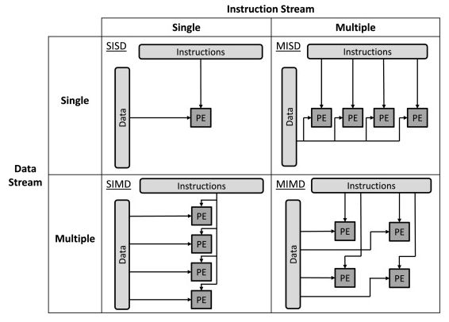{height=6cm}

- **Single Instruction, Single Data** (SISD).
    - Traditional von Neumann architecture.
    - A single processing element (PE) operates in a single stream of data.
    - Serial (non-parallel) computer.
- **Single Instruction, Multiple Data** (SIMD).
    - Performs the same operation on multiple data items simultaneously.
    - If statements to cover specific cases are not allowed.
    - All PEs execute the same instruction at any given clock cycle on different set of data.
        - The execution is synchronous (lockstep execution).
    - Two types of parallel machines: vector processors and array processors.
- **Multiple Instruction, Single Data** (MISD).
    - Uses multiple PEs to execute different instructions on a single stream of data.
    - Included for exhaustivity (for symmetry), but materially not feasible.
- **Multiple Instruction, Multiple Data** (MIMD).
    - Uses multiple PEs to execute different instructions on different data streams.
    - Classical multi-core where each core is dedicated to a specific program.
    - Most commonly used parallel architectures.
    - Can be further classified considering memory organization and interconnection topologies.

#### Classification based on the core counts

- Considering the number of cores in general-purpose machines:
    - $O(10^1 \div 10^2)$ cores for a single multiprocessor chip (CMP).
    - $O(10^2 \div 10^3)$ cores for a Shared memory tightly-coupled multiprocessor.
    - $O(10^3 \div 10^5)$ cores for distributed memory loosely-coupled systems.
    - $O(10^5 \div 10^6)$ cores for top supercomputers.
        - Current supercomputers are mostly GPU-based, but one GPU core $\neq$ one CPU core.

#### Classification based on the memory system

##### Shared memory architectures (multiprocessors)

- It is not a physically unique memory, but it's its **address space** that is shared between PEs.
- *Multicore* if on the same chip, *multiprocessor* if on different chips (nowadays both).
- Parallel architecture comprising a (modest) number of cores.
    - All with direct hardware access to a **shared memory space** (SMH).
        - SHM accessible through an interconnection network (`eg` shared bus, crossbar switch, fat tree, etc).
        - In CMP, all cores share the main memory.
    - Interconnection network between all nodes and the shared memory.
    - In addition to the SHM, each core contains a smaller local memory (`eg` L-1 cache).
        - Local memory needed to reduce expensive access to main memory (**von Neumann Bottleneck**).
        - Modern CMPs have two or three levels of cache (some private, some shared).
- The memory organization of shared memory architectures can be:
    - **Uniform** (*UMA*, *Uniform Memory Access*).
        - Symmetric Multiprocessor (SMP).
    - **Non-uniform** (*NUMA*, *Non-Uniform Memory Access*).
        - Memory access time is asymmetric.
        - In NUMA multiprocessors the memory is still shared among PEs, but it is physically distributed.
- The emphasis is primarily on the **memory organization** (memory hierarchy, processor-memory interconnections).
    - The aim is to minimize contention and reduce the von Neumann bottleneck.
    - Some critical aspects: **cache-coherence**, **memory consistency**, thread synchronization.
        - **Memory consistency** defines the behavior of loads and stores to different addresses in a parallel system.
            - It deals with when writes to $X$ propagate to other processors.
            - Arm and Intel differ (substantially) by chosen memory model (*weak* and *strong*).
        - **Cache-coherences**: the uniformity of shared resource data that ends up stored in multiple local caches.
            - CC can be treated on hardware.
                - CC hardware protocol need to be as fast as cache, not as the memory.
            - CC is costly out-of-socket.
                - Therefore a machine with more sockets will result in slower cores.
                - Current maximum: $8$ sockets supported.
                - Intel lists the number of socket for CC as *Scalability* for its processor.
        - Two fundamental components: **message passing** and **synchronization**.

##### Distributed memory architectures (multicomputers)

- Different PEs don't share the same address space.
    - Inherently NUMA, the address space of nodes is **disjoint**.
- Each **node** is a complete computer system (nowadays a CMP).
    - Interconnection network between all nodes (with memory dedicated to each node).
    - Process on different nodes communicate explicitly by sending **messages** across network.
- Depending on the network (and other aspects), distributed systems can be further classified.
    - Clusters, cloud, geographically distributed systems, pervasive infrastructures, etc.
    - **Computer clusters**: systems with high-performance network topologies and homogeneous nodes.
    - Network topologies: mesh, fat tree, dragonfly, etc.
- `eg` *Stencil computation* (application running on a distributed memory system):
    - Distributed memory partitioning of an $8 \times 8$ matrix onto for processes.
    - $P0$, $P1$, $P2$ and $P3$ run on 4 nodes, for the implementation of a $5$-point stencil code.
    - Access to the neighboring cells require sending and receiving data between pairs of processes.
        - Communication is composed using explicit messages.
- The emphasis is primarily on the **interconnection network topology**.
    - The aim is to reduce communication costs (reducing latency, increasing available bandwidth).
        - Communications among nodes is a form of IO for the single node.
    - Some critical aspects: fast messaging protocols/libraries, message routing.

##### Programming parallel architectures

- SHM: exploiting the physical shared memory through **thread-level parallelism**.
    - Reference model: **shared variables programming model** (`eg` Pthread, OpenMP).
    - Distinct processes on the same node (with disjoint address space) can communicate via shared memory buffers (`eg` POSIX SHM, Sys V).
- DM: exploiting parallelism through **process-level parallelism**.
    - Reference model: **message passing programming model** (`eg` POSIX socket, MPI).
    - Attempts to provide a shared-memory abstraction atop distributed-memory were tried (but not scalable).

##### Shared vs Distributed memory systems

- Distributed memory systems are more scalable, more costly and less energy efficient.
    - A modern high-end CMP node has more computing power than a supercomputer of 10 years ago.
- SHM systems are way easier to program.
    - But SHM should be programmed carefully too.
        - `eg` *Hotspot*, when $n$ cores want to access the same memory cell.
- From the standpoint of the runtime system programmer:
    - For SMH:
        - The physical shared memory can be used for fast synchronization and communication between processes/threads.
        - However, **efficient management** of **locking** and **synchronization** is generally a critical point.
    - For DM:
        - The most important aspect is to reduce as much as possible the **cost of communications** (i.e. I/O).
        - Overlapping of I/O and computation, reducing memory I/O copies, using fast messaging protocols.

\newpage

## Shared memory architectures

- In early computers timings for accessing main memory and for computation were reasonably well balanced.
    - But during the past few decades, **computing speed** grew much faster than main **memory access speed**.
    - **Von Neumann Bottleneck**: the discrepancy between CPU compute speed and main memory (DRAM) speed.
        - Modern CMPs are not linear in precision.
            - `eg` For Nvidia H100: $34$ TFPLOS for FP64, $67$ TFPLOS for FP32, $\approx 1000$ TFLOPS for TF32.
- CPU typically contain a **hierarchy** of two or three levels of **cache**.

-----

### Caches

- Caches have higher bandwidth and lower latency compared to main memory but much smaller capacity.
    - The L1 cache is small but fast, while the L3 cache is relatively big but much smaller than L1.
- Caches could be private for a single core or shared between several cores.
    - L1 is private for each core (divide in L1 *instructions* and L1 *data*).
    - L2 is shared (most of the times) and located in a single place.
    - L3 is shared and **distributed**.
- Caches work thanks to the **locality principle**.
    - The locality principle allows to create a **memory hierarchy**.
    - Cache is a general concept, not strictly a CPU cache (`eg` cache of a file system).
- **Cache lines size**:
    - Determined by two factors:
        - The probability of taking advantage of *spatial locality*.
        - The **cost of data transfer** (determined by communication model).
            - First access latency is high, therefore to transfer a decent amount of data is suggested.
            - Addressing is costly and fine-grained addressing a large memory is very costly.
    - L1 has small lines, L2 bigger ones and L3 even bigger ones, up to *pages* in primary memory.

#### CPU time

- $CPU_{time}$: the time needed to execute a program.
- $CPU_{time} = ClockCycles * ClockCycleTime = IC * CPI * ClockCycleTime$.
    - $IC$ (*instruction count*): the number of program instructions executed.
        - $IC = IC_{CPU} + IC_{MEM}$ (ALU instructions $-$ memory access instructions).
    - $CPI$: the average $ClockCycles \: Per \: Instructions$, $\frac{ClockCycles}{IC}$.
        - $CPI$ is an commonly-used benchmark metric over computer program performance.
            - It synthesizes ALU time, memory time, etc.
            - For a single core, $CPI > 1$ is a good result.
        - $CPI = \frac{IC_{CPU}}{IC} * CPI_{CPU} + (\frac{IC_{MEM}}{IC}) * CPI_{MEM}$.
            - $CPI_{CPU}$: the average cycles per ALU instruction.
            - $CPI_{MEM}$: the average cycles per memory instruction.
        - Since each memory instruction may generate a cache hit or miss with a given probability ($HitRate$): 
            - $CPI_{MEM} = HitRate * CPI_{MEM-HIT} + (1 - HitRate) * CPI_{MEM-MISS}$.
        - RISC is more predictable than CISC.
            - Experimentally, the former has shown to be more performant than the latter.
            - Nowadays, CISC processors (Intel/AMD) translate instructions in RISC instructions (in the front-end).
                - These translations are parallelized using multiple decoders.
                - Hyperthreaded Intel CPUs has several front-ends (intensive part).
                    - Therefore ARM doesn't need hyperthreading.

#### Cache algorithms

- The cache hierarchy is not (most of the times) explicitly managed by the user.
    - It is managed by a set of caching policies (**cache algorithms**).
    - Those determine which data is cached during program execution. 
- **Miss penalty**: time spent transferring a cache line into L1 and the requested data to the processor.
    - **Hit ratio**: the percentage of data requests resulting in a cache hit.
- **Cache line**: several items of information as a single memory location to enforce **spatial locality**.
    - A longer line entails longer transfer time.
- **Cache algorithms**:
    - **Direct-Mapped cache**: each block from main memory can be stored in exactly one cache line.
        - High miss rates, **thrasing problem**, no temporal locality for cache line replacement algorithm. 
        - Given an address, to know where it's stored in cache is straightforward.
        - Preferred for instructions (`eg` L1-instructions).
    - **$n$-way set associative cache**: each block from main memory can be stored in one of $n$ possible cache lines.
        - Higher hit rate at increased complexity.
            - Cache is more efficient but slower.
        - $n$ tables with $n$ allowed conflicts.
            - Going up in the hierarchy needs higher associativity (`eg` $n=2$ in L1, $n=4$ in L2).
        - Preferred for load-store instructions, since less frequent (`eg` L1-data).
    - **Least recently used** (LRU): eviction policy used to select one cache line to remove.
        - Removal according to the temporal locality principle.

#### Cache coherency

- When a CPU writes data to the cache, the value in the cache may be **inconsistent**.
    - This is critical in multi-core architectures.
    - **Write-through policy**: the write is propagated to each memory level.
        - Updates the data in the main memory when it is written to the cache.
        - The **store write buffer** will be propagated upwards, but not at *cache speed*.
        - Propagate cache lines even if not needed.
    - **Write-back policy**: caches mark data in the cache as dirty.
        - When line is replaced, the dirty line is written to memory.
        - A **store write buffer** is generally used to reduce the cost of cache writes.
        - Higher latency upon request.
- **Cache coherence problem**:
    - With private cache per core, it is possible to have several copies of shared data in distinct caches.
    - Each cache stores a different value for a single address location.
    - **Cache inconsistency**: two caches store different values for the same variable.
- **Cache coherency protocols are required**.
    - `eg` **MESI**: marks a cache line using four possible states.
        - Modified (*M*), exclusive (*E*), shared (*S*) and invalid (*I*).
    - The granularity of the cache coherency protocol is the cache line.
    - All modern CMPs provide **automatic cache coherence protocol**.
- Atomic storage can be guaranteed in HW only for single word.
    - Higher coverage can only be guaranteed by SW.

-----

### Superscalar processor

- Modern CPUs are highly parallel, mixing **pipelining** and **superscalar** technologies.
- Superscalar CPUs are designed to **execute multiple instructions from a single process/thread simultaneously**.
    - The processor fetches multiple instructions concurrently in a single clock cycle and executes them **out-of-order**.
    - Results are then re-ordered to ensure they are written back to the register file or memory in the right order.
    - Finally, instructions are committed or retired in program order.
- But in sequential programs, the number of **independent instructions** is small.
    - Thus, the exploited parallelism is low.
    - To overcome such low efficiency, **Simultaneous Multi-Threading** has been added in superscalar processors.
        - To execute multiple instructions from multiple threads of control simultaneously.
        - `eg` Two front-end units which follow two different program counts.

#### Bernstein's conditions

- Conditions to be satisfied for two successive statement to be executed concurrently and still produce the same result.
    - In any order: simultaneously, the first one and then the second one, the second one and the first one, etc.
- `def` **Bernestein's conditions**: $R(S_1) \cap W(S_2) = \emptyset$, $W(S_1) \cap R(S_2) = \emptyset$ and $W(S_1) \cap W(S_2) = \emptyset$.
    - `eg` *Anti-dependency*:
        - With $A = 1$, $B = 2$ and $C = 1$.
        - With $S_1 \colon A = B + C$ and $S_2 \colon C = 3$.
        - $S_1 \: S_2$ results in $A = 3$ and $C = 3$, while $S_2 \: S_1$ results in $A = 5$ and $C = 3$
        - $R(S_1) = \{B, C\}$, $W(S_1) = \{A\}$, $W(S_1) = \{C\}$.
        - Programming error, solvable.
    - `eg` *Write conflict*:
        - With $S_1 \colon A = B + C$ and $S_2 \colon A = 3$ (trivial case).
        - $R(S_1) = \{B, C\}$, $W(S_1) = \{A\}$, $W(S_1) = \{A\}$.
    - `eg` *True data dependency*:
        - With $S_1 \colon A = B + C\text{++}$ and $S_2 \colon Z = A + 1$.
        - Non parallelizable.

-----

### Programming Shared Memory Systems

- Three main activities: creation, communication and synchronization between parallel units.
- Parallelism created by starting threads running concurrently on the system.
- Thread creation is **more lightweight and faster** compared to process creation.
    - Creating a process is from three to five times slower than creating a thread.
        - Creating a thread takes $O(10^4)$ clock cycles in C/CPP.
        - Creating a thread is **costly**, therefore the computation has to be worthy of the cost.
    - The `fork` system call requires copying more data (`eg` page table).
    - The heap (created using `malloc`) is shared, while the stack if private for each thread.

#### Data race

- Occurs when two (or more) threads access a shared variable simultaneously.
    - And at least one access is a write operation.
    - Or the access to the shared variable are not separated by synchronization operation.
- DR produce **non-deterministic behavior** (debugging will be harder).
    - They are difficult to be removed using external tools (since they modify temporalization).
- Synchronization mechanism: mutexes, condition variables, semaphores, atomic instructions.
    - **Lock** in Intel guarantees processors sequential consistency when entering/exiting a **critical region**.
        - This is not true in ARM processors, since it it takes too much energy.
        - In ARM processors, a similar behaviour is implemented by the *memory barrier* instruction.

#### False sharing

- Caches are organized in cache lines, where each line holds several values.
    - $8$ or $16$ memory words is the typical value of a cache line is $64$ bytes.
- The cache coherence protocol (CCP) works by invalidating/updating the entire cache line.
    - And not single values within the cache line.
- **False sharing**: when **distinct** data items present in a single cache line are written by different threads.
    - Every write invalidates the cache line in other core's cache.
        - Most of the updates force main memory access.
    - Also known as **cache line ping pong** due to cache coherence.
    - No true sharing actually exists since threads work on different variables.
    - Solution:
        - **Data padding**.
            - Define a struct with size equals to memory line cache.
        - Use (local) **temporary variables**.
- The overhead introduced by CCP to keep the cache line consistent among all copies can be significant.
    - This is an indirect effect produced by the CCP that operates at cache line **granularity**.

\newpage

## Distributed memory architectures

### Interconnection networks

- IN for parallel systems share many technical features of WAN, but have very different requirements.
    - Usually, $O(10^1 \div 10^5)$ nodes connected to the same network infrastructure.
    - Distances: from $O(10^0)$ to $O(10^1)$ meters.
    - General requirements: **low message latency** and **high bandwidth** at an acceptable cost.
        - Usually, the cost is relatively high depending on the scale and performance of the network.
        - **Routing algorithms** and **flow control strategies** are essential for network performance.
- General terminology:
    - **Endpoint**: sources and destinations of messages.
        - Computing nodes are considered endpoints.
        - In a distributed system, a CN is equipped with a NIC (network interface card).
            - The NIC sends data to and receives data from the network on behalf of the processor.
    - **Switch**: a device connected to a set of links.
        - It transmits received packets to one or multiple links.
    - **Link**: a physical connection (*wire*) used to transfer data between endpoints, switches and between them.

#### Network performance metrics

- **Latency**: the time lapse between when a packet starts to be transmitted from the source node and when it is wholly received at the destination node.
    - Expressed in time units: $sec$, $ms$, $\mu s$, $ns$.
    - **Zero-load latency**: experienced in a network when there is no traffic (baseline performance).
    - **Under-load latency**: experienced in a network when the traffic is below **saturation point**.
    - *Ping* is more complex than latency, because it consider the return message too.
    - It depends on **network contention** and the **distance** between source and destination node.
        - Therefore high network contention and/or longer distances will produce more latency.
        - Latency grows **exponentially** as nodes keep injecting traffic into the network.
            - This is due to **contention** between nodes.
- **(Offered) throughput**: the actual amount of data sent into the network per unit of time.
    - Expressed in bits per seconds: $bps$, $Kbps$, $Mbps$, $Gbps$.
    - **Saturation throughput**: maximum amount of traffic sustained by the network.
        - The point at which the network is fully utilized. 
- **Bandwidth**: the theoretical maximum data transfer rate under ideal conditions across a given network path.
    - It represents the max capacity of a communication channel.
    - Expressed in $Mbps$ and $Gbps$.

#### Topologies

- Two types of networks:
    - **Direct networks** (or **static**): the nodes are both endpoints and switches.
        - `eg` Ring, nD-mesh, hyper-cube.
    - **Indirect networks** (or **dynamics**): the endpoints are connected indirectly through switches.
        - `eg` Buttefly, fat tree, dragonfly.
- Metrics:
    - **Degree**: the maximum number of neighbors of any nodes.
    - **Diameter**: the length of the longest of all shortest paths between any two nodes.
    - **Bisection-width**: the minimum number of links to be removed to disconnect the network into two halves of equal size.
        - With odd number of nodes, one of the two halves can include one more node.
        - It models the **bottleneck** of the network (with a smaller BW, a system suffers under load).

##### Linear and $n$-ary topologies

{height=6cm}

- **Linear Array**:
    - A Linear array with $n$ processor, denoted as $L_n$.
    - $degree(L_n) = 2$ ($O(1)$).
    - $diameter(L_n) = n-1$ ($O(n)$).
    - $bw(L_n) = 1$ ($O(1)$).
- **$n$-ary $k$-cube**:
    - $k$ dimension and $n$ nodes for each dimension.
    - **2D mesh**:
        - $M(d, d)$ has $n = d^2$ processors (endpoints), costlier.
        - $degree(M(d, d)) = 4$ ($O(1)$).
        - $diameter(M(d, d)) = 2(d-1)$ ($O(\sqrt{n})$).
        - $bw(M(d, d)) = d$ ($O(\sqrt{n})$).
    - **2D Torus**:
        - A Torus $T(c, d)$ is a mesh augmented by wraparound edges at the border of the mesh.
        - $T(c, d)$ has $c \cdot d$ processors (endpoints).
        - $degree(T(c, d)) = 4$ ($O(1)$).
        - $diameter(T(c, d)) = \frac{d}{2} + \frac{c}{2}$ ($O(\sqrt{n})$).
        - $bw(T(c, d)) = \min\{2 \cdot c, 2 \cdot d\}$ ($O(\sqrt{n})$).

##### Binary tree topology

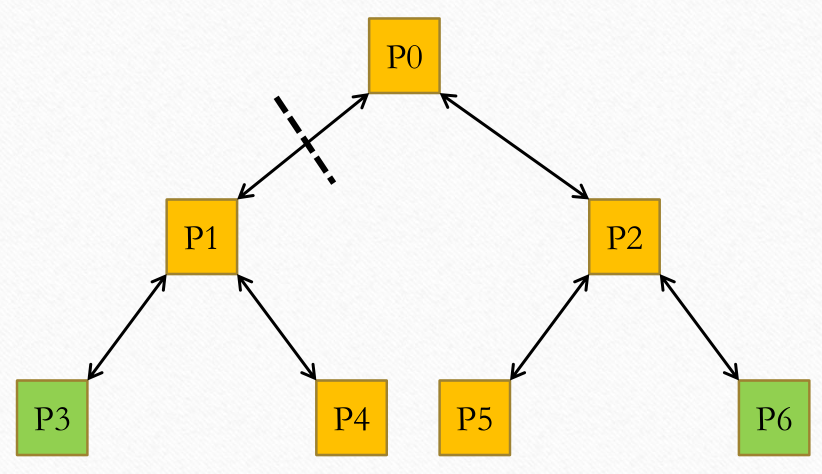{height=5cm}

- $BT(d)$ has $n = 2^{d+1} - 1$ processors (endpoints).
- $degree(BT(d)) = 3$ ($O(1)$).
- $diameter(BT(d)) = 2d$ ($O(log(n))$).
- $bw(BT(d)) = 1$ ($O(1)$).

##### Hypercube topology

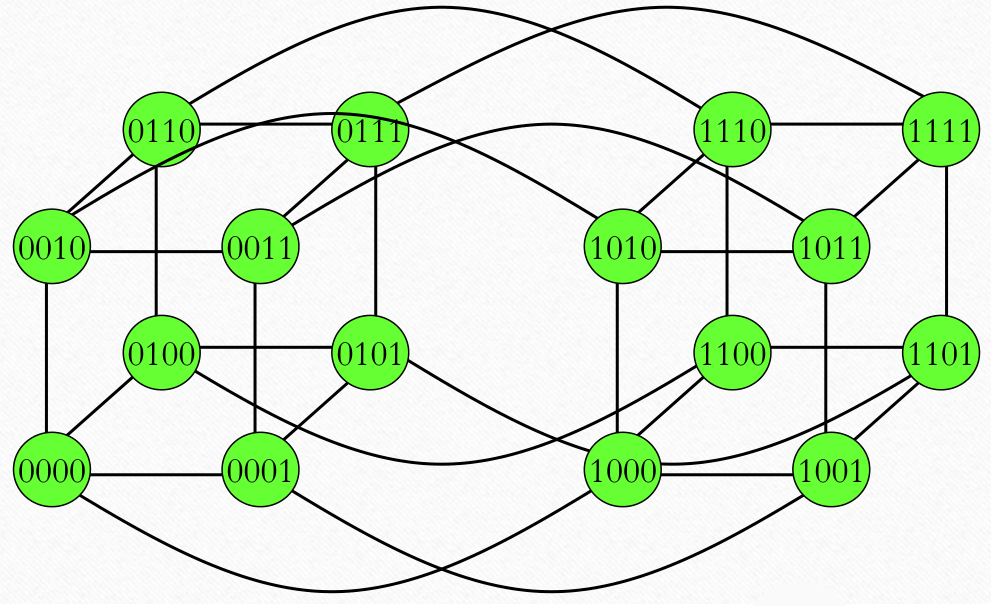{height=5cm}

- An **hypercube** $Q_d$ ($d \geq 1$) is the graph that has vertices representing the $2^d$ bit strings of length $d$.
    - Two vertices are adjacent iff the bit string that they present differ in *exactly* one position.
- $HC(d)$ is a hypercube of degree $d$.
- $HC(d)$ has $n = 2^d$ processors (endpoints).
- $degree(HC(d)) = d$ ($O(log(n))$).
- $diameter(HC(d)) = d$ ($O(log(n))$).
- $bw(HC(d)) = \frac{n}{2}$ ($O(n)$).

##### Criteria to evaluate network topologies

| Topology      | Degree       | Diameter         | Bisection-Width |
| -             | -            | -                | -               |
| Linear Array  | $O(1)$       | $O(n)$           | $O(1)$          |
| 2D Mesh/Torus | $O(1)$       | $O(\sqrt{n})$    | $O(\sqrt{n})$   |
| 3D Mesh/Torus | $O(1)$       | $O(\sqrt[3]{n})$ | $O(n^{2/3})$    |
| Binary Tree   | $O(1)$       | $O(\log(n))$     | $O(1)$          |
| Hypercube     | $O(\log(n))$ | $O(\log(n))$     | $O(n)$          |

- **Low diameter**:
    - In order to support efficient communication between any pair of processors.
- **High bisection width**:
    - A low bisection width can slow down many collection communication operations.
        - And thus can severely limit the performance of applications.
    - However, achieving high bisection width may require a non-constant network degree.
- **Constant degree** (i.e. independent of network size).
    - Allows scaling to a large number of nodes without the need to add an excessive number of connections.

\newpage

##### Fat tree topology

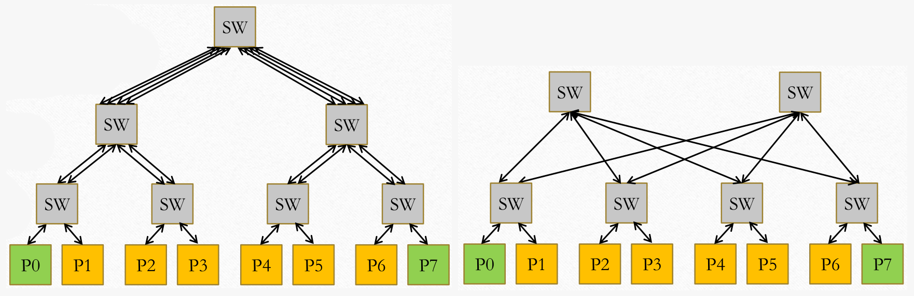{height=5cm}

- **Indirect** tree topology in which the endpoints are the leaves, and all the other nodes are switches.
    - Each switch has the same number of links going up and down.
    - Links are increasing (getting faster) towards the root.
- **Keep the bandwidth constant** at each level of the tree.
    - There is the same number of links at each level.
- The main problem is the **cost** (increasing with the depth of the tree).
    - Top-level switches have too many links.
    - Not a realistic implementation.
- Realistic implementation: using switches with a **limited degree**.
    - $k$-ary $n$-fly network topologies and *folded clos* network topologies.
    - Each switch has the same number of ports.
    - To scale out the network the number of level is increased.
    - `eg` For a $2$-level fat three here each switch has $k$ ports:
        - $k + \frac{k}{2}$ switches in total.
        - $n = k \times \frac{k}{2}$ maximum number of nodes.

##### Dragonfly topology

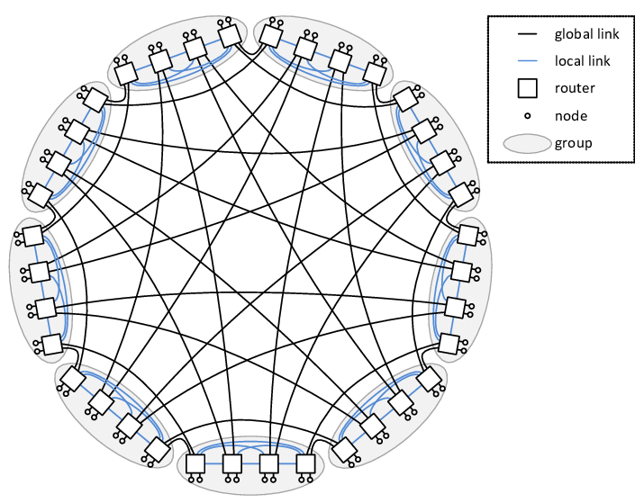{height=6cm}

- **Multi-level topology**.
    - Three levels: router, group, system.
- Each router has connections to:
    - $p$ endpoints.
    - $a-1$ local channels (to other routers in the same group).
    - $h$ global channels (to routers in other group).
- A group consists of $a$ routers.
    - Each group has $ap$ connections to endpoints (i.e. fully connected topology).
    - Each group has $ah$ connections to global channels.

#### Communication cost model

- Describes the data transfer time (or communication time).
- `def` **Linear communication cost model**: $T_{comm} = t_0 + n \times s \approx t_0$ for small $n$ and $n \times s$ for large $n$.
    - $t_0$: a constant term corresponding to the start-up time (network and communication runtime setup).
        - It contains all costs for sending the shortest message (sometimes called **latency**).
        - Its value may be different for different programming models.
        - The constant term may also be a linear cost if a data copy into the device is needed.
            - However, usually it's considered a constant value.
    - $n$: the amount of data to be transferred.
    - $s$: the transmission cost.
        - Usually $s = \frac{1}{B}$ where $B$ is the available bandwidth along the transmission path.
        - $s$ is limited by the slowest part of the path between the sender and receiver processes.
        - $s$ includes both SW contributions and HW contributions.
    - In modern HPC systems, $t_0$ is about $0.1$-$10 \: \mu sec$ where $B$ is $20$-$200 \: Gbps$.
    - Simple and it applies to many fields of computer architectures.
        - To model memory access time, bus transactions, pipeline operations.
        - But it has **some limitations**:
            - Does not include the effect of network distance.
            - Does not model contention (latency depends on network utilization).
            - Does not model how the data transfer is performed (sync or async).

##### Computation-to-communication overlap

- In distributed system, a computing node is equipped with a NIC.
    - The NIC can be a **specialized processor** (*smartNIC*) with multiples capabilities.
        - Including DMA and RDMA transfers.
        - ROCE (*RDMA-over Converged Ethernet*).
- The sender process may execute a **non-blocking send** to the destination process.
    - The NIC executes the data transfer and then notifies the sender process about the completion.
    - While the NIC execute the data transfer, the processor executes some other useful operations.
- Possible **full or partial overlap** between the tasks computation and the communication with other processes.
- The computing module $C$ receives in input a list of tasks (**data stream**).
    - The computation must be structured in a composable way (*functionally*).
    - For each input it takes:
        - $T_{calc}$ time for the computation.
        - $T_{comm}$ time for sending the task computed to the next module.
    - **Service time of a module** $C$ ($T_C$): the average time taken by the module between two consecutive inputs.
        - $T_C = T_{calc} + T_{comm}$ with *no overlap*.
        - $T_C = \max(T_{calc}, T_{comm})$ with *overlap*.

##### Synchronous vs asynchronous communications

- **Asynchrony degree** of a channel: the maximum number of messages ($k \geq 0$) the sender can send before it has to block waiting for the receiver to start receiving data.
    - It depends on the memory capacity of the channel and the size of the message being sent.
- **Synchronous communication**:
    - A send/received operation if the operation completes only after the message has been received or sent.
    - **Sender-receiver rendez-vous**: one of them blocks until the communication peer completes the operation.
    - A communication has to be considered synchronous if a **synchronization is needed**.
- **Asynchronous communication**:
    - The communication operation returns immediately without waiting for the message to be effectively sent/received.
    - The completion/success of the communication will be tested later on.
    - The number of asynchronous send might be limited by the asynchrony degree of the channel.

#### Input non-determinism

- The receive operation may return a message coming from any channel in a set.
    - Given a logical input channel which multiplexes a set of independent channels from multiples sources.
    - There is no fixed order when receiving a message from a multi-input channel.
    - If there is more than one message ready to be received from the input channel, pick randomly one.
- **Fixing a receiving order** is usually a **non-optimal approach**.

#### Foster's parallel algorithm design method

- How to parallelize a given problem.
- Ian Foster proposed the **PCAM** approach (*pipeline*):
    - **Partitioning**:
        - Decompose the problem into a large amount of *fine-grained* tasks that can be executed in parallel.
    - **Communication**: 
        - Determine the required communication between tasks (**dependencies**).
    - **Agglomeration**:
        - Combine identified tasks into larger tasks to **reduce communication by improving data locality**.
    - **Mapping**:
        - Assign agglomerated tasks to processes/threads to:
            - **Minimize communication**;
            - **Enable concurrency**;
            - **Balance workload**.

##### Jacobi iteration

- *Stencil code* applied on a $2$-dimensional array.
- Update each value in the matrix with the average of its four neighbors.
    - $data_{t+1}(i, j) = \frac{data_t(i-1, j) + data_t(i+1, j) + data_t(i, j-1) + data_t(i, j+1)}{4}$.
    - The update rule is applied a number of times iteratively.
    - The boundary values remain constant at each iteration.
    - Swap the updated array with the original one to avoid overwriting during the next iteration.
- Two schemes for Jacobi iteration with the PCAM approach:
    - **Partitioning**:
        - The smallest task is the computation of a single element of the Jacobi matrix.
    - **Communication**:
        - Within an iteration all fine-grain tasks can be computed independently.
        - Each task needs the data of four neighbors.
        - At the end of each iteration, there is a synchronization barrier among all $p$ processors.
            - And data is exchanged.
    - **Agglomeration** (two options):
        - By or (or by columns).
        - By using a square grid.
    - **Mapping**:
        - It follows the policy used for the agglomeration to map coarse-grained tasks to processors.
        - By row, contiguous groups are assigned to $p$ processors.
        - By square grids, rectangles of square grids are assigned to processors organized in a $\sqrt{p} \times \sqrt{p}$ grid.
- Considering the linear model for the cost of communication between two processes:
    - Method $1$: $t_{comm}(n) \approx 2 (t_0 + s \times n)$.
    - Method $2$: $t_{comm}(n) \approx 4 (t_0 + s \times \frac{n}{\sqrt{p}})$, assuming $p = \sqrt{p} \times \sqrt{p}$.
        - Superior for large $p$ since communication time decreases with $p$ while it remains constant for $1$.

##### Matrix chain ordering problem

- Finds the most efficient order to multiply a sequence matrices using Dynamic programming.
- Given $n$ matrices $M_i$ of size $d_{i-1} \times d_i$ for $1 \leq 1 \leq j \leq n$:
    - $F[i, j] = 0$ if $i=j$.
    - $F[i, j] = \min_{i \leq k < j} \{F[i, k] + f[k+1, j] + d+{i-1} \cdot d_k \cdot d_j\}$ if $i<j$.
- $F[i, j]$ ($i \leq j$): number of multiplications required in the **optimal ordering** for computing the matrix product $M_i \times \dots \times M_j$.
    - Overall, the **minimum cost** is stored in $F[1, n]$.
- PCAM approach (*wavefront computation pattern with upper-triangular $2D$-matrix*):
    - **Partitioning**:
        - The smallest task is the computation of a single element of the $F$ matrix.
        - All-upper triangular elements have to be computed.
    - **Communication**:
        - Tasks laying on the same diagonal are independent.
        - Tasks on adjacent diagonals ($k$ and $k+1$) are dependent.
            - To computer $F[i, j]$ all $F[i, k]$ and $F[k+1, j]$ (with $i \leq k < 1$).
        - A synchronization between the computation of two diagonals is needed.
    - **Agglomeration**:
        - Tasks can be agglomerated in different ways.
        - One option is to agglomerate by column or by rows to save some communications.
    - **Mapping**:
        - Can be done cyclic (or block-cyclic) to PEs.
        - `eg` Column $c$ is assigned to PE $m$ such $c \: \% \: n = m$.

\newpage

## Metrics and laws

### Metrics

#### Speedup and efficiency

- `def` **Speedup**: $S = \frac{T(1)}{T(p)}$.
    - $T(1)$: time taken using a single processor.
    - $T(p)$: time taken using $p$ processors.
- `def` **Efficiency**: $E(p) = \frac{S(p)}{p} = \frac{T(1)}{T(p) * p}$.
    - $T(p) * p$: **cost of parallelization** (or simply **cost**).
    - Ideal efficiency: $1$.

##### Super-linear speedup

- The best speedup is **linear speedup** varying the number of processors.
- Exception: **super-linear speedup**.
    - Two possible reason:
        - Unfair comparison with a naive serial algorithm.
        - Cache memory effects.
            - More processors implies more memory and larger logic caches.
            - Thus fewer cache misses and page swapping.
            - Good caching strategies are a benefit, but they must be explicit in an analysis.
- But quite often the speedup is **sub-linear** due to the **parallel run-time overhead**.

#### Scalability

- Defined the same way but with a significant difference.
    - In scalability, $T(1)$ is obtained executing the **parallel implementation** on a single processor.
        - `def` **Scalability** (or **relative speedup**): $Scalability = \frac{T_{par}(1)}{T_{par}(p)}$.
        - An algorithm on $p$ processors is compared to the same algorithm on a single processor.
    - In speedup, $T(1)$ is the **sequential version of the algorithm** (best algorithm for the problem).
        - `def` **Speedup** (or **absolute speedup**): $Speedup = \frac{T_{seq}}{T_{par}(p)}$.
        - An algorithm on $p$ processors is compared to the best algorithm available on a single processor.
            - More costly (experiments on two algorithms are needed).
            - Not as-easily-achievable as scalability.

##### Strong vs weak scalability

- **Linear scalability**: ideal is to get $p$ times more work done with $p$ processors.
- **Strong scaling**: the problem size is fixed.
    - Linear scaling ($S=p$) is hard to achieve due to **Amdahl's law**.
    - It depends on the amount of serial work (the non-parallelizable part).
- **Weak scaling**: problem size is $p$ times bigger in the same amount of time.
    - The problem size remains constant per processor.
    - It assumes that, as the size of the problem grows:
        - The amount of serial work remains constant (or increases slowly).
        - The amount of communication among processors remains constant (or increases slowly).

#### Analysis

- Metrics to evaluate when analyzing parallel vs sequential solutions:
    - **Speedup**: how much faster can the execution get with $p>1$ processors.
    - **Efficiency**: is the parallel program efficient.
    - **Scalability**: how does the parallel program behave.
        - When the number of processors varies keeping the problem size fixed (strong scaling).
        - And when the problem size changes (weak scaling).
- The speedup has a **maximum** after which speedup and efficiency will decrease.
    - *If you haven't reach a decreasing speedup you haven't used enough processors*.
    - There are two cost functions: a *computation cost* and a *communication cost*.
        - The first one decreases with higher $p$ while the second one increases.
        - The *meeting point* between the two curves is the goal.
    - A constant speedup means no gain in performance (more resources with equal performance gains).
        - A decreasing speedup implies a **negative gain** in performance.

##### Computation-to-communication ratio

- `def` **Computation-to-communication ratio**: $\gamma = \frac{\alpha}{\beta}$.
- Communication and synchronization costs are not present in sequential solutions.
    - C2C ratio is a good way to evaluate the quality of a parallel algorithm implementation.
- $\alpha > 0$: the time needed to perform a single addition.
- $\beta > 0$: the time needed communicate a set of numbers.
- $T_{\alpha, \beta}(2^q, 2^k) = 2 \beta q + \alpha(2^{k-q} - 1 + q)$.
- $S_{\alpha, \beta}(2^q, 2^k) = \frac{\alpha(2^k - 1)}{2 \beta q + \alpha(2^{k-q} - 1 + q)}$.
- $S_{\gamma}(2^q, 2^k) = \frac{\gamma(2^k - 1)}{2q + \gamma(2^{k-q} - 1 + q)}$.

##### Speedup and parallelization efficiency

- Both depends on the **PEs used** and the **computation-to-communication ratio** for a fixed message size.
- Speedup usually increases with the number of PEs used up to a **local maximum**.
    - Then it tends to decreases as more PEs are employed.
- Speedup is **low** if the **communication has a significant impact**.
    - Usually, the longer the communication takes, the fewer PEs should be used.
- Efficiency is a monotonic function in both PEs number and C2C ratio.

-----

### Laws

#### Amdahl's law

- A formula for **estimating speedup**, giving an **upper bound**.
- The program's speedup will be **limited by its fraction of sequential code**.
    - No matter how many processors are used in a parallel run.
    - Almost every program has a fraction of code that doesn't lend itself to parallelism.
    - `eg` Tokenization in NLP, python interpreter.
- `def` **Amdahl's law**: $S(p) \leq \frac{1}{f + \frac{1-f}{p}}$.
    - The sequential fraction of code ($f$) is a unit-less measure between $0$ and $1$.
    - It defeats strong scaling: for large $p \to \infty$, $S(p) \to \frac{1}{p}$.
    - Strong scaling is **limited by serial fraction**.
        - The serial part should be therefore **minimized**.
- With $p$ processors, the amount of sequential code allowed to reach linear speedup can be computed.
    - Of course, linear speedup is almost impossibile, since the percentage goes to $0$ quickly.

##### Derivation of Amdahl's law:

- $T(1) = T_{ser} + T_{par}$.
    - $T_{ser}$: part of the program that does not benefit from parallelization.
    - $T_{par}$: part of the program that does benefit from parallelization.
- Linear speedup is assumed as best possible speedup achievable.
    - $T(p) \geq T_{ser} + \frac{T_{par}}{p}$.
    - $S(p) = \frac{T(1)}{T(p)} \leq \frac{T_{ser} + T_{par}}{T_{ser} + \frac{T_{par}}{p}}$.
- Relative fraction are used instead of absolute execution times ($T_{ser}$ and $T_{par}$).
    - $f$ is the serial fraction whereas $(1-f)$ is the (potentially) parallelizable fraction.
    - $T_{ser} = f * T(1)$ and $T_{par} = (1 - f) * T(1)$ (with $0 \leq f \leq 1$).
- Substituting this in the previously derived upper bound, results in Amdahl's law.
    - **Upper bound** for the speedup that only depends on $f$ and $p$.
- $S(p) = \frac{T(1)}{T(p)} \leq \frac{T_{ser} + T_{par}}{T_{ser} + \frac{T_{par}}{p}} = \frac{f * T(1) + (1-f) * T(1)}{f * T(1) + \frac{(1-f) * T(1)}{p}} \leq \frac{1}{f + \frac{1-f}{p}}$.

#### Scaled speedup law

- **Scaled speedup law**:
    - Amdahl's law only applies when **strong scalability** applies.
        - However, when using more PEs, larger problem sizes may be used (**weak scalability**).
        - In this case, the time spent in parallelizable part ($T_{par}$) may grow faster in comparison to $T_{ser}$.
    - **Scaled speedup** incorporates such scenarios when calculating the achievable speedup.
    - `def` **Scaled speedup law**: $S_{\alpha \beta}(p) = \frac{\alpha * f + \beta * (1-f)}{\alpha * f + \frac{\beta * (1-f)}{p}}$.
    - **Derivation of scaled speedup law**:
        - $T_{\alpha \beta}(1) = \alpha * T_{ser} + \beta * T_{par} = \alpha * f * T(1) + \beta * (1-f) * T(1)$.
            - $\alpha$: scaling function of the program part that **doesn't benefit** from parallelization with respect to complexity of problem size.
            - $\beta$: scaling function of the program part that **does benefit** from parallelization with respect to complexity of problem size.
        - $S_{\alpha \beta}(p) = \frac{T_{\alpha \beta}(1)}{T_{\alpha \beta}(p)} \leq \frac{\alpha * f * T(1) + \beta * (1-f) * T(1)}{\alpha * f * T(1) + \frac{\beta * (1-f) * T(1)}{p}} = \frac{\alpha * f + \beta * (1-f)}{\alpha * f + \frac{\beta * (1-f)}{p}}$.

##### Gustafson's law

- **Gustafson's law**: 
    - Special case of the scaled speedup law.
    - Used to predict the theoretically achievable speedup using multiple processors when:
        - The parallelizable part scale linearly with the problem size.
        - While the serial part remains constant.
    - `def` **Gustafson's law**: $S(p) \leq f + p * (1-f) = p + f * (1-p)$.
    - **Derivation of Gustafson's law**:
        - $\gamma = \frac{\beta}{\alpha}$: ratio of the problem complexity scaling between parallelizable and non-parallelizable part.
        - Scaled speedup as a function of $\gamma$: $S_{\gamma}(p) \leq \frac{f + \gamma * (1-f)}{f + \frac{\gamma * (1-f)}{p}}$.
            - $\gamma = 1$ (i.e. $\alpha = \beta$) $\implies$ Amdahl's law.
            - $\gamma = p$ (i.e. $\alpha = 1$ and $\beta = p$) $\implies$ Gustafson's law.
        - $S_{\gamma = p}(p) = \frac{T_{\gamma = p}(1)}{T_{\gamma = p}(p)} \leq \frac{f * T(1) + (1-f) * T(1)}{f * T(1) + \frac{(1-f) * T(1)}{p}} = f + (1-f) * p = p + f * (1-p)$.

\newpage

## Models of computations

### Parallel models of computation

- Theoretical **parallel models of computation** can be analyzed instead of directly implementing an algorithm to a specific architecture.
- They allow the programmer to focus first on the best algorithm.
    - And then on how to deal with specific technological limitations.
- Additionally, they may provide **lower bound** for the implementation on a real machine.
- Three main models:
    - **Parallel Random Access Machine** (PRAM).
    - **Bulk Synchronous Parallel** (BSP).
    - **Work-Span**.
        - While in PRAM and BSP the parallelism rate is fixed, in this model can change.

-----

### Parallel Random Access Machine

- The first theoretical parallel models of computation introduced.
- Idealized shared-memory platform:
    - No caching.
    - No NUMA organization.
    - No synchronizations overhead.
- $n$ processors ($P_0, \dots, P_{n-1}$) are connected to a global shared memory $M$.
    - Any memory location is uniformly accessible from any processor in **constant time** (non-NUMA).
    - Communication between processors can be implemented by reading and writing to globally accessible shared memory.

#### Execution

- $n$ identical processors ($P_0, \dots, P_{n-1}$), **operate in lock-step**.
    - A strong assumption, a completely synchronous system (without sync protocol) is **purely theoretical**.
        - As demonstrated by Lamport with *clock drift*.
        - But by establishing a lower bound it's useful to study algorithms (which will perform worse on real systems).
- In every step, each processor executes an instruction cycle in three phases:
    - **Read phase**:
        - Each $p$ can simultaneously read a single data item from a (distinct) shared memory cell and store it in a local register.
    - **Compute phase**: 
        - Each $p$ can perform a fundamental operation on its local data and store the result in a register.
    - **Write phase**:
        - Each $p$ can simultaneously write a data item to a shared memory cell.
            - Whereby the exclusive PRAM variant allows writing only distinct cells.
            - While the concurrent write PRAM variant also allows processors to write the same location.
                - Possible **race conditions**.
- **Uniform complexity analysis**: each step on the RAM takes $O(1)$ time.

#### PRAM Variants

- Variants defined to solved conflicts which arise when processors read or write to the same shared memory location.
- **Exclusive Read Exclusive Write** (EREW):
    - No two processors are allowed to read or write to the same shared memory cell during any cycle.
- **Concurrent Read Exclusive Write** (CREW):
    - Several processor may read data from the same shared memory cell simultaneously.
    - Still, different processors are not allowed to write to the same shared memory cell.
- **Concurrent Read Concurrent Write** (CRCW):
    - Both simultaneous reads and writes to the same shared memory cell are allowed.
    - In case of a simultaneous write which value will actually be stored is specified: 
        - **Priority CW**: processor have been assigned distinct priorities, and the best one succeeds in writing. 
        - **Arbitrary CW**: a randomly chosen processor succeeds in writing its value (completely non-deterministic).
        - **Common CW**: if values are all equal, then this common values is written.
            - Otherwise memory location is unchanged.
        - **Combining**: all values to be written are combined into one by means of an associative binary operation.
            - Sort of reduce (`eg` sum, product, minimum, logical OR/AND, etc).
            - It transfers in the writing phase part of computation (needs extra ALUs, or processing memory, etc).

-----

### Bulk Synchronous Parallel Model [Valiant, 1990]

- A **unified framework** for the design, analysis and programming of general-purpose parallel systems.
    - Not only a theoretical model, it can also serve as a **paradigm for parallel programming**.
- It can deliver both scalable performance and architecture independence.
- It consists of **three parts**:
    - A collection of processor-memory components (simil-PRAM).
    - A communication network that can deliver point-to-point messages among processors.
    - A facility for **global synchronization** (barrier) of all processors.
- In PRAM, each instruction is synchronous (*read* $\to$ *compute* $\to$ *write*, etc) and works on a **shared memory**.
    - While BSP is meant for **multicomputing**, with couples (proc-mem) linked via a **communication network**.
- $n$ processors ($P_0, \dots, P_{n-1}$) each with its own memory (a **distributed memory** multiprocessor).
    - The **remote memory access time** is **uniform** (access time to all non-local memory locations is the same).
    - PRAM is an abstraction for shared memory systems, BSP is an abstraction for multicomputers.
    - **Message-passing**.

#### BSP algorithm

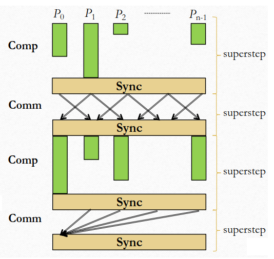{height=7cm}

- A BSP algorithm consists of a sequence of **superstep**.
    - The computation load for each processor is different, **load balancing** is useful.
- A superstep consists of:
    - A number of computation or communication steps or both.
    - A **global barrier** synchronization (**bulk synchronization**).
- A **computation superstep** consists of many small steps executing operations.
- A **communication superstep** consists of many basic communication operations.

#### Superstep communication and computation costs

##### Communication costs

- **$h$-relation**: a communication superstep in which every processors send and receives at most $h$ data words.
    - The **maximum** between the data words sent and received by a processor in a communication superstep.
    - In order to compute a superstep communication cost some assumptions are necessary: at most $h$ data words.
- Cost of an $h$-relation: $T(h) = h * g + l$.
    - $g$ (*gap*): the time per data word.
    - $l$ (*latency*): the global synchronization time.
    - $g$ and $l$ (which are **fixed**) depend on the number of processors ($p$).
        - They are usually expressed in FLOPS.
    - $l>0$ includes the costs of the **global synchronization**, plus:
        - All fixed costs for ensuring that all data have arrived at the destination.
        - The start-up of the communications.
    - Approximate values for $g$ and $l$ of a specific parallel computer can be obtained by measuring the execution time for a range of **full** $h$-relations.

##### Computation costs

- `def` **Computation superstep cost**: $T_{comp}(w) = w + l$.
    - $w$: the amount of work as the **maximum number of ops performed in the superstep by any processor**.
    - Processors with less work than $w$ operations **must wait** (source of inefficiency).
- `def` **Mixed superstep cost**: $T_{comp}(w) = w + h * g + l$.
    - A mixed superstep contains both computation and communication.
    - The same $l$ measure is used for all types of superstep.
- The cost of a BSP algorithm is expressed as an expression $a + b * g + c * l$.
    - The expression is obtained by adding the costs of all the algorithm's supersteps.

#### BSP model

- `def` **BSP abstract machine**: $BSP(p, r, g, l)$, a **distributed memory system**.
    - $p$: the number of processors.
    - $r$: the computing rate expressed in FLOPS.
    - $g$: the communication cost per data word (in FLOP time unit).
    - $l$: the global synchronization cost (in FLOP time unit).
- The communication network is a **blackbox** capable of providing **uniform time access** to remote memory.
- The cost of an algorithm on the BSP machine is given by **summing the cost** of each superstep.
- `!` This model promotes:
    - A structured approach to thinking about parallelization.
        - It limits the freedom of the programmer imposing a specific model.
    - SPMD model of computation.
        - All processors run the same program but on different data.
    - **Balancing the communication among the processors**.
        - Sending all data to one processor is discouraged.

\newpage

## Parallel programming

### OpenMP

- An API for **platform-independent** shared memory parallel programming in C, CPP and Fortran.
    - It provides high-level parallel abstraction atop low-level multithreading features.
    - Released in 1997 only supporting Fortran.
    - In 2008 it  introduced **task parallelism**.
- It extends those languages with **directives** (instructions for the compiler) and a few routines.
- Natively supported by almost all compilers.
    - It is used to exploit shared-memory parallelism on small CMPs and on supercomputers.
    - The compiler generates threaded programs and all needed synchronizations.
- OpenMP is not a parallelizing compiler (it doesn't automatically parallelize sequential code).
    - Parallelism is explicit.
    - Avoiding data races and obtaining good speedup is programmer's responsibility.
- PyTorch uses OpenMP for training on CPUs.

#### OpenMP Targets ease of use

- OpenMP does not require that single-threaded code be changed for threading.
    - It **preserves sequential equivalence**.
    - It enables incremental parallelization of sequential programs.
- OpenMP relies mainly on compiler directives.
    - If the compiler does not recognize a directive, it ignore it.
    - Parallelization possible using just a small number of directives (not true nowadays).
- If the compiler is not instructed to process OpenMP directives, the program will execute sequentially.
    - Runtime routines have default sequential implementations.

#### Execution model (fork-join)

- Higher-level than CPP/POSIX threads.
- The execution starts with a single thread called **master thread**.
- The master thread creates a **team** (or pool) of worker threads to execute **parallel regions**.
    - Where task are computed in parallel by workers.
- At the end of a parallel region there is an **implicit barrier synchronization**.
    - After the barrier only the master thread continues the execution.
    - The barrier can be explicitly disabled, but then the programmer must manage the handling.

#### Memory model

- OpenMP provides a relaxed consistency model that is similar to **weak ordering**.
    - It allows the reordering of accesses within a thread to different variables.
- Each thread has its **temporary view of the memory** (induced by machine registers, cache, etc).
    - Additionally, each thread has its *thread-private* memory that cannot be accessed by other threads.
- The `flush` directive is used to enforce consistency between a thread's temporary view of memory and primary memory.
    - Or between multiple threads' view of memory.
    - Use explicit flushes with care since they can evict cached values.
        - Subsequent accesses might reload data from memory.
    - Flush operation are implied by all synchronization in OpenMP.
- **Variable privatization** ensures efficient executions.

#### Dynamic scheduling

- For the **dynamic** and **guided** schedule clauses the iterations are split into **chunks** of consecutive iterations.
    - In the guided schedule, the `chunksize` is a lower bound.
        - Bigger chunks are assigned at the beginning, and as chunks are completed, the size decreases up to `chunksize`.
        - When a thread finishes executing a chunk, a new chunk is assigned by the runtime system.
    - The dynamic schedule requires **more works** at runtime (thus more overhead than the static one).
        - But it guarantees **better workload balancing** among Workers in presence of unpredictable or highly variable work per iteration.
        - The chunksize is another critical factor, the optimal value is system and application dependent.

#### Paradigms in parallel programming

- *Algorithm skeletons* [Cole, 1988] or *patterns*.
    - Paradigms are even more abstract.
- Two type of paradigms for parallel programming:
    - **Control parallel**.
        - **Task parallelism**.
            - Input and output are explicitly defined.
            - Mostly stateless function.
        - **Stream parallelism**.
    - **Data parallel**.
        - Focusing on *input data* may be erroneous.
        - **Loops** are the main source of data parallelism.
        - Three type of operation:
            - **Map**: function applied to each element.
            - **Reduce**: accumulation on a single value via linear operation.
            - **Stencil**: similar to map, but the context is not a partition of the input, but of the output.
                - `eg` Average with neighbours.
        - The whole field of Big Data is based on MapReduce.
        - **GPU paralleling model** is **inherently data parallel**.

##### Structured Parallelism Taxonomy

- Control parallelism:
    - Stream parallelism (in AI, model parallelism): pipeline, farm, master-worker.
        - `eg` MW services: Kubernetes, Spark, AWS (*elastic computing*).
        - Even if MW has clear problems (**centralization**), over time it succeeded in popularity.
            - Control Logic is centralized in a single logical place (*benefit*), easy to program.
        - With limited workers (or good computation-to-communication ratio), MW scales decently.
            - To alleviate scaling problems, **grains** can be changed.
        - *Distributed system desiderata*: **availability**, **consistency**, **partition-tolerance**.
            - *CAP theorem*: it is impossible to achieve all three.
    - Task parallelism: task graph, DAG.
- Data parallelism:
    - Globally synchronous (in AI, data/fullshard parallelism): BSP, reduce.
    - Locally synchronous: map, stencil.

#### Worksharing sections

- `sections` directive enables specification of **task parallelism**.
- It specifies that enclosed sections of the structured block have to be divided among team threads.
    - Each section is executed once by one thread.
    - Different section may be executed by different threads. 
- There is an implicit barrier at the end of a `sections` directive.
    - Unless the `nowait` clause is used.
- The execution order of tasks is not known.
    - The assignment of tasks to thread is non-deterministic.

#### Synchronization constructs

- Alternative to `sections` and `tasks` directives.
- `barrier`: all threads in the active team must reach this point before they can proceed.
- `single`: mark a parallel region to be executed only by one thread.
    - The first one reaching it, others skip the region.
    - Like other worksharing directives, there is an **implicit barrier** at the end of the block.
- `master`: mark a parallel region to be executed only by the **master thread** (the one with ID $0$).
    - There is **no implicit barrier** at the end of the block.
- `critical`: all threads will execute the critical section one at a time.
- `ordered`: in loops with dependencies, ensures that carried dependencies don't cause data race.
    - It states that the structured block must be executed in sequential order.
- `atomic`: only one thread at a time updates a shared variable.

#### Tasks

- Later evolution of `sections` (introduced from `3.0` version).
- Not all programs have easily parallelizable loops:
    - Loops in which the iteration count is not known in advance.
    - Loops containing complex dependencies (`eg` LU, Cholesky algorithms).
    - *Divide et impera* algorithms.
    - Data streaming computations (i.e. producer-consumer).
- A task is an **independent unit of work** enclosing:
    - A function code to execute.
    - (references to) needed data and in general its environment.
    - Control variables.
- The execution of a task by a thread of the team can begin immediately or can be **deferred**.
- A task can be **tied** to a thread (i.e. task stealing not allowed).
    - By default a task is **tied** to the first thread that executes it.
- Private and shared variables can be specified in the directive `[clause list]`.

##### Data scoping for tasks

- **Data scoping** for tasks is tricky if the scope is not explicitly specified.
- If no default clause is specified, then:
    - Static and global variables are `shared`.
    - Local variables are `private`.
    - Variable for orphaned tasks are `firstprivate`.
        - Since the execution of a task can be deferred.
        - And when the task will be executed, variables may have gone out of scope.
    - Variable for non-orphaned tasks are `firstprivate` by default.
        - Unless the `shared` clause is specified in the enclosing context.

##### Task execution model

- The execution of a task by a thread of the team can begin immediately or can be **deferred**.
- If the task execution is deferred, the task is placed in a **task queue**.
    - The task queue is associated with the current `parallel` region.
- All threads of the team, will take tasks out of the ask pool until the pool is empty.
- The code associated with the task construct will be executed only once.
    - A `tied` task is executed by the same thread from beginning to end.
    - An `untied` task can be executed by multiple threads of the team.
- `taskwait` can be used to wait for the completion of child tasks defined in the current task.
    - It waits for the generated tasks and not for all descendant tasks.
    - It suspends the parent task until all children's tasks are finished

##### Task generation and scheduling

- **Task generation**:
    - The usual task generation is based on a loop.
    - If the wanted number of tasks is large, implementation can stop generating new tasks.
        - And switch all threads in the team to execute the already generated tasks.
        - If the thread that generated the tasks is executing a long task, the other threads might be idling.
    - One option is to make the task generation an `untied` task.
        - Thus any other thread is eligible to resume the task generating the loop.
- **Task scheduling**:
    - OpenMP defines the following task scheduling points:
        - When encountering a `task`, `taskwait` and `taksyield` constructs.
        - When encountering an implicit or explicit barrier.
        - When a task completes.
    - **Tied tasks** (only the thread that task is tied to may execute the task):
        - A task can be suspended at specific scheduling points (creation, completion, `taskwait`, `barrier`, etc).
        - If a task is not suspended at a barrier, the thread executing the task can only switch to a descendant of any task tied to the thread. 
    - **Untied tasks** (the task can be executed by different threads):
        - There are no scheduling restrictions.
        - Tasks can be suspended at any point, and the thread can switch to any task.

\newpage

## Distributed memory architectures

### Message passing

- Shared memory and **message passing** are used together in modern computer clusters.
    - SHM is way faster than MP since it doesn't need copies.
- **User-level** message-passing programming:
    - By default, message-passing between different HW devices is not *user-level*.
        - User-level programming bypasses the kernel space.
        - But by bypassing the kernel, most security assurances are lost.
            - But that's fine in HPCs, since they're **closed system**.
    - Two primary mechanisms are needed:
        - A method of **creating separate processes** for execution on different computers (MPMD, SPMD).
        - A method of **sending and receiving messages**.

#### Creating separate processes

- **Multiple Program, Multiple Data** (MPMD) model:
    - Separate programs for each processor.
- **Single Program, Multiple Data** (SPMD) model:
    - Different processes merged into one program.
    - Control statements select different parts for each processor to execute.
    - All executables started together (*static process* creation).
    - Basic MPI way.

-----

### MPI

- Interface with multiple implementations (`mpicc`, `openMPI`, etc).
    - Language bindings: C, Fortran, CPP.
- MPI-1 (1994), currently MPI-3.
- Basic concepts:
    - **Process creation**:
        - Purposely not defined, depends upon the implementation.
        - `MPI_Init` and `MPI_Finalize` directives.
            - `MPI_Init` blocks each process until they are all ready (circuits established, etc).
            - `MPI_Finalize` terminates the parallel program.
                - Termination is a wrongly undervalued aspect of parallel programming.
                - At termination, no message has to be pending (*hard*).
    - **Communicator and Rank**:
        - Define the scope of a communication operation.
        - Processes have ranks associated with communication.
        - Initially, all processes enrolled in `MPI_COMM_WORLD`. 
            - Other communicators can be established for group of processes.
    - **Communications**:
        - Point-to-point or collective (sync/async).
        - MPI assumes that a connection is secured and secure (not connection-less).
- `MPI_Wtime()` returns time in seconds, useful for evaluating programs empirically.

#### Communication in MPI

- Communication taxonomy:
    - **Symmetric/asymmetric**:
        - Symmetric or point-to-point or 1:1 (*uni-directional*).
            - `send()` and `recv()` library calls.
        - Asymmetric or collective.
            - Not really only communication but involve some message processing (`eg` *reduce*).
                - Some authors state it's not only strictly a *communication model*, but a *programming model*.
    - **Synchronous/asynchronous**:
        - **Synchronous** or rendez-vous (w.r.t. communication partners).
            - *Synchronous send routine*: waits until complete message can be accepted by receiver before sending it.
            - *Synchronous receive routine*: waits until the message it is expecting arrives.
            - Synchronous routines intrinsically perform two action: **data transfer** and **processes sync**.
        - **Asynchronous** (w.r.t. communication partners).
            - **Blocking** (w.r.t. communication channel).
                - Return after their local actions complete.
                - Even if the message transfer may not have been completed.
            - **Non-blocking** (w.r.t. communication channel).
                - Return immediately.
                - Non-blocking operation are prefixed with an `i` (`eg` `isend()`).
- Blocking-asynchronous is the default (easy to use).

##### Message Tag

- Used to differentiate between different types of messages being sent.
- Message tag is carried withing message.
- If special type matching is not required, a wildcard message tag is used.
    - So that `recv()` will match with any `send()`.

##### Group message passing routines

- Routines that send/receive message(s) to/from a group of processes.
    - Higher efficiency than separate point-to-point routines (although not necessary).
- **Broadcast**: sending the same message to all processes concerned with the problem.
    - Broadcast can be implemented in different ways (even in HW).
        - Using a tree for distribution: $log_2(p)$ instead of $p$.
    - **Multicast**: sending the same message to a defined group of processes.
- **Scatter**: sending each element of an array in root process to a separate process.
    - Works on structured data.
    - Contents of $i$-th location of array sent to $i$-th process.
- **Gather**: having one process collects individual values from a set of processes.
    - Inverse of the scatter operation.
- **Reduce**: gather operation combined with specified arithmetic/logical operation.
    - `eg` Values could be gathered and then added together by root.
    - In gather the result is an array, while in the reduce is an element.

##### Communicators

- Defines the scope of a communication.
- Processes have ranks associated with communication.
- Other communicators can be established for group of processes.
- MPI Solution *Communicators*:
    - Initially, all processes enrolled in a *universe* called `MPI_COMM_WORLD`.
        - Each process is given a unique rank, a number from $0$ to $p-1$.
        - Used in all point-to-point and collective MPI message-passing communications.
    - Defines a **communication domain**.

#### Communication routines

- **Blocking send** (default): `MPI_Send(buf, count, datatype, dest, tag, comm)`.
    - Defining byte-counted types is not ideal for **portability**, but MPI datatypes helps with it.
- **Blocking receive** (default): `MPI_Recv(buf, count, datatype, src, tag, comm, status)`.
    - `status`: status after operation.
- **Non-blocking send**: `MPI_Isend(buf, count, datatype, dest, tag, comm, request)`.
    - Returns *immediately* even before source location is safe to be altered.
    - Ideal if hardware devices can handle communication properly (`eg` top-end Ethernet switch).
- **Non-blocking receive**: `MPI_Irecv(buf, count, datatype, source, tag, comm, request)`.
    - Returns even if no message to accept.
    - Completion detected by `MPI_Wait()` and `MPI_Test()`.
        - `MPI_Wait()`: waits until operation completed and returns then.
            - This is the routine to be used when the datum is needed, not the receive one.
        - `MPI_Test()`: returns with flag set indicating whether operation completed at that time.
        - Need to know whether particular operation completed.
        - Determined by accessing `request` parameter.

##### Send communication modes

- **Standard mode**: not assumed that corresponding receive routine has started.
    - Amount of buffering not defined by MPI.
    - If buffering provided, send could complete before receive reached.
- **Buffered mode**: send may start and return before a matching.
    - Necessary to specify buffer space via `MPI_Buffer_attach()`.
- **Synchronous mode**: send and receive can start before each other but can only complete together.
- **Ready mode**: send can only start if matching receive already reached, otherwise error (dangerous).
- Each of the four modes can be applied to both blocking and non-blocking send routines.
    - Some combinations may be senseless.
    - Only the standard mode is available for the blocking and non-blocking receive routines.
    - Any type of send routine can be used with any type of receive routine.

##### Collective communication

- Involve set of processes, defined by and intra-communicator.
- Message tag not present.
- Principal collective operations:
    - `MPI_Bcast()`: broadcast from root to all other processes.
    - `MPI_Gather()`: gather values for group of processes.
    - `MPI_Scatter()`: scatters buffer in parts to group of processes.
    - `MPI_Alltoall()`: sends data from all processes to all processes (used a lot in AI).
    - `MPI_Reduce()`: combine values on all processes to single value.
    - `MPI_Reduce_scatter()`: combine values and scatter results.
    - `MPI_Scan()`: compute prefix reductions of data on processes.

#### Barrier

- A means of synchronizing processes by stopping each one until they all have reached a specific *barrier* call.
- Blocking and non-blocking mode.
- **Two-phase implementation**:
    - A process enters arrival phase and doesn't leave this phase until all processes have arrived in this phase.
        - Then processes move to departure phase and are released.
    - Two-phase handles the reentrant scenario.
        - Good barrier implementations must consider that a barrier might be used more than once in a process.
        - Might be possible for a process to enter the barrier for a second time before previous processes have left the barrier for the first time.

##### Linear barrier

- **Centralized implementation** (linear):
    - One **shared counter** initially containing the number of threads.
        - Atomically decremented when a thread arrives.
        - If the counter's value reaches zero this flag is updated to release all waiting threads.
    - The number of processes needs to be known.
        - **Barriers** are not implementable in open systems.
        - MPI assumption: the dynamic number of processes are set at execution start via parameters.

##### Tree and butterfly barriers

- **Tree implementation** and **butterfly implementation**:
    - Tree barriers arrange the threads in a tree.
    - There are many situations where the result of a calculation may need to be communicated to all processes.
        - Simplest implementation: to have a single process to send the calculation to each individual process.
        - But this doesn't use any of the available parallelism.
        - A better approach si to use the tree-based communication structure to compute the global operation.
            - Then use a **tree-based structure** to distribute the result.
            - But a **butterfly structure** is more efficient.
    - The **butterfly structure** can be implemented using a similar scheme to the tree structure.
        - The barrier is **round-based**.
        - Every thread has its own view of all the other threads involved in the synchronization.
        - The pairings are created using XOR operations.
        - The terminating condition is different as the partial results need to be communicated multiple times.

\newpage

## Data parallelism

### Data parallel computations

- The best way to enhance parallelism is to **minimize synchronization** as much as possible.
    - Embarrassingly parallel problems (`eg` Montecarlo simulation) are the best example of it.
- **Fully synchronous**: all processes involved in the computation must be synchronized.
    - Synchronization can be achieved with barriers or any other collective operations involving all processes.
- **Locally synchronous**: processes only need to synchronize with a set of logically nearby processes.
    - And not all processes involved in the computation.

#### Globally synchronous computations

- In a (fully) synchronous application, all the process synchronized at the regular points.
- Barrier is a basic mechanism for synchronizing processes.
    - All processes can continue from the barrier point when all the process have reached it.
    - Or in some implementations, when a stated number of processes have reached this point.
- **Deadlock**:
    - When a pair of processes each send and receive from each other, deadlock may occurs.
    - Deadlock will occur if both processes perform the send, **using synchronous routines** first.
        - Or blocking routines without sufficient buffering.
        - Neither will return, they will wait for matching receives that are never reached.
    - Possible solutions:
        - Arrange for one process to receive first and then send and the other to send and then receive.
        - Use combined send-receive primitives (`eg` `sendrcv` in MPI).
- Advantages:
    - Same operation performed on different data elements simultaneously (i.e. in parallel).
    - Ease of programming (essentially one one program).
        - Programs are most of the times structured in **phases** (basically distinct problems).
    - Can scale easily to large enough problem sizes (if **grain** is correctly sized).
    - Many numeric and some non-numeric problems can be cast in a data parallel form.
- **Allgather**:
    - A new message-passing operation.
    - Broadcast and gather values in one composite construction.
- **Partitioning**:
    - Usually $\#$ of processors is much lower than $\#$ of data items to be processed.
        - Partition the problem so that processors take on more than one data item.
    - **Block allocation**: allocate groups of consecutive unknowns to processors in increasing orders.
    - **Cyclic allocation**: processors are allocated one unknown in order. 
        - `eg` Processor $P_0$ is allocated $x_0, x_p, x_{2p}, \dots, x_{((n-p)-1)p}$.
        - Cyclic allocation may not be always advantageous.

#### Locally synchronous computations

- Several problems can be described as *locally synchronous computations* (**stencil**) problems.
    - Especially the ones involving planes or graphs and with discrete time-scales.
- Defining an order implies decreasing parallelization (`eg` like in H263).
    - But it implies *in-place* working (decreasing memory usage).
        - But an higher memory usage (as with parallelization) is acceptable if used properly.
            - `eg` The usage of two matrices which are used $w_1 \to w_2 \to w_1 \to w_2 \to \dots$.
    - Several algorithms moved to *General Fast Fourier Transformation*.
- With blocking-communication, some barriers are not needed.
    - *Vanneschi*: the barrier primitive is useless within blocking-communication.
    - But an algorithm must be designed properly to avoid the use of barriers.
- **Local convergence** is bounded to **global convergence**.
    - Every method to achieve global convergence is a **reduce operation**.

-----

### GPU parallelism

- GPUs: born as accelerating co-processors for specific graphics operations.
    - Nowadays are considered **General-purpose GPU** (GPGPU).
- Three major ideas that make GPUs fast:
    - Simplify and multiply.
    - Share instruction stream: wide-SIMD.
    - Hide latencies by interleaving.
- **Throughput computing**:
    - GPU memory system is optimized for **high throughput** and **high bandwidth cache**.
    - If **latency** is the focus, GPUs are not optimal.
- `!` GPUs can only implement **map-reduce** (and its variants) algorithms.
    - Not every problem is solvable using GPUs.

#### Simplification

- Remove everything that makes a single instruction stream run fast:
    - Cache ($50\%$ of die are in typical CPUs).
    - Hard-wired logic: out-of-order execution, branch prediction, memory pre-fetching.
- Consequence: use many simple cores in parallel.
    - Invest saved transistors into more copies of the simple core.
    - More copies (more than a conventional multicore CPU could afford).
- But (mainly memory) bottlenecks still arise.
    - Nowadays multicore CPUs haven't solved the problem.
    - Cache handling is still crucial and the **memory wall** still remains.

#### Instruction Stream Sharing

- The same operation is typically performed on many different data items.
    - Many operations exhibit *natural* parallelism (vector addition, sparse matrix vector multiply, etc).
- **SIMD processing**:
    - SIMD machines were already commercially available in the 80s (`eg` Connection machines).
    - Not every algorithms is portable or easily portable to SIMD instructions.
        - Simple `if` statements can break the SIMD paradigm.
    - GPU design assumption:
        - Expect *only* data-parallel workloads and exploit this to maximum extent in chip design.
    - Amortise cost/complexity of managing an instruction stream across many ALUs to reduce overhead.
        - ALUs are very cheap to manufacture.
    - Increase ratio of peak useful flops vs total transistors.
- Problems with SIMD:
    - SIMD processing implies **SIMD memory access**.
    - **Branch divergence**:
        - **Single Instruction Multiple Threads** (SIMT).
            - All instructions in all *threads* are executed in lock-step.
- SIMD processing $\neq$ SIMD instructions.
    - First option: explicit vector instructions (`eg` x86 SSE and AVX).
    - Second option: scalar instruction, implicit HW vectorisation.

#### Latency Hiding by interleaving

- Meant to improv throughput.
- **Stalls**: delay due to dependencies in the instruction stream.
    - Latency: accessing data from memory easily takes $1000+$ cycles.
    - Fancy caches and logic that helps to hide stalls have been removed in simplification.
    - But GPUs assume lots of **independent work** (independent SIMD *groups*). 
- **Interleave processing** of many work groups on a single core.
    - Switch to instruction stream of another (non-stalled) SIMD group in case currently active group stalls.
    - GPUs manage this in HW, **overhead-free**.
    - Ideally, latency is fully hidden, **throughput is maximised**.

### GPU programming

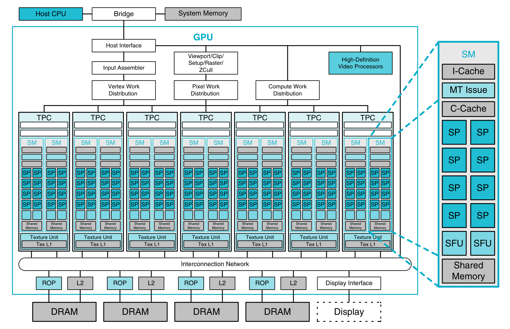

- Streaming processors (SP) are called CUDA cores by NVidia.
    - NVidia TF32 (Tensor float) is actually $18$ bits (*less accurate* $32$ bit numbers).

#### GPU programming model

- Structure:
    - Threads are group in **threads block** (where threads share memory).
        - Thread block size is determined by the programmer ($1024$ common default).
    - Threads blocks are stored in a **grid** ($1$, $2$ or $3$ dimensional).
        - A thread can query its position.
    - Each thread can access a **global memory**.
        - The memory is **hyper-relaxed** (write order is not guaranteed).
        - Therefore it can't be used as a synchronization device.
            - Interaction between threads using the global memory is not advisable.
        - Kernel can't instantiate the global memory, only the CPU can do it before the kernel launch.
- Threads from different blocks cannot be synchronized.
    - A solution is to terminate the kernel (wait for threads termination) and then operate.
    - `synchthreads()` is a barrier mechanism inside a threads block.
- A reduce operation can be used intra-block.
    - Or a reduce operation can be used after partial results have been already reduced by single blocks. 

##### Warps

- Threads are also grouped in **warp** (small sub-block structure).
    - Every thread in a warp perform the same operation at the same time.
    - All the data needed by these thread are available in the register.
- The **warp scheduler** decide which warp execute based on data availability, etc.
    - Each warp has a program counter.
- The programmer must organize code properly to avoid **divergence** (few threads working and a lot idling).
    - `eg` Reorganize the reduce using the commutative property.
        - The new algorithm is way more performant, but it usable only with commutative operators.
        - Due to numerical accuracy, results of the two algorithm is not guaranteed to be the same.

### NVidia seminar [Spiga]

- CPUs are **latency-oriented**, while GPUs are **throughput-oriented**.
    - CPU memory system is optimized for **low latency** and **deep cache hierarchy**.
    - GPU memory system is optimized for **high throughput** and **high bandwidth cache**.
- GPUs are rather *dumb*, they need control units (CPUs).
- Execution flow (each step *costs time*):
    - Host-to-device (from CPU to GPU).
    - Kernel launch.
    - Synchronization.
    - Device-to-host (from GPU to CPU).
- The main point is to aim to **parallelization**, not simply GPU programming.
    - **Normalise parallelism, not heterogeneity**.
    - GPU programming is *the last smile*.
    - **Descriptive** (OpenACC) or **prescriptive** (OpenMP) parallelism.

#### CUDA

- GPUs can handle thousands of concurrent threads.
- CUDA programming model supports even more.
    - Allows a kernel launch to specify more threads than the GPU can execute concurrently.
    - Helps to amortize kernel launch time.
    - Threads are grouped into **blocks**.
    - Block are grouped into **grid**.
    - A **kernel** is executed as a **grid** of **blocks** of **threads**.
        - Some CUDA operations are *block-wise*.
        - Blocks are mapped to HW **streaming multiprocessors**.

#### GPU accelerated system design

- Evolution:
    - Single CPU - single GPU.
        - `eg` Kepler.
    - Single CPU - multiple GPU (*fat nodes*, 2/4/8 ways).
        - Efficient intra-node GPU-to-GPU, PCIe bottleneck.
    - Single CPU - single GPU.
        - Removing the D2H/H2D bottleneck, adding HW consistency.
        - ARM doesn't sell CPUs, but it licenses and regulates designs.
        - `eg` Grace Hopper.

##### Grace Hopper

- Grace Hopper: CPU (Grace) + GPU (Hopper).
- Grace is a compute and data movement architecture (essentially a **data mover**).
    - Grace has been designed to **support** Hopper.
    - Classical bottlenecks points have been oversized.
        - NVLink C2C bus (900GB/s) even though DDR5 supports only 500GB/S.
            - Enables **(cache-level) coherency** (and not memory-coherent).
    - CPU can access GPU memory (and viceversa).
        - It is established using CPU L3 cache (**coherency point**).
        - It is cache-coherent, it is not a unified memory.
- GPU memory is visible to the operating system.
    - Hopper GPU appears as NUMA nodes.
- Benefits over:
    - Partially accelerated applications bound by CPU performance.
    - Fully or partially accelerated applications that bottleneck on PCI connectivity.
    - Apps that can leverage tight cache coherence.
    - New-to-GPU apps.

\newpage

# Exercises

## Shared memory architectures

### Example 1 - Von Neumann Bottleneck on dot product

```cpp
// Dot Product
double dotp = 0.0;
for (int i = 0; i < n; i++)
    dotp += u[i] * v[i]
```

- Hardware:
    - CPU peak compute performance: $3 \: GHz \times 8 \: cores \times 16 \: Flop = 384 \: GFlop/s$.
    - Main memory peak transfer rate: $51.2 \: GB/s$.
- If $n = 2^{30} \to 2 * n$ floating points operation $to 2 \: GFlop$.
    - $2 * n * 8B = 16GB$ data transferred from memory.
- Then $t_{comp} = \frac{2 \: GFlop}{384 \: GFlop/s} = 5.2 \: ms$ and $t_{mem} = \frac{16GB}{51.2 \: GB/s} = 312.5 \: ms$.
- If computation and memory data transfer are overlapped, a lower bound of the execution time can be established.
    - $t_{exec} \geq max(t_{comp}, t_{mem}) = 312.5 \: ms$.
- Achievable performance: $\frac{2 \: GFlop}{312.5 \: ms} = 6.5 \: GFlop/s$.
    - Less than $2\%$ of peak compute performance.
- Considering the given architecture, *dot product* is **memory bound**.

-----

### Example 2 - Matrix Multiplication with cache memory

```cpp
// Matrix Multiplication
for (int i = 0; i < n; i++) {
    for (int j = 0; j < n; j++) {
        double dotp = 0;
        for (int k = 0; k < n; k++)
            dotp += U[i][k] * V[k][j];
        W[i][j] = dotp;
    }
}
```

- Hardware:
    - CPU peak compute performance: $3 \: GHz \times 8 \: cores \times 16 \: Flop = 384 \: GFlop/s$.
    - CPU cache capacity: $512KB$ at register-speed.
    - Main memory peak transfer rate: $51.2 \: GB/s$.
- $W = U \times V$ square matrices with $n = 128$.
- Total size of the matrices: $128^2 \times 3 \times 8B = 384KB$ (fits in cache)
- Data transfer time (from/to cache): $t_{mem} = \frac{384KB}{51.2 \: GB/s} = 7.5 \: \mu s$.
    - *Assumption*: transfer the input matrices $U$ and $V$ from memory to cache once at the beginning and the $W$ once at the end.
- Computation time: $t_{comp} = \frac{2^{22} \: Flop}{384 \: GFlop/s} = 10.4 \mu s$.
    - Total operations: $2 * n * n^2 = 2 \times 128^3 = 2^{22} \: Flops$.
- In this case $t_{mem} < t_{comp}$ thus MM is **compute bound** (for $n = 128$).
- Execution time: $t_{exec} \geq 7.5 \: \mu s + 10.4 \: \mu s = 17.9 \: \mu s$.
- Achievable performance: $\frac{2^{22} \: Flop}{17.9 \: \mu s} = 223 \: Gflop/s$.
    - $\approx 60 \%$ of peak compute performance.

------

### Example 3 - Impact of data locality

- **Impact of data locality on the CPU time**:
    - Given scenario:
        - $IC = 10^{11}$, $IC_{MEM} = 2 \times 10^{10}$.
        - $CPI_{CPU} = 1$, $CPI_{MEM-HIT} = 1$, $CPI_{MEM-MISS} = 100$.
        - $CPU_{freq} = 2 \: GHz$.
    - What's the impact on the $CPU_{time}$ if the cache hit rate reduces from $95 \%$ to $60\%$.
        - $CPU_{time}(sec) = 10^{11} \times [(\frac{10^{11} - 2 * 10^{10}}{10^{11}}) \times 1 + (\frac{2 * 10^{10}}{10^{11}}) \times (1 + (1 - HitRate) * 100)] \times 0.5 * 10^{-9}$.
        - $\frac{CPU_{time}(HitRate = 0.6)}{CPU_{time}(HitRate = 0.95)} = \frac{450 \: sec}{100 \: sec} = 4.5$.
        -  The performance worsens by $4.5 \times$ as $HitRate$ reduces by about $37 \%$.

------

### Example 4 - Data race

```cpp
// Circle area with Monte Carlo simulation (sequential pseudocode)
initrnd(seed);

for (int i = 0; i < n; i++){
    x = rnd();
    y = rnd();
    if(d((x, y), (0, 0)) < r)
        count = count++;
}
```

- **Monte Carlo simulation**:
    - A class of computational algorithms that rely on **repeated random sampling** to obtain numerical results.
    - Compute the area of a circle by knowing the radius only (without knowing $\pi$) with **random sampling**.
- `rnd()` has a **state**: the last generated number (to avoid generate it twice in a row).
    - Therefore the **distribution** will be **uniform**, it won't generate the same number.
    - This will be problematic in a parallelized execution (**data race**).
        - The code will work, but the distribution won't be uniform.
- **Parallelized version**:
    - *Assumption*: `rnd()` is attached to an object (as it is in CPP).
        - Each thread execute `mygen = new gen...` and therefore has a random generator of its own.
            - And therefore no data race will be experienced.
    - To avoid computing the same number, each generator must be initialized with a **different seed**.
        - But since repeated experiments are needed, some **reproducibility** is needed.
        - A seed is generated using an algorithm (at parent level).
            - And the child seeds are generated using a different algorithm (at thread level).

## Distributed memory architectures

### Example 1 - Matrix chain ordering problem

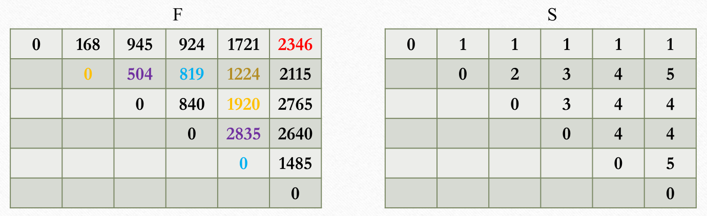{width=12cm}

- $M_1$ is $7 \times 3$, $M_2$ is $3 \times 8$, $M_3$ is $8 \times 21$, $M_4$ is $21 \times 5$ and $M_6$ is $27 \times 11$.
- $S[i][j]$ stores the index at which to split $M_i \times \dots \times M_j$.
- `eg` $\min\{F[2][2] + F[3][5] + 3 \cdot 8 \cdot 27, F[2][3] + F[4][5] + 3 \cdot 21 \cdot 27,  F[2][4] + F[5][5] + 3 \cdot 5 \cdot 27 \} = 1224$.
    - $1224$ is the optimal cost for computing $M_2 \times M_3 \times M_4 \times M_5$. 
- The optimal ordering is $(M_1 \times ((((M_2 \times M_3) \times M_4) \times M_6))$ and the cost is $2346$.

## Metrics and laws

### Example 1 - Metrics

- Parallelize the following problem by using an array of **processing elements** (PEs).
    - *Input*: array $A$ of $n$ numbers
    - *Output*: $\sum_{i=0}^{n=1} A[i]$.
- Assumptions (**unrealistic**):
    - Assumed steplock working.
    - *Computation*: each PE can add two numbers stored in its local memory in $1 \: s$.
    - *Communication*: a PE can send data from its local memory to the local memory of any other PE in $3 \: s$.
        - Independently of the data size.
    - *Input and Output*:
        - At the beginning of the program, the whole array $A$ is stored in PE $\#0$.
        - At the end, the result must be gathered in PE $\#0$.
    - *Synchronization*: all PEs operate in a lock-step manner.
        - They can either compute, communicate or be idle.
        - No computation-to-communication overlap.
- **PCAM analysis**:
    - *Partitioning*: the smallest task is the sum of two array elements.
    - *Communication*: all tasks are independent, the result is sent to processor $\#0$.
    - *Agglomeration*: a contiguous partition of the initial array is assigned to one PE.
        - Each PE computes locally the sum and sends the result to processor $\#0$.
    - *Mapping*: a partition is mapped to one of the $p$ processors.

#### Runtime analysis

- Establish runtime as a baseline ($p=1$):
    - $T(1, n) = n - 1 \: s$.
- Establish runtime for $2$ PEs and $1024$ numbers:
    - $T(2, 1024) = 3 + 511 + 3 + 1 = 518 \: s$.
    - Speedup: $\frac{T(1, 1024)}{T(2, 1024)} = \frac{1023}{518} = 1.975$.
    - Efficiency: $\frac{1.9752}{2} = 98.75\%$.
- Establish runtime for $4$ PEs and $1024$ numbers:
    - PE $\#0$ is connected to PE $\#1$ and PE $\#2$, $\#1$ is connected to $\#3$. 
    - $T(4, 1024) = 3 * 2 + 255 + 3 * 2 + 2 = 269 \: s$.
    - Speedup: $\frac{T(1, 1024)}{T(4, 1024)} = \frac{1023}{269} = 3.803$.
    - Efficiency: $\frac{3.803}{4} = 95.07\%$.
- Establish runtime for $8$ PEs and $1024$ numbers:
    - $\#0$ is connected to $\#1$, $\#2$ and $\#4$; $\#1$ to $\#3$ and $\#5$; $\#2$ to $\#6$; $\#3$ to $\#7$.
    - $T(8, 1024) = 3 * 3 + 127 + 3 * 3 + 3 = 148 \: s$.
    - Speedup: $\frac{T(1, 1024)}{T(8, 1024)} = \frac{1023}{148} = 6.91$.
    - Efficiency: $\frac{6.91}{8} = 86\%$.
- Timing analysis using $p = 2^q$ PEs and $n = 2^k$ input numbers:
    - Data distribution: $3 * q$.
    - Computing local sums: $\frac{n}{p} -1 = 2^{k-q} - 1$.
    - Collection partial results: $3 * q$.
    - Adding partial results: $q$.
    - $T(p, n) = T(2^q, 2^k) = 3q + 2^{k-q} - 1 + 3q + q = 2^{k-q} - 1 + 7q$.

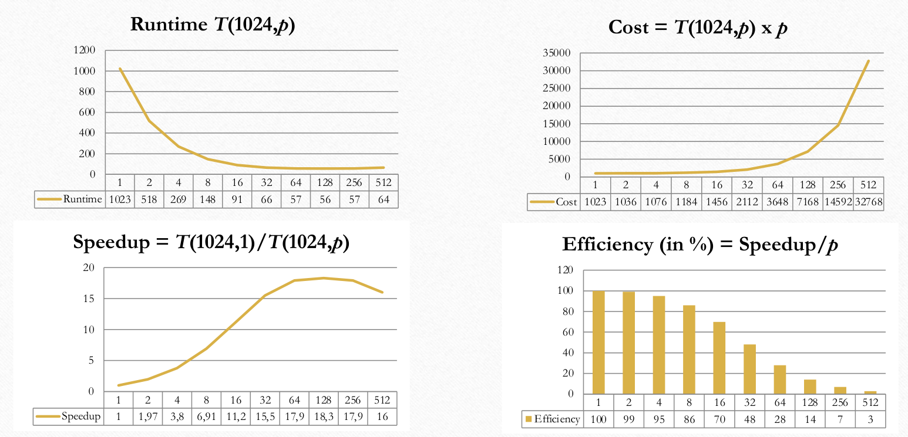{width=12cm}

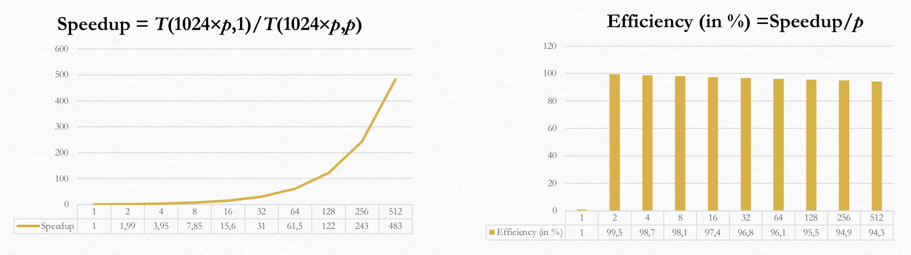{width=12cm}

-----

### Example 2 - Amdahl's law

- $95\%$ of a program's execution time occurs inside a loop that can be executed in parallel.
    - Determine the maximum speedup to be expected from a parallel version execution on $6$ CPUS.
        - $S(6) \leq \frac{1}{0.05 + \frac{1 - 0.05}{6}} = 4.8$.
- $10\%$ of a program's execution time is spent within inherently sequential code.
    - Determine the limit to the speedup achievable by a parallel version of the program.
        - $S(\infty) \leq \lim_{p \to \infty} \frac{1}{0.1 + \frac{0.9}{p}} = 10$.

-----

### Example 3 - Scaled speedup law

- A parallel problem is $15\%$ serial and $85\%$ linearly parallelizable.
    - Assumption: the (absolute) serial time does not grow as the problem size is scaled.
    - Determine how much speedup can be achieved if $50$ processor are used without scaling the problem.
        - $S_{\gamma = 1}(50) \leq \frac{f + \gamma * (1-f)}{f + \frac{\gamma * (1-f)}{p}} = \frac{1}{0.15 + \frac{0.85}{50}} = 5.99$.
    - Determine the speedup with $50$ processor if the problem is then scaled up by a factor of 100.
        - $S_{\gamma = 100}(50) \leq \frac{f + \gamma * (1-f)}{f + \frac{\gamma * (1-f)}{p}} = \frac{0.15 + 100 * 0.85}{0.15 + \frac{100 * 0.85}{50}} = 46.03$.

-----

### Example 4 - Gustafson's law
 
- A program should achieve a speedup of $100$ using $128$ processor.
    - Determine the maximum sequential fraction of the program with the assumption of **strong scalability**.
        - $100 = \frac{1}{f + \frac{1-f}{128}} = \frac{128}{128 * f + 1 - f} = \frac{128}{127 * f + 1} \implies f = \frac{0.28}{127} = 0.0022$.
    - Determine the maximum sequential fraction of the program with the assumption of **weak scalability** (whereby $\gamma$ scales linearly).
        - $100 = 128 + f (1-128) = 128 - 127 * f \implies f = \frac{28}{127} = 0.22$.

## Models of computation

### Example 1 - Prefix computation in PRAM

- Binary **associative** operation $\circ$ on the set $X$: $X \times X \to X$.
    - $(x_i \circ x_j) \circ x_k = x_i \circ (x_j \circ x_k)$ for all $x_i, x_j, x_k \in X$.
    - `eg` Addition, multiplication, minimum, maximum, string concatenation, boolean AND/OR.
- $X = \{x_0, \dots, x_{n-1}\}$, $x_i \in X$ for all $i=0, \dots, n-1$.
    - We want to compute $s_0 = x_0$, $s_1 = x_0 \circ x_1$, $\dots$, $s_n = x_0 \circ x_1 \circ \dots \circ x_{n-1}$.
    - Therefore, $s_0 = x_0$, $s_i = s_{i-1} \circ x_i$ for $i=1, \dots, n-1$.
- **Prefix computation**: obtaining $S = \{s_0, \dots, s_{n-1}\}$ from $X = \{x_0, \dots, x_{n-1}\}$.
- Let's consider as $\circ$ the *minimumum* operation:
    - *Input*: $\{39, 21, 20, 50, 13, 18, 2, 33, 49, 39, 47, 15, 30, 47, 24, 1\}$.
    - *Output*: $\{39, 21, 20, 20, 13, 13, 2, 2, 2, 2, 2, 2, 2, 2, 2, 1\}$.
    - Lower bound: $\Omega(n)$.

#### Parallel Prefix in PRAM

- **Parallel Prefix on PRAM** (with $\circ = +$):
    - Goal: design a cost-optimal PRAM algorithm, i.e. $C(n) = O(n)$.
    - We use the **recursive doubling algorithm** using $p=n$ processors.
        - $C(n) = T(n, p) \times p = O(\log n) \times n = O(n \times \log n$).
        - Thus, this algorithm is not cost-optimal when using $p=n$ processors.
        - For several steps, **several processors are idling**.

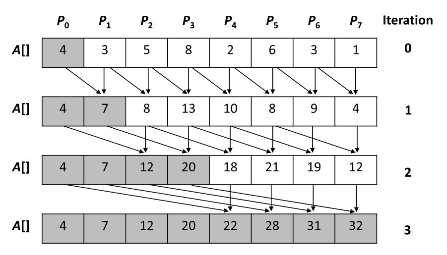{height=5cm}

```c
for (j = 0; j < n; j++) do_in_parallel              // each processor j
    reg_j = A[j];                                   // copies one value to a local register
for (i = 0; i < ceil(log(n)); i++) do               // sequential outer loop
    for (j = pow(2, i); j < n; j++) do_in_parallel  // each proc. j
        reg_j += A[j - pow(2, i)];                  // performs computation
        A[j] = reg_j;                               // writes result to shared memory
}
```

- **Cost-optimal Parallel Prefix on PRAM** (with $\circ = +$):
    - To reduce the cost $C(n) = T(n, p) \times p$ the number of processors used can be **reduced**.
    - Algorithm (with $p = \frac{n}{\log n}$ processors):
        1. Partition the $n$ input values into chunks of size $\log n$.
            - Each processor computes local prefix sums of the values in one chunk in parallel, $O(\log n)$.
        2. Perform the old non-cost-optimal prefix sum algorithm on the $\frac{n}{\log(n)}$, $O(\log \frac{n}{\log n})$.
        3. Each processor add the valued computed in $(2)$ by its left neighbor to all values of its chunk, $O(\log n)$.
    - $C(n) = T(n, p) \times = O(\log n) \times O(\frac{n}{\log n}) = O(n)$.
        - Each step of each processor is of length $\log n$ (and not $1$).
    - The following is a cost-optimal parallel Prefix implementation on a EREW PRAM (using $p = \frac{n}{\log n}$ processors).
        - In this implementation, $n = 2^k$ and thus $p = \frac{n}{k}$.
    - The GPU implementation is similar (but with different access times).

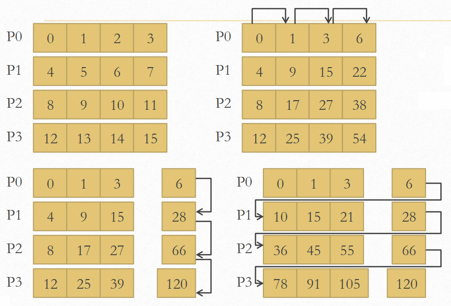{width=10cm}
 
```c
// Stage 1: each Processor i computes a local prefix sum
// of a subarray of size n/p = log(n) = k
for (i = 0; i < n / k; i++) do_in_parallel
    for (j = 1; j < k; j++) do
        A[i*k+j] += A[i*k+j-1];

// Stage 2: Prefix summation using only the rightmost value
// of each subarray (O(log(n/k)))
for (i = 0; i< log(n / k); i++) do
    for (j = pow(2, i); j < n / k; j++) do_in_parallel
        A[j*k-1] += A[(j-pow(2, i))*k-1];

// Stage 3: each Proc i adds the value computed in Step 2 by Proc i-1 to
// each subarray element except for the last one
for (i = 1; i < n / k; i++) do_in_parallel
    for (j = 0; j < k - 1; j++) do
        A[i*k+j] += A[i*k+j-1];
```

-----

### Example 2 - Sparse array compaction in PRAM

- Given a one-dimensional array $A$ where most entries are zeros.
    - Sparse matrices are nowadays ubiquitous in AI and scientific fields.
    - Nowadays, hardware vendors are adding specialized hardware to handle array sparsity.
- A more memory-efficient way to store a sparse array is to only store:
    - The values of the **non-zero entries** (in $V$).
    - Their corresponding **coordinates** (in $C$).

#### Sparse array compaction in PRAM

- A parallel prefix approach using $p = \frac{n}{\log n}$ processors.
- A temporary array ($tmp$) with $tmp[i] = 1$ if $A[i] \neq 0$ and $tmp[i] = 0$ otherwise (*mask*).
    - A parallel prefix summation on $tmp$ is preformed.
    - For each non-zero element of $A$, the respective value stored in $tmp$ now contains the destination address for that element in $V$.
- The non-zero elements of $A$ are written to $V$ using the addresses generated by the parallel prefix summation.
    - The respective coordinates can be written to $C$ in a similar way.
- With $V$ there is an extra array $C$ to store original positions.
- $C(n) = T(n, p) \times p = O(\log n) \times O(\frac{n}{\log n}) = O(n)$.

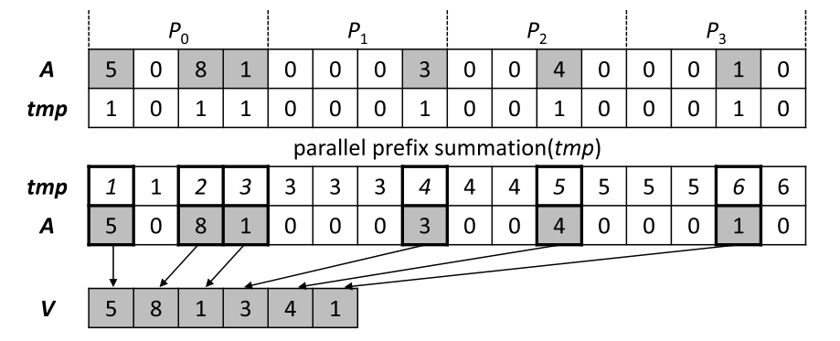{width=10cm}

-----

### Esempio 3 - Dot product in BSP

- Dot product: $\alpha = a^T \cdot b = \sum_{0}^{n-1} a_i b_i$.
    - With $a = [a_0, \dots, a_{n-1}]^T$ and $b = [b_0, \dots, b_{n-1}]^T$.
    - `eg` With $[3, -1, 2, 5, -3, 1, 4, -6, 8, 10]$ and $[2, 11, 1, 3, -7, 21, 0, -5, 2, -2]$, $\alpha = 80$.
- With $p$ processors and a **cyclic distribution** of the two arrays $a$ and $b$:
    - `def` **Cyclic distribution**: $a_i, b_i \to p_{i \mod p}$, with $i \in [0, n]$.
    - Each processor computes a **local partial dot product**.
    - $3$ supersteps, in the end all $p$ processor will compute $\alpha$.
        - $C_{dot \: product} = 2 * \lceil \frac{n}{p} \rceil + p + (p - 1) * g + 3l$.

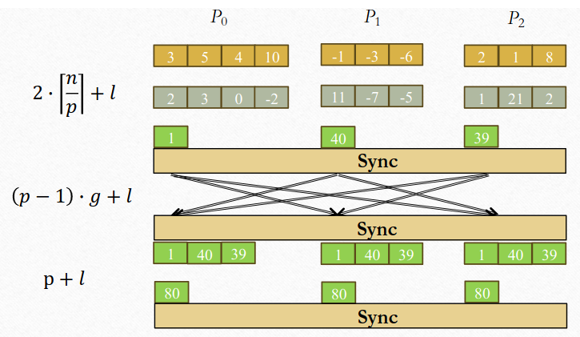{width=12cm}

## Data parallelism

### Example 1 - Jacobi Method

- Solving a General System of Linear Equation **by Iteration**.
    - Suppose the equations are of a general form with $n$ equations and $n$ unknowns.
        - $a_{n-1,0} x_0 + a_{n-1, 1} x_1 + \dots + a_{n-1, n-1} x_{n-1} = b_{n-1}$.
        - Where the unknowns are $x_0, x_1, \dots x_{n-1}$ ($0 \leq i < n$).
    - The $i$-th equation is rearranged as follow:
        - $a_{i,0} x_0 + a_{i, 1} x_1 + \dots + a_{i, n-1} x_{n-1} = b_{i} \to x_i = \frac{1}{a_{i, i}}[b_i - (a_{i, 0}x_0 + \dots + a_{i,n-1}x_{n-1})]$.
        - $x_i = \frac{1}{a_{i, i}}[b_i - \sum_{j \neq i} a_{i, j} x_j]$ gives $x_i$ in terms of the other unknowns.
        - It can be use as an **iteration formula** for each of the unknowns to obtain better approximations.
    - **Jacobi Iteration**:
        - All values of $x$ are updated **together**.
        - Can be proven that Jacobi Method will converge if $\sum_{j \neq i} |a_{i,j} < |a_{i, i}|$.
            - This condition is a sufficient but not a necessary condition.
    - Termination (common approach):
        - Compare values computed in one iteration to values obtained from the previous iteration.
        - $|x_i^t - x_i^{t-1}| < \text{error-tollerance}$ (for all $i$).
        - This does not guarantee the solution to that accuracy.

```c
// Process P_i
x[i] = b[i];                            // initialize unknown
for (i = 0; i < limit; i++) {
    sum = -a[i][i] * x[i];
    for (j = 0; j<n; j++) {             // compute summation
        sum = sum + a[i][j] * x[i];
    }
    new_x[i] = (b[i] - sum) / a[i][i];  // compute unknown
    allgather(&new_x[i]);               // bcast/rec values
    global_barrier();                   // wait for all procs
}
```

- Code analysis:
    - `allgather()` sends the newly computed `x[i]` from process $i$ to every other process.
        - And collects data broadcast from the other processes.
    - The global barrier is not needed but it's inserted to ensure that `allgather()` is blocking.
    - By analysing the number of processors plotted over execution time:
        - The intersection point of the *comm* and *comp* curves corresponds to the **maximum speedup**.
        - The overall curve will start do decrease up to the intersection point, and then it will start to increase again.
