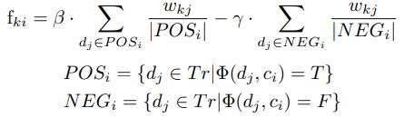
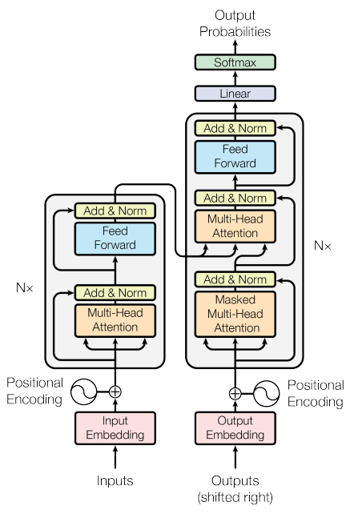

# Riassunto Radicioni

> Riassunto di alcuni argomenti di Radicioni...
> Scritto da Gabriele Naretto, aka Spectralwall, ed una persona anonima :alien:
> Mi dispiace per eventuali errori di grammatica :-(

## Introduzione alla Semantica Lessicale

Prima di tutto il professore introduce il concetto di ontologia, Un ontologia è un sistema di strutturato di entità (che si assume esistano), organizzato in categorie e relazioni. Inoltre un ontologia definisce un insieme di primitive rappresentazionali con la quali modellare un dominio di conoscenza del discorso.

- Le primitive rappresentano classi e relazioni
- Le loro definizioni includono informazioni sul loro significato e vincoli su come applicarle in maniera logicamente consistente.

Per dirlo in altri termini un _Ontologia_ è un specifica di una concettualizzazione. Quindi la realtà è rappresentata da un agente e questa rappresentazione è indipendente dal vocabolario usato e dalle attuali occorrenze di una situazione. Quindi due differenti situazioni che hanno come oggetto la stessa cosa, possono essere descritti in due modi diversi ma possono essere la stessa concettualizzazione.
Introduciamo poi il concetto di _Semantica_, per dirla in modo semplice l'ontologia riguarda cosa c'è, la semantica si riferisce a quello che c'è. 
Le ontologie possono inoltre essere rappresentate come KBs (Knowledge Base) ovvero basi di conoscenza. Sia da un punto di vista terminologico che assertionale. La basi di conoscenza sono formate da due parti:

- Teminological component (T-box), rappresenta proprio la parte terminologica, proprio dell’ontologia e indipendente da un particolare stato. In questo livello definiamo per esempio che "gli uccelli volano".
- Assertional component (A-box) che riflette lo stato della realtà, ovvero le istanze del'ontologia. In questo livello definiamo per esempio che "Tweety vola".

#### Relazioni lessicali

Le Ontologie hanno anche un livello lessicale, ovvero l'insieme delle parole di una lingua (un vocabolario che contiene una forma di conoscenza su come usiamo le parole). Questi elementi lessicali possono avere diverse relazioni tra loro:

- **Sinonimia**: Abbiamo due termini $A$ e $B$ e diciamo che $A$ è un sinonimo di $B$ se entrambi condividono lo stesso significato.
- **Iponimia**: Abbiamo due termini $A$ e $B$ e diciamo che $A$ è un iponimo di $B$ se $A$ è **sotto classe** di $B$, quindi $A$ è **più specifico** di $B$.
- **Iperonimia**: Abbiamo due termini $A$ e $B$ e diciamo che $A$ è un iperonimo di $B$ se $A$ è **sovra classe** di $B$, quindi $A$ è **più generico** di $B$.
- **Meronimia**: Abbiamo due termini $A$ e $B$ e diciamo che $A$ è un meronimo di $B$ se $A$ è **parte** di $B$.  
- **Antinomia**: Abbiamo due termini $A$ e $B$ e diciamo che $A$ è un antinomio di $B$ se $A$ ha significato **opposto** di $B$.
- **Polisemia**: Abbiamo due termini $A$ e $B$ e diciamo che $A$ è un polisemia di $B$ se entrambe sono lo stesso termine, ma hanno significato diverso.

Queste relazioni potrebbero essere riconducibili a costrutti ontologici come _"part_of"_ o _"sub_class"_ ma non bisogna confondersi. Nelle ontologie le sotto categorie sono intese come mutualmente esclusive mentre nel lessico esistono delle sovrapposizioni di significati. Inoltre il lessico di un linguaggio ometterà qualsiasi riferimento a categorie ontologiche che non sono lessicalizzate in quel linguaggio.

Come facciamo a valutare se due entità sono in relazione di sotto classe ?  Per farlo possiamo utilizzare la nozione di criteri di identità: i criteri di identità sono proprietà necessarie delle entità confrontate. In pratica si confronta il criterio di entrambe le classi e si capisce se queste hanno una relazione di iponimia/iperonimia.

**Nota**: Questi relazioni sintattiche sono molto importi perché saranno alla base di alcune risorse che vedremo più avanti (WordNet).

#### Perché creare ontologie ?

Una domanda che sorge spontanea è "come mai dobbiamo costruire le ontologie ?". Ebbene queste ci permettono la condivisione della comprensione (descrizione) delle entità di un certo dominio, permettendo di condividere (fra persone, software e agenti), riutilizzare (per non dover ogni volta partire da 0 e introdurre standard) e sopratutto creare comunità di ricerca.

#### Entità ed Eventi

Un concetto fondamentale per le ontologie sono eventi ed entità.
Le **entità** sono oggetti che continuano per un periodo di tempo mantenendo la propria identità. Questo concetto è molto legato a quello di _Endurants_ che dice che un entità può essere vista nel suo completo in qualunque momento la si guardi.
Gli **eventi** sono invece oggetti che accadono in un certo momento, si svolgono e si sviluppano nel tempo. Questo concetto è molto legato a quello di _Perdurants_ che dice che un evento se osservato in un determinano momento non sarà visibile completamente, ma solo nella parte osservata.

#### Ontologie fondazionali

Le ontologie fondazionali sono tra le più importanti di tutte, queste catturano un insieme di distinzioni base valide in vari domini, tali distinzioni possono essere più o meno utili a seconda del contesto applicativo. Un esempio di ontologia fondazionale _Dolce_ che sviluppa tre concetti:

- Relazione tra endurance e perdurance: gli endurance esistono nel tempo, possono cambiare naturalmente nel tempo, possono essere costituiti da parti non essenziali e tutte le parti essenziali che li compongono sono sempre presenti e non decadono. Mentre i perdurants accadono in una finestra temporale, non cambiano nel tempo, ogni parte è essenziale, ma non è detto che tutte le parti essenziali siano presenti nel tempo.
In Dolce gli _endurance possono partecipare ai perdurance_.
- Teoria della qualità: dove le qualità servono a descrivere gli oggetti, e i valori delle qualità vengono presi da un **quality space** associato. Quando diciamo che due rose hanno lo stesso colore intendiamo che nel Quliity Space hanno la stessa posizione.
- Approccio moltiplicativo: afferma che oggetti/eventi diversi possono trovarsi nella stessa posizione spaziotemporale mantenendo però proprietà distinte. L’argilla di cui un vaso è costituito si troverà fisicamente nello stesso posto del vaso, ma sarà considerata un’entità diversa. Le due entità restano separate perché possiedono delle caratteristiche tipiche che non si trovano nell’altra entità e viceversa.

## Knowledge Representation

Una volta introdotta la semantica lessicale parliamo di come viene rappresentata la conoscenza. Il settore dell’IA noto come rappresentazione della conoscenza studia i formalismi adatti a rappresentare le conoscenze necessarie ai programmi di IA. Per soddisfare questo compito è necessario:

- Un linguaggio di rappresentazione ossia di un insieme di strutture sintattiche adatte a codificare l'informazione
- Un insieme di regole, o di operazioni per manipolare le strutture sintattiche in accordo con il loro significato. Le regole devono avere procedure effettive. L'applicazioni di queste regole deve inoltre portare a inferenza.

Queste strutture possono essere molteplici, un esempio sono le formule logiche, il problem della logica è che non è possibile collegare le varie formule in blocchi omogenei, quindi abbiamo bisogno di ulteriori meccanismi computazionali.

### Reti Semantiche

Ci vengono in aiuto le **reti semantiche**, una struttura formulata come un grafo, in cui i nodi rappresentano i concetti e gli archi rappresentano le relazioni o le proprietà dei concetti.
Le più semplici reti semantiche sono costituite dai **grafi relazionali**, che permettono di descrivere le relazioni fra le diverse entità.
I grafi possono rappresentare stati del mondo, come il mondo dei blocchi.

Ogni nodo del grafo è una data entità, abbiamo poi le relazioni tra i nodi (ovvero gli archi).
La cosa veramente importante è che da un punto di vista formale, i grafi relazionali implementano un sottoinsieme del calcolo dei predicati del primo ordine, in cui gli _archi corrispondono ai predicati_ e i _nodi corrispondono ai termini_. L'espressività del grafo è pero limitata poiché può solo rappresentare l'idea di congiunzione (blocco rosso e verde) e non rappresenta quella di disgiunzione (blocco rosso o verde). 

Esprime quantificatori esistenziali è molto facile abbiamo un problema quando si vogliono esprimere i quantificatore universali (il prof non dice come si risolve questo fatto).

Abbiamo poi un altro problema, ovvero che tutte le relazioni che esprimiamo sono binarie. Quindi se volessimo esprimere un fatto con arita superiore a due (relazioni ternario o superiori) dovremmo tradurre il tutto in relazioni binarie, questo porta ad un aumento esponenziale della complessità.
Durante queste trasformazione, una relazione rappresenterà il tipo di un predicato, mentre le altre rendono espliciti ruolo e funzione degli argomenti del predicato stesso. È sempre possibile tradurre le relazioni ‘a elevata granularità’ in formule del calcolo dei predicati: le asserzioni così ottenute perdono però di significatività.

#### Reti Proposizionali

A questo punto abbiamo un evoluzione, il professore introduce le **Reti proposizionali**, ovvero reti semantiche i cui nodi possono rappresentare non solo entità semplici, ma intere proposizioni.
Ammettendo la possibilità di avere nodi proposizionali si accresce la
ricchezza espressiva del linguaggio, ed è quindi possibile introdurre i connettivi logici e dei contesti all’interno dei quali fare operare i quantificatori.

Vediamo quindi come introdurre i connettivi logici:

- La **negazione** può essere rappresentata mediante un arco che collega il
risultato della negazione con la proposizione che viene negata. La negazione ci permette di aprire un mare di possibilità, come negare intere proposizioni, oppure negare parte di una proposizione.
- La **disgiunzione** (OR) fatta la negazione e sapendo che la congiunzione è implicita nella rappresentazione possiamo usare le leggi di De Morgan per crearla. Passando da $A\wedge B$ a $\neg(\neg A \wedge \neg B)$
- I **quantificatori** e il loro annidamento sono possibili da realizzare, questo però introduce molte complicazioni nella rete. Pertanto _la scelta fra l’utilizzo della logica e delle reti semantiche come linguaggio di rappresentazione della conoscenza non è risolvibile in termini di potere espressivo, quanto in base ad altri criteri, quali la leggibilità, la flessibilità, l'efficienza e la facilità di espressione_.

##### Conoscenze Gerarchica

Molte delle nostre conoscenze possono essere organizzate gerarchicamente molte delle entità che conosciamo possono essere raggruppate in classi, che a loro volta possono essere raggruppate in super classi di ordine sempre più elevato. Inoltre queste gerarchie non si limitano agli oggetti, ma possono
comprendere anche azioni e concetti astratti.
Anche in questo caso le reti semantiche possono venirci in aiuto, perché sono un formalismo di rappresentazione adatto per modellare conoscenze gerarchiche di questo tipo.
In particolare la relazione che ci serve è quella di **Is_A**, che ricordiamo è una relazione transitiva. Possiamo quindi ora rappresentare grandissime gerarchie di conoscenza, ma ci sovviene una domanda. Essendo che la relazione Is_A ci permette in modo facile di fare inferenza "_quali conoscenze devono essere rappresentate esplicitamente e quali
possono essere dedotte al momento necessario?_". Per rispondere a questa domanda ci sono due approcci:

- **Rappresentare solo i legami essenziali**: la rete conterrà unicamente i legami isA, che connettono ciascun nodo con la classe immediatamente super ordinata, evitando di rappresentare i legami che possono essere inferiti navigando il grafo attraverso uno o più archi. Questo rende più _efficiente l'uso della memoria_, ma causerà un _aumento dei tempi di calcolo_ poiché ogni volta si farà inferenza.
- **Rappresentazione per chiusura transitiva**: la strategia consiste nel rappresentare esplicitamente tutti i possibili legami isA fra i vari nodi della rete, rappresentando così la chiusura transitiva della relazione. Questo _accelera di molto la computazione a livello di tempo_, ma _aumenta di molto la memoria_ necessaria dovendo salvare tutte le relazioni, inoltre si ha una _difficoltà nel mantenimento della base di conoscenze_.
- La soluzione è ovviamente un **tradeof** in cui si salvano le relazioni più importanti, che potremmo definire gli archi "scorciatoia" in modo da connettere i nodi più frequenti cosi da evitare di fare inferenza ogni volta.

Un altro vantaggio delle reti semantiche applicate a contesti gerarchici è il meccanismo di eredità delle proprietà, questo ci permette di verificare le proprietà di un nodo solo guardando i suoi antenati (ovvero vedere se una antenato possiede quella proprietà).

Vediamo quindi quali sono i vantaggi e svantaggi delle reti semantiche con gerarchie ed ereditarietà:

- Vantaggi:
  - **Economia della rappresentazione**: Ovvero _si usano meno nodi per rappresentare il tutto e le proprietà sono ereditate_. Questo rendere anche _più facile fare manutenzione e modifica della rete_.
  - Uso di **eccezioni** per nodi che non devono ereditare le proprietà. Come gli uccelli non volanti.
  - **validità per default**: risalendo la gerarchia un passo alla volta per verificare un proprietà ci permette di ottenere il valore associato al caso eccezionale prima di giungere a quello valido per default.
- Svantaggi:
  - **Eredità multipla**: Questo è sia un pro che un contro, ma io lo messo come contro poiché si possono causare conflitti di proprietà. Inoltre il tempo di ricerca passa da un tempo lineare a uno esponenziale.
  - **Tecniche di ricerca**: Le tecniche di ricerca non sempre danno dei risultati corretti, un esempio è il caso di Nixon che è sia quacchero sia repubblicano. Se usassimo un algoritmo che ritorna tutti i risultati otterremo un inconsistenza, gli algoritmi in ampiezza e in profondità dipendono dalla struttura della rete. Quindi la struttura della rete e l'algoritmo possono portare a soluzioni diverse o addirittura inconsistenti.
  Una soluzione potrebbe essere di dare due risultati diversi ognuno consistente, ma questo causa dissonanza cognitiva.
  - **Appartenenza e Inclusione**: non abbiamo una distinzione tra nodi che rappresentano classi e nodi che rappresentano individui. Di conseguenza, il legame isA viene utilizzato per denotare sia la relazione di appartenenza (di un elemento a un insieme) sia di inclusione (di un insieme in un altro insieme); Inoltre non esiste modo per distinguere fra proprietà vere per tutti gli individui appartenenti a una data classe e proprietà che sono vere della classe in quanto tale. In pratica non abbiamo una semantica formale ovvero "manca un insieme universalmente accettato di convenzioni su ciò che la rete rappresenta";

### Frame

I frame sono un formalismo che presenta vari punti di somiglianza con le reti semantiche. Il concetto dietro i frame è semplice "_Le persone utilizzano un insieme strutturato di conoscenze per interpretare le diverse situazioni che si trovano a dovere affrontare. Di fronte alle situazioni in cui ci si imbatte non si parte da zero: al contrario si recupera dalla memoria una rappresentazione a carattere generale (frame) che viene poi raffinata e modificata per rendere conto dei dettagli della situazione corrente._". 
Quindi i frame sono una struttura  che rappresenta le conoscenze di carattere generale che un individuo ha riguardo situazioni, luoghi, oggetti, personaggi stereotipati. Fornisce una cornice concettuale all’interno della quale i nuovi dati vengono interpretati alla luce delle conoscenze derivate dall’esperienza precedente.

> **Nota**: Questi concetti sono gli stessi alla base di FrameNet, ovvero avere dei frame di situazioni e contesti noti.

I frame **_aiutano il processo di interpretazione delle situazioni ambigue_**.

I frame servono a organizzare le conoscenze relative a un certo dominio in modo da **_facilitare il reperimento delle informazioni_** e **_i processi
inferenziali necessari per agire in modo intelligente_**.

Analogamente alle reti semantiche, i frame rappresentano le conoscenze in modo dichiarativo ma privo di una semantica formale. Pertanto, parlando di frame bisogna presupporre l’esistenza di procedure in grado di utilizzare le informazioni in essi contenute. Quindi vogliamo capire come fare inferenza sulle informazioni dei frame.

- Una prima teoria dice che le persone organizzano i concetti su **tre livelli**.
  - **Base**: il livello di mezzo, nel _nostro esempio qua avremo il concetto sedia_. I concetti di base costituiscono il modo naturale di categorizzare gli oggetti e le entità di cui è formato il nostro mondo, e sono le prime categorie che gli esseri umani apprendono.
  - **Super ordinate**: livello più generale, ovvero il concetto più generale che include tutti gli altri. _Nel nostro esempio avremo il concetto mobile_. I concetti super ordinati traggono origine da una generalizzazione dei concetti di base.
  - **Subordinate**: livello più specifico, _nel nostro esempio avremo il concetto sedia da ufficio_. I concetti subordinati sono una specializzazione dei concetti di base.

L’appartenenza categoriale non viene caratterizzata tramite un elenco di attributi necessari e sufficienti, ma nei termini di una maggiore o minore somiglianza rispetto a membri tipici della categoria, o prototipi.
Queste idee sono state recepite nei linguaggi di rappresentazione dei frame: _tutti i sistemi a frame permettono di ragionare intorno a classi di oggetti usando delle rappresentazioni prototipiche che, valide in linea di massima, hanno bisogno di venire adattate e modificate per tener conto della complessità del mondo._

Per applicare questa teoria si userà un sistema gerarchico. In cui i sistemi a frame organizzano le conoscenze in strutture gerarchiche i cui elementi sono collegati fra loro da espressioni di tipo isA o ako (a kind of) che consentono la trasmissione ereditaria delle proprietà. Le proprietà dei frame ad alto livello restano fisse (rappresentando fatti veri per la classe), mentre i livelli più bassi, sottoclassi o istanze individuali, possono essere contraddistinti da proprietà specifiche, anche in contrasto con quelle delle super classi.

#### Struttura di un frame

Ogni frame ha un **_nome che identifica univocamente_** l’oggetto che esso rappresenta; **_le caratteristiche dei vari oggetti sono rappresentate mediante un insieme di slot_**: uno slot è una casella in cui viene inserito un determinato tipo di informazione.

In alcuni casi non è possibili conoscere il valore di default di un frame ed entrano quindi in gioco i valori di default, questi possono essere anche ereditati dal livello superiore.

Alcuni frame possono avere l'ereditarietà multipla, e quindi possibile ottenere conflitti fra i valori ereditati.
Abbiamo pero delle differenze sui vari meccanismi di ereditarietà. I più flessibili permettono di scegliere la strategia di ricerca (profondità vs. ampiezza), di limitare il numero di livelli entro i quali va cercato la proprietà desiderata, di definire un frame universale che viene consultato sempre e comunque.

Un altra caratteristica dei frame e che gli **slot possono essere strutture complesse**, un esempio è un frame che ha come slot un indirizzo.

Altre alla parte dichiarativa, i frame possono avere anche una parte procedurale. è possibile associare ai vari slot delle procedure in modo da rendere la computazione più efficiente. Un esempio sono ereditarietà e valori di default per riempire uno slot, questi metodi possono essere integrati con delle euristiche e conoscenze di dominio. Abbiamo due procedure:

- **_Procedure if needed_**: procedure che codificano metodi ad-hoc per il calcolo del valore di uno slot qualora sia richiesto dal processo di elaborazione in corso
- **_Procedure if added_**: rimangono silenti finché non si tenta di riempire un qualche valore lo slot a cui sono associate

### Teoria del Significato

In informatica le ontologie sono una concettualizzazione formale del mondo, spesso rappresentano relazioni fra concetti e classi rappresentate.
Inoltre un'ontologia formale specifica un insieme di vincoli che dichiarano cosa dovrebbe necessariamente tenere in un modello.

Nel tempo ci sono state diverse teorie che hanno cercato di spiegare il significato delle parole.

- **_Prototype theory:/Teoria dei Prototipi_**: Un prototipo è un approssimazione statisticamente rilevante e rappresentava di una categoria. Potremmo vederla come la teoria che spiega il significato di concetto in base alla vicinanza col prototipo della categoria.**è uno strumento per rappresentare le tipicalità delle classi.**

- **_Exemplar theory/Teoria dell'esempio_**: la rappresentazione mentale di un concetto è il set di rappresentazioni di alcuni esempi della categoria, che abbiamo sviluppato nel tempo. Un esempio è che noi sappiamo cose un gatto perché abbiamo visto molti esemplari di questa categoria nel tempo, siamo cosi giunti alla generalizzazione del concetto "gatto".

- **_Theory theory_**: i concetti fanno parte della comprensione del mondo, visione evolutiva, relazioni con altri concetti importanti.

l'Ipotesi eterogenea dice che prototipi ed esemplari possono co-esistere.
Questi approcci sono stati formulate come alternativi, ma in realtà ci sono sistemi che mettono insieme I diversi meccanismi di prioirtà per le diverse forme di rapressentazione. Man mano che il Sistema include nuove esempi I prototipi ed esemplari possono cambiare in modo dinamico nel tempo, per continuare a migliorare l'accuratezza.

Ci sono inoltre dei sistemi che però combinano queste teorie insieme alle ontologie formali. Vediamo quali sono. Questa teoria si ispirano alle “Dual Process Theories” nate nel campo della psicologia del ragionamento e della razionalità.

Secondo le teorie del processo duale, esistono due diversi tipi di processi cognitivi e sistemi, essi sono chiamati _system1_ e _system2_.

1. **System1**: è implicito e inconscio. Nel senso che l’elemento che triggera la procedura è legato alla sensoristica. sono instinti automatici.
Sono meccanismi profondi ed evolutivi e noi possiamo assimilarli in modo veloce $\rightarrow$ Sono processi altamente paralleli e veloci nella computazione.
Sono indipendenti dal linguaggio: classi di processi che hanno una rappresentazione e manipolazione sotto-simbolica ed assimilarli a reti.
Hanno un tratto contestuale: sono processi che mettono il sistema in rapporto con il mondo.
E’ l’insieme dei processi che permettono ai nostri antenati di sopravvivere (astrazione semplice).
**In pratica l'insieme di istindi di sorpavivenza innati che abbiamo.**

2. **System2**: Sistema conscio, si è evoluto recentemente, possiamo controllarlo ed è correlato al linguaggio. Abbiamo processi molto lenti e sequenziali. è la classe di sistemi che ci permette di fare inferenza e lavorare in modo astratto.
**In pratica l'insieme di processi che ci permettono di fare inferenza e lavorare in modo astratto.**

Tutto quello che è vettoriale appartiene a system1 mentre tutto quello che è ontologico appartiene a system2.

Inoltre abbiamo delle abilità concettuali cruciali che possonoe ssere viste in system1 e system2.

## Risorse Ontologiche

### WordNet

Wordnet è un dizionario online per il riferimento lessicale di sostantivi, verbi, aggettivi e avverbi inglesi. Il tutto viene organizzato in base ai significati dei termini. In particolare abbiamo quattro tipi di organizzazioni:

- Sostantivi: organizzati tramite una gerarchi
- Verbi: organizzati in una varietà di relazione di implicazione
- Aggettivi e Avverbi: organizzati in uno spazio N-dimensionale

Ognuna di queste 4 strutture riflette un modo di categorizzare un esperienza, sono stati divisi perché cercare di mettere tutti e quattro insieme sarebbe stato troppo complesso.

Un fattore importante è il fatto che una parola si riferisce a due parti diverse, la sua espressione/utterance (termine) e il suo significato/concept (senso). Per ridurre l'ambiguità useremo il termine "**_word form_**" per riferirci all'espressione della parola e "**_word meaning_**" per esprimere il concetto lessicale che essa esprime. Per rappresentare e soprattutto confrontare delle parole si usa quindi la **lexical matrix** che mette in relazione significato/word meaning e forma lessicale/word form.

Ogni riga della matrice corrisponderà al significato/word meaning, mentre sulle colonne avremo la forma lessicale/word form. Vediamo per esempio che sulla prima riga la parola con significato $M_1$ ha due forme $E_{1,1}$ $E_{1,2}$ questo indica un rapporto di sinonimia (due parole diverse dicono lo stesso concetto). Un altro esempio è quello della colonna due, che contiene i valori $E_{1,2}$ $E_{2,2}$ che però hanno riga diversa, questo è un esempio di polisemia (due parole uguali rappresentano concetti diversi).

Abbiamo introdotto questa matrice per un motivo molto semplice, ovvero la prima riga $M_1$ (ovvero la parola di significato) è rappresentabile come una lista delle forme che possono essere usate per quella parola, ovvero un synonym set (**Synset**). Questo insieme di synset non spiega il concetto/senso della parola, ma semplicemente ne elencano i sinonimi.
Un esempio di Synset può essere il seguente: il termine "board" ha più forme, sia quella di "tavola di legno" che "insieme di persone riunite per uno scopo". La parola board apparirà quindi in due Synset, {board, plank, ....} per il primo significato e {board, committee,...} per il secondo. Visto che l'inglese è pieno di sinonimi spesso non è facile trovare il significato giusto, quind i synset dispongono di un **gloss/glossario** che ne spiega il significato.

Wordnet è caratterizzato da relazioni semantiche, queste sono simmetriche.
Vediamo quindi quali sono queste relazioni:

- **Synonymy/Sinonimia**: più parole che hanno lo stesso significato, concetto fondamentale di wordnet che permette l'esistenza dei Synset.
- **Antonymy/Antonimia**: due parole che hanno significato opposto. Ricco e povero hanno significato opposto e sono quindi antonimi, anche se il non essere ricco non comporta necessariamente essere povero. Una caratteristica dell'Antonimia è una relazione che non riguarda il word meaning ma solo il word form. Infatti i termini {rise, ascend} e {fall, descend} possono essere concettualmente opposti ma non sono antonimi.
- **Hyponymy/Iponimia**: una parola che è più specifica di un'altra, potremmo dire la relazione di sotto classe. Ad esempio "cane" è un iponimo di "animale" e "animale" è un iponimo di "organismo vivente". E una relazione transitiva asimmetrica.
- **Hypernymy/Iperonimia**: una parola che è più generica di un'altra, potremmo dire la relazione di super classe. Ad esempio "animale" è un iperonimo di "cane" e "organismo vivente" è un iperonimo di "animale".

> L'**iperonimia** non è nelle slide del prof, ma io personalmente l'ho aggiunta poichè la ritengo importante. spesso nell'esercitazione l'ho usata per muovermi nell'albero dei noun.

- **Meronymy/Meronimia**:  possiamo vedere la meornimia come una relazione part-of, e di solito se una cosa è meronimo di un altra allora quell’altra è olonimo della prima. Un "dito" è meronimo di una "mano" e "mano" è olonimo di un "dito". E una relazione transitiva asimmetrica.

Tutte queste relazioni possono essere rappresentate da Wordnet con dei puntatori (label arc) da un synset a un altro. Queste associazioni formano un network complesso. Conoscere dove sono situate nel network le parole è importante per conoscere il significato delle parole.

Per riassumere, wordnet è composto da diversi alberi (uno di nomi, uno di verbi) e spazi n dimensionali per aggettivi e avverbi, la radice di ogni albero è un concetto generico che viene poi raffinato tramite delle relazioni (per i verbi si può usare le relazioni viste sopra ma hanno una loro relazione particolare).
Ogni noto è un synset, ovvero un insieme di termini sinonimi.
Vediamo un esempio di albero dei noun:

#### Sostantivi  in WordNet

Fin dalla sua creazione Wordnet è stato organizzato in accordo con la memoria lessicale umana. WordNet è ispirato da teorie psicolinguistiche, infatti i sostantivi sono stati organizzati seguendo un sistema gerarchico, quindi un modello lessicale adottato dalla mente umana. Le evidenze psicolinguistiche che ci indicano la presenza di tale struttura usano come prova il modo col quale siano in grado di gestire le anafore. L’anafora è una figura retorica che consiste nel ripetere una o più parola all’inizio di più frasi.

Definire un noun comune tipicamente vuol dire dare a un super termine delle **_caratteristiche distinguibili/distinguishing features_**. Queste informazione provvedono a organizzare i noun in wordnet. Abbiamo 3 tipi di features distintive:

- Attributi (modificatori)
- Parti (meronimy)
- Funzioni (predication)

Al top della struttura di WordNet sono presenti 25 categorie molto generali, dette primitive o super sensi. Ognuna di queste categorie agisce da radice di una sua gerarchia separata. Ognuno di queste gerarchie corrisponde a semantiche distinte con un proprio vocabolario.
Queste 25 "unique beginner" sono:

Queste 25 categorie sono state definite cosi da avere, per ogni sostantivo, un iperonimo che lo rappresenti, quindi le parole ereditano le caratteristiche dei super sensi.
Le gerarchie che si dipartono da questi super sensi non sono mutualmente esclusive, infatti spesso è necessario avere dei riferimenti incrociati. Ad esempio, 7 dei 25 super concetti fungono da specificazione (iponimi) per gli esseri viventi e gli essere non viventi, e quindi sono gerarchizzati a loro volta.
Quindi in WordNet queste classi verranno specializzate man mano che scenderemo, andando a definire due caratteristiche importanti per ogni noun:

- Ogni noun ha un super senso (iponimo) dal quale eredita le caratteristiche.
- Ogni noun ha delle caratteristiche proprie che aggiunge alle caratteristiche del padre.

Andiamo ora a riprendere i concetti di distinguishing features e approfondiamoli:

- **Attributi o Modificatori**: espressi come aggettivi del termine, possono essere sia modificatori effettivi o come modificatori.
- **Parti**: ovvero relazioni di meronimia che si possono ereditare
- **Funzioni**: una caratteristica funzionale di un sostantivo, cioè è la
descrizione di qualcosa che svolge o si può svolgere con/su di esso. Un oggetto che non è un x, se viene definito come un buon x allora svolge bene le funzionalità che x normalmente svolge.

Quindi un oggetto canarino avrà come Attributi: "piccolo e giallo", come parti "becco e piume" e come funzione "canta e volante".

#### Verbi in WordNet

I verbi sono per molti linguaggi una componente imprescindibile di una frase perché aiutano a definire il contesto della frase. Ci sono meno verbi rispetto ai nomi e i verbi sono più polisemici quindi questo significa che i verbi possono cambiare il loro significato a seconda dei nomi con i quali co-occorrono, mentre i nomi tendono ad avere lo stesso significato anche con verbi differenti. Abbiamo quindi molti meno verbi dei sostantivi, questo perché appunto i verbi sono molto più polisemici e flessibili dei sostantivi. Il verbo correre per esempio può cambiare il suo significato in base alla frase e ai sostantivi con cui occorre "correre un rischio" "correre in un campo".
Come i sostantivi però i verbi sono suddivisi in macro categorie rapressentate dai domini semantici diversi. _I verbi non hanno pero la relazione di iperonimia o iponimia_ o almeno, (da quel che capisco delle slide) queste relazioni si fondano nel concetto di **Troponimia**, questa descrive il fatto che il verbo Y è un troponimo del verbo X se nel fare l'attività y si svolge anche l'attività di X. Un esempio di troponimia è tra mormorare e parlare, quando mormoro sto anche parlando.
Alcuni campi semantivi inoltre devono essere rappresentati da più alberi indipendenti, un esempio sono i verbi di movimento che hanno due nodi superiori {move,make a move} e {muoversi,viaggiare}, oppure i verbi di posseso che possono essere ricondotti a tre verbi {dare,trasferire},{prendere,ricevere} o {avere,possedere}.
Le gerarchie dei verbi tendono ad avere una struttura più superficiale e
dei nomi; in pochi casi il numero di livelli gerarchici supera i quattro.

#### WordNet vs Dizionario

Per farla breve il dizionario normale ha diversi problematiche che WordNet risolve, vediamo quali sono:

- Non abbiamo le caratteristiche dell'albero
- Non abbiamo informazioni sui termini coordinanti
- Abbiamo il rischio di ricorrenze infinite, un certo nome può essere definito in termini di un altro nome, il quale a sua volta potrebbe essere definito con il nome iniziale.

Nelle slide questa parte non è trattata benissimo.

### FrameNet

Per parlare di FrameNet dobbiamo prima fare un ipotesi, dicendo che le persone (esseri umani) capiscono le cose seguendo operazioni mentali che si basano su concetti che conoscono. Su questa  ipotesi si basa appunto FrameNet, in cui i Frame vogliono essere questi blocchi di informazioni di un certo contesto conosciuto. Se mi reco in un ristorante in cui non sono mai stato, saprò comunque come ci si comporta e quali sono le componenti e i fenomeni che si svolgono (saprò che il c'è un cuoco che cucina e che si serve cibo ecc), questo deriva dalla conoscenza pregressa dei ristoranti in cui sono stato.
Frame nasce come risorsa lessicale per la lingua inglese mettendo in relazione le parole con il loro significato attraverso i frame che li compongono. Questo grazie a una grande moltitudine di esempi della lingua inglese moderna.

_FrameNet ha diverse Componenti/Attività fondamentali_, vediamo quali sono una a una:

- **Caratterizzare i frame**: ovvero decidere quali sono gli elementi rilevanti e che caratterizzano i frame
- **Trovare le parole i termini che si adeguano ai vari frame**. Ogni frame infatti ha un termine che lo contraddistingue dagli altri, inoltre ha un insieme di parole e termini che lo arricchiscono.
- **Sviluppare una terminologia per i vari frame**
- **Estrarre delle frasi di esempio per ogni frame**: in cui si usano i termini che del frame
- **Annotazioni delle frasi di esempio**: lavoro molto costoso
- **Derivare le varianti dei modi che caratterizzano il Frame**

I frame tendono a rappresentare situazioni più o meno fini, quindi non saranno concetti troppo generali. Inoltre i concetti che usiamo per descrivere i frame sono relativi al frame stesso, questi concetti sono evocativi del frame, cioè sono in grado di rimandare direttamente a un certo frame (si dice che queste parole evocano il frame). In questo sensi i frame potrebbero essere visti come delle regole, al richiamo di un certo elemento scatta la regola e "evoco" un determinato frame.

I _frame sono una struttura dati costituita da slot_, dove uno slot può essere a sua volta un frame. Inoltre i frame possono essere organizzati secondo una gerarchia.

I frame inoltre hanno due componenti fondamentali:  

- **_Frame element_**: Un frame element (elemento di frame) in FrameNet  riferisce alle parti o agli _**elementi costituenti di un frame**_. Un frame element rappresenta un ruolo semantico o un'istanza specifica all'interno di un frame. Gli elementi di frame sono le entità o i concetti che sono necessari per realizzare o completare un frame specifico. Ad esempio, _nel frame "**Buying" (Acquisto)**, i frame elements potrebbero includere "**buyer" (acquirente), "seller" (venditore), "product" (prodotto)**, **"price" (prezzo)**_, ecc. I frame elements catturano le parti costituenti o i ruoli semantici all'interno di un frame specifico.

- **_Lexical unit_**: Una lexical unit (unità lessicale) in FrameNet si riferisce a un _**termine specifico o a un'espressione che denota un concetto o un'azione all'interno di un frame specifico**_. Le lexical units sono le parole o le frasi che si collegano a un frame particolare e rappresentano i modi in cui il frame può essere espressamente menzionato nel linguaggio. Ad esempio, nel frame **"Buying" (Acquisto)**, le lexical units potrebbero includere parole come **"buy" (comprare), "purchase" (acquistare), "sell" (vendere)**, ecc. **Sono termini che evocano il frame, possono inotre evocare più frame**.

Un problema comune quando trattiamo il linguaggio e quello delle parole **ambigue** o polisemiche, in FrameNet questo problema rischia di "evocare" diversi frame oltre a quello che ci interessa, entrano quindi in gioco le lexical unit (LU) che sono una coppia {parola - significato}, questo ci dovrebbe permettere di raffinare la nostra ricerca e di evitare di evocare frame che non ci interessano.
Questo concetto di lexical unit ci aiuta anche nel caso dei **verbi**, questo perché appunto i verbi spesso cambiano in base al contesto della frase. Anche in questo caso posso usare un analisi sintattica per cercare il frame che calza meglio con quel verbo.

**Nota:** Questo non toglie che ci sono comunque problemi di ambiguità.
Avendo queste lexical unit noi cerchiamo solo di scremare la ricerca.

Una particolarità di cui abbiamo parlato trattando framenet è che possiamo avere:

- **Subject as Speaker**: nel caso in cui il soggetto della frase compie un azione, un esempio è "la mamma ha spiegato"  oppure "tu ti sei lamentato"
- **Subject as Medium**: nel caso in cui il soggetto della frase non compie un azione ma è solo metaforico, un esempio è "il capitolo 2 spiega" oppure "la tua lettera si lamenta"

Esiste inoltre un evento chiamato **Nominalizzazione**, ossia quando il verbo cambia significato a seconda del sostantivo con cui appare. Un esempio è “aderire alla pelle” (aderenza) o “aderire a un partito” (fedeltà/adesione); Anche in questo caso, FN ci aiuta a comprendere il significato di un verbo.

#### Utilizzo di FrameNet

FrameNet è una risorsa lessicale che mira a fornire, per una discreta porzione del vocabolario inglese, un corpus di frasi annotate sintatticamente e semanticamente. Da questo corpus annotato è possibile estrarre informazioni sui modi in cui i termini vengono usati.
Lo scopo di FrameNetsemantica è quindi di fornire un inventario di situazioni ed eventi per abilitare la comprensione di un testo mediante tecniche di elaborazione del linguaggio naturale che siano in grado di associare automaticamente uno o più frame a ogni frase del testo stesso. 
I task in cui possiamo utilizzare FrameNet sono:

- Word Sense Disambiguation: tramite ricerca diretta di lexical unit e guardando a che frame ognuno appartiene
- Information extraction
- Comprensione del testo

Per concludere FrameNet è una risorsa bipartita:

- Da una parte c’è un insieme di Frame che descrivono situazioni stereotipate.
- Dall’altra parte c’è un corpus annotato che ci permette di stabilire dei mezzi tra elementi che sono stati annotati dagli esperti in vari livelli (annotazione morfologica, sintattica e semantica) che ci permette di fare delle analisi su quali componenti realizzano alcuni ruoli semantici.

### BableNet

#### WordNet e Wikipedia

bableNet nasce da un idea semplice, "_come posso ampliare WordNet su altre lingue senza creare nuove risorse ?_". Cosi si è pensato di fondere WordNet e Wikipedia per creare bableNet.
Ma perché proprio Wikipedia ?, innanzitutto Wikipedia è un enciclopedia multilingua online, viene aggiornata costantemente ed è open source. Wikipedia ha diverse caratteristiche è particolarmente strutturato, è formato da pagine che si riferiscono ha una particolare name entity (quindi un entità vera e propria, Quindi avremo la pagina relativa alla Apple come azienda e quella relativa alla Apple come oggetto mela) inoltre ci sono diverse info box. Ma la cosa più importante sono le relazioni tra le parole, queste possono essere di diversi tipi e natura, vediamo una lista:

- **Redirect pages**:utilizzato per inoltrare alla pagina Wikipage contenente le informazioni effettive su un concetto di interesse. Questo mi permette di modellare la sinonimia.
- **Disambiguation pages**: Queste pagine raccolgono i link per i possibili
concetti a cui un'espressione arbitraria potrebbe essere riferita. Questo ci permette di modellare una sorta di polisemia
- **Internal links**: Link che porta ad altre pagine di Wikipedia
- **Inter-language links**: Link che ci portano alla stessa pagina ma in un altra lingua
- **Categories**: le pagine vengono categorizzate in un topic in modo che si arrivi più facilmente alle pagine di topic comuni.

Sia WordNedt che Wikipedia sono in verità dei grafi e quindi possono essere fusi.

#### BableNet

Fatto questo riassunto veloce parliamo ora di BableNet.
BabelNet codifica la conoscenza come un grafo diretto etichettato $G = (V,E)$, dove

- $V$ sono un set di nodi
- $E \subset V*R*V$ che rappresenta un insieme in cui si raccolgono i link per i possibili concetti a cui un'espressione arbitraria potrebbe essere riferita. Ogni elemento dell'insieme (il prof chiama questo insieme _edge_) è etichettato con una relazione semantica R. Queste relazioni possono essere {part_of,is_a,$\epsilon$,...} dove $\epsilon$ rapressenta una relazione non specificata.
- Inoltre ogni nodo $v \in V$ contiene un set di lessicalizzazioni del concetto per i differenti lingue, un esempio è {$playen_{en}$, $Theaterstückde_{de}$, $drammait_{it}$,...}.

Queste concettualizzazioni multiple sono dette Babel Synset.
Ora non ci rimane che capire come costruire il grafo che unisce WordNet e Wikipedia, la metodologia segue 3 passi:

1. WordNet e Wikipedia sono combinati acquisendo automaticamente una mappatura tra i sensi di WordNet e le pagine di Wikipage.
2. Le lessicalizzazioni multilingue dei concetti disponibili vengono raccolte (ad es, Babel) utilizzando
    - (a) le traduzioni generate dall'uomo fornite da Wikipedia (i cosiddetti collegamenti interlingua)
    - (b) un sistema di traduzione per tradurre le occorrenze dei concetti all'interno di corpora contrassegnati dal senso.
3. Le relazioni tra i sinonimi di Babel sono stabilite raccogliendo tutte le relazioni presenti in WordNet, nonché tutte le Wikipedia nelle lingue di interesse: la forza di associazione tra i sinonimi è calcolata attraverso una misura di parentela basata sul coefficiente Dice.

### Nasari

### LessLex

### Text Summarization

Il text summarization è un task che consiste nel creare un riassunto di un testo mantenendo pero le informazioni rilevanti.

## Language Models

I language models sono "_modelli che assegnano una probabilità ad una sequenza di parole_". 
Il modello più semplice è chiamato **n-gram**. Un n-gram è una sequenza di n parole, quindi un bigram è una sequenza di 2 parole, un trigram di 3 e così via. I modelli a n-grammi possono essere utilizzati per stimare la probabilità dell'ultima parola di un n-gramma date le parole precedenti e anche per assegnare probabilità a intere sequenze.
Il modo per calcolare la probabilità di una data sequenza è usare un corpus e contare tutte le sequenze. Il problema è che questo metodo su corpus molto grandi è molto oneroso, quindi si può usare su corpus molto piccoli.

### Sequence Probability

Markov Assumption: "_la probabilità di una parola dipende solo dalle precedenti n-1 parole_", questa assunzioni ci permette di assumere che per predire un parola non dobbiamo guadare troppo lontano nel passato. Nel caso del bi-gramma per esempi basta guardare la parola precedente, nel caso del tri-gramma basta guardare le due parole precedenti e così via.
Quindi la formula per calcolare la probabilità degli n-grammi sarà $$ P(w_{1:n}=\prod_{k=1}^n P(w_k|w_{1:k-1}) $$

Nel caso dei bi-grammi la probabilità è riscrivibile come $$ P(w_i|w_{i−1}) =\frac{|w_{i−1}w_i|}{|w_{i−1}|}$$

Che è quindi la probabilià di del bi-gramma diviso la probabilità della parola.

Andiamo ora a fare una piccola aggiunta, ovvero aggiungere un tag all'inizio e alla fine di tutte le frasi del corpus (il tag <$s$>). Questo ci permette di gestire meglio i bordi, necessario per stimare le probabilità delle parole iniziali e finali, e di non avere problemi con le parole che sono all'inizio o alla fine della frase.

### Sequence generation

Una volta apprese le matrici contenente tutte le frequenze è possibili andare a generare dei testi dal nostro language model.
Data la matrice delle frequenze, è possibile anche convertire la matrice delle frequenze in una matrice di probabilità normalizzando: si dividono le frequenze dei bigrammi per la frequenza della prima parola del bigramma.
$$ P(w_i|w_{i−1}) =\frac{|w_{i−1}w_i|}{|w_{i−1}|}$$

### Valutazione dei LM

Abbiamo due tipi di valutazione che possiamo fare:

- **Estrinseca**: il primo modo per valutare le LM è quello di utilizzarle in un'applicazione e di misurare se e come l'applicazione migliorerebbe. Ad esempio, nel riconoscimento vocale, possiamo confrontare le prestazioni di due modelli linguistici eseguendo il riconoscitore vocale due volte, una volta con ciascun modello e poi si confrontano le precisioni.
- **Intrinseca**: metrica che misura la qualità di un modello indipendente da una determinata applicazione
  - Le probabilità di un modello a n-grammi sono acquisite dal corpus su cui è stato addestrato che chiamiamo training set;
  - la qualità di un modello a n-grammi può essere misurata attraverso le sue prestazioni su alcuni dati non visti, che chiamiamo test set.

Ora parliamo della metrica di **valutazione intrinseca**:
La procedura di valutazione implica la partizione dei dati in set di allenamento e di test, addestrare i parametri di entrambi i modelli sul training set e poi confrontare quanto bene i due modelli trainati si comportano sul test set.

- si adatta meglio all'insieme di test il modello che assegna all'insieme di test una maggiore probabilità (cioè "predice" l'insieme di test)

Metrica di **Perplexity** (metrica di valutazione intrinseca): consideriamo una sequenze di parole di $k$ elementi. Dato un LM possiamo calcolare la probabilità della sequenza di parole. 
Probabilità più alta significa un modello migliore.

La funzione di perplexity è definita come $ PPL(LM,W) $, dove $W$ è la sequenza di $k$ parole del test set e $LM$ è il modello.
(Per la formula vedere le slides)
Più alta è la probabilità di emettere quella frase, più il LM è sicuro di spiegare quella emissione nella valutazione intrinseca. 
Mediamo il punteggio dividendolo per il numero di token della sequenza.
_Dei valori bassi di perplexity significa che il modello spiega efficacemente il suo input/la frase_.
_Dei valori alti significa che il LM predice meno bene il suo input, la frase_.

### Problema degli zeri e Parole sconosciute

Gli zeri sono un problema perché nullifica la probabilità di calcolare l’intera emissione.
Ci possono essere delle sequenze che non abbiamo mai visto oppure dei termini che non appaiono mai. Le due ipotesi per risolvere:

- Assunzione di vocabolario chiuso: i termini li abbiamo solo da uno specifico lessico e quindi non abbiamo termini che non siano stati precedentemente visti.
- Utilizzo del tag \<UNK>
  Per gli elementi che non sono presenti, termini che non abbiamo, finiscono nel tag \<UNK> (unknown).
  Per gestire gli unknown potremmo riportarci nell’assunzione di vocabolario chiuso.
  Oppure per gestire gli unknow si può creare il vocabolario chiuso contando le frequenze e tutto ciò che è sotto una certa soglia li etichettiamo come \<UNK>.

Motivazioni per applicare **smoothing**: ci possono essere parole che appaiono in un contesto mai visto e in questo caso vogliamo evitare che il LM vada ad assegnarli 0.

Un metodo di smoothing che abbiamo visto è la **Laplace Smoothing / Laplace Correction**:

- Aggiungiamo 1 a tutti i conteggi: in pratica si aggiunge 1 a tutti i conteggi di frequenza dei bigrammi (o n-grams che siano) così che se è una frequenza è a 0, mi restituirà un valore non nullo perché gli sommo 1.
- Successivamente normalizziamo dividendo per tutti i conteggi di frequenza dei bigrammi (o n-grams che siano) più il numero di token del vocabolario (V). $$ P(w_i|w_{i−1}) =\frac{|w_{i−1}w_i| + 1}{|w_{i−1}| + V}$$

## Rappresentazioni Vettoriali & Embeddings & Transformers

### Vector Space Model

Iniziamo a trattare un argomento molto vasto, ovvero quello dei vettori di documenti. In pratica ci stiamo ponendo la domanda "come posso confrontare più documenti ?".
Prima di provare a dare una risposta introduciamo della terminologia che usiamo in questo modello:

- **Documento**: è un'unità di testo indicizzata nel sistema e disponibile per la ricerca. Quindi di base è un documento di testo.
- **Collezione**: è un insieme di documenti, utilizzati per
soddisfare le richieste dell'utente.
- **Termine**: è l'elemento (dal singolo elemento lessicale a intere phrases) che occorre nella collezione.
- **Interrogazione**: è la richiesta dell'utente, espressa come insieme di termini.

Quindi noi tradurremmo ogni documento in un vettore di dimensione $n$ dove $n$ è il numero di termini che abbiamo nella nostra collezione. Ogni termine è una feature del nostro vettore. **Ogni documento è quindi un punto in uno spazio $n$-dimensionale.**
Il **valore di ogni feature è detto term weight**, questo term weight può essere visto in più modi.
Il primo che il prof ci presenta è quello che semplicemente conta per ogni documento la frequenza delle single parole. Quindi se avremo un documento che trattala la cucina del pollo fritto potremmo avere un vettore del tipo $d_j=(8,2,7,4)$ dove i numeri rappresentano la frequenza dei termini "pollo,fritto,olio,pepe".
In generare un vettore di documenti $d_j$ è rappresentato come $d_j=(w_{1,j},...,w_{n,j})$ dove

- l'indice $i$ **individua l'elemento $i$ fra gli $N$** complessivamente presenti nella collezione
- l'indice **$j$ è il jesimo documento della collezione**.

Quindi per l'esempio $w_{2,3}$ indica il 2 elemento della collezione del 3 documento.

Una volta spiegato come sono rappresentati i vettori andiamo a vedere come sono rappresentate le query. Anche queste possono essere rappresentate come un vettore $q=(1,1,0,0)$, in questo caso specifico la query va a intendere la presenza o meno della parola nel vettore; quindi seguendo l'ordine "pollo,fritto,olio,pepe" la query si chiede i documenti che contengono pollo e fritto.

Una domanda che viene spontanea è "_come posso misurare la similarità fra due vettori?_". Ebbene per farlo si usa il coseno dell'angolo fra i vettori.

**Nota**: il coseno fra due documenti identici sarà 1, mentre il coseno fra due documenti ortogonali (privi di termini in comune) sarà 0.

Finora abbiamo assunto che i term weight fossero determinati semplicemente con il conto della frequenza dei vari termini nei documenti ma in verità questo può portare a diversi problemi, dovuti a due fattori principali:

- La frequenza dei termini nei documenti.
- La frequenza in un documento ma la non frequenza a livello dell'intera collezione. Quindi un termine è molto frequente in un documento ma no appare per il resto della collezione

Per risolvere questi problemi è stata ideata la _TF-IDF_, questo metodo è in grado di andare a risolvere i due problemi visti sopra. Per essere calcolata abbiamo bisogno di calcolare due cose:

- _IDF_ ovvero _L'inverse document frequency_ : è definita per mezzo del rapporto $\frac{N}{n_i}$ dove $N$ è il numero totale di documenti nella collezione e $n_i$ è il numero di documenti in cui il termine $i$ occorre. quanti meno sono i documenti in cui un termine occorre, tanto più alto è il peso. Dato l'elevato numero di documenti in varie collezioni, il rapporto è 'schiacciato' con una funzione logaritmica. $idf_i=log(\frac{N}{n_i})$
- _TF_ ovvero La _term frequency_ : si va a contare la frequenza del termine nella collezione.

Ebbene se sappiamo che un termine appare molto in un documento ma meno nel resto dei documenti della collezione vuol dire che quel termine è estremamente utile per distinguere quei documenti dal resto della collezione e grazie alla IDF calcoliamo questo valore.
La term frequency è facile da ottenere.
La ricetta per la _TF-IDF_ è quindi $w_{i,j}=tf_{i,j}*idf_{i,j}$

#### Rocchio Method

il metodo di rocchio è un metodo di classificazione che punta a trovare un _profilo esplicito_ / _prototypical document_ di una categoria.
Il funzionamento del metodo di rocchio si bassa sul concetto di centroide.
In particolare il classificatore di rocchio sfrutta la media di due componenti:

- La vicinanza di un documento di prova al centroide degli esempi positivi
- La sua distanza di un documento dal centroide degli esempi negativi.

Quindi per ogni classe di documenti nella collezione viene calcolato un vettore prototipo $f_{k,i}$, questi vettori prototipo vengono inseriti nel vettore $c_i$ (che contiene tutti i vettori prototipi per ogni classe).
Inoltre il nella formual della funzione vengono inseriti anche dei parametri di controllo $\beta$ e $\gamma$ che servono per modificare l'importanza che diamo agli esempi positivi e negativi.
La formula per calcolare il metodo di rocchio è la seguente:

### Word Embeddings

Le matrici termini-documenti sono state sviluppate per trovare documenti simili o trovare documenti che machano al meglio con le query. Quindi diciamo che _due documenti sono simili se nella misura in cui contengono parole simili_. _Questo ci porta a pensare che documenti simili hanno una rappresentazione vettoriale simile_. Lo stesso vale per le parole, parole simili tendono ad avere vettori simili perché tendono a essere presenti in documenti simili. Questo concetto ci fa introdurre i **word embeddings**.

Per dare una definizione semplice "_I word embeddings sono rappresentazioni vettoriali di una parola._"

Ma perché ci servono i word embeddings ?
Ipotizziamo di andare ad addestrare un classificatore su un dataset di recensioni e in questo dataset è presente la parola "great" ma non la parola "fantastic", l'algoritmo non riconoscerà la parola fantastic nelle recensioni positive e quindi non perforerà al meglio. Ma questi due termini hanno un significato simile e quindi ci si può aspettare che abbiano un espressione simile.
Perché stiamo dicendo questo ?
Perché oltre alla possibilità di convertire le parole in word embedding, questi **devono avere un contesto**.

Una delle prime intuizioni è stata quella trasformare di ogni parola di un determinato vocabolario in vettore che rappresenta il contesto in cui si trova. Secondo la distributional hypothesis, questi vettori dovrebbero catturare il significato semantico delle parole e quindi parole simili dovrebbero avere vettori simili.

Andiamo quindi a cercare di fare un word embeddings contestuale. Per ogni parola $w$ del vocabolario, il suo vettore conta le co-occorrenze con altre parole nel contesto circostante, dove questo contesto è definito come una finestra di parole di dimensione $[-c,+c]$, questo per tutte le parole del testo. Se $c$ fosse uguale a 3 andremmo a considerare 3 parole a sinistra e tre a destra. Questo metodo ci permette di riportare in tabella i conteggi delle parole aggregate per una determinata parola in tutte le frasi. Per raffinare il contesto e individuare meglio le parole più significative si possono eliminare le parole meno significative e stop words. Questi vettori di co-occorenza sono tendenzialmente generati da grandi corpus di testo come Wikipedia.

> **Nota**: anche se diciamo che questi vettori sono "contestuali" in realtà non lo sono, perchè sono creati a partire da un grande corpus, se questo corpus venisse cambiato avremmo vettori differenti, parleremo dei vettori contestuali più avanti con BERT.

Esistono però sistemi esistenti che creano embbedings, ma prima di introdurli dobbiamo cambiare le caratteristiche dei nostri vettori.
Non saranno più lunghi (quanto il numero di parole nel corpus) e sparsi, ma saranno Corti e Densi.

- **Corti**: con un grandezza che varia tra 50 e 1000. (la grandezza ottima pare essere 300)
- **Densi**: Il valore di ogni elemento del vettore è un numero reale.

Gli embbedings densi funzionano meglio degli embbedings sparsi per task di NLP, questo _potrebbe essere_ dovuto al fatto che avendo dei vettori più piccoli si riesce a generalizzare meglio e quindi si evita l'overfitting. Inoltre si hanno meno parametri da addestrare.

#### Word2Vec

Word2vec è un sistema che crea embbedings, per trovare questi vettori viene utilizzato un sistema che guarda le parole vicine, detto skip-gram. L'intuizione si bassa non sul chiedere "_quante volte la parola $w$ appare accanto a banana_" ma di addestrare un classificatore binario che risponde alla domanda "_è probabile che la parola $w$ sia vicino alla parola banana ?_".

**Nota**: se si vuole vedere una simulazione di questo metodo vedere le slide.

Il problema di questo addestramento è che va eseguito su tutte le parole del dataset di addestramento ed è quindi un po dispendioso.

L'apprendimento di embbedings con skip-grammi inizia con vettori inizializzati in modo casuale, che iterativamente shiftano il valore dei embeddings in modo che il loro valore sia simile per parole vicine nel testo.

Cito in oltre un estensione di word2vec chiamata fasttext che riesce a gestire meglio parole sconosciute usando subword modeling. Questo metodo è stato sviluppato da Facebook.
Esiste in oltre altre risorse di embbedings come Glove (Global Vectors for Word Representation).

#### Embbedings Contestuali

Quindi, come abbiamo visto i word embeddings sono vettori che rappresentano parole. Abbiamo visto che esistono diverse risorse che li creano e sopratutto cercano di renderli contestuali, in modo che funzionino meglio per task di NLP.
Il problema e che delle risorse che abbiamo visto (come glove) non creano dei veri e propri embbedings contestuali, ma creano dei vettori che sono statici e non cambiano nel tempo. Questo perché sono addestrati su un corpus di testo e quindi andrebbero ricalcolati ogni volta in base al contesto del corpus che si sta utilizzando.
Ma allora come posso creare degli embbedings che siano realmente contestuali ?

La risposta è **BERT**. 
> Questa è una risorsa che ci hanno mostrato a lezione, magari ce ne sono altre.

BERT sta per Bidirectional Encoder Representations from Transformers ed è un modello linguistico neurale che produce word embeddings contestuali.

Quindi in pratica, invece di usare risorse come Glove e Word2vec che forniscono embbedings già fatti, con BERT noi possiamo produrre i nostri embbedings contestuali facendo fine tuning del modello.

Nell'esercitazione vengono messi a confronto gli embbedings di Glove che quelli di BERT. Viene inoltre mostrato come con BERT si possa fare anche Sentence Embeddings, ovvero vettori che rappresentano frasi.

### Transformers

I transformers si costruiscono delle strutture che cambiano a seconda del contesto. Questa è la differenza rispetto agli embeddings. 
Gli embedding della parola "bank", sono tutti uguali per gli embeddings (mette insieme tutti i sensi di una parola in un unico vettore), mentre per i transformers il primo embedding di bank è diverso dal secondo.
I trasnformers sono stati progettati per imparare embeddings contestuali, mentre gli embeddings sono statici, che cambiano a seconda del contesto in cui compaiono i termini.
Esempio della frase "... bank of the river ...": ogni parola riceve un contesto che è la media di alcuni embeddings di input indipendenti dal contesto(simile, in sostanza, a word2vec)

- poiché nella frase abbiamo un fiume, il risultante embeddings di banca tenderà verso l'ambiente naturale
- lo stesso vale per tutti i termini nella frase
- questo produce embeddings di output distinti per le diverse parole nel testo in fase di
elaborazione.

I transformers consistono in uno stack di livelli multipli, dove ogni livello implementa una media pesata degli embeddings di input.
L’output diventa il l’input del livello successivo e i livelli possono essere tra 2 e 24.
Impilando i livelli, raffiniamo l’output.

#### Architettura

Iniziamo con il vedere l'architettura:

L'architettura dei transformers è composta da 2 parti fondamentali: l'**encoder** e il **decoder**.
Inoltre, usiamo il meccanismo dell’attenzione per capire come i termini sono legati l'uno agli altri.
In particolare: gli input entrano nel lato encoder del trasformatore attraverso un sotto strato di attenzione e un sotto strato FeedForward Network (FFN). Dalla parte del decoder, gli outputs entrano nel lato decodificatore del trasformatore attraverso due sotto strati di attenzione e un sotto strato FFN.
Il meccanismo dell'attenzione ha  sostituito la ricorrenza, che richiede un numero crescente di operazioni all'aumentare della distanza tra due parole. Nei Transformers abbandoniamo la ricorrenza.

Fondamentale la rappresentazione interna degli elementi è costruita in una maniera tale che la dimensione è bloccata. Quindi una frase di lunghezza arbitraria viene inscatolata in una dimensione fissa, cioè avremo dei vettori con tutti la stessa dimensionalità.

Ogni livello implementa cinque operazioni:

- la **prima operazione** _aggiunge informazioni sulla posizione degli embeddings di input di ogni parola nel testo di input_: l'embeddings di ogni parola cambia a seconda della sua posizione nel testo di input;
- nella **seconda operazione** _vengono generati gli incorporamenti che sono
una media ponderata degli embeddings prodotti nella fase precedente_ (self-attention)

Le altre operazioni sono meno rilevanti, ma fanno funzionare meglio la rete. Per esempio si sommano i vari embeddings dei livelli sottostanti e normalizzano i risultati in modo da evitare dei salti con dei valori che rischiano di minacciare il processo di discesa del gradiente.

##### Encoder

L'encoder classico è composto da 6 blocchi, ognuno dei quali è composto da 2 sotto strati:

- il primo è un meccanismo di attenzione multi-testa (multi-head self-attention)
- il secondo è un sotto strato di rete di feed-forward (feed-forward network).

Una connessione residua è impostata attorno a ciascuno dei due sottolivelli, seguito dalla normalizzazione del livello (ovvero l'output di ciascun sottolivello è una LayerNorm(X + SubLayer(X)), dove la funzione SubLayer(X) è la funzione implementata dal sottolivello stesso). Per facilitare queste connessioni residue, tutti i sotto strati nel modello, così come gli strati di embeddings, producono outputs di dimensione 512.

##### Decoder

Il decoder standard è composto da 6 blocchi, ognuno dei quali è composto da 3 sotto strati:

- Oltre ai due strati presenti nell'encoder, il decoder inserisce un terzo sottostrato, che esegue l'attenzione multi-head sulle rappresentazioni dell'encoder (sull'output dell'encoder stack). Come nell'encoder, una connessione residua è impostata attorno a ciascuno dei tre sottolivelli, seguito dalla normalizzazione del livello.
- Il sottostrato di self-attention nello stack del decoder viene modificato in modo da evitare che le posizioni prendano parte alle posizioni successive. Questo mascheramento, combinato con il fatto che gli embeddings di output sono sfalsati di una posizione, assicura che le predictions per la posizione _i_ possano dipendere solo dagli outputs noti in posizioni inferiori a _i_.

Abbiamo quindi una serie di livelli di encoder e l’ultimo livello dell’encoder produce in output un insieme di elementi che vengono dati come input ai vari livelli del decoder. Il decoder ha in aggiunta un altro livello di softmax che permette di ottenere il risultato.

##### Cosa facciamo nel Decoder

Gli encoder ricevono una lista di vettori sempre della stessa dimensione. Dopodiché processano l’elenco dei vettori facendoli transitare nel livello di self-attention. Il livello di self-attention produce dei nuovi vettori Z che vengono dati come input alla NNFF (neural netword feed forward).

##### Self-Attention

Data la fase: "The animal didn't cross the street because it was too tired." io come posso dire a cosa si riferisce "it"?
Il meccanismo di self-attention ci permette di associare "it" con "animal".

**Primo passaggio**: calcoliamo le matrici Query (Q), Key (K) e Value(V). Vengono impacchettate gli embeddings in una matrice X e moltiplicandola per le matrici di peso. 
Diciamo anche che una riga nella matrice X corrisponde a una parola nella frase di input e la dimensione del vettore degli embeddings è 512 e la dimensione dei vettori query, key e value è 64 (512/8 = 64 -> 8 sta per le matrici Z di output che saranno 8).

Definiamo cosa sono queste matrici:

- **Query** : è una matrice che contiene le parole che vogliamo analizzare, cioè l'elemento target del nostro apprendimento corrente. Si calcola: 
 $$ Q = X * W^Q $$ 
- **Key**: è una matrice che contiene i possibili elementi che appartengono al contesto che stiamo analizzando, cioè le diverse righe della matrice X che abbiamo in input. Si calcola:
$$ K = X * W^K $$
- **Value**: è il nostro "prezzo" di ogni elemento, i valori degli elementi. Si calcola:
$$ V = X * W^V $$

Un esempio: se la query (Q) fosse "bagel", le keys (K) sono i nomi di tutti i prodotti della panetteria (bread, croissant) e il valore (V) è il prezzo di ogni prodotto.

Una volta ottenute le tre matrici si applica la funzione softmax per ottenere le matrici di output (Z): 
$$ Z = softmax(\frac{Q* K^T}{\sqrt{d_k}})V $$

Quest'ultima formula è la formula dell'**attention**.

Applicando la softmax otteniamo varie matrici Z (per motivi computazionali e di efficienza le otteniamo dividendo, per esempio, la nostra grandezza di 512 in 8 matrici Z da 64) che vengono concatenate tra di loro, moltiplicate per un'ulteriore matrice di pesi W per ottenere la matrice risultante.
La matrice risultante è l’elemento che incorpora l’influenza e le relazioni che i termini della nostra frase in input avevano.

Vedimao un immagine che riassume il tutto e poi ripetiamo:

1. Abbiamo la nostra frase di input
2. Produciamo gli embeddings per ogni parola della frase
3. Creiamo le matrici Q, K e V, dividendole in 8 heads. Moltiplichiamo le matrici per le matrici di peso WQ, WK e WV.
4. Calcoliamo l'attention usando le matrici risultanti Q, K e V
5. Concateniamo le matrici risultanti e le moltiplichiamo per la matrice di peso WO per produrre l'output del livello che è la matrice Z.

Inoltre, quando produciamo gli embeddings facciamo **positional encoding**: l’intuizione è che abbiamo un vettore della positional encoding che lo sommiamo agli embeddings per ottenere un vettore risultante che incorpora delle informazioni sull’ordine che quel certo termine appare nel contesto dato (frase in input).

#### Cosa facciamo nel decoder

L'output dell'encoder viene trasformato in un insieme di vettori di attenzione K e V.
Il livello Encoder-Decoder Attention funziona proprio come il multi-head attention, eccetto che crea la matrice della Query dal livello sottostante e prende le matrici di Keys e Values dall'output dell'encoder.

##### Strati di Linear e Softmax
Lo stack del decodificatore emette un vettore di float, questo ètrasformato in una parola dal livello lineare finale, che è seguito da un livello Softmax.

Il livello lineare è una rete neurale completamente connessa che proietta il vettore prodotto dalla pila di decodificatori, in un vettore molto più grande chiamato vettore logit (se il modello ha appreso dal set di addestramento 10.000 parole inglesi univoche ("output vocabulary") il vettore logits sarebbe largo 10.000 celle (con ogni cella corrispondente al punteggio di una parola univoca)).

Il livello softmax trasforma quindi quei punteggi in probabilità(tutti positivi, tutti sommati a 1.0). Viene scelta la cella con la probabilità più alta, e la parola ad essa associata viene prodotta come output per questa fase temporale.

#### Fase di Training

Questi che abbiamo visto prima sarebbero i passaggi con i pesi perfetti.
Però noi iniziamo con i pesi non perfetti.
Quindi vediamo come viene fatto training.
La prima versione che vediamo è ottenere un vocabolario di output facendo one-hot encoding: un vettore della stessa larghezza per indicare ogni parola nel nostro vocabolario. In una frase "am i hungry" il vettore one-hot per "hungry" sarebbe [0, 0, 1, 0] (uno zero in più alla fine perchè c'è anche il token \<eos> che indica la fine della frase).

La **loss function** è una funzione che ci permette di stimare la distanza tra l’output del nostro sistema e l’elemento etichettato correttamente.
Per andare a confrontare due distribuzione di probabilità possiamo semplicemente sottrarre il target dal nostro output. (non è stato spiegato bene, scusate)

#### Meccanismo di tokenizzazione

Dentro i transformers abbiamo dei sistemi che ci permette di fare delle tokenizzazioni.
I termini non partono come set di termini, ma come dei caratteri, cioè i token possono essere frammenti di parole piuttosto che parole complete. Quindi si tokenizzano i caratteri e vengono ingranditi piano piano fino a inglobare delle parole frequenti.
Si accorpano, dai caratteri, le parole più frequenti.
Questo meccanismo mi permette di spezzare termini poco frequenti in più sottostringhe. Questa tokenizzazione è più robusta per termini non noti.
Per esempio: la parola “transformers” era rara prima del 2018, ma se la spezzo trovo la radice “transform”.
I due vantaggi: economia di spazio, in quanto salviamo token e non più termini, e più robustezza per termini sconosciuti.

#### Positional embeddings

Tiene traccia dell’informazione sulla posizione del termine nel contesto della frase.
Si valuta che il primo significato di una parola magari è distante da una parola che si trova nel testo, quindi magari prenderò un altro significato e valuto questa cosa.
Mixiamo questa valutazione all’interno della rappresentazione della positional embeddings. L’intuizione è che l’input embedding risulta semplicemente dalla somma di w (un regolare word embedding, es. word2vec) e p (vettore della rappresentazione numerica delle posizioni delle parole).
Durante l'addestramento, la rete apprende anche rappresentazioni numeriche per le posizioni delle parole attraverso i vettori.

Abbiamo due funzioni per inserire questo valore: per gli elementi pari usiamo il seno di una funzione, mentre per i valori dispari usiamo il coseno di una funzione (funzione su slide).

Questa funzione è codificata all'interno del modello: l'idea è di aggiungere un valore di codifica posizionale all'embedding dell'input invece di avere vettori aggiuntivi per descrivere la posizione di un token in una sequenza.

#### Multi-head attention

I transformers espandono ulteriormente il livello di attenzionale ripetendolo più volte in parallelo. Questo è chiamato multi-head attention.

Come viene effettuata la self-attention:

1. Per ogni coppia di parole wi e wj, si calcola il peso dell'attenzione aij usando i vettori qi e kj. In particolare:
    - inizializziamo i pesi dell'attenzione aij con il prodotto della matrice $$ a_{ij} = q_i \cdot k_j $$
    - Dividiamo i valori precedenti per la radice quadrata della lunghezza del vettore Key (K): $$ a_{ij} = \frac{a_{ij}}{\sqrt{|k_1|}} $$
    I vettori ki hanno tutti la stessa grandezza, quindi possiamo usare k1.
2. per ogni parola wi, applichiamo la softmax ai pesi dell'attenzione aij
3. per ogni parola wi, moltiplichiamo i pesi dell'attenzione con il corrispondente vettore Value, per tutte le parole wj della frase. Dopo sommiamo i valori precedenti (i nostri vettori pesati) per ottenere il vettore di output $$ z_i = \sum_{j} a_{ij} v_j $$

#### Training del Transformers

Addestrare i transformers significa imparare i loro parametri, come gli embeddings di input per i token delle sottoparole e le varie matrici di ogni livello.
Il processo di training per i transformers si compone di due fasi:

- una procedura non supervisionata chiamata **pre-training**;
- una procedura supervisionata uno chiamato **fine-tuning**.

##### Pre-training

Le procedure di pre-training consentono ai transformers di acquisire una varietà di modelli linguistici che sono indipendente dall'applicazione.

Abbiamo visto due modi di fare pre-training:

1. Il pre-training impiega un modello di linguaggio mascherato (MLM) con l'obiettivo:
    - durante il pre-addestramento i token in alcuni testi di input vengono mascherati sostituendoli con un token speciale, ad esempio [MASK], e al transformers viene chiesto di indovinare il token dietro la maschera.
    - in genere, 15% dei token in input sono mascherati nei testi di training.

    Come funziona MLM:
    1. Il classificatore predice il token dietro la maschera in cima all'embedding contestuale prodotto dal livello _n_ per una certa parola (il classificatore è implementato come un livello softmax che produce una distribuzione di probabilità su tutti i token nel vocabolario BPE).
    2. Il pre-training è spesso indicato come un algoritmo non-supervisionato perchè non richiede dati di addestramento annotati da esperti di dominio.
    3. I token mascherati possono apparire
    ovunque in un dato testo; si può usare un contesto che per indovinare il token mascherato sia a sinistra che a destra della maschera, questo pre-training procedura si chiama **modello linguistico bidirezionale**.
    Tradizionalmente i task dei LM procedono da sinistra verso destra.
2. Il pre-training impiega una procedura di previsione della frase successiva (NSP):
    - in questo compito i trasformatori sono addestrati a prevedere quale frase segue una data frase di input
    - Il task non è supervisionato
    - Gli embeddings di input riassumono tre embeddings:
        - embeddings di token e positional embeddings (simili a quelli dell'architettura originale)
        - un nuovo embeddings che codifica quale segmento il token corrente appartiene
    - Questa architettura introduce i token [CLS] che viene inserito all'inizio della sequenza che stiamo considerando e viene trattato come qualsiasi altro token nel testo. Il classificatore che opera sopra l'embeddings [CLS] contestualizzato ha accesso indiretto all'intero testo attraverso il suo meccanismo di attenzione.
    - addestrare il classificatore, NSP genera esempi positivi da frasi reali che seguono una data frase ed esempi negativi da frasi campionate casualmente dal corpus. Il rapporto tra esempi negativi e positivi è 1:1.

##### Fine-tuning

Il secondo momento di apprendimento è fine-tuning su modelli già appresi dal pre-training ed è un task supervisionato. 
Considerando che le procedure di pre-training consentono ai transformers di acquisire una varietà di modelli linguistici indipendenti dall'applicazione, il fine-tuning consente di addestrare transformers per specifiche applicazioni NLP come la classificazione del testo, la risposta alle domande, l'inferenza del linguaggio naturale, ecc.
In tali contesti, uno o più testi (separati da [SEP]) sono preceduti da un token [CLS], che guida la classificazione vera e propria.

Nel fine-tuning, il processo di addestramento riceve una rete di trasformazione che è stata pre-addestrata utilizzando l'algoritmo MLM o NSP:

- l'addestramento continua in sintonia con una funzione di loss specifica per il compito da svolgere. Ad esempio: per la categorizzazione del testo, la funzione di loss potrebbe essere cross-entropy.

##### Svantaggi

I transformers hanno dei costi e delle disfunzionalità che possono essere analizzate prima di decidere l’adozione.
Costi:

1. Il primo costo è la dimensione quadratica nell'esecuzione dell'algoritmo dell'attenzione.
E' possibile mitigare questo problema attraverso il parallelismo offerto dalle GPU. Tuttavia, quando le GPU non sono disponibli, i Transformers possono essere molto lenti rispetto alle reti più semplici.
2. Il secondo problema sono che gli embeddings posizionali nell'architettura del transformers originale codificano posizioni token assolute nel testo.
Ad esempio: nel caso dell'analisi sintattica, quali informazioni fornisce la posizione 17 per cogliere il ruolo sintattico di un dato token?
Nuove architetture codificano le posizioni relativetra due gettoni qualsiasi nel meccanismo di auto-attenzione.
Ad esempio: la posizione di un sostantivo rispetto a un verbo fornisce indizi sul suo ruolo di soggetto o oggetto.